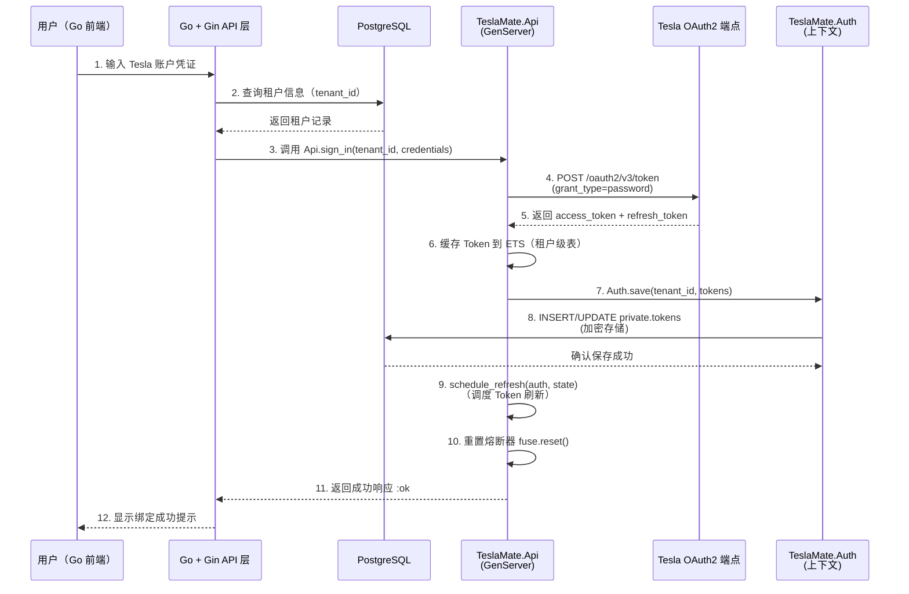
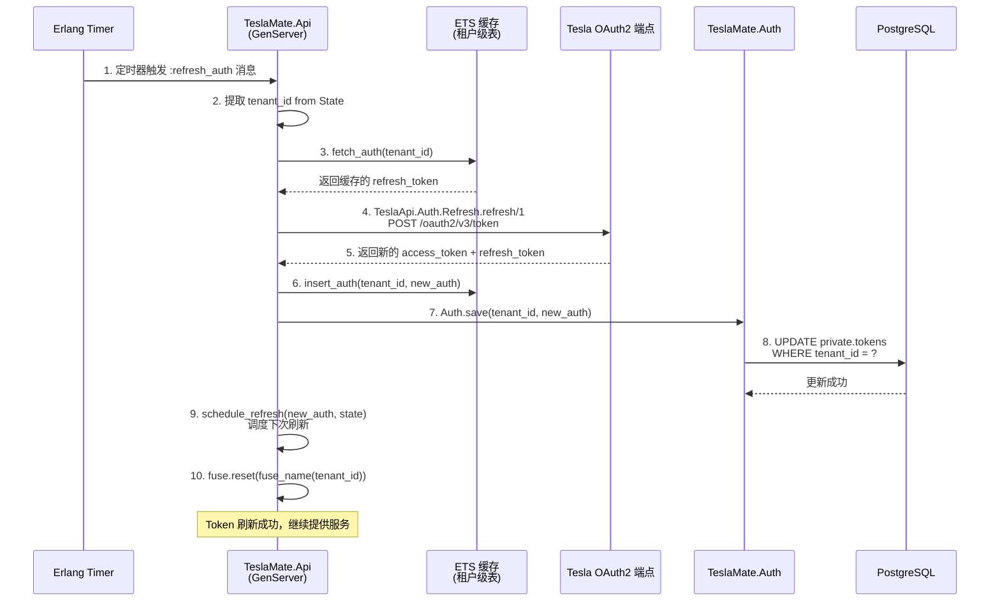
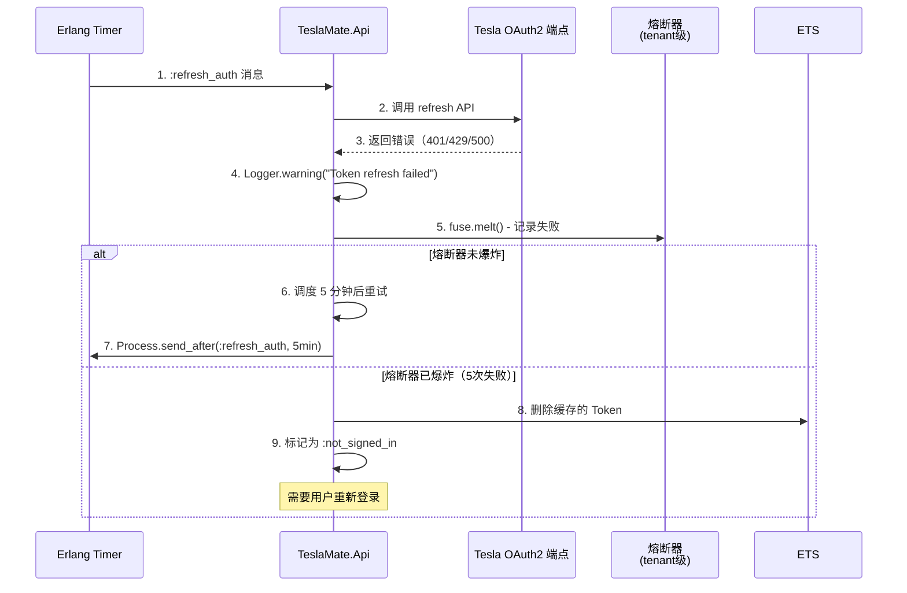
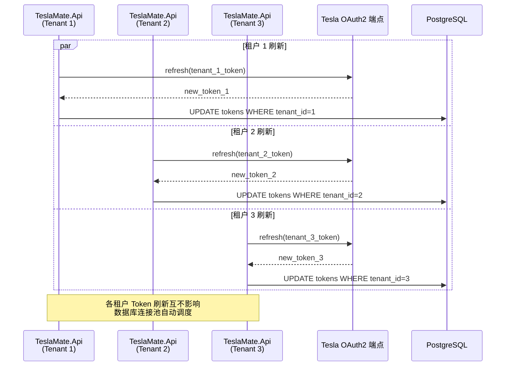
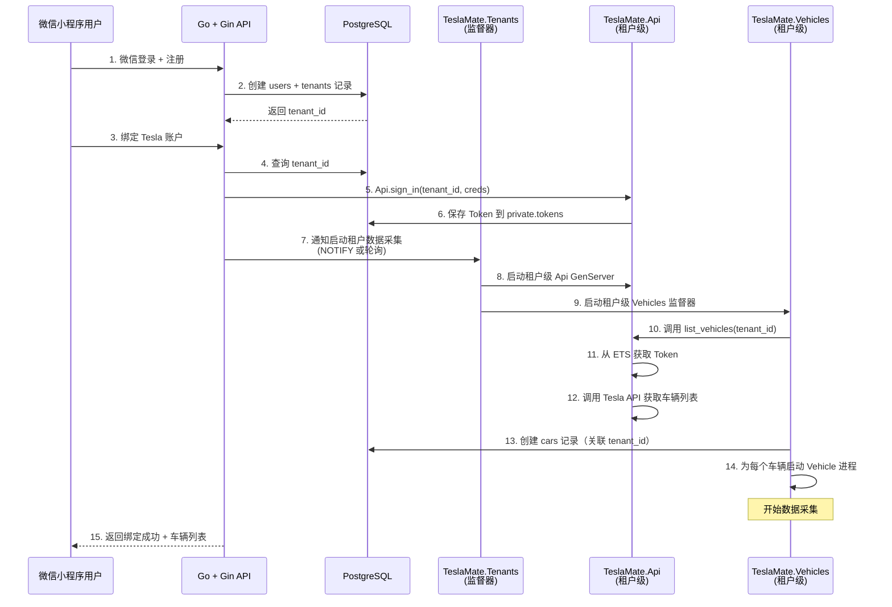

# TeslaMate SaaS 架构改造设计方案

## 设计目标

将 TeslaMate 从单租户数据采集系统改造为支持多租户的数据采集层，配合 Go + Gin 框架的业务 API 层构建完整的 SaaS 平台。改造遵循"最少量修改"原则，确保每一步改造后系统可运行、可测试。

## 架构愿景

### 系统分层架构

| 层级            | 技术栈             | 职责范围                                         |
| --------------- | ------------------ | ------------------------------------------------ |
| **业务 API 层** | Go + Gin           | 用户管理、租户系统、业务 API、权限控制、数据聚合 |
| **数据采集层**  | TeslaMate (Elixir) | Tesla API 集成、车辆数据采集、原始数据存储       |
| **数据存储层**  | PostgreSQL         | 多租户数据隔离、数据持久化                       |

### 租户隔离策略

采用**共享数据库 + 租户标识列**模式：

- 所有租户共享同一个 PostgreSQL 数据库实例
- 核心表增加 `tenant_id` 字段实现数据隔离
- 通过数据库级约束和应用层过滤保证隔离安全性

### 改造边界

**TeslaMate 保留职责：**

- Tesla API 认证与通信
- 车辆数据实时采集
- 原始数据持久化
- 基础监督树与容错机制

**TeslaMate 移除功能：**

- Grafana 仪表板构建与分发（保留数据库兼容性）
- Updater 版本检查
- Web 管理界面（TeslaMateWeb.Endpoint）
- MQTT 消息发布

**TeslaMate 保留功能：**

- Terrain 地形服务 - 提供海拔数据
- Repair 数据修复服务 - 自动修复缺失的地址关联

**Go + Gin 新增职责：**

- 租户注册与管理
- 用户认证与授权
- Tesla 账户绑定管理
- 车辆列表与状态查询
- 数据聚合与统计 API
- 前端界面服务

## 改造阶段规划

### 阶段一：精简 TeslaMate 项目

**目标：** 移除非必要组件，降低资源消耗，保留核心数据采集能力

#### 1.1 移除 Web 界面

**修改文件：** `lib/teslamate/application.ex`

**变更说明：**
在 `children/0` 函数中移除 `TeslaMateWeb.Endpoint` 启动项，该组件包含：

- Phoenix LiveView WebSocket 连接
- 静态资源服务
- Session 管理
- HTTP 路由处理

**影响评估：**

- 不再提供 Web 管理界面访问
- 释放端口 4000 占用
- 减少内存占用约 50-100MB
- 所有管理功能通过 Go API 提供

**环境变量调整：**
无需配置 `PORT`、`VIRTUAL_HOST`、`CHECK_ORIGIN` 等 Web 相关变量

#### 1.2 禁用 MQTT 功能

**修改文件：** `lib/teslamate/application.ex`

**变更说明：**
移除 `TeslaMate.Mqtt` 及 `TeslaMate.Mqtt.PubSub` 启动项，该模块包含：

- Tortoise311 MQTT 客户端连接
- 车辆状态消息发布
- MQTT 订阅管理

**影响评估：**

- 不再向外部 MQTT 代理发布消息
- 需要 MQTT 集成的租户可通过 Go 层实现
- 减少网络连接和 CPU 开销

**环境变量调整：**
可移除 `MQTT_HOST`、`MQTT_PORT`、`MQTT_USERNAME`、`MQTT_PASSWORD` 等配置，或直接设置 `DISABLE_MQTT=true`

#### 1.3 移除版本更新检查器

**修改文件：** `lib/teslamate/application.ex`

**变更说明：**
移除 `TeslaMate.Updater` 启动项，该模块功能：

- 定期查询 GitHub Releases API
- 比对当前版本与最新版本
- 在 Web 界面显示更新提示

**影响评估：**

- 不再进行版本检查
- 减少对 GitHub API 的网络请求
- 简化启动依赖

#### 1.4 保留地形服务

**保留原因：**

- 提供位置海拔数据，增强数据完整性
- 支持地形分析和能耗计算
- SRTM 数据集本地缓存，对外部依赖较少

**多租户适配：**

- 无需特殊改造，所有租户共享地形查询服务
- 按需缓存海拔数据，避免重复查询

#### 1.5 保留数据修复服务

**保留原因：**

- 自动修复历史数据的地址关联
- 提高数据质量和完整性
- 使用熔断器保护外部 API

**多租户适配：**

- 修复任务按租户隔离
- 查询时自动添加 `tenant_id` 过滤条件

#### 1.6 调整后的监督树结构

**最终 children 列表：**

| 组件               | 职责              | 保留原因              |
| ------------------ | ----------------- | --------------------- |
| TeslaMate.Repo     | 数据库连接池      | 核心数据持久化        |
| TeslaMate.Vault    | 加密密钥管理      | Token 加密存储        |
| TeslaMate.HTTP     | Finch HTTP 客户端 | Tesla API 通信        |
| TeslaMate.Api      | Tesla API 管理器  | Token 刷新与 API 调用 |
| Phoenix.PubSub     | 进程间消息总线    | 内部事件通知          |
| TeslaMate.Terrain  | 地形服务          | 海拔数据查询          |
| TeslaMate.Repair   | 数据修复服务      | 地址关联修复          |
| TeslaMate.Vehicles | 车辆监督器        | 核心数据采集逻辑      |

**验证方式：**

- 启动应用后检查 Supervisor 树结构
- 确认车辆进程正常启动
- 观察数据库中数据记录是否持续写入

## 阶段二：OAuth 认证改造（详细设计）

**目标：** 替换原有单一 Token 存储，支持多租户 Tesla 账户管理

### 2.1 数据库表结构调整

**修改文件：** `priv/repo/migrations/YYYYMMDDHHMMSS_add_tenant_id_to_tokens.exs`

**变更说明：**

为 `private.tokens` 表增加租户标识字段，实现 Token 的多租户隔离存储：

**迁移任务：**

1. 为 `private.tokens` 表添加 `tenant_id uuid` 字段（初始允许 NULL）
2. 为现有数据填充默认租户 ID（如果有历史数据）
3. 将 `tenant_id` 设置为 NOT NULL
4. 创建组合索引 `idx_tokens_tenant_id` 提升查询性能
5. 创建唯一约束 `tokens_tenant_id_unique` 确保每个租户只有一条 Token 记录

**表结构定义：**

| 字段名      | 类型      | 约束             | 说明                 |
| ----------- | --------- | ---------------- | -------------------- |
| id          | bigserial | PRIMARY KEY      | 主键（自增）         |
| access      | binary    | NOT NULL         | 加密的 access_token  |
| refresh     | binary    | NOT NULL         | 加密的 refresh_token |
| tenant_id   | uuid      | NOT NULL, UNIQUE | 租户标识（新增）     |
| inserted_at | timestamp | NOT NULL         | 创建时间             |
| updated_at  | timestamp | NOT NULL         | 更新时间             |

**迁移脚本结构示例：**

Ecto Migration 的 `up` 函数实现逻辑：

- 第一步：添加 tenant_id 字段（允许 NULL）
- 第二步：为现有数据填充默认租户 ID（如有需要）
- 第三步：设置为 NOT NULL
- 第四步：创建唯一约束
- 第五步：创建索引

SQL 操作顺序（Ecto Migration 中使用对应的 Elixir 函数）：

```sql
-- 第一步：添加 tenant_id 字段（允许 NULL）
ALTER TABLE private.tokens ADD COLUMN tenant_id uuid;

-- 第二步：为现有数据填充默认租户 ID（如有需要）
-- UPDATE private.tokens SET tenant_id = '<默认租户UUID>' WHERE tenant_id IS NULL;

-- 第三步：设置为 NOT NULL
ALTER TABLE private.tokens ALTER COLUMN tenant_id SET NOT NULL;

-- 第四步：创建唯一约束
CREATE UNIQUE INDEX tokens_tenant_id_unique ON private.tokens (tenant_id);

-- 第五步：创建索引
CREATE INDEX idx_tokens_tenant_id ON private.tokens (tenant_id);
```

**回滚策略：**

提供 `down` 函数删除索引和字段：

```sql
DROP INDEX IF EXISTS tokens_tenant_id_unique;
DROP INDEX IF EXISTS idx_tokens_tenant_id;
ALTER TABLE private.tokens DROP COLUMN IF EXISTS tenant_id;
```

**影响评估：**

- 打破单一 Token 存储限制，支持多个租户同时使用
- 需要修改所有 Token 查询逻辑，添加 `tenant_id` 过滤条件
- 确保历史数据迁移不影响现有系统运行
- 现有单租户环境可通过设置默认 tenant_id 平滑迁移

**数据兼容性处理：**

对于现有单租户部署：

- 在迁移时自动生成一个默认 tenant_id（如 UUID）
- 将现有 Token 记录关联到默认租户
- 系统启动时自动检测并关联历史车辆数据

### 2.2 Elixir Schema 适配

**修改文件：** `lib/teslamate/auth/tokens.ex`

**变更说明：**

调整 `TeslaMate.Auth.Tokens` Schema，增加 `tenant_id` 字段映射：

**Schema 定义调整：**

原有结构：

```elixir
defmodule TeslaMate.Auth.Tokens do
  use Ecto.Schema
  import Ecto.Changeset
  alias TeslaMate.Vault.Encrypted

  @schema_prefix :private

  schema "tokens" do
    field :refresh, Encrypted.Binary, redact: true
    field :access, Encrypted.Binary, redact: true
    timestamps()
  end
end
```

调整后结构：

```elixir
defmodule TeslaMate.Auth.Tokens do
  use Ecto.Schema
  import Ecto.Changeset
  alias TeslaMate.Vault.Encrypted

  @schema_prefix :private

  schema "tokens" do
    field :refresh, Encrypted.Binary, redact: true
    field :access, Encrypted.Binary, redact: true
    field :tenant_id, Ecto.UUID  # 新增租户标识
    timestamps()
  end
end
```

**Changeset 验证调整：**

原有验证：

```elixir
def changeset(tokens, attrs) do
  tokens
  |> cast(attrs, [:access, :refresh])
  |> validate_required([:access, :refresh])
end
```

调整后验证：

```elixir
def changeset(tokens, attrs) do
  tokens
  |> cast(attrs, [:access, :refresh, :tenant_id])  # 添加 tenant_id
  |> validate_required([:access, :refresh, :tenant_id])  # 必填
  |> unique_constraint(:tenant_id, name: :tokens_tenant_id_unique)  # 唯一性约束
end
```

**影响评估：**

- 所有创建和更新 Token 的操作必须提供 `tenant_id`
- Changeset 验证确保数据完整性
- 唯一性约束防止同一租户重复创建 Token
- 加密字段（access、refresh）保持不变，继续使用 `TeslaMate.Vault.Encrypted`

---

**修改文件：** `lib/teslamate/auth.ex`

**变更说明：**

调整 `TeslaMate.Auth` 上下文模块，所有 Token 操作增加租户参数：

**函数签名调整：**

原有函数：

| 函数名                | 原签名                          | 说明         |
| --------------------- | ------------------------------- | ------------ |
| get_tokens/0          | `get_tokens()`                  | 获取 Token   |
| save/1                | `save(%{token, refresh_token})` | 保存 Token   |
| can_decrypt_tokens?/0 | `can_decrypt_tokens?()`         | 验证加密密钥 |

调整后函数：

| 函数名                | 新签名                                     | 说明                   |
| --------------------- | ------------------------------------------ | ---------------------- |
| get_tokens/1          | `get_tokens(tenant_id)`                    | 根据租户 ID 获取 Token |
| save/2                | `save(tenant_id, %{token, refresh_token})` | 保存指定租户的 Token   |
| can_decrypt_tokens?/1 | `can_decrypt_tokens?(tenant_id)`           | 验证租户加密密钥       |

**实现逻辑调整：**

`get_tokens/1` 实现：

```elixir
def get_tokens(tenant_id) do
  from(t in Tokens, where: t.tenant_id == ^tenant_id)
  |> Repo.one()
end
```

说明：

- 查询条件增加 `tenant_id` 过滤
- 使用 `Repo.one()` 确保每个租户最多返回一条记录
- 如果不存在返回 `nil`

`save/2` 实现：

```elixir
def save(tenant_id, %{token: access, refresh_token: refresh}) do
  attrs = %{access: access, refresh: refresh, tenant_id: tenant_id}

  maybe_created_or_updated =
    case get_tokens(tenant_id) do
      nil -> create_tokens(attrs)
      tokens -> update_tokens(tokens, attrs)
    end

  with {:ok, _tokens} <- maybe_created_or_updated do
    :ok
  end
end
```

说明：

- 先根据 `tenant_id` 查询是否已存在 Token
- 不存在则创建新记录，存在则更新现有记录
- 自动处理 Token 的加密存储

`can_decrypt_tokens?/1` 调整：

```elixir
def can_decrypt_tokens?(tenant_id) do
  case get_tokens(tenant_id) do
    %Tokens{} = tokens ->
      is_binary(tokens.access) and is_binary(tokens.refresh)
    nil ->
      true
  end
end
```

说明：

- 验证租户的 Token 是否可以正确解密
- 如果租户没有 Token 记录，返回 `true`（允许首次登录）
- 如果有 Token 但无法解密，返回 `false`（需要重新登录）

**影响评估：**

- 所有调用 `TeslaMate.Auth` 的模块需要传递 `tenant_id` 参数
- 确保 Token 查询和更新始终在租户范围内执行
- 提供了清晰的租户隔离边界
- 兼容现有的加密机制（TeslaMate.Vault）

### 2.3 TeslaMate.Api 模块改造

**修改文件：** `lib/teslamate/api.ex`

**变更说明：**

TeslaMate.Api 是 Tesla OAuth Token 管理的核心 GenServer，需要调整为支持多租户的架构：

**启动参数调整：**

**State 结构体扩展：**

原有 State：

```elixir
defmodule State do
  defstruct [:name, :deps, :refresh_timer]
end
```

调整后 State：

```elixir
defmodule State do
  defstruct [:name, :tenant_id, :deps, :refresh_timer]  # 新增 tenant_id
end
```

说明：

- `tenant_id`：当前 Api 实例服务的租户标识
- `name`：GenServer 注册名称，使用 Registry 动态命名
- `deps`：依赖注入（Auth、Vehicles、Settings 等模块）
- `refresh_timer`：Token 刷新定时器引用

**`start_link/1` 参数调整：**

原有启动：

```elixir
def start_link(opts) do
  GenServer.start_link(__MODULE__, opts, name: Keyword.get(opts, :name, @name))
end
```

调整后启动：

```elixir
def start_link(opts) do
  tenant_id = Keyword.fetch!(opts, :tenant_id)  # 必须提供 tenant_id
  name = Keyword.get(opts, :name, via_tuple(tenant_id))
  GenServer.start_link(__MODULE__, opts, name: name)
end

# 进程命名规则（使用 Registry）
defp via_tuple(tenant_id) do
  {:via, Registry, {TeslaMate.Registry, {__MODULE__, tenant_id}}}
end
```

说明：

- 强制要求启动时提供 `tenant_id`
- 使用 Registry 实现动态进程命名，避免全局名称冲突
- 每个租户拥有独立的 Api GenServer 实例
- 进程名称格式：`{TeslaMate.Api, tenant_id}`

**Token 存储与查询调整：**

**ETS 表结构调整：**

原有 ETS 结构：

- 全局单一 ETS 表，键为 `:auth`
- 无租户隔离

调整后 ETS 结构：

- 每个租户独立的 ETS 表，命名为 `"api_#{tenant_id}"`
- 键仍为 `:auth`，但在租户级别的表中
- 读并发优化保持不变

`insert_auth/2` 调整：

```elixir
defp insert_auth(tenant_id, %Auth{} = auth) do
  table_name = ets_table_name(tenant_id)
  :ets.insert(table_name, {:auth, auth})
end

defp ets_table_name(tenant_id) do
  String.to_atom("api_#{tenant_id}")
end
```

`fetch_auth/1` 调整：

```elixir
defp fetch_auth(tenant_id) do
  table_name = ets_table_name(tenant_id)
  case :ets.lookup(table_name, :auth) do
    [auth: %Auth{} = auth] -> {:ok, auth}
    [] -> {:error, :not_signed_in}
  end
rescue
  _ in ArgumentError -> {:error, :not_signed_in}
end
```

说明：

- 每个租户的 Token 缓存在独立的 ETS 表中
- 避免跨租户 Token 泄露
- 表名使用 atom，需注意 atom 数量限制（租户数量有限时可接受）

**Token 刷新流程调整：**

**`init/1` 回调调整：**

原有逻辑：

```elixir
def init(opts) do
  name = Keyword.get(opts, :name, @name)
  :ets.new(name, [:set, :public, :named_table, read_concurrency: true])

  state = %State{name: name, deps: parse_deps(opts)}

  with {:ok, tokens} <- call(state.deps.auth, :get_tokens),
       {:ok, auth} <- refresh_tokens(tokens) do
    true = insert_auth(name, auth)
    :ok = call(state.deps.auth, :save, [auth])
    {:ok, state} = schedule_refresh(auth, state)
    {:ok, state}
  else
    _ -> {:ok, state}
  end
end
```

调整后逻辑：

```elixir
def init(opts) do
  tenant_id = Keyword.fetch!(opts, :tenant_id)
  name = Keyword.get(opts, :name, via_tuple(tenant_id))

  # 创建租户级别的 ETS 表
  table_name = ets_table_name(tenant_id)
  :ets.new(table_name, [:set, :public, :named_table, read_concurrency: true])

  # 安装租户级熔断器
  :fuse.install(fuse_name(tenant_id), {{:standard, 5, 10_000}, {:reset, :timer.minutes(1)}})

  state = %State{
    name: name,
    tenant_id: tenant_id,
    deps: parse_deps(opts)
  }

  # 使用租户 ID 查询 Token
  with {:ok, tokens} <- call(state.deps.auth, :get_tokens, [tenant_id]),
       {:ok, auth} <- refresh_tokens(tokens) do
    true = insert_auth(tenant_id, auth)
    :ok = call(state.deps.auth, :save, [tenant_id, auth])
    {:ok, state} = schedule_refresh(auth, state)
    :ok = :fuse.reset(fuse_name(tenant_id))
    {:ok, state}
  else
    _ -> {:ok, state}
  end
end
```

说明：

- 从 `opts` 中提取 `tenant_id`
- 创建租户独立的 ETS 表和熔断器
- Token 查询和保存都携带 `tenant_id` 参数
- 初始化时自动刷新 Token（如果存在）

**`handle_info(:refresh_auth, state)` 调整：**

原有刷新逻辑：

```elixir
def handle_info(:refresh_auth, %State{name: name} = state) do
  case fetch_auth(name) do
    {:ok, tokens} ->
      Logger.info("Refreshing access token ...")
      case Auth.refresh(tokens) do
        {:ok, refreshed_tokens} ->
          true = insert_auth(name, refreshed_tokens)
          :ok = call(state.deps.auth, :save, [refreshed_tokens])
          {:ok, state} = schedule_refresh(refreshed_tokens, state)
          :ok = :fuse.reset(fuse_name(name))
          {:noreply, state}
        {:error, reason} ->
          Logger.warning("Token refresh failed: #{inspect(reason)}")
          # 重试逻辑...
      end
  end
end
```

调整后刷新逻辑：

```elixir
def handle_info(:refresh_auth, %State{tenant_id: tenant_id} = state) do
  case fetch_auth(tenant_id) do
    {:ok, tokens} ->
      Logger.info("[Tenant #{tenant_id}] Refreshing access token ...")
      case Auth.refresh(tokens) do
        {:ok, refreshed_tokens} ->
          true = insert_auth(tenant_id, refreshed_tokens)
          :ok = call(state.deps.auth, :save, [tenant_id, refreshed_tokens])
          {:ok, state} = schedule_refresh(refreshed_tokens, state)
          :ok = :fuse.reset(fuse_name(tenant_id))
          {:noreply, state}
        {:error, reason} ->
          Logger.warning("[Tenant #{tenant_id}] Token refresh failed: #{inspect(reason)}")
          Logger.warning("[Tenant #{tenant_id}] Retrying in 5 minutes...")

          if is_reference(state.refresh_timer), do: Process.cancel_timer(state.refresh_timer)
          refresh_timer = Process.send_after(self(), :refresh_auth, :timer.minutes(5))

          {:noreply, %State{state | refresh_timer: refresh_timer}}
      end
    {:error, reason} ->
      Logger.warning("[Tenant #{tenant_id}] Cannot refresh access token: #{inspect(reason)}")
      {:noreply, state}
  end
end
```

说明：

- 日志输出包含 `tenant_id` 便于问题排查
- Token 刷新失败时租户级别重试，不影响其他租户
- 保持原有的重试机制（5 分钟后重试）

**签名接口调整：**

**`sign_in/2` 调整为 `sign_in/2`（参数语义变化）：**

原有接口：

```elixir
def sign_in(name \\ @name, args) do
  GenServer.call(name, {:sign_in, args}, @timeout)
end
```

调整后接口：

```elixir
def sign_in(tenant_id, args) do
  name = via_tuple(tenant_id)
  GenServer.call(name, {:sign_in, args}, @timeout)
end
```

说明：

- 第一个参数从进程名改为 `tenant_id`
- 内部自动查找对应的 GenServer 进程
- 简化调用方逻辑，无需关心进程命名细节

**`list_vehicles/1` 等 API 调用调整：**

原有接口：

```elixir
def list_vehicles(name \\ @name) do
  GenServer.call(name, :list_vehicles, @timeout)
end
```

调整后接口：

```elixir
def list_vehicles(tenant_id) do
  name = via_tuple(tenant_id)
  GenServer.call(name, :list_vehicles, @timeout)
end
```

同样调整的函数：

- `get_vehicle/2` → `get_vehicle(tenant_id, id)`
- `get_vehicle_with_state/2` → `get_vehicle_with_state(tenant_id, id)`
- `signed_in?/1` → `signed_in?(tenant_id)`

**熔断器命名调整：**

租户级别熔断器：

```elixir
defp fuse_name(tenant_id) do
  String.to_atom("api_auth_#{tenant_id}")
end
```

说明：

- 每个租户独立的熔断器
- 一个租户的 API 失败不触发其他租户的熔断
- 熔断器名称使用 atom，需控制租户数量

**影响评估：**

- 每个租户拥有独立的 Api GenServer 实例
- Token 管理完全隔离，一个租户的 Token 失效不影响其他租户
- 熔断器按租户隔离，防止单个租户故障影响全局
- 需要配合租户监督器（阶段三）启动租户级 Api 实例
- 进程数量增加（每个租户一个 Api 进程），需合理控制租户规模

**进程查找与调用调整：**

所有调用 `TeslaMate.Api` 的代码需要使用 `via_tuple(tenant_id)` 查找进程：

```elixir
# 示例：查询车辆列表
def list_vehicles(tenant_id) do
  TeslaMate.Api.list_vehicles(tenant_id)
end

# 内部实现
def list_vehicles(tenant_id) do
  name = via_tuple(tenant_id)
  GenServer.call(name, :list_vehicles, @timeout)
end
```

**验证方式：**

- 启动多个租户的 Api 实例，验证进程独立性
- 测试 Token 刷新时不同租户互不干扰
- 验证熔断器隔离效果
- 测试租户进程崩溃后的自动重启（由租户监督器负责）

### 2.4 认证流程时序

本节通过 Mermaid 时序图描述多租户环境下的 OAuth 认证流程。

**租户首次绑定 Tesla 账户流程：**



**流程说明：**

1. 用户在 Go 前端输入 Tesla 账户凭证（用户名/密码或 refresh_token）
2. Go 服务查询数据库获取当前用户的 `tenant_id`
3. Go 服务调用 TeslaMate GenServer：`Api.sign_in(tenant_id, credentials)`
4. TeslaMate.Api 调用 Tesla OAuth2 端点获取 Token
5. Tesla 返回 `access_token`、`refresh_token` 和过期时间
6. TeslaMate 将 Token 缓存到租户级别的 ETS 表
7. TeslaMate 调用 `TeslaMate.Auth.save/2` 持久化 Token
8. Token 被加密后存储到 `private.tokens` 表，关联 `tenant_id`
9. TeslaMate 调度自动刷新任务（在 Token 过期前 75% 时触发）
10. 重置熔断器，允许后续 API 调用
11. 返回成功响应给 Go 层
12. Go 通知用户绑定成功

**Token 自动刷新流程：**



**流程说明：**

1. TeslaMate.Api 定时器触发 `:refresh_auth` 消息（在 Token 过期前 75% 时）
2. 从 GenServer State 中提取当前租户的 `tenant_id`
3. 从租户级 ETS 表查询缓存的 `refresh_token`
4. 调用 `TeslaApi.Auth.Refresh.refresh/1` 刷新 Token
5. Tesla OAuth2 端点返回新的 `access_token` 和 `refresh_token`
6. 更新租户级 ETS 缓存
7. 调用 `TeslaMate.Auth.save/2` 更新数据库
8. 执行 UPDATE 操作，根据 `tenant_id` 更新加密的 Token
9. 重新调度下次刷新（计算新的过期时间的 75%）
10. 重置租户级熔断器，清除之前的失败记录

**Token 刷新失败重试流程：**



**流程说明：**

1. 定时器触发 Token 刷新
2. 调用 Tesla OAuth2 API 刷新 Token
3. API 返回错误（如 401 未授权、429 速率限制、500 服务器错误）
4. 记录警告日志，包含 `tenant_id` 和错误原因
5. 熔断器记录失败（`fuse.melt()`）
6. 如果熔断器未爆炸（失败次数 < 5），调度 5 分钟后重试
7. 使用 `Process.send_after/3` 发送延迟消息
8. 如果熔断器爆炸（连续 5 次失败），删除 ETS 缓存
9. 将租户状态标记为 `:not_signed_in`，后续 API 调用返回未登录错误

**多租户并发刷新场景：**



**流程说明：**

- 每个租户的 Token 独立管理，互不干扰
- 刷新操作并发执行，利用数据库连接池
- 每个租户的 UPDATE 操作有独立的 `WHERE tenant_id = ?` 条件
- 熔断器按租户隔离，一个租户的失败不影响其他租户
- ETS 缓存按租户分表，避免竞争条件

**与 Go 服务集成的完整流程：**



**流程说明：**

1. 用户通过微信小程序登录
2. Go 服务创建用户和租户记录
3. 用户绑定 Tesla 账户
4. Go 查询用户的 `tenant_id`
5. Go 调用 TeslaMate.Api 进行登录
6. TeslaMate 保存加密的 Token
7. Go 通知 TeslaMate.Tenants 监督器启动租户
8. 监督器为租户启动 Api GenServer
9. 监督器为租户启动 Vehicles 监督器
10. Vehicles 监督器调用 Api 获取车辆列表
11. Api 从 ETS 缓存获取 Token
12. 调用 Tesla API 获取车辆信息
13. 在数据库创建车辆记录，关联 `tenant_id`
14. 为每个车辆启动独立的 Vehicle GenStateMachine
15. Go 返回绑定成功响应

**关键时序特性：**

- Token 刷新与车辆数据采集解耦，互不阻塞
- 租户级别的 GenServer 独立运行，崩溃不影响其他租户
- 使用 ETS 缓存减少数据库查询，提升性能
- 熔断器保护 Tesla API，防止过度调用
- 支持多租户并发操作，利用 BEAM 的并发优势

**安全性考虑：**

- Token 在数据库中加密存储（使用 TeslaMate.Vault）
- ETS 缓存仅在内存中，进程重启后需重新加载
- 每个租户的 Token 完全隔离，无法跨租户访问
- 熔断器防止单个租户的失败导致系统雪崩
- 日志输出包含 `tenant_id`，便于审计和问题排查

---

## 总结

阶段二的 OAuth 认证改造通过以下关键设计实现了多租户支持：

1. **数据库层面**：为 `private.tokens` 表增加 `tenant_id` 字段，实现 Token 的租户级隔离存储
2. **Schema 层面**：调整 Elixir Schema 和 Changeset，确保所有 Token 操作携带租户标识
3. **业务逻辑层面**：改造 TeslaMate.Api GenServer，支持租户级进程实例和独立的 Token 管理
4. **流程保障**：通过时序图明确各组件交互流程，确保 Token 刷新、失败重试和多租户并发的正确性

完成阶段二改造后，系统具备了多租户 Tesla 账户管理能力，为阶段三的租户监督树改造奠定了基础。

### 阶段三：租户监督树改造

**目标：** 引入租户级监督器，实现租户隔离的车辆管理

#### 3.1 新增租户监督器

**新建文件：** `lib/teslamate/tenants.ex`

**职责定义：**

监督器管理：

- 为每个活跃租户启动独立的监督器实例
- 监督器命名规则：`TeslaMate.Tenant.{tenant_id}`
- 采用 `:one_for_one` 策略确保租户隔离

子进程管理：

- 每个租户监督器下启动该租户的 `Vehicles` 监督器
- 租户级别的 `Api` GenServer 实例
- 可选的租户级别缓存或状态管理器

生命周期控制：

- `start_tenant(tenant_id)`: 启动租户监督树
- `stop_tenant(tenant_id)`: 停止租户监督树
- `restart_tenant(tenant_id)`: 重启租户监督树
- `list_tenants()`: 查询所有活跃租户

**监督树层级：**

```
TeslaMate.Supervisor (应用顶级)
├── TeslaMate.Repo
├── TeslaMate.Vault
├── TeslaMate.HTTP
├── Phoenix.PubSub
└── TeslaMate.Tenants (新增租户监督器)
    ├── TeslaMate.Tenant.{tenant_id_1}
    │   ├── TeslaMate.Api (租户级)
    │   └── TeslaMate.Vehicles (租户级)
    │       ├── Vehicle (车辆 1)
    │       ├── Vehicle (车辆 2)
    │       └── ...
    ├── TeslaMate.Tenant.{tenant_id_2}
    │   ├── TeslaMate.Api (租户级)
    │   └── TeslaMate.Vehicles (租户级)
    └── ...
```

#### 3.2 租户监督器实现细节

**init/1 回调：**

租户发现机制：

- 从数据库查询所有包含有效 Tesla 账户的租户
- 查询条件：`token_expiry > now() AND deleted_at IS NULL`
- 或从 Go 服务接收租户列表（通过 API 或共享状态）

子进程规格生成：

- 为每个租户生成 `{TeslaMate.Tenant.Supervisor, tenant_id: tenant_id}` 规格
- 使用动态命名避免进程冲突
- 配置独立的重启策略

**动态租户管理：**

添加租户：

- 接收 Go 服务的通知或定期轮询数据库
- 调用 `Supervisor.start_child/2` 启动新租户监督树
- 验证租户是否已存在，避免重复启动

移除租户：

- 接收租户删除通知
- 调用 `Supervisor.terminate_child/2` 和 `Supervisor.delete_child/2`
- 确保优雅关闭所有子进程

#### 3.3 租户级 Vehicles 监督器改造

**修改文件：** `lib/teslamate/vehicles.ex`

**参数传递：**

启动配置：

- `start_link/1` 接收 `tenant_id` 选项
- 监督器命名：`:"Vehicles_#{tenant_id}"`
- 避免全局命名冲突

**车辆查询逻辑：**

数据源调整：

- `list_vehicles!/0` 改为 `list_vehicles!(tenant_id)`
- 调用 `TeslaMate.Api.list_vehicles(api_name, tenant_id)`
- 回退逻辑查询 `Log.list_cars(tenant_id)`

**车辆创建逻辑：**

租户关联：

- `create_or_update!/2` 接收 `tenant_id` 参数
- 创建 `Car` 记录时设置 `tenant_id` 字段
- 确保车辆与租户的绑定关系

#### 3.4 数据库模式扩展

**核心表增加租户字段：**

**cars 表：**

- 增加 `tenant_id uuid NOT NULL`
- 创建索引 `idx_cars_tenant_id`
- 外键约束关联租户表（由 Go 管理）

**drives 表：**

- 增加 `tenant_id uuid NOT NULL`
- 通过 `car_id` 关联获取租户信息
- 冗余字段便于查询和分区

**charging_processes 表：**

- 增加 `tenant_id uuid NOT NULL`
- 同样冗余租户信息

**positions 表：**

- 增加 `tenant_id uuid NOT NULL`
- 索引优化查询性能

**states 表：**

- 增加 `tenant_id uuid NOT NULL`
- 确保状态数据隔离

**迁移脚本示例：**

迁移任务：

1. 为所有表添加 `tenant_id` 列（允许 NULL）
2. 为现有数据填充默认租户 ID（如果有历史数据）
3. 将 `tenant_id` 设置为 NOT NULL
4. 创建索引和外键约束

Ecto Migration 结构：

- `alter table(:cars)`: 添加 `tenant_id` 字段
- `create index`: 创建租户索引
- `execute`: 执行数据填充 SQL

#### 3.5 租户隔离验证

**查询过滤：**

所有 Ecto 查询添加租户过滤：

- `from(c in Car, where: c.tenant_id == ^tenant_id)`
- 创建通用查询宏简化代码

**进程隔离：**

租户进程独立性测试：

- 一个租户的车辆进程崩溃不影响其他租户
- 租户级监督器重启不影响全局服务
- 内存和资源按租户隔离统计

**性能测试：**

多租户并发场景：

- 模拟 10 个租户同时采集数据
- 验证数据库连接池管理
- 监控 CPU 和内存使用

### 阶段四：Go + Gin 业务层集成

**目标：** 构建完整的 SaaS API 层，实现用户管理、租户系统和数据聚合

#### 4.1 Go 服务职责边界

**用户与租户管理：**

- 用户注册与登录（JWT 认证）
- 租户创建与管理
- 用户与租户关联（多租户 RBAC）
- Tesla 账户绑定流程

**TeslaMate 集成接口：**

- 通过 GenServer 调用 TeslaMate 功能（可选 Port 或 HTTP）
- 或通过共享 PostgreSQL 数据库直接查询
- 租户激活时通知 TeslaMate 启动车辆监控
- 租户停用时通知 TeslaMate 停止监控

**数据查询与聚合：**

- 车辆列表与实时状态查询
- 行程历史与统计分析
- 充电记录与成本计算
- 数据导出与报表生成

**前端服务：**

- RESTful API 或 GraphQL
- WebSocket 实时数据推送
- 前端静态资源服务

#### 4.2 数据库交互模式

**采用方案：共享数据库直接查询**

**实施细节：**

Go 侧数据模型定义：

- 使用 GORM 定义与 TeslaMate Ecto Schema 对应的结构体
- 所有查询必须添加 `tenant_id` WHERE 条件
- 主要用于只读查询，避免与 TeslaMate 写入冲突

数据访问职责划分：

- **TeslaMate（写入侧）**：负责所有实时数据采集和写入操作
- **Go 服务（读取侧）**：负责历史数据查询、聚合和统计

表结构同步策略：

- 使用 Ecto Migration 作为 Schema 变更的唯一来源
- Go 服务定期检查 Schema 版本一致性
- 关键字段变更需要双方同步确认

GORM 模型示例结构：

主要实体映射：

- `Car` 模型：映射 TeslaMate 的 `cars` 表，包含 `tenant_id` 字段
- `Drive` 模型：映射 `drives` 表，关联行程数据
- `ChargingProcess` 模型：映射 `charging_processes` 表
- `Position` 模型：映射 `positions` 表，GPS 轨迹数据
- `State` 模型：映射 `states` 表，车辆状态快照

查询安全性保障：

- 创建 GORM Scope 自动注入租户过滤条件
- 示例：`db.Scopes(TenantScope(tenantID)).Find(&cars)`
- 防止遗漏租户过滤导致数据泄露

性能优化：

- Go 层实现查询结果缓存（Redis）
- 减少对 PostgreSQL 的直接查询压力
- 缓存失效策略：基于时间 TTL 或事件触发

Go 侧与 TeslaMate 数据表映射关系：

| TeslaMate 表       | Go GORM 模型    | 主要用途         |
| ------------------ | --------------- | ---------------- |
| cars               | Car             | 车辆基本信息查询 |
| drives             | Drive           | 行程历史记录     |
| charging_processes | ChargingProcess | 充电记录统计     |
| charges            | Charge          | 充电详细数据点   |
| positions          | Position        | GPS 轨迹查询     |
| states             | State           | 车辆状态快照     |
| addresses          | Address         | 地址信息         |
| geofences          | Geofence        | 地理围栏配置     |

#### 4.3 租户生命周期管理（基于现有数据库结构）

**数据库表关系：**

```
tenants (id: uuid)
  ├── users (tenant_id)
  ├── private.tokens (tenant_id)  # TeslaMate Token 存储
  ├── vehicles (tenant_id)
  └── subscriptions (tenant_id)
```

**说明：** Go 的 `tesla_accounts` 表已删除，统一使用 TeslaMate 的 `private.tokens` 表

**租户注册与创建流程：**

1. 用户通过微信小程序登录：`GET /api/v1/wechat/login`

   - 获取微信 openid 和 session_key
   - 存储到 `miniprograms` 表

2. 用户注册账号：`POST /api/v1/register`

   - 创建 `users` 记录（username, password, tenant_id）
   - 自动创建关联的 `tenants` 记录
   - 初始化默认订阅计划（trial/free）

3. 关联微信账号：
   - 更新 `users.open_id` 字段
   - 建立微信与系统账号的绑定关系

**Tesla 账户绑定流程：**

1. 用户检查是否已绑定：`GET /api/v1/wechat/isTeslaAccountBound`

   - 查询该租户的 `tesla_accounts` 表
   - 返回绑定状态

2. 用户提交 Tesla 凭证：`POST /api/v1/wechat/bound`

   - Go 服务调用 Tesla OAuth API 获取 Token
   - 加密 access_token 和 refresh_token
   - 创建 `tesla_accounts` 记录：
     ```sql
     INSERT INTO tesla_accounts (
       tenant_id,
       encrypted_access_token,
       encrypted_refresh_token,
       token_expiry,
       tesla_account_email
     ) VALUES (...);
     ```

3. Go 服务调用 Tesla API 获取车辆列表

   - 为每个车辆创建 `vehicles` 记录：
     ```sql
     INSERT INTO vehicles (
       tenant_id,
       tesla_account_id,
       tesla_vehicle_id,
       display_name,
       vin,
       collector_status
     ) VALUES (...);
     ```
   - 初始 `collector_status` 为 `pending`

4. Go 通知 TeslaMate 启动数据采集

   - 方式一：TeslaMate 定时扫描 `tesla_accounts` 表
   - 方式二：Go 通过 HTTP 调用 TeslaMate API（需新增）
   - 方式三：通过数据库触发器或通知机制

5. TeslaMate 启动租户车辆监控
   - Tenants 监督器检测到新租户
   - 启动租户级 Api GenServer
   - 启动租户级 Vehicles 监督器
   - 为每个车辆启动 Vehicle 进程
   - 更新 `vehicles.collector_status` 为 `active`

**车辆数据采集状态管理：**

`vehicles.collector_status` 状态流转：

| 状态    | 说明         | 触发条件                   |
| ------- | ------------ | -------------------------- |
| pending | 待启动采集   | 车辆刚创建                 |
| active  | 正在采集数据 | TeslaMate 成功启动车辆进程 |
| paused  | 暂停采集     | 租户主动暂停或订阅到期     |
| error   | 采集异常     | Token 失效或车辆连接失败   |
| stopped | 已停止       | 租户删除车辆或解绑账户     |

**租户订阅管理流程：**

1. 订阅计划配置（`subscriptions` 表）：

   - `plan_name`: free, basic, premium
   - `max_vehicles`: 最大车辆数限制
   - `data_retention_days`: 数据保留天数
   - `status`: Active, Trial, PastDue, Canceled, Expired

2. 订阅状态检查：

   - TeslaMate 启动前检查租户订阅状态
   - 如果 `status != 'Active' AND status != 'Trial'`，拒绝启动
   - 检查车辆数是否超过 `max_vehicles`

3. 订阅过期处理：
   - Go 定时任务检查 `end_date`
   - 过期时更新 `status` 为 `Expired`
   - TeslaMate 自动停止该租户的数据采集
   - 更新 `vehicles.collector_status` 为 `paused`

**租户停用流程：**

1. 管理员或用户删除租户：`DELETE /api/v1/users/:id`

   - 软删除 `users` 记录（设置 `deleted_at`）
   - 软删除关联的 `tenants` 记录

2. Go 服务处理级联操作：

   - 软删除 `tesla_accounts` 记录
   - 软删除 `vehicles` 记录
   - 更新 `subscriptions.status` 为 `Canceled`

3. TeslaMate 监听租户状态：

   - 定期检查 `tenants.deleted_at IS NOT NULL`
   - 或接收 Go 服务的停止通知
   - 停止租户的所有车辆监控进程
   - 清理 ETS 缓存中的租户数据

4. 数据保留策略：
   - 历史数据保留在 TeslaMate 数据库中
   - 根据 `subscriptions.data_retention_days` 定期清理
   - 或在租户重新激活时恢复访问

**租户重新激活流程：**

1. 管理员恢复租户：

   - 清除 `tenants.deleted_at`
   - 清除 `users.deleted_at`
   - 清除 `tesla_accounts.deleted_at`

2. 更新订阅状态：

   - 创建新的 `subscriptions` 记录或更新现有记录
   - 设置 `status` 为 `Active` 或 `Trial`

3. TeslaMate 重启监控：
   - 检测到租户重新激活
   - 验证 Token 有效性（可能需要重新登录）
   - 重启车辆监控进程
   - 更新 `vehicles.collector_status` 为 `active`

**跨服务通信方案（推荐）：**

**方案一：数据库轮询（简单）**

- TeslaMate 定时扫描 `tesla_accounts` 和 `vehicles` 表
- 检测新增记录或状态变化
- 自动启动或停止车辆监控
- 优点：实现简单，无需额外依赖
- 缺点：有延迟（扫描间隔）

**方案二：PostgreSQL NOTIFY/LISTEN（推荐）**

- Go 在插入/更新 `tesla_accounts` 后发送通知
- TeslaMate 监听通知并立即响应
- 优点：实时性好，资源占用少
- 缺点：需要维护 LISTEN 连接

**方案三：HTTP 回调**

- Go 提供配置项指定 TeslaMate 回调 URL
- Tesla 账户绑定成功后调用：`POST http://teslamate:4000/api/internal/tenants/:tenant_id/start`
- TeslaMate 提供内部 API 接收通知
- 优点：明确的触发机制
- 缺点：需要网络可达性，增加接口维护

**推荐实施：** 采用方案一（数据库轮询）+ 方案二（NOTIFY/LISTEN）组合

- 正常情况下使用 NOTIFY 实时触发
- 轮询作为兜底机制，防止通知丢失

#### 4.4 API 设计总结（基于已有接口）

**现有 API 端点：**

**用户认证与注册：**

| 端点             | 方法 | Handler          | 说明                     |
| ---------------- | ---- | ---------------- | ------------------------ |
| /api/v1/login    | POST | auth.Login       | 用户登录（返回 JWT）     |
| /api/v1/register | POST | auth.Register    | 用户注册（自动创建租户） |
| /api/v1/verify   | GET  | auth.VerifyToken | 验证 JWT Token           |

**微信小程序集成：**

| 端点                               | 方法 | Handler                | 说明                    |
| ---------------------------------- | ---- | ---------------------- | ----------------------- |
| /api/v1/wechat/login               | GET  | wechat.WechatLogin     | 微信登录（获取 openid） |
| /api/v1/wechat/isTeslaAccountBound | GET  | wechat.HasTeslaAccount | 检查是否绑定 Tesla 账户 |
| /api/v1/wechat/bound               | POST | tesla.BindTeslaAccount | 绑定 Tesla 账户         |

**用户管理：**

| 端点              | 方法   | Handler         | 说明               |
| ----------------- | ------ | --------------- | ------------------ |
| /api/v1/users/    | POST   | user.Create     | 创建用户           |
| /api/v1/users/    | GET    | user.List       | 查询用户列表       |
| /api/v1/users/:id | GET    | user.GetById    | 获取用户详情       |
| /api/v1/users/:id | PUT    | user.UpdateById | 更新用户信息       |
| /api/v1/users/:id | DELETE | user.DeleteById | 删除用户（软删除） |

**权限管理（Casbin）：**

| 端点                     | 方法 | Handler            | 说明         |
| ------------------------ | ---- | ------------------ | ------------ |
| /api/v1/users/permission | GET  | user.GetPermission | 查询用户权限 |
| /api/v1/users/permission | POST | user.AddPermission | 添加权限     |

**角色管理：**

| 端点                   | 方法   | Handler         | 说明         |
| ---------------------- | ------ | --------------- | ------------ |
| /api/v1/users/role/    | POST   | role.Create     | 创建角色     |
| /api/v1/users/role/    | GET    | role.List       | 查询角色列表 |
| /api/v1/users/role/:id | GET    | role.GetById    | 获取角色详情 |
| /api/v1/users/role/:id | PUT    | role.UpdateById | 更新角色     |
| /api/v1/users/role/:id | DELETE | role.DeleteById | 删除角色     |

**用户组管理：**

| 端点                    | 方法   | Handler          | 说明           |
| ----------------------- | ------ | ---------------- | -------------- |
| /api/v1/users/group/    | POST   | group.Create     | 创建用户组     |
| /api/v1/users/group/    | GET    | group.List       | 查询用户组列表 |
| /api/v1/users/group/:id | GET    | group.GetById    | 获取用户组详情 |
| /api/v1/users/group/:id | PUT    | group.UpdateById | 更新用户组     |
| /api/v1/users/group/:id | DELETE | group.DeleteById | 删除用户组     |

**车辆数据查询（已有示例）：**

| 端点                                     | 方法 | Handler          | 说明             |
| ---------------------------------------- | ---- | ---------------- | ---------------- |
| /api/v1/tenants/:tenant_id/battery_level | GET  | api.batteryLevel | 查询车辆电池电量 |

**需要补充的 API：**

**租户管理 API（建议新增）：**

| 端点                                    | 方法 | 说明         |
| --------------------------------------- | ---- | ------------ |
| /api/v1/tenants/:tenant_id              | GET  | 获取租户详情 |
| /api/v1/tenants/:tenant_id              | PUT  | 更新租户信息 |
| /api/v1/tenants/:tenant_id/subscription | GET  | 查询订阅信息 |
| /api/v1/tenants/:tenant_id/subscription | PUT  | 更新订阅计划 |

**Tesla 账户管理 API（建议新增）：**

| 端点                                                  | 方法   | 说明                  |
| ----------------------------------------------------- | ------ | --------------------- |
| /api/v1/tenants/:tenant_id/tesla-accounts             | GET    | 查询已绑定 Tesla 账户 |
| /api/v1/tenants/:tenant_id/tesla-accounts/:id         | DELETE | 解绑 Tesla 账户       |
| /api/v1/tenants/:tenant_id/tesla-accounts/:id/refresh | POST   | 手动刷新 Token        |

**车辆管理 API（建议新增）：**

| 端点                                              | 方法 | 说明                        |
| ------------------------------------------------- | ---- | --------------------------- |
| /api/v1/tenants/:tenant_id/vehicles               | GET  | 查询租户车辆列表            |
| /api/v1/tenants/:tenant_id/vehicles/:id           | GET  | 获取车辆详情                |
| /api/v1/tenants/:tenant_id/vehicles/:id/status    | GET  | 查询车辆实时状态            |
| /api/v1/tenants/:tenant_id/vehicles/:id/collector | PUT  | 控制数据采集器（启动/暂停） |

**车辆数据查询 API（建议新增）：**

| 端点                                               | 方法 | 说明                     |
| -------------------------------------------------- | ---- | ------------------------ |
| /api/v1/tenants/:tenant_id/vehicles/:id/drives     | GET  | 查询行程记录             |
| /api/v1/tenants/:tenant_id/vehicles/:id/charges    | GET  | 查询充电记录             |
| /api/v1/tenants/:tenant_id/vehicles/:id/positions  | GET  | 查询 GPS 轨迹            |
| /api/v1/tenants/:tenant_id/vehicles/:id/statistics | GET  | 统计数据（里程、能耗等） |
| /api/v1/tenants/:tenant_id/vehicles/:id/efficiency | GET  | 能效分析                 |

**TeslaMate 内部 API（建议新增）：**

| 端点                                    | 方法 | 说明             |
| --------------------------------------- | ---- | ---------------- |
| /api/internal/tenants/:tenant_id/start  | POST | 启动租户数据采集 |
| /api/internal/tenants/:tenant_id/stop   | POST | 停止租户数据采集 |
| /api/internal/tenants/:tenant_id/status | GET  | 查询采集器状态   |

**认证与授权策略：**

1. JWT Token 认证：

   - 所有 `/api/v1/*` 端点需要有效 JWT
   - Token 中包含 `user_id` 和 `tenant_id`

2. 租户隔离：

   - 从 JWT 提取 `tenant_id`
   - URL 中的 `:tenant_id` 必须匹配 JWT 中的租户
   - 非超级管理员不能跨租户访问

3. Casbin 权限控制：

   - 基于角色的访问控制（RBAC）
   - 权限策略存储在 `casbin_rule` 表
   - 支持用户、角色、用户组三层权限模型

4. 内部 API 保护：
   - `/api/internal/*` 端点仅允许内网访问
   - 或使用共享密钥认证（API Key）
   - 防止外部直接调用内部接口

### 阶段五：后续优化与扩展

#### 5.1 性能优化

**数据库连接池：**

- TeslaMate 与 Go 独立连接池
- 根据租户数量动态调整池大小
- 监控连接使用率

**查询优化：**

- 为租户相关查询创建组合索引
- 定期 VACUUM 和 ANALYZE
- 考虑分区表策略（按租户或时间）

**缓存策略：**

- Go 层使用 Redis 缓存热点数据
- TeslaMate 使用 ETS 缓存 Token 和车辆状态
- 设置合理的 TTL 避免脏读

#### 5.2 监控与日志

**TeslaMate 监控：**

- 暴露 Prometheus metrics 端点
- 监控租户进程数量和资源占用
- 告警：Token 刷新失败、车辆监控异常

**Go 服务监控：**

- API 响应时间和错误率
- 数据库查询性能
- 租户活跃度统计

**日志聚合：**

- TeslaMate 日志输出 JSON 格式
- Go 日志统一格式
- 使用 ELK 或类似工具集中收集

#### 5.3 安全加固

**Token 安全：**

- 确保 `ENCRYPTION_KEY` 足够随机且安全存储
- 定期轮换加密密钥（需要重新加密现有 Token）
- 限制 Token 访问权限

**API 安全：**

- 所有 API 启用 HTTPS
- 实施速率限制防止滥用
- 输入验证和 SQL 注入防护

**租户隔离审计：**

- 定期审计数据库查询是否包含租户过滤
- 自动化测试覆盖跨租户访问场景
- 敏感操作记录审计日志

#### 5.4 扩展性考虑

**水平扩展：**

- TeslaMate 可部署多个实例（需要租户分配策略）
- 使用 Erlang Distribution 或 Consul 实现服务发现
- 租户与实例的映射关系持久化

**数据归档：**

- 定期归档历史数据到冷存储
- 保留租户最近 N 个月的热数据
- 提供历史数据查询接口

**多区域部署：**

- 根据租户地理位置就近部署
- 数据复制与同步策略
- 跨区域请求路由

## 技术风险与缓解

### 风险一：租户隔离不彻底

**风险描述：** 代码漏洞导致跨租户数据泄露

**缓解措施：**

- 数据库层面设置行级安全策略（RLS）
- 代码审查强制检查租户过滤
- 自动化测试覆盖隔离场景
- 定期安全审计和渗透测试

### 风险二：性能瓶颈

**风险描述：** 租户数量增长导致数据库或进程管理性能下降

**缓解措施：**

- 设计初期进行压力测试
- 监控系统性能指标
- 预留水平扩展能力
- 合理配置资源限制

### 风险三：迁移数据丢失

**风险描述：** 数据库模式变更或代码改造导致数据丢失

**缓解措施：**

- 每次变更前完整备份数据库
- 在测试环境完整验证迁移脚本
- 提供回滚方案
- 分步迁移，每步可验证

### 风险四：TeslaMate 与 Go 集成复杂度

**风险描述：** 跨语言、跨进程通信增加系统复杂度和故障点

**缓解措施：**

- 优先使用共享数据库模式简化集成
- 明确职责边界，避免循环依赖
- 提供完善的接口文档和示例
- 增加集成测试覆盖

## 实施建议

### 迭代开发原则

**每阶段独立可测：**

- 阶段一完成后确保 TeslaMate 精简版可正常运行
- 阶段二完成后验证多租户 Token 管理
- 阶段三完成后测试租户隔离效果
- 阶段四完成后进行端到端集成测试

**保留回滚能力：**

- 使用 Git 分支管理每个阶段的代码
- 数据库迁移提供 down 脚本
- 关键配置可通过环境变量切换

**渐进式上线：**

- 先在测试环境完整验证
- 小规模灰度发布（少量租户）
- 监控稳定后全量上线

### 测试策略

**单元测试：**

- TeslaMate 核心模块（Api, Vehicles, Tenants）
- Go 业务逻辑（租户管理、数据查询）
- 覆盖率目标 > 80%

**集成测试：**

- TeslaMate 与 Tesla API 交互（使用 Mock）
- Go 与数据库交互
- TeslaMate 与 Go 跨层调用

**端到端测试：**

- 租户创建到数据采集完整流程
- 多租户并发场景
- 故障恢复测试

**性能测试：**

- 模拟 100 个租户同时在线
- 数据库查询响应时间
- 内存和 CPU 使用率

## 交付物清单

### 设计文档

- [ ] 本设计方案文档
- [ ] 数据库 Schema 设计文档（包含 ER 图）
- [ ] API 接口规范文档
- [ ] 部署架构图

### 代码实现

- [ ] TeslaMate 精简版代码（阶段一）
- [ ] 多租户 Token 管理模块（阶段二）
- [ ] 租户监督树实现（阶段三）
- [ ] Go + Gin API 服务代码（阶段四）

### 数据库脚本

- [ ] 表结构迁移脚本（Ecto Migration）
- [ ] 索引创建脚本
- [ ] 数据迁移脚本（如有历史数据）

### 测试用例

- [ ] TeslaMate 单元测试
- [ ] Go 业务逻辑测试
- [ ] 集成测试套件
- [ ] 性能测试脚本

### 部署文档

- [ ] Docker Compose 配置示例
- [ ] Kubernetes 部署 YAML（可选）
- [ ] 环境变量配置说明
- [ ] 运维手册

## 时间估算

| 阶段     | 工作内容       | 预估工时     |
| -------- | -------------- | ------------ |
| 阶段一   | 精简 TeslaMate | 2-3 天       |
| 阶段二   | OAuth 改造     | 5-7 天       |
| 阶段三   | 租户监督树     | 5-7 天       |
| 阶段四   | Go 业务层      | 10-15 天     |
| 阶段五   | 优化与测试     | 5-7 天       |
| **总计** | **全部阶段**   | **27-39 天** |

备注：以上为单人全职开发的预估，实际时间根据团队规模和技能熟练度调整
