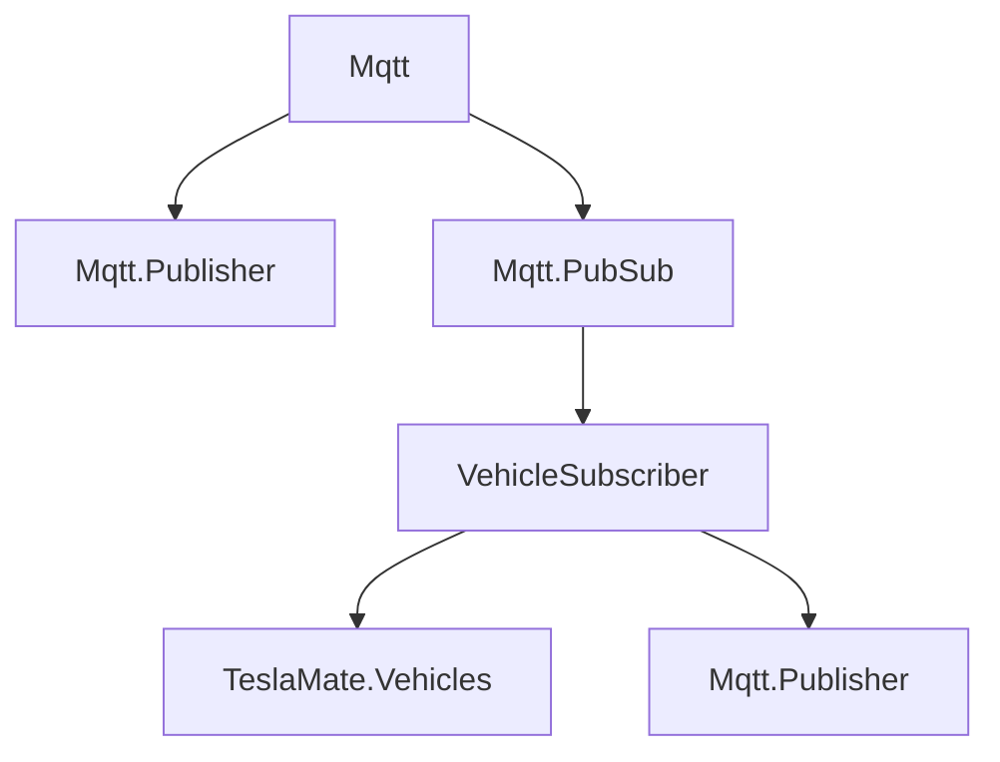
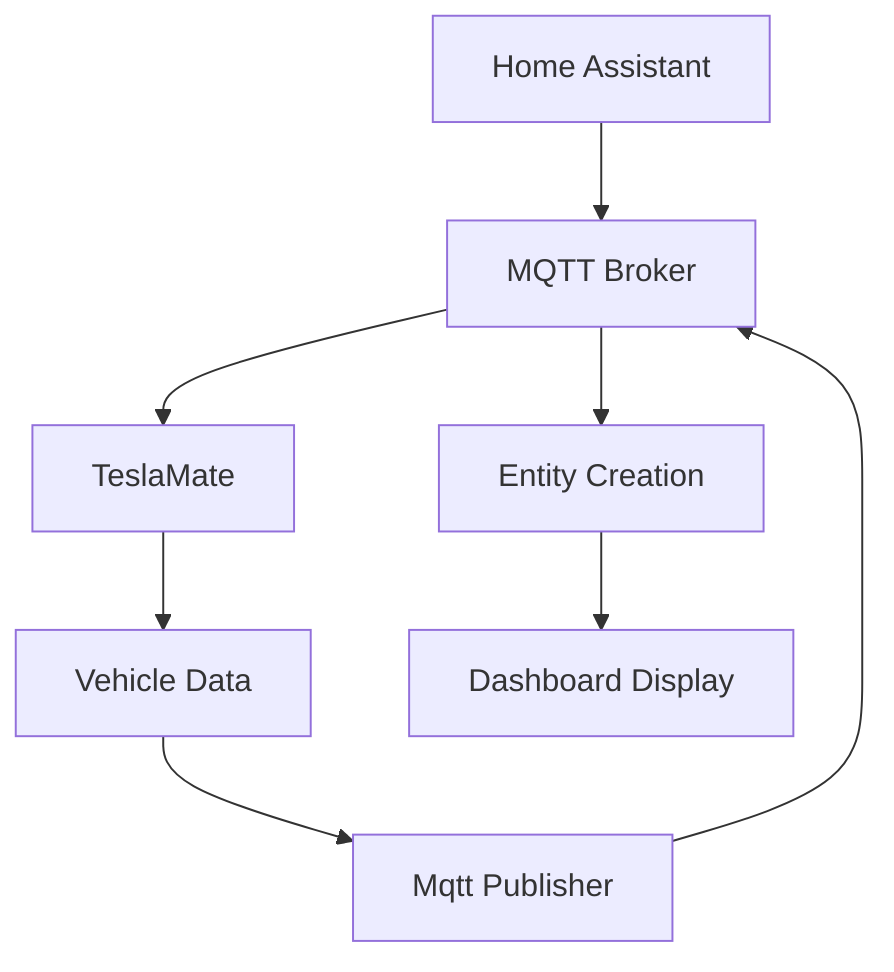
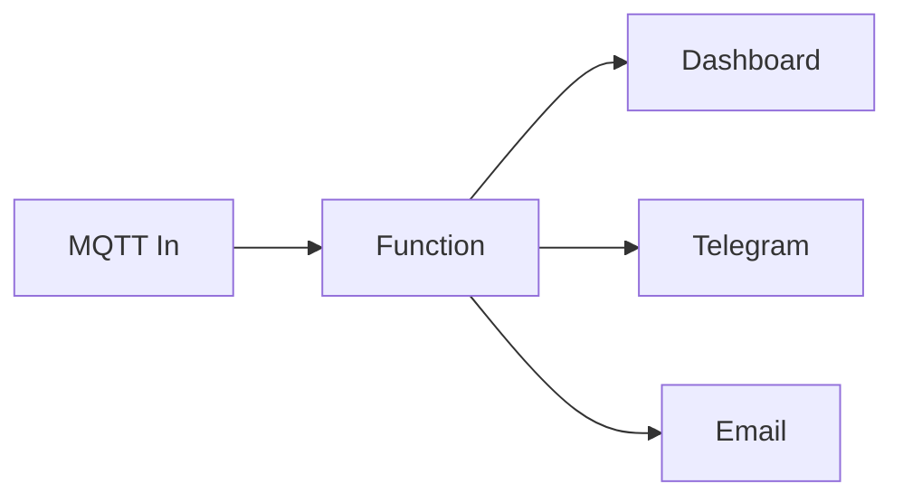
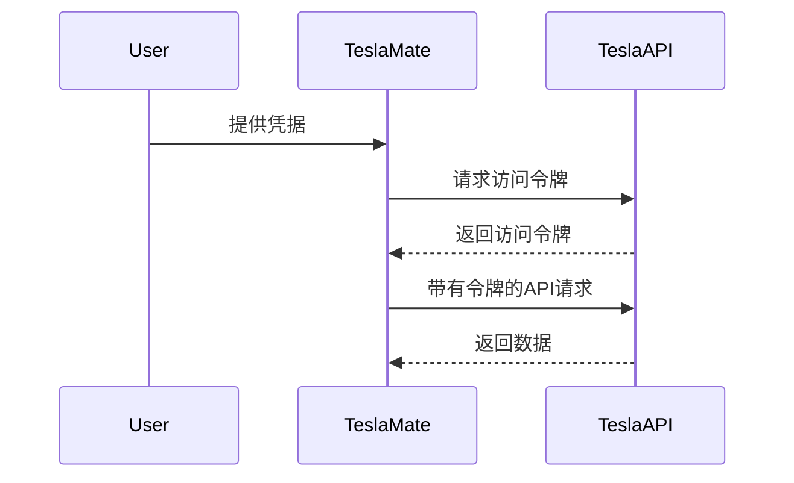

# API与集成

<cite>
**本文档中引用的文件**  
- [mqtt.ex](file://lib/teslamate/mqtt.ex)
- [publisher.ex](file://lib/teslamate/mqtt/publisher.ex)
- [vehicle_subscriber.ex](file://lib/teslamate/mqtt/pubsub/vehicle_subscriber.ex)
- [auth.ex](file://lib/tesla_api/auth.ex)
- [stream.ex](file://lib/tesla_api/stream.ex)
- [config.exs](file://config/config.exs)
- [mqtt.md](file://website/docs/integrations/mqtt.md)
- [home_assistant.md](file://website/docs/integrations/home_assistant.md)
- [Node-RED.md](file://website/docs/integrations/Node-RED.md)
- [environment_variables.md](file://website/docs/configuration/environment_variables.md)
</cite>

## 目录
1. [MQTT接口](#mqtt接口)
2. [Home Assistant集成](#home-assistant集成)
3. [Node-RED集成](#node-red集成)
4. [Tesla API调用机制](#tesla-api调用机制)
5. [客户端实现指南](#客户端实现指南)
6. [调试技巧](#调试技巧)

## MQTT接口

TeslaMate通过MQTT协议将车辆数据发布到MQTT代理，使其他自动化平台能够消费这些数据。MQTT功能在`lib/teslamate/mqtt.ex`模块中实现，该模块使用Tortoise311库建立与MQTT代理的连接。

### MQTT主题结构

车辆数据发布到以`teslamate/cars/$car_id/`为前缀的主题，其中`$car_id`通常是1，但如果有多个车辆则可能不同。主题结构包括车辆状态、驾驶数据和充电事件等信息。



**Diagram sources**
- [mqtt.ex](file://lib/teslamate/mqtt.ex#L1-L65)
- [publisher.ex](file://lib/teslamate/mqtt/publisher.ex#L1-L53)
- [vehicle_subscriber.ex](file://lib/teslamate/mqtt/pubsub/vehicle_subscriber.ex#L1-L217)

**Section sources**
- [mqtt.ex](file://lib/teslamate/mqtt.ex#L1-L65)
- [publisher.ex](file://lib/teslamate/mqtt/publisher.ex#L1-L53)
- [vehicle_subscriber.ex](file://lib/teslamate/mqtt/pubsub/vehicle_subscriber.ex#L1-L217)

### 消息格式和发布频率

车辆数据通过`VehicleSubscriber`进程定期发布，该进程订阅车辆状态摘要并将其转换为MQTT消息。消息格式包括JSON编码的数值和字符串，保留标志根据主题类型设置。

| 主题 | 示例 | 描述 |
| --- | --- | --- |
| `teslamate/cars/$car_id/display_name` | Blue Thunder | 车辆名称 |
| `teslamate/cars/$car_id/state` | asleep | 车辆状态（如`online`、`asleep`、`charging`） |
| `teslamate/cars/$car_id/battery_level` | 88 | 电池电量百分比 |
| `teslamate/cars/$car_id/charging_state` | Charging | 充电状态（充电、断开连接、停止、无电源、完成） |
| `teslamate/cars/$car_id/charge_energy_added` | 5.06 | 最近添加的能量（kWh） |

发布频率取决于车辆状态，当车辆处于驾驶状态时，发布频率更高，以确保实时性。

## Home Assistant集成

TeslaMate与Home Assistant的集成通过MQTT自动发现协议实现，允许Home Assistant自动创建实体并映射到TeslaMate发布的MQTT主题。

### 发现协议和实体映射

Home Assistant通过MQTT发现机制自动创建传感器、二进制传感器和设备追踪器。每个MQTT主题对应一个Home Assistant实体，实体属性在`mqtt_sensors.yaml`配置文件中定义。



**Diagram sources**
- [home_assistant.md](file://website/docs/integrations/home_assistant.md#L1-L800)

**Section sources**
- [home_assistant.md](file://website/docs/integrations/home_assistant.md#L1-L800)

### 配置示例

在Home Assistant的`configuration.yaml`中，通过包含`mqtt_sensors.yaml`文件来配置MQTT传感器。每个传感器定义包括名称、状态主题、设备类和图标。

```yaml
sensor:
  - name: 电池电量
    state_topic: "teslamate/cars/1/battery_level"
    device_class: battery
    unit_of_measurement: "%"
    icon: mdi:battery-80
```

## Node-RED集成

Node-RED集成通过MQTT节点订阅TeslaMate发布的主题，并使用函数节点处理数据，实现复杂的自动化逻辑。

### 最佳实践

Node-RED的最佳实践包括使用`node-red-contrib-calc`节点进行数学计算，`node-red-dashboard`创建仪表板，以及`node-red-contrib-telegrambot`发送通知。



**Diagram sources**
- [Node-RED.md](file://website/docs/integrations/Node-RED.md#L1-L141)

**Section sources**
- [Node-RED.md](file://website/docs/integrations/Node-RED.md#L1-L141)

### 示例流程

示例流程包括一个简单的Node-RED仪表板，显示车辆状态和充电状态面板，以及通知逻辑，用于状态变化、进入/退出地理围栏和充电剩余时间。

## Tesla API调用机制

Tesla API调用机制在`lib/tesla_api.ex`模块中实现，使用Tesla库进行HTTP请求，并通过中间件处理认证和日志记录。

### 认证流程

认证流程使用OAuth 2.0协议，通过`TeslaApi.Auth`模块处理。用户凭据用于获取访问令牌，该令牌在后续API请求中作为Bearer令牌发送。



**Diagram sources**
- [auth.ex](file://lib/tesla_api/auth.ex#L1-L99)
- [stream.ex](file://lib/tesla_api/stream.ex#L1-L272)

**Section sources**
- [auth.ex](file://lib/tesla_api/auth.ex#L1-L99)
- [stream.ex](file://lib/tesla_api/stream.ex#L1-L272)

### 速率限制处理和错误恢复策略

速率限制处理通过配置不同的轮询间隔实现，根据车辆状态（睡眠、充电、驾驶、在线）调整API请求频率。错误恢复策略包括指数退避重试机制，以应对网络问题和API错误。

## 客户端实现指南

客户端实现应遵循MQTT最佳实践，包括使用QoS 1确保消息传递，设置合适的保留标志，以及处理JSON编码的消息。

### 订阅主题

客户端应订阅`teslamate/cars/+/+`以接收所有车辆的所有主题，或订阅特定车辆和主题以减少网络流量。

### 处理消息

消息处理应包括解析JSON有效载荷，更新本地状态，并触发相应的业务逻辑。

## 调试技巧

调试技巧包括启用详细的日志记录，使用MQTT客户端工具（如MQTT Explorer）监视主题，以及检查TeslaMate的日志文件以诊断连接问题。

### 日志级别

在`config/config.exs`中配置日志级别，以获取更详细的调试信息。

```elixir
config :logger, :console,
  format: "$time $metadata[$level] $message\n",
  metadata: [:car_id]
```

**Section sources**
- [config.exs](file://config/config.exs#L1-L30)
- [environment_variables.md](file://website/docs/configuration/environment_variables.md#L1-L62)