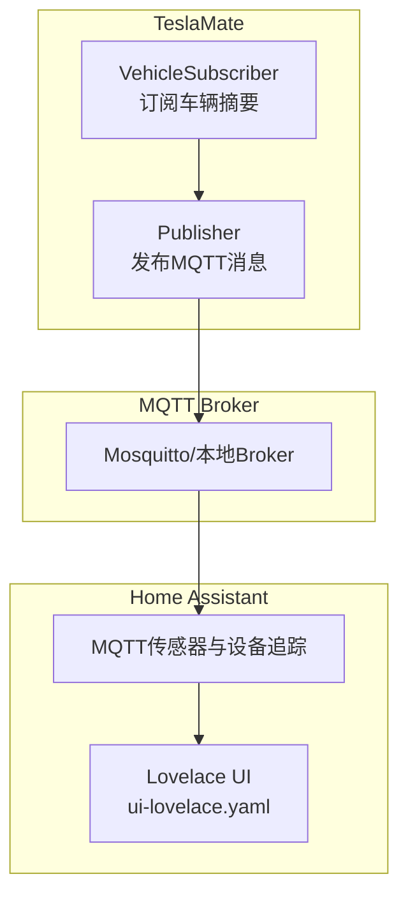
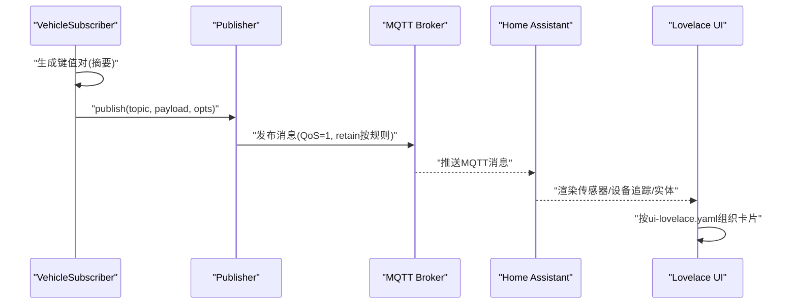
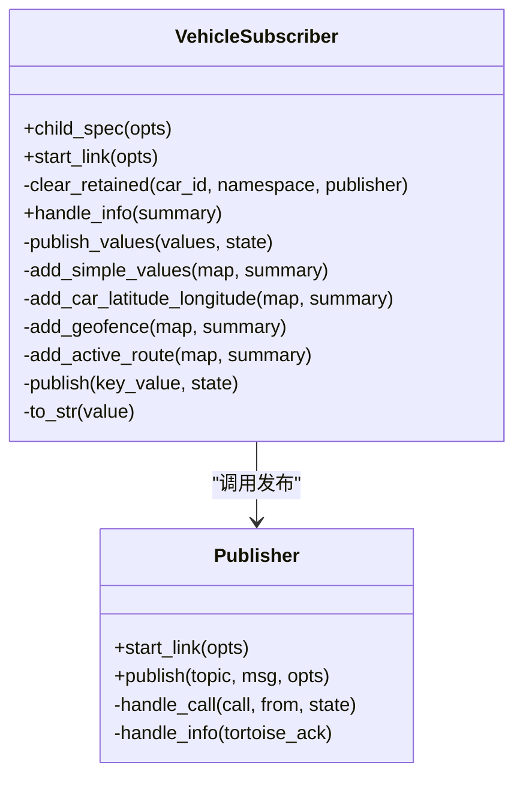
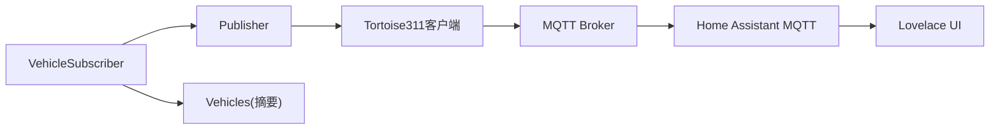

# Lovelace UI配置

<cite>
**本文引用的文件**
- [README.md](file://README.md)
- [website/docs/integrations/home_assistant.md](file://website/docs/integrations/home_assistant.md)
- [website/docs/integrations/mqtt.md](file://website/docs/integrations/mqtt.md)
- [lib/teslamate/mqtt/pubsub/vehicle_subscriber.ex](file://lib/teslamate/mqtt/pubsub/vehicle_subscriber.ex)
- [lib/teslamate/mqtt/publisher.ex](file://lib/teslamate/mqtt/publisher.ex)
- [test/teslamate/mqtt/pubsub/vehicle_subscriber_test.exs](file://test/teslamate/mqtt/pubsub/vehicle_subscriber_test.exs)
- [test/teslamate/vehicles/vehicle_sync_test.exs](file://test/teslamate/vehicles/vehicle_sync_test.exs)
</cite>

## 目录
1. [简介](#简介)
2. [项目结构](#项目结构)
3. [核心组件](#核心组件)
4. [架构总览](#架构总览)
5. [详细组件分析](#详细组件分析)
6. [依赖关系分析](#依赖关系分析)
7. [性能考量](#性能考量)
8. [故障排查指南](#故障排查指南)
9. [结论](#结论)
10. [附录](#附录)

## 简介
本文件面向希望在Home Assistant中使用TeslaMate提供的MQTT数据构建直观车辆状态仪表板的用户。内容基于仓库中的文档与实现细节，系统讲解ui-lovelace.yaml的结构与用法，覆盖垂直堆栈、水平堆栈、概览卡、地图卡、恒温器卡与按钮卡，并结合TeslaMate的MQTT发布机制，给出可直接参考的配置路径与最佳实践。同时提供布局设计建议、响应式与主题适配思路，以及性能优化技巧。

## 项目结构
- TeslaMate通过MQTT向本地Broker发布车辆状态数据，供Home Assistant消费。
- 文档中提供了完整的ui-lovelace.yaml示例，包含视图、卡片与交互按钮的组织方式。
- MQTT主题命名规范清晰，便于在Home Assistant中映射为传感器与设备追踪实体。

图表来源
- [lib/teslamate/mqtt/pubsub/vehicle_subscriber.ex](file://lib/teslamate/mqtt/pubsub/vehicle_subscriber.ex#L62-L102)
- [lib/teslamate/mqtt/publisher.ex](file://lib/teslamate/mqtt/publisher.ex#L20-L52)
- [website/docs/integrations/mqtt.md](file://website/docs/integrations/mqtt.md#L1-L88)
- [website/docs/integrations/home_assistant.md](file://website/docs/integrations/home_assistant.md#L696-L902)

章节来源
- [README.md](file://README.md#L11-L17)
- [website/docs/integrations/mqtt.md](file://website/docs/integrations/mqtt.md#L1-L88)
- [website/docs/integrations/home_assistant.md](file://website/docs/integrations/home_assistant.md#L696-L902)

## 核心组件
- MQTT发布器：负责以指定QoS与保留策略发布消息。
- 车辆订阅器：从车辆摘要生成键值对，过滤并批量发布MQTT消息，避免重复推送。
- Home Assistant MQTT传感器：将MQTT主题映射为实体，供Lovelace使用。
- ui-lovelace.yaml：定义视图与卡片组合，承载仪表板布局与交互。

章节来源
- [lib/teslamate/mqtt/publisher.ex](file://lib/teslamate/mqtt/publisher.ex#L20-L52)
- [lib/teslamate/mqtt/pubsub/vehicle_subscriber.ex](file://lib/teslamate/mqtt/pubsub/vehicle_subscriber.ex#L62-L102)
- [website/docs/integrations/mqtt.md](file://website/docs/integrations/mqtt.md#L1-L88)
- [website/docs/integrations/home_assistant.md](file://website/docs/integrations/home_assistant.md#L696-L902)

## 架构总览
下图展示了从车辆摘要到MQTT再到Home Assistant与Lovelace的整体流程。

图表来源
- [lib/teslamate/mqtt/pubsub/vehicle_subscriber.ex](file://lib/teslamate/mqtt/pubsub/vehicle_subscriber.ex#L62-L102)
- [lib/teslamate/mqtt/publisher.ex](file://lib/teslamate/mqtt/publisher.ex#L20-L52)
- [website/docs/integrations/home_assistant.md](file://website/docs/integrations/home_assistant.md#L696-L902)

## 详细组件分析

### ui-lovelace.yaml结构与卡片类型
- 视图与路径：定义视图路径、标题、图标与卡片集合。
- 垂直堆栈：将多个卡片纵向排列，适合分组展示。
- 水平堆栈：在同一行内横向排列卡片，适合对比或并列控制。
- 概览卡(glance)：紧凑展示多个实体的状态，适合关键指标。
- 地图卡(map)：基于设备追踪实体显示位置与缩放。
- 恒温器卡(thermostat)：绑定气候系统实体，用于温度与模式控制。
- 实体列表(entities)：以列表形式展示大量传感器与二进制传感器。
- 按钮卡(button)：绑定锁实体或二进制传感器，支持点击切换与状态样式。

章节来源
- [website/docs/integrations/home_assistant.md](file://website/docs/integrations/home_assistant.md#L696-L902)

### 卡片使用要点与示例路径
- 垂直堆栈与概览卡：用于聚合电池、状态、插拔、速度等关键信息。
- 水平堆栈与按钮卡：用于充电口门锁与车门锁的交互式控制。
- 地图卡：绑定设备追踪实体，展示当前位置。
- 恒温器卡：绑定气候系统实体，进行温度与模式控制。
- 实体列表：罗列所有可用传感器与二进制传感器，便于查阅。

章节来源
- [website/docs/integrations/home_assistant.md](file://website/docs/integrations/home_assistant.md#L700-L902)

### MQTT主题与实体映射
- 主题命名：teslamate/cars/{car_id}/{key}
- 示例键：状态、时间、健康、版本、模型、外观、轮毂、尾翼、地理围栏、档位、功率、速度、航向、海拔、锁定、哨兵、门窗、驾驶员/乘客门、后备箱/前舱、用户存在、空调、内外温度、预加热、里程、估算/标定/理想续航、电池百分比、可用电池、插拔、充电状态、能耗、充电限制、充电口门、充电电流/相数/功率/电压、计划充电开始时间、剩余充电时长、胎压、主动路线目的地/到达能量/距离/分钟/拥堵延迟、中心显示状态等。
- 设备追踪：位置与活动路线位置，支持JSON属性与在线/离线状态。

章节来源
- [website/docs/integrations/mqtt.md](file://website/docs/integrations/mqtt.md#L1-L88)
- [website/docs/integrations/mqtt.md](file://website/docs/integrations/mqtt.md#L94-L120)

### 交互式按钮与写入操作
- 充电口门锁：通过按钮卡绑定锁实体，点击切换开/关；tap_action调用对应服务。
- 车门锁：同上，绑定车门锁实体。
- 注意：文档明确指出若要写入值（如锁/解锁），需配合官方Tesla集成并设置较高轮询间隔，再通过自动化将MQTT参数回填至Tesla实体。

章节来源
- [website/docs/integrations/home_assistant.md](file://website/docs/integrations/home_assistant.md#L696-L902)

### 数据流与发布策略
- 发布策略：仅在值变化或显式要求时发布；部分键不保留（如healthy）；部分键为空字符串表示“无值”。
- 批量发布：异步并发发布，提升吞吐；失败记录日志。
- 位置与活动路线：位置以JSON字符串发布；活动路线以JSON对象发布，含错误字段。

章节来源
- [lib/teslamate/mqtt/pubsub/vehicle_subscriber.ex](file://lib/teslamate/mqtt/pubsub/vehicle_subscriber.ex#L62-L102)
- [lib/teslamate/mqtt/pubsub/vehicle_subscriber.ex](file://lib/teslamate/mqtt/pubsub/vehicle_subscriber.ex#L104-L216)
- [lib/teslamate/mqtt/publisher.ex](file://lib/teslamate/mqtt/publisher.ex#L20-L52)
- [test/teslamate/mqtt/pubsub/vehicle_subscriber_test.exs](file://test/teslamate/mqtt/pubsub/vehicle_subscriber_test.exs#L1-L115)
- [test/teslamate/vehicles/vehicle_sync_test.exs](file://test/teslamate/vehicles/vehicle_sync_test.exs#L126-L163)

### 类图：MQTT发布与订阅

图表来源
- [lib/teslamate/mqtt/pubsub/vehicle_subscriber.ex](file://lib/teslamate/mqtt/pubsub/vehicle_subscriber.ex#L1-L216)
- [lib/teslamate/mqtt/publisher.ex](file://lib/teslamate/mqtt/publisher.ex#L1-L53)

## 依赖关系分析
- VehicleSubscriber依赖Vehicles模块获取车辆摘要，并依赖Publisher执行发布。
- Publisher依赖Tortoise311客户端，支持QoS与确认回调。
- Home Assistant侧通过MQTT传感器订阅主题，映射为实体。
- ui-lovelace.yaml依赖上述实体，组织为卡片。

图表来源
- [lib/teslamate/mqtt/pubsub/vehicle_subscriber.ex](file://lib/teslamate/mqtt/pubsub/vehicle_subscriber.ex#L41-L55)
- [lib/teslamate/mqtt/publisher.ex](file://lib/teslamate/mqtt/publisher.ex#L20-L52)

章节来源
- [lib/teslamate/mqtt/pubsub/vehicle_subscriber.ex](file://lib/teslamate/mqtt/pubsub/vehicle_subscriber.ex#L41-L55)
- [lib/teslamate/mqtt/publisher.ex](file://lib/teslamate/mqtt/publisher.ex#L20-L52)

## 性能考量
- 异步并发发布：通过并发任务批量发布，减少阻塞，提高吞吐。
- 变化检测：仅在值变化或显式要求时发布，降低冗余消息。
- 不保留键：对不需要持久化的键不保留，避免内存占用与历史干扰。
- QoS与确认：使用QoS 1确保可靠传输，并处理确认回调。
- UI渲染：合理拆分视图与卡片，避免一次性加载过多实体导致卡顿。

章节来源
- [lib/teslamate/mqtt/pubsub/vehicle_subscriber.ex](file://lib/teslamate/mqtt/pubsub/vehicle_subscriber.ex#L62-L102)
- [lib/teslamate/mqtt/publisher.ex](file://lib/teslamate/mqtt/publisher.ex#L20-L52)

## 故障排查指南
- MQTT未收到消息：检查Mosquitto运行状态、网络连通性与主题命名是否一致。
- 实体不更新：确认VehicleSubscriber已启动并订阅摘要；检查Publisher是否成功发布；验证retain策略与QoS设置。
- 按钮无响应：确认绑定的锁实体存在且服务可用；检查tap_action配置与实体ID。
- 写入无效：若需写入值，请参考文档中关于Tesla官方组件与自动化回填的说明。

章节来源
- [website/docs/integrations/home_assistant.md](file://website/docs/integrations/home_assistant.md#L696-L902)
- [test/teslamate/mqtt/pubsub/vehicle_subscriber_test.exs](file://test/teslamate/mqtt/pubsub/vehicle_subscriber_test.exs#L1-L115)
- [test/teslamate/vehicles/vehicle_sync_test.exs](file://test/teslamate/vehicles/vehicle_sync_test.exs#L126-L163)

## 结论
通过TeslaMate的MQTT发布机制与Home Assistant的MQTT传感器映射，可以高效构建一个包含电池、状态、充电、位置、车门/车窗、空调等关键信息的可视化仪表板。ui-lovelace.yaml提供了灵活的布局能力，结合按钮卡与恒温器卡，既能满足读取需求，也能实现有限的交互控制。建议在生产环境中关注发布策略、实体数量与UI渲染性能，确保流畅体验。

## 附录
- 完整ui-lovelace.yaml示例路径：[ui-lovelace.yaml示例](file://website/docs/integrations/home_assistant.md#L700-L902)
- MQTT主题清单与示例：[MQTT主题说明](file://website/docs/integrations/mqtt.md#L1-L88)
- MQTT主题示例payload：[active_route示例](file://website/docs/integrations/mqtt.md#L94-L120)
- 发布器与订阅器实现参考：
  - [Publisher](file://lib/teslamate/mqtt/publisher.ex#L20-L52)
  - [VehicleSubscriber](file://lib/teslamate/mqtt/pubsub/vehicle_subscriber.ex#L62-L102)