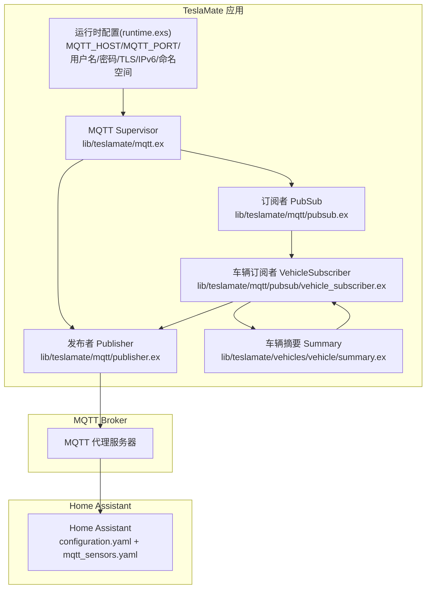
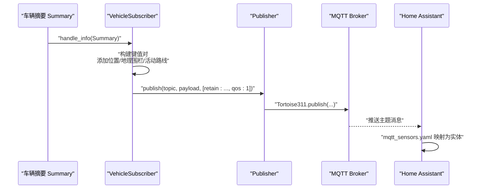
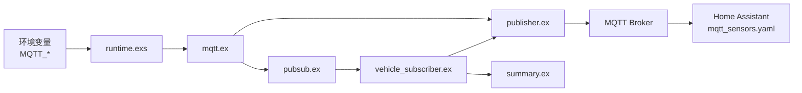

# MQTT传感器配置

<cite>
**本文引用的文件**
- [lib/teslamate/mqtt.ex](file://lib/teslamate/mqtt.ex)
- [lib/teslamate/mqtt/publisher.ex](file://lib/teslamate/mqtt/publisher.ex)
- [lib/teslamate/mqtt/handler.ex](file://lib/teslamate/mqtt/handler.ex)
- [lib/teslamate/mqtt/pubsub.ex](file://lib/teslamate/mqtt/pubsub.ex)
- [lib/teslamate/mqtt/pubsub/vehicle_subscriber.ex](file://lib/teslamate/mqtt/pubsub/vehicle_subscriber.ex)
- [lib/teslamate/vehicles/vehicle/summary.ex](file://lib/teslamate/vehicles/vehicle/summary.ex)
- [config/runtime.exs](file://config/runtime.exs)
- [website/docs/integrations/home_assistant.md](file://website/docs/integrations/home_assistant.md)
- [website/docs/integrations/mqtt.md](file://website/docs/integrations/mqtt.md)
- [website/docs/configuration/environment_variables.md](file://website/docs/configuration/environment_variables.md)
- [test/teslamate/mqtt/pubsub/vehicle_subscriber_test.exs](file://test/teslamate/mqtt/pubsub/vehicle_subscriber_test.exs)
</cite>

## 目录
1. [简介](#简介)
2. [项目结构](#项目结构)
3. [核心组件](#核心组件)
4. [架构总览](#架构总览)
5. [详细组件分析](#详细组件分析)
6. [依赖关系分析](#依赖关系分析)
7. [性能考量](#性能考量)
8. [故障排查指南](#故障排查指南)
9. [结论](#结论)
10. [附录](#附录)

## 简介
本文件面向使用 TeslaMate 的用户，系统性梳理通过 MQTT 向 Home Assistant 提供的车辆状态传感器、二进制传感器与设备追踪器的配置方法。内容覆盖：
- configuration.yaml 与 mqtt_sensors.yaml 的结构与要点
- 实体ID命名规范、设备分组、单位设置、图标选择与 JSON 属性模板的使用
- 完整的 Yaml 配置示例（位置、电池、充电、轮胎压力、气候、活动路线等）
- 使用 device_tracker 与 json_attributes_topic 获取位置与活动路线
- 调试技巧、常见问题排查与多车环境注意事项

## 项目结构
TeslaMate 的 MQTT 发布流程由运行时配置驱动，按车辆生成订阅者并发布到统一的主题空间。关键路径如下：
- 运行时配置：MQTT 主机、端口、用户名、密码、TLS、IPv6、命名空间等
- MQTT 子系统：连接、发布、订阅管理
- 车辆摘要：聚合车辆状态并转换为可发布的键值对
- Home Assistant 集成：通过 mqtt_sensors.yaml 将 MQTT 主题映射为传感器、二进制传感器与设备追踪器

图表来源
- [config/runtime.exs](file://config/runtime.exs#L168-L178)
- [lib/teslamate/mqtt.ex](file://lib/teslamate/mqtt.ex#L8-L23)
- [lib/teslamate/mqtt/publisher.ex](file://lib/teslamate/mqtt/publisher.ex#L16-L23)
- [lib/teslamate/mqtt/pubsub.ex](file://lib/teslamate/mqtt/pubsub.ex#L9-L21)
- [lib/teslamate/mqtt/pubsub/vehicle_subscriber.ex](file://lib/teslamate/mqtt/pubsub/vehicle_subscriber.ex#L14-L21)
- [lib/teslamate/vehicles/vehicle/summary.ex](file://lib/teslamate/vehicles/vehicle/summary.ex#L1-L251)

章节来源
- [config/runtime.exs](file://config/runtime.exs#L168-L178)
- [lib/teslamate/mqtt.ex](file://lib/teslamate/mqtt.ex#L8-L23)
- [lib/teslamate/mqtt/publisher.ex](file://lib/teslamate/mqtt/publisher.ex#L16-L23)
- [lib/teslamate/mqtt/pubsub.ex](file://lib/teslamate/mqtt/pubsub.ex#L9-L21)
- [lib/teslamate/mqtt/pubsub/vehicle_subscriber.ex](file://lib/teslamate/mqtt/pubsub/vehicle_subscriber.ex#L14-L21)
- [lib/teslamate/vehicles/vehicle/summary.ex](file://lib/teslamate/vehicles/vehicle/summary.ex#L1-L251)

## 核心组件
- 运行时配置（runtime.exs）：读取环境变量，启用或禁用 MQTT，并设置主机、端口、认证、TLS、IPv6、命名空间等参数。
- MQTT Supervisor（mqtt.ex）：启动连接、发布者与订阅者子系统。
- 发布者（publisher.ex）：封装 Tortoise311 发布调用，支持 QoS 与超时。
- 订阅者管理（pubsub.ex）：按车辆实例化订阅者。
- 车辆订阅者（vehicle_subscriber.ex）：订阅车辆摘要，构建键值对，发布到 MQTT 主题；处理保留消息清理与增量发布。
- 车辆摘要（summary.ex）：从 Tesla API 结构抽取字段，标准化为统一的摘要结构。

章节来源
- [config/runtime.exs](file://config/runtime.exs#L168-L178)
- [lib/teslamate/mqtt.ex](file://lib/teslamate/mqtt.ex#L8-L23)
- [lib/teslamate/mqtt/publisher.ex](file://lib/teslamate/mqtt/publisher.ex#L16-L23)
- [lib/teslamate/mqtt/pubsub.ex](file://lib/teslamate/mqtt/pubsub.ex#L9-L21)
- [lib/teslamate/mqtt/pubsub/vehicle_subscriber.ex](file://lib/teslamate/mqtt/pubsub/vehicle_subscriber.ex#L41-L55)
- [lib/teslamate/vehicles/vehicle/summary.ex](file://lib/teslamate/vehicles/vehicle/summary.ex#L1-L251)

## 架构总览
下图展示从车辆摘要到 MQTT 发布再到 Home Assistant 的消费链路：

图表来源
- [lib/teslamate/mqtt/pubsub/vehicle_subscriber.ex](file://lib/teslamate/mqtt/pubsub/vehicle_subscriber.ex#L62-L102)
- [lib/teslamate/mqtt/publisher.ex](file://lib/teslamate/mqtt/publisher.ex#L31-L44)
- [website/docs/integrations/home_assistant.md](file://website/docs/integrations/home_assistant.md#L30-L55)

章节来源
- [lib/teslamate/mqtt/pubsub/vehicle_subscriber.ex](file://lib/teslamate/mqtt/pubsub/vehicle_subscriber.ex#L62-L102)
- [lib/teslamate/mqtt/publisher.ex](file://lib/teslamate/mqtt/publisher.ex#L31-L44)
- [website/docs/integrations/home_assistant.md](file://website/docs/integrations/home_assistant.md#L30-L55)

## 详细组件分析

### MQTT 主题与实体映射
- 主题前缀与命名空间
  - 默认主题前缀为 teslamate/cars/$car_id/...
  - 可通过 MQTT_NAMESPACE 设置自定义命名空间，如 teslamate/{namespace}/cars/$car_id/...
- 位置与活动路线
  - 位置：teslamate/cars/$car_id/location（JSON 字符串，包含 latitude/longitude）
  - 活动路线：teslamate/cars/$car_id/active_route（JSON 字符串，包含 destination、location、minutes_to_arrival、miles_to_arrival、energy_at_arrival、traffic_minutes_delay 或 error）
- 常用传感器键
  - 电池：battery_level、usable_battery_level、charge_limit_soc、charge_energy_added
  - 充电：plugged_in、charging_state、charger_power、charger_actual_current、charger_voltage、time_to_full_charge、scheduled_charging_start_time
  - 轮胎压力：tpms_pressure_fl/fr/rl/rr（bar）、tpms_soft_warning_fl/fr/rl/rr
  - 气候：inside_temp、outside_temp、is_climate_on、is_preconditioning、climate_keeper_mode
  - 其他：speed、heading、odometer、est_battery_range_km、rated_battery_range_km、ideal_battery_range_km、power、elevation、windows_open、doors_open、trunk_open、frunk_open、locked、sentry_mode、is_user_present、shift_state、version、update_available、update_version、geofence、model、trim_badging、exterior_color、wheel_type、spoiler_type、center_display_state

章节来源
- [website/docs/integrations/mqtt.md](file://website/docs/integrations/mqtt.md#L12-L89)
- [website/docs/integrations/mqtt.md](file://website/docs/integrations/mqtt.md#L94-L120)
- [lib/teslamate/mqtt/pubsub/vehicle_subscriber.ex](file://lib/teslamate/mqtt/pubsub/vehicle_subscriber.ex#L104-L116)
- [lib/teslamate/mqtt/pubsub/vehicle_subscriber.ex](file://lib/teslamate/mqtt/pubsub/vehicle_subscriber.ex#L121-L144)
- [lib/teslamate/mqtt/pubsub/vehicle_subscriber.ex](file://lib/teslamate/mqtt/pubsub/vehicle_subscriber.ex#L146-L199)
- [lib/teslamate/vehicles/vehicle/summary.ex](file://lib/teslamate/vehicles/vehicle/summary.ex#L1-L251)

### Home Assistant 配置要点
- configuration.yaml
  - 引入 mqtt_sensors.yaml
  - 可选：proximity 组件用于计算设备追踪器到区域的距离
- mqtt_sensors.yaml
  - 设备信息：identifiers、configuration_url、manufacturer、model、name
  - 传感器：state_topic、device_class、unit_of_measurement、icon
  - 二进制传感器：state_topic、payload_on/off
  - 设备追踪器：json_attributes_topic、availability/value_template、json_attributes_template
  - 实体ID命名：建议使用 sensor.tesla_*、binary_sensor.tesla_*、device_tracker.tesla_*，unique_id 用于设备分组与内部唯一标识

章节来源
- [website/docs/integrations/home_assistant.md](file://website/docs/integrations/home_assistant.md#L30-L55)
- [website/docs/integrations/home_assistant.md](file://website/docs/integrations/home_assistant.md#L60-L98)
- [website/docs/integrations/home_assistant.md](file://website/docs/integrations/home_assistant.md#L99-L694)

### 位置与活动路线的配置
- 位置追踪
  - 使用 device_tracker 并将 json_attributes_topic 指向 teslamate/cars/$car_id/location
  - 该主题为 JSON 字符串，包含 latitude/longitude
- 活动路线追踪
  - 使用 device_tracker 并将 json_attributes_topic 指向 teslamate/cars/$car_id/active_route
  - 使用 availability/value_template 判断在线/离线
  - 使用 json_attributes_template 仅在有目的地且 location 存在时注入位置 JSON

章节来源
- [website/docs/integrations/home_assistant.md](file://website/docs/integrations/home_assistant.md#L74-L98)
- [website/docs/integrations/home_assistant.md](file://website/docs/integrations/home_assistant.md#L82-L98)
- [website/docs/integrations/mqtt.md](file://website/docs/integrations/mqtt.md#L30-L33)
- [website/docs/integrations/mqtt.md](file://website/docs/integrations/mqtt.md#L84-L89)

### 传感器与二进制传感器的配置示例
- 传感器（示例要点）
  - state_topic 指向对应键
  - device_class 与 unit_of_measurement 用于仪表盘与统计
  - icon 选择直观图标
- 二进制传感器（示例要点）
  - state_topic 指向布尔或字符串状态
  - payload_on/payload_off 明确开/关语义
- 位置与活动路线
  - device_tracker 使用 json_attributes_topic 与 availability/value_template
  - json_attributes_template 仅在有目的地时注入 location

章节来源
- [website/docs/integrations/home_assistant.md](file://website/docs/integrations/home_assistant.md#L99-L694)

### MQTT 发布策略与保留消息
- 保留策略
  - 对于可能为空的键（如充电相关字段），首次发布空字符串并保留，确保客户端首次接入能收到“无值”状态
  - 对于健康状态等不应保留的键，发布空载并保留，以清理历史保留消息
- 增量发布
  - 仅在值变化或显式要求时发布，减少冗余消息
- QoS 与超时
  - 发布默认 QoS=1，超时控制保障可靠性

章节来源
- [lib/teslamate/mqtt/pubsub/vehicle_subscriber.ex](file://lib/teslamate/mqtt/pubsub/vehicle_subscriber.ex#L25-L39)
- [lib/teslamate/mqtt/pubsub/vehicle_subscriber.ex](file://lib/teslamate/mqtt/pubsub/vehicle_subscriber.ex#L74-L102)
- [lib/teslamate/mqtt/publisher.ex](file://lib/teslamate/mqtt/publisher.ex#L31-L44)

### 多车环境配置
- 车辆ID
  - 主题中的 $car_id 通常从 1 开始，需根据实际车辆ID调整
- 命名空间
  - 通过 MQTT_NAMESPACE 设置自定义命名空间，避免多账户或多实例冲突
- 测试验证
  - 单元测试覆盖了命名空间、保留策略与增量发布行为

章节来源
- [website/docs/integrations/mqtt.md](file://website/docs/integrations/mqtt.md#L90-L93)
- [config/runtime.exs](file://config/runtime.exs#L168-L178)
- [test/teslamate/mqtt/pubsub/vehicle_subscriber_test.exs](file://test/teslamate/mqtt/pubsub/vehicle_subscriber_test.exs#L240-L307)

## 依赖关系分析
- 运行时配置依赖环境变量，MQTT 功能可通过 DISABLE_MQTT 关闭
- MQTT 子系统依赖 Tortoise311 连接与发布
- 车辆订阅者依赖 Vehicles 服务与 Publisher
- Home Assistant 依赖 mqtt_sensors.yaml 的实体映射

图表来源
- [config/runtime.exs](file://config/runtime.exs#L168-L178)
- [lib/teslamate/mqtt.ex](file://lib/teslamate/mqtt.ex#L8-L23)
- [lib/teslamate/mqtt/publisher.ex](file://lib/teslamate/mqtt/publisher.ex#L16-L23)
- [lib/teslamate/mqtt/pubsub.ex](file://lib/teslamate/mqtt/pubsub.ex#L9-L21)
- [lib/teslamate/mqtt/pubsub/vehicle_subscriber.ex](file://lib/teslamate/mqtt/pubsub/vehicle_subscriber.ex#L41-L55)
- [lib/teslamate/vehicles/vehicle/summary.ex](file://lib/teslamate/vehicles/vehicle/summary.ex#L1-L251)

章节来源
- [config/runtime.exs](file://config/runtime.exs#L168-L178)
- [lib/teslamate/mqtt.ex](file://lib/teslamate/mqtt.ex#L8-L23)
- [lib/teslamate/mqtt/publisher.ex](file://lib/teslamate/mqtt/publisher.ex#L16-L23)
- [lib/teslamate/mqtt/pubsub.ex](file://lib/teslamate/mqtt/pubsub.ex#L9-L21)
- [lib/teslamate/mqtt/pubsub/vehicle_subscriber.ex](file://lib/teslamate/mqtt/pubsub/vehicle_subscriber.ex#L41-L55)
- [lib/teslamate/vehicles/vehicle/summary.ex](file://lib/teslamate/vehicles/vehicle/summary.ex#L1-L251)

## 性能考量
- 发布频率与增量发布：仅在值变化或显式要求时发布，降低网络与存储压力
- QoS 与超时：QoS=1 提升可靠性，超时控制避免阻塞
- 保留策略：对可能为空的键保留空值，避免客户端等待过久
- 多车并发：按车实例化订阅者，异步发布，限制并发度以平衡吞吐与资源

[本节为通用指导，不直接分析具体文件]

## 故障排查指南
- MQTT 连接问题
  - 检查 MQTT_HOST、MQTT_PORT、MQTT_USERNAME、MQTT_PASSWORD、MQTT_TLS、MQTT_IPV6 是否正确
  - 查看连接回调日志输出
- 主题未出现
  - 确认 DISABLE_MQTT 未设为 true
  - 确认车辆已在线并产生摘要
  - 检查命名空间是否一致
- 位置与活动路线异常
  - 确认 json_attributes_topic 指向正确主题
  - 检查 availability/value_template 与 json_attributes_template 的 Jinja 表达式
- 多车冲突
  - 使用 MQTT_NAMESPACE 区分不同账户或实例
  - 确保每辆车的 entity_id 与 unique_id 不重复

章节来源
- [config/runtime.exs](file://config/runtime.exs#L168-L178)
- [lib/teslamate/mqtt/handler.ex](file://lib/teslamate/mqtt/handler.ex#L6-L27)
- [website/docs/integrations/home_assistant.md](file://website/docs/integrations/home_assistant.md#L30-L55)
- [website/docs/integrations/home_assistant.md](file://website/docs/integrations/home_assistant.md#L74-L98)
- [website/docs/integrations/home_assistant.md](file://website/docs/integrations/home_assistant.md#L82-L98)

## 结论
通过 MQTT，TeslaMate 能够将丰富的车辆状态以标准化主题发布至 Home Assistant。遵循本文档的配置要点（命名空间、实体ID、单位与图标、JSON 属性模板、保留策略与增量发布），可在 Home Assistant 中获得稳定、直观且可扩展的车辆监控体验。多车与多账户场景下，合理使用命名空间与 unique_id 是避免冲突的关键。

[本节为总结，不直接分析具体文件]

## 附录

### 配置文件结构与要点
- configuration.yaml
  - 引入 mqtt_sensors.yaml
  - 可选：proximity 组件用于位置接近度计算
- mqtt_sensors.yaml
  - 设备信息：identifiers、configuration_url、manufacturer、model、name
  - 传感器：state_topic、device_class、unit_of_measurement、icon
  - 二进制传感器：state_topic、payload_on/off
  - 设备追踪器：json_attributes_topic、availability/value_template、json_attributes_template

章节来源
- [website/docs/integrations/home_assistant.md](file://website/docs/integrations/home_assistant.md#L30-L55)
- [website/docs/integrations/home_assistant.md](file://website/docs/integrations/home_assistant.md#L60-L98)
- [website/docs/integrations/home_assistant.md](file://website/docs/integrations/home_assistant.md#L99-L694)

### 主题与键参考
- 位置与活动路线
  - location：JSON（latitude/longitude）
  - active_route：JSON（destination/location/minutes_to_arrival/miles_to_arrival/energy_at_arrival/traffic_minutes_delay 或 error）
- 电池与充电
  - battery_level、usable_battery_level、charge_limit_soc、charge_energy_added、plugged_in、charging_state、charger_power、charger_actual_current、charger_voltage、time_to_full_charge、scheduled_charging_start_time
- 轮胎压力
  - tpms_pressure_fl/fr/rl/rr（bar）、tpms_soft_warning_fl/fr/rl/rr
- 气候与环境
  - inside_temp、outside_temp、is_climate_on、is_preconditioning、climate_keeper_mode、elevation、power
- 车门与状态
  - windows_open、doors_open、trunk_open、frunk_open、locked、sentry_mode、is_user_present、shift_state、geofence、version、update_available、update_version、model、trim_badging、exterior_color、wheel_type、spoiler_type、center_display_state

章节来源
- [website/docs/integrations/mqtt.md](file://website/docs/integrations/mqtt.md#L12-L89)
- [website/docs/integrations/mqtt.md](file://website/docs/integrations/mqtt.md#L94-L120)
- [lib/teslamate/mqtt/pubsub/vehicle_subscriber.ex](file://lib/teslamate/mqtt/pubsub/vehicle_subscriber.ex#L104-L116)
- [lib/teslamate/mqtt/pubsub/vehicle_subscriber.ex](file://lib/teslamate/mqtt/pubsub/vehicle_subscriber.ex#L121-L144)
- [lib/teslamate/mqtt/pubsub/vehicle_subscriber.ex](file://lib/teslamate/mqtt/pubsub/vehicle_subscriber.ex#L146-L199)
- [lib/teslamate/vehicles/vehicle/summary.ex](file://lib/teslamate/vehicles/vehicle/summary.ex#L1-L251)

### 环境变量与运行时配置
- MQTT 相关
  - MQTT_HOST、MQTT_PORT、MQTT_USERNAME、MQTT_PASSWORD、MQTT_TLS、MQTT_TLS_ACCEPT_INVALID_CERTS、MQTT_IPV6、MQTT_NAMESPACE
- 其他
  - DISABLE_MQTT、DEFAULT_GEOFENCE

章节来源
- [website/docs/configuration/environment_variables.md](file://website/docs/configuration/environment_variables.md#L29-L41)
- [config/runtime.exs](file://config/runtime.exs#L168-L178)