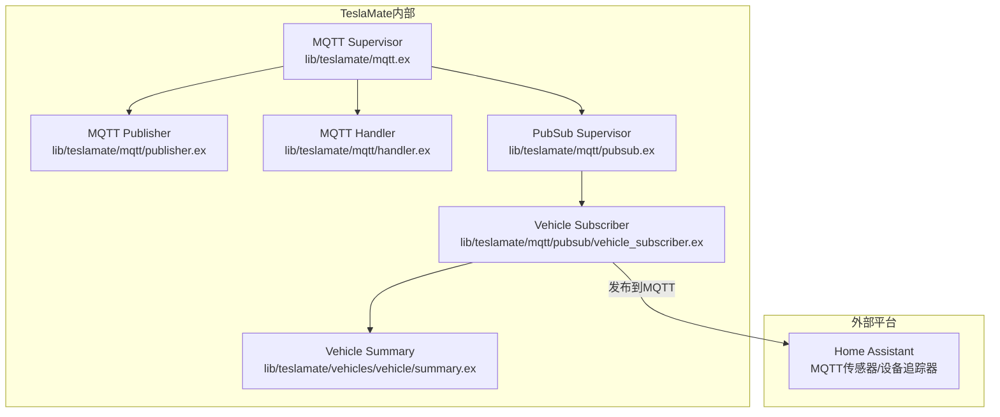
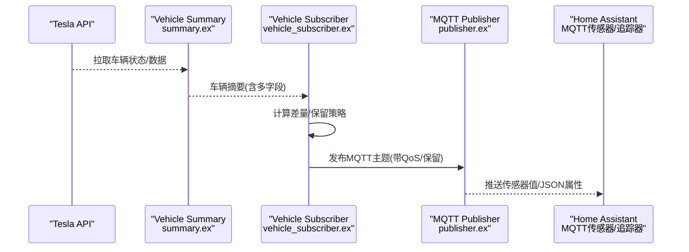
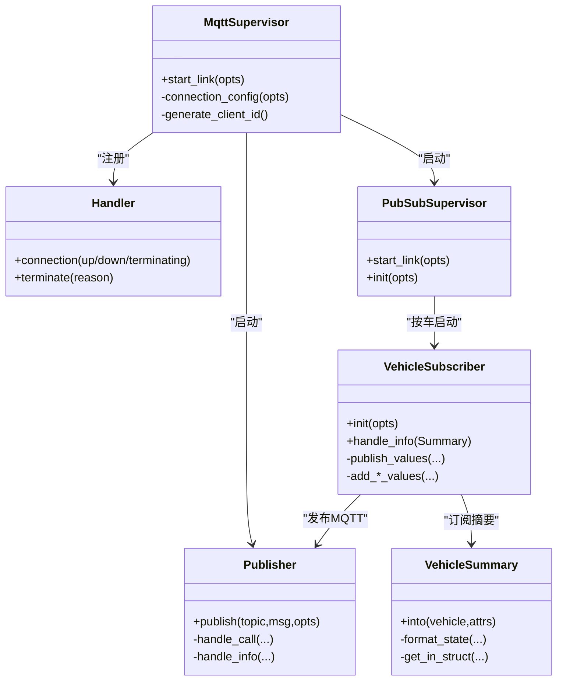

# Home Assistant集成

<cite>
**本文引用的文件**
- [website/docs/integrations/home_assistant.md](file://website/docs/integrations/home_assistant.md)
- [website/docs/integrations/mqtt.md](file://website/docs/integrations/mqtt.md)
- [lib/teslamate/mqtt.ex](file://lib/teslamate/mqtt.ex)
- [lib/teslamate/mqtt/publisher.ex](file://lib/teslamate/mqtt/publisher.ex)
- [lib/teslamate/mqtt/handler.ex](file://lib/teslamate/mqtt/handler.ex)
- [lib/teslamate/mqtt/pubsub.ex](file://lib/teslamate/mqtt/pubsub.ex)
- [lib/teslamate/mqtt/pubsub/vehicle_subscriber.ex](file://lib/teslamate/mqtt/pubsub/vehicle_subscriber.ex)
- [lib/teslamate/vehicles/vehicle/summary.ex](file://lib/teslamate/vehicles/vehicle/summary.ex)
- [lib/teslamate/api.ex](file://lib/teslamate/api.ex)
- [lib/tesla_api/vehicle.ex](file://lib/tesla_api/vehicle.ex)
- [lib/tesla_api/stream.ex](file://lib/tesla_api/stream.ex)
- [website/docs/configuration/environment_variables.md](file://website/docs/configuration/environment_variables.md)
- [website/docs/configuration/api.md](file://website/docs/configuration/api.md)
- [test/teslamate/mqtt/pubsub/vehicle_subscriber_test.exs](file://test/teslamate/mqtt/pubsub/vehicle_subscriber_test.exs)
</cite>

## 目录
1. [简介](#简介)
2. [项目结构](#项目结构)
3. [核心组件](#核心组件)
4. [架构总览](#架构总览)
5. [详细组件分析](#详细组件分析)
6. [依赖关系分析](#依赖关系分析)
7. [性能考虑](#性能考虑)
8. [故障排查指南](#故障排查指南)
9. [结论](#结论)
10. [附录](#附录)

## 简介
本文件面向希望在Home Assistant中使用TeslaMate数据的用户，系统性说明如何通过MQTT传感器配置将TeslaMate数据导入Home Assistant，并给出proximity传感器配置、实体ID命名规范、单位设置、自动化场景示例、读写能力限制及性能优化建议。文档内容均基于仓库现有实现与文档，确保可操作性和准确性。

## 项目结构
TeslaMate通过MQTT模块向外部平台（如Home Assistant）推送车辆状态与传感器数据；MQTT模块由连接管理、发布器、订阅器与车辆主题生成器组成；车辆状态汇总结构体负责从Tesla API抽取并格式化字段，最终形成MQTT主题树。

图表来源
- [lib/teslamate/mqtt.ex](file://lib/teslamate/mqtt.ex#L1-L64)
- [lib/teslamate/mqtt/publisher.ex](file://lib/teslamate/mqtt/publisher.ex#L1-L53)
- [lib/teslamate/mqtt/handler.ex](file://lib/teslamate/mqtt/handler.ex#L1-L28)
- [lib/teslamate/mqtt/pubsub.ex](file://lib/teslamate/mqtt/pubsub.ex#L1-L22)
- [lib/teslamate/mqtt/pubsub/vehicle_subscriber.ex](file://lib/teslamate/mqtt/pubsub/vehicle_subscriber.ex#L1-L217)
- [lib/teslamate/vehicles/vehicle/summary.ex](file://lib/teslamate/vehicles/vehicle/summary.ex#L1-L251)

章节来源
- [lib/teslamate/mqtt.ex](file://lib/teslamate/mqtt.ex#L1-L64)
- [lib/teslamate/mqtt/pubsub.ex](file://lib/teslamate/mqtt/pubsub.ex#L1-L22)

## 核心组件
- MQTT Supervisor：启动连接、发布器与订阅器子系统，支持TLS/SSL、用户名密码认证与IPv6。
- Publisher：统一发布接口，支持QoS与超时控制，处理发布确认回调。
- Handler：MQTT连接生命周期事件记录日志。
- PubSub Supervisor：按车辆实例启动订阅器，订阅车辆摘要事件。
- Vehicle Subscriber：接收车辆摘要，计算差量与保留策略，发布MQTT主题。
- Vehicle Summary：从Tesla API抽取字段并格式化，作为MQTT发布的数据源。

章节来源
- [lib/teslamate/mqtt.ex](file://lib/teslamate/mqtt.ex#L1-L64)
- [lib/teslamate/mqtt/publisher.ex](file://lib/teslamate/mqtt/publisher.ex#L1-L53)
- [lib/teslamate/mqtt/handler.ex](file://lib/teslamate/mqtt/handler.ex#L1-L28)
- [lib/teslamate/mqtt/pubsub.ex](file://lib/teslamate/mqtt/pubsub.ex#L1-L22)
- [lib/teslamate/mqtt/pubsub/vehicle_subscriber.ex](file://lib/teslamate/mqtt/pubsub/vehicle_subscriber.ex#L1-L217)
- [lib/teslamate/vehicles/vehicle/summary.ex](file://lib/teslamate/vehicles/vehicle/summary.ex#L1-L251)

## 架构总览
下图展示从车辆状态到MQTT再到Home Assistant的端到端流程。

图表来源
- [lib/teslamate/vehicles/vehicle/summary.ex](file://lib/teslamate/vehicles/vehicle/summary.ex#L1-L251)
- [lib/teslamate/mqtt/pubsub/vehicle_subscriber.ex](file://lib/teslamate/mqtt/pubsub/vehicle_subscriber.ex#L62-L102)
- [lib/teslamate/mqtt/publisher.ex](file://lib/teslamate/mqtt/publisher.ex#L20-L53)
- [website/docs/integrations/mqtt.md](file://website/docs/integrations/mqtt.md#L1-L120)

## 详细组件分析

### MQTT发布与保留策略
- 主题命名：`teslamate/<namespace>/cars/<car_id>/<field>`
- 保留策略：
  - 健康状态等敏感主题不保留或清理旧保留消息，避免陈旧状态。
  - 其他数值/文本类主题默认保留，便于HA重启后快速恢复状态。
- QoS与超时：默认QoS为1，发布调用带超时，异步并发发布，失败记录警告日志。

章节来源
- [lib/teslamate/mqtt/pubsub/vehicle_subscriber.ex](file://lib/teslamate/mqtt/pubsub/vehicle_subscriber.ex#L25-L40)
- [lib/teslamate/mqtt/pubsub/vehicle_subscriber.ex](file://lib/teslamate/mqtt/pubsub/vehicle_subscriber.ex#L74-L102)
- [lib/teslamate/mqtt/publisher.ex](file://lib/teslamate/mqtt/publisher.ex#L20-L53)

### MQTT连接与认证
- 支持TCP与TLS两种传输，可配置用户名、密码、CA证书校验、IPv6。
- 连接生命周期事件记录日志，便于排障。

章节来源
- [lib/teslamate/mqtt.ex](file://lib/teslamate/mqtt.ex#L29-L59)
- [lib/teslamate/mqtt/handler.ex](file://lib/teslamate/mqtt/handler.ex#L1-L28)

### 车辆摘要与字段映射
- Vehicle Summary从Tesla API抽取字段，包含驱动、充电、气候、车体状态等。
- 字段转换：速度、里程、范围等单位换算，时间戳转ISO8601字符串，布尔/枚举值标准化。
- 主题发布：将摘要字段映射到MQTT主题，同时生成位置JSON与活动路线JSON。

章节来源
- [lib/teslamate/vehicles/vehicle/summary.ex](file://lib/teslamate/vehicles/vehicle/summary.ex#L1-L251)
- [lib/teslamate/mqtt/pubsub/vehicle_subscriber.ex](file://lib/teslamate/mqtt/pubsub/vehicle_subscriber.ex#L104-L216)

### Home Assistant MQTT传感器配置要点
- 设备分类与图标：根据字段语义选择合适的device_class与icon，提升UI体验。
- 单位设置：温度°C、速度km/h、距离km/mi、功率kW、能量kWh、压力bar/psi、百分比%、时长h/min等。
- 实体ID命名规范：建议采用`sensor.tesla_<字段名>`或`binary_sensor.tesla_<字段名>`，便于HA自动发现与脚本引用。
- 可用字段覆盖：状态、时间戳、软件版本、模型/外观/轮毂/尾翼、地理围栏、档位、功率/速度/航向/海拔、内外温度、里程、电池范围/电量/可用电量、充电相关、门窗/舱盖/ Sentry/锁定状态、预加热/空调运行、插拔状态、TPMS压力与软告警、活动路线目的地/到达能耗/剩余距离/剩余时间/拥堵延迟、健康状态、更新可用/版本等。

章节来源
- [website/docs/integrations/home_assistant.md](file://website/docs/integrations/home_assistant.md#L30-L694)
- [website/docs/integrations/mqtt.md](file://website/docs/integrations/mqtt.md#L1-L120)

### proximity传感器配置与自动化场景
- 配置：使用device_tracker与proximity，基于设备追踪器计算到zone的距离，tolerance与单位按需调整。
- 场景示例：到家自动开车库门、离家自动关闭门窗、夜间未插电提醒等。
- 触发方式：HA状态变化或MQTT事件均可触发自动化。

章节来源
- [website/docs/integrations/home_assistant.md](file://website/docs/integrations/home_assistant.md#L30-L57)
- [website/docs/integrations/home_assistant.md](file://website/docs/integrations/home_assistant.md#L904-L1059)

### 完整配置参考路径
- Home Assistant配置示例（配置文件与UI卡片）：
  - configuration.yaml片段与mqtt:部分包含传感器、设备追踪器、proximity与tesla组件基础配置
  - ui-lovelace.yaml示例包含仪表板卡片布局
- MQTT主题清单与payload示例：
  - 主题列表与active_route JSON示例

章节来源
- [website/docs/integrations/home_assistant.md](file://website/docs/integrations/home_assistant.md#L30-L800)
- [website/docs/integrations/mqtt.md](file://website/docs/integrations/mqtt.md#L1-L120)

### 读写能力限制与桥接方案
- 读取能力：MQTT已完整覆盖官方Tesla组件的传感器数据，满足只读场景。
- 写入能力：官方Tesla组件支持锁/解锁、Climate等写操作；但当前集成文档指出其默认高频轮询会唤醒车辆并耗电。
- 高级桥接方案：通过极低轮询间隔的Tesla组件与自动化桥接，将MQTT值填充到Tesla组件实体，从而在保持低唤醒频率的同时获得写能力。该方案需谨慎设置scan_interval与自动化逻辑，避免过度唤醒。

章节来源
- [website/docs/integrations/home_assistant.md](file://website/docs/integrations/home_assistant.md#L8-L25)
- [website/docs/configuration/api.md](file://website/docs/configuration/api.md#L25-L38)

## 依赖关系分析

图表来源
- [lib/teslamate/mqtt.ex](file://lib/teslamate/mqtt.ex#L1-L64)
- [lib/teslamate/mqtt/publisher.ex](file://lib/teslamate/mqtt/publisher.ex#L1-L53)
- [lib/teslamate/mqtt/handler.ex](file://lib/teslamate/mqtt/handler.ex#L1-L28)
- [lib/teslamate/mqtt/pubsub.ex](file://lib/teslamate/mqtt/pubsub.ex#L1-L22)
- [lib/teslamate/mqtt/pubsub/vehicle_subscriber.ex](file://lib/teslamate/mqtt/pubsub/vehicle_subscriber.ex#L1-L217)
- [lib/teslamate/vehicles/vehicle/summary.ex](file://lib/teslamate/vehicles/vehicle/summary.ex#L1-L251)

章节来源
- [lib/teslamate/mqtt.ex](file://lib/teslamate/mqtt.ex#L1-L64)
- [lib/teslamate/mqtt/pubsub.ex](file://lib/teslamate/mqtt/pubsub.ex#L1-L22)
- [lib/teslamate/mqtt/pubsub/vehicle_subscriber.ex](file://lib/teslamate/mqtt/pubsub/vehicle_subscriber.ex#L1-L217)

## 性能考虑
- 扫描间隔设置：
  - POLLING_ASLEEP_INTERVAL：休眠时轮询间隔（秒）
  - POLLING_CHARGING_INTERVAL：充电时最小轮询间隔（秒）
  - POLLING_DRIVING_INTERVAL：驾驶时轮询间隔（秒）
  - POLLING_ONLINE_INTERVAL：在线时轮询间隔（秒）
  - 默认值可在环境变量中调整，建议结合实际需求与能耗平衡进行设置
- 状态更新触发机制：
  - Vehicle Subscriber仅在字段变化或强制发布时才发送MQTT消息，减少冗余推送
  - 对于不保留的主题，会清理旧保留消息，避免陈旧状态
- MQTT发布优化：
  - 并发发布（最大并发10），超时控制，失败记录日志
  - QoS=1保证可靠送达，合理设置retain策略

章节来源
- [website/docs/configuration/environment_variables.md](file://website/docs/configuration/environment_variables.md#L52-L61)
- [lib/teslamate/mqtt/pubsub/vehicle_subscriber.ex](file://lib/teslamate/mqtt/pubsub/vehicle_subscriber.ex#L74-L102)
- [lib/teslamate/mqtt/publisher.ex](file://lib/teslamate/mqtt/publisher.ex#L20-L53)

## 故障排查指南
- MQTT连接问题：
  - 检查MQTT_HOST/MQTT_PORT/MQTT_USERNAME/MQTT_PASSWORD/MQTT_TLS等环境变量
  - 查看Handler日志输出，关注连接建立/断开/终止事件
- 发布异常：
  - Publisher对发布结果进行记录，若出现失败可定位具体主题与原因
- 数据不更新：
  - 确认Vehicle Subscriber是否收到车辆摘要事件
  - 检查字段是否发生变化，或是否命中“始终发布”的字段清单
- 测试验证：
  - 参考单元测试对主题、保留策略与payload的断言，核对预期行为

章节来源
- [lib/teslamate/mqtt.ex](file://lib/teslamate/mqtt.ex#L29-L59)
- [lib/teslamate/mqtt/handler.ex](file://lib/teslamate/mqtt/handler.ex#L1-L28)
- [lib/teslamate/mqtt/publisher.ex](file://lib/teslamate/mqtt/publisher.ex#L20-L53)
- [test/teslamate/mqtt/pubsub/vehicle_subscriber_test.exs](file://test/teslamate/mqtt/pubsub/vehicle_subscriber_test.exs#L1-L309)

## 结论
通过MQTT，TeslaMate能够稳定地向Home Assistant提供全面的车辆状态与传感器数据。配合proximity与自动化，可实现丰富的到家/离家场景。对于需要写入能力的用户，可采用低轮询间隔的Tesla组件与自动化桥接方案，在降低唤醒频率的同时获得写能力。合理设置扫描间隔与保留策略，可进一步优化能耗与稳定性。

## 附录

### MQTT主题与字段对照（节选）
- 通用信息：display_name、state、since、healthy、version、update_available、update_version、model、trim_badging、exterior_color、wheel_type、spoiler_type、geofence
- 位置与运动：location（JSON）、shift_state、power、speed、heading、elevation
- 气候与环境：inside_temp、outside_temp、is_climate_on、is_preconditioning、is_user_present
- 里程与能耗：odometer、est_battery_range_km、rated_battery_range_km、ideal_battery_range_km、battery_level、usable_battery_level、charge_energy_added、charge_limit_soc
- 充电与电源：plugged_in、charging_state、charge_port_door_open、charger_actual_current、charger_phases、charger_power、charger_voltage、charge_current_request、charge_current_request_max、scheduled_charging_start_time、time_to_full_charge
- 车门与舱盖：doors_open、driver_front_door_open、driver_rear_door_open、passenger_front_door_open、passenger_rear_door_open、trunk_open、frunk_open、windows_open、sentry_mode、locked
- TPMS：tpms_pressure_fl/fr/rl/rr（bar/psi）、tpms_soft_warning_fl/fr/rl/rr
- 活动路线：active_route（JSON，含destination、energy_at_arrival、miles_to_arrival、minutes_to_arrival、traffic_minutes_delay、location）

章节来源
- [website/docs/integrations/mqtt.md](file://website/docs/integrations/mqtt.md#L1-L120)

### Home Assistant MQTT传感器配置要点（节选）
- 设备分组：使用device标识符与configuration_url，便于在HA中聚合设备
- 实体ID命名：建议以sensor.tesla_或binary_sensor.tesla_开头，便于脚本与自动化引用
- 单位与device_class：温度°C、速度km/h、距离km/mi、功率kW、能量kWh、压力bar/psi、百分比%、时长h/min等
- 二进制传感器：使用payload_on/payload_off映射布尔值
- 设备追踪器：location与active_route使用json_attributes_topic/json_attributes_template

章节来源
- [website/docs/integrations/home_assistant.md](file://website/docs/integrations/home_assistant.md#L56-L694)

### 自动化场景示例（节选）
- 到家自动开 garage：基于device_tracker状态变化触发
- 离开提醒：基于MQTT事件检测车门/窗/舱盖开启，延时触发通知
- 夜间未插电提醒：定时条件检查插拔状态与电量/续航

章节来源
- [website/docs/integrations/home_assistant.md](file://website/docs/integrations/home_assistant.md#L904-L1059)