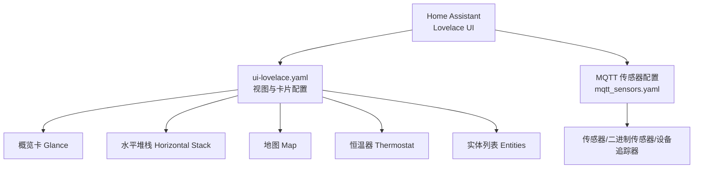
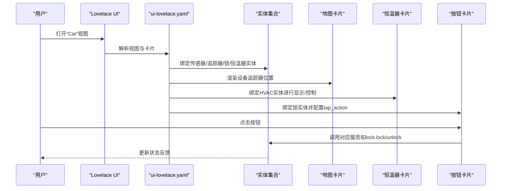
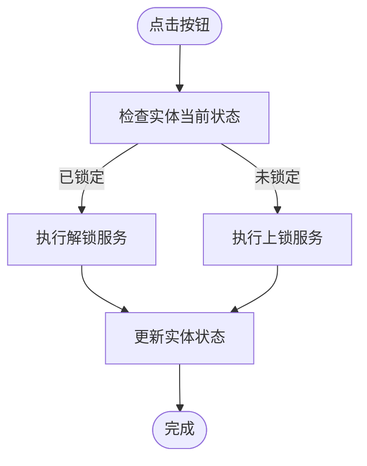
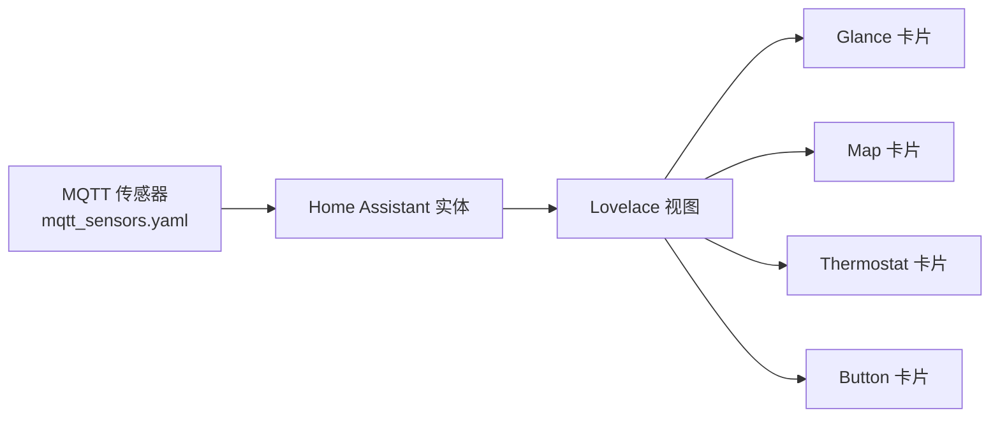

# UI可视化与Lovelace配置

<cite>
**本文引用的文件列表**
- [website/docs/integrations/home_assistant.md](file://website/docs/integrations/home_assistant.md)
- [assets/css/app.scss](file://assets/css/app.scss)
- [lib/teslamate_web/live/car_live/summary.html.heex](file://lib/teslamate_web/live/car_live/summary.html.heex)
- [assets/js/hooks.js](file://assets/js/hooks.js)
- [lib/teslamate_web/live/settings_live/index.html.heex](file://lib/teslamate_web/live/settings_live/index.html.heex)
- [test/teslamate_web/live/settings_test.exs](file://test/teslamate_web/live/settings_test.exs)
</cite>

## 目录
1. [简介](#简介)
2. [项目结构](#项目结构)
3. [核心组件](#核心组件)
4. [架构总览](#架构总览)
5. [详细组件分析](#详细组件分析)
6. [依赖关系分析](#依赖关系分析)
7. [性能考量](#性能考量)
8. [故障排查指南](#故障排查指南)
9. [结论](#结论)
10. [附录](#附录)

## 简介
本文件面向在Home Assistant中构建Tesla车辆可视化界面的用户，基于仓库中的官方文档与前端实现，系统化讲解如何使用Lovelace UI（ui-lovelace.yaml）组织车辆监控面板。内容覆盖：
- ui-lovelace.yaml的配置结构与视图组织方式
- 垂直堆栈、水平堆栈、概览卡（glance）、地图与恒温器组件的使用
- 按钮实体的交互配置：状态图标、颜色编码与tap_action服务调用
- 实体分组与卡片布局的最佳实践
- 响应式设计与主题适配建议

## 项目结构
本仓库提供了完整的Home Assistant集成文档与示例Lovelace配置，同时包含Web界面的地图渲染实现，便于理解地图卡片在Lovelace中的使用方式。

图表来源
- [website/docs/integrations/home_assistant.md](file://website/docs/integrations/home_assistant.md#L700-L902)

章节来源
- [website/docs/integrations/home_assistant.md](file://website/docs/integrations/home_assistant.md#L56-L120)
- [website/docs/integrations/home_assistant.md](file://website/docs/integrations/home_assistant.md#L700-L902)

## 核心组件
- 视图与容器
  - 视图（views）：用于组织页面，如“Car”视图
  - 容器卡片：vertical-stack（垂直堆栈）、horizontal-stack（水平堆栈）
- 卡片类型
  - glance：适合展示少量关键实体的状态与名称
  - map：展示设备追踪器的位置与方向
  - thermostat：展示并控制HVAC系统
  - entities：以列表形式展示多个实体
- 交互组件
  - button：支持根据实体状态切换不同图标、颜色，并通过tap_action调用服务

章节来源
- [website/docs/integrations/home_assistant.md](file://website/docs/integrations/home_assistant.md#L700-L902)

## 架构总览
下图展示了Lovelace UI在Home Assistant中的典型布局与数据流，以及与MQTT传感器的关系。

图表来源
- [website/docs/integrations/home_assistant.md](file://website/docs/integrations/home_assistant.md#L700-L902)

## 详细组件分析

### 视图与布局组织
- 视图（views）
  - 包含路径、标题、徽章与图标
  - 使用vertical-stack组织多个卡片区域
- 垂直堆栈（vertical-stack）
  - 将多个卡片垂直排列，适合分组展示
- 水平堆栈（horizontal-stack）
  - 将多个卡片横向排列，适合并排操作按钮

章节来源
- [website/docs/integrations/home_assistant.md](file://website/docs/integrations/home_assistant.md#L700-L902)

### 概览卡（Glance）
- 用途：集中展示关键状态（如电池电量、车辆状态、充电状态等）
- 配置要点：entities数组中逐项声明实体与显示名称
- 示例：将电池、状态、插头连接状态组合在一个glance中

章节来源
- [website/docs/integrations/home_assistant.md](file://website/docs/integrations/home_assistant.md#L700-L902)

### 地图（Map）
- 用途：展示车辆当前位置与朝向
- 配置要点：entities绑定device_tracker；可启用暗色模式与默认缩放级别
- 数据来源：MQTT发布的device_tracker主题（位置属性）

章节来源
- [website/docs/integrations/home_assistant.md](file://website/docs/integrations/home_assistant.md#L700-L902)

### 恒温器（Thermostat）
- 用途：展示并控制车辆HVAC系统
- 配置要点：entity指向climate实体；Lovelace自动识别温度单位与目标温度设置

章节来源
- [website/docs/integrations/home_assistant.md](file://website/docs/integrations/home_assistant.md#L700-L902)

### 按钮（Button）与交互
- 用途：对锁类实体进行快速开关操作
- 配置要点：
  - entity绑定锁实体
  - show_state开启后显示当前状态
  - state数组按值映射不同图标与颜色
  - tap_action配置call-service，指定服务与服务数据（如lock.lock/unlock）
- 示例：为“充电口盖锁”和“车门锁”分别配置不同服务调用

图表来源
- [website/docs/integrations/home_assistant.md](file://website/docs/integrations/home_assistant.md#L700-L902)

章节来源
- [website/docs/integrations/home_assistant.md](file://website/docs/integrations/home_assistant.md#L700-L902)

### 实体列表（Entities）
- 用途：以列表形式展示大量传感器与二进制传感器
- 配置要点：entities数组逐项声明实体与显示名称
- 示例：展示车辆型号、外观、轮胎压力、活动路线信息等

章节来源
- [website/docs/integrations/home_assistant.md](file://website/docs/integrations/home_assistant.md#L700-L902)

### MQTT传感器与实体分组
- MQTT传感器配置：通过mqtt_sensors.yaml将MQTT主题映射为Home Assistant实体
- 设备分组：通过device标识符与唯一ID进行设备分组，便于在UI中统一管理
- 实体类别：传感器（sensor）、二进制传感器（binary_sensor）、设备追踪器（device_tracker）

章节来源
- [website/docs/integrations/home_assistant.md](file://website/docs/integrations/home_assistant.md#L56-L120)

### Web端地图渲染参考
虽然本节讨论的是Lovelace地图卡片，但Web端也实现了地图渲染逻辑，有助于理解位置与方向的呈现方式：
- 使用Leaflet渲染地图瓦片与方向箭头
- 支持OSM与可选的混合层
- 通过data属性传递经纬度与朝向

章节来源
- [assets/js/hooks.js](file://assets/js/hooks.js#L141-L188)
- [lib/teslamate_web/live/car_live/summary.html.heex](file://lib/teslamate_web/live/car_live/summary.html.heex#L1-L46)

## 依赖关系分析
- Lovelace UI依赖MQTT传感器提供的实体
- 地图卡片依赖device_tracker实体的位置属性
- 恒温器卡片依赖climate实体
- 按钮卡片依赖lock实体与相应的服务调用

图表来源
- [website/docs/integrations/home_assistant.md](file://website/docs/integrations/home_assistant.md#L56-L120)
- [website/docs/integrations/home_assistant.md](file://website/docs/integrations/home_assistant.md#L700-L902)

章节来源
- [website/docs/integrations/home_assistant.md](file://website/docs/integrations/home_assistant.md#L56-L120)
- [website/docs/integrations/home_assistant.md](file://website/docs/integrations/home_assistant.md#L700-L902)

## 性能考量
- 减少不必要的实体订阅：仅在视图中使用实际需要的实体，避免过多传感器导致UI刷新压力
- 合理使用容器卡片：vertical-stack与horizontal-stack层级不宜过深，避免复杂嵌套影响渲染性能
- 地图卡片：在移动端或低性能设备上谨慎使用高分辨率瓦片源，必要时关闭混合层
- 按钮交互：避免频繁触发服务调用，合理设置tap_action的触发频率

## 故障排查指南
- 按钮无反应
  - 检查实体是否正确绑定到lock实体
  - 检查tap_action的服务名与服务数据是否匹配实际服务接口
- 地图不显示
  - 检查device_tracker实体是否存在且有位置属性
  - 检查网络访问与瓦片源可用性
- 恒温器不可控
  - 检查climate实体是否存在且具备控制能力
  - 确认Home Assistant版本与卡片兼容性

章节来源
- [website/docs/integrations/home_assistant.md](file://website/docs/integrations/home_assistant.md#L700-L902)

## 结论
通过ui-lovelace.yaml的合理布局与卡片组合，可以高效地在Home Assistant中构建Tesla车辆监控面板。结合MQTT传感器与实体分组，能够将电池状态、车辆状态、位置信息与HVAC控制整合在同一视图中。配合按钮卡片的tap_action服务调用，可实现便捷的远程控制。同时，响应式设计与主题适配建议有助于提升跨设备的用户体验。

## 附录

### 响应式设计建议
- 在小屏幕设备上优先使用垂直堆栈，保证信息密度与可读性
- 控制卡片数量与嵌套层级，避免在移动端出现滚动困难
- 利用Home Assistant内置的主题与字体设置，确保文字大小与对比度满足可读性要求

章节来源
- [assets/css/app.scss](file://assets/css/app.scss#L224-L243)
- [assets/css/app.scss](file://assets/css/app.scss#L244-L309)

### 主题适配技巧
- 使用Home Assistant的全局设置调整语言、单位与范围偏好
- 在设置界面中选择合适的UI语言与地址语言，确保界面与数据展示一致

章节来源
- [lib/teslamate_web/live/settings_live/index.html.heex](file://lib/teslamate_web/live/settings_live/index.html.heex#L210-L247)
- [test/teslamate_web/live/settings_test.exs](file://test/teslamate_web/live/settings_test.exs#L1-L150)