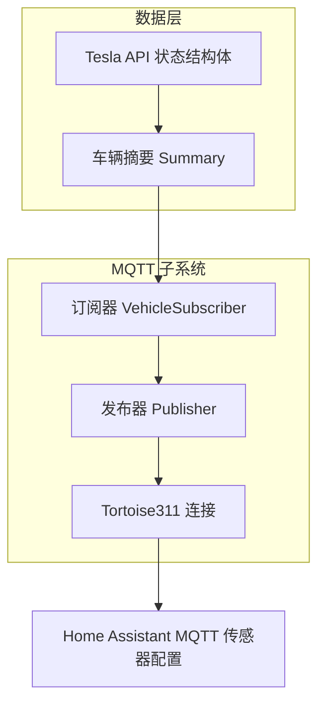
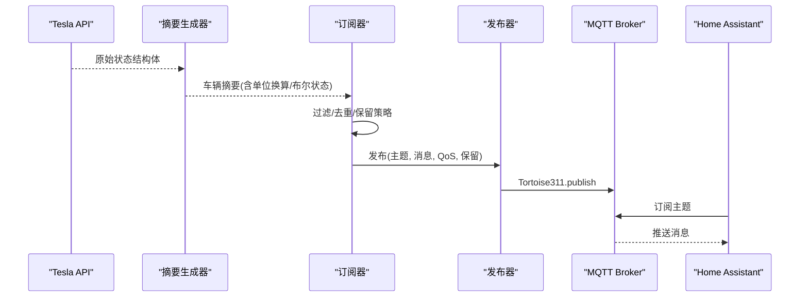
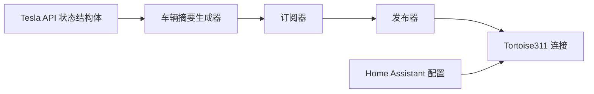
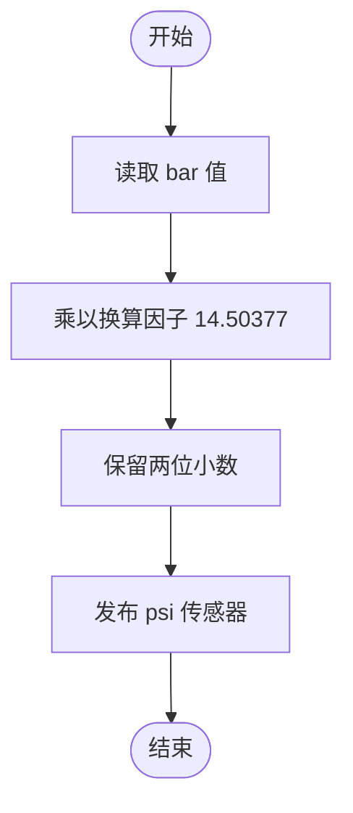
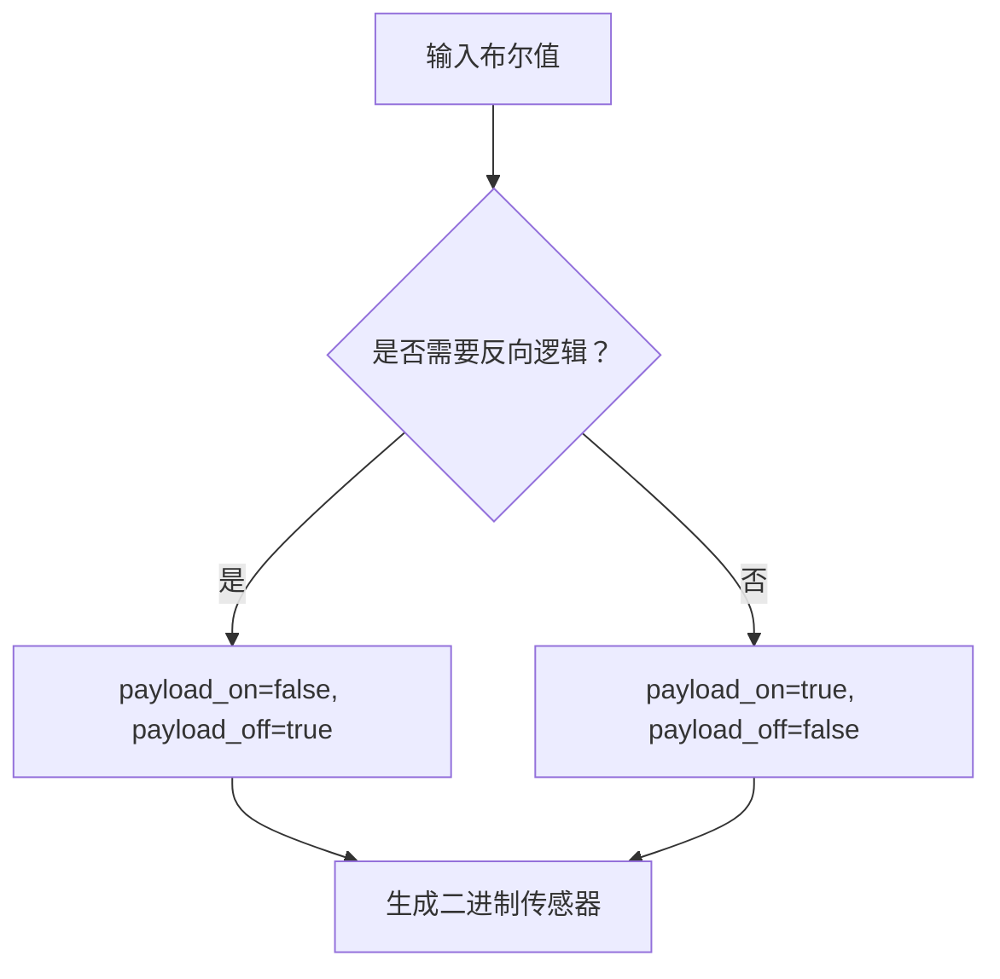

# 传感器映射与数据模型

<cite>
**本文引用的文件**
- [mqtt.md](file://website/docs/integrations/mqtt.md)
- [home_assistant.md](file://website/docs/integrations/home_assistant.md)
- [environment_variables.md](file://website/docs/configuration/environment_variables.md)
- [vehicle_subscriber.ex](file://lib/teslamate/mqtt/pubsub/vehicle_subscriber.ex)
- [publisher.ex](file://lib/teslamate/mqtt/publisher.ex)
- [mqtt.ex](file://lib/teslamate/mqtt.ex)
- [handler.ex](file://lib/teslamate/mqtt/handler.ex)
- [summary.ex](file://lib/teslamate/vehicles/vehicle/summary.ex)
- [state.ex](file://lib/tesla_api/vehicle/state.ex)
- [20220617170400_add_tire_pressures.exs](file://priv/repo/migrations/20220617170400_add_tire_pressures.exs)
- [20220718085412_add_unit_of_pressure_to_global_settings.exs](file://priv/repo/migrations/20220718085412_add_unit_of_pressure_to_global_settings.exs)
- [vehicle_subscriber_test.exs](file://test/teslamate/mqtt/pubsub/vehicle_subscriber_test.exs)
- [vehicle_sync_test.exs](file://test/teslamate/vehicles/vehicle_sync_test.exs)
</cite>

## 目录
1. [简介](#简介)
2. [项目结构](#项目结构)
3. [核心组件](#核心组件)
4. [架构总览](#架构总览)
5. [详细组件分析](#详细组件分析)
6. [依赖关系分析](#依赖关系分析)
7. [性能考量](#性能考量)
8. [故障排查指南](#故障排查指南)
9. [结论](#结论)
10. [附录](#附录)

## 简介
本文件面向使用 TeslaMate 通过 MQTT 向 Home Assistant 提供传感器数据的用户与维护者，系统性梳理所有传感器的来源、更新机制、Home Assistant 配置映射、单位换算与状态类(device_class/state_class)最佳实践，并重点解释 TPMS 胎压(bar 到 psi)的单位转换逻辑与 value_template 实现方式，以及二进制传感器的反向逻辑映射规则。

## 项目结构
TeslaMate 的 MQTT 发布链路由订阅器、摘要生成器、发布器与 Tortoise311 客户端组成；Home Assistant 使用 MQTT 传感器配置将主题映射为实体。关键路径如下：
- 订阅器：接收车辆摘要并按需发布到 MQTT 主题
- 摘要生成器：从 Tesla API 结构化数据抽取字段，进行单位换算与布尔状态计算
- 发布器：封装 Tortoise311 发布，支持 QoS 与超时
- MQTT Supervisor：管理连接、发布器与订阅器子进程

图表来源
- [mqtt.ex](file://lib/teslamate/mqtt.ex#L1-L64)
- [publisher.ex](file://lib/teslamate/mqtt/publisher.ex#L1-L52)
- [vehicle_subscriber.ex](file://lib/teslamate/mqtt/pubsub/vehicle_subscriber.ex#L1-L217)
- [summary.ex](file://lib/teslamate/vehicles/vehicle/summary.ex#L1-L251)
- [state.ex](file://lib/tesla_api/vehicle/state.ex#L191-L395)

章节来源
- [mqtt.ex](file://lib/teslamate/mqtt.ex#L1-L64)
- [publisher.ex](file://lib/teslamate/mqtt/publisher.ex#L1-L52)
- [vehicle_subscriber.ex](file://lib/teslamate/mqtt/pubsub/vehicle_subscriber.ex#L1-L217)
- [summary.ex](file://lib/teslamate/vehicles/vehicle/summary.ex#L1-L251)
- [state.ex](file://lib/tesla_api/vehicle/state.ex#L191-L395)

## 核心组件
- MQTT 订阅器：负责将车辆摘要转换为 MQTT 主题消息，按字段差异与保留策略发布
- MQTT 发布器：封装发布调用，支持 QoS 与超时，异步并发发布
- MQTT Supervisor：启动连接、发布器与订阅器，配置 TLS/用户名密码等参数
- 车辆摘要生成器：从 Tesla API 结构体抽取字段，执行单位换算与布尔状态计算
- Home Assistant 配置：将 MQTT 主题映射为传感器与二进制传感器实体

章节来源
- [vehicle_subscriber.ex](file://lib/teslamate/mqtt/pubsub/vehicle_subscriber.ex#L1-L217)
- [publisher.ex](file://lib/teslamate/mqtt/publisher.ex#L1-L52)
- [mqtt.ex](file://lib/teslamate/mqtt.ex#L1-L64)
- [summary.ex](file://lib/teslamate/vehicles/vehicle/summary.ex#L1-L251)
- [home_assistant.md](file://website/docs/integrations/home_assistant.md#L60-L694)

## 架构总览
MQTT 发布流程概览：
- 订阅器接收车辆摘要
- 将摘要字段映射为键值对，补充位置、地理围栏与导航信息
- 过滤未知值与无变化值，按保留策略发布
- 发布器调用 Tortoise311，支持 QoS 与超时
- Home Assistant 通过 MQTT 传感器配置读取主题并渲染实体

图表来源
- [summary.ex](file://lib/teslamate/vehicles/vehicle/summary.ex#L1-L251)
- [vehicle_subscriber.ex](file://lib/teslamate/mqtt/pubsub/vehicle_subscriber.ex#L62-L102)
- [publisher.ex](file://lib/teslamate/mqtt/publisher.ex#L20-L52)
- [mqtt.ex](file://lib/teslamate/mqtt.ex#L1-L64)

## 详细组件分析

### 传感器映射与数据来源
- 主题命名空间与保留策略
  - 命名空间可配置，默认为 teslamate/{namespace}/cars/{car_id}/{key}
  - 保留策略：部分字段不保留，其余默认保留
- 数据来源与字段映射
  - 来自 Tesla API 的 Drive/Charge/Vehicle/Climate 结构体
  - 摘要生成器将原始字段转换为统一单位与布尔状态
- 更新机制
  - 仅在字段变化或显式要求时发布
  - 对于某些字段，即使为空也发布空字符串以清理历史保留值

章节来源
- [vehicle_subscriber.ex](file://lib/teslamate/mqtt/pubsub/vehicle_subscriber.ex#L25-L40)
- [vehicle_subscriber.ex](file://lib/teslamate/mqtt/pubsub/vehicle_subscriber.ex#L57-L60)
- [vehicle_subscriber.ex](file://lib/teslamate/mqtt/pubsub/vehicle_subscriber.ex#L82-L102)
- [summary.ex](file://lib/teslamate/vehicles/vehicle/summary.ex#L1-L251)
- [state.ex](file://lib/tesla_api/vehicle/state.ex#L191-L395)

### 电池相关传感器
- 电池电量(battery_level)
  - 数据来源：充电状态百分比
  - 单位：%
  - 设备类：battery
  - 状态类：无
  - 使用场景：电量仪表、低电量告警
- 可用电池电量(usable_battery_level)
  - 数据来源：可用电池百分比
  - 单位：%
  - 设备类：battery
  - 状态类：无
  - 使用场景：真实续航估算参考
- 充电限制(Charge Limit Soc)
  - 数据来源：充电上限百分比
  - 单位：%
  - 设备类：battery
  - 状态类：无
  - 使用场景：设置充电上限
- 充电功率(Charger Power)
  - 数据来源：充电功率
  - 单位：kW
  - 设备类：power
  - 状态类：无
  - 使用场景：实时功率监控
- 充电电流(Charger Actual Current)
  - 数据来源：实际充电电流
  - 单位：A
  - 设备类：current
  - 状态类：无
  - 使用场景：电流监测
- 充电电压(Charger Voltage)
  - 数据来源：充电电压
  - 单位：V
  - 设备类：voltage
  - 状态类：无
  - 使用场景：电压监测
- 充电阶段(Charger Phases)
  - 数据来源：相数
  - 单位：无
  - 设备类：无
  - 状态类：无
  - 使用场景：识别单/三相
- 充电能量(Charge Energy Added)
  - 数据来源：本次充电新增电量
  - 单位：kWh
  - 设备类：energy
  - 状态类：total
  - 使用场景：能耗统计
- 时间到充满(Time To Full Charge)
  - 数据来源：剩余充电时间
  - 单位：h
  - 设备类：duration
  - 状态类：无
  - 使用场景：预计完成时间

章节来源
- [home_assistant.md](file://website/docs/integrations/home_assistant.md#L300-L395)
- [summary.ex](file://lib/teslamate/vehicles/vehicle/summary.ex#L100-L119)

### 车辆状态传感器
- 锁定状态(Locked)
  - 数据来源：锁定状态布尔
  - 设备类：lock
  - 状态类：无
  - payload 映射：on=false, off=true（反向逻辑）
  - 使用场景：门锁状态监控
- 驾驶档位(Shift State)
  - 数据来源：档位字符
  - 设备类：无
  - 状态类：无
  - 使用场景：结合 value_template 映射为“驻车”二进制传感器
- 行李箱/引擎盖状态(Trunk/Open/Frunk/Open)
  - 数据来源：对应开关布尔
  - 设备类：opening
  - 状态类：无
  - 使用场景：舱门状态监控
- 车门状态(Doors/Open)
  - 数据来源：左右前后门角度阈值判断
  - 设备类：door
  - 状态类：无
  - 使用场景：车门开启告警
- 窗户状态(Windows/Open)
  - 数据来源：前后窗角度阈值判断
  - 设备类：window
  - 状态类：无
  - 使用场景：窗户开启告警
- Sentry Mode
  - 数据来源：哨兵模式布尔
  - 设备类：无
  - 状态类：无
  - 使用场景：安全模式监控
- 用户在车(Is User Present)
  - 数据来源：是否有人在车内
  - 设备类：presence
  - 状态类：无
  - 使用场景：占用检测
- 气候控制(Is Climate On/Is Preconditioning)
  - 数据来源：空调/预冷热状态
  - 设备类：无
  - 状态类：无
  - 使用场景：能耗与舒适度监控
- 插头状态(Plugged In)
  - 数据来源：充电状态判断
  - 设备类：plug
  - 状态类：无
  - 使用场景：充电连接监控
- 充电口盖(Charge Port Door Open)
  - 数据来源：充电口盖布尔
  - 设备类：opening
  - 状态类：无
  - 使用场景：充电口状态监控

章节来源
- [home_assistant.md](file://website/docs/integrations/home_assistant.md#L558-L694)
- [summary.ex](file://lib/teslamate/vehicles/vehicle/summary.ex#L128-L153)

### 环境传感器
- 内部温度(Inside Temp)
  - 数据来源：座舱内部温度
  - 单位：°C
  - 设备类：temperature
  - 状态类：无
  - 使用场景：座舱温度监控
- 外部温度(Outside Temp)
  - 数据来源：外部温度
  - 单位：°C
  - 设备类：temperature
  - 状态类：无
  - 使用场景：天气对比与能耗分析

章节来源
- [home_assistant.md](file://website/docs/integrations/home_assistant.md#L240-L258)
- [summary.ex](file://lib/teslamate/vehicles/vehicle/summary.ex#L121-L127)

### 位置传感器
- 速度(Speed)
  - 数据来源：驱动状态速度
  - 单位：km/h
  - 设备类：speed
  - 状态类：无
  - 使用场景：移动速度监控
- 航向(Heading)
  - 数据来源：方向角
  - 单位：°
  - 设备类：无
  - 状态类：无
  - 使用场景：导航与姿态
- 海拔(Elevation)
  - 数据来源：海拔高度
  - 单位：m
  - 设备类：distance
  - 状态类：无
  - 使用场景：地形分析
- 里程表(Odometer)
  - 数据来源：里程
  - 单位：km
  - 设备类：distance
  - 状态类：无
  - 使用场景：行驶里程统计
- 位置(Location)
  - 数据来源：经纬度
  - 单位：无
  - 设备类：无
  - 状态类：无
  - 使用场景：设备追踪与地图展示

章节来源
- [home_assistant.md](file://website/docs/integrations/home_assistant.md#L210-L238)
- [home_assistant.md](file://website/docs/integrations/home_assistant.md#L74-L98)
- [summary.ex](file://lib/teslamate/vehicles/vehicle/summary.ex#L93-L100)

### 续航与范围传感器
- 估计续航(Est Battery Range)
  - 数据来源：估计续航
  - 单位：km
  - 设备类：distance
  - 状态类：无
  - 使用场景：行程规划
- 等待续航(Rated Battery Range)
  - 数据来源：官方续航
  - 单位：km
  - 设备类：distance
  - 状态类：无
  - 使用场景：官方参考
- 理想续航(Ideal Battery Range)
  - 数据来源：理想续航
  - 单位：km
  - 设备类：distance
  - 状态类：无
  - 使用场景：理论最优

章节来源
- [home_assistant.md](file://website/docs/integrations/home_assistant.md#L269-L298)
- [summary.ex](file://lib/teslamate/vehicles/vehicle/summary.ex#L112-L114)

### TPMS 胎压传感器
- 数据来源：前左/前右/后左/后右胎压
- 单位：bar
- 设备类：pressure
- 状态类：无
- Home Assistant 配置：同时提供 bar 与 psi 两个传感器，psi 使用 value_template 进行数值换算
- 换算因子：约 14.50377
- 精度：建议显示两位小数
- 使用场景：胎压监测与预警

章节来源
- [home_assistant.md](file://website/docs/integrations/home_assistant.md#L397-L484)
- [20220617170400_add_tire_pressures.exs](file://priv/repo/migrations/20220617170400_add_tire_pressures.exs#L1-L31)
- [20220718085412_add_unit_of_pressure_to_global_settings.exs](file://priv/repo/migrations/20220718085412_add_unit_of_pressure_to_global_settings.exs#L1-L11)

### 二进制传感器状态映射规则
- Locked（反向逻辑）
  - on=false, off=true
  - 用于 Home Assistant 的 lock 设备类
- Parking Brake（基于档位）
  - 通过 value_template 将档位字符映射为 ON/OFF
- Windows/Open、Doors/Open、Trunk/Open、Frunk/Open
  - 基于阈值判断布尔状态
- Sentry Mode、Is User Present、Is Climate On、Is Preconditioning、Plugged In、Charge Port Door Open
  - 直接映射布尔状态

章节来源
- [home_assistant.md](file://website/docs/integrations/home_assistant.md#L558-L694)
- [summary.ex](file://lib/teslamate/vehicles/vehicle/summary.ex#L170-L219)

### 传感器数据类型、设备类与状态类最佳实践
- 设备类(device_class)
  - temperature：温度类
  - speed：速度类
  - distance：距离/海拔类
  - battery：电量类
  - power：功率类
  - energy：能耗类
  - current/voltage：电气类
  - duration：持续时间类
  - pressure：压力类
  - lock/window/door/opening/plug/presence：二进制类
- 状态类(state_class)
  - total：累计型数值（如能耗）
  - 一般传感器不设 state_class
- 单位(unit_of_measurement)
  - 严格与设备类匹配，避免 Home Assistant 自动换算误差
- payload_on/payload_off
  - 二进制传感器应明确 on/off 字符串，避免误解
- value_template
  - 仅在需要单位换算或布尔映射时使用
  - 避免复杂模板导致 HA 渲染延迟

章节来源
- [home_assistant.md](file://website/docs/integrations/home_assistant.md#L240-L395)
- [home_assistant.md](file://website/docs/integrations/home_assistant.md#L558-L694)

## 依赖关系分析
- 订阅器依赖车辆摘要生成器与发布器
- 发布器依赖 Tortoise311 客户端
- MQTT Supervisor 管理连接、发布器与订阅器
- Home Assistant 依赖 MQTT 主题与传感器配置

图表来源
- [summary.ex](file://lib/teslamate/vehicles/vehicle/summary.ex#L1-L251)
- [vehicle_subscriber.ex](file://lib/teslamate/mqtt/pubsub/vehicle_subscriber.ex#L1-L217)
- [publisher.ex](file://lib/teslamate/mqtt/publisher.ex#L1-L52)
- [mqtt.ex](file://lib/teslamate/mqtt.ex#L1-L64)

章节来源
- [mqtt.ex](file://lib/teslamate/mqtt.ex#L1-L64)
- [publisher.ex](file://lib/teslamate/mqtt/publisher.ex#L1-L52)
- [vehicle_subscriber.ex](file://lib/teslamate/mqtt/pubsub/vehicle_subscriber.ex#L1-L217)

## 性能考量
- 并发发布
  - 订阅器使用异步流并发发布，提高吞吐量
- 差异过滤
  - 仅发布变化值，减少冗余消息
- 保留策略
  - 非健康等状态不清除保留，避免旧值污染
- QoS 与超时
  - 默认 QoS=1，确保可靠送达；发布器内置超时保护

章节来源
- [vehicle_subscriber.ex](file://lib/teslamate/mqtt/pubsub/vehicle_subscriber.ex#L82-L102)
- [publisher.ex](file://lib/teslamate/mqtt/publisher.ex#L20-L52)

## 故障排查指南
- MQTT 连接问题
  - 检查主机、端口、TLS、用户名/密码与 IPv6 设置
  - 查看连接回调日志
- 发布失败
  - 查看发布器返回结果与日志警告
- 主题未更新
  - 确认订阅器是否收到摘要
  - 检查差异过滤与保留策略
- Home Assistant 未显示
  - 确认主题命名空间与 HA 配置一致
  - 检查 value_template 语法与单位

章节来源
- [environment_variables.md](file://website/docs/configuration/environment_variables.md#L9-L62)
- [handler.ex](file://lib/teslamate/mqtt/handler.ex#L1-L28)
- [publisher.ex](file://lib/teslamate/mqtt/publisher.ex#L20-L52)
- [vehicle_subscriber_test.exs](file://test/teslamate/mqtt/pubsub/vehicle_subscriber_test.exs#L78-L115)
- [vehicle_sync_test.exs](file://test/teslamate/vehicles/vehicle_sync_test.exs#L126-L163)

## 结论
本文系统梳理了 TeslaMate 通过 MQTT 向 Home Assistant 提供的全部传感器映射，明确了数据来源、更新机制、单位换算与 Home Assistant 配置要点。TPMS 胎压的 bar 到 psi 换算采用 value_template，二进制传感器遵循 Home Assistant 的 payload 规范与反向逻辑。建议在 HA 中合理设置设备类与状态类，确保数据准确与可视化友好。

## 附录

### TPMS 胎压单位换算流程

图表来源
- [home_assistant.md](file://website/docs/integrations/home_assistant.md#L407-L484)
- [20220617170400_add_tire_pressures.exs](file://priv/repo/migrations/20220617170400_add_tire_pressures.exs#L1-L31)

### 二进制传感器状态映射规则

图表来源
- [home_assistant.md](file://website/docs/integrations/home_assistant.md#L578-L587)