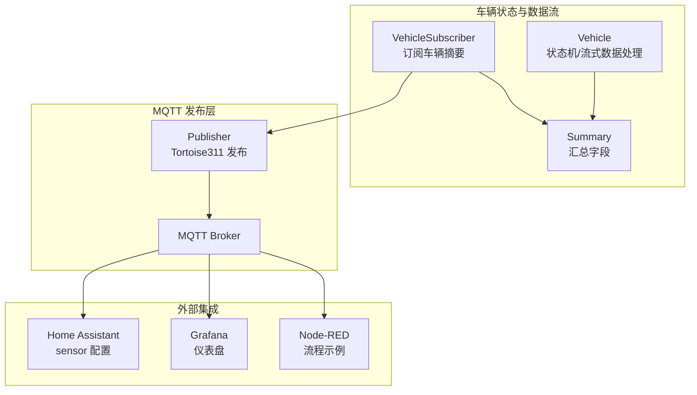
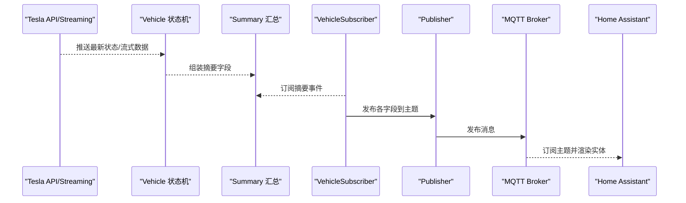
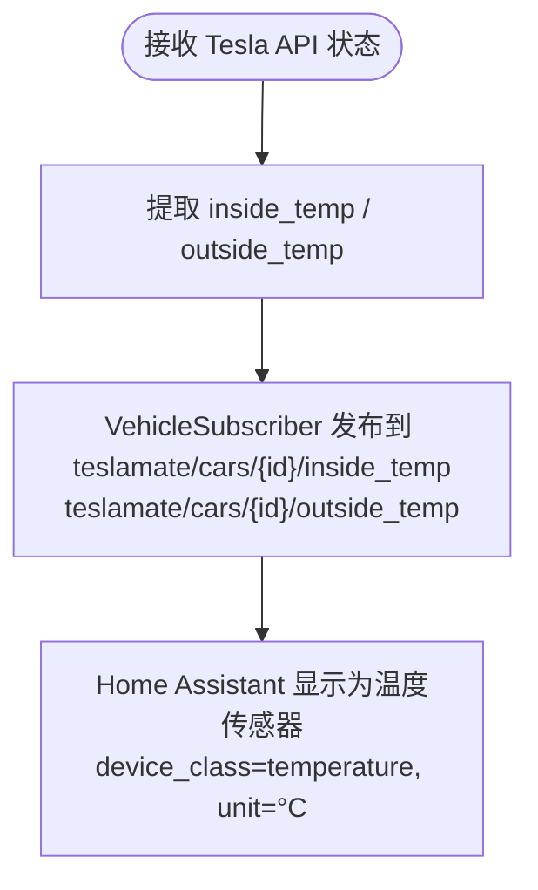
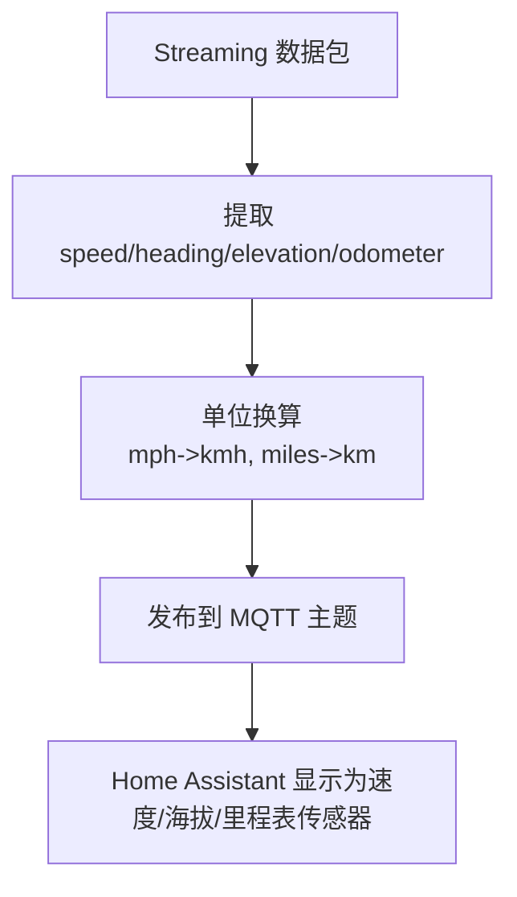
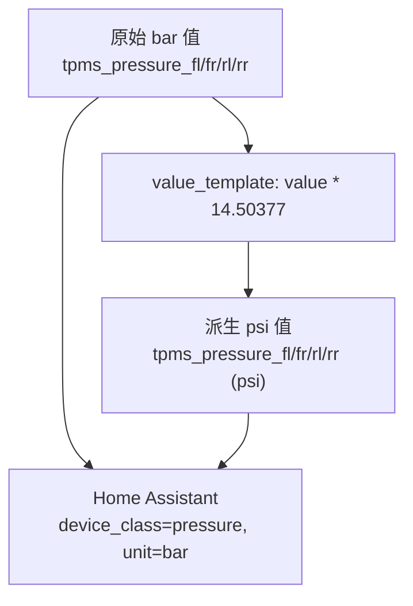
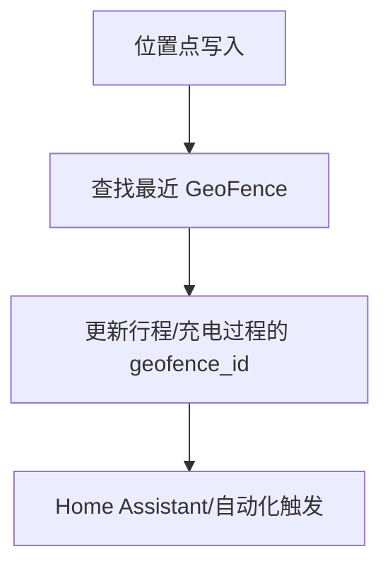
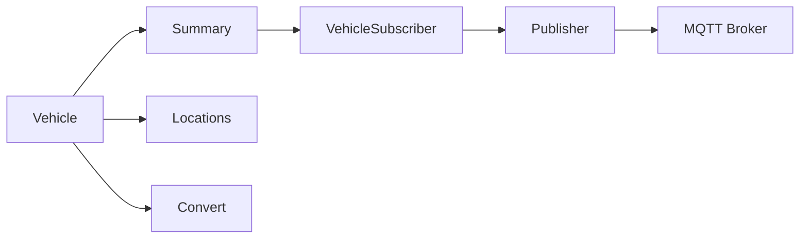

# 环境与位置传感器

<cite>
**本文引用的文件**
- [home_assistant.md](file://website/docs/integrations/home_assistant.md)
- [vehicle_subscriber.ex](file://lib/teslamate/mqtt/pubsub/vehicle_subscriber.ex)
- [publisher.ex](file://lib/teslamate/mqtt/publisher.ex)
- [vehicle.ex](file://lib/teslamate/vehicles/vehicle.ex)
- [summary.ex](file://lib/teslamate/vehicles/vehicle/summary.ex)
- [convert.ex](file://lib/teslamate/convert.ex)
- [locations.ex](file://lib/teslamate/locations.ex)
- [environment_variables.md](file://website/docs/configuration/environment_variables.md)
- [drive-details.json](file://grafana/dashboards/internal/drive-details.json)
- [streaming_test.exs](file://test/teslamate/vehicles/vehicle/streaming_test.exs)
- [log_drive_test.exs](file://test/teslamate/log/log_drive_test.exs)
</cite>

## 目录
1. [简介](#简介)
2. [项目结构](#项目结构)
3. [核心组件](#核心组件)
4. [架构总览](#架构总览)
5. [详细组件分析](#详细组件分析)
6. [依赖关系分析](#依赖关系分析)
7. [性能考量](#性能考量)
8. [故障排查指南](#故障排查指南)
9. [结论](#结论)
10. [附录](#附录)

## 简介
本章节面向希望使用 TeslaMate 的温度、位置与环境传感器数据进行驾驶行为分析与地理围栏自动化的用户与开发者。内容覆盖：
- 车内/车外温度传感器的 device_class 与单位配置
- 位置相关传感器（海拔、航向、速度、里程表）的数据来源与更新频率
- TPMS 胎压传感器的 bar 原始值与 psi 衍生值的实现方式
- 如何基于这些传感器构建自动化与可视化

## 项目结构
TeslaMate 将车辆状态与实时数据通过 MQTT 发布到主题树中，供 Home Assistant、Grafana、Node-RED 等消费端使用。关键路径如下：
- MQTT 订阅与发布：VehicleSubscriber 接收车辆摘要（Summary），并按字段发布到对应主题
- 数据来源：Vehicle 子系统从 Tesla API 或 Streaming API 获取最新状态，并在驱动过程中持续写入位置点
- 单位换算：Convert 模块提供长度、温度等单位换算
- 地理围栏：Locations 提供围栏匹配与更新逻辑

图表来源
- [vehicle_subscriber.ex](file://lib/teslamate/mqtt/pubsub/vehicle_subscriber.ex#L61-L115)
- [publisher.ex](file://lib/teslamate/mqtt/publisher.ex#L20-L52)
- [vehicle.ex](file://lib/teslamate/vehicles/vehicle.ex#L482-L505)
- [summary.ex](file://lib/teslamate/vehicles/vehicle/summary.ex#L76-L154)

章节来源
- [vehicle_subscriber.ex](file://lib/teslamate/mqtt/pubsub/vehicle_subscriber.ex#L61-L115)
- [publisher.ex](file://lib/teslamate/mqtt/publisher.ex#L20-L52)
- [vehicle.ex](file://lib/teslamate/vehicles/vehicle.ex#L482-L505)
- [summary.ex](file://lib/teslamate/vehicles/vehicle/summary.ex#L76-L154)

## 核心组件
- 温度传感器
  - Inside Temp（车内温度）与 Outside Temp（车外温度）：device_class 为 temperature，单位 °C；来源于 Tesla API 的 climate_state 字段
- 位置与运动传感器
  - Elevation（海拔）：device_class 为 distance，单位 m；来源于 Streaming API 的 elevation 字段
  - Heading（航向）：单位 °；来源于 drive_state.heading
  - Speed（速度）：device_class 为 speed，单位 km/h；来源于 drive_state.speed 并经 mph_to_kmh 转换
  - Odometer（里程表）：device_class 为 distance，单位 km；来源于 vehicle_state.odometer 并经 miles_to_km 转换
- TPMS 胎压传感器
  - 原始 bar 值：tpms_pressure_fl/fr/rl/rr
  - 派生 psi 值：通过 value_template 将 bar 值乘以 14.50377 得到 psi

章节来源
- [home_assistant.md](file://website/docs/integrations/home_assistant.md#L240-L268)
- [home_assistant.md](file://website/docs/integrations/home_assistant.md#L230-L238)
- [home_assistant.md](file://website/docs/integrations/home_assistant.md#L220-L228)
- [home_assistant.md](file://website/docs/integrations/home_assistant.md#L210-L219)
- [home_assistant.md](file://website/docs/integrations/home_assistant.md#L397-L484)
- [summary.ex](file://lib/teslamate/vehicles/vehicle/summary.ex#L121-L151)
- [convert.ex](file://lib/teslamate/convert.ex#L1-L30)
- [vehicle.ex](file://lib/teslamate/vehicles/vehicle.ex#L1357-L1368)

## 架构总览
下图展示从车辆状态到 MQTT 主题发布的端到端流程，以及温度、位置、TPMS 等传感器的关键字段映射。

图表来源
- [vehicle.ex](file://lib/teslamate/vehicles/vehicle.ex#L482-L505)
- [summary.ex](file://lib/teslamate/vehicles/vehicle/summary.ex#L76-L154)
- [vehicle_subscriber.ex](file://lib/teslamate/mqtt/pubsub/vehicle_subscriber.ex#L61-L115)
- [publisher.ex](file://lib/teslamate/mqtt/publisher.ex#L20-L52)

## 详细组件分析

### 温度传感器：Inside Temp 与 Outside Temp
- 数据来源
  - 来自 Tesla API 的 climate_state 字段：inside_temp、outside_temp
- 设备类别与单位
  - device_class: temperature
  - unit_of_measurement: °C
- 实现要点
  - Summary 中直接映射上述字段
  - VehicleSubscriber 将其发布到对应主题
- 可视化与命名
  - Grafana 中对 outside_temp 与 inside_temp 的显示名与颜色有专门配置

图表来源
- [summary.ex](file://lib/teslamate/vehicles/vehicle/summary.ex#L121-L127)
- [vehicle_subscriber.ex](file://lib/teslamate/mqtt/pubsub/vehicle_subscriber.ex#L104-L115)
- [home_assistant.md](file://website/docs/integrations/home_assistant.md#L240-L257)
- [drive-details.json](file://grafana/dashboards/internal/drive-details.json#L922-L955)

章节来源
- [summary.ex](file://lib/teslamate/vehicles/vehicle/summary.ex#L121-L127)
- [vehicle_subscriber.ex](file://lib/teslamate/mqtt/pubsub/vehicle_subscriber.ex#L104-L115)
- [home_assistant.md](file://website/docs/integrations/home_assistant.md#L240-L257)
- [drive-details.json](file://grafana/dashboards/internal/drive-details.json#L922-L955)

### 位置与运动传感器：Elevation、Heading、Speed、Odometer
- 数据来源与映射
  - Elevation（海拔）：来自 Streaming API 的 elevation 字段，device_class=distance，unit=m
  - Heading（航向）：来自 drive_state.heading，unit=°
  - Speed（速度）：来自 drive_state.speed，device_class=speed，unit=km/h（内部由 mph_to_kmh 转换）
  - Odometer（里程表）：来自 vehicle_state.odometer，device_class=distance，unit=km（内部由 miles_to_km 转换）
- 更新频率
  - 驾驶状态时，Vehicle 子系统在每次收到流式数据后插入位置点并广播摘要，更新频率取决于车辆实际流式推送节奏
  - 环境变量可配置不同状态下轮询间隔（如驾驶 2.5 秒），但流式模式下更接近实时
- 单位换算
  - Convert 模块提供 mph_to_kmh、miles_to_km 等换算函数

图表来源
- [vehicle.ex](file://lib/teslamate/vehicles/vehicle.ex#L1357-L1368)
- [summary.ex](file://lib/teslamate/vehicles/vehicle/summary.ex#L93-L114)
- [convert.ex](file://lib/teslamate/convert.ex#L1-L30)
- [home_assistant.md](file://website/docs/integrations/home_assistant.md#L210-L238)

章节来源
- [vehicle.ex](file://lib/teslamate/vehicles/vehicle.ex#L1357-L1368)
- [summary.ex](file://lib/teslamate/vehicles/vehicle/summary.ex#L93-L114)
- [convert.ex](file://lib/teslamate/convert.ex#L1-L30)
- [home_assistant.md](file://website/docs/integrations/home_assistant.md#L210-L238)

### TPMS 胎压传感器：bar 原始值与 psi 派生值
- 原始值（bar）
  - 字段：tpms_pressure_fl、tpms_pressure_fr、tpms_pressure_rl、tpms_pressure_rr
  - device_class: pressure，unit_of_measurement: bar
- 派生值（psi）
  - 通过 value_template 将 bar 值乘以 14.50377 得到 psi
  - device_class: pressure，unit_of_measurement: psi
- 可视化
  - Grafana 中对四个轮胎的压力条形图分别设置单位 pressurebar 与 pressurepsi，并配置显示名称

图表来源
- [home_assistant.md](file://website/docs/integrations/home_assistant.md#L397-L484)
- [drive-details.json](file://grafana/dashboards/internal/drive-details.json#L1127-L1287)

章节来源
- [home_assistant.md](file://website/docs/integrations/home_assistant.md#L397-L484)
- [drive-details.json](file://grafana/dashboards/internal/drive-details.json#L1127-L1287)

### 地理围栏与位置关联
- 位置点写入数据库后，系统会根据地球距离函数匹配最近的地理围栏（GeoFence），并将 geofence_id 关联到行程、充电过程等记录
- 该能力可用于“进入/离开围栏即触发自动化”的场景

图表来源
- [locations.ex](file://lib/teslamate/locations.ex#L161-L180)
- [locations.ex](file://lib/teslamate/locations.ex#L128-L159)

章节来源
- [locations.ex](file://lib/teslamate/locations.ex#L128-L159)
- [locations.ex](file://lib/teslamate/locations.ex#L161-L180)

## 依赖关系分析
- Vehicle 子系统负责状态机与流式数据处理，驱动时将位置点写入日志并广播摘要
- Summary 将 Tesla API 字段映射为统一的摘要结构
- VehicleSubscriber 订阅摘要并发布到 MQTT 主题
- Publisher 使用 Tortoise3131 完成实际发布
- Convert 提供单位换算
- Locations 提供地理围栏匹配

图表来源
- [vehicle.ex](file://lib/teslamate/vehicles/vehicle.ex#L482-L505)
- [summary.ex](file://lib/teslamate/vehicles/vehicle/summary.ex#L76-L154)
- [vehicle_subscriber.ex](file://lib/teslamate/mqtt/pubsub/vehicle_subscriber.ex#L61-L115)
- [publisher.ex](file://lib/teslamate/mqtt/publisher.ex#L20-L52)
- [locations.ex](file://lib/teslamate/locations.ex#L128-L159)
- [convert.ex](file://lib/teslamate/convert.ex#L1-L30)

章节来源
- [vehicle.ex](file://lib/teslamate/vehicles/vehicle.ex#L482-L505)
- [summary.ex](file://lib/teslamate/vehicles/vehicle/summary.ex#L76-L154)
- [vehicle_subscriber.ex](file://lib/teslamate/mqtt/pubsub/vehicle_subscriber.ex#L61-L115)
- [publisher.ex](file://lib/teslamate/mqtt/publisher.ex#L20-L52)
- [locations.ex](file://lib/teslamate/locations.ex#L128-L159)
- [convert.ex](file://lib/teslamate/convert.ex#L1-L30)

## 性能考量
- 流式模式下的更新频率
  - 驾驶状态：POLLING_DRIVING_INTERVAL 默认 2.5 秒（可通过环境变量调整）
  - 在线/离线/休眠：默认轮询间隔分别为 60、15、30 秒
- 单位换算成本低，主要开销在 MQTT 发布与外部集成解析
- 地理围栏匹配使用 PostGIS 地球距离函数，建议合理设置围栏半径与数量，避免频繁全量扫描

章节来源
- [environment_variables.md](file://website/docs/configuration/environment_variables.md#L52-L57)
- [locations.ex](file://lib/teslamate/locations.ex#L128-L159)

## 故障排查指南
- MQTT 发布失败
  - Publisher 对 QoS>0 的消息维护引用并等待回调，若失败会记录警告日志
- 流式连接异常
  - Vehicle 子系统在流式断连或令牌过期时会重建连接并重试
- 数据陈旧
  - Vehicle 子系统对流式数据进行去重与时间戳校验，避免过期数据影响摘要
- 位置精度与围栏误判
  - 若出现围栏误判，检查围栏半径与位置点密度；必要时降低围栏半径或增加位置点频率

章节来源
- [publisher.ex](file://lib/teslamate/mqtt/publisher.ex#L20-L52)
- [vehicle.ex](file://lib/teslamate/vehicles/vehicle.ex#L570-L604)
- [vehicle.ex](file://lib/teslamate/vehicles/vehicle.ex#L438-L486)
- [locations.ex](file://lib/teslamate/locations.ex#L128-L159)

## 结论
TeslaMate 将温度、位置与 TPMS 等环境传感器数据标准化为 MQTT 主题，配合 Home Assistant 的 device_class 与单位配置，可直接用于驾驶行为分析与地理围栏自动化。通过合理的轮询与流式更新策略、单位换算与围栏匹配，用户可在多种可视化与自动化平台中获得一致且可靠的体验。

## 附录

### 传感器字段与主题映射参考
- Inside Temp：teslamate/cars/{id}/inside_temp，device_class=temperature，unit=°C
- Outside Temp：teslamate/cars/{id}/outside_temp，device_class=temperature，unit=°C
- Speed：teslamate/cars/{id}/speed，device_class=speed，unit=km/h
- Heading：teslamate/cars/{id}/heading，unit=°
- Elevation：teslamate/cars/{id}/elevation，device_class=distance，unit=m
- Odometer：teslamate/cars/{id}/odometer，device_class=distance，unit=km
- TPMS 原始（bar）：teslamate/cars/{id}/tpms_pressure_fl/fr/rl/rr，device_class=pressure，unit=bar
- TPMS 派生（psi）：teslamate/cars/{id}/tpms_pressure_fl/fr/rl/rr（psi），device_class=pressure，unit=psi，value_template={{ value | float * 14.50377 }}

章节来源
- [home_assistant.md](file://website/docs/integrations/home_assistant.md#L210-L268)
- [home_assistant.md](file://website/docs/integrations/home_assistant.md#L397-L484)
- [vehicle_subscriber.ex](file://lib/teslamate/mqtt/pubsub/vehicle_subscriber.ex#L104-L115)
- [summary.ex](file://lib/teslamate/vehicles/vehicle/summary.ex#L121-L151)

### 驾驶行为分析与地理围栏自动化建议
- 驾驶行为分析
  - 利用 Speed、Power、Battery Level、Inside/Outside Temp 构建能耗与热舒适度趋势
  - 使用 Odometer 与 Estimated/Rated/Ideal Range 进行续航与能耗对比
- 地理围栏自动化
  - 基于位置主题与围栏匹配，实现“进入/离开家/工作地”自动开关灯、空调、充电策略
  - 结合 TPMS 派生值（psi）在胎压异常时触发提醒

章节来源
- [locations.ex](file://lib/teslamate/locations.ex#L161-L180)
- [log_drive_test.exs](file://test/teslamate/log/log_drive_test.exs#L62-L110)
- [streaming_test.exs](file://test/teslamate/vehicles/vehicle/streaming_test.exs#L90-L142)