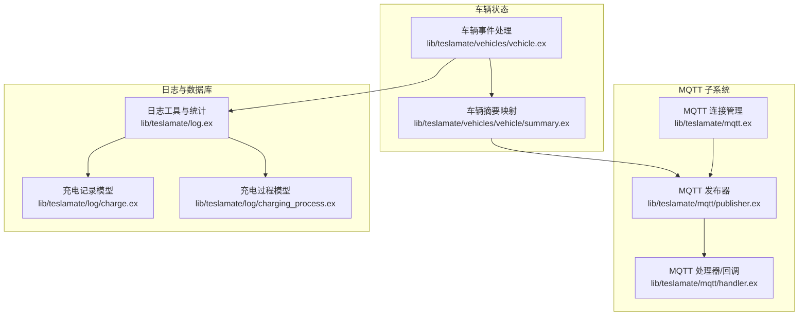
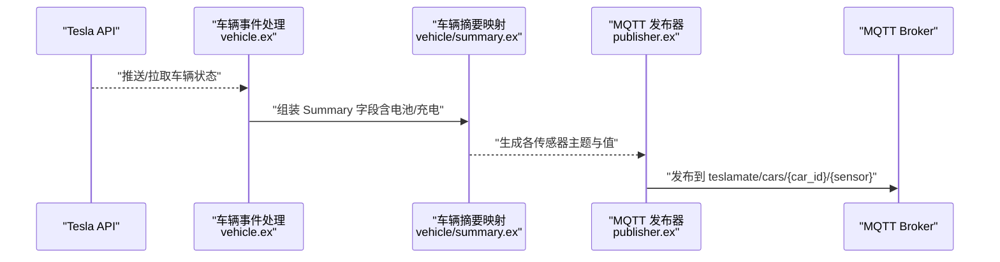
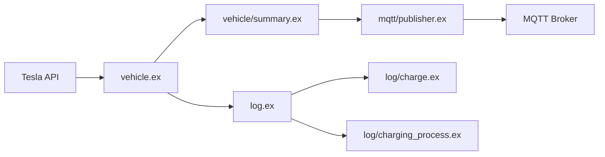

# 电池与充电传感器

<cite>
**本文引用的文件**
- [lib/teslamate/mqtt.ex](file://lib/teslamate/mqtt.ex)
- [lib/teslamate/mqtt/publisher.ex](file://lib/teslamate/mqtt/publisher.ex)
- [lib/teslamate/mqtt/handler.ex](file://lib/teslamate/mqtt/handler.ex)
- [lib/teslamate/vehicles/vehicle/summary.ex](file://lib/teslamate/vehicles/vehicle/summary.ex)
- [lib/teslamate/vehicles/vehicle.ex](file://lib/teslamate/vehicles/vehicle.ex)
- [lib/teslamate/log/charge.ex](file://lib/teslamate/log/charge.ex)
- [lib/teslamate/log/charging_process.ex](file://lib/teslamate/log/charging_process.ex)
- [lib/teslamate/log.ex](file://lib/teslamate/log.ex)
- [priv/repo/migrations/20190330200000_create_charges.exs](file://priv/repo/migrations/20190330200000_create_charges.exs)
- [priv/repo/migrations/20190330190000_create_charging_processes.exs](file://priv/repo/migrations/20190330190000_create_charging_processes.exs)
- [priv/repo/migrations/20190525125700_rename_soc_fields.exs](file://priv/repo/migrations/20190525125700_rename_soc_fields.exs)
- [priv/repo/migrations/20191017003836_add_est_total_charge_energy.exs](file://priv/repo/migrations/20191017003836_add_est_total_charge_energy.exs)
- [priv/repo/migrations/20200116190926_charges_add_usable_battery_level.exs](file://priv/repo/migrations/20200116190926_charges_add_usable_battery_level.exs)
- [website/docs/integrations/mqtt.md](file://website/docs/integrations/mqtt.md)
- [website/docs/integrations/home_assistant.md](file://website/docs/integrations/home_assistant.md)
- [test/teslamate/vehicles/vehicle/sync_test.exs](file://test/teslamate/vehicles/vehicle/sync_test.exs)
- [test/teslamate/log/log_charging_test.exs](file://test/teslamate/log/log_charging_test.exs)
</cite>

## 目录
1. [简介](#简介)
2. [项目结构](#项目结构)
3. [核心组件](#核心组件)
4. [架构总览](#架构总览)
5. [详细组件分析](#详细组件分析)
6. [依赖关系分析](#依赖关系分析)
7. [性能考量](#性能考量)
8. [故障排查指南](#故障排查指南)
9. [结论](#结论)
10. [附录](#附录)

## 简介
本文件面向使用 TeslaMate 并通过 MQTT 向 Home Assistant 提供电池与充电相关传感器的用户，系统性说明以下传感器：
- 电池电量（Battery Level）
- 可用电池电量（Usable Battery Level）
- 充电限制（Charge Limit Soc）
- 充电功率（Charger Power）
- 充电电压（Charger Voltage）
- 充电电流（Charger Actual Current）
- 充电能量添加（Charge Energy Added）
- 时间到充满（Time To Full Charge）
- 预约充电开始时间（Scheduled Charging Start Time）

内容涵盖数据来源、更新机制、Home Assistant 设备类与单位配置、state_class 设置（尤其是 total）的意义，以及如何基于这些传感器构建自动化（如充电完成通知、分时电价充电策略）。

## 项目结构
TeslaMate 的 MQTT 发布链路由连接管理、发布器与订阅器组成；车辆状态汇总模块将 Tesla API 返回的充电状态映射为可发布的字段；日志模块负责充电过程与单次充电记录的持久化与统计。

图表来源
- [lib/teslamate/mqtt.ex](file://lib/teslamate/mqtt.ex#L1-L65)
- [lib/teslamate/mqtt/publisher.ex](file://lib/teslamate/mqtt/publisher.ex#L1-L52)
- [lib/teslamate/mqtt/handler.ex](file://lib/teslamate/mqtt/handler.ex#L1-L28)
- [lib/teslamate/vehicles/vehicle/summary.ex](file://lib/teslamate/vehicles/vehicle/summary.ex#L1-L251)
- [lib/teslamate/vehicles/vehicle.ex](file://lib/teslamate/vehicles/vehicle.ex#L1360-L1410)
- [lib/teslamate/log/charge.ex](file://lib/teslamate/log/charge.ex#L29-L67)
- [lib/teslamate/log/charging_process.ex](file://lib/teslamate/log/charging_process.ex#L28-L60)
- [lib/teslamate/log.ex](file://lib/teslamate/log.ex#L492-L534)

章节来源
- [lib/teslamate/mqtt.ex](file://lib/teslamate/mqtt.ex#L1-L65)
- [lib/teslamate/mqtt/publisher.ex](file://lib/teslamate/mqtt/publisher.ex#L1-L52)
- [lib/teslamate/mqtt/handler.ex](file://lib/teslamate/mqtt/handler.ex#L1-L28)
- [lib/teslamate/vehicles/vehicle/summary.ex](file://lib/teslamate/vehicles/vehicle/summary.ex#L1-L251)
- [lib/teslamate/vehicles/vehicle.ex](file://lib/teslamate/vehicles/vehicle.ex#L1360-L1410)
- [lib/teslamate/log/charge.ex](file://lib/teslamate/log/charge.ex#L29-L67)
- [lib/teslamate/log/charging_process.ex](file://lib/teslamate/log/charging_process.ex#L28-L60)
- [lib/teslamate/log.ex](file://lib/teslamate/log.ex#L492-L534)

## 核心组件
- MQTT 子系统：负责建立与 Broker 的连接、发布消息、处理连接状态回调。
- 车辆摘要映射：从 Tesla API 的 Vehicle.State 结构抽取电池与充电相关字段，形成统一的 Summary 结构，供 MQTT 发布。
- 日志模块：维护充电过程与单次充电记录，计算充电能量使用量等统计指标。
- 数据库迁移：定义充电记录与充电过程表结构及字段演进。

章节来源
- [lib/teslamate/mqtt.ex](file://lib/teslamate/mqtt.ex#L1-L65)
- [lib/teslamate/vehicles/vehicle/summary.ex](file://lib/teslamate/vehicles/vehicle/summary.ex#L1-L251)
- [lib/teslamate/log/charge.ex](file://lib/teslamate/log/charge.ex#L29-L67)
- [lib/teslamate/log/charging_process.ex](file://lib/teslamate/log/charging_process.ex#L28-L60)
- [priv/repo/migrations/20190330200000_create_charges.exs](file://priv/repo/migrations/20190330200000_create_charges.exs#L1-L26)
- [priv/repo/migrations/20190330190000_create_charging_processes.exs](file://priv/repo/migrations/20190330190000_create_charging_processes.exs#L1-L22)

## 架构总览
下图展示从 Tesla API 获取状态，到车辆摘要映射，再到 MQTT 发布的关键流程。

图表来源
- [lib/teslamate/vehicles/vehicle.ex](file://lib/teslamate/vehicles/vehicle.ex#L1360-L1410)
- [lib/teslamate/vehicles/vehicle/summary.ex](file://lib/teslamate/vehicles/vehicle/summary.ex#L63-L154)
- [lib/teslamate/mqtt/publisher.ex](file://lib/teslamate/mqtt/publisher.ex#L20-L52)

章节来源
- [lib/teslamate/vehicles/vehicle.ex](file://lib/teslamate/vehicles/vehicle.ex#L1360-L1410)
- [lib/teslamate/vehicles/vehicle/summary.ex](file://lib/teslamate/vehicles/vehicle/summary.ex#L63-L154)
- [lib/teslamate/mqtt/publisher.ex](file://lib/teslamate/mqtt/publisher.ex#L20-L52)

## 详细组件分析

### 电池电量（Battery Level）
- 数据来源：来自 Tesla API 的电池百分比字段，经车辆摘要映射后写入 Summary。
- 更新机制：当车辆处于在线状态且有新的状态更新时，会重新组装并发布。
- Home Assistant 配置要点：
  - 设备类：battery
  - 单位：%（无需转换）
  - 作用：反映当前电池剩余容量百分比，用于能耗与续航估算。

章节来源
- [lib/teslamate/vehicles/vehicle/summary.ex](file://lib/teslamate/vehicles/vehicle/summary.ex#L100-L120)
- [website/docs/integrations/mqtt.md](file://website/docs/integrations/mqtt.md#L61-L62)

### 可用电池电量（Usable Battery Level）
- 数据来源：来自 Tesla API 的可用电池百分比字段，经车辆摘要映射后写入 Summary。
- 更新机制：与电池电量一致，随状态更新发布。
- Home Assistant 配置要点：
  - 设备类：battery
  - 单位：%（无需转换）
  - 作用：反映实际可用容量百分比，可能受温度、电池健康度等因素影响。

章节来源
- [lib/teslamate/vehicles/vehicle/summary.ex](file://lib/teslamate/vehicles/vehicle/summary.ex#L116-L120)
- [website/docs/integrations/mqtt.md](file://website/docs/integrations/mqtt.md#L61-L62)

### 充电限制（Charge Limit Soc）
- 数据来源：来自 Tesla API 的充电限制百分比字段，经车辆摘要映射后写入 Summary。
- 更新机制：随状态更新发布。
- Home Assistant 配置要点：
  - 设备类：battery
  - 单位：%（无需转换）
  - 作用：用于设定最大充电上限，便于节能与电池寿命管理。

章节来源
- [lib/teslamate/vehicles/vehicle/summary.ex](file://lib/teslamate/vehicles/vehicle/summary.ex#L112-L118)
- [website/docs/integrations/mqtt.md](file://website/docs/integrations/mqtt.md#L65-L66)

### 充电功率（Charger Power）
- 数据来源：来自 Tesla API 的充电功率字段，经车辆摘要映射后写入 Summary。
- 更新机制：随状态更新发布。
- Home Assistant 配置要点：
  - 设备类：power
  - 单位：kW（无需转换）
  - 作用：反映当前充电功率，结合电流与电压可判断充电效率与模式。

章节来源
- [lib/teslamate/vehicles/vehicle/summary.ex](file://lib/teslamate/vehicles/vehicle/summary.ex#L108-L112)
- [website/docs/integrations/mqtt.md](file://website/docs/integrations/mqtt.md#L70-L71)

### 充电电压（Charger Voltage）
- 数据来源：来自 Tesla API 的充电电压字段，经车辆摘要映射后写入 Summary。
- 更新机制：随状态更新发布。
- Home Assistant 配置要点：
  - 设备类：voltage
  - 单位：V（无需转换）
  - 作用：辅助判断充电模式与电网类型。

章节来源
- [lib/teslamate/vehicles/vehicle/summary.ex](file://lib/teslamate/vehicles/vehicle/summary.ex#L112-L116)
- [website/docs/integrations/mqtt.md](file://website/docs/integrations/mqtt.md#L71-L71)

### 充电电流（Charger Actual Current）
- 数据来源：来自 Tesla API 的实际充电电流字段，经车辆摘要映射后写入 Summary。
- 更新机制：随状态更新发布。
- Home Assistant 配置要点：
  - 设备类：current
  - 单位：A（无需转换）
  - 作用：反映实时充电电流，结合功率与电压可验证充电效率。

章节来源
- [lib/teslamate/vehicles/vehicle/summary.ex](file://lib/teslamate/vehicles/vehicle/summary.ex#L108-L112)
- [website/docs/integrations/mqtt.md](file://website/docs/integrations/mqtt.md#L68-L69)

### 充电能量添加（Charge Energy Added）
- 数据来源：来自 Tesla API 的单次充电能量增量字段，经车辆摘要映射后写入 Summary。
- 累计特性与 state_class：
  - 在 Home Assistant 中，该传感器的 state_class 设置为 total，表示累积值，适合用于能耗统计与仪表盘展示。
  - 在数据库侧，充电过程与单次充电记录包含 charge_energy_added 字段，日志模块在完成充电过程时会进行统计与修正。
- 更新机制：每次新的充电记录插入后，会触发对充电过程的统计更新。
- Home Assistant 配置要点：
  - 设备类：energy
  - state_class：total
  - 单位：kWh（无需转换）
  - 作用：记录本次充电周期内累计新增的电能，适合用于成本计算与趋势分析。

章节来源
- [lib/teslamate/vehicles/vehicle/summary.ex](file://lib/teslamate/vehicles/vehicle/summary.ex#L104-L112)
- [lib/teslamate/log.ex](file://lib/teslamate/log.ex#L492-L534)
- [lib/teslamate/log/charge.ex](file://lib/teslamate/log/charge.ex#L29-L67)
- [lib/teslamate/log/charging_process.ex](file://lib/teslamate/log/charging_process.ex#L28-L60)
- [website/docs/integrations/home_assistant.md](file://website/docs/integrations/home_assistant.md#L319-L329)

### 时间到充满（Time To Full Charge）
- 数据来源：来自 Tesla API 的剩余充电时间字段，经车辆摘要映射后写入 Summary。
- 设备类与单位：
  - 设备类：duration
  - 单位：h（小时）
- 更新机制：随状态更新发布。
- 作用：用于预估何时完成充电，支持 Home Assistant 的持续时间显示与自动化触发。

章节来源
- [lib/teslamate/vehicles/vehicle/summary.ex](file://lib/teslamate/vehicles/vehicle/summary.ex#L116-L120)
- [website/docs/integrations/mqtt.md](file://website/docs/integrations/mqtt.md#L74-L75)
- [website/docs/integrations/home_assistant.md](file://website/docs/integrations/home_assistant.md#L387-L396)

### 预约充电开始时间（Scheduled Charging Start Time）
- 数据来源：来自 Tesla API 的预约充电开始时间字段，经车辆摘要映射后写入 Summary。
- 设备类与单位：
  - 设备类：timestamp
  - 单位：ISO 8601 时间字符串
- 更新机制：随状态更新发布。
- 作用：用于 Home Assistant 的时间戳显示与自动化触发，例如在开始时间前准备充电。

章节来源
- [lib/teslamate/vehicles/vehicle/summary.ex](file://lib/teslamate/vehicles/vehicle/summary.ex#L116-L118)
- [website/docs/integrations/mqtt.md](file://website/docs/integrations/mqtt.md#L73-L74)
- [website/docs/integrations/home_assistant.md](file://website/docs/integrations/home_assistant.md#L378-L386)

### 充电阶段与状态字段
- 充电状态（Charging State）：反映当前是否在充电、断开、停止、无电或完成等状态。
- 插头状态（Plugged In）：根据充电端口状态与充电状态推导。
- 作用：辅助 Home Assistant 判断是否处于充电中，配合其他传感器触发自动化。

章节来源
- [lib/teslamate/vehicles/vehicle/summary.ex](file://lib/teslamate/vehicles/vehicle/summary.ex#L100-L120)
- [website/docs/integrations/mqtt.md](file://website/docs/integrations/mqtt.md#L63-L64)

## 依赖关系分析
- MQTT 发布链路依赖于车辆摘要映射输出的字段，再由发布器统一发布到 MQTT Broker。
- 日志模块依赖数据库表结构（充电记录与充电过程），并在完成充电过程时进行统计与修正。
- Home Assistant 的传感器配置依赖 MQTT 文档中列出的主题与字段。

图表来源
- [lib/teslamate/vehicles/vehicle.ex](file://lib/teslamate/vehicles/vehicle.ex#L1360-L1410)
- [lib/teslamate/vehicles/vehicle/summary.ex](file://lib/teslamate/vehicles/vehicle/summary.ex#L63-L154)
- [lib/teslamate/mqtt/publisher.ex](file://lib/teslamate/mqtt/publisher.ex#L20-L52)
- [lib/teslamate/log.ex](file://lib/teslamate/log.ex#L492-L534)
- [lib/teslamate/log/charge.ex](file://lib/teslamate/log/charge.ex#L29-L67)
- [lib/teslamate/log/charging_process.ex](file://lib/teslamate/log/charging_process.ex#L28-L60)

章节来源
- [lib/teslamate/vehicles/vehicle.ex](file://lib/teslamate/vehicles/vehicle.ex#L1360-L1410)
- [lib/teslamate/vehicles/vehicle/summary.ex](file://lib/teslamate/vehicles/vehicle/summary.ex#L63-L154)
- [lib/teslamate/mqtt/publisher.ex](file://lib/teslamate/mqtt/publisher.ex#L20-L52)
- [lib/teslamate/log.ex](file://lib/teslamate/log.ex#L492-L534)
- [lib/teslamate/log/charge.ex](file://lib/teslamate/log/charge.ex#L29-L67)
- [lib/teslamate/log/charging_process.ex](file://lib/teslamate/log/charging_process.ex#L28-L60)

## 性能考量
- MQTT 发布频率：TeslaMate 对不同状态设置了轮询间隔，充电状态下的最小轮询间隔较短，确保传感器值及时更新。
- 数据库统计：充电过程完成后会进行统计与修正，避免异常负值或缺失值导致的错误。
- 单位与设备类：在 Home Assistant 中正确设置设备类与单位，有助于前端高效渲染与自动化逻辑判断。

章节来源
- [website/docs/configuration/environment_variables.md](file://website/docs/configuration/environment_variables.md#L52-L58)
- [lib/teslamate/log.ex](file://lib/teslamate/log.ex#L492-L534)

## 故障排查指南
- MQTT 连接问题：检查 MQTT 连接回调日志，确认连接建立、断开与终止状态。
- 传感器未更新：确认车辆状态是否在线，以及轮询间隔设置是否合理。
- 充电能量异常：查看日志模块对充电能量添加的修正逻辑，确保没有出现负值或异常波动。
- Home Assistant 实体不识别：核对 MQTT 主题与设备类、单位配置是否与文档一致。

章节来源
- [lib/teslamate/mqtt/handler.ex](file://lib/teslamate/mqtt/handler.ex#L1-L28)
- [website/docs/integrations/mqtt.md](file://website/docs/integrations/mqtt.md#L1-L120)
- [lib/teslamate/log.ex](file://lib/teslamate/log.ex#L492-L534)

## 结论
TeslaMate 通过 MQTT 将电池与充电关键指标标准化发布，结合 Home Assistant 的设备类与单位配置，能够直观展示并驱动自动化。其中“充电能量添加”采用 total 状态类，适合作为累计能耗统计；“时间到充满”与“预约充电开始时间”分别采用 duration 与 timestamp 设备类，便于 Home Assistant 的时间显示与自动化触发。建议在 Home Assistant 中按本文配置，结合分时电价策略与充电完成通知，实现更智能的充电管理。

## 附录

### 实际配置示例（Home Assistant MQTT 传感器）
以下为部分传感器在 Home Assistant 中的典型配置要点（主题与设备类/单位均来自项目文档）：
- 电池电量（Battery Level）
  - 主题：teslamate/cars/{car_id}/battery_level
  - 设备类：battery
  - 单位：%
- 可用电池电量（Usable Battery Level）
  - 主题：teslamate/cars/{car_id}/usable_battery_level
  - 设备类：battery
  - 单位：%
- 充电限制（Charge Limit Soc）
  - 主题：teslamate/cars/{car_id}/charge_limit_soc
  - 设备类：battery
  - 单位：%
- 充电功率（Charger Power）
  - 主题：teslamate/cars/{car_id}/charger_power
  - 设备类：power
  - 单位：kW
- 充电电压（Charger Voltage）
  - 主题：teslamate/cars/{car_id}/charger_voltage
  - 设备类：voltage
  - 单位：V
- 充电电流（Charger Actual Current）
  - 主题：teslamate/cars/{car_id}/charger_actual_current
  - 设备类：current
  - 单位：A
- 充电能量添加（Charge Energy Added）
  - 主题：teslamate/cars/{car_id}/charge_energy_added
  - 设备类：energy
  - state_class：total
  - 单位：kWh
- 时间到充满（Time To Full Charge）
  - 主题：teslamate/cars/{car_id}/time_to_full_charge
  - 设备类：duration
  - 单位：h
- 预约充电开始时间（Scheduled Charging Start Time）
  - 主题：teslamate/cars/{car_id}/scheduled_charging_start_time
  - 设备类：timestamp

章节来源
- [website/docs/integrations/home_assistant.md](file://website/docs/integrations/home_assistant.md#L300-L396)
- [website/docs/integrations/mqtt.md](file://website/docs/integrations/mqtt.md#L61-L75)

### 使用场景与自动化建议
- 充电完成通知
  - 触发条件：当“充电状态”变为完成，且“充电能量添加”在一段时间内不再变化。
  - 建议：结合“预约充电开始时间”的 timestamp 设备类，在开始时间前准备提醒。
- 分时电价充电自动化
  - 触发条件：根据“预约充电开始时间”与“充电限制（%）”设置定时任务，仅在低谷时段启动充电。
  - 建议：结合“充电功率/电流/电压”监控充电效率，避免高峰时段高功率充电。

章节来源
- [website/docs/integrations/mqtt.md](file://website/docs/integrations/mqtt.md#L63-L75)
- [website/docs/integrations/home_assistant.md](file://website/docs/integrations/home_assistant.md#L300-L396)