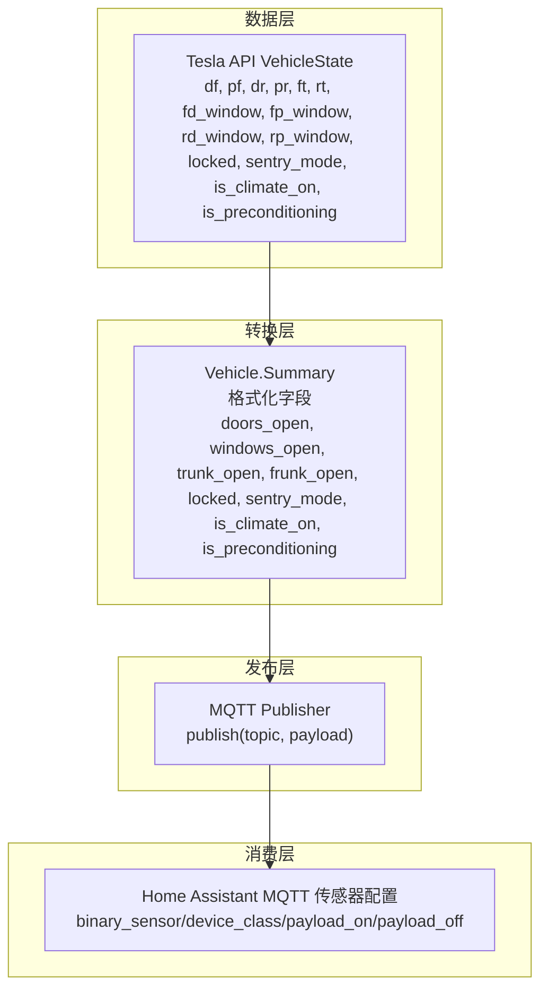
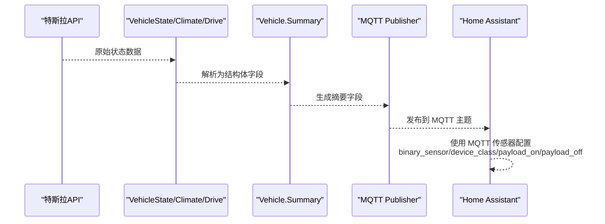
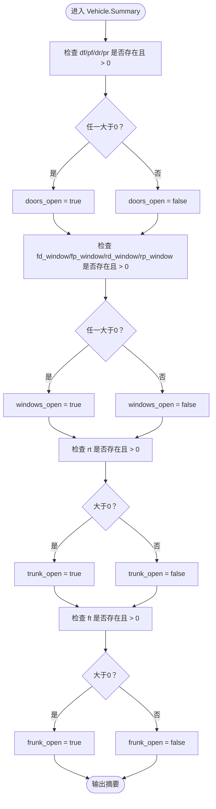
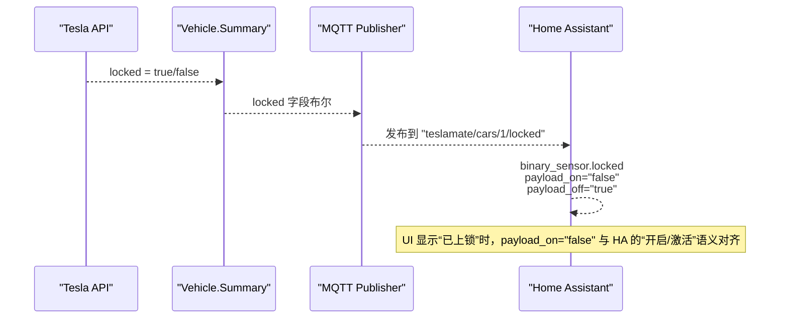
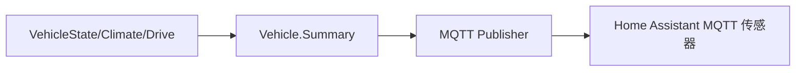

# 车辆状态传感器

<cite>
**本文引用的文件**
- [lib/teslamate/vehicles/vehicle/summary.ex](file://lib/teslamate/vehicles/vehicle/summary.ex)
- [lib/tesla_api/vehicle/state.ex](file://lib/tesla_api/vehicle/state.ex)
- [website/docs/integrations/mqtt.md](file://website/docs/integrations/mqtt.md)
- [website/docs/integrations/home_assistant.md](file://website/docs/integrations/home_assistant.md)
- [lib/teslamate/mqtt/publisher.ex](file://lib/teslamate/mqtt/publisher.ex)
- [lib/teslamate/vehicles/vehicle.ex](file://lib/teslamate/vehicles/vehicle.ex)
- [website/docs/integrations/home_assistant.md](file://website/docs/integrations/home_assistant.md)
</cite>

## 目录
1. [简介](#简介)
2. [项目结构](#项目结构)
3. [核心组件](#核心组件)
4. [架构总览](#架构总览)
5. [详细组件分析](#详细组件分析)
6. [依赖关系分析](#依赖关系分析)
7. [性能考量](#性能考量)
8. [故障排查指南](#故障排查指南)
9. [结论](#结论)
10. [附录](#附录)

## 简介
本文件面向使用 TeslaMate 的用户与集成开发者，系统性说明车辆状态传感器的实现与用法，重点覆盖：
- 车门、车窗、后备箱、前备箱等二进制传感器的来源与计算方式
- Locked（车门锁）传感器的“反向逻辑”设计：payload_on 为 "false"、payload_off 为 "true"，以正确映射特斯拉 API 的布尔语义
- Doors Open、Windows Open、Trunk Open、Frunk Open 等传感器的 device_class 配置（door、window、opening）及其用途
- Sentry Mode（哨兵模式）、Is Climate On（空调开启）、Is Preconditioning（预调节）等状态传感器的应用场景
- 在 Home Assistant 中基于这些传感器创建自动化（如车门未关提醒、哨兵模式开启通知）

## 项目结构
TeslaMate 将来自特斯拉 API 的原始状态数据转换为统一的摘要结构，并通过 MQTT 发布到 Home Assistant。关键路径如下：
- 数据来源：Tesla API VehicleState/Climate/Drive 结构体
- 数据转换：Vehicle.Summary 模块将原始字段映射为统一摘要
- 发布通道：MQTT Publisher 将摘要字段发布到主题
- HA 集成：Home Assistant 使用 MQTT 传感器配置文件订阅并渲染

图表来源
- [lib/tesla_api/vehicle/state.ex](file://lib/tesla_api/vehicle/state.ex#L276-L395)
- [lib/teslamate/vehicles/vehicle/summary.ex](file://lib/teslamate/vehicles/vehicle/summary.ex#L121-L152)
- [lib/teslamate/mqtt/publisher.ex](file://lib/teslamate/mqtt/publisher.ex#L20-L53)
- [website/docs/integrations/home_assistant.md](file://website/docs/integrations/home_assistant.md#L578-L694)

章节来源
- [lib/tesla_api/vehicle/state.ex](file://lib/tesla_api/vehicle/state.ex#L276-L395)
- [lib/teslamate/vehicles/vehicle/summary.ex](file://lib/teslamate/vehicles/vehicle/summary.ex#L121-L152)
- [lib/teslamate/mqtt/publisher.ex](file://lib/teslamate/mqtt/publisher.ex#L20-L53)
- [website/docs/integrations/home_assistant.md](file://website/docs/integrations/home_assistant.md#L578-L694)

## 核心组件
- 车辆状态结构体（VehicleState）
  - 字段包含 df、pf、dr、pr（车门开度）、ft、rt（前备箱/后备箱开度）、fd_window、fp_window、rd_window、rp_window（车窗开度）、locked、sentry_mode、is_climate_on、is_preconditioning 等
- 车辆状态摘要（Vehicle.Summary）
  - 将上述原始字段转换为统一摘要字段：doors_open、windows_open、trunk_open、frunk_open、locked、sentry_mode、is_climate_on、is_preconditioning
- MQTT 发布器（Publisher）
  - 提供 publish(topic, msg, opts) 接口，负责将摘要字段发布到 MQTT 主题
- Home Assistant MQTT 传感器配置
  - 为二进制传感器设置 device_class 与 payload_on/payload_off，确保 UI 与自动化行为符合预期

章节来源
- [lib/tesla_api/vehicle/state.ex](file://lib/tesla_api/vehicle/state.ex#L276-L395)
- [lib/teslamate/vehicles/vehicle/summary.ex](file://lib/teslamate/vehicles/vehicle/summary.ex#L121-L152)
- [lib/teslamate/mqtt/publisher.ex](file://lib/teslamate/mqtt/publisher.ex#L20-L53)
- [website/docs/integrations/home_assistant.md](file://website/docs/integrations/home_assistant.md#L578-L694)

## 架构总览
下图展示从特斯拉 API 到 Home Assistant 的完整链路，以及二进制传感器的关键配置点。

图表来源
- [lib/tesla_api/vehicle/state.ex](file://lib/tesla_api/vehicle/state.ex#L276-L395)
- [lib/teslamate/vehicles/vehicle/summary.ex](file://lib/teslamate/vehicles/vehicle/summary.ex#L121-L152)
- [lib/teslamate/mqtt/publisher.ex](file://lib/teslamate/mqtt/publisher.ex#L20-L53)
- [website/docs/integrations/home_assistant.md](file://website/docs/integrations/home_assistant.md#L578-L694)

## 详细组件分析

### 二进制传感器：车门、车窗、后备箱、前备箱
- 计算逻辑
  - 车门：当 df、pf、dr、pr 任一数值大于 0 时，视为“门打开”
  - 车窗：当 fd_window、fp_window、rd_window、rp_window 任一数值大于 0 时，视为“窗户打开”
  - 后备箱/前备箱：当 rt、ft 数值大于 0 时，分别对应“后备箱打开”、“前备箱打开”
- 输出字段
  - doors_open、windows_open、trunk_open、frunk_open 均为布尔型摘要字段
- Home Assistant 配置
  - 二进制传感器使用 device_class：door、window、opening，payload_on 为 "true"、payload_off 为 "false"

图表来源
- [lib/teslamate/vehicles/vehicle/summary.ex](file://lib/teslamate/vehicles/vehicle/summary.ex#L170-L218)

章节来源
- [lib/teslamate/vehicles/vehicle/summary.ex](file://lib/teslamate/vehicles/vehicle/summary.ex#L170-L218)
- [website/docs/integrations/home_assistant.md](file://website/docs/integrations/home_assistant.md#L599-L641)

### 二进制传感器：Locked（车门锁）——反向逻辑
- 设计背景
  - 特斯拉 API 的 locked 字段为布尔值，true 表示“已上锁”，false 表示“未上锁”
  - 但在 Home Assistant 的二进制传感器中，通常约定 payload_on 表示“开启/激活”，payload_off 表示“关闭/未激活”
  - 因此 TeslaMate 对 Locked 采用“反向逻辑”：payload_on 为 "false"、payload_off 为 "true"，使 HA 的 UI 与直觉一致（锁图标亮起表示“已上锁”）
- 实现位置
  - MQTT 主题：teslamate/cars/{car_id}/locked
  - HA 配置：device_class: lock；payload_on: "false"；payload_off: "true"

图表来源
- [lib/tesla_api/vehicle/state.ex](file://lib/tesla_api/vehicle/state.ex#L337-L393)
- [lib/teslamate/vehicles/vehicle/summary.ex](file://lib/teslamate/vehicles/vehicle/summary.ex#L129-L133)
- [website/docs/integrations/home_assistant.md](file://website/docs/integrations/home_assistant.md#L578-L587)

章节来源
- [lib/tesla_api/vehicle/state.ex](file://lib/tesla_api/vehicle/state.ex#L337-L393)
- [lib/teslamate/vehicles/vehicle/summary.ex](file://lib/teslamate/vehicles/vehicle/summary.ex#L129-L133)
- [website/docs/integrations/home_assistant.md](file://website/docs/integrations/home_assistant.md#L578-L587)

### 二进制传感器：Sentry Mode（哨兵模式）
- 来源：VehicleState.sentry_mode
- 输出：teslamate/cars/{car_id}/sentry_mode
- HA 配置：device_class 可按需设置；payload_on 为 "true"、payload_off 为 "false"
- 应用场景：安全监控、记录状态变化用于自动化触发（如夜间哨兵模式开启通知）

章节来源
- [lib/tesla_api/vehicle/state.ex](file://lib/tesla_api/vehicle/state.ex#L375-L383)
- [lib/teslamate/vehicles/vehicle/summary.ex](file://lib/teslamate/vehicles/vehicle/summary.ex#L131-L133)
- [website/docs/integrations/home_assistant.md](file://website/docs/integrations/home_assistant.md#L588-L597)

### 二进制传感器：Is Climate On（空调开启）、Is Preconditioning（预调节）
- 来源：Climate.is_climate_on、Climate.is_preconditioning
- 输出：teslamate/cars/{car_id}/is_climate_on、teslamate/cars/{car_id}/is_preconditioning
- HA 配置：payload_on 为 "true"、payload_off 为 "false"
- 应用场景：避免在空调运行或预调节期间执行某些操作（如休眠），或用于能耗监控与提醒

章节来源
- [lib/tesla_api/vehicle/state.ex](file://lib/tesla_api/vehicle/state.ex#L96-L165)
- [lib/teslamate/vehicles/vehicle.ex](file://lib/teslamate/vehicles/vehicle.ex#L1498-L1534)
- [lib/teslamate/vehicles/vehicle/summary.ex](file://lib/teslamate/vehicles/vehicle/summary.ex#L122-L126)
- [website/docs/integrations/home_assistant.md](file://website/docs/integrations/home_assistant.md#L653-L672)

### device_class 的用途与意义
- door：用于“门”类设备，便于 Home Assistant 识别与 UI 呈现
- window：用于“窗”类设备
- opening：用于“可开启部件”，如后备箱、前备箱、充电口盖
- lock：用于“锁”类设备，配合 payload_on/payload_off 的反向逻辑，使 UI 与直觉一致

章节来源
- [website/docs/integrations/home_assistant.md](file://website/docs/integrations/home_assistant.md#L599-L641)
- [website/docs/integrations/home_assistant.md](file://website/docs/integrations/home_assistant.md#L578-L587)

### 在 Home Assistant 中使用传感器创建自动化
以下为常见自动化思路与参考配置（基于 MQTT 主题与 HA 传感器配置）：
- 车门/窗户/后备箱/前备箱未关提醒
  - 触发条件：监听 teslamate/cars/{car_id}/doors_open、windows_open、trunk_open、frunk_open 的 "true" 消息
  - 延迟通知：等待一段时间后发送通知，避免瞬时误报
  - 关闭即取消：监听对应 "false" 消息后停止通知
- 夜间未插电提醒
  - 触发条件：时间到达设定时刻，且 teslamate/cars/{car_id}/plugged_in 为 "false"
  - 动作：发送通知，携带电量与续航信息

章节来源
- [website/docs/integrations/home_assistant.md](file://website/docs/integrations/home_assistant.md#L925-L1058)

## 依赖关系分析
- VehicleState/Climate/Drive 作为数据模型，定义了所有可用的状态字段
- Vehicle.Summary 将这些字段映射为统一摘要，是 MQTT 发布与 HA 集成的桥梁
- MQTT Publisher 负责将摘要字段发布到 MQTT 主题
- Home Assistant 的 MQTT 传感器配置决定二进制传感器的 UI 与自动化行为

图表来源
- [lib/tesla_api/vehicle/state.ex](file://lib/tesla_api/vehicle/state.ex#L276-L395)
- [lib/teslamate/vehicles/vehicle/summary.ex](file://lib/teslamate/vehicles/vehicle/summary.ex#L121-L152)
- [lib/teslamate/mqtt/publisher.ex](file://lib/teslamate/mqtt/publisher.ex#L20-L53)
- [website/docs/integrations/home_assistant.md](file://website/docs/integrations/home_assistant.md#L578-L694)

章节来源
- [lib/tesla_api/vehicle/state.ex](file://lib/tesla_api/vehicle/state.ex#L276-L395)
- [lib/teslamate/vehicles/vehicle/summary.ex](file://lib/teslamate/vehicles/vehicle/summary.ex#L121-L152)
- [lib/teslamate/mqtt/publisher.ex](file://lib/teslamate/mqtt/publisher.ex#L20-L53)
- [website/docs/integrations/home_assistant.md](file://website/docs/integrations/home_assistant.md#L578-L694)

## 性能考量
- 传感器字段均为布尔型摘要，发布频率受上游状态更新影响，建议在 HA 中合理配置实体显示与历史记录策略
- MQTT QoS 与 retain 策略由发布端控制，注意避免过多 retain 消息占用资源
- 自动化触发应考虑去抖动与延迟，避免频繁通知

[本节为通用指导，不直接分析具体文件]

## 故障排查指南
- 传感器值不符合预期
  - 检查 VehicleState 原始字段是否为空或非数值（如 nil 或 :unknown）
  - 确认 Vehicle.Summary 的映射逻辑是否适用当前车辆类型
- HA 二进制传感器显示异常
  - 确认 payload_on/payload_off 与 device_class 配置是否正确
  - 对于 Locked 传感器，确认其反向逻辑配置
- MQTT 未收到消息
  - 检查 MQTT Publisher 的连接状态与权限
  - 确认 HA 的 MQTT 配置与主题前缀一致

章节来源
- [lib/teslamate/vehicles/vehicle/summary.ex](file://lib/teslamate/vehicles/vehicle/summary.ex#L170-L218)
- [website/docs/integrations/home_assistant.md](file://website/docs/integrations/home_assistant.md#L578-L694)
- [lib/teslamate/mqtt/publisher.ex](file://lib/teslamate/mqtt/publisher.ex#L20-L53)

## 结论
TeslaMate 通过 Vehicle.Summary 将特斯拉 API 的多源状态统一为一组易于消费的摘要字段，并通过 MQTT 发布到 Home Assistant。二进制传感器的 device_class 与 payload_on/payload_off 配置确保了 UI 与自动化行为的一致性，尤其是 Locked 传感器采用反向逻辑以贴合 HA 的“开启/激活”语义。结合 Doors/Windows/Trunk/Frunk、Sentry Mode、Is Climate On、Is Preconditioning 等传感器，用户可以构建完善的车辆状态监控与自动化体系。

[本节为总结，不直接分析具体文件]

## 附录
- MQTT 主题与字段对照（节选）
  - locked、sentry_mode、windows_open、doors_open、trunk_open、frunk_open、is_climate_on、is_preconditioning
- HA 传感器配置要点
  - binary_sensor 的 device_class 与 payload_on/payload_off
  - 与自动化联动的触发条件与动作模板

章节来源
- [website/docs/integrations/mqtt.md](file://website/docs/integrations/mqtt.md#L39-L55)
- [website/docs/integrations/home_assistant.md](file://website/docs/integrations/home_assistant.md#L578-L694)