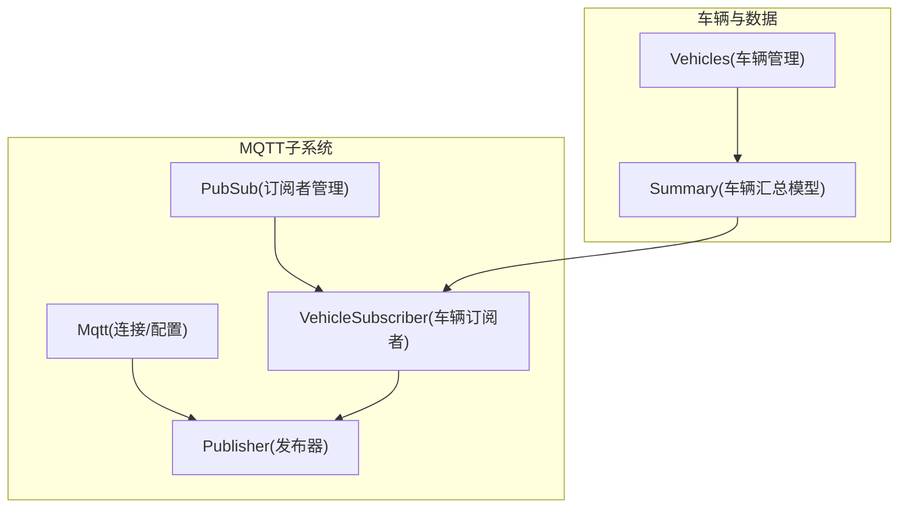
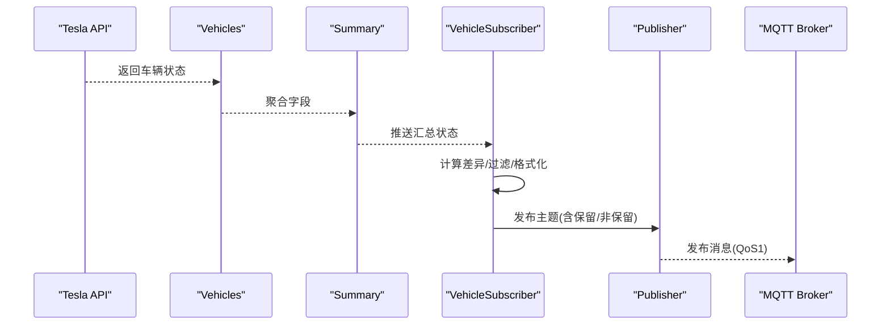
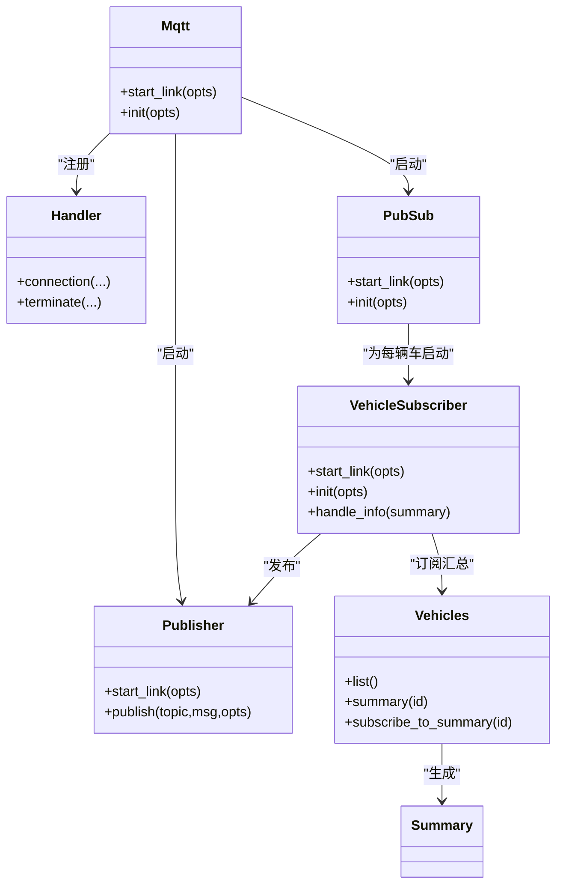

# MQTT数据桥接自动化

<cite>
**本文引用的文件列表**
- [mqtt.ex](file://lib/teslamate/mqtt.ex)
- [handler.ex](file://lib/teslamate/mqtt/handler.ex)
- [publisher.ex](file://lib/teslamate/mqtt/publisher.ex)
- [pubsub.ex](file://lib/teslamate/mqtt/pubsub.ex)
- [vehicle_subscriber.ex](file://lib/teslamate/mqtt/pubsub/vehicle_subscriber.ex)
- [vehicles.ex](file://lib/teslamate/vehicles.ex)
- [summary.ex](file://lib/teslamate/vehicles/vehicle/summary.ex)
- [runtime.exs](file://config/runtime.exs)
- [config.exs](file://config/config.exs)
- [mqtt.md](file://website/docs/integrations/mqtt.md)
- [home_assistant.md](file://website/docs/integrations/home_assistant.md)
- [vehicle_subscriber_test.exs](file://test/teslamate/mqtt/pubsub/vehicle_subscriber_test.exs)
</cite>

## 目录
1. [简介](#简介)
2. [项目结构](#项目结构)
3. [核心组件](#核心组件)
4. [架构总览](#架构总览)
5. [详细组件分析](#详细组件分析)
6. [依赖关系分析](#依赖关系分析)
7. [性能考量](#性能考量)
8. [故障排查指南](#故障排查指南)
9. [结论](#结论)
10. [附录：Home Assistant自动化示例与最佳实践](#附录home-assistant自动化示例与最佳实践)

## 简介
本文件面向在Home Assistant中通过MQTT消费TeslaMate数据的用户，提供一套完整的“MQTT数据桥接自动化”方案。目标是将TeslaMate通过MQTT发布的主题（如teslamate/cars/1/battery_level）映射到Home Assistant的传感器实体（如sensor.tesla_battery_level），并解释JSON属性提取、模板渲染与状态转换的最佳实践；同时给出错误处理机制（网络中断时的重试策略）与性能优化建议（事件驱动替代轮询）。

## 项目结构
TeslaMate的MQTT发布链路由以下模块组成：
- 连接与配置：MQTT连接、TLS/IPv6、用户名密码等参数由运行时环境变量注入
- 发布器：统一的发布接口，支持QoS 0/1与超时控制
- 订阅者：按车辆实例订阅汇总状态，计算并发布MQTT主题
- 车辆汇总模型：从Tesla API抽取字段，格式化为MQTT可消费的键值对

图表来源
- [mqtt.ex](file://lib/teslamate/mqtt.ex#L1-L65)
- [publisher.ex](file://lib/teslamate/mqtt/publisher.ex#L1-L53)
- [pubsub.ex](file://lib/teslamate/mqtt/pubsub.ex#L1-L22)
- [vehicle_subscriber.ex](file://lib/teslamate/mqtt/pubsub/vehicle_subscriber.ex#L1-L217)
- [vehicles.ex](file://lib/teslamate/vehicles.ex#L1-L143)
- [summary.ex](file://lib/teslamate/vehicles/vehicle/summary.ex#L1-L251)

章节来源
- [mqtt.ex](file://lib/teslamate/mqtt.ex#L1-L65)
- [publisher.ex](file://lib/teslamate/mqtt/publisher.ex#L1-L53)
- [pubsub.ex](file://lib/teslamate/mqtt/pubsub.ex#L1-L22)
- [vehicle_subscriber.ex](file://lib/teslamate/mqtt/pubsub/vehicle_subscriber.ex#L1-L217)
- [vehicles.ex](file://lib/teslamate/vehicles.ex#L1-L143)
- [summary.ex](file://lib/teslamate/vehicles/vehicle/summary.ex#L1-L251)

## 核心组件
- MQTT连接与配置
  - 通过运行时配置加载MQTT主机、端口、用户名、密码、TLS、IPv6、命名空间等参数
  - 使用Tortoise311建立连接，注册自定义Handler记录连接状态
- 发布器
  - 提供同步发布接口，支持QoS 0/1；QoS>0时跟踪返回结果
  - 统一超时控制，避免阻塞
- 订阅者管理
  - 按车辆启动独立订阅者，订阅车辆汇总状态
- 车辆订阅者
  - 将Summary中的字段映射为MQTT主题，按需保留消息
  - 对位置、活动路线等复杂字段进行JSON编码
  - 对时间戳进行ISO8601格式化
  - 对未知值进行特殊处理（如“nil”或清空保留）

章节来源
- [runtime.exs](file://config/runtime.exs#L168-L178)
- [mqtt.ex](file://lib/teslamate/mqtt.ex#L1-L65)
- [handler.ex](file://lib/teslamate/mqtt/handler.ex#L1-L28)
- [publisher.ex](file://lib/teslamate/mqtt/publisher.ex#L1-L53)
- [pubsub.ex](file://lib/teslamate/mqtt/pubsub.ex#L1-L22)
- [vehicle_subscriber.ex](file://lib/teslamate/mqtt/pubsub/vehicle_subscriber.ex#L1-L217)
- [vehicles.ex](file://lib/teslamate/vehicles.ex#L1-L143)
- [summary.ex](file://lib/teslamate/vehicles/vehicle/summary.ex#L1-L251)

## 架构总览
MQTT发布流程的关键路径如下：

图表来源
- [vehicles.ex](file://lib/teslamate/vehicles.ex#L1-L143)
- [summary.ex](file://lib/teslamate/vehicles/vehicle/summary.ex#L1-L251)
- [vehicle_subscriber.ex](file://lib/teslamate/mqtt/pubsub/vehicle_subscriber.ex#L62-L102)
- [publisher.ex](file://lib/teslamate/mqtt/publisher.ex#L20-L53)

章节来源
- [vehicles.ex](file://lib/teslamate/vehicles.ex#L1-L143)
- [summary.ex](file://lib/teslamate/vehicles/vehicle/summary.ex#L1-L251)
- [vehicle_subscriber.ex](file://lib/teslamate/mqtt/pubsub/vehicle_subscriber.ex#L62-L102)
- [publisher.ex](file://lib/teslamate/mqtt/publisher.ex#L20-L53)

## 详细组件分析

### MQTT连接与配置
- 运行时配置
  - 通过环境变量注入MQTT_HOST、MQTT_PORT、MQTT_USERNAME、MQTT_PASSWORD、MQTT_TLS、MQTT_TLS_ACCEPT_INVALID_CERTS、MQTT_NAMESPACE、MQTT_IPV6等
  - 支持IPv6与TLS，证书校验可选择跳过
- 连接初始化
  - 使用Tortoise311建立连接，注册Handler用于记录连接状态
  - 未显式设置订阅列表，订阅由VehicleSubscriber负责

章节来源
- [runtime.exs](file://config/runtime.exs#L168-L178)
- [mqtt.ex](file://lib/teslamate/mqtt.ex#L1-L65)
- [handler.ex](file://lib/teslamate/mqtt/handler.ex#L1-L28)

### 发布器（Publisher）
- 功能
  - 提供publish调用接口，内部根据QoS决定是否跟踪ref
  - QoS=0直接发布；QoS>0时等待回调并回复调用方
  - 统一超时控制，避免阻塞
- 错误处理
  - 异步流发布失败会记录警告日志

章节来源
- [publisher.ex](file://lib/teslamate/mqtt/publisher.ex#L1-L53)

### 订阅者管理（PubSub）
- 功能
  - 启动时枚举所有车辆，为每辆车启动一个VehicleSubscriber
  - 策略为one_for_one，保证单个订阅者失败不影响其他车辆

章节来源
- [pubsub.ex](file://lib/teslamate/mqtt/pubsub.ex#L1-L22)
- [vehicles.ex](file://lib/teslamate/vehicles.ex#L1-L143)

### 车辆订阅者（VehicleSubscriber）
- 数据来源
  - 订阅Vehicles提供的车辆汇总状态
- 数据映射与发布
  - 从Summary中提取简单字段，组合位置、地理围栏、活动路线等复杂字段
  - 对时间戳进行ISO8601格式化
  - 对未知值采用“nil”字符串或清空保留消息的方式清理旧值
  - 仅在值变化或需要时发布，避免冗余
- 主题命名
  - 默认主题前缀为teslamate/{namespace}/cars/{car_id}/{key}
  - 对部分键（如location、active_route）发布JSON内容
  - 部分键保留（retain=true），部分不保留（如healthy）

章节来源
- [vehicle_subscriber.ex](file://lib/teslamate/mqtt/pubsub/vehicle_subscriber.ex#L1-L217)
- [summary.ex](file://lib/teslamate/vehicles/vehicle/summary.ex#L1-L251)

### 车辆汇总模型（Summary）
- 字段来源
  - 来自Tesla API的drive_state、charge_state、vehicle_state等
- 字段格式化
  - 速度、里程、范围等单位换算
  - 状态枚举与布尔值处理
  - 时间戳转ISO8601
- 变更检测
  - 通过比较上一次值决定是否发布

章节来源
- [summary.ex](file://lib/teslamate/vehicles/vehicle/summary.ex#L1-L251)

## 依赖关系分析
- 组件耦合
  - VehicleSubscriber依赖Vehicles与Publisher
  - Publisher依赖Tortoise311
  - Mqtt负责连接与Handler注册
- 外部依赖
  - MQTT Broker（由环境变量配置）
  - Tesla API（通过Vehicles间接消费）

图表来源
- [mqtt.ex](file://lib/teslamate/mqtt.ex#L1-L65)
- [handler.ex](file://lib/teslamate/mqtt/handler.ex#L1-L28)
- [publisher.ex](file://lib/teslamate/mqtt/publisher.ex#L1-L53)
- [pubsub.ex](file://lib/teslamate/mqtt/pubsub.ex#L1-L22)
- [vehicle_subscriber.ex](file://lib/teslamate/mqtt/pubsub/vehicle_subscriber.ex#L1-L217)
- [vehicles.ex](file://lib/teslamate/vehicles.ex#L1-L143)
- [summary.ex](file://lib/teslamate/vehicles/vehicle/summary.ex#L1-L251)

章节来源
- [mqtt.ex](file://lib/teslamate/mqtt.ex#L1-L65)
- [publisher.ex](file://lib/teslamate/mqtt/publisher.ex#L1-L53)
- [pubsub.ex](file://lib/teslamate/mqtt/pubsub.ex#L1-L22)
- [vehicle_subscriber.ex](file://lib/teslamate/mqtt/pubsub/vehicle_subscriber.ex#L1-L217)
- [vehicles.ex](file://lib/teslamate/vehicles.ex#L1-L143)
- [summary.ex](file://lib/teslamate/vehicles/vehicle/summary.ex#L1-L251)

## 性能考量
- 事件驱动优于轮询
  - TeslaMate通过MQTT事件推送数据，Home Assistant侧应使用MQTT传感器与设备追踪，避免轮询Tesla API
- 并发与限流
  - VehicleSubscriber内部使用异步流并发发布，最大并发受max_concurrency限制，避免阻塞
- 压缩与保留策略
  - 部分键保留（retain）以减少客户端首次连接时的等待；对不再使用的键发布空值以清理旧保留
- QoS与超时
  - 发布默认QoS=1，确保可靠性；发布器设置统一超时，避免阻塞

章节来源
- [vehicle_subscriber.ex](file://lib/teslamate/mqtt/pubsub/vehicle_subscriber.ex#L82-L102)
- [publisher.ex](file://lib/teslamate/mqtt/publisher.ex#L20-L53)

## 故障排查指南
- 连接问题
  - 检查MQTT连接状态日志（Handler记录连接/断开/终止）
  - 确认MQTT_HOST、MQTT_PORT、MQTT_TLS、MQTT_USERNAME、MQTT_PASSWORD、MQTT_NAMESPACE、MQTT_IPV6配置正确
- 发布失败
  - 发布器对QoS>0的发布会等待回调；若失败会记录警告日志
  - 检查Broker可达性、认证信息与TLS配置
- 数据未更新
  - 确认VehicleSubscriber已订阅到Summary；检查Vehicles是否正常拉取Tesla API
  - 关注“healthy”主题的发布行为，它可能被保留或清空以清理旧值
- 主题命名与命名空间
  - 若设置了MQTT_NAMESPACE，主题前缀会包含该命名空间（如teslamate/{namespace}/cars/{car_id}/...）

章节来源
- [handler.ex](file://lib/teslamate/mqtt/handler.ex#L1-L28)
- [runtime.exs](file://config/runtime.exs#L168-L178)
- [publisher.ex](file://lib/teslamate/mqtt/publisher.ex#L20-L53)
- [vehicle_subscriber.ex](file://lib/teslamate/mqtt/pubsub/vehicle_subscriber.ex#L1-L217)
- [vehicles.ex](file://lib/teslamate/vehicles.ex#L1-L143)

## 结论
通过上述MQTT发布链路，TeslaMate能够将车辆状态以事件方式推送到MQTT Broker，Home Assistant可基于MQTT传感器与设备追踪实现零轮询的高效数据桥接。结合本文提供的最佳实践（JSON属性提取、模板渲染、状态转换、重试与验证、事件驱动与性能优化），可在Home Assistant中稳定地将teslamate/cars/1/battery_level等主题映射到sensor.tesla_battery_level等实体。

## 附录：Home Assistant自动化示例与最佳实践

### 示例：将teslamate/cars/1/battery_level映射到sensor.tesla_battery_level
- 在Home Assistant中使用MQTT传感器配置，将state_topic指向teslamate/cars/1/battery_level
- 为sensor.tesla_battery_level设置合适的device_class、unit_of_measurement与icon
- 如需从JSON中提取字段，使用json_attributes_topic/json_attributes_template

章节来源
- [home_assistant.md](file://website/docs/integrations/home_assistant.md#L299-L318)
- [mqtt.md](file://website/docs/integrations/mqtt.md#L61-L61)

### JSON属性提取与模板渲染最佳实践
- 使用json_attributes_topic与json_attributes_template从复杂字段（如location、active_route）提取子字段
- 使用value_template进行简单类型转换（如将bar转换为psi）
- 使用availability与value_template控制实体可用性与显示逻辑

章节来源
- [home_assistant.md](file://website/docs/integrations/home_assistant.md#L74-L97)
- [home_assistant.md](file://website/docs/integrations/home_assistant.md#L397-L483)
- [home_assistant.md](file://website/docs/integrations/home_assistant.md#L485-L557)

### 状态转换与实体映射
- 将MQTT主题值映射到Home Assistant实体时，注意device_class与unit_of_measurement的一致性
- 对布尔型字段使用binary_sensor，并设置payload_on/payload_off
- 对时间戳字段使用device_class=timestamp

章节来源
- [home_assistant.md](file://website/docs/integrations/home_assistant.md#L186-L209)
- [home_assistant.md](file://website/docs/integrations/home_assistant.md#L558-L694)

### 错误处理与重试策略
- 网络中断时，MQTT连接状态会被Handler记录；建议在Home Assistant侧使用MQTT availability与availability_template
- 对于临时性错误，可利用MQTT保留消息与VehicleSubscriber的清空逻辑，避免旧值污染
- 发布失败时，发布器会记录警告日志，便于定位问题

章节来源
- [handler.ex](file://lib/teslamate/mqtt/handler.ex#L1-L28)
- [vehicle_subscriber.ex](file://lib/teslamate/mqtt/pubsub/vehicle_subscriber.ex#L27-L39)
- [publisher.ex](file://lib/teslamate/mqtt/publisher.ex#L46-L53)

### 性能优化建议
- 使用事件驱动（MQTT）替代轮询Tesla API，降低系统负载
- 利用VehicleSubscriber的差异发布与异步并发，减少冗余消息
- 合理设置MQTT保留策略，平衡首次连接延迟与实时性

章节来源
- [vehicle_subscriber.ex](file://lib/teslamate/mqtt/pubsub/vehicle_subscriber.ex#L74-L102)
- [publisher.ex](file://lib/teslamate/mqtt/publisher.ex#L20-L53)