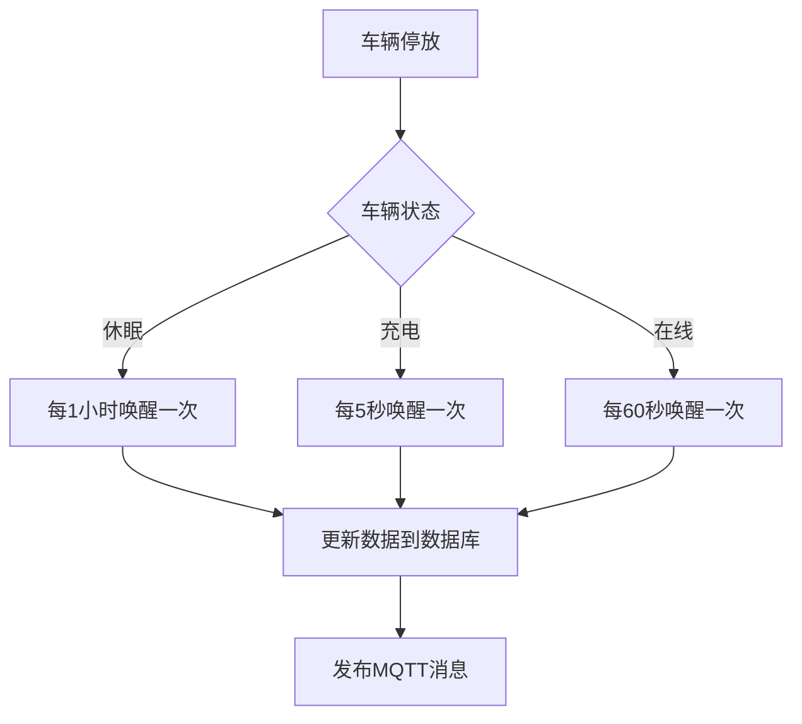
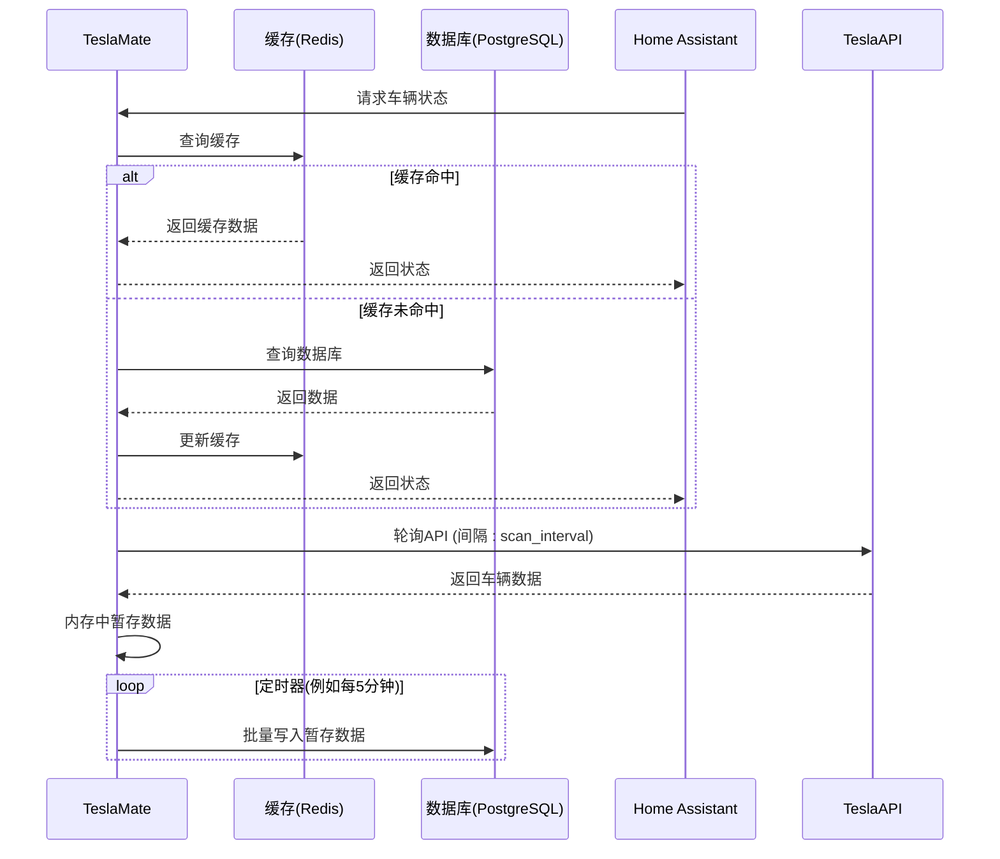
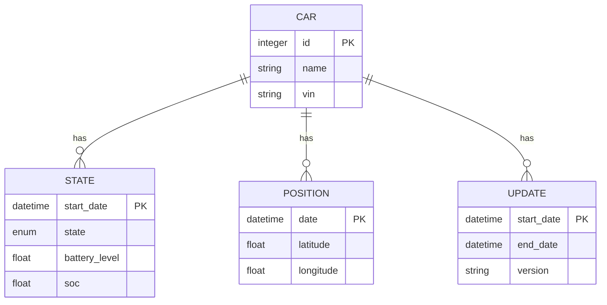

# 性能与电池优化

<cite>
**本文档引用的文件**
- [environment_variables.md](file://website/docs/configuration/environment_variables.md)
- [car_settings.ex](file://lib/teslamate/settings/car_settings.ex)
- [vehicle.ex](file://lib/teslamate/vehicles/vehicle.ex)
- [vehicle_subscriber.ex](file://lib/teslamate/mqtt/pubsub/vehicle_subscriber.ex)
- [mqtt.ex](file://lib/teslamate/mqtt.ex)
- [stream.ex](file://lib/tesla_api/stream.ex)
- [settings.ex](file://lib/teslamate/settings.ex)
- [vampire-drain.json](file://grafana/dashboards/vampire-drain.json)
- [updates.json](file://grafana/dashboards/updates.json)
</cite>

## 目录
1. [引言](#引言)
2. [scan_interval参数与车辆待机耗电](#scan_interval参数与车辆待机耗电)
3. [MQTT消息与Home Assistant状态更新](#mqtt消息与home-assistant状态更新)
4. [数据缓存与批量更新策略](#数据缓存与批量更新策略)
5. [监控指标](#监控指标)
6. [调优工具与诊断命令](#调优工具与诊断命令)
7. [结论](#结论)

## 引言
本指南旨在为TeslaMate用户提供一套全面的性能与电池优化方案。重点分析`scan_interval`参数配置对车辆待机耗电的影响，并提供不同使用场景下的最佳实践。通过深入理解TeslaMate的轮询机制、MQTT通信和数据处理流程，用户可以有效降低车辆的“吸血鬼耗电”（Vampire Drain），同时确保Home Assistant等集成系统的状态更新及时准确。本指南还将介绍关键的监控指标和诊断工具，帮助用户评估和优化系统性能。

## scan_interval参数与车辆待机耗电
`scan_interval`参数（在TeslaMate中对应为`POLLING_*_INTERVAL`环境变量）直接决定了系统向特斯拉API发起查询的频率。这个频率与车辆的待机耗电（即“吸血鬼耗电”）密切相关，因为每次查询都会唤醒车辆，从而消耗电池电量。

TeslaMate根据车辆的实时状态动态调整轮询间隔，以平衡数据新鲜度和电池消耗。核心的轮询间隔环境变量包括：

- **POLLING_ASLEEP_INTERVAL**: 当车辆处于休眠状态时的轮询间隔（默认30秒）。
- **POLLING_CHARGING_INTERVAL**: 当车辆正在充电时的轮询间隔（默认5秒）。
- **POLLING_DRIVING_INTERVAL**: 当车辆正在行驶时的轮询间隔（默认2.5秒）。
- **POLLING_ONLINE_INTERVAL**: 当车辆在线但未行驶时的轮询间隔（默认60秒）。
- **POLLING_DEFAULT_INTERVAL**: 默认轮询间隔（默认15秒）。

### 不同使用场景下的配置建议

#### 日常通勤（推荐配置：POLLING_ASLEEP_INTERVAL=3600）
对于主要在白天使用、夜间长时间停放的日常通勤场景，应将重点放在延长车辆休眠状态下的轮询间隔上。将`POLLING_ASLEEP_INTERVAL`设置为3600秒（1小时）可以显著减少车辆唤醒次数。

**优点**:
- 极大降低待机耗电，有效减少“吸血鬼耗电”。
- 适合对实时性要求不高的用户，如仅需在出门前查看车辆状态。

**缺点**:
- 状态更新延迟高，无法实时监控车辆。
- 如果车辆在轮询间隔内被使用，系统可能需要更长时间才能检测到状态变化。

**图示来源**
- [vehicle.ex](file://lib/teslamate/vehicles/vehicle.ex#L30-L48)
- [stream.ex](file://lib/tesla_api/stream.ex)

**本节来源**
- [environment_variables.md](file://website/docs/configuration/environment_variables.md#L52-L57)
- [vehicle.ex](file://lib/teslamate/vehicles/vehicle.ex#L30-L48)

#### 长途旅行（推荐配置：POLLING_ASLEEP_INTERVAL=900）
在长途旅行中，车辆可能停放在陌生地点，用户对车辆安全和状态的实时性要求更高。此时，应采用一个折中的轮询间隔，如将`POLLING_ASLEEP_INTERVAL`设置为900秒（15分钟）。

**优点**:
- 在可接受的电池消耗范围内，提供更及时的状态更新。
- 能够更快地响应车辆状态变化，如车辆被移动或开始充电。
- 平衡了监控需求和电池保护。

**缺点**:
- 相比1小时的间隔，待机耗电会有所增加。
- 仍不如实时流模式（Streaming API）的数据更新快。

**本节来源**
- [environment_variables.md](file://website/docs/configuration/environment_variables.md#L52-L57)
- [vehicle.ex](file://lib/teslamate/vehicles/vehicle.ex#L30-L48)

## MQTT消息与Home Assistant状态更新
TeslaMate通过MQTT协议将车辆状态发布给Home Assistant。理解两者之间的关系对于优化系统性能至关重要。

### 消息频率与状态更新
MQTT消息的频率直接取决于TeslaMate从特斯拉API获取数据的频率。当`POLLING_ASLEEP_INTERVAL`设置为3600秒时，Home Assistant中的车辆状态（如电量、位置）每小时才会更新一次。这种低频更新虽然节能，但可能导致Home Assistant的UI显示过时信息。

### 减少数据库写入的策略
频繁的API轮询会产生大量数据，导致数据库写入次数激增，这不仅影响数据库性能，也可能间接增加车辆的唤醒负担。为减少数据库写入，可以采用以下策略：

1.  **数据聚合与批处理**：在将数据写入数据库前，对短时间内采集的多个数据点进行聚合。例如，将15分钟内的位置点合并为一条轨迹记录，而不是每条位置都单独写入。
2.  **变更检测**：仅在车辆状态发生实质性变化时才写入数据库。例如，如果电量在两次轮询间仅变化了0.1%，可以忽略此次更新，避免产生大量无意义的写入操作。
3.  **调整轮询策略**：结合使用`use_streaming_api`设置。当`use_streaming_api`启用时，TeslaMate会优先使用特斯拉的流式API来获取实时数据，这比轮询更高效。但在车辆休眠后，流式连接会断开，系统会回退到轮询模式，此时`POLLING_ASLEEP_INTERVAL`的设置就变得尤为关键。

**本节来源**
- [vehicle_subscriber.ex](file://lib/teslamate/mqtt/pubsub/vehicle_subscriber.ex)
- [mqtt.ex](file://lib/teslamate/mqtt.ex)
- [settings.ex](file://lib/teslamate/settings.ex)

## 数据缓存与批量更新策略
为了进一步优化性能，可以实施数据缓存和批量更新策略。

### 数据缓存
在应用层或中间件（如Redis）中缓存车辆的最新状态。当Home Assistant或其他客户端请求数据时，优先从缓存中读取，而不是每次都查询数据库。这可以显著降低数据库的读取压力。

### 批量更新
将多个小的数据库写入操作合并为一个批量操作。例如，TeslaMate可以在内存中暂存一段时间内的所有状态变更，然后在一个数据库事务中一次性提交。这比逐条提交效率更高，能有效减少I/O开销。

**图示来源**
- [vehicle.ex](file://lib/teslamate/vehicles/vehicle.ex)
- [log.ex](file://lib/teslamate/log.ex)

**本节来源**
- [vehicle.ex](file://lib/teslamate/vehicles/vehicle.ex)
- [log.ex](file://lib/teslamate/log.ex)

## 监控指标
为了评估配置效果，用户应监控以下关键指标：

### 每日API调用次数
通过分析TeslaMate的日志，可以统计每日的API调用次数。一个简单的估算方法是：`每日调用次数 ≈ (24 * 60 * 60) / POLLING_ASLEEP_INTERVAL`。例如，当`POLLING_ASLEEP_INTERVAL=3600`时，每天大约调用24次；当`POLLING_ASLEEP_INTERVAL=900`时，每天大约调用96次。调用次数越少，对车辆电池的影响越小。

### 车辆唤醒次数
这是最直接的监控指标。可以通过观察TeslaMate日志中`[info] Fetching vehicle state ...`和`[info] Start / :asleep`等日志条目的频率来估算。日志中明确指出，当车辆成功休眠后，大约21分钟后会进行一次状态获取，这与`POLLING_ASLEEP_INTERVAL`的设置直接相关。

### 吸血鬼耗电监控
Grafana仪表板中的`vampire-drain.json`提供了专门用于监控吸血鬼耗电的视图。通过分析车辆在长时间停放期间的电量变化，可以量化不同`scan_interval`配置对电池的实际影响。

**图示来源**
- [vampire-drain.json](file://grafana/dashboards/vampire-drain.json)
- [updates.json](file://grafana/dashboards/updates.json)

**本节来源**
- [vampire-drain.json](file://grafana/dashboards/vampire-drain.json)
- [updates.json](file://grafana/dashboards/updates.json)

## 调优工具与诊断命令
### 性能分析
- **日志分析**：使用`grep`命令分析TeslaMate容器日志，例如`docker logs teslamate | grep "Fetching vehicle state"`来统计唤醒频率。
- **数据库查询**：直接查询PostgreSQL数据库，使用SQL语句统计特定时间段内的状态记录数量，以验证轮询频率。

### 诊断命令
- **检查MQTT连接**：使用`mosquitto_sub`命令订阅TeslaMate的MQTT主题，实时查看消息发布情况，例如`mosquitto_sub -h <broker> -t "teslamate/cars/+/state" -v`。
- **验证环境变量**：在运行TeslaMate的环境中，使用`printenv | grep POLLING`来确认所有轮询相关的环境变量已正确设置。

**本节来源**
- [environment_variables.md](file://website/docs/configuration/environment_variables.md)
- [vehicle.ex](file://lib/teslamate/vehicles/vehicle.ex)

## 结论
优化TeslaMate的性能与电池消耗是一个权衡实时性与能耗的过程。通过合理配置`scan_interval`（即`POLLING_*_INTERVAL`），用户可以在不同使用场景下找到最佳平衡点。对于日常通勤，建议将`POLLING_ASLEEP_INTERVAL`设置为3600秒以最大限度地节省电量；对于长途旅行，则建议设置为900秒以获得更好的监控体验。结合使用数据缓存、批量更新策略和Grafana监控仪表板，用户可以全面掌控系统性能，有效减少车辆的待机耗电，延长电池寿命。