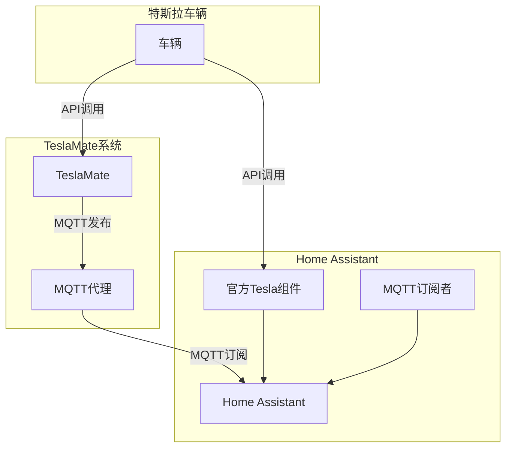
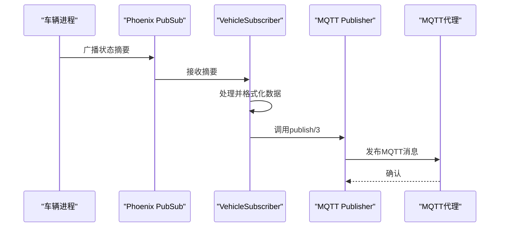

# 混合集成架构

<cite>
**本文档引用的文件**  
- [mqtt.ex](file://lib/teslamate/mqtt.ex)
- [publisher.ex](file://lib/teslamate/mqtt/publisher.ex)
- [vehicle_subscriber.ex](file://lib/teslamate/mqtt/pubsub/vehicle_subscriber.ex)
- [pubsub.ex](file://lib/teslamate/mqtt/pubsub.ex)
- [vehicles.ex](file://lib/teslamate/vehicles.ex)
- [vehicle.ex](file://lib/teslamate/vehicles/vehicle.ex)
- [auth.ex](file://lib/tesla_api/auth.ex)
- [tesla_api.ex](file://lib/tesla_api.ex)
- [runtime.exs](file://config/runtime.exs)
- [home_assistant.md](file://website/docs/integrations/home_assistant.md)
- [mqtt.md](file://website/docs/integrations/mqtt.md)
</cite>

## 目录
1. [引言](#引言)
2. [系统架构概述](#系统架构概述)
3. [TeslaMate与MQTT数据流](#teslamate与mqtt数据流)
4. [Home Assistant官方Tesla组件集成](#home-assistant官方tesla组件集成)
5. [身份验证机制并行工作原理](#身份验证机制并行工作原理)
6. [数据一致性维护策略](#数据一致性维护策略)
7. [故障转移机制与状态同步](#故障转移机制与状态同步)
8. [性能优化与待机功耗管理](#性能优化与待机功耗管理)
9. [结论](#结论)

## 引言

本文档详细阐述了TeslaMate与Home Assistant官方Tesla组件的混合集成架构。该架构通过结合两种系统的优点，实现了高频率数据采集与低功耗监控的平衡。TeslaMate通过MQTT协议提供高刷新率的车辆数据，而Home Assistant官方组件则配置为低频轮询（scan_interval为3600秒），以减少车辆待机时的电量消耗。这种混合模式确保了数据的实时性，同时最大限度地延长了车辆在停放状态下的电池续航时间。

## 系统架构概述

混合集成架构的核心在于数据流的分层处理。特斯拉车辆首先通过官方API与TeslaMate通信，TeslaMate作为数据聚合和处理中心，将实时车辆状态通过MQTT协议发布到MQTT代理。同时，Home Assistant通过其官方Tesla组件以较低频率直接与特斯拉API通信，获取车辆的基本状态。Home Assistant作为智能家居平台，订阅MQTT主题以获取高频率数据，并将两种数据源进行融合，为用户提供全面、实时的车辆监控体验。



**图示来源**
- [mqtt.ex](file://lib/teslamate/mqtt.ex#L1-L65)
- [vehicle_subscriber.ex](file://lib/teslamate/mqtt/pubsub/vehicle_subscriber.ex#L1-L102)
- [home_assistant.md](file://website/docs/integrations/home_assistant.md#L60-L694)

## TeslaMate与MQTT数据流

TeslaMate通过其内置的MQTT模块，将车辆的详细状态信息以高频率发布到MQTT代理。该模块由`TeslaMate.Mqtt`监督进程启动，包含一个`Tortoise311.Connection`用于连接MQTT代理，一个`Publisher`用于发布消息，以及一个`PubSub`用于管理车辆订阅者。

车辆数据的发布流程如下：`TeslaMate.Vehicles`模块管理所有车辆的GenServer进程。每个车辆进程（`TeslaMate.Vehicles.Vehicle`）在状态变化时，会通过`Phoenix.PubSub`广播其摘要信息（Summary）。`TeslaMate.Mqtt.PubSub.VehicleSubscriber`作为订阅者，监听这些摘要信息，并将其转换为MQTT消息发布到相应的主题。



**图示来源**
- [vehicles.ex](file://lib/teslamate/vehicles.ex#L1-L143)
- [vehicle.ex](file://lib/teslamate/vehicles/vehicle.ex#L1-L247)
- [vehicle_subscriber.ex](file://lib/teslamate/mqtt/pubsub/vehicle_subscriber.ex#L1-L102)
- [publisher.ex](file://lib/teslamate/mqtt/publisher.ex#L1-L53)

### MQTT主题与数据格式

TeslaMate发布的MQTT主题遵循`teslamate/cars/$car_id/attribute`的命名规范，其中`$car_id`是车辆在TeslaMate数据库中的唯一ID。例如，车辆1的电池电量主题为`teslamate/cars/1/battery_level`。

根据文档`website/docs/integrations/mqtt.md`，TeslaMate发布超过80个不同的数据点，涵盖车辆状态、位置、充电、气候、轮胎压力等多个方面。关键主题包括：
- `state`: 车辆当前状态（如`online`, `asleep`, `charging`）
- `battery_level`: 电池电量百分比
- `power`: 当前电池功率（瓦特）
- `speed`: 当前速度（km/h）
- `location`: 包含经纬度的JSON对象
- `charging_state`: 充电状态

发布策略上，TeslaMate对大多数主题使用`retain: true`，确保新订阅者能立即获取最新状态。但`healthy`主题例外，使用`retain: false`以防止陈旧的健康状态误导用户。

**本节来源**
- [vehicle_subscriber.ex](file://lib/teslamate/mqtt/pubsub/vehicle_subscriber.ex#L57-L102)
- [mqtt.md](file://website/docs/integrations/mqtt.md#L1-L88)

## Home Assistant官方Tesla组件集成

Home Assistant通过其官方的Tesla集成组件与特斯拉API直接通信。该组件的主要作用是提供基础的车辆控制功能（如充电、空调、锁定）和低频状态轮询。

在混合架构中，官方组件的`scan_interval`被配置为3600秒（1小时）。这意味着Home Assistant每小时才向特斯拉API发起一次轮询请求，极大地减少了API调用频率和车辆的唤醒次数，从而显著降低了待机功耗。

高频率的监控数据则完全依赖于TeslaMate通过MQTT提供的数据流。Home Assistant通过MQTT集成订阅TeslaMate发布的所有相关主题，并将这些数据转换为Home Assistant中的传感器（sensor）、二进制传感器（binary_sensor）和设备追踪器（device_tracker）实体。

```yaml
# 示例：在Home Assistant中通过MQTT创建传感器
- sensor:
    name: 电池电量
    state_topic: "teslamate/cars/1/battery_level"
    unit_of_measurement: "%"
    device_class: battery
```

这种集成方式将Home Assistant从高频率数据采集的负担中解放出来，使其成为一个纯粹的数据消费者和展示平台，而将复杂的数据采集和处理任务交给专门为此优化的TeslaMate。

**本节来源**
- [home_assistant.md](file://website/docs/integrations/home_assistant.md#L60-L694)
- [runtime.exs](file://config/runtime.exs#L168-L178)

## 身份验证机制并行工作原理

在混合集成架构中，TeslaMate和Home Assistant官方组件各自维护独立的身份验证会话，实现了身份验证机制的并行工作。

**TeslaMate身份验证**:
TeslaMate使用`TeslaApi.Auth`模块处理身份验证。它通过OAuth 2.0流程获取访问令牌（access token）和刷新令牌（refresh token）。这些令牌被加密存储在TeslaMate的数据库中（`tokens`表），并由`TeslaMate.Auth`上下文管理。`TeslaApi`客户端使用`TokenAuth`中间件，在每次API请求时自动附加有效的访问令牌。

**Home Assistant官方组件身份验证**:
Home Assistant官方Tesla组件同样使用OAuth 2.0流程，但它在Home Assistant的配置中独立存储其自己的访问令牌和刷新令牌。这些凭据与TeslaMate的凭据完全隔离，互不影响。

这种并行机制的关键优势在于：
1. **故障隔离**：一个系统的认证失败不会影响另一个系统。
2. **独立性**：两个系统可以独立进行认证刷新，互不干扰。
3. **安全性**：凭据分离降低了单点故障的风险。

两个系统通过各自的认证会话，独立地从特斯拉API获取数据，确保了数据源的独立性和可靠性。

**本节来源**
- [auth.ex](file://lib/tesla_api/auth.ex#L1-L99)
- [tesla_api.ex](file://lib/tesla_api.ex#L1-L18)
- [auth.ex](file://lib/teslamate/auth.ex#L1-L72)

## 数据一致性维护策略

尽管数据来自两个独立的系统，但混合架构通过精心设计的策略确保了数据的一致性。

**数据源优先级**:
在Home Assistant中，通过MQTT从TeslaMate获取的数据被视为主要数据源。官方组件提供的数据主要用于验证和作为后备。

**状态同步**:
`TeslaMate.Vehicles.Vehicle`进程内部维护了车辆的完整状态机。当车辆状态发生变化（如从`asleep`变为`online`），该进程会立即更新其内部状态，并通过`Phoenix.PubSub`广播新的摘要。`VehicleSubscriber`捕获此变化并立即发布到MQTT，确保状态变更的实时传播。

**数据完整性**:
TeslaMate在车辆离线时会继续发布其最后已知状态。对于某些可能为空的字段（如`active_route`），TeslaMate会明确发布`nil`值，而不是不发布，这保证了数据结构的完整性，避免了Home Assistant中实体状态的不确定性。

**时间戳同步**:
所有从TeslaMate发布的数据都基于车辆API返回的时间戳，确保了时间维度上的一致性。Home Assistant在显示数据时，统一使用这些时间戳，避免了因本地系统时间差异导致的混乱。

**本节来源**
- [vehicle.ex](file://lib/teslamate/vehicles/vehicle.ex#L1-L247)
- [vehicle_subscriber.ex](file://lib/teslamate/mqtt/pubsub/vehicle_subscriber.ex#L62-L102)

## 故障转移机制与状态同步

混合架构内置了强大的故障转移和状态同步能力，确保了系统的高可靠性。

**TeslaMate故障**:
如果TeslaMate服务停止或崩溃，`TeslaMate.Vehicles`监督进程会尝试重启所有车辆进程。同时，`VehicleSubscriber`的`GenServer`特性确保了在进程重启后能重新订阅状态摘要。更重要的是，由于MQTT的`retain`特性，即使TeslaMate长时间离线，当它恢复后，Home Assistant仍能立即获取到车辆的最后已知状态。

**MQTT代理故障**:
如果MQTT代理不可用，`TeslaMate.Mqtt.Publisher`会利用`Tortoise311`库的内置重连机制自动尝试重新连接。一旦连接恢复，积压的消息将被重新发布。

**Home Assistant官方组件作为后备**:
当TeslaMate或MQTT出现故障时，Home Assistant官方组件仍然可以通过每小时一次的轮询获取车辆的基本状态（如在线/离线、电池电量）。这为系统提供了一个基本的后备监控能力，确保用户不会完全失去对车辆的感知。

**状态同步**:
`TeslaMate.Vehicles.Vehicle`进程中的`fuse`（熔断器）机制（如`api_error`和`vehicle_not_found`）用于监控API调用的健康状况。当错误达到阈值时，`healthy`状态会变为`false`，并通过MQTT立即通知Home Assistant，触发相应的告警。

**本节来源**
- [application.ex](file://lib/teslamate/application.ex#L1-L81)
- [vehicle.ex](file://lib/teslamate/vehicles/vehicle.ex#L186-L195)
- [mqtt.ex](file://lib/teslamate/mqtt.ex#L27-L58)
- [handler.ex](file://lib/teslamate/mqtt/handler.ex#L1-L28)

## 性能优化与待机功耗管理

混合集成架构的核心优势在于其卓越的性能优化和对车辆待机功耗的有效管理。

**TeslaMate的高效轮询**:
TeslaMate根据车辆状态智能调整轮询频率：
- **驾驶中 (Driving)**: 高频轮询（默认2.5秒）
- **充电中 (Charging)**: 中频轮询（默认5秒）
- **在线 (Online)**: 低频轮询（默认60秒）
- **休眠 (Asleep)**: 极低频轮询（默认30秒）

这种自适应轮询策略确保了在需要时获取高频率数据，而在车辆静止时最小化API调用。

**官方组件的极低频轮询**:
通过将官方Tesla组件的`scan_interval`设置为3600秒，Home Assistant对特斯拉API的调用频率被降至最低。这避免了因频繁轮询而导致车辆不必要的唤醒，从而显著减少了待机时的电量消耗。

**资源分离**:
计算密集型的数据采集和处理任务由TeslaMate承担，而Home Assistant专注于UI渲染和自动化逻辑。这种资源分离使得两个系统都能在其专长领域高效运行，整体系统性能得到优化。

**总结**:
该混合架构实现了“高频率数据”与“低待机功耗”这一看似矛盾目标的完美平衡。用户享受到了近乎实时的车辆数据更新，同时又不必担心车辆在长时间停放后电量耗尽。

**本节来源**
- [vehicle.ex](file://lib/teslamate/vehicles/vehicle.ex#L30-L48)
- [runtime.exs](file://config/runtime.exs#L168-L178)

## 结论

TeslaMate与Home Assistant官方Tesla组件的混合集成架构是一种高度优化、可靠且高效的解决方案。它巧妙地结合了两个系统的优点：利用TeslaMate作为专业的数据采集引擎，通过MQTT提供高频率、低延迟的车辆数据流；同时利用Home Assistant官方组件作为低频轮询的后备和控制通道，最大限度地减少了车辆待机功耗。

该架构通过并行的身份验证、智能的数据发布策略、完善的故障转移机制和精细的轮询控制，确保了数据的一致性、系统的可靠性和车辆的续航能力。对于追求极致自动化体验和数据实时性的用户而言，这种混合模式是目前最理想的集成方案。