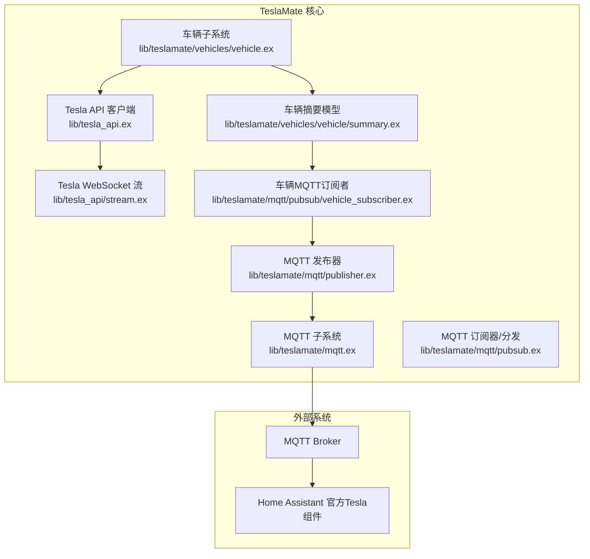
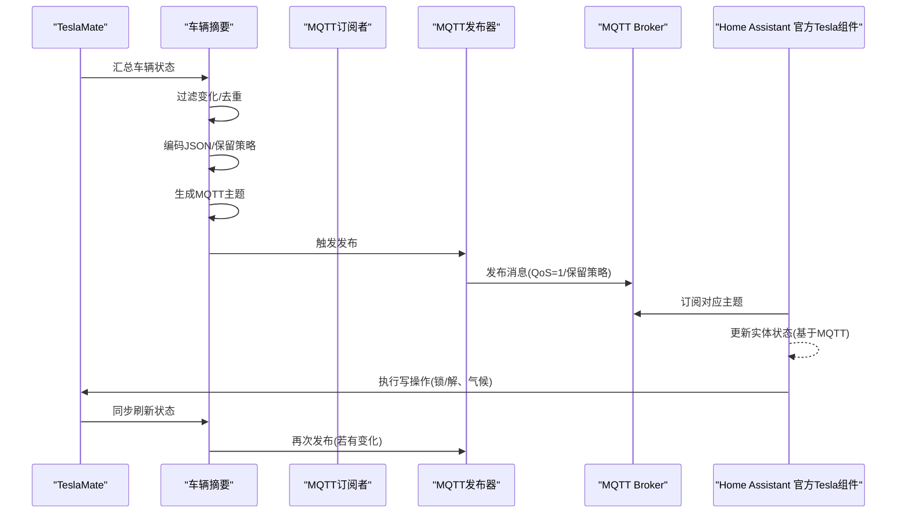
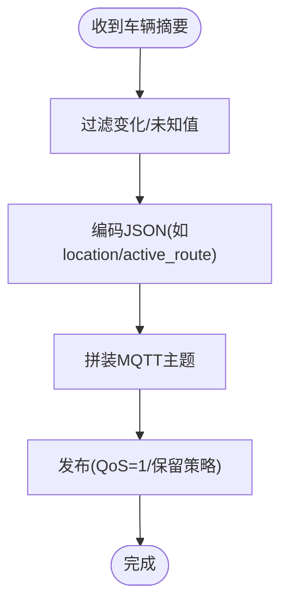
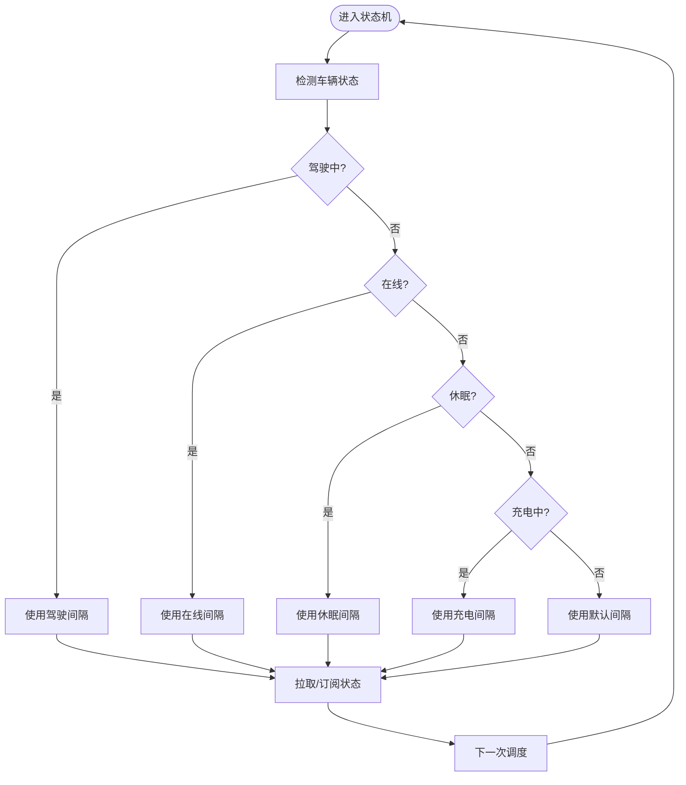
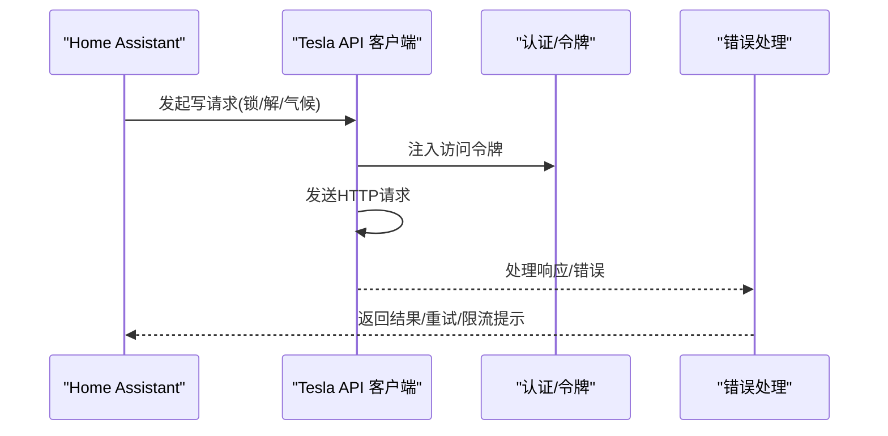
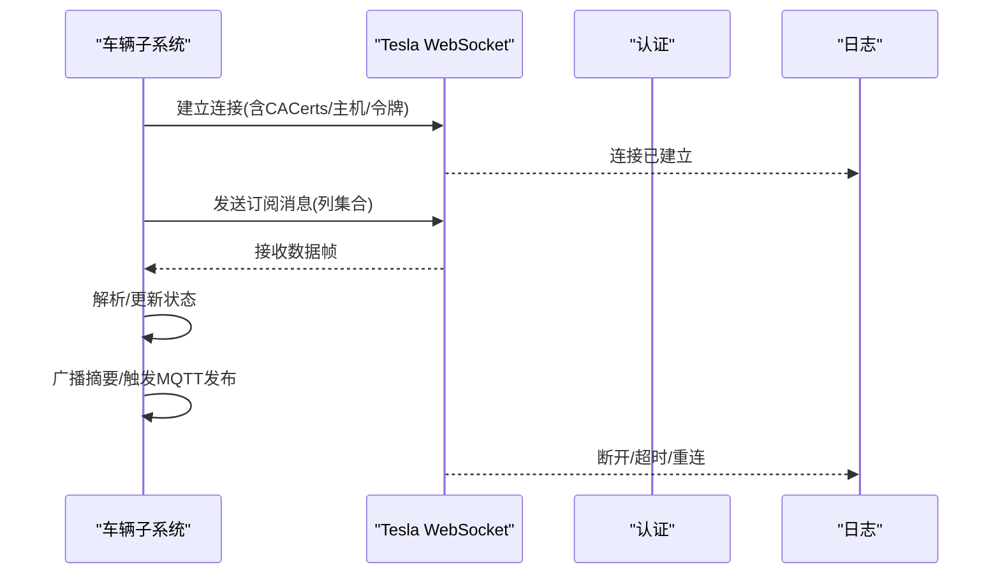
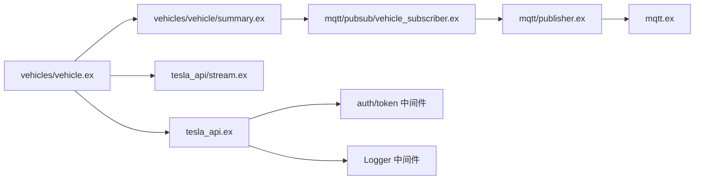

# 高级集成方案

<cite>
**本文引用的文件列表**
- [README.md](file://README.md)
- [home_assistant.md](file://website/docs/integrations/home_assistant.md)
- [mqtt.md](file://website/docs/integrations/mqtt.md)
- [environment_variables.md](file://website/docs/configuration/environment_variables.md)
- [config.exs](file://config/config.exs)
- [tesla_api.ex](file://lib/tesla_api.ex)
- [vehicle.ex](file://lib/tesla_api/vehicle.ex)
- [stream.ex](file://lib/tesla_api/stream.ex)
- [api.ex](file://lib/teslamate/api.ex)
- [mqtt.ex](file://lib/teslamate/mqtt.ex)
- [publisher.ex](file://lib/teslamate/mqtt/publisher.ex)
- [pubsub.ex](file://lib/teslamate/mqtt/pubsub.ex)
- [vehicle_subscriber.ex](file://lib/teslamate/mqtt/pubsub/vehicle_subscriber.ex)
- [summary.ex](file://lib/teslamate/vehicles/vehicle/summary.ex)
- [vehicle.ex](file://lib/teslamate/vehicles/vehicle.ex)
- [settings.ex](file://lib/teslamate/settings.ex)
- [state.ex](file://lib/teslamate/log/state.ex)
</cite>

## 目录
1. [简介](#简介)
2. [项目结构](#项目结构)
3. [核心组件](#核心组件)
4. [架构总览](#架构总览)
5. [详细组件分析](#详细组件分析)
6. [依赖关系分析](#依赖关系分析)
7. [性能考量](#性能考量)
8. [故障排查指南](#故障排查指南)
9. [结论](#结论)
10. [附录](#附录)

## 简介
本高级集成文档面向希望在Home Assistant中使用“官方Tesla组件 + TeslaMate”的混合方案的用户。目标是：
- 通过高间隔轮询的官方组件实现写操作（如车门锁/解锁、气候控制等）；
- 利用TeslaMate的MQTT数据提供读取功能，减少对官方组件默认高频轮询造成的车辆待机耗电；
- 解释如何将TeslaMate的MQTT数据桥接至官方组件实体状态；
- 给出scan_interval设置的最佳实践，平衡实时性与能耗；
- 描述读写功能的限制与安全注意事项（API调用频率限制、身份验证管理）；
- 提供性能优化建议（状态更新触发机制、数据缓存策略）。

## 项目结构
TeslaMate采用Elixir/Erlang生态，核心模块围绕车辆状态采集、MQTT发布、HTTP/TLS连接、以及与Tesla API交互展开。MQTT发布器负责将车辆摘要状态推送到MQTT主题；车辆子系统根据车辆状态变化驱动MQTT发布；Tesla API层负责与Tesla官方接口通信，并支持WebSocket流式订阅。

图表来源
- [vehicle.ex](file://lib/teslamate/vehicles/vehicle.ex#L1-L120)
- [summary.ex](file://lib/teslamate/vehicles/vehicle/summary.ex#L1-L120)
- [tesla_api.ex](file://lib/tesla_api.ex#L1-L18)
- [stream.ex](file://lib/tesla_api/stream.ex#L1-L92)
- [mqtt.ex](file://lib/teslamate/mqtt.ex#L1-L65)
- [publisher.ex](file://lib/teslamate/mqtt/publisher.ex#L1-L53)
- [pubsub.ex](file://lib/teslamate/mqtt/pubsub.ex#L1-L22)
- [vehicle_subscriber.ex](file://lib/teslamate/mqtt/pubsub/vehicle_subscriber.ex#L1-L120)

章节来源
- [README.md](file://README.md#L1-L88)
- [config.exs](file://config/config.exs#L1-L30)

## 核心组件
- 车辆子系统：负责车辆状态的周期性拉取、流式订阅、状态汇总与事件广播。包含不同场景下的轮询间隔配置。
- MQTT子系统：封装连接、发布器、订阅器与车辆主题分发逻辑。
- Tesla API客户端：封装HTTP适配器、基础URL、头部、JSON序列化、Token认证中间件与日志记录。
- WebSocket流：与Tesla Streaming建立长连接，按列订阅实时数据。
- 设置与环境变量：集中管理MQTT、Tesla API、轮询间隔等运行时参数。

章节来源
- [vehicle.ex](file://lib/teslamate/vehicles/vehicle.ex#L1-L120)
- [summary.ex](file://lib/teslamate/vehicles/vehicle/summary.ex#L1-L120)
- [mqtt.ex](file://lib/teslamate/mqtt.ex#L1-L65)
- [publisher.ex](file://lib/teslamate/mqtt/publisher.ex#L1-L53)
- [pubsub.ex](file://lib/teslamate/mqtt/pubsub.ex#L1-L22)
- [vehicle_subscriber.ex](file://lib/teslamate/mqtt/pubsub/vehicle_subscriber.ex#L1-L120)
- [tesla_api.ex](file://lib/tesla_api.ex#L1-L18)
- [stream.ex](file://lib/tesla_api/stream.ex#L1-L92)
- [environment_variables.md](file://website/docs/configuration/environment_variables.md#L1-L62)

## 架构总览
该混合方案的核心思想是：
- 读取侧：由TeslaMate持续通过MQTT发布车辆状态，Home Assistant官方Tesla组件仅作为“只读”消费端，避免其默认高频轮询导致车辆常醒。
- 写入侧：Home Assistant官方Tesla组件以较高scan_interval进行轮询，用于执行写操作（如锁/解、气候控制）。为保证写入成功，官方组件需能从MQTT桥接读取到最新状态，从而避免因本地缓存不一致导致的误判。

图表来源
- [vehicle_subscriber.ex](file://lib/teslamate/mqtt/pubsub/vehicle_subscriber.ex#L70-L120)
- [publisher.ex](file://lib/teslamate/mqtt/publisher.ex#L1-L53)
- [mqtt.md](file://website/docs/integrations/mqtt.md#L1-L88)
- [home_assistant.md](file://website/docs/integrations/home_assistant.md#L1-L24)

## 详细组件分析

### MQTT发布与桥接
- 主题命名：采用“teslamate/{namespace}/cars/{car_id}/{key}”，支持自定义命名空间。
- 发布策略：对变化值与非保留字段使用QoS=1；对健康状态等不保留字段清理历史保留消息，确保一致性。
- 数据内容：覆盖车辆状态、位置、门窗、气候、充电、轮胎压力、导航等丰富字段，便于HA侧构建传感器与二进制传感器。

图表来源
- [vehicle_subscriber.ex](file://lib/teslamate/mqtt/pubsub/vehicle_subscriber.ex#L70-L120)
- [vehicle_subscriber.ex](file://lib/teslamate/mqtt/pubsub/vehicle_subscriber.ex#L180-L216)
- [mqtt.md](file://website/docs/integrations/mqtt.md#L1-L88)

章节来源
- [mqtt.ex](file://lib/teslamate/mqtt.ex#L1-L65)
- [publisher.ex](file://lib/teslamate/mqtt/publisher.ex#L1-L53)
- [pubsub.ex](file://lib/teslamate/mqtt/pubsub.ex#L1-L22)
- [vehicle_subscriber.ex](file://lib/teslamate/mqtt/pubsub/vehicle_subscriber.ex#L1-L216)
- [mqtt.md](file://website/docs/integrations/mqtt.md#L1-L88)

### 车辆状态汇总与轮询策略
- 轮询间隔：针对不同状态（驾驶、在线、休眠、充电）分别设定最小间隔，避免过度唤醒车辆。
- 流式订阅：在车辆在线时通过WebSocket订阅关键列，降低HTTP轮询频率。
- 状态转换：根据车辆状态与时间窗口动态调整轮询节奏，结合数据库日志记录状态变更。

图表来源
- [vehicle.ex](file://lib/teslamate/vehicles/vehicle.ex#L30-L70)
- [vehicle.ex](file://lib/teslamate/vehicles/vehicle.ex#L1663-L1690)
- [environment_variables.md](file://website/docs/configuration/environment_variables.md#L52-L57)

章节来源
- [vehicle.ex](file://lib/teslamate/vehicles/vehicle.ex#L1-L120)
- [vehicle.ex](file://lib/teslamate/vehicles/vehicle.ex#L1663-L1690)
- [environment_variables.md](file://website/docs/configuration/environment_variables.md#L52-L57)

### Tesla API与写操作
- 客户端：统一的HTTP适配器、基础URL、User-Agent、JSON编解码、Token认证中间件与日志级别控制。
- 错误处理：对4xx/5xx、限流（Too Many Requests）进行分级日志与重试策略提示；对未授权进行重认证流程。
- 写操作：官方组件通过Tesla API执行写操作（如锁/解、气候控制），TeslaMate负责读取侧数据同步与MQTT发布。

图表来源
- [tesla_api.ex](file://lib/tesla_api.ex#L1-L18)
- [api.ex](file://lib/teslamate/api.ex#L272-L316)
- [vehicle.ex](file://lib/tesla_api/vehicle.ex#L1-L73)

章节来源
- [tesla_api.ex](file://lib/tesla_api.ex#L1-L18)
- [api.ex](file://lib/teslamate/api.ex#L272-L316)
- [vehicle.ex](file://lib/tesla_api/vehicle.ex#L1-L73)

### WebSocket流式订阅
- 连接：根据区域选择Streaming主机，支持TLS与证书校验；可配置接受无效证书。
- 订阅：按列集合订阅，自动指数退避重连；断开后主动取消订阅并退出。
- 数据：接收实时数据帧，驱动车辆状态更新与MQTT发布。

图表来源
- [stream.ex](file://lib/tesla_api/stream.ex#L1-L92)
- [vehicle.ex](file://lib/teslamate/vehicles/vehicle.ex#L1663-L1690)

章节来源
- [stream.ex](file://lib/tesla_api/stream.ex#L1-L92)
- [vehicle.ex](file://lib/teslamate/vehicles/vehicle.ex#L1663-L1690)

## 依赖关系分析
- 车辆子系统依赖Tesla API与WebSocket流，以获取最新状态；同时依赖MQTT发布器将摘要状态广播到MQTT。
- MQTT发布器依赖Tortoise311连接与TLS配置；订阅器按车辆实例化，每个车辆一个订阅者进程。
- Tesla API客户端依赖认证中间件与日志中间件，统一处理错误与限流。

图表来源
- [vehicle.ex](file://lib/teslamate/vehicles/vehicle.ex#L1-L120)
- [summary.ex](file://lib/teslamate/vehicles/vehicle/summary.ex#L1-L120)
- [vehicle_subscriber.ex](file://lib/teslamate/mqtt/pubsub/vehicle_subscriber.ex#L1-L120)
- [publisher.ex](file://lib/teslamate/mqtt/publisher.ex#L1-L53)
- [mqtt.ex](file://lib/teslamate/mqtt.ex#L1-L65)
- [tesla_api.ex](file://lib/tesla_api.ex#L1-L18)

章节来源
- [vehicle.ex](file://lib/teslamate/vehicles/vehicle.ex#L1-L120)
- [summary.ex](file://lib/teslamate/vehicles/vehicle/summary.ex#L1-L120)
- [vehicle_subscriber.ex](file://lib/teslamate/mqtt/pubsub/vehicle_subscriber.ex#L1-L120)
- [publisher.ex](file://lib/teslamate/mqtt/publisher.ex#L1-L53)
- [mqtt.ex](file://lib/teslamate/mqtt.ex#L1-L65)
- [tesla_api.ex](file://lib/tesla_api.ex#L1-L18)

## 性能考量
- 平衡实时性与能耗
  - 读取侧：MQTT发布采用QoS=1与按需发布策略，避免频繁重复发布；对健康状态等不保留字段清理历史保留消息，减少冗余。
  - 写入侧：官方组件scan_interval应设置为较长周期（例如数分钟），以降低唤醒频率；写入成功后由MQTT桥接最新状态，避免本地缓存不一致。
- 轮询间隔最佳实践
  - 驾驶中：2.5秒（最小值）；在线：60秒；休眠：30秒；充电：5秒；默认：15秒。可根据实际需求在环境变量中微调。
- 数据缓存与触发机制
  - 使用“变化即发布”策略，结合异步并发发布与超时处理，提升吞吐并避免阻塞。
  - 对于导航、位置等复杂JSON字段，采用延迟发布与合并策略，减少消息风暴。
- 网络与安全
  - MQTT/TLS：启用证书校验；若使用第三方Broker，确保证书链完整。
  - Tesla API：合理处理限流与未授权错误，必要时触发重认证或降速重试。

章节来源
- [vehicle_subscriber.ex](file://lib/teslamate/mqtt/pubsub/vehicle_subscriber.ex#L70-L120)
- [publisher.ex](file://lib/teslamate/mqtt/publisher.ex#L1-L53)
- [environment_variables.md](file://website/docs/configuration/environment_variables.md#L52-L57)
- [api.ex](file://lib/teslamate/api.ex#L272-L316)

## 故障排查指南
- MQTT连接问题
  - 检查MQTT主机、端口、用户名/密码、TLS配置与IPv6设置；查看连接回调日志。
- 发布失败
  - 查看发布器返回结果与日志警告；确认QoS与保留策略是否符合预期。
- 读取不一致
  - 确认官方组件scan_interval足够长，且MQTT主题命名与命名空间一致；检查HA侧订阅是否正确。
- 写入失败
  - 关注Tesla API错误日志（4xx/5xx、限流、未授权）；必要时降低写入频率或增加重试等待。
- 状态记录
  - 车辆状态变更记录在数据库表中，可用于回溯与审计。

章节来源
- [mqtt.ex](file://lib/teslamate/mqtt.ex#L1-L65)
- [publisher.ex](file://lib/teslamate/mqtt/publisher.ex#L1-L53)
- [api.ex](file://lib/teslamate/api.ex#L272-L316)
- [state.ex](file://lib/teslamate/log/state.ex#L1-L32)

## 结论
通过“官方组件写 + TeslaMate读”的混合方案，可以在保持写操作可靠性的同时显著降低车辆待机耗电。MQTT桥接提供了稳定、低频的读取通道，结合合理的scan_interval与轮询策略，既能满足日常使用，又能延长车辆休眠时间。建议在生产环境中：
- 将官方组件scan_interval设为较长周期；
- 严格管理MQTT与Tesla API的TLS与认证；
- 基于环境变量微调轮询间隔，平衡实时性与能耗；
- 建立完善的日志与告警机制，及时发现并处理异常。

## 附录

### 自动化规则配置要点（概念性）
- 读取侧：在HA中订阅teslamate命名空间下的MQTT主题，映射为传感器与二进制传感器。
- 写入侧：官方Tesla组件以高scan_interval轮询，执行锁/解、气候控制等写操作；写入成功后由MQTT桥接最新状态。
- 触发条件：基于MQTT主题变化或定时任务触发，避免重复写入与误判。

[本节为概念性说明，不直接分析具体源文件]

### 读写功能限制与安全注意事项
- API调用频率限制：官方组件默认轮询可能造成车辆常醒，建议通过高间隔轮询与MQTT桥接缓解。
- 身份验证管理：Tesla API使用访问令牌，需妥善保存与轮换；错误处理包含未授权与限流场景。
- MQTT安全：启用TLS与证书校验，避免明文传输；命名空间与主题前缀需与HA侧一致。

章节来源
- [home_assistant.md](file://website/docs/integrations/home_assistant.md#L1-L24)
- [tesla_api.ex](file://lib/tesla_api.ex#L1-L18)
- [api.ex](file://lib/teslamate/api.ex#L272-L316)
- [environment_variables.md](file://website/docs/configuration/environment_variables.md#L1-L62)