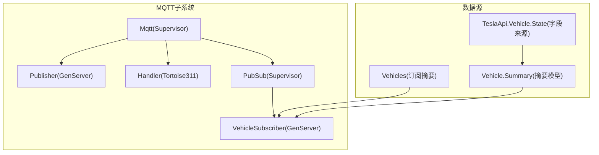
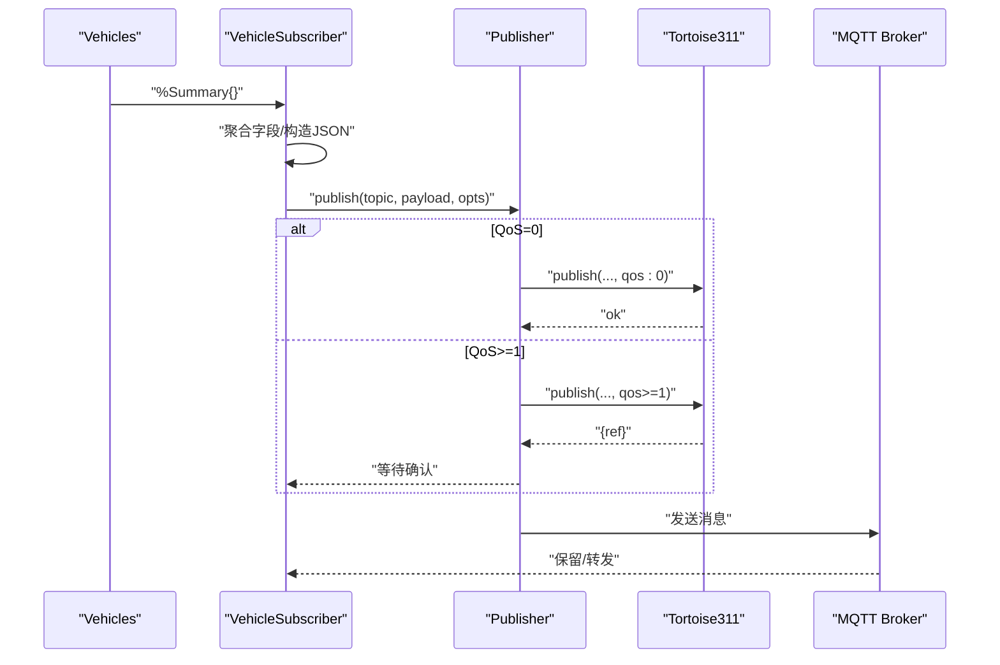
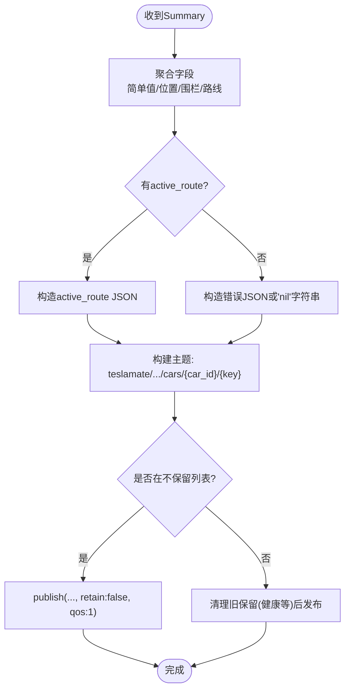
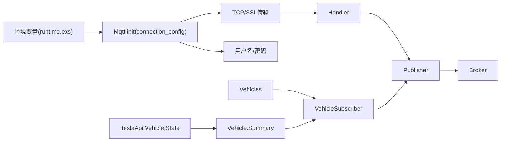

# MQTT集成

<cite>
**本文引用的文件**
- [lib/teslamate/mqtt.ex](file://lib/teslamate/mqtt.ex)
- [lib/teslamate/mqtt/publisher.ex](file://lib/teslamate/mqtt/publisher.ex)
- [lib/teslamate/mqtt/handler.ex](file://lib/teslamate/mqtt/handler.ex)
- [lib/teslamate/mqtt/pubsub.ex](file://lib/teslamate/mqtt/pubsub.ex)
- [lib/teslamate/mqtt/pubsub/vehicle_subscriber.ex](file://lib/teslamate/mqtt/pubsub/vehicle_subscriber.ex)
- [lib/teslamate/vehicles/vehicle/summary.ex](file://lib/teslamate/vehicles/vehicle/summary.ex)
- [lib/tesla_api/vehicle/state.ex](file://lib/tesla_api/vehicle/state.ex)
- [config/runtime.exs](file://config/runtime.exs)
- [config/config.exs](file://config/config.exs)
- [website/docs/integrations/mqtt.md](file://website/docs/integrations/mqtt.md)
- [website/docs/configuration/environment_variables.md](file://website/docs/configuration/environment_variables.md)
- [test/teslamate/mqtt/pubsub/vehicle_subscriber_test.exs](file://test/teslamate/mqtt/pubsub/vehicle_subscriber_test.exs)
- [test/support/mocks/mqtt_publisher.ex](file://test/support/mocks/mqtt_publisher.ex)
</cite>

## 目录
1. [简介](#简介)
2. [项目结构](#项目结构)
3. [核心组件](#核心组件)
4. [架构总览](#架构总览)
5. [详细组件分析](#详细组件分析)
6. [依赖关系分析](#依赖关系分析)
7. [性能与发布频率](#性能与发布频率)
8. [消息格式与主题结构](#消息格式与主题结构)
9. [连接配置与安全](#连接配置与安全)
10. [订阅与保留消息最佳实践](#订阅与保留消息最佳实践)
11. [故障排除指南](#故障排除指南)
12. [结论](#结论)

## 简介
本文件面向TeslaMate的MQTT集成，系统性说明其主题结构、消息格式、发布策略（含QoS、保留消息）、连接配置（TLS、认证、IPv6、命名空间）以及订阅管理与故障排除。文档同时覆盖车辆状态、驾驶数据与充电事件的发布机制，并给出安全配置建议与最佳实践。

## 项目结构
MQTT相关代码集中在lib/teslamate/mqtt目录下，配合运行时配置与车辆摘要模型，形成“订阅-聚合-发布”的闭环：
- 连接与生命周期：lib/teslamate/mqtt.ex
- 发布器：lib/teslamate/mqtt/publisher.ex
- 连接事件处理：lib/teslamate/mqtt/handler.ex
- 车辆订阅器（按车实例化）：lib/teslamate/mqtt/pubsub.ex、lib/teslamate/mqtt/pubsub/vehicle_subscriber.ex
- 车辆摘要模型：lib/teslamate/vehicles/vehicle/summary.ex
- Tesla API状态模型（用于字段来源映射）：lib/tesla_api/vehicle/state.ex
- 运行时配置与环境变量：config/runtime.exs、config/config.exs
- 官方MQTT主题文档：website/docs/integrations/mqtt.md
- 环境变量说明：website/docs/configuration/environment_variables.md
- 测试用例与发布器Mock：test/teslamate/mqtt/pubsub/vehicle_subscriber_test.exs、test/support/mocks/mqtt_publisher.ex

图表来源
- [lib/teslamate/mqtt.ex](file://lib/teslamate/mqtt.ex#L1-L64)
- [lib/teslamate/mqtt/publisher.ex](file://lib/teslamate/mqtt/publisher.ex#L1-L52)
- [lib/teslamate/mqtt/handler.ex](file://lib/teslamate/mqtt/handler.ex#L1-L27)
- [lib/teslamate/mqtt/pubsub.ex](file://lib/teslamate/mqtt/pubsub.ex#L1-L21)
- [lib/teslamate/mqtt/pubsub/vehicle_subscriber.ex](file://lib/teslamate/mqtt/pubsub/vehicle_subscriber.ex#L1-L216)
- [lib/teslamate/vehicles/vehicle/summary.ex](file://lib/teslamate/vehicles/vehicle/summary.ex#L1-L22)
- [lib/tesla_api/vehicle/state.ex](file://lib/tesla_api/vehicle/state.ex#L1-L396)

章节来源
- [lib/teslamate/mqtt.ex](file://lib/teslamate/mqtt.ex#L1-L64)
- [lib/teslamate/mqtt/publisher.ex](file://lib/teslamate/mqtt/publisher.ex#L1-L52)
- [lib/teslamate/mqtt/handler.ex](file://lib/teslamate/mqtt/handler.ex#L1-L27)
- [lib/teslamate/mqtt/pubsub.ex](file://lib/teslamate/mqtt/pubsub.ex#L1-L21)
- [lib/teslamate/mqtt/pubsub/vehicle_subscriber.ex](file://lib/teslamate/mqtt/pubsub/vehicle_subscriber.ex#L1-L216)
- [lib/teslamate/vehicles/vehicle/summary.ex](file://lib/teslamate/vehicles/vehicle/summary.ex#L1-L22)
- [lib/tesla_api/vehicle/state.ex](file://lib/tesla_api/vehicle/state.ex#L1-L396)
- [config/runtime.exs](file://config/runtime.exs#L168-L178)
- [config/config.exs](file://config/config.exs#L1-L30)

## 核心组件
- Mqtt Supervisor：启动Tortoise311连接、Publisher、PubSub三个子进程；根据环境变量决定TLS、端口、用户名密码、IPv6与命名空间。
- Publisher：封装Tortoise311发布调用，支持QoS 0直发与QoS 1/2的带引用回调，超时控制。
- Handler：记录连接建立、断开、终止的日志，便于监控与排障。
- PubSub：为每辆车实例化一个VehicleSubscriber，统一订阅摘要并触发发布。
- VehicleSubscriber：从摘要模型聚合键值，构造JSON或字符串消息，按规则发布到MQTT主题，控制QoS与保留位。

章节来源
- [lib/teslamate/mqtt.ex](file://lib/teslamate/mqtt.ex#L1-L64)
- [lib/teslamate/mqtt/publisher.ex](file://lib/teslamate/mqtt/publisher.ex#L1-L52)
- [lib/teslamate/mqtt/handler.ex](file://lib/teslamate/mqtt/handler.ex#L1-L27)
- [lib/teslamate/mqtt/pubsub.ex](file://lib/teslamate/mqtt/pubsub.ex#L1-L21)
- [lib/teslamate/mqtt/pubsub/vehicle_subscriber.ex](file://lib/teslamate/mqtt/pubsub/vehicle_subscriber.ex#L1-L216)

## 架构总览
MQTT发布流程自上而下：
- Vehicles订阅车辆摘要（Summary）
- VehicleSubscriber接收摘要，聚合字段并编码为JSON或字符串
- Publisher调用Tortoise311发布，QoS 1/2时等待确认
- Tortoise311连接由Mqtt Supervisor管理，支持TCP/TLS、用户名密码、IPv6

图表来源
- [lib/teslamate/mqtt/pubsub/vehicle_subscriber.ex](file://lib/teslamate/mqtt/pubsub/vehicle_subscriber.ex#L62-L102)
- [lib/teslamate/mqtt/publisher.ex](file://lib/teslamate/mqtt/publisher.ex#L31-L51)
- [lib/teslamate/mqtt.ex](file://lib/teslamate/mqtt.ex#L29-L59)

## 详细组件分析

### VehicleSubscriber：主题构建与发布策略
- 主题结构：teslamate/{namespace}/cars/{car_id}/{key}
- 仅在键不在“不保留列表”时设置retain=true；健康状态等特殊键强制清理旧保留消息
- 消息内容：
  - 简单字段：直接转字符串
  - 位置字段：输出JSON对象{"latitude": ..., "longitude": ...}
  - 地理围栏：若无则使用默认围栏名
  - active_route：有目的地时输出JSON对象，包含到达时间、能量、交通延迟、目的经纬度与错误字段；无目的地时输出错误JSON或“nil”字符串
- 发布条件：
  - 值非:unknown
  - 值变化或首次发布
  - 特定键（如充电相关、geofence、trim_badging）即使为nil也发布空字符串以清理保留
- 并发发布：异步流式发布，最大并发10，超时即杀任务，失败日志告警

图表来源
- [lib/teslamate/mqtt/pubsub/vehicle_subscriber.ex](file://lib/teslamate/mqtt/pubsub/vehicle_subscriber.ex#L25-L39)
- [lib/teslamate/mqtt/pubsub/vehicle_subscriber.ex](file://lib/teslamate/mqtt/pubsub/vehicle_subscriber.ex#L57-L60)
- [lib/teslamate/mqtt/pubsub/vehicle_subscriber.ex](file://lib/teslamate/mqtt/pubsub/vehicle_subscriber.ex#L156-L199)
- [lib/teslamate/mqtt/pubsub/vehicle_subscriber.ex](file://lib/teslamate/mqtt/pubsub/vehicle_subscriber.ex#L201-L216)

章节来源
- [lib/teslamate/mqtt/pubsub/vehicle_subscriber.ex](file://lib/teslamate/mqtt/pubsub/vehicle_subscriber.ex#L1-L216)
- [test/teslamate/mqtt/pubsub/vehicle_subscriber_test.exs](file://test/teslamate/mqtt/pubsub/vehicle_subscriber_test.exs#L1-L200)

### Publisher：QoS与确认
- QoS 0：立即返回
- QoS 1/2：返回ref并保存，等待Tortoise311回调后回复调用方
- 超时：调用侧超时约等于发布侧timeout的95%，避免竞态

章节来源
- [lib/teslamate/mqtt/publisher.ex](file://lib/teslamate/mqtt/publisher.ex#L1-L52)

### Handler：连接事件日志
- 连接建立、断开、终止均记录日志，便于监控与排障

章节来源
- [lib/teslamate/mqtt/handler.ex](file://lib/teslamate/mqtt/handler.ex#L1-L27)

### PubSub与Supervisor：按车实例化订阅器
- PubSub在初始化时枚举所有车辆，为每辆车启动一个VehicleSubscriber
- Mqtt Supervisor负责启动连接、发布器与PubSub

章节来源
- [lib/teslamate/mqtt/pubsub.ex](file://lib/teslamate/mqtt/pubsub.ex#L1-L21)
- [lib/teslamate/mqtt.ex](file://lib/teslamate/mqtt.ex#L1-L64)

## 依赖关系分析
- 运行时配置通过环境变量注入：MQTT_HOST、MQTT_PORT、MQTT_USERNAME、MQTT_PASSWORD、MQTT_TLS、MQTT_TLS_ACCEPT_INVALID_CERTS、MQTT_IPV6、MQTT_NAMESPACE、DISABLE_MQTT
- 连接层依赖Tortoise311（TCP或SSL传输），Handler实现连接事件回调
- 发布层依赖Publisher封装Tortoise311发布接口
- 数据层依赖Vehicles订阅摘要，Vehicle.Summary作为载体，TeslaApi.Vehicle.State定义字段来源

图表来源
- [config/runtime.exs](file://config/runtime.exs#L168-L178)
- [lib/teslamate/mqtt.ex](file://lib/teslamate/mqtt.ex#L29-L59)
- [lib/teslamate/mqtt/handler.ex](file://lib/teslamate/mqtt/handler.ex#L1-L27)
- [lib/teslamate/mqtt/publisher.ex](file://lib/teslamate/mqtt/publisher.ex#L1-L52)
- [lib/teslamate/mqtt/pubsub/vehicle_subscriber.ex](file://lib/teslamate/mqtt/pubsub/vehicle_subscriber.ex#L1-L216)
- [lib/teslamate/vehicles/vehicle/summary.ex](file://lib/teslamate/vehicles/vehicle/summary.ex#L1-L22)
- [lib/tesla_api/vehicle/state.ex](file://lib/tesla_api/vehicle/state.ex#L1-L396)

章节来源
- [config/runtime.exs](file://config/runtime.exs#L168-L178)
- [lib/teslamate/mqtt.ex](file://lib/teslamate/mqtt.ex#L1-L64)
- [lib/teslamate/mqtt/publisher.ex](file://lib/teslamate/mqtt/publisher.ex#L1-L52)
- [lib/teslamate/mqtt/handler.ex](file://lib/teslamate/mqtt/handler.ex#L1-L27)
- [lib/teslamate/mqtt/pubsub/vehicle_subscriber.ex](file://lib/teslamate/mqtt/pubsub/vehicle_subscriber.ex#L1-L216)
- [lib/teslamate/vehicles/vehicle/summary.ex](file://lib/teslamate/vehicles/vehicle/summary.ex#L1-L22)
- [lib/tesla_api/vehicle/state.ex](file://lib/tesla_api/vehicle/state.ex#L1-L396)

## 性能与发布频率
- 发布频率取决于车辆摘要更新频率，由上游订阅者驱动。测试中可见在线、驾驶、充电等场景下的不同轮询间隔（例如在线轮询间隔、驾驶轮询间隔、充电轮询间隔等），这些会影响MQTT消息的到达频率。
- VehicleSubscriber采用异步流式发布，最大并发10，有助于提升批量发布吞吐；同时对失败任务进行超时处理，避免阻塞。

章节来源
- [website/docs/configuration/environment_variables.md](file://website/docs/configuration/environment_variables.md#L52-L59)
- [lib/teslamate/mqtt/pubsub/vehicle_subscriber.ex](file://lib/teslamate/mqtt/pubsub/vehicle_subscriber.ex#L82-L102)

## 消息格式与主题结构

### 主题结构
- 基础主题：teslamate/{namespace}/cars/{car_id}/{key}
- namespace可为空（默认），也可通过MQTT_NAMESPACE设置自定义前缀
- key来自Vehicle.Summary，包含车辆状态、驾驶数据、充电事件、地理围栏、位置等

章节来源
- [lib/teslamate/mqtt/pubsub/vehicle_subscriber.ex](file://lib/teslamate/mqtt/pubsub/vehicle_subscriber.ex#L201-L206)
- [config/runtime.exs](file://config/runtime.exs#L168-L178)
- [website/docs/integrations/mqtt.md](file://website/docs/integrations/mqtt.md#L1-L88)

### 消息格式
- 字符串字段：直接转字符串
- 位置字段location：JSON对象{"latitude": ..., "longitude": ...}
- 地理围栏geofence：字符串（围栏名称或默认值）
- active_route：
  - 有目的地：JSON对象，包含destination、energy_at_arrival、miles_to_arrival、minutes_to_arrival、traffic_minutes_delay、location（含latitude/longitude）、error（nil）
  - 无目的地：JSON对象{"error":"No active route available"}或键值为"nil"字符串
- 时间字段：ISO8601字符串

章节来源
- [lib/teslamate/mqtt/pubsub/vehicle_subscriber.ex](file://lib/teslamate/mqtt/pubsub/vehicle_subscriber.ex#L146-L199)
- [lib/teslamate/mqtt/pubsub/vehicle_subscriber.ex](file://lib/teslamate/mqtt/pubsub/vehicle_subscriber.ex#L214-L216)
- [test/teslamate/mqtt/pubsub/vehicle_subscriber_test.exs](file://test/teslamate/mqtt/pubsub/vehicle_subscriber_test.exs#L102-L124)
- [website/docs/integrations/mqtt.md](file://website/docs/integrations/mqtt.md#L80-L88)

### 复杂数据类型示例
- active_route：见上节“消息格式”
- location：见上节“消息格式”
- geofence：字符串，若无则使用默认值

章节来源
- [lib/teslamate/mqtt/pubsub/vehicle_subscriber.ex](file://lib/teslamate/mqtt/pubsub/vehicle_subscriber.ex#L146-L154)
- [config/runtime.exs](file://config/runtime.exs#L101-L102)

## 连接配置与安全

### 环境变量与运行时配置
- DISABLE_MQTT：禁用MQTT功能
- MQTT_HOST/MQTT_PORT：Broker主机与端口，默认1883；启用TLS时默认8883
- MQTT_USERNAME/MQTT_PASSWORD：认证凭据
- MQTT_TLS：启用TLS
- MQTT_TLS_ACCEPT_INVALID_CERTS：接受无效证书（生产不推荐）
- MQTT_IPV6：启用IPv6
- MQTT_NAMESPACE：自定义命名空间，不得包含"/"

章节来源
- [config/runtime.exs](file://config/runtime.exs#L168-L178)
- [website/docs/configuration/environment_variables.md](file://website/docs/configuration/environment_variables.md#L29-L38)

### TLS与证书
- 当启用TLS时，使用CAStore.file_path()加载系统CA证书；verify模式由MQTT_TLS_ACCEPT_INVALID_CERTS控制
- 未启用TLS时使用TCP传输

章节来源
- [lib/teslamate/mqtt.ex](file://lib/teslamate/mqtt.ex#L35-L50)

### 认证与客户端ID
- 支持用户名/密码认证
- 客户端ID由generate_client_id生成，确保唯一性

章节来源
- [lib/teslamate/mqtt.ex](file://lib/teslamate/mqtt.ex#L52-L63)

### 网络与绑定
- 可选启用IPv6
- 连接参数包含socket_opts，用于网络栈选项

章节来源
- [lib/teslamate/mqtt.ex](file://lib/teslamate/mqtt.ex#L29-L34)

## 订阅与保留消息最佳实践

### 订阅管理
- 当前实现未显式订阅任何主题（subscriptions为空），而是通过内部订阅车辆摘要并发布到主题
- 若需订阅外部命令，请在应用层面扩展订阅逻辑（当前仓库未包含订阅命令的实现）

章节来源
- [lib/teslamate/mqtt.ex](file://lib/teslamate/mqtt.ex#L57-L58)

### 保留消息策略
- 默认保留：除“不保留列表”外的键均保留
- 不保留列表：healthy等键在初始化时会发布空消息以清理旧保留
- 特殊键：某些充电相关键、geofence、trim_badging即使为nil也会发布空字符串以清理保留

章节来源
- [lib/teslamate/mqtt/pubsub/vehicle_subscriber.ex](file://lib/teslamate/mqtt/pubsub/vehicle_subscriber.ex#L25-L39)
- [lib/teslamate/mqtt/pubsub/vehicle_subscriber.ex](file://lib/teslamate/mqtt/pubsub/vehicle_subscriber.ex#L57-L60)
- [test/teslamate/mqtt/pubsub/vehicle_subscriber_test.exs](file://test/teslamate/mqtt/pubsub/vehicle_subscriber_test.exs#L160-L188)

### QoS与可靠性
- 发布默认QoS=1
- QoS 1/2：Publisher等待确认，超时约等于发布侧timeout的95%
- 对于高吞吐场景，可考虑QoS 0以降低确认开销，但会失去重传保障

章节来源
- [lib/teslamate/mqtt/publisher.ex](file://lib/teslamate/mqtt/publisher.ex#L31-L51)
- [lib/teslamate/mqtt/pubsub/vehicle_subscriber.ex](file://lib/teslamate/mqtt/pubsub/vehicle_subscriber.ex#L201-L216)

## 故障排除指南

### 连接问题
- 检查MQTT_HOST/MQTT_PORT、MQTT_TLS、MQTT_USERNAME/MQTT_PASSWORD配置
- TLS证书：若使用自签或不受信CA，可临时开启MQTT_TLS_ACCEPT_INVALID_CERTS进行验证，但不建议长期使用
- 日志：关注Handler中的连接建立/断开/终止日志

章节来源
- [lib/teslamate/mqtt.ex](file://lib/teslamate/mqtt.ex#L35-L50)
- [lib/teslamate/mqtt/handler.ex](file://lib/teslamate/mqtt/handler.ex#L1-L27)
- [website/docs/configuration/environment_variables.md](file://website/docs/configuration/environment_variables.md#L29-L38)

### 消息丢失
- 确认QoS设置：默认QoS=1；若需要可靠送达，保持QoS>=1
- 检查Publisher超时与异步发布：失败任务会被超时终止，注意查看日志

章节来源
- [lib/teslamate/mqtt/publisher.ex](file://lib/teslamate/mqtt/publisher.ex#L31-L51)
- [lib/teslamate/mqtt/pubsub/vehicle_subscriber.ex](file://lib/teslamate/mqtt/pubsub/vehicle_subscriber.ex#L82-L102)

### 权限错误
- 确认用户名/密码正确
- 若Broker要求ACL，请确保客户端具备发布到目标主题的权限

章节来源
- [lib/teslamate/mqtt.ex](file://lib/teslamate/mqtt.ex#L52-L56)
- [website/docs/configuration/environment_variables.md](file://website/docs/configuration/environment_variables.md#L31-L33)

### 主题未更新
- 确认DISABLE_MQTT未设为true
- 确认车辆摘要正常推送（VehicleSubscriber已初始化并订阅）

章节来源
- [config/runtime.exs](file://config/runtime.exs#L168-L170)
- [lib/teslamate/mqtt/pubsub.ex](file://lib/teslamate/mqtt/pubsub.ex#L13-L21)

## 结论
TeslaMate的MQTT集成以简洁可靠的发布模型为核心：通过VehicleSubscriber聚合摘要并按规则发布，Publisher统一处理QoS与确认，Mqtt Supervisor负责连接与命名空间配置。官方文档提供了完整主题清单与JSON格式说明，结合本文档的发布策略、保留消息与安全配置，可满足大多数自动化平台的数据接入需求。建议在生产环境中启用TLS与强认证，合理选择QoS等级，并遵循保留消息清理策略以避免陈旧状态。