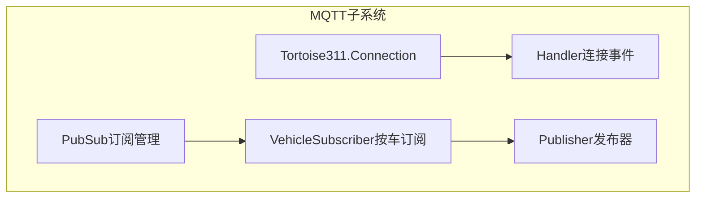
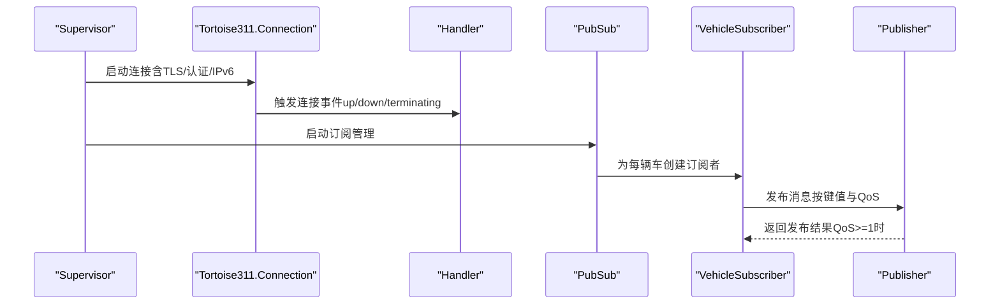
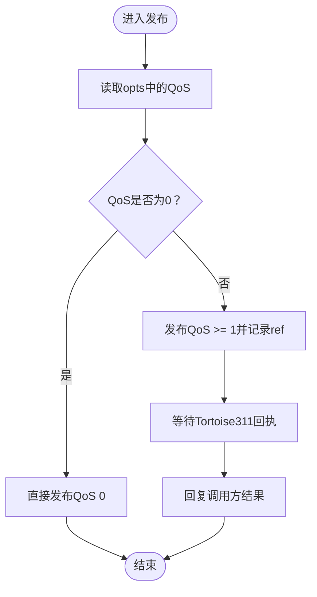
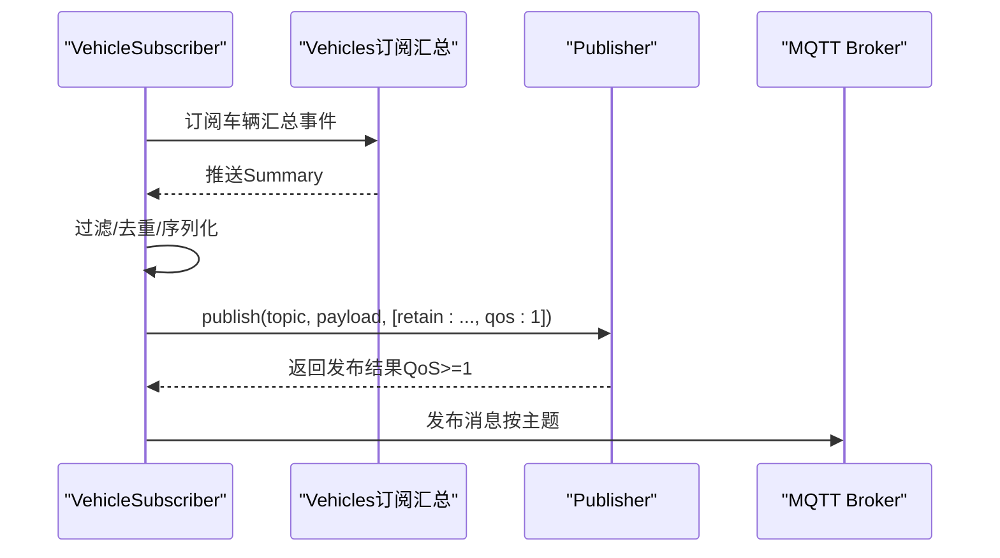
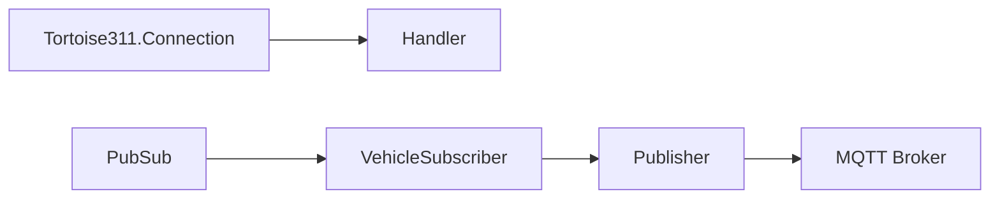

# QoS级别与订阅管理

<cite>
**本文引用的文件列表**
- [lib/teslamate/mqtt.ex](file://lib/teslamate/mqtt.ex)
- [lib/teslamate/mqtt/handler.ex](file://lib/teslamate/mqtt/handler.ex)
- [lib/teslamate/mqtt/publisher.ex](file://lib/teslamate/mqtt/publisher.ex)
- [lib/teslamate/mqtt/pubsub.ex](file://lib/teslamate/mqtt/pubsub.ex)
- [lib/teslamate/mqtt/pubsub/vehicle_subscriber.ex](file://lib/teslamate/mqtt/pubsub/vehicle_subscriber.ex)
- [test/teslamate/mqtt/pubsub/vehicle_subscriber_test.exs](file://test/teslamate/mqtt/pubsub/vehicle_subscriber_test.exs)
- [website/docs/integrations/mqtt.md](file://website/docs/integrations/mqtt.md)
- [website/docs/configuration/environment_variables.md](file://website/docs/configuration/environment_variables.md)
</cite>

## 目录
1. [引言](#引言)
2. [项目结构](#项目结构)
3. [核心组件](#核心组件)
4. [架构总览](#架构总览)
5. [详细组件分析](#详细组件分析)
6. [依赖关系分析](#依赖关系分析)
7. [性能考量](#性能考量)
8. [故障排查指南](#故障排查指南)
9. [结论](#结论)
10. [附录](#附录)

## 引言
本文件聚焦于TeslaMate MQTT实现中的以下关键点：
- QoS（服务质量）级别选择及其对消息可靠性的意义
- 保留消息（retain）的使用场景，尤其是车辆状态的持久化通知
- 客户端订阅管理机制，包括订阅确认与错误处理
- Tortoise311库的事件处理模型，重点解析Handler模块如何响应连接状态变化与消息到达事件
- 订阅最佳实践：通配符主题、消息频率控制与资源消耗优化
- 高QoS级别对系统性能的影响与权衡

## 项目结构
TeslaMate的MQTT子系统由三个主要部分组成：
- 连接与处理器：负责建立与Broker的连接、处理连接生命周期事件
- 发布器：封装发布调用，支持QoS 0/1，并在高QoS时跟踪发布结果
- 订阅者：按车辆维度订阅汇总数据，计算差异并发布到MQTT主题，同时管理保留消息

图表来源
- [lib/teslamate/mqtt.ex](file://lib/teslamate/mqtt.ex#L1-L64)
- [lib/teslamate/mqtt/handler.ex](file://lib/teslamate/mqtt/handler.ex#L1-L27)
- [lib/teslamate/mqtt/publisher.ex](file://lib/teslamate/mqtt/publisher.ex#L1-L52)
- [lib/teslamate/mqtt/pubsub.ex](file://lib/teslamate/mqtt/pubsub.ex#L1-L21)
- [lib/teslamate/mqtt/pubsub/vehicle_subscriber.ex](file://lib/teslamate/mqtt/pubsub/vehicle_subscriber.ex#L1-L217)

章节来源
- [lib/teslamate/mqtt.ex](file://lib/teslamate/mqtt.ex#L1-L64)
- [lib/teslamate/mqtt/handler.ex](file://lib/teslamate/mqtt/handler.ex#L1-L27)
- [lib/teslamate/mqtt/publisher.ex](file://lib/teslamate/mqtt/publisher.ex#L1-L52)
- [lib/teslamate/mqtt/pubsub.ex](file://lib/teslamate/mqtt/pubsub.ex#L1-L21)
- [lib/teslamate/mqtt/pubsub/vehicle_subscriber.ex](file://lib/teslamate/mqtt/pubsub/vehicle_subscriber.ex#L1-L217)

## 核心组件
- 连接与配置
  - 通过Supervisor启动Tortoise311.Connection、Publisher与PubSub
  - 支持TCP/TLS传输、用户名密码认证、IPv6、TLS证书校验策略
  - 默认未声明订阅列表，订阅由各车辆订阅者动态管理
- 发布器（Publisher）
  - 提供publish(topic, msg, opts)接口，内部以GenServer形式异步处理
  - 当opts中未指定QoS或为0时，直接发布；当QoS≥1时，记录ref并在收到回执后回复调用方
- 订阅者（VehicleSubscriber）
  - 按车辆订阅汇总事件，过滤并序列化字段，发布到MQTT主题
  - 对某些键值采用保留消息，确保新订阅者能立即获得最新状态
  - 对不希望保留的键（如健康状态）在初始化时清理旧的保留消息
- 处理器（Handler）
  - 实现Tortoise311.Handler回调，记录连接建立、断开、终止等事件

章节来源
- [lib/teslamate/mqtt.ex](file://lib/teslamate/mqtt.ex#L1-L64)
- [lib/teslamate/mqtt/publisher.ex](file://lib/teslamate/mqtt/publisher.ex#L1-L52)
- [lib/teslamate/mqtt/pubsub/vehicle_subscriber.ex](file://lib/teslamate/mqtt/pubsub/vehicle_subscriber.ex#L1-L217)
- [lib/teslamate/mqtt/handler.ex](file://lib/teslamate/mqtt/handler.ex#L1-L27)

## 架构总览
下图展示MQTT子系统的运行流程：连接建立、订阅管理、数据发布与保留消息策略。

图表来源
- [lib/teslamate/mqtt.ex](file://lib/teslamate/mqtt.ex#L1-L64)
- [lib/teslamate/mqtt/handler.ex](file://lib/teslamate/mqtt/handler.ex#L1-L27)
- [lib/teslamate/mqtt/pubsub.ex](file://lib/teslamate/mqtt/pubsub.ex#L1-L21)
- [lib/teslamate/mqtt/pubsub/vehicle_subscriber.ex](file://lib/teslamate/mqtt/pubsub/vehicle_subscriber.ex#L1-L217)
- [lib/teslamate/mqtt/publisher.ex](file://lib/teslamate/mqtt/publisher.ex#L1-L52)

## 详细组件分析

### QoS级别选择与可靠性
- 发布默认行为
  - 发布器在opts未显式设置QoS时，默认使用QoS 0，即“最多一次”传递，不保证送达
  - 当opts中QoS≥1时，发布器会记录ref并通过handle_info接收Tortoise311的回执，再将结果回复给调用方
- 订阅侧的QoS策略
  - 订阅者在发布时统一使用QoS 1，确保消息至少被送达一次
  - 对于需要“最新值即达”的键（如健康状态），采用保留消息，避免新订阅者等待首次更新
- 可靠性意义
  - QoS 0：低开销，适合高频、可丢弃的数据
  - QoS 1：至少一次送达，适合状态类、关键指标
  - 结合保留消息：新订阅者可立即获得最新状态，减少等待时间

章节来源
- [lib/teslamate/mqtt/publisher.ex](file://lib/teslamate/mqtt/publisher.ex#L1-L52)
- [lib/teslamate/mqtt/pubsub/vehicle_subscriber.ex](file://lib/teslamate/mqtt/pubsub/vehicle_subscriber.ex#L1-L217)

### 保留消息的使用场景与策略
- 保留键集合
  - 订阅者定义了不保留的键集合（例如健康状态），用于清理历史保留消息，避免陈旧状态
- 初始化清理
  - 在订阅者初始化时，针对不保留的键向对应主题发送空载荷、保留标志的消息，以清除旧保留
- 状态持久化通知
  - 对于需要“即取即用”的状态键（如版本、位置、路线信息等），采用保留消息，使新订阅者无需等待即可获取最新值
- 文档与示例
  - 官方文档列出了MQTT主题与示例payload，便于理解保留消息的典型用途

章节来源
- [lib/teslamate/mqtt/pubsub/vehicle_subscriber.ex](file://lib/teslamate/mqtt/pubsub/vehicle_subscriber.ex#L1-L217)
- [website/docs/integrations/mqtt.md](file://website/docs/integrations/mqtt.md#L1-L120)

### 客户端订阅管理机制
- 订阅生命周期
  - 连接配置中未声明订阅列表，订阅由VehicleSubscriber在初始化时完成
  - 订阅者通过订阅汇总事件，将车辆状态映射为多个MQTT主题
- 订阅确认与错误处理
  - 连接事件通过Handler记录：连接建立、断开、终止等
  - 发布器在QoS≥1时通过ref跟踪结果，若发布失败可在日志中定位
- 测试验证
  - 单元测试覆盖了保留消息、命名空间、地理围栏变更等场景，确保订阅与发布行为符合预期

章节来源
- [lib/teslamate/mqtt.ex](file://lib/teslamate/mqtt.ex#L1-L64)
- [lib/teslamate/mqtt/handler.ex](file://lib/teslamate/mqtt/handler.ex#L1-L27)
- [lib/teslamate/mqtt/pubsub.ex](file://lib/teslamate/mqtt/pubsub.ex#L1-L21)
- [lib/teslamate/mqtt/pubsub/vehicle_subscriber.ex](file://lib/teslamate/mqtt/pubsub/vehicle_subscriber.ex#L1-L217)
- [test/teslamate/mqtt/pubsub/vehicle_subscriber_test.exs](file://test/teslamate/mqtt/pubsub/vehicle_subscriber_test.exs#L1-L309)

### Tortoise311事件处理模型（Handler）
- Handler回调
  - connection(:up)：记录连接已建立
  - connection(:down)：记录连接已断开
  - connection(:terminating)：记录连接正在终止
  - terminate(reason)：记录终止原因
- 作用
  - 为运维与调试提供清晰的连接状态日志，便于定位网络与Broker问题

章节来源
- [lib/teslamate/mqtt/handler.ex](file://lib/teslamate/mqtt/handler.ex#L1-L27)

### 发布流程与QoS处理（Publisher）

图表来源
- [lib/teslamate/mqtt/publisher.ex](file://lib/teslamate/mqtt/publisher.ex#L1-L52)

章节来源
- [lib/teslamate/mqtt/publisher.ex](file://lib/teslamate/mqtt/publisher.ex#L1-L52)

### 订阅者工作流（VehicleSubscriber）

图表来源
- [lib/teslamate/mqtt/pubsub/vehicle_subscriber.ex](file://lib/teslamate/mqtt/pubsub/vehicle_subscriber.ex#L1-L217)
- [lib/teslamate/mqtt/publisher.ex](file://lib/teslamate/mqtt/publisher.ex#L1-L52)

章节来源
- [lib/teslamate/mqtt/pubsub/vehicle_subscriber.ex](file://lib/teslamate/mqtt/pubsub/vehicle_subscriber.ex#L1-L217)

## 依赖关系分析
- 组件耦合
  - PubSub与VehicleSubscriber之间为一对多关系，每个车辆一个订阅者
  - VehicleSubscriber依赖Publisher进行实际发布
  - 连接层（Tortoise311.Connection）与Handler解耦，仅通过回调感知连接状态
- 外部依赖
  - Tortoise311：MQTT客户端库，提供连接、发布与事件回调
  - MQTT Broker：外部服务，接收来自Publisher的消息

图表来源
- [lib/teslamate/mqtt.ex](file://lib/teslamate/mqtt.ex#L1-L64)
- [lib/teslamate/mqtt/handler.ex](file://lib/teslamate/mqtt/handler.ex#L1-L27)
- [lib/teslamate/mqtt/pubsub.ex](file://lib/teslamate/mqtt/pubsub.ex#L1-L21)
- [lib/teslamate/mqtt/pubsub/vehicle_subscriber.ex](file://lib/teslamate/mqtt/pubsub/vehicle_subscriber.ex#L1-L217)
- [lib/teslamate/mqtt/publisher.ex](file://lib/teslamate/mqtt/publisher.ex#L1-L52)

## 性能考量
- QoS与资源消耗
  - QoS 1相比QoS 0增加握手与确认开销，但能提升可靠性
  - 订阅者使用并发发布（异步流）与最大并发限制，平衡吞吐与资源占用
- 频率控制与去重
  - 订阅者对重复值进行去重，避免冗余发布
  - 对某些键（如充电相关）在缺失值时发布空字符串，减少无效负载
- 网络与安全
  - 支持TLS与自定义证书校验策略，降低中间人风险
  - 支持IPv6与自定义端口，适配不同部署环境

章节来源
- [lib/teslamate/mqtt/pubsub/vehicle_subscriber.ex](file://lib/teslamate/mqtt/pubsub/vehicle_subscriber.ex#L1-L217)
- [lib/teslamate/mqtt/publisher.ex](file://lib/teslamate/mqtt/publisher.ex#L1-L52)
- [lib/teslamate/mqtt.ex](file://lib/teslamate/mqtt.ex#L1-L64)

## 故障排查指南
- 连接问题
  - 查看Handler日志：连接建立、断开、终止等事件
  - 检查TLS配置、证书校验策略与Broker可达性
- 发布失败
  - 发布器在QoS≥1时会记录ref并等待回执；若失败可在日志中定位
  - 检查Broker限流、权限与主题格式
- 保留消息异常
  - 若新订阅者未收到最新状态，检查订阅者初始化阶段的保留清理逻辑
  - 确认保留键集合与命名空间配置

章节来源
- [lib/teslamate/mqtt/handler.ex](file://lib/teslamate/mqtt/handler.ex#L1-L27)
- [lib/teslamate/mqtt/publisher.ex](file://lib/teslamate/mqtt/publisher.ex#L1-L52)
- [lib/teslamate/mqtt/pubsub/vehicle_subscriber.ex](file://lib/teslamate/mqtt/pubsub/vehicle_subscriber.ex#L1-L217)

## 结论
- QoS 1与保留消息共同保障了状态类数据的可靠性与即时可用性
- 订阅者通过去重与并发发布，在保证实时性的同时控制资源消耗
- Handler提供清晰的连接事件日志，便于运维与排障
- 建议在关键状态使用QoS 1与保留消息，高频数据可使用QoS 0以降低成本

## 附录
- 订阅最佳实践
  - 使用命名空间（MQTT_NAMESPACE）隔离多租户或账户
  - 优先订阅具体主题而非通配符，减少Broker与客户端负担
  - 对高频主题实施本地节流与去重，避免风暴
  - 为关键状态启用保留消息，确保新订阅者快速获取最新值
- 环境变量参考
  - MQTT_HOST、MQTT_PORT、MQTT_USERNAME、MQTT_PASSWORD、MQTT_TLS、MQTT_IPV6、MQTT_NAMESPACE等

章节来源
- [website/docs/configuration/environment_variables.md](file://website/docs/configuration/environment_variables.md#L9-L62)
- [website/docs/integrations/mqtt.md](file://website/docs/integrations/mqtt.md#L1-L120)