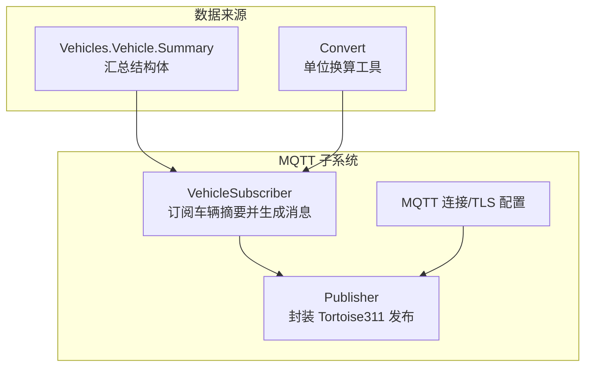
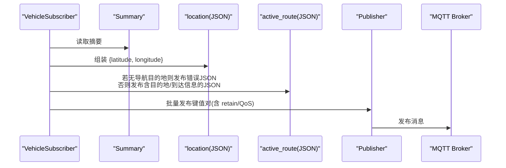
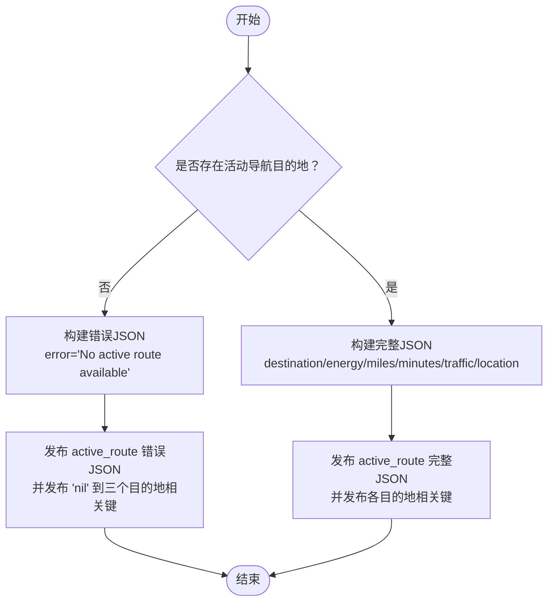
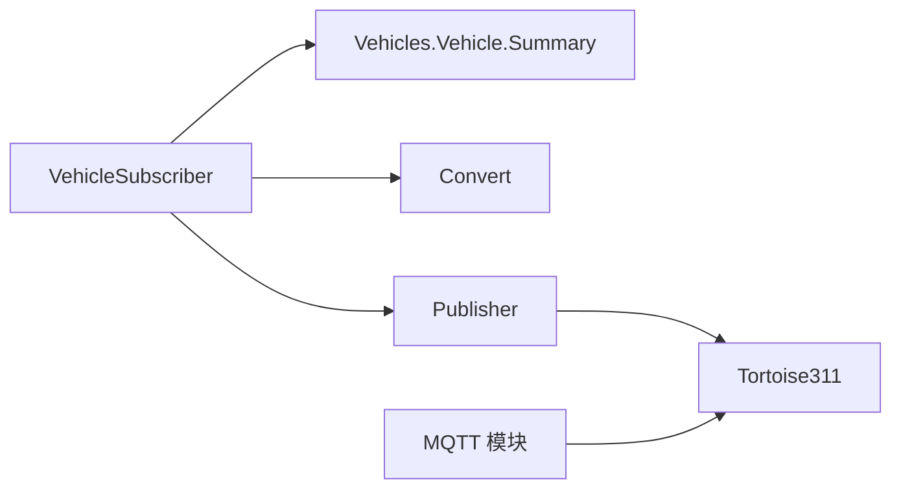

# 消息格式与有效载荷

<cite>
**本文引用的文件**
- [lib/teslamate/mqtt/pubsub/vehicle_subscriber.ex](file://lib/teslamate/mqtt/pubsub/vehicle_subscriber.ex)
- [lib/teslamate/vehicles/vehicle/summary.ex](file://lib/teslamate/vehicles/vehicle/summary.ex)
- [lib/teslamate/mqtt/publisher.ex](file://lib/teslamate/mqtt/publisher.ex)
- [lib/teslamate/mqtt.ex](file://lib/teslamate/mqtt.ex)
- [lib/teslamate/convert.ex](file://lib/teslamate/convert.ex)
- [website/docs/integrations/mqtt.md](file://website/docs/integrations/mqtt.md)
- [website/docs/integrations/home_assistant.md](file://website/docs/integrations/home_assistant.md)
- [test/teslamate/mqtt/pubsub/vehicle_subscriber_test.exs](file://test/teslamate/mqtt/pubsub/vehicle_subscriber_test.exs)
- [test/teslamate/vehicles/vehicle_sync_test.exs](file://test/teslamate/vehicles/vehicle_sync_test.exs)
</cite>

## 目录
1. [简介](#简介)
2. [项目结构](#项目结构)
3. [核心组件](#核心组件)
4. [架构总览](#架构总览)
5. [详细组件分析](#详细组件分析)
6. [依赖关系分析](#依赖关系分析)
7. [性能考量](#性能考量)
8. [故障排查指南](#故障排查指南)
9. [结论](#结论)
10. [附录](#附录)

## 简介
本章节聚焦于 TeslaMate 的 MQTT 消息格式与有效载荷组织方式，重点解析 JSON 结构、复杂数据类型（如 active_route）的字段含义、嵌套结构与取值范围；说明数值型数据的单位（如 kWh、km/h、°C）、布尔型数据的表示方法；并给出空值或错误状态的处理机制（如 error: "No active route available"）。同时结合测试用例与实现源码路径，展示 TeslaMate 如何将 Elixir 数据结构序列化为 JSON 消息，并总结消息格式的最佳实践（如浮点数精度与时间戳格式）。

## 项目结构
TeslaMate 的 MQTT 发布流程由订阅器、发布器与连接管理三部分组成：
- 订阅器：从车辆摘要生成待发布键值对，并按规则过滤与去重后批量发布。
- 发布器：封装 Tortoise311 客户端，支持 QoS 与超时控制。
- 连接管理：负责建立/断开 MQTT 连接、TLS 配置与命名空间。

图表来源
- [lib/teslamate/mqtt/pubsub/vehicle_subscriber.ex](file://lib/teslamate/mqtt/pubsub/vehicle_subscriber.ex#L61-L216)
- [lib/teslamate/mqtt/publisher.ex](file://lib/teslamate/mqtt/publisher.ex#L1-L52)
- [lib/teslamate/mqtt.ex](file://lib/teslamate/mqtt.ex#L1-L64)
- [lib/teslamate/vehicles/vehicle/summary.ex](file://lib/teslamate/vehicles/vehicle/summary.ex#L1-L251)
- [lib/teslamate/convert.ex](file://lib/teslamate/convert.ex#L1-L53)

章节来源
- [lib/teslamate/mqtt/pubsub/vehicle_subscriber.ex](file://lib/teslamate/mqtt/pubsub/vehicle_subscriber.ex#L61-L216)
- [lib/teslamate/mqtt/publisher.ex](file://lib/teslamate/mqtt/publisher.ex#L1-L52)
- [lib/teslamate/mqtt.ex](file://lib/teslamate/mqtt.ex#L1-L64)

## 核心组件
- 车辆摘要结构体：定义了所有可发布的字段集合，包含位置、电量、速度、导航等信息。
- 订阅器：将摘要结构体转换为键值对，处理 location、active_route、geofence 等复杂字段，并进行 JSON 序列化。
- 发布器：统一调用 Tortoise311 发布，支持 retain 与 QoS 控制。
- 单位换算：提供 mph/km、摄氏/华氏等换算工具，确保对外输出单位一致。

章节来源
- [lib/teslamate/vehicles/vehicle/summary.ex](file://lib/teslamate/vehicles/vehicle/summary.ex#L1-L251)
- [lib/teslamate/mqtt/pubsub/vehicle_subscriber.ex](file://lib/teslamate/mqtt/pubsub/vehicle_subscriber.ex#L104-L216)
- [lib/teslamate/mqtt/publisher.ex](file://lib/teslamate/mqtt/publisher.ex#L1-L52)
- [lib/teslamate/convert.ex](file://lib/teslamate/convert.ex#L1-L53)

## 架构总览
下图展示了从车辆摘要到 MQTT 主题发布的关键流程，以及 active_route 的两种发布形态。

图表来源
- [lib/teslamate/mqtt/pubsub/vehicle_subscriber.ex](file://lib/teslamate/mqtt/pubsub/vehicle_subscriber.ex#L104-L199)
- [lib/teslamate/mqtt/publisher.ex](file://lib/teslamate/mqtt/publisher.ex#L20-L52)

章节来源
- [lib/teslamate/mqtt/pubsub/vehicle_subscriber.ex](file://lib/teslamate/mqtt/pubsub/vehicle_subscriber.ex#L104-L199)
- [lib/teslamate/mqtt/publisher.ex](file://lib/teslamate/mqtt/publisher.ex#L20-L52)

## 详细组件分析

### 1) JSON 有效载荷与主题组织
- 主题层级：teslamate[/namespace]/cars/$car_id/$field
- retain 规则：
  - 健康状态（healthy）默认不保留，以避免陈旧状态。
  - 其他字段在值变化或属于“必须保留”的键时才保留。
- QoS：统一使用 QoS 1，保证至少一次送达。
- 时间戳：DateTime 使用 ISO 8601 字符串格式发布。

章节来源
- [lib/teslamate/mqtt/pubsub/vehicle_subscriber.ex](file://lib/teslamate/mqtt/pubsub/vehicle_subscriber.ex#L201-L216)
- [test/teslamate/mqtt/pubsub/vehicle_subscriber_test.exs](file://test/teslamate/mqtt/pubsub/vehicle_subscriber_test.exs#L78-L115)

### 2) 复杂数据类型：active_route
- 结构与字段
  - 当存在活动导航目的地时，active_route 为主题发布一个 JSON 对象，包含：
    - destination：字符串，目的地名称
    - energy_at_arrival：整数或小数，百分比
    - miles_to_arrival：整数或小数，英里
    - minutes_to_arrival：整数或小数，分钟
    - traffic_minutes_delay：整数或小数，分钟
    - location：对象，包含 latitude/longitude
    - error：nil
  - 当不存在活动导航目的地时，active_route 发布 JSON 错误对象：
    - error："No active route available"
    - 同时，active_route_destination、active_route_latitude、active_route_longitude 以字符串 "nil" 发布，便于下游平台识别空值。
- 发布逻辑
  - 若摘要中目的地为空，则构造错误 JSON 并填充上述四个键。
  - 若目的地非空，则构造完整 JSON 并填充相应键。

图表来源
- [lib/teslamate/mqtt/pubsub/vehicle_subscriber.ex](file://lib/teslamate/mqtt/pubsub/vehicle_subscriber.ex#L156-L199)
- [test/teslamate/mqtt/pubsub/vehicle_subscriber_test.exs](file://test/teslamate/mqtt/pubsub/vehicle_subscriber_test.exs#L282-L300)
- [test/teslamate/vehicles/vehicle_sync_test.exs](file://test/teslamate/vehicles/vehicle_sync_test.exs#L160-L187)

章节来源
- [lib/teslamate/mqtt/pubsub/vehicle_subscriber.ex](file://lib/teslamate/mqtt/pubsub/vehicle_subscriber.ex#L156-L199)
- [test/teslamate/mqtt/pubsub/vehicle_subscriber_test.exs](file://test/teslamate/mqtt/pubsub/vehicle_subscriber_test.exs#L282-L300)
- [test/teslamate/vehicles/vehicle_sync_test.exs](file://test/teslamate/vehicles/vehicle_sync_test.exs#L160-L187)

### 3) 地理位置与地理围栏
- location：当纬度/经度均存在时，发布一个包含 latitude/longitude 的 JSON 对象；否则不发布该主题。
- geofence：若当前无地理围栏，使用配置中的默认围栏名；若有围栏则发布其名称。

章节来源
- [lib/teslamate/mqtt/pubsub/vehicle_subscriber.ex](file://lib/teslamate/mqtt/pubsub/vehicle_subscriber.ex#L121-L154)
- [test/teslamate/mqtt/pubsub/vehicle_subscriber_test.exs](file://test/teslamate/mqtt/pubsub/vehicle_subscriber_test.exs#L100-L106)

### 4) 数值型数据与单位
- 速度：km/h
- 温度：°C
- 电量：%
- 能量：kWh
- 电压：V
- 电流：A
- 功率：kW
- 距离：km（里程表、估算/标定/理想续航）
- 高程：m
- 胎压：bar（另有 psi 的传感器配置用于 Home Assistant）
- 时间：ISO 8601 字符串（例如 since、scheduled_charging_start_time）

章节来源
- [website/docs/integrations/mqtt.md](file://website/docs/integrations/mqtt.md#L1-L88)
- [website/docs/integrations/home_assistant.md](file://website/docs/integrations/home_assistant.md#L200-L396)
- [lib/teslamate/mqtt/pubsub/vehicle_subscriber.ex](file://lib/teslamate/mqtt/pubsub/vehicle_subscriber.ex#L214-L216)

### 5) 布尔型数据
- 采用字符串形式发布，如 true/false；在 Home Assistant 中通过 payload_on/payload_off 映射为布尔语义。
- 示例：locked、sentry_mode、windows_open、doors_open、trunk_open、frunk_open、is_climate_on、is_preconditioning、plugged_in 等。

章节来源
- [website/docs/integrations/home_assistant.md](file://website/docs/integrations/home_assistant.md#L558-L694)
- [lib/teslamate/mqtt/pubsub/vehicle_subscriber.ex](file://lib/teslamate/mqtt/pubsub/vehicle_subscriber.ex#L104-L154)

### 6) 空值与错误状态处理
- 空值：当某字段无可用值时（如无活动导航），对应主题发布 "nil" 字符串，以便下游平台识别。
- 错误状态：当无活动导航时，active_route 发布包含 error 的 JSON 对象，同时目的地相关键发布 "nil"。

章节来源
- [lib/teslamate/mqtt/pubsub/vehicle_subscriber.ex](file://lib/teslamate/mqtt/pubsub/vehicle_subscriber.ex#L156-L172)
- [test/teslamate/mqtt/pubsub/vehicle_subscriber_test.exs](file://test/teslamate/mqtt/pubsub/vehicle_subscriber_test.exs#L108-L115)
- [test/teslamate/vehicles/vehicle_sync_test.exs](file://test/teslamate/vehicles/vehicle_sync_test.exs#L160-L187)

### 7) Elixir 数据结构到 JSON 的序列化
- 使用 Jason.encode! 将结构体编码为 JSON 字符串后发布。
- 典型场景：
  - location：{ latitude: 数字, longitude: 数字 }
  - active_route：包含 destination、energy_at_arrival、miles_to_arrival、minutes_to_arrival、traffic_minutes_delay、location、error
  - active_route 错误形态：{ error: "No active route available" }

章节来源
- [lib/teslamate/mqtt/pubsub/vehicle_subscriber.ex](file://lib/teslamate/mqtt/pubsub/vehicle_subscriber.ex#L136-L143)
- [lib/teslamate/mqtt/pubsub/vehicle_subscriber.ex](file://lib/teslamate/mqtt/pubsub/vehicle_subscriber.ex#L156-L199)
- [test/teslamate/mqtt/pubsub/vehicle_subscriber_test.exs](file://test/teslamate/mqtt/pubsub/vehicle_subscriber_test.exs#L100-L106)

### 8) 时间戳与浮点数精度
- 时间戳：DateTime 使用 ISO 8601 字符串发布，确保跨平台一致性。
- 浮点数精度：数值字段在摘要阶段已进行单位换算与舍入（如 miles_to_km、mph_to_kmh），对外发布前统一转为字符串；具体精度取决于换算函数与 Decimal 的舍入策略。

章节来源
- [lib/teslamate/mqtt/pubsub/vehicle_subscriber.ex](file://lib/teslamate/mqtt/pubsub/vehicle_subscriber.ex#L214-L216)
- [lib/teslamate/convert.ex](file://lib/teslamate/convert.ex#L1-L53)

## 依赖关系分析
- VehicleSubscriber 依赖 Vehicles.Vehicle.Summary 提供的数据源，并通过 Convert 进行单位换算。
- 发布器依赖 Tortoise311 客户端，统一处理 QoS 与 retain。
- 连接管理负责 TLS/SSL、IPv6、用户名密码等参数注入。

图表来源
- [lib/teslamate/mqtt/pubsub/vehicle_subscriber.ex](file://lib/teslamate/mqtt/pubsub/vehicle_subscriber.ex#L1-L216)
- [lib/teslamate/mqtt/publisher.ex](file://lib/teslamate/mqtt/publisher.ex#L1-L52)
- [lib/teslamate/mqtt.ex](file://lib/teslamate/mqtt.ex#L1-L64)
- [lib/teslamate/convert.ex](file://lib/teslamate/convert.ex#L1-L53)

章节来源
- [lib/teslamate/mqtt/pubsub/vehicle_subscriber.ex](file://lib/teslamate/mqtt/pubsub/vehicle_subscriber.ex#L1-L216)
- [lib/teslamate/mqtt/publisher.ex](file://lib/teslamate/mqtt/publisher.ex#L1-L52)
- [lib/teslamate/mqtt.ex](file://lib/teslamate/mqtt.ex#L1-L64)

## 性能考量
- 批量异步发布：订阅器对值变更进行流式并发发布，提高吞吐并限制超时。
- retain 策略：仅对必要字段保留，减少 Broker 内存占用与历史消息干扰。
- QoS 1：在可靠性与性能之间取得平衡，避免不必要的 QoS 2 开销。

章节来源
- [lib/teslamate/mqtt/pubsub/vehicle_subscriber.ex](file://lib/teslamate/mqtt/pubsub/vehicle_subscriber.ex#L82-L102)

## 故障排查指南
- 连接问题：检查 MQTT 模块的 TLS/SSL、IPv6、用户名密码配置是否正确。
- 消息未保留：确认主题是否属于“不应保留”列表（如 healthy），或是否满足保留条件。
- active_route 为空：确认车辆是否有活动导航目的地；若无，应收到 error JSON 与 "nil" 相关键。
- 时间戳异常：确认 DateTime 已正确转换为 ISO 8601 字符串。

章节来源
- [lib/teslamate/mqtt.ex](file://lib/teslamate/mqtt.ex#L29-L64)
- [lib/teslamate/mqtt/pubsub/vehicle_subscriber.ex](file://lib/teslamate/mqtt/pubsub/vehicle_subscriber.ex#L25-L39)
- [lib/teslamate/mqtt/pubsub/vehicle_subscriber.ex](file://lib/teslamate/mqtt/pubsub/vehicle_subscriber.ex#L214-L216)

## 结论
TeslaMate 的 MQTT 消息以清晰的主题层级与 JSON 结构组织，既保证了与自动化平台（如 Home Assistant）的兼容性，也提供了灵活的错误与空值表达方式。通过单位换算与 ISO 8601 时间戳，实现了跨语言与跨系统的稳定交互。建议在集成时遵循本文的最佳实践，确保数值精度与时间戳一致性，并合理使用 retain 与 QoS。

## 附录

### A. 主题与字段一览（节选）
- 位置与导航
  - location：JSON 对象，包含 latitude/longitude
  - active_route：JSON 对象（含 destination、energy_at_arrival、miles_to_arrival、minutes_to_arrival、traffic_minutes_delay、location、error）
  - active_route_destination/latitude/longitude：字符串或 "nil"
- 状态与环境
  - state、since、version、update_available、update_version、model、trim_badging、exterior_color、wheel_type、spoiler_type、geofence
- 行驶与能耗
  - power、speed、heading、elevation、odometer、battery_level、usable_battery_level、plugged_in、charging_state、charge_energy_added、charge_limit_soc、charge_port_door_open、charger_actual_current、charger_phases、charger_power、charger_voltage、charge_current_request、charge_current_request_max、scheduled_charging_start_time、time_to_full_charge、tpms_pressure_*、tpms_soft_warning_*、center_display_state
- 车门与车窗
  - locked、sentry_mode、windows_open、doors_open、driver_front_door_open、driver_rear_door_open、passenger_front_door_open、passenger_rear_door_open、trunk_open、frunk_open、is_user_present
- 气候与温度
  - is_climate_on、inside_temp、outside_temp、is_preconditioning、climate_keeper_mode

章节来源
- [website/docs/integrations/mqtt.md](file://website/docs/integrations/mqtt.md#L1-L88)
- [website/docs/integrations/home_assistant.md](file://website/docs/integrations/home_assistant.md#L60-L694)