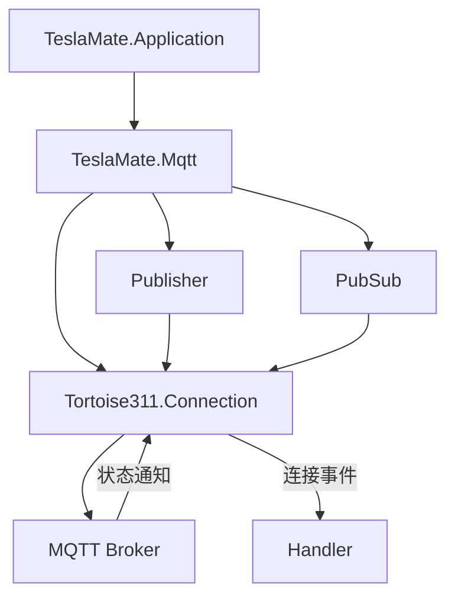

# 连接配置与安全

<cite>
**本文档中引用的文件**  
- [mqtt.ex](file://lib/teslamate/mqtt.ex)
- [runtime.exs](file://config/runtime.exs)
- [environment_variables.md](file://website/docs/configuration/environment_variables.md)
- [mix.exs](file://mix.exs)
- [publisher.ex](file://lib/teslamate/mqtt/publisher.ex)
- [handler.ex](file://lib/teslamate/mqtt/handler.ex)
- [vehicle_subscriber.ex](file://lib/teslamate/mqtt/pubsub/vehicle_subscriber.ex)
- [application.ex](file://lib/teslamate/application.ex)
</cite>

## 目录
1. [MQTT连接配置选项](#mqtt连接配置选项)
2. [TLS加密配置方法](#tls加密配置方法)
3. [客户端ID生成策略](#客户端id生成策略)
4. [IPv6支持配置](#ipv6支持配置)
5. [Tortoise311.Connection初始化与底层实现](#tortoise311connection初始化与底层实现)
6. [安全配置建议](#安全配置建议)

## MQTT连接配置选项

TeslaMate通过环境变量配置MQTT连接参数，包括主机地址、端口、用户名和密码认证机制。这些配置在`config/runtime.exs`中被读取并传递给`TeslaMate.Mqtt`模块。核心配置项包括：

- **MQTT_HOST**: MQTT代理的主机名（必需，除非禁用MQTT）
- **MQTT_PORT**: MQTT代理的端口（默认1883用于非TLS，8883用于TLS）
- **MQTT_USERNAME**: 用于认证的用户名
- **MQTT_PASSWORD**: 用于认证的密码

这些配置通过`TeslaMate.Mqtt`模块的`start_link/1`函数传递给`Tortoise311.Connection`，作为连接初始化的一部分。连接配置在`connection_config/1`函数中构建，包含用户名、密码、服务器地址和端口等信息。

**Section sources**
- [runtime.exs](file://config/runtime.exs#L168-L178)
- [mqtt.ex](file://lib/teslamate/mqtt.ex#L29-L58)

## TLS加密配置方法

TeslaMate支持通过TLS加密MQTT通信，配置方法如下：

- **MQTT_TLS**: 设置为`true`以启用TLS加密
- **MQTT_TLS_ACCEPT_INVALID_CERTS**: 设置为`true`以接受无效证书（不推荐用于生产环境）

在代码实现中，当`opts[:tls]`为`true`时，系统会使用`Transport.SSL`创建安全连接。CA证书通过`CAStore.file_path()`获取，确保使用受信任的证书颁发机构。如果`accept_invalid_certs`选项启用，则SSL验证模式设置为`:verify_none`，否则为`:verify_peer`，后者会严格验证服务器证书。

此配置确保了MQTT通信的机密性和完整性，防止中间人攻击和窃听。

**Section sources**
- [mqtt.ex](file://lib/teslamate/mqtt.ex#L36-L48)
- [runtime.exs](file://config/runtime.exs#L174-L175)

## 客户端ID生成策略

TeslaMate使用特定的客户端ID生成策略来确保在网络中的唯一性。客户端ID的生成在`generate_client_id/0`函数中实现，其格式为`TESLAMATE_`前缀加上一个随机字符串。

生成过程如下：
1. 使用`:rand.uniform()`生成一个随机数
2. 转换为字符串并进行Base16编码
3. 截取前11个字符与`TESLAMATE_`前缀拼接

这种策略确保了每个TeslaMate实例的MQTT客户端ID在网络中具有唯一性，避免了客户端ID冲突导致的连接问题。前缀`TESLAMATE_`也便于在MQTT代理中识别和管理TeslaMate相关的连接。

**Section sources**
- [mqtt.ex](file://lib/teslamate/mqtt.ex#L61-L63)

## IPv6支持配置

TeslaMate支持IPv6网络配置，可通过环境变量`MQTT_IPV6`启用。当该变量设置为`true`时，系统会在连接时添加`:inet6`套接字选项，允许通过IPv6地址连接到MQTT代理。

在代码中，`connection_config/1`函数根据`opts[:ipv6]`的值决定是否包含`[:inet6]`作为`socket_opts`。这一配置使得TeslaMate能够在纯IPv6或双栈网络环境中正常工作，提高了网络部署的灵活性。

**Section sources**
- [mqtt.ex](file://lib/teslamate/mqtt.ex#L30-L33)
- [runtime.exs](file://config/runtime.exs#L177)

## Tortoise311.Connection初始化与底层实现

TeslaMate使用`Tortoise311`库作为MQTT客户端，其连接初始化和管理通过Supervisor实现。在`TeslaMate.Mqtt.init/1`函数中，系统创建了三个子进程：
1. `Tortoise311.Connection`: 负责MQTT连接
2. `Publisher`: 负责消息发布
3. `PubSub`: 负责订阅管理

连接超时、重试机制和心跳间隔由`Tortoise311`库底层处理。虽然具体实现细节不在当前代码库中，但通过`Tortoise311.Connection`的配置，系统能够自动处理网络中断和重连。`Handler`模块实现了连接状态回调，能够在连接建立、断开或终止时记录日志，便于监控和故障排查。

消息发布通过`Publisher`模块实现，使用`GenServer.call/3`进行同步调用，并设置了10秒的超时时间。对于QoS大于0的消息，系统会跟踪发布引用，确保消息确认机制正常工作。

**Diagram sources**
- [mqtt.ex](file://lib/teslamate/mqtt.ex#L12-L23)
- [application.ex](file://lib/teslamate/application.ex#L20-L35)

**Section sources**
- [mqtt.ex](file://lib/teslamate/mqtt.ex#L8-L23)
- [publisher.ex](file://lib/teslamate/mqtt/publisher.ex#L7-L8)
- [handler.ex](file://lib/teslamate/mqtt/handler.ex#L6-L19)

## 安全配置建议

为确保TeslaMate的MQTT连接安全，建议采取以下措施：

1. **使用专用MQTT用户**: 为TeslaMate创建专用的MQTT用户名和密码，避免使用管理员账户，遵循最小权限原则。

2. **网络隔离**: 将MQTT代理部署在受保护的网络区域，限制外部访问，仅允许TeslaMate服务器连接。

3. **证书固定**: 在生产环境中，应禁用`MQTT_TLS_ACCEPT_INVALID_CERTS`选项，使用有效的TLS证书并启用证书验证，防止中间人攻击。

4. **启用TLS加密**: 始终使用`MQTT_TLS=true`配置，确保MQTT通信的机密性和完整性。

5. **定期轮换凭证**: 定期更新MQTT用户名和密码，减少凭证泄露的风险。

6. **监控连接状态**: 通过日志监控MQTT连接的建立和断开事件，及时发现异常连接行为。

这些安全措施能够有效保护TeslaMate与MQTT代理之间的通信，防止数据泄露和未授权访问。

**Section sources**
- [runtime.exs](file://config/runtime.exs#L174-L175)
- [environment_variables.md](file://website/docs/configuration/environment_variables.md#L34-L35)