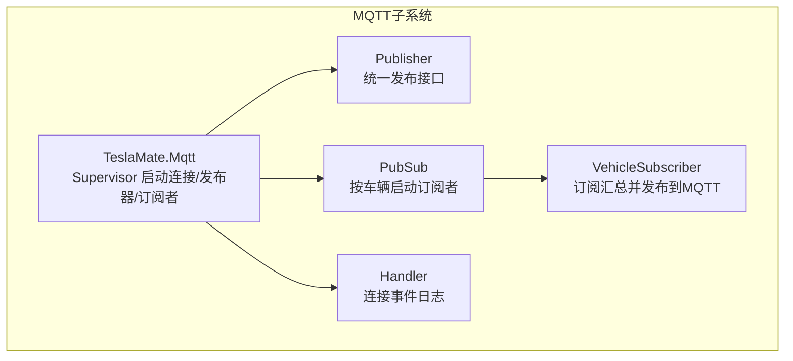
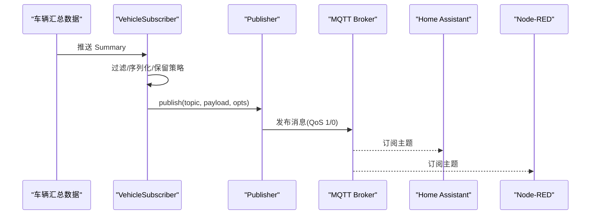
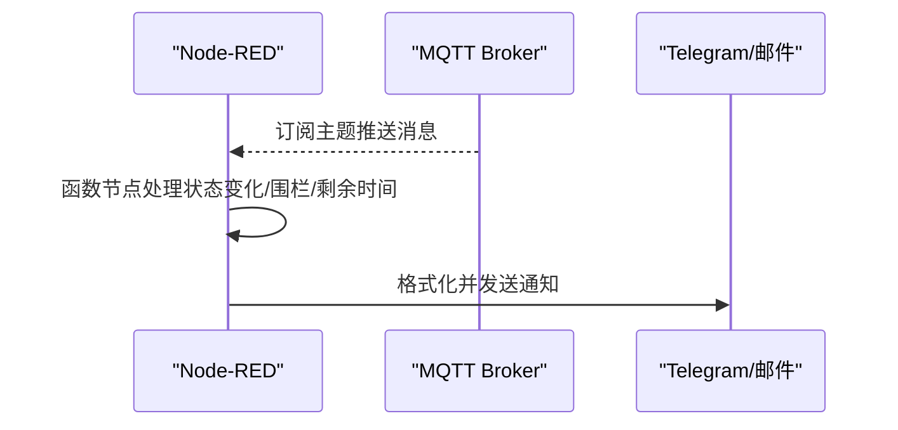
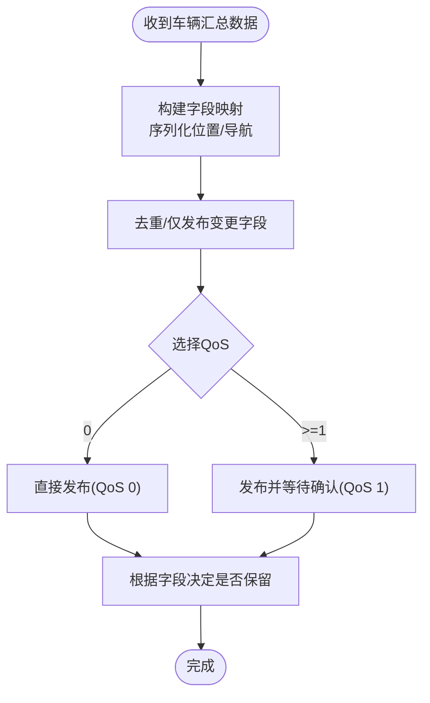
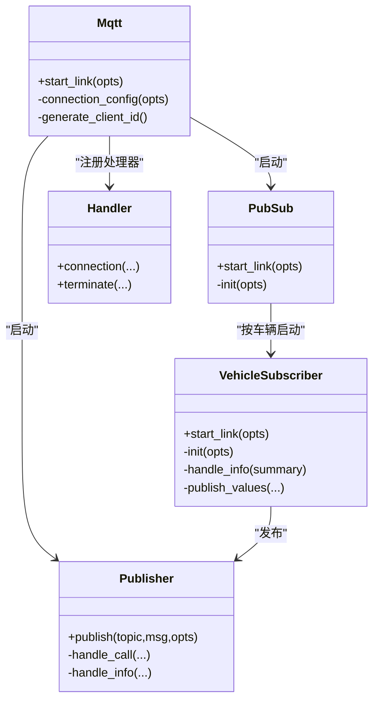

# 集成示例与故障排除

<cite>
**本文引用的文件**
- [lib/teslamate/mqtt.ex](file://lib/teslamate/mqtt.ex)
- [lib/teslamate/mqtt/publisher.ex](file://lib/teslamate/mqtt/publisher.ex)
- [lib/teslamate/mqtt/handler.ex](file://lib/teslamate/mqtt/handler.ex)
- [lib/teslamate/mqtt/pubsub.ex](file://lib/teslamate/mqtt/pubsub.ex)
- [lib/teslamate/mqtt/pubsub/vehicle_subscriber.ex](file://lib/teslamate/mqtt/pubsub/vehicle_subscriber.ex)
- [website/docs/integrations/home_assistant.md](file://website/docs/integrations/home_assistant.md)
- [website/docs/integrations/Node-RED.md](file://website/docs/integrations/Node-RED.md)
- [website/docs/integrations/Node-RED/Teslamate-flows.json.example](file://website/docs/integrations/Node-RED/Teslamate-flows.json.example)
- [website/docs/integrations/mqtt.md](file://website/docs/integrations/mqtt.md)
- [website/docs/configuration/environment_variables.md](file://website/docs/configuration/environment_variables.md)
- [test/teslamate/mqtt/pubsub/vehicle_subscriber_test.exs](file://test/teslamate/mqtt/pubsub/vehicle_subscriber_test.exs)
</cite>

## 目录
1. [简介](#简介)
2. [项目结构](#项目结构)
3. [核心组件](#核心组件)
4. [架构总览](#架构总览)
5. [详细组件分析](#详细组件分析)
6. [依赖关系分析](#依赖关系分析)
7. [性能考量](#性能考量)
8. [故障排除指南](#故障排除指南)
9. [结论](#结论)
10. [附录](#附录)

## 简介
本文件面向希望将 TeslaMate 与主流自动化平台（Home Assistant、Node-RED）集成的用户，提供可操作的集成示例与排障建议。内容基于仓库中的 MQTT 实现与官方集成文档，覆盖：
- 在 Home Assistant 中通过 MQTT 自动发现创建传感器
- 在 Node-RED 中订阅 TeslaMate 的 MQTT 主题并触发自动化
- 常见问题排查：连接失败、认证错误、消息丢失、主题不匹配
- 调试技巧：使用 mosquitto_sub 监控消息流；解读 Elixir 日志中的 MQTT 错误

## 项目结构
TeslaMate 的 MQTT 集成由以下模块组成：
- 连接与配置：负责建立到 MQTT Broker 的连接、TLS/用户名密码等参数
- 发布器：统一发布接口，支持 QoS 与超时控制
- 订阅者：按车辆实例订阅汇总数据并发布到 MQTT 主题
- 处理器：连接生命周期事件的日志记录

图表来源
- [lib/teslamate/mqtt.ex](file://lib/teslamate/mqtt.ex#L1-L64)
- [lib/teslamate/mqtt/publisher.ex](file://lib/teslamate/mqtt/publisher.ex#L1-L52)
- [lib/teslamate/mqtt/pubsub.ex](file://lib/teslamate/mqtt/pubsub.ex#L1-L21)
- [lib/teslamate/mqtt/pubsub/vehicle_subscriber.ex](file://lib/teslamate/mqtt/pubsub/vehicle_subscriber.ex#L1-L217)
- [lib/teslamate/mqtt/handler.ex](file://lib/teslamate/mqtt/handler.ex#L1-L28)

章节来源
- [lib/teslamate/mqtt.ex](file://lib/teslamate/mqtt.ex#L1-L64)
- [lib/teslamate/mqtt/publisher.ex](file://lib/teslamate/mqtt/publisher.ex#L1-L52)
- [lib/teslamate/mqtt/pubsub.ex](file://lib/teslamate/mqtt/pubsub.ex#L1-L21)
- [lib/teslamate/mqtt/pubsub/vehicle_subscriber.ex](file://lib/teslamate/mqtt/pubsub/vehicle_subscriber.ex#L1-L217)
- [lib/teslamate/mqtt/handler.ex](file://lib/teslamate/mqtt/handler.ex#L1-L28)

## 核心组件
- MQTT 连接与配置
  - 支持 TCP/TLS、IPv6、用户名/密码、客户端 ID 生成
  - 默认端口：TCP 1883，TLS 8883
- 发布器
  - 提供同步发布调用，支持 QoS 0/1，内部维护发布引用以等待确认
- 订阅者
  - 按车辆订阅汇总数据，过滤重复值、保留策略、JSON 序列化位置与导航信息
  - 支持命名空间前缀，便于多租户或多账户隔离
- 处理器
  - 记录连接建立、断开、终止等事件，便于排障

章节来源
- [lib/teslamate/mqtt.ex](file://lib/teslamate/mqtt.ex#L1-L64)
- [lib/teslamate/mqtt/publisher.ex](file://lib/teslamate/mqtt/publisher.ex#L1-L52)
- [lib/teslamate/mqtt/pubsub/vehicle_subscriber.ex](file://lib/teslamate/mqtt/pubsub/vehicle_subscriber.ex#L1-L217)
- [lib/teslamate/mqtt/handler.ex](file://lib/teslamate/mqtt/handler.ex#L1-L28)

## 架构总览
下图展示了从车辆汇总数据到 MQTT 主题发布的完整链路，以及 Home Assistant/Node-RED 的消费方式。

图表来源
- [lib/teslamate/mqtt/pubsub/vehicle_subscriber.ex](file://lib/teslamate/mqtt/pubsub/vehicle_subscriber.ex#L60-L116)
- [lib/teslamate/mqtt/publisher.ex](file://lib/teslamate/mqtt/publisher.ex#L20-L52)
- [website/docs/integrations/mqtt.md](file://website/docs/integrations/mqtt.md#L1-L120)

## 详细组件分析

### Home Assistant 集成（MQTT 自动发现）
- 主题格式
  - 默认主题前缀为 teslamate/cars/{car_id}/字段名
  - 可通过 MQTT_NAMESPACE 设置自定义命名空间，例如 teslamate/{namespace}/cars/{car_id}/字段名
- 传感器映射
  - 官方文档提供了完整的字段列表与 Home Assistant 传感器配置示例，包括设备追踪器、二进制传感器、数值传感器等
- 使用步骤要点
  - 在 Home Assistant 中配置 MQTT 平台，订阅 teslamate/cars/{car_id}/# 或带命名空间的主题
  - 将各字段映射到对应实体，利用 state_topic/json_attributes_topic 等属性
  - 注意 car_id 通常从 1 开始，若存在多车需核对实际 ID

章节来源
- [website/docs/integrations/mqtt.md](file://website/docs/integrations/mqtt.md#L1-L120)
- [website/docs/integrations/home_assistant.md](file://website/docs/integrations/home_assistant.md#L27-L120)
- [website/docs/configuration/environment_variables.md](file://website/docs/configuration/environment_variables.md#L25-L40)

### Node-RED 集成（订阅与自动化）
- 流程概览
  - 订阅 teslamate/cars/{car_id}/# 获取实时状态
  - 使用函数节点处理状态变化、进入/离开地理围栏、剩余充电时间等
  - 通过 Telegram/邮件等节点发送通知
- 关键节点说明
  - MQTT 输入节点：订阅指定主题，QoS 2 示例
  - 函数节点：存储全局状态、计算剩余时间字符串、筛选感兴趣字段
  - Telegram/邮件节点：格式化消息并发送
- 导入与部署
  - 下载示例 JSON，导入 Node-RED
  - 安装所需模块后部署，必要时在 MQTT 节点中配置 Broker 地址与端口

图表来源
- [website/docs/integrations/Node-RED.md](file://website/docs/integrations/Node-RED.md#L1-L141)
- [website/docs/integrations/Node-RED/Teslamate-flows.json.example](file://website/docs/integrations/Node-RED/Teslamate-flows.json.example#L1-L677)

章节来源
- [website/docs/integrations/Node-RED.md](file://website/docs/integrations/Node-RED.md#L1-L141)
- [website/docs/integrations/Node-RED/Teslamate-flows.json.example](file://website/docs/integrations/Node-RED/Teslamate-flows.json.example#L1-L677)

### MQTT 主题与命名空间
- 主题结构
  - 默认：teslamate/cars/{car_id}/{字段名}
  - 命名空间：teslamate/{namespace}/cars/{car_id}/{字段名}
- 字段覆盖
  - 包含车辆状态、位置、导航、电池、轮胎压力、门/窗/舱盖开关、空调/预热等
- 保留策略
  - 对部分字段（如 healthy）采用非保留发布，避免陈旧值污染
  - 其他字段默认保留，便于离线接入后立即获得最新值

章节来源
- [website/docs/integrations/mqtt.md](file://website/docs/integrations/mqtt.md#L1-L120)
- [lib/teslamate/mqtt/pubsub/vehicle_subscriber.ex](file://lib/teslamate/mqtt/pubsub/vehicle_subscriber.ex#L25-L39)
- [lib/teslamate/mqtt/pubsub/vehicle_subscriber.ex](file://lib/teslamate/mqtt/pubsub/vehicle_subscriber.ex#L201-L216)
- [website/docs/configuration/environment_variables.md](file://website/docs/configuration/environment_variables.md#L25-L40)

### 发布逻辑与 QoS 行为
- 发布器
  - QoS 0：直接发布，不等待确认
  - QoS 1：发布后等待确认，内部维护引用并在回调中回复调用方
- 超时与并发
  - 发布调用设置超时，异步并发发布，限制最大并发数，超时即放弃
- 连接事件
  - 连接建立/断开/终止均记录日志，便于定位网络问题

图表来源
- [lib/teslamate/mqtt/pubsub/vehicle_subscriber.ex](file://lib/teslamate/mqtt/pubsub/vehicle_subscriber.ex#L60-L116)
- [lib/teslamate/mqtt/publisher.ex](file://lib/teslamate/mqtt/publisher.ex#L20-L52)

章节来源
- [lib/teslamate/mqtt/publisher.ex](file://lib/teslamate/mqtt/publisher.ex#L1-L52)
- [lib/teslamate/mqtt/handler.ex](file://lib/teslamate/mqtt/handler.ex#L1-L28)

## 依赖关系分析
- 组件耦合
  - VehicleSubscriber 依赖 Vehicles 服务与 Publisher
  - Publisher 依赖 Tortoise311 发布实现
  - Mqtt Supervisor 统一管理连接、发布器与 PubSub
- 外部依赖
  - MQTT Broker（Mosquitto 等）
  - Home Assistant/Node-RED 作为消费者

图表来源
- [lib/teslamate/mqtt.ex](file://lib/teslamate/mqtt.ex#L1-L64)
- [lib/teslamate/mqtt/publisher.ex](file://lib/teslamate/mqtt/publisher.ex#L1-L52)
- [lib/teslamate/mqtt/pubsub.ex](file://lib/teslamate/mqtt/pubsub.ex#L1-L21)
- [lib/teslamate/mqtt/pubsub/vehicle_subscriber.ex](file://lib/teslamate/mqtt/pubsub/vehicle_subscriber.ex#L1-L217)
- [lib/teslamate/mqtt/handler.ex](file://lib/teslamate/mqtt/handler.ex#L1-L28)

章节来源
- [lib/teslamate/mqtt.ex](file://lib/teslamate/mqtt.ex#L1-L64)
- [lib/teslamate/mqtt/publisher.ex](file://lib/teslamate/mqtt/publisher.ex#L1-L52)
- [lib/teslamate/mqtt/pubsub.ex](file://lib/teslamate/mqtt/pubsub.ex#L1-L21)
- [lib/teslamate/mqtt/pubsub/vehicle_subscriber.ex](file://lib/teslamate/mqtt/pubsub/vehicle_subscriber.ex#L1-L217)
- [lib/teslamate/mqtt/handler.ex](file://lib/teslamate/mqtt/handler.ex#L1-L28)

## 性能考量
- QoS 与确认
  - QoS 1 会增加往返确认开销，适合关键状态；QoS 0 适合高频但可容忍丢包的数据
- 并发发布
  - 发布器内部限制并发，避免阻塞；高并发场景建议降低字段更新频率或使用 QoS 0
- 保留策略
  - 对频繁变化字段不保留，减少 Broker 存储压力；对关键状态保留，提升首次接入体验
- 连接参数
  - 合理设置 keepalive、超时与 IPv6/SSL 选项，避免不必要的握手与证书校验失败

[本节为通用指导，无需列出具体文件来源]

## 故障排除指南

### 连接失败（检查主机/端口）
- 症状
  - Home Assistant/Node-RED 无法订阅到主题；MQTT 连接日志出现断开/终止
- 排查步骤
  - 确认 MQTT_HOST/MQTT_PORT 是否正确，端口是否开放
  - 若启用 TLS，确认 MQTT_TLS 与 MQTT_TLS_ACCEPT_INVALID_CERTS 设置
  - 如使用 IPv6，确认 MQTT_IPV6 已开启
- 参考配置项
  - MQTT_HOST、MQTT_PORT、MQTT_TLS、MQTT_TLS_ACCEPT_INVALID_CERTS、MQTT_IPV6

章节来源
- [website/docs/configuration/environment_variables.md](file://website/docs/configuration/environment_variables.md#L25-L40)
- [lib/teslamate/mqtt.ex](file://lib/teslamate/mqtt.ex#L29-L59)
- [lib/teslamate/mqtt/handler.ex](file://lib/teslamate/mqtt/handler.ex#L1-L28)

### 认证错误（验证用户名/密码）
- 症状
  - 连接被拒绝；日志提示认证失败
- 排查步骤
  - 核对 MQTT_USERNAME/MQTT_PASSWORD
  - 若使用 TLS，确认证书校验策略与 CA 文件路径
- 参考配置项
  - MQTT_USERNAME、MQTT_PASSWORD、MQTT_TLS、MQTT_TLS_ACCEPT_INVALID_CERTS

章节来源
- [website/docs/configuration/environment_variables.md](file://website/docs/configuration/environment_variables.md#L25-L40)
- [lib/teslamate/mqtt.ex](file://lib/teslamate/mqtt.ex#L29-L59)

### 消息丢失（检查 QoS 和网络）
- 症状
  - Home Assistant/Node-RED 未收到某些字段更新
- 排查步骤
  - 确认订阅 QoS 设置（Node-RED 示例使用 QoS 2），Broker 支持情况
  - 检查网络稳定性与防火墙策略
  - 对关键字段使用 QoS 1，非关键字段可使用 QoS 0
- 参考实现
  - 发布器对 QoS 1 的确认机制与超时处理

章节来源
- [lib/teslamate/mqtt/publisher.ex](file://lib/teslamate/mqtt/publisher.ex#L20-L52)
- [website/docs/integrations/Node-RED/Teslamate-flows.json.example](file://website/docs/integrations/Node-RED/Teslamate-flows.json.example#L266-L279)

### 主题不匹配（验证 car_id）
- 症状
  - Home Assistant/Node-RED 订阅不到数据；或订阅到错误 car_id
- 排查步骤
  - 确认订阅的主题前缀与 car_id 是否与 TeslaMate 发布一致
  - 若使用 MQTT_NAMESPACE，请确保订阅主题包含该命名空间
- 参考主题结构
  - 默认：teslamate/cars/{car_id}/字段名
  - 命名空间：teslamate/{namespace}/cars/{car_id}/字段名

章节来源
- [website/docs/integrations/mqtt.md](file://website/docs/integrations/mqtt.md#L1-L120)
- [website/docs/configuration/environment_variables.md](file://website/docs/configuration/environment_variables.md#L25-L40)

### 调试技巧
- 使用 mosquitto_sub 监控消息流
  - 订阅 teslamate/cars/{car_id}/# 或带命名空间的主题，观察字段更新
- 解读 Elixir 日志中的 MQTT 错误
  - 关注连接事件日志：连接建立、断开、终止
  - 发布失败日志：发布器对异常结果的警告
- 参考日志位置
  - 连接事件日志：Handler
  - 发布失败日志：VehicleSubscriber 对发布失败的警告

章节来源
- [lib/teslamate/mqtt/handler.ex](file://lib/teslamate/mqtt/handler.ex#L1-L28)
- [lib/teslamate/mqtt/pubsub/vehicle_subscriber.ex](file://lib/teslamate/mqtt/pubsub/vehicle_subscriber.ex#L90-L102)

## 结论
通过上述集成与排障实践，用户可在 Home Assistant 与 Node-RED 中稳定消费 TeslaMate 的 MQTT 数据，实现丰富的自动化场景。建议：
- 正确配置 MQTT 连接参数与命名空间
- 合理选择 QoS 与保留策略
- 使用 mosquitto_sub 与日志进行快速定位
- 在 Home Assistant 中按字段映射完善传感器与设备追踪器

[本节为总结性内容，无需列出具体文件来源]

## 附录

### Home Assistant 配置要点（摘要）
- 在 configuration.yaml 中配置 MQTT 平台与传感器
- 使用 state_topic/json_attributes_topic 映射字段
- 设备标识与配置链接应指向 TeslaMate Web 界面地址

章节来源
- [website/docs/integrations/home_assistant.md](file://website/docs/integrations/home_assistant.md#L27-L120)

### Node-RED 导入与配置（摘要）
- 下载示例 JSON 并导入
- 安装所需模块后部署
- 在 MQTT 节点中配置 Broker 地址与端口
- Telegram/邮件节点按需配置

章节来源
- [website/docs/integrations/Node-RED.md](file://website/docs/integrations/Node-RED.md#L1-L141)
- [website/docs/integrations/Node-RED/Teslamate-flows.json.example](file://website/docs/integrations/Node-RED/Teslamate-flows.json.example#L1-L677)