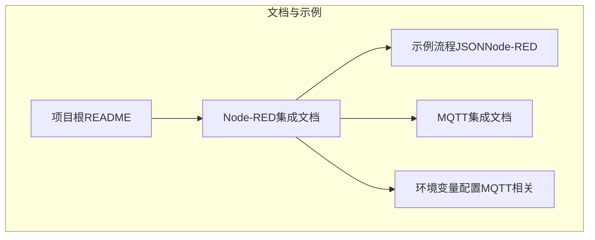
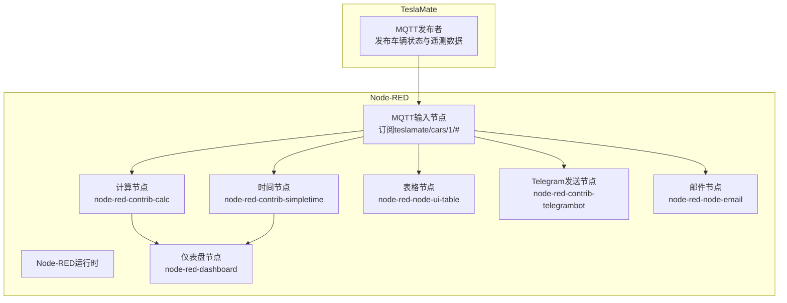
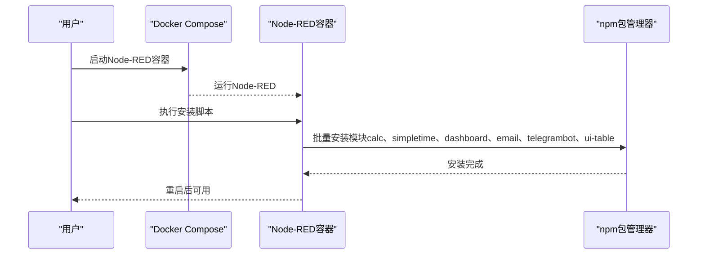
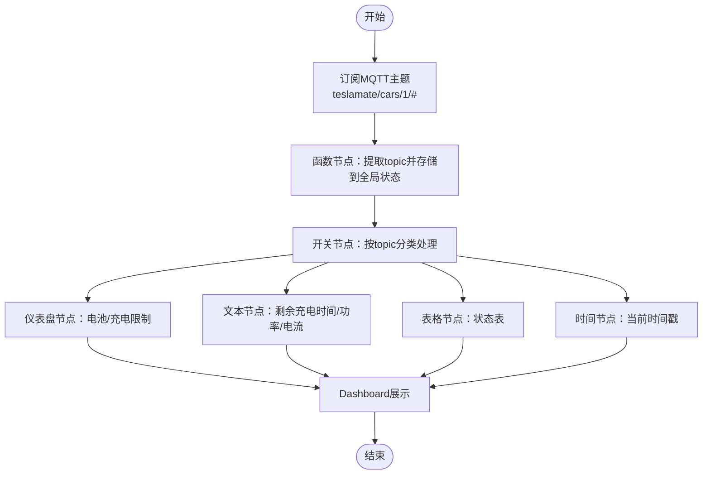
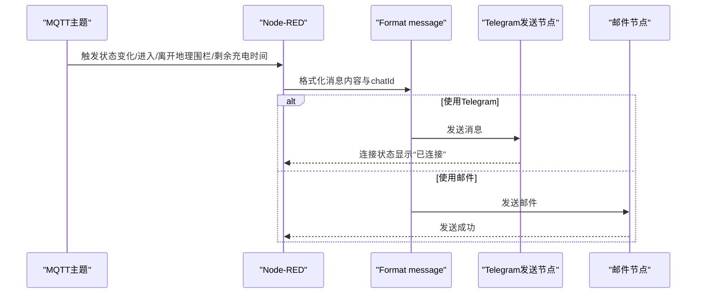
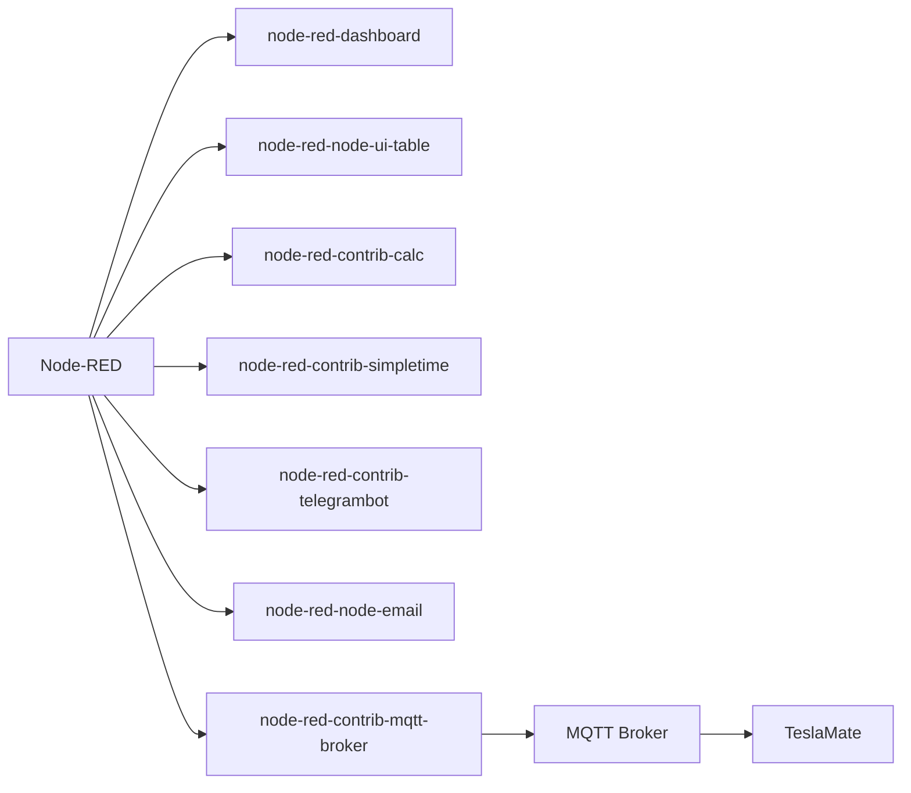

# Node-RED模块与依赖

<cite>
**本文引用的文件**
- [Node-RED集成文档](file://website/docs/integrations/Node-RED.md)
- [示例流程JSON（Node-RED）](file://website/docs/integrations/Node-RED/Teslamate-flows.json.example)
- [MQTT集成文档](file://website/docs/integrations/mqtt.md)
- [环境变量配置（MQTT相关）](file://website/docs/configuration/environment_variables.md)
- [项目根README](file://README.md)
</cite>

## 目录
1. [简介](#简介)
2. [项目结构](#项目结构)
3. [核心组件](#核心组件)
4. [架构总览](#架构总览)
5. [详细组件分析](#详细组件分析)
6. [依赖关系分析](#依赖关系分析)
7. [性能考虑](#性能考虑)
8. [故障排查指南](#故障排查指南)
9. [结论](#结论)
10. [附录](#附录)

## 简介
本章节面向希望在TeslaMate环境中集成并运行Node-RED的用户，系统性梳理集成所需的Node-RED核心模块、各模块功能与在集成中的作用、安装与验证方法、常见问题与解决方案，以及版本兼容性建议。文档内容完全基于仓库内现有文档与示例流程，确保可操作性与一致性。

## 项目结构
与Node-RED集成直接相关的文件主要集中在网站文档目录：
- website/docs/integrations/Node-RED.md：Node-RED集成概览、安装步骤、所需模块清单与导入流程
- website/docs/integrations/Node-RED/Teslamate-flows.json.example：示例流程JSON，包含Dashboard与通知流，展示各模块的实际使用方式
- website/docs/integrations/mqtt.md：MQTT主题与发布数据结构，为Node-RED订阅与可视化提供依据
- website/docs/configuration/environment_variables.md：MQTT相关环境变量，用于配置MQTT连接参数
- README.md：项目总体介绍，包含对“易于集成到Node-Red”的说明

**图表来源**
- [Node-RED集成文档](file://website/docs/integrations/Node-RED.md#L1-L141)
- [示例流程JSON（Node-RED）](file://website/docs/integrations/Node-RED/Teslamate-flows.json.example#L1-L677)
- [MQTT集成文档](file://website/docs/integrations/mqtt.md#L1-L120)
- [环境变量配置（MQTT相关）](file://website/docs/configuration/environment_variables.md#L29-L40)
- [项目根README](file://README.md#L1-L88)

**章节来源**
- [Node-RED集成文档](file://website/docs/integrations/Node-RED.md#L1-L141)
- [示例流程JSON（Node-RED）](file://website/docs/integrations/Node-RED/Teslamate-flows.json.example#L1-L677)
- [MQTT集成文档](file://website/docs/integrations/mqtt.md#L1-L120)
- [环境变量配置（MQTT相关）](file://website/docs/configuration/environment_variables.md#L29-L40)
- [项目根README](file://README.md#L1-L88)

## 核心组件
根据仓库文档与示例流程，Node-RED集成所需的核心模块与组件如下：

- node-red-dashboard
  - 功能：提供可视化仪表盘，用于展示车辆状态、电量、剩余充电时间等关键指标。
  - 在集成中的作用：将MQTT订阅的数据渲染为UI控件（文本、仪表盘、表格等），形成直观的“Car Dashboard”流。
  - 参考路径：[示例流程JSON（Node-RED）](file://website/docs/integrations/Node-RED/Teslamate-flows.json.example#L1-L677)

- node-red-node-email
  - 功能：发送邮件通知。
  - 在集成中的作用：作为通知链路的替代通道，可在不使用Telegram时启用，快速验证通知机制。
  - 参考路径：[Node-RED集成文档](file://website/docs/integrations/Node-RED.md#L120-L137)

- node-red-contrib-telegrambot
  - 功能：与Telegram机器人交互，支持消息发送与接收。
  - 在集成中的作用：作为主要通知通道，将状态变化、进入/离开地理围栏、剩余充电时间等事件推送到Telegram。
  - 参考路径：[示例流程JSON（Node-RED）](file://website/docs/integrations/Node-RED/Teslamate-flows.json.example#L1-L677)

- node-red-node-ui-table
  - 功能：在仪表盘中以表格形式展示键值对数据。
  - 在集成中的作用：用于展示车辆状态表（如状态、里程、是否有人在车内等）。
  - 参考路径：[Node-RED集成文档](file://website/docs/integrations/Node-RED.md#L82-L105)

- node-red-contrib-calc
  - 功能：基础计算节点。
  - 在集成中的作用：用于数值处理与格式化（例如示例流程中对剩余充电时间的字符串化处理）。
  - 参考路径：[示例流程JSON（Node-RED）](file://website/docs/integrations/Node-RED/Teslamate-flows.json.example#L1-L677)

- node-red-contrib-simpletime
  - 功能：时间与时序节点。
  - 在集成中的作用：生成当前时间戳与格式化输出，辅助仪表盘显示“最后更新时间”等。
  - 参考路径：[示例流程JSON（Node-RED）](file://website/docs/integrations/Node-RED/Teslamate-flows.json.example#L1-L677)

- node-red-node-telegrambot（注意：仓库文档中使用的是node-red-contrib-telegrambot）
  - 功能：Telegram机器人节点（contrib版本）。
  - 在集成中的作用：与Telegram机器人对接，实现消息发送与配置。
  - 参考路径：[Node-RED集成文档](file://website/docs/integrations/Node-RED.md#L82-L105)、[示例流程JSON（Node-RED）](file://website/docs/integrations/Node-RED/Teslamate-flows.json.example#L1-L677)

- node-red-contrib-mqtt-broker（示例流程中包含该节点类型）
  - 功能：MQTT Broker节点配置。
  - 在集成中的作用：在示例流程中用于配置MQTT服务器参数（主机、端口、协议版本等），以便从TeslaMate的MQTT主题订阅数据。
  - 参考路径：[示例流程JSON（Node-RED）](file://website/docs/integrations/Node-RED/Teslamate-flows.json.example#L1-L677)

**章节来源**
- [Node-RED集成文档](file://website/docs/integrations/Node-RED.md#L82-L105)
- [示例流程JSON（Node-RED）](file://website/docs/integrations/Node-RED/Teslamate-flows.json.example#L1-L677)

## 架构总览
下图展示了TeslaMate与Node-RED之间的数据与控制流关系，以及Node-RED内部各模块的协作方式。

**图表来源**
- [MQTT集成文档](file://website/docs/integrations/mqtt.md#L1-L120)
- [示例流程JSON（Node-RED）](file://website/docs/integrations/Node-RED/Teslamate-flows.json.example#L1-L677)
- [Node-RED集成文档](file://website/docs/integrations/Node-RED.md#L82-L105)

## 详细组件分析

### 组件A：Node-RED安装与模块安装脚本
- 安装入口
  - 使用Docker部署Node-RED容器，映射数据卷与端口，设置时区环境变量。
  - 参考路径：[Node-RED集成文档](file://website/docs/integrations/Node-RED.md#L51-L76)

- 模块安装脚本
  - 提供一个shell脚本，通过docker compose exec调用npm，在Node-RED容器内批量安装所需模块，并重启服务。
  - 参考路径：[Node-RED集成文档](file://website/docs/integrations/Node-RED.md#L84-L105)

- 验证安装
  - 通过Node-RED编辑器的“导入”功能加载示例JSON，确认各节点可用；随后在“Car Dashboard”与“Notifications”流中进行部署与测试。
  - 参考路径：[Node-RED集成文档](file://website/docs/integrations/Node-RED.md#L106-L137)

**图表来源**
- [Node-RED集成文档](file://website/docs/integrations/Node-RED.md#L51-L105)

**章节来源**
- [Node-RED集成文档](file://website/docs/integrations/Node-RED.md#L51-L105)

### 组件B：Dashboard流（可视化与仪表盘）
- 数据来源
  - 订阅TeslaMate发布的MQTT主题（如teslamate/cars/1/#），并将关键字段存储到全局状态，供UI节点使用。
  - 参考路径：[示例流程JSON（Node-RED）](file://website/docs/integrations/Node-RED/Teslamate-flows.json.example#L1-L677)

- 可视化组件
  - 使用node-red-dashboard与node-red-node-ui-table，展示电池百分比、估算/理想续航、充电功率/电流、剩余充电时间、状态表等。
  - 参考路径：[示例流程JSON（Node-RED）](file://website/docs/integrations/Node-RED/Teslamate-flows.json.example#L1-L677)

- 时间显示
  - 使用node-red-contrib-simpletime生成当前时间戳，配合函数节点格式化显示“最后更新时间”。
  - 参考路径：[示例流程JSON（Node-RED）](file://website/docs/integrations/Node-RED/Teslamate-flows.json.example#L1-L677)

**图表来源**
- [示例流程JSON（Node-RED）](file://website/docs/integrations/Node-RED/Teslamate-flows.json.example#L1-L677)

**章节来源**
- [示例流程JSON（Node-RED）](file://website/docs/integrations/Node-RED/Teslamate-flows.json.example#L1-L677)

### 组件C：通知流（Telegram与邮件）
- 通知触发
  - 基于MQTT主题变化（如state、is_user_present、time_to_full_charge、geofence）触发通知逻辑。
  - 参考路径：[示例流程JSON（Node-RED）](file://website/docs/integrations/Node-RED/Teslamate-flows.json.example#L1-L677)

- Telegram配置
  - 在Node-RED中配置Telegram机器人节点（bot name与token），并通过“Format message”节点设置chatId，最终由“telegram sender”节点发送消息。
  - 参考路径：[Node-RED集成文档](file://website/docs/integrations/Node-RED.md#L116-L133)

- 邮件配置（替代方案）
  - 若不使用Telegram，可移除Telegram节点连接，改为连接“email”节点进行测试。
  - 参考路径：[Node-RED集成文档](file://website/docs/integrations/Node-RED.md#L134-L137)

**图表来源**
- [示例流程JSON（Node-RED）](file://website/docs/integrations/Node-RED/Teslamate-flows.json.example#L1-L677)
- [Node-RED集成文档](file://website/docs/integrations/Node-RED.md#L116-L137)

**章节来源**
- [示例流程JSON（Node-RED）](file://website/docs/integrations/Node-RED/Teslamate-flows.json.example#L1-L677)
- [Node-RED集成文档](file://website/docs/integrations/Node-RED.md#L116-L137)

### 组件D：MQTT连接与主题订阅
- 主题结构
  - TeslaMate发布大量MQTT主题，涵盖车辆状态、遥测、导航、轮胎压力等，示例流程订阅teslamate/cars/1/#以获取全部数据。
  - 参考路径：[MQTT集成文档](file://website/docs/integrations/mqtt.md#L1-L120)

- Broker配置
  - 示例流程中包含“mqtt-broker”节点，用于配置MQTT服务器参数（主机、端口、协议版本等）。实际部署时应与TeslaMate的MQTT配置保持一致。
  - 参考路径：[示例流程JSON（Node-RED）](file://website/docs/integrations/Node-RED/Teslamate-flows.json.example#L1-L677)

- 环境变量
  - TeslaMate侧的MQTT相关环境变量（如MQTT_HOST、MQTT_PORT、MQTT_USERNAME、MQTT_PASSWORD、MQTT_TLS等）需正确配置，以确保Node-RED能正常连接。
  - 参考路径：[环境变量配置（MQTT相关）](file://website/docs/configuration/environment_variables.md#L29-L40)

**章节来源**
- [MQTT集成文档](file://website/docs/integrations/mqtt.md#L1-L120)
- [示例流程JSON（Node-RED）](file://website/docs/integrations/Node-RED/Teslamate-flows.json.example#L1-L677)
- [环境变量配置（MQTT相关）](file://website/docs/configuration/environment_variables.md#L29-L40)

## 依赖关系分析
- 模块依赖
  - Dashboard流依赖：node-red-dashboard、node-red-node-ui-table、node-red-contrib-calc、node-red-contrib-simpletime
  - 通知流依赖：node-red-contrib-telegrambot、node-red-node-email
  - 通用依赖：node-red-contrib-mqtt-broker（示例流程中出现）

- 外部依赖
  - MQTT Broker（Mosquitto等）：由TeslaMate发布数据，Node-RED订阅
  - Telegram Bot：用于消息推送（可替换为邮件或其他通知渠道）

**图表来源**
- [示例流程JSON（Node-RED）](file://website/docs/integrations/Node-RED/Teslamate-flows.json.example#L1-L677)
- [Node-RED集成文档](file://website/docs/integrations/Node-RED.md#L82-L105)

**章节来源**
- [示例流程JSON（Node-RED）](file://website/docs/integrations/Node-RED/Teslamate-flows.json.example#L1-L677)
- [Node-RED集成文档](file://website/docs/integrations/Node-RED.md#L82-L105)

## 性能考虑
- 节点数量与复杂度
  - Dashboard流包含多个节点（MQTT输入、函数、开关、仪表盘、表格、时间节点），建议在资源有限的环境中适当精简节点数量或降低刷新频率。
- 订阅范围
  - 示例流程订阅了teslamate/cars/1/#，覆盖广泛主题。若仅关注部分字段，可缩小订阅范围以减少带宽与CPU占用。
- 通知频率
  - 对于频繁变化的主题（如time_to_full_charge），建议在流程中加入节流策略，避免过度通知。

[本节为一般性建议，无需特定文件引用]

## 故障排查指南
- 安装失败（权限/网络）
  - 使用仓库提供的安装脚本通过docker compose exec执行npm安装，避免本地权限问题；若网络受限，可在有代理的环境下执行安装脚本。
  - 参考路径：[Node-RED集成文档](file://website/docs/integrations/Node-RED.md#L84-L105)

- 无法连接MQTT
  - 确认TeslaMate的MQTT配置（MQTT_HOST、MQTT_PORT、MQTT_USERNAME、MQTT_PASSWORD、MQTT_TLS等）与Node-RED中的Broker配置一致。
  - 参考路径：[环境变量配置（MQTT相关）](file://website/docs/configuration/environment_variables.md#L29-L40)、[示例流程JSON（Node-RED）](file://website/docs/integrations/Node-RED/Teslamate-flows.json.example#L1-L677)

- Telegram未连接
  - 在Node-RED中编辑Telegram节点，填写Bot名称与Token，并在“Format message”节点中设置chatId，完成后重新部署。
  - 参考路径：[Node-RED集成文档](file://website/docs/integrations/Node-RED.md#L116-L133)

- 验证通知通道
  - 可使用“Test sender”节点或切换到“email”节点进行快速验证。
  - 参考路径：[示例流程JSON（Node-RED）](file://website/docs/integrations/Node-RED/Teslamate-flows.json.example#L1-L677)、[Node-RED集成文档](file://website/docs/integrations/Node-RED.md#L134-L137)

**章节来源**
- [Node-RED集成文档](file://website/docs/integrations/Node-RED.md#L84-L137)
- [示例流程JSON（Node-RED）](file://website/docs/integrations/Node-RED/Teslamate-flows.json.example#L1-L677)
- [环境变量配置（MQTT相关）](file://website/docs/configuration/environment_variables.md#L29-L40)

## 结论
通过仓库提供的文档与示例流程，可以明确Node-RED在TeslaMate集成中的定位与所需模块：以MQTT为核心数据通道，结合Dashboard与通知流实现可视化与自动化提醒。安装与配置步骤清晰，且提供了可复用的安装脚本与示例JSON，便于快速落地。建议在生产环境中根据实际需求裁剪节点、优化订阅范围与通知频率，并严格核对MQTT与Telegram配置。

[本节为总结性内容，无需特定文件引用]

## 附录

### A. 安装步骤（基于仓库文档）
- 使用Docker启动Node-RED容器（含数据卷与端口映射、时区环境变量）
  - 参考路径：[Node-RED集成文档](file://website/docs/integrations/Node-RED.md#L51-L76)

- 安装所需模块（calc、simpletime、dashboard、email、telegrambot、ui-table）
  - 参考路径：[Node-RED集成文档](file://website/docs/integrations/Node-RED.md#L84-L105)

- 导入示例流程并部署
  - 参考路径：[Node-RED集成文档](file://website/docs/integrations/Node-RED.md#L106-L137)

### B. 版本兼容性与稳定性建议
- 仓库文档未给出固定版本号，但建议：
  - 在同一环境中统一Node-RED版本，避免不同版本导致的节点行为差异。
  - 对关键模块（如node-red-contrib-telegrambot、node-red-dashboard）采用稳定版本，必要时锁定版本以保证回滚能力。
  - 在升级前先备份flows与数据卷，确保可恢复。

[本节为一般性建议，无需特定文件引用]