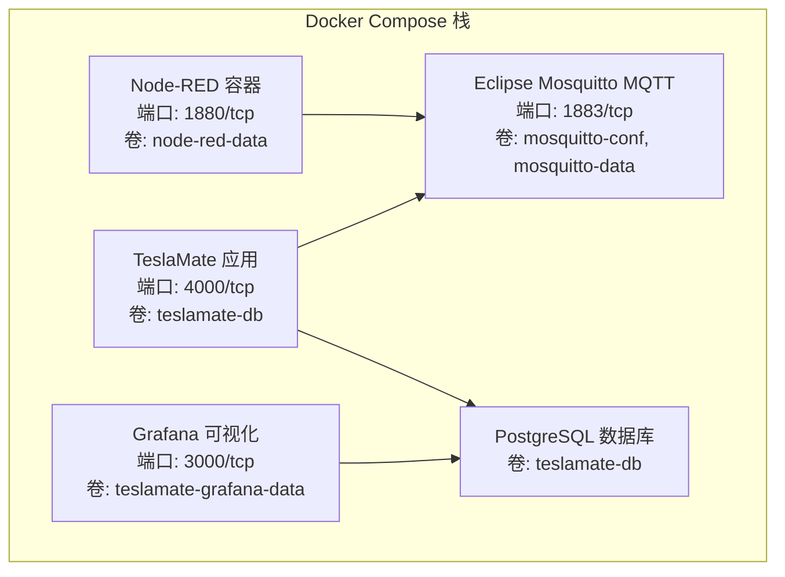
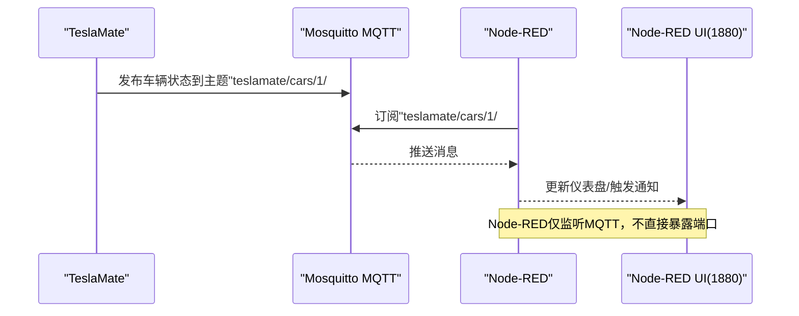
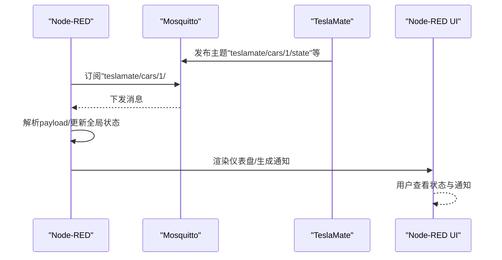
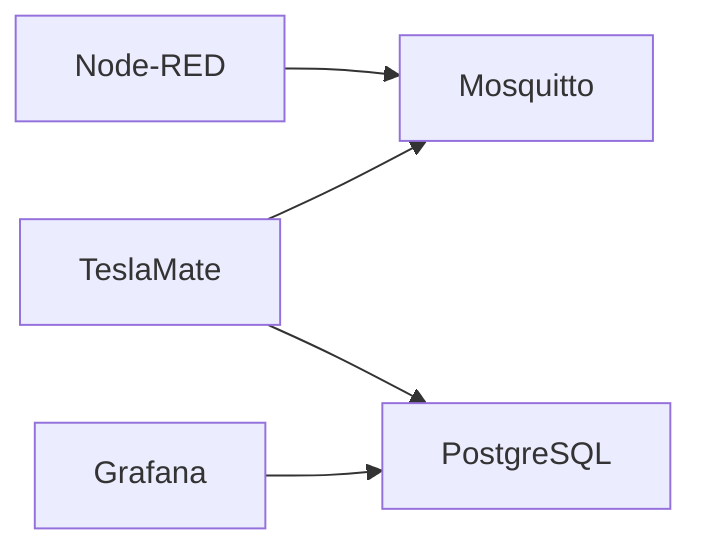

# Node-RED部署配置

<cite>
**本文引用的文件**
- [Node-RED集成文档](file://website/docs/integrations/Node-RED.md)
- [Docker安装指南](file://website/docs/installation/docker.md)
- [环境变量配置](file://website/docs/configuration/environment_variables.md)
- [Node-RED示例流](file://website/docs/integrations/Node-RED/Teslamate-flows.json.example)
- [Traefik高级安装指南](file://website/docs/advanced_guides/traefik.md)
- [Apache高级安装指南](file://website/docs/advanced_guides/apache.md)
- [备份与恢复](file://website/docs/maintenance/backup_restore.mdx)
</cite>

## 目录
1. [简介](#简介)
2. [项目结构](#项目结构)
3. [核心组件](#核心组件)
4. [架构总览](#架构总览)
5. [详细组件分析](#详细组件分析)
6. [依赖关系分析](#依赖关系分析)
7. [性能与稳定性考虑](#性能与稳定性考虑)
8. [故障排查指南](#故障排查指南)
9. [结论](#结论)
10. [附录](#附录)

## 简介
本文件面向在Docker环境中部署Node-RED并与TeslaMate、MQTT代理协同工作的用户，提供从docker-compose.yml编写、容器网络与卷挂载、端口映射到环境变量设置的完整说明；同时给出与TeslaMate在同一网络中的通信保障方法、安全加固建议（访问控制、反向代理集成）、数据备份策略，以及针对TeslaMate实际部署场景的Node-RED资源优化与稳定性建议。

## 项目结构
仓库包含完整的TeslaMate后端服务、数据库、可视化与MQTT代理，以及Node-RED集成文档与示例流。Node-RED作为独立服务运行于同一Docker Compose栈中，通过MQTT订阅TeslaMate推送的主题进行交互。

图表来源
- [Docker安装指南](file://website/docs/installation/docker.md#L21-L80)
- [Node-RED集成文档](file://website/docs/integrations/Node-RED.md#L51-L76)

章节来源
- [Docker安装指南](file://website/docs/installation/docker.md#L21-L80)
- [Node-RED集成文档](file://website/docs/integrations/Node-RED.md#L51-L76)

## 核心组件
- Node-RED服务：用于构建MQTT订阅、仪表盘与通知流，提供可视化界面与消息处理能力。
- MQTT代理：由Mosquitto提供，TeslaMate将车辆状态发布到MQTT主题，Node-RED订阅相应主题。
- TeslaMate应用：负责与Tesla API交互、持久化数据至PostgreSQL，并通过MQTT广播状态。
- 数据库：PostgreSQL存储TeslaMate业务数据。
- Grafana：可选的可视化组件，与数据库连接并展示指标。

章节来源
- [Node-RED集成文档](file://website/docs/integrations/Node-RED.md#L1-L38)
- [Docker安装指南](file://website/docs/installation/docker.md#L21-L80)

## 架构总览
Node-RED与TeslaMate均运行在Docker Compose中，二者通过Mosquitto共享MQTT通道实现通信。Node-RED仅订阅TeslaMate发布的主题，不直接暴露对外端口，确保内网安全。

图表来源
- [Node-RED示例流](file://website/docs/integrations/Node-RED/Teslamate-flows.json.example#L266-L279)
- [Docker安装指南](file://website/docs/installation/docker.md#L65-L74)

## 详细组件分析

### docker-compose.yml编写要点
- 服务定义
  - Node-RED镜像、重启策略、时区环境变量、数据卷、端口映射。
  - 建议将Node-RED置于与TeslaMate相同的自定义网络，确保容器间可解析主机名且无需暴露1880端口到公网。
- 卷与数据持久化
  - 使用命名卷node-red-data挂载到Node-RED容器的数据目录，避免容器重建丢失配置与节点模块。
- 端口映射
  - 默认映射1880:1880，若Node-RED仅用于内部集成，可移除或限制绑定地址为127.0.0.1，仅通过反向代理访问UI。
- 网络配置
  - 与Mosquitto同网段，确保MQTT服务名可解析；若使用外部MQTT，需在Node-RED容器中配置Broker参数。

章节来源
- [Node-RED集成文档](file://website/docs/integrations/Node-RED.md#L51-L76)
- [Docker安装指南](file://website/docs/installation/docker.md#L65-L74)

### 容器网络与MQTT通信
- 同一网络通信
  - 将Node-RED、TeslaMate、Mosquitto置于同一自定义网络，容器间通过服务名互相访问。
- MQTT Broker配置
  - Node-RED示例流默认使用名为“mosquitto”的Broker，需确保该名称在Compose网络中可解析。
  - 若使用外部MQTT，请在Node-RED中修改对应Broker节点的主机名与端口。

章节来源
- [Node-RED示例流](file://website/docs/integrations/Node-RED/Teslamate-flows.json.example#L64-L87)
- [Docker安装指南](file://website/docs/installation/docker.md#L65-L74)

### 卷挂载与端口映射
- 卷
  - Node-RED: node-red-data -> /data（存放flows、包与用户数据）
  - Mosquitto: mosquitto-conf、mosquitto-data（配置与持久化消息）
  - PostgreSQL: teslamate-db（数据库数据）
  - Grafana: teslamate-grafana-data（仪表盘数据）
- 端口
  - Node-RED: 1880（仅内部使用时可不映射或限制绑定）
  - TeslaMate: 4000（建议通过反向代理暴露）
  - Grafana: 3000（建议通过反向代理暴露）
  - Mosquitto: 1883（建议仅本地回环或防火墙限制）

章节来源
- [Node-RED集成文档](file://website/docs/integrations/Node-RED.md#L51-L76)
- [Docker安装指南](file://website/docs/installation/docker.md#L21-L80)

### 环境变量设置
- Node-RED
  - TZ：与系统时区一致，确保日志与定时任务按本地时间执行。
- TeslaMate
  - ENCRYPTION_KEY：加密Tesla API令牌的密钥（必填）
  - DATABASE_*：数据库连接参数（用户、密码、库名、主机）
  - MQTT_HOST/MQTT_PORT：MQTT代理地址与端口
  - VIRTUAL_HOST/CHECK_ORIGIN：反向代理相关，提升跨域与访问控制安全性
  - PORT：应用监听端口（默认4000）
  - URL_PATH：子路径支持（配合反向代理）
  - TZ：时区

章节来源
- [Node-RED集成文档](file://website/docs/integrations/Node-RED.md#L51-L76)
- [环境变量配置](file://website/docs/configuration/environment_variables.md#L9-L62)
- [Docker安装指南](file://website/docs/installation/docker.md#L21-L41)

### Node-RED初始化与模块安装
- 首次启动后，通过脚本批量安装示例流所需的模块（如Dashboard、Telegram、邮件等），并重启容器使变更生效。
- 导入示例JSON流后，在Node-RED中编辑MQTT节点，确保Broker参数与Mosquitto一致。

章节来源
- [Node-RED集成文档](file://website/docs/integrations/Node-RED.md#L82-L110)
- [Node-RED示例流](file://website/docs/integrations/Node-RED/Teslamate-flows.json.example#L1-L120)

### 与TeslaMate的集成流程

图表来源
- [Node-RED示例流](file://website/docs/integrations/Node-RED/Teslamate-flows.json.example#L266-L279)

## 依赖关系分析
- 组件耦合
  - Node-RED对Mosquitto强依赖（订阅主题）
  - TeslaMate对Mosquitto强依赖（发布主题）
  - TeslaMate对PostgreSQL强依赖（持久化）
  - Grafana对PostgreSQL弱依赖（只读查询）
- 网络依赖
  - 同一Docker网络内的服务名解析
  - 外部MQTT时，Node-RED需能解析Broker主机名
- 外部依赖
  - Node-RED模块安装依赖网络可达性（首次安装）

图表来源
- [Docker安装指南](file://website/docs/installation/docker.md#L21-L80)
- [Node-RED集成文档](file://website/docs/integrations/Node-RED.md#L51-L76)

章节来源
- [Docker安装指南](file://website/docs/installation/docker.md#L21-L80)
- [Node-RED集成文档](file://website/docs/integrations/Node-RED.md#L51-L76)

## 性能与稳定性考虑
- 资源使用优化
  - 限制Node-RED容器CPU/内存配额，避免与其他服务争抢资源。
  - 控制MQTT订阅数量与频率，减少不必要的消息处理。
  - 使用函数节点缓存与去抖逻辑，降低重复计算。
- 稳定性保障
  - 使用restart策略与健康检查，确保异常自动恢复。
  - 对外暴露端口采用反向代理，避免直接暴露1880端口。
  - 定期备份Node-RED数据卷与TeslaMate数据库，防止数据丢失。
- 日志与监控
  - 开启容器日志轮转，避免磁盘占用过大。
  - 结合反向代理日志与系统监控，及时发现异常。

[本节为通用指导，不直接分析具体文件]

## 故障排查指南
- Node-RED无法连接MQTT
  - 检查Mosquitto是否正常运行、端口是否开放、网络是否互通。
  - 在Node-RED中确认Broker节点的主机名、端口与认证信息。
- Node-RED UI无法访问
  - 若未映射1880端口，可通过反向代理或Docker端口转发访问。
  - 确认容器重启策略与日志输出。
- 数据丢失或配置重置
  - 检查node-red-data卷是否正确挂载，避免容器重建导致数据丢失。
- 备份与恢复
  - 使用pg_dump导出TeslaMate数据库，使用脚本进行恢复。
  - Node-RED数据卷定期备份，防止模块与流丢失。

章节来源
- [Node-RED集成文档](file://website/docs/integrations/Node-RED.md#L82-L110)
- [备份与恢复](file://website/docs/maintenance/backup_restore.mdx#L1-L102)

## 结论
在Docker环境中部署Node-RED并与TeslaMate、Mosquitto协同工作，关键在于：
- 明确docker-compose.yml的网络、卷与端口配置；
- 保证Node-RED与Mosquitto在同一网络，MQTT主题订阅正确；
- 通过反向代理实现安全访问与访问控制；
- 建立定期备份与资源优化策略，确保系统稳定与数据安全。

[本节为总结性内容，不直接分析具体文件]

## 附录

### 反向代理与访问控制（Traefik/Apache）
- Traefik
  - 通过标签启用路由、TLS证书与Basic Auth中间件，将外部流量转发至TeslaMate/Grafana。
  - MQTT端口建议仅本地回环或防火墙限制。
- Apache
  - 通过SSL终止与Basic Auth保护TeslaMate与Grafana，WebSocket代理支持实时功能。

章节来源
- [Traefik高级安装指南](file://website/docs/advanced_guides/traefik.md#L25-L135)
- [Apache高级安装指南](file://website/docs/advanced_guides/apache.md#L30-L96)

### Node-RED与MQTT主题订阅
- 示例流订阅主题前缀“teslamate/cars/1/#”，用于接收车辆状态、充电状态、地理围栏等消息。
- 如需接入多车或多账户，调整主题前缀与命名空间。

章节来源
- [Node-RED示例流](file://website/docs/integrations/Node-RED/Teslamate-flows.json.example#L266-L279)