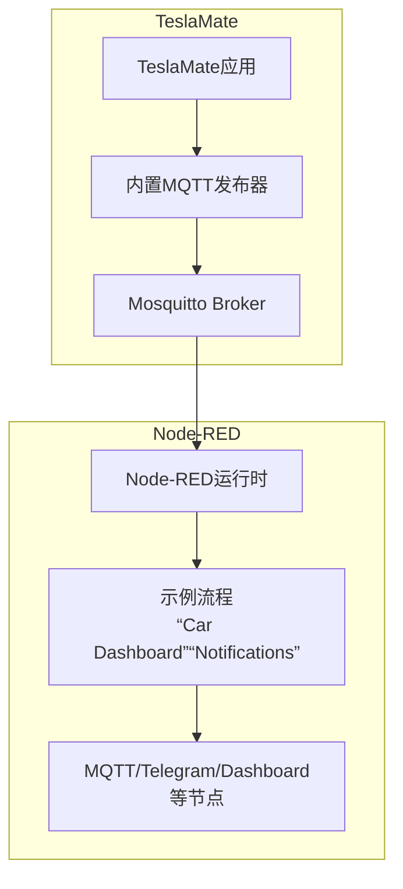
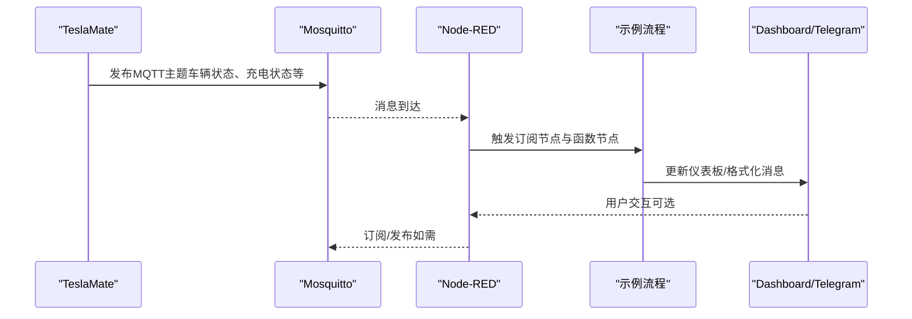
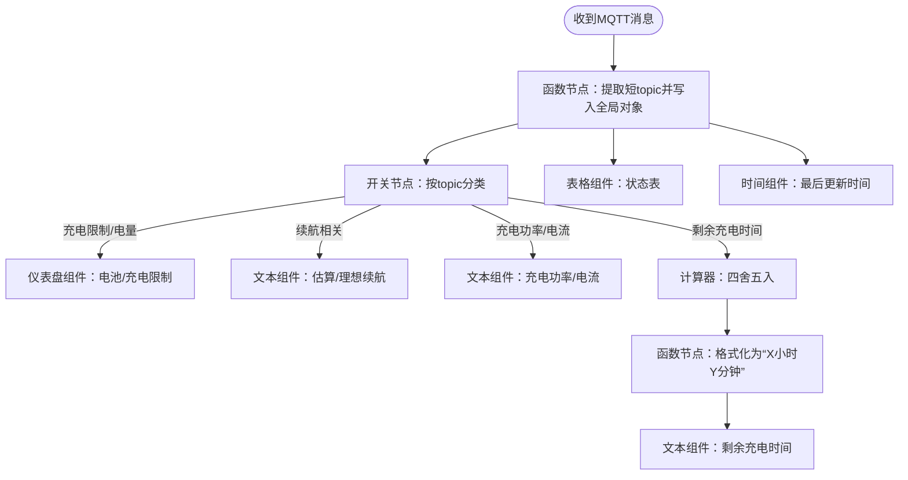
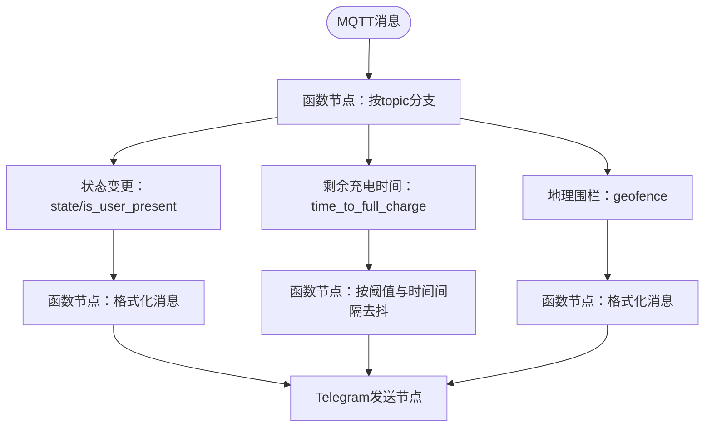
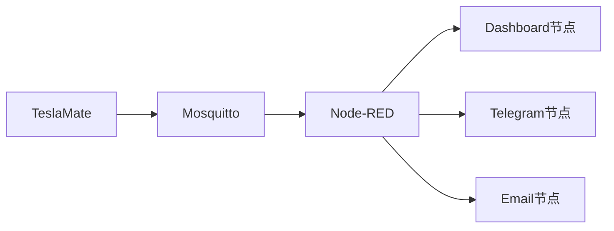

# Node-RED集成

<cite>
**本文引用的文件**
- [Node-RED集成指南](file://website/docs/integrations/Node-RED.md)
- [示例流程文件](file://website/docs/integrations/Node-RED/Teslamate-flows.json.example)
- [MQTT集成说明](file://website/docs/integrations/mqtt.md)
- [Docker安装说明](file://website/docs/installation/docker.md)
- [环境变量配置](file://website/docs/configuration/environment_variables.md)
- [安全策略](file://SECURITY.md)
</cite>

## 目录
1. [简介](#简介)
2. [项目结构](#项目结构)
3. [核心组件](#核心组件)
4. [架构总览](#架构总览)
5. [详细组件分析](#详细组件分析)
6. [依赖关系分析](#依赖关系分析)
7. [性能考虑](#性能考虑)
8. [故障排查指南](#故障排查指南)
9. [结论](#结论)
10. [附录](#附录)

## 简介
本文件面向希望在Docker环境中通过Node-RED消费TeslaMate发布的MQTT数据并实现通知（如Telegram）与可视化仪表板的用户。内容覆盖：
- 在Docker中部署Node-RED容器（含卷挂载、端口映射与时区）
- 导入示例流程并完成MQTT与Telegram节点配置
- 解析示例流程：车辆状态监控、充电状态跟踪、地理围栏事件处理
- 所需Node-RED模块安装方法与自定义函数节点使用技巧
- 安全注意事项：Telegram机器人令牌保护与网络访问控制

## 项目结构
与Node-RED集成直接相关的仓库内容主要位于website/docs目录下的集成文档与示例流程文件中。Node-RED侧的部署与配置由独立的docker-compose管理，TeslaMate通过内置MQTT发布器向Mosquitto发布主题，Node-RED订阅这些主题以驱动可视化与通知。

图表来源
- [Docker安装说明](file://website/docs/installation/docker.md#L65-L80)
- [MQTT集成说明](file://website/docs/integrations/mqtt.md#L1-L88)
- [Node-RED集成指南](file://website/docs/integrations/Node-RED.md#L47-L76)

章节来源
- [Node-RED集成指南](file://website/docs/integrations/Node-RED.md#L1-L46)
- [Docker安装说明](file://website/docs/installation/docker.md#L65-L80)

## 核心组件
- Node-RED容器：提供可视化拖拽式流程编辑与运行环境，支持Dashboard、Telegram、MQTT等节点。
- 示例流程：
  - “Car Dashboard”：订阅TeslaMate的MQTT主题，渲染车辆状态与充电状态面板。
  - “Notifications”：基于状态变化、进入/离开地理围栏、剩余充电时间等触发通知。
- MQTT节点：订阅teslamate/cars/1/#主题，接收车辆实时数据。
- Telegram节点：用于发送通知消息到Telegram群组或个人聊天。
- Dashboard节点：在Node-RED界面中展示关键指标（如电池电量、预计续航、剩余充电时间等）。

章节来源
- [Node-RED集成指南](file://website/docs/integrations/Node-RED.md#L77-L111)
- [示例流程文件](file://website/docs/integrations/Node-RED/Teslamate-flows.json.example#L1-L120)

## 架构总览
下图展示了从TeslaMate到Node-RED的数据通路与交互方式。

图表来源
- [MQTT集成说明](file://website/docs/integrations/mqtt.md#L1-L88)
- [示例流程文件](file://website/docs/integrations/Node-RED/Teslamate-flows.json.example#L266-L279)

## 详细组件分析

### Docker环境下的Node-RED部署
- 镜像与重启策略：使用官方Node-RED镜像并设置always重启。
- 环境变量：通过TM_TZ设置时区，确保日志与定时任务按本地时间执行。
- 卷挂载：将/data目录持久化为node-red-data卷，保存节点库、flows.json与用户数据。
- 端口映射：将宿主机1880端口映射到容器内部1880，便于浏览器访问Node-RED UI。
- 启动方式：使用docker compose up或后台模式启动。

章节来源
- [Node-RED集成指南](file://website/docs/integrations/Node-RED.md#L51-L76)

### Node-RED流程导入与配置
- 导入步骤：下载示例JSON文件后，在Node-RED右上角菜单选择“导入”，上传该文件。
- MQTT配置：若使用标准Docker安装的Mosquitto，则导入后自动连接；否则需手动编辑MQTT节点参数（服务器地址、端口等），并更新后重新部署。
- Telegram配置：编辑“Status Messages”Telegram节点，填写Bot名称与Token；再编辑“Format messages”节点，填入chatId，最后部署以验证连接状态。

章节来源
- [Node-RED集成指南](file://website/docs/integrations/Node-RED.md#L106-L133)
- [示例流程文件](file://website/docs/integrations/Node-RED/Teslamate-flows.json.example#L40-L63)

### 所需Node-RED模块安装
- 必装模块：node-red-dashboard、node-red-node-email、node-red-contrib-telegrambot、node-red-node-ui-table、node-red-contrib-calc、node-red-contrib-simpletime。
- 安装方式：首次启动Node-RED容器后，执行脚本批量安装模块，随后重启容器生效。
- 自定义函数节点：可在“Setup”页面引入额外NPM包（例如linq-js），并在函数代码中以变量形式使用。

章节来源
- [Node-RED集成指南](file://website/docs/integrations/Node-RED.md#L82-L105)

### 示例流程解析

#### 车辆状态监控（Car Dashboard）
- 订阅主题：teslamate/cars/1/#，QoS 2，确保消息可靠到达。
- 数据处理：
  - 使用函数节点存储topic与payload到全局对象，供后续UI组件使用。
  - 使用开关节点对不同主题进行分流（如充电限制、可用电池电量、估算/理想续航、剩余充电时间等）。
  - 对数值进行四舍五入与字符串格式化（如剩余充电时间显示为“X小时Y分钟”）。
- 可视化组件：
  - 仪表盘组件展示电池电量、充电限制、剩余充电时间、充电功率/电流等。
  - 表格组件展示状态表（键值对）。
  - 时间组件显示最后更新时间。

图表来源
- [示例流程文件](file://website/docs/integrations/Node-RED/Teslamate-flows.json.example#L266-L340)
- [示例流程文件](file://website/docs/integrations/Node-RED/Teslamate-flows.json.example#L341-L433)

章节来源
- [示例流程文件](file://website/docs/integrations/Node-RED/Teslamate-flows.json.example#L266-L340)
- [示例流程文件](file://website/docs/integrations/Node-RED/Teslamate-flows.json.example#L341-L433)

#### 充电状态跟踪（Notifications）
- 状态变更通知：当state或is_user_present发生变化时，生成对应通知消息。
- 剩余充电时间提醒：根据time_to_full_charge阈值与时间间隔进行去抖输出（大于1小时每15分钟一次，小于等于1小时每5分钟一次）。
- 地理围栏事件：当geofence字段变化时，生成进入/离开围栏的通知。

图表来源
- [示例流程文件](file://website/docs/integrations/Node-RED/Teslamate-flows.json.example#L350-L386)
- [示例流程文件](file://website/docs/integrations/Node-RED/Teslamate-flows.json.example#L420-L433)

章节来源
- [示例流程文件](file://website/docs/integrations/Node-RED/Teslamate-flows.json.example#L350-L386)
- [示例流程文件](file://website/docs/integrations/Node-RED/Teslamate-flows.json.example#L420-L433)

#### 地理围栏事件处理
- 逻辑要点：记录上一次geofence值，比较当前payload是否变化；若变化则生成“离开/进入”的组合消息。
- 注意事项：示例中包含临时禁用逻辑，可根据需要启用。

章节来源
- [示例流程文件](file://website/docs/integrations/Node-RED/Teslamate-flows.json.example#L373-L386)

### MQTT主题与数据流
- 主题前缀：teslamate/cars/1/…，其中1代表车辆ID（默认为1）。
- 关键主题（节选）：
  - state、since、healthy、version、update_available、update_version
  - model、trim_badging、exterior_color、wheel_type、spoiler_type
  - geofence
  - latitude、longitude、location
  - shift_state、power、speed、heading、elevation
  - locked、sentry_mode、windows_open、doors_open、driver_front_door_open、driver_rear_door_open、passenger_front_door_open、passenger_rear_door_open、trunk_open、frunk_open、is_user_present
  - is_climate_on、inside_temp、outside_temp、is_preconditioning
  - odometer、est_battery_range_km、rated_battery_range_km、ideal_battery_range_km
  - battery_level、usable_battery_level、plugged_in、charging_state、charge_energy_added、charge_limit_soc、charge_port_door_open
  - charger_actual_current、charger_phases、charger_power、charger_voltage、charge_current_request、charge_current_request_max
  - scheduled_charging_start_time、time_to_full_charge
  - tpms_pressure_fl、tpms_pressure_fr、tpms_pressure_rl、tpms_pressure_rr、tpms_soft_warning_fl、tpms_soft_warning_fr、tpms_soft_warning_rl、tpms_soft_warning_rr
  - active_route_destination、active_route_latitude、active_route_longitude、active_route、center_display_state

章节来源
- [MQTT集成说明](file://website/docs/integrations/mqtt.md#L1-L88)

## 依赖关系分析
- TeslaMate与Mosquitto：TeslaMate作为MQTT发布者，Mosquitto作为Broker，Node-RED作为订阅者。
- Node-RED与外部服务：Telegram节点依赖互联网访问；邮件节点依赖SMTP配置。
- 组件耦合度：示例流程通过MQTT主题解耦TeslaMate与Node-RED，降低耦合度；通知逻辑通过函数节点集中处理，便于扩展。

图表来源
- [Docker安装说明](file://website/docs/installation/docker.md#L65-L80)
- [Node-RED集成指南](file://website/docs/integrations/Node-RED.md#L106-L133)

章节来源
- [Docker安装说明](file://website/docs/installation/docker.md#L65-L80)
- [Node-RED集成指南](file://website/docs/integrations/Node-RED.md#L106-L133)

## 性能考虑
- QoS与重连：建议MQTT订阅使用较高QoS（如2），确保消息不丢失；合理设置keepalive与clean session参数。
- 去抖与限频：通知逻辑已内置按阈值与时间间隔的去抖机制，避免频繁重复消息。
- 资源占用：Dashboard与Telegram节点会增加CPU与内存开销，建议在资源充足的宿主机上运行Node-RED。

## 故障排查指南
- 无法连接MQTT：检查Mosquitto是否运行、网络连通性与防火墙；确认Node-RED中MQTT节点服务器地址与端口正确。
- Telegram未连接：确认Bot名称、Token与chatId已正确填写；部署后查看节点状态是否显示“Connected”。
- 仪表板无数据：确认订阅主题是否匹配（teslamate/cars/1/#）；检查函数节点是否成功写入全局对象。
- 通知未发送：检查通知流程中消息格式化节点的chatId与parse_mode；尝试先用Email节点测试。

章节来源
- [Node-RED集成指南](file://website/docs/integrations/Node-RED.md#L112-L141)
- [示例流程文件](file://website/docs/integrations/Node-RED/Teslamate-flows.json.example#L40-L63)

## 结论
通过在Docker中部署Node-RED并订阅TeslaMate的MQTT主题，可以快速构建车辆状态监控与通知系统。示例流程提供了完整的Dashboard与通知模板，结合必要的模块安装与配置，即可实现从数据采集到可视化与通知的闭环。同时，应重视安全与网络访问控制，确保Telegram令牌与Node-RED UI的安全。

## 附录

### 安全注意事项
- Telegram机器人令牌保护：不要将Token硬编码在flows.json中；建议通过环境变量或Vault等密管工具注入，或在节点配置中使用占位符并在部署时替换。
- 网络访问控制：Node-RED UI仅在内网访问，避免直接暴露到公网；如需远程访问，建议通过VPN、Cloudflare Tunnel、Traefik/Apache反向代理+TLS与认证等方式加固。
- Docker部署建议：遵循TeslaMate文档中的Docker安装与高级指南，确保MQTT与Web界面的安全边界。

章节来源
- [Node-RED集成指南](file://website/docs/integrations/Node-RED.md#L1-L23)
- [Docker安装说明](file://website/docs/installation/docker.md#L1-L18)
- [安全策略](file://SECURITY.md#L1-L6)