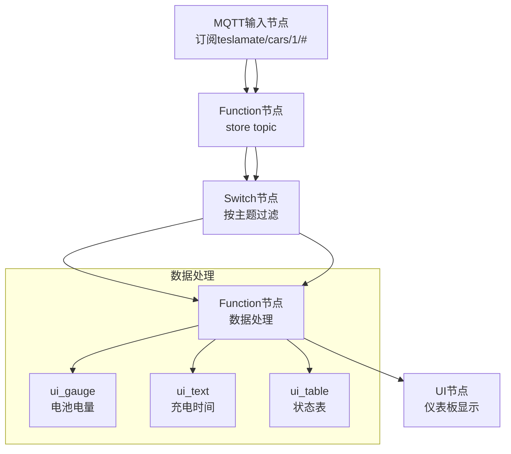
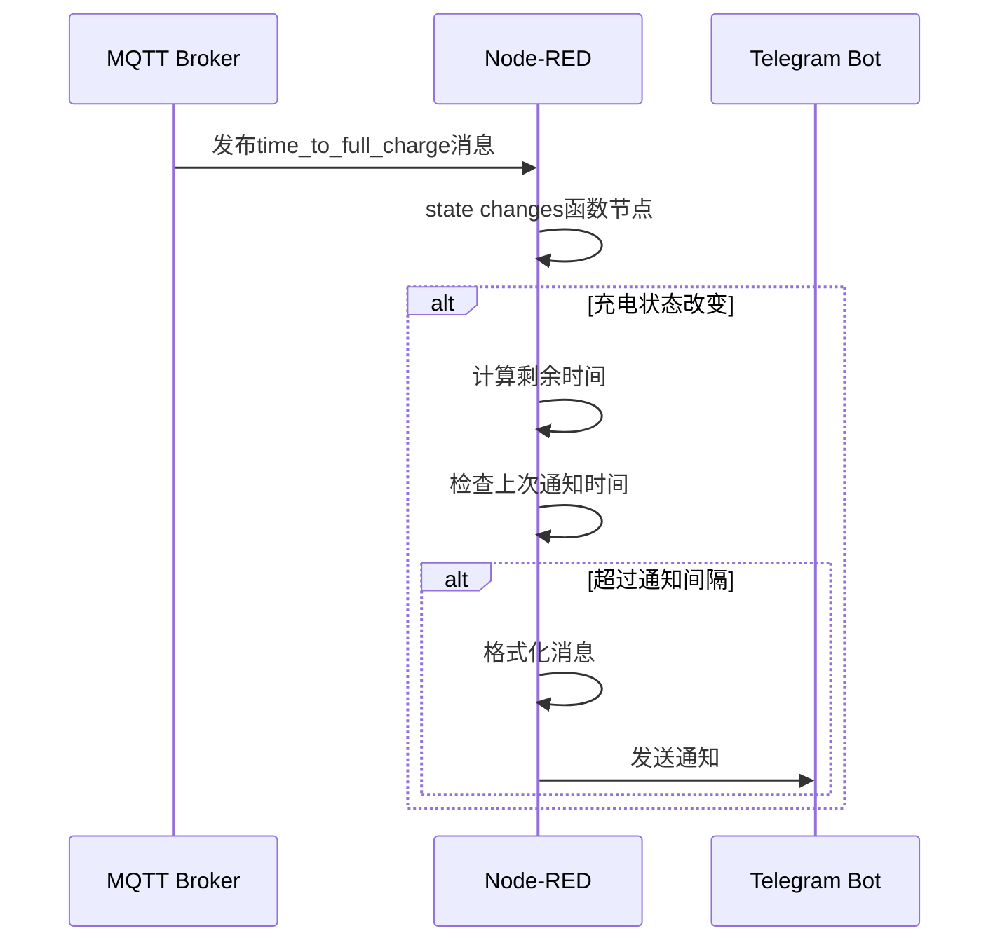
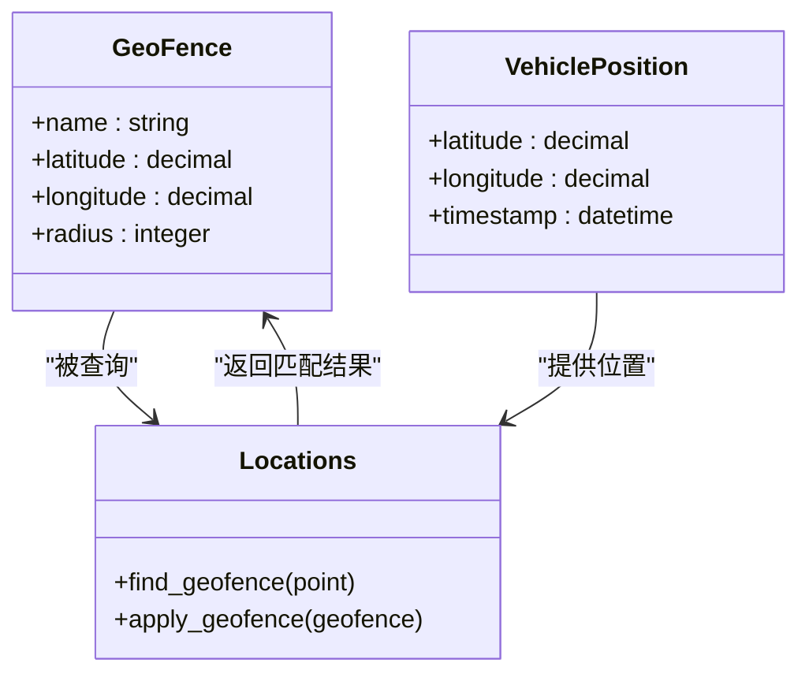

# 典型使用场景实现

<cite>
**本文档引用的文件**
- [Node-RED.md](file://website/docs/integrations/Node-RED.md)
- [Teslamate-flows.json.example](file://website/docs/integrations/Node-RED/Teslamate-flows.json.example)
- [vehicle_subscriber.ex](file://lib/teslamate/mqtt/pubsub/vehicle_subscriber.ex)
- [summary.ex](file://lib/teslamate/vehicles/vehicle/summary.ex)
- [geo_fence.ex](file://lib/teslamate/locations/geo_fence.ex)
- [locations.ex](file://lib/teslamate/locations.ex)
- [mqtt.ex](file://lib/teslamate/mqtt.ex)
</cite>

## 目录
1. [引言](#引言)
2. [车辆状态监控](#车辆状态监控)
3. [充电事件通知](#充电事件通知)
4. [地理围栏触发](#地理围栏触发)
5. [扩展建议](#扩展建议)
6. [结论](#结论)

## 引言
本文档深入解析TeslaMate项目中通过Node-RED实现的三大核心场景：车辆状态监控、充电事件通知和地理围栏触发。通过分析Node-RED流程与TeslaMate后端代码的交互，揭示MQTT消息的处理机制、数据过滤与格式化方法，以及如何通过function节点实现复杂的业务逻辑。文档将展示从车辆数据采集到用户通知的完整链路，并提供可操作的扩展建议。

## 车辆状态监控
车辆状态监控功能通过Node-RED的"Car Dashboard"流程实现，该流程订阅TeslaMate发布的MQTT主题，实时展示车辆关键参数。系统通过`teslamate/cars/1/#`主题接收车辆数据，利用function节点对消息进行处理和存储，最终在Node-RED仪表板上可视化显示。

**图示来源**
- [Teslamate-flows.json.example](file://website/docs/integrations/Node-RED/Teslamate-flows.json.example#L266-L292)
- [vehicle_subscriber.ex](file://lib/teslamate/mqtt/pubsub/vehicle_subscriber.ex#L62-L217)

**本节来源**
- [Node-RED.md](file://website/docs/integrations/Node-RED.md#L79-L80)
- [Teslamate-flows.json.example](file://website/docs/integrations/Node-RED/Teslamate-flows.json.example#L1-L677)

## 充电事件通知
充电事件通知机制通过解析`time_to_full_charge`和`state`等MQTT消息来判断车辆充电状态的变化。当车辆开始充电时，系统会触发Telegram通知，同时通过条件判断避免重复通知。function节点中的JavaScript代码负责提取充电百分比、预计完成时间等关键信息，并进行格式化。

**图示来源**
- [Teslamate-flows.json.example](file://website/docs/integrations/Node-RED/Teslamate-flows.json.example#L350-L433)
- [summary.ex](file://lib/teslamate/vehicles/vehicle/summary.ex#L100-L119)

**本节来源**
- [Node-RED.md](file://website/docs/integrations/Node-RED.md#L29-L30)
- [Teslamate-flows.json.example](file://website/docs/integrations/Node-RED/Teslamate-flows.json.example#L350-L433)

## 地理围栏触发
地理围栏触发功能通过监控`geofence`主题的消息来检测车辆进入或离开预设区域。当车辆位置变化导致地理围栏状态改变时，系统会生成相应的通知。TeslaMate后端通过PostgreSQL的地理空间函数计算车辆位置与地理围栏的相对关系，并将结果通过MQTT发布。

**图示来源**
- [geo_fence.ex](file://lib/teslamate/locations/geo_fence.ex#L1-L37)
- [locations.ex](file://lib/teslamate/locations.ex#L128-L159)
- [Teslamate-flows.json.example](file://website/docs/integrations/Node-RED/Teslamate-flows.json.example#L373-L386)

**本节来源**
- [geo_fence.ex](file://lib/teslamate/locations/geo_fence.ex#L1-L37)
- [locations.ex](file://lib/teslamate/locations.ex#L128-L159)

## 扩展建议
基于现有实现，可进行以下扩展以增强系统功能：

1. **避免重复通知**：在`state changes`函数节点中增加时间戳检查，确保相同状态变化在指定时间间隔内只通知一次。
2. **集成Home Assistant**：通过MQTT或API将车辆状态同步到Home Assistant，实现与智能家居设备的联动控制。
3. **数据库记录**：将重要事件（如充电开始、地理围栏穿越）记录到数据库，便于后续分析和审计。
4. **多级通知策略**：根据充电剩余时间设置不同的通知优先级，例如剩余1小时发送提醒，剩余15分钟发送紧急通知。
5. **条件充电控制**：结合电价信息，在低电价时段自动启动充电，提高能源使用效率。

这些扩展可以通过在Node-RED流程中添加新的function节点、数据库节点或API调用节点来实现，充分利用Node-RED的模块化设计优势。

**本节来源**
- [Node-RED.md](file://website/docs/integrations/Node-RED.md#L21-L22)
- [Teslamate-flows.json.example](file://website/docs/integrations/Node-RED/Teslamate-flows.json.example#L350-L433)

## 结论
本文档详细解析了TeslaMate项目中三大核心场景的实现机制，展示了如何通过Node-RED与TeslaMate的MQTT接口构建智能车辆监控系统。通过深入分析代码结构和数据流，揭示了从车辆数据采集到用户通知的完整链路。所提供的扩展建议为系统功能的进一步优化提供了可行方向，体现了该架构的灵活性和可扩展性。