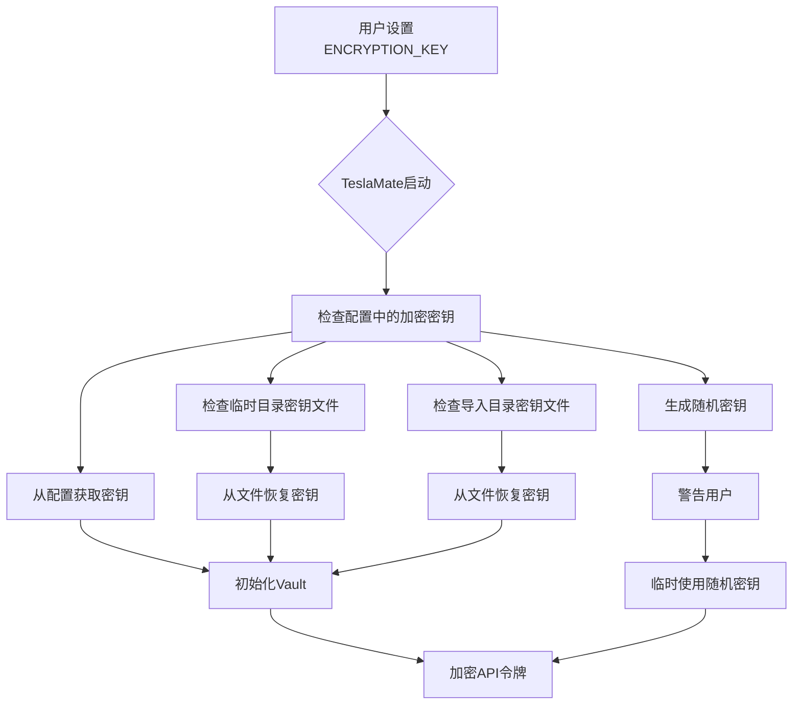
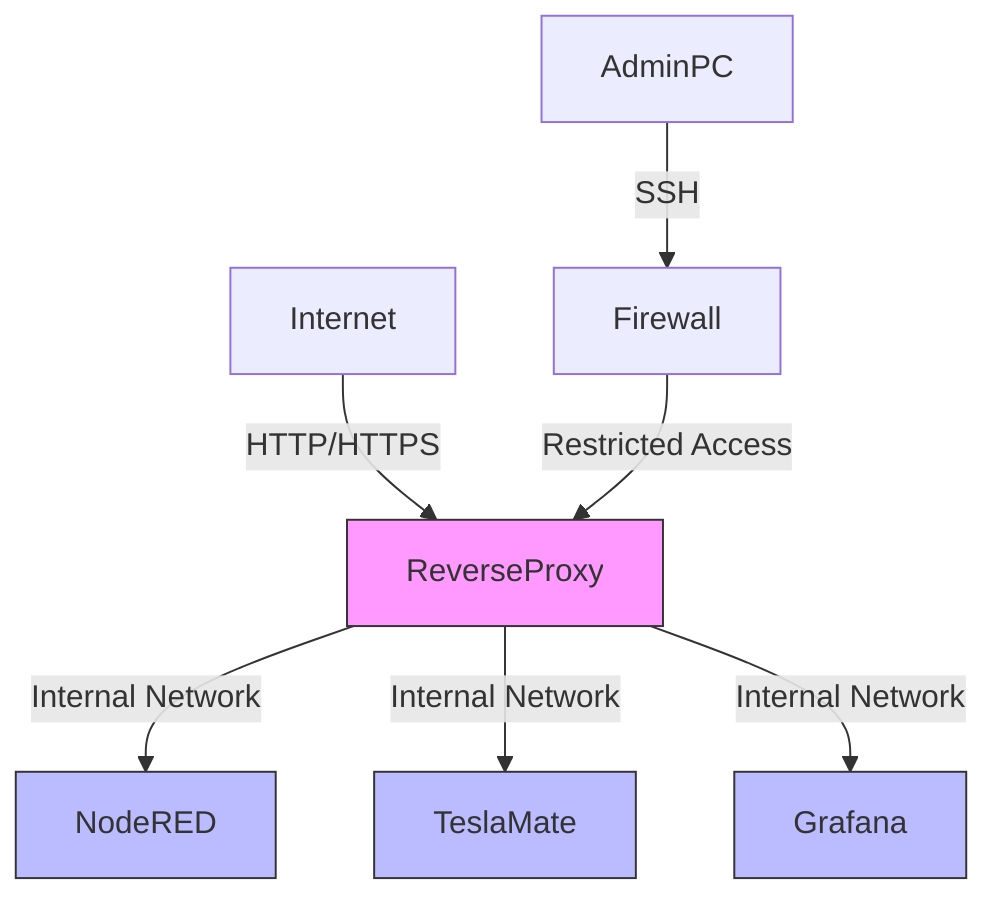
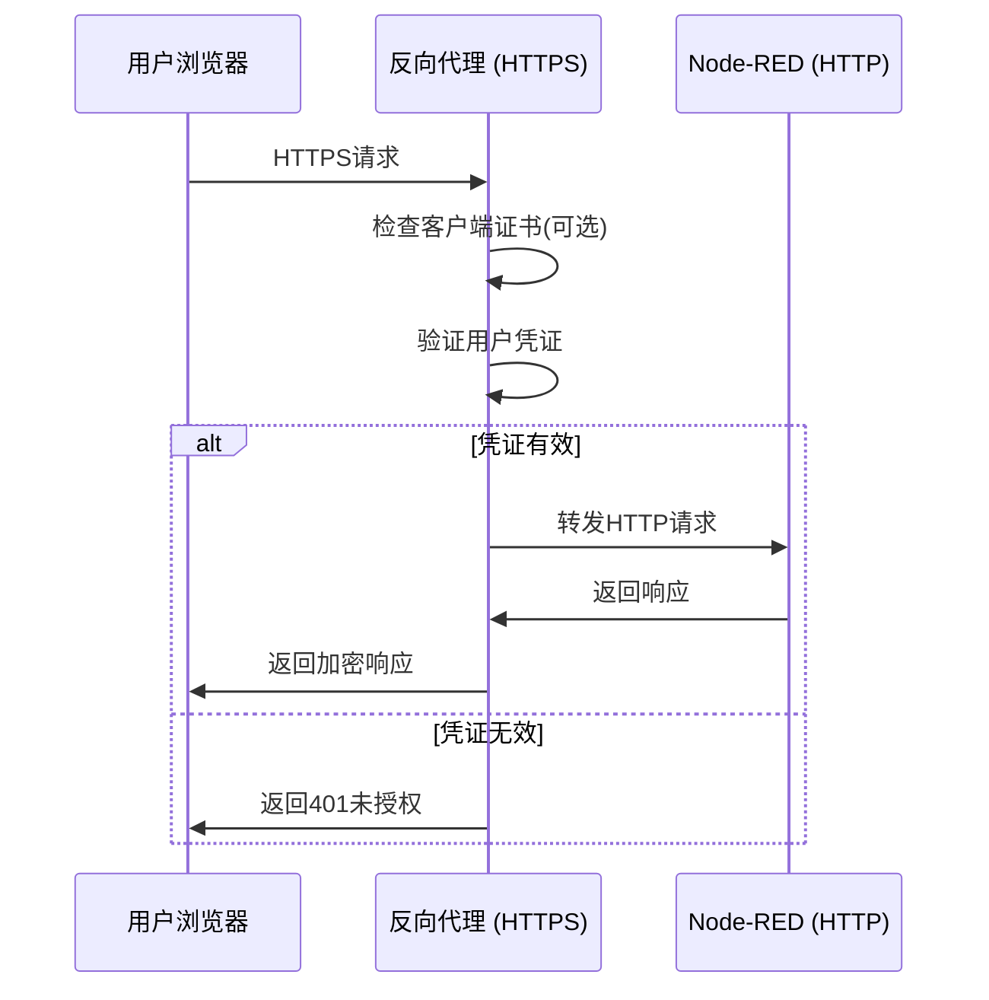

# 安全最佳实践

<cite>
**本文档中引用的文件**  
- [Node-RED.md](file://website/docs/integrations/Node-RED.md)
- [Teslamate-flows.json.example](file://website/docs/integrations/Node-RED/Teslamate-flows.json.example)
- [runtime.exs](file://config/runtime.exs)
- [environment_variables.md](file://website/docs/configuration/environment_variables.md)
- [vault.ex](file://lib/teslamate/vault.ex)
- [encrypt_api_tokens.exs](file://priv/repo/migrations/20220123131732_encrypt_api_tokens.exs)
- [tokens.ex](file://lib/teslamate/auth/tokens.ex)
- [apache.md](file://website/docs/advanced_guides/apache.md)
- [traefik.md](file://website/docs/advanced_guides/traefik.md)
</cite>

## 目录
1. [引言](#引言)
2. [保护敏感信息](#保护敏感信息)
3. [配置防火墙规则](#配置防火墙规则)
4. [启用HTTPS和用户认证](#启用https和用户认证)
5. [定期更新系统](#定期更新系统)
6. [监控异常行为](#监控异常行为)
7. [结论](#结论)

## 引言
本文档详细阐述了在将Node-RED与TeslaMate集成时应采取的关键安全措施。重点说明如何保护Telegram机器人令牌等敏感信息，推荐使用Node-RED的凭据系统而非硬编码。同时指导配置防火墙规则限制Node-RED管理界面的访问IP范围，建议启用HTTPS和用户认证以防止未授权访问。提醒定期更新Node-RED及其模块以修复已知漏洞，并提供监控异常MQTT消息频率的方法，以检测潜在的滥用行为。

**Section sources**
- [Node-RED.md](file://website/docs/integrations/Node-RED.md#overview)

## 保护敏感信息
在Node-RED与TeslaMate集成过程中，保护敏感信息是首要任务。特别是Telegram机器人令牌这类关键凭证，必须妥善保管。根据Node-RED的最佳实践，应使用其内置的凭据系统来存储和管理这些敏感数据，而不是将其硬编码在流程中。这可以有效防止因代码泄露而导致的安全风险。

TeslaMate本身也采用了严格的安全措施来保护敏感信息。通过`ENCRYPTION_KEY`环境变量，TeslaMate能够加密存储在数据库中的Tesla API令牌。如果未提供加密密钥，系统会生成一个随机密钥并在启动时发出警告。该密钥会被写入临时目录或导入目录中的`tm_encryption.key`文件，以便在后续重启时恢复使用。

**Diagram sources**
- [vault.ex](file://lib/teslamate/vault.ex#L41-L86)
- [encrypt_api_tokens.exs](file://priv/repo/migrations/20220123131732_encrypt_api_tokens.exs#L22-L33)

**Section sources**
- [Node-RED.md](file://website/docs/integrations/Node-RED.md#telegram-configuration)
- [environment_variables.md](file://website/docs/configuration/environment_variables.md#variable-name)
- [vault.ex](file://lib/teslamate/vault.ex#L41-L140)

## 配置防火墙规则
为了确保Node-RED管理界面的安全，必须配置严格的防火墙规则来限制访问。默认情况下，Node-RED的管理界面通过端口1880暴露，这使得任何能够访问该端口的用户都可能获得控制权。因此，强烈建议将Node-RED容器的端口映射限制在受信任的IP地址范围内。

在Docker环境中，可以通过iptables或其他防火墙工具实现这一目标。例如，可以设置规则只允许来自特定子网（如192.168.1.0/24）的连接访问Node-RED的管理端口。此外，还可以结合使用反向代理（如Apache或Traefik）来进一步增强安全性，将Node-RED服务置于内部网络中，仅通过反向代理对外提供有限的服务。

**Diagram sources**
- [apache.md](file://website/docs/advanced_guides/apache.md#virtualhost-443)
- [traefik.md](file://website/docs/advanced_guides/traefik.md#docker-composeyml)

**Section sources**
- [Node-RED.md](file://website/docs/integrations/Node-RED.md#docker-entries)
- [apache.md](file://website/docs/advanced_guides/apache.md#instructions)
- [traefik.md](file://website/docs/advanced_guides/traefik.md#instructions)

## 启用HTTPS和用户认证
启用HTTPS和用户认证是防止未授权访问的关键措施。通过使用HTTPS，可以确保所有通信都经过加密，防止中间人攻击和数据窃听。同时，配置用户认证可以确保只有经过身份验证的用户才能访问Node-RED和TeslaMate的管理界面。

对于TeslaMate，可以通过配置反向代理（如Apache或Traefik）来实现HTTPS和HTTP基本认证。在Apache配置中，可以使用`mod_ssl`模块启用SSL/TLS，并通过`mod_auth_basic`模块配置基本认证。类似地，在Traefik配置中，可以利用Let's Encrypt自动获取SSL证书，并设置中间件来实现基本认证。

**Diagram sources**
- [apache.md](file://website/docs/advanced_guides/apache.md#virtualhost-443)
- [traefik.md](file://website/docs/advanced_guides/traefik.md#docker-composeyml)

**Section sources**
- [apache.md](file://website/docs/advanced_guides/apache.md#instructions)
- [traefik.md](file://website/docs/advanced_guides/traefik.md#instructions)

## 定期更新系统
定期更新Node-RED及其模块是维护系统安全的重要环节。软件开发者会不断发现并修复已知的安全漏洞，因此保持系统最新可以有效防范这些已知威胁。对于TeslaMate，同样需要定期更新以确保其安全性。

在Docker环境中，可以通过定期拉取最新的镜像来更新Node-RED和TeslaMate。建议建立一个定期的维护计划，例如每周检查一次是否有新版本发布，并在测试环境中验证更新后，再将其部署到生产环境。此外，还应关注相关项目的GitHub仓库和安全公告，及时了解最新的安全动态。

**Section sources**
- [Node-RED.md](file://website/docs/integrations/Node-RED.md#installing-node-red)
- [README.md](file://README.md#upgrading)

## 监控异常行为
监控异常MQTT消息频率是检测潜在滥用行为的有效方法。通过分析MQTT消息的发送频率，可以识别出异常的活动模式，例如短时间内大量请求或不寻常的时间分布。这有助于及时发现并阻止可能的攻击行为。

在Node-RED中，可以使用内置的统计节点或自定义函数来监控消息频率。例如，可以设置一个计数器来跟踪每分钟收到的消息数量，并在超过预设阈值时触发警报。此外，还可以将这些监控数据发送到外部系统（如Grafana）进行可视化分析，以便更直观地观察系统行为。

**Section sources**
- [Node-RED.md](file://website/docs/integrations/Node-RED.md#mqtt-configuration)
- [mqtt/handler.ex](file://lib/teslamate/mqtt/handler.ex#L6-L27)

## 结论
综上所述，在将Node-RED与TeslaMate集成时，必须采取一系列关键的安全措施。通过使用Node-RED的凭据系统保护敏感信息，配置防火墙规则限制访问，启用HTTPS和用户认证防止未授权访问，定期更新系统修复已知漏洞，以及监控异常MQTT消息频率检测潜在滥用行为，可以显著提高系统的整体安全性。这些措施共同构成了一个多层次的安全防护体系，为用户的车辆数据和系统安全提供了有力保障。