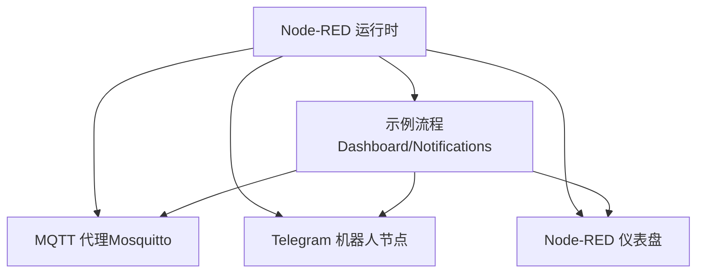
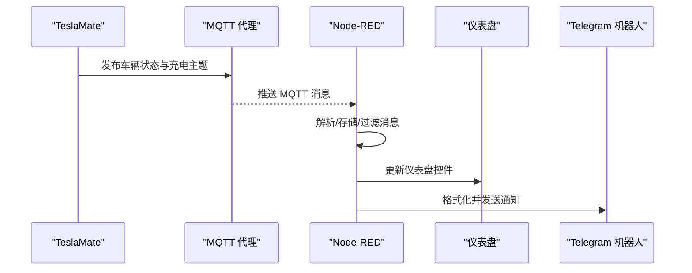
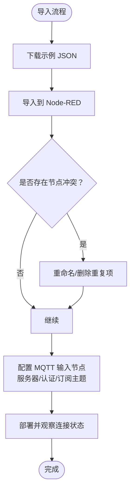
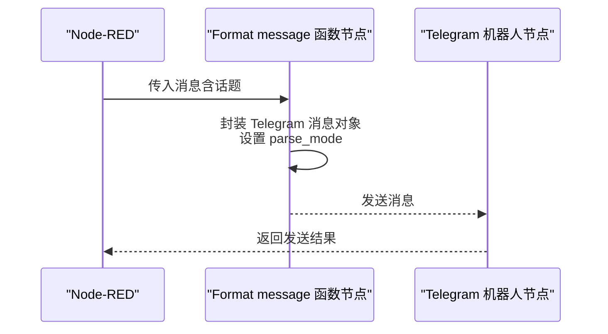
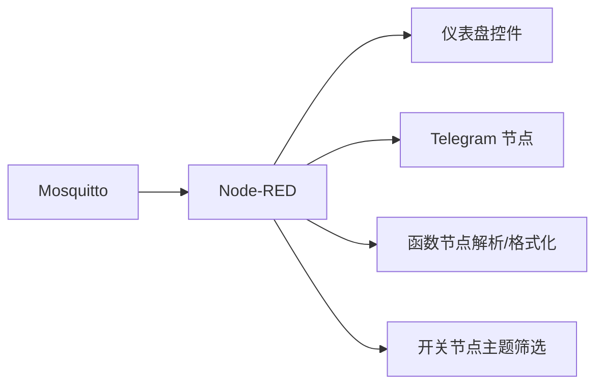

# 流程导入与配置

<cite>
**本文引用的文件**
- [Node-RED 集成指南](file://website/docs/integrations/Node-RED.md)
- [Node-RED 示例流程（JSON）](file://website/docs/integrations/Node-RED/Teslamate-flows.json.example)
- [MQTT 集成说明](file://website/docs/integrations/mqtt.md)
</cite>

## 目录
1. [简介](#简介)
2. [项目结构](#项目结构)
3. [核心组件](#核心组件)
4. [架构总览](#架构总览)
5. [详细组件分析](#详细组件分析)
6. [依赖关系分析](#依赖关系分析)
7. [性能注意事项](#性能注意事项)
8. [故障排查指南](#故障排查指南)
9. [结论](#结论)

## 简介
本指南面向希望将 TeslaMate 提供的示例流程（Teslamate-flows.json.example）导入到 Node-RED 的用户，帮助您完成以下目标：
- 正确下载并导入示例流程文件
- 处理节点冲突与重复项
- 完成 MQTT 输入节点的配置（服务器、认证、订阅主题）
- 配置 Telegram 通知节点（机器人参数与消息模板）
- 验证流程运行状态与调试技巧

## 项目结构
Node-RED 示例流程位于网站文档目录中，包含两部分：
- Node-RED 集成指南：提供安装、模块安装、导入、MQTT/Telegram 配置等步骤说明
- 示例流程 JSON 文件：包含仪表盘与通知两条流程，以及 MQTT 与 Telegram 节点定义

图表来源
- [Node-RED 集成指南](file://website/docs/integrations/Node-RED.md#L77-L141)
- [Node-RED 示例流程（JSON）](file://website/docs/integrations/Node-RED/Teslamate-flows.json.example#L49-L87)

章节来源
- [Node-RED 集成指南](file://website/docs/integrations/Node-RED.md#L77-L141)
- [Node-RED 示例流程（JSON）](file://website/docs/integrations/Node-RED/Teslamate-flows.json.example#L49-L87)

## 核心组件
- MQTT 输入节点：订阅 TeslaMate 发布的主题，用于驱动仪表盘与通知逻辑
- Telegram 节点：发送状态变更、地理围栏进入/离开、充电剩余时间等通知
- 仪表盘节点：展示电池状态、充电状态、实时更新时间等可视化信息
- 函数节点：对 MQTT 消息进行解析、存储、格式化与过滤

章节来源
- [Node-RED 示例流程（JSON）](file://website/docs/integrations/Node-RED/Teslamate-flows.json.example#L266-L279)
- [Node-RED 示例流程（JSON）](file://website/docs/integrations/Node-RED/Teslamate-flows.json.example#L350-L433)
- [Node-RED 示例流程（JSON）](file://website/docs/integrations/Node-RED/Teslamate-flows.json.example#L49-L87)

## 架构总览
示例流程由两条主线组成：
- 仪表盘流：通过 MQTT 订阅车辆状态与充电相关主题，解析并渲染到仪表盘
- 通知流：监听状态变化、地理围栏事件与充电剩余时间阈值，格式化为 Telegram 消息发送

图表来源
- [Node-RED 示例流程（JSON）](file://website/docs/integrations/Node-RED/Teslamate-flows.json.example#L266-L279)
- [Node-RED 示例流程（JSON）](file://website/docs/integrations/Node-RED/Teslamate-flows.json.example#L350-L433)
- [MQTT 集成说明](file://website/docs/integrations/mqtt.md#L10-L88)

## 详细组件分析

### 导入操作步骤
- 下载示例 JSON 文件：从网站文档目录获取示例流程文件
- 在 Node-RED 中导入：
  - 打开右上角菜单，选择“导入”
  - 使用“选择要导入的文件”按钮上传 JSON 文件
- 处理节点冲突：
  - 若出现重复节点或名称冲突，建议重命名或删除重复项后再导入
  - 确保每个节点拥有唯一标识符与名称
- 部署生效：
  - 导入完成后点击“部署”，观察各节点连接状态与日志输出

章节来源
- [Node-RED 集成指南](file://website/docs/integrations/Node-RED.md#L106-L115)

### MQTT 输入节点配置
- 主题订阅：
  - 默认订阅主题为 teslamate/cars/1/#，可按需修改为其他车号
  - 支持 QoS 设置与自动解码选项
- 服务器与认证：
  - 若使用标准 Docker 配置，导入后通常可自动连接
  - 否则打开 MQTT 输入节点，编辑服务器参数（主机名、端口、客户端 ID、TLS、心跳等），保存后重新部署
- 数据解析：
  - 示例流程包含函数节点对主题路径进行截取与全局变量存储，便于后续仪表盘渲染与通知格式化

图表来源
- [Node-RED 集成指南](file://website/docs/integrations/Node-RED.md#L106-L115)
- [Node-RED 示例流程（JSON）](file://website/docs/integrations/Node-RED/Teslamate-flows.json.example#L266-L279)

章节来源
- [Node-RED 集成指南](file://website/docs/integrations/Node-RED.md#L106-L115)
- [Node-RED 示例流程（JSON）](file://website/docs/integrations/Node-RED/Teslamate-flows.json.example#L266-L279)

### Telegram 通知节点配置
- 机器人参数：
  - 编辑“Status Messages”Telegram 节点，点击“机器人”旁的编辑图标
  - 填写机器人名称与 Token（来自 BotFather）
  - 保存后点击“更新”、“完成”，再部署
- 消息模板：
  - “Format message”函数节点负责将话题内容封装为 Telegram 消息对象
  - 模板中引用了 MarkdownV2 的 parse_mode，确保消息排版
  - 若需测试，可使用“Test sender”节点发送预设文本
- 聊天 ID：
  - 在“Format message”节点中替换 chatId 为你自己的聊天 ID
  - 保存后部署，节点应显示“已连接”

图表来源
- [Node-RED 示例流程（JSON）](file://website/docs/integrations/Node-RED/Teslamate-flows.json.example#L406-L433)
- [Node-RED 示例流程（JSON）](file://website/docs/integrations/Node-RED/Teslamate-flows.json.example#L654-L675)

章节来源
- [Node-RED 集成指南](file://website/docs/integrations/Node-RED.md#L116-L133)
- [Node-RED 示例流程（JSON）](file://website/docs/integrations/Node-RED/Teslamate-flows.json.example#L406-L433)
- [Node-RED 示例流程（JSON）](file://website/docs/integrations/Node-RED/Teslamate-flows.json.example#L654-L675)

### 仪表盘与通知流程要点
- 仪表盘流：
  - 使用 MQTT 输入节点订阅主题，函数节点解析并存储到全局变量
  - 通过开关节点筛选关键主题（如电池、充电、范围等），驱动仪表盘控件
- 通知流：
  - 监听状态变化、用户存在、充电剩余时间等阈值
  - 使用函数节点格式化消息，最终通过 Telegram 节点发送

章节来源
- [Node-RED 示例流程（JSON）](file://website/docs/integrations/Node-RED/Teslamate-flows.json.example#L228-L265)
- [Node-RED 示例流程（JSON）](file://website/docs/integrations/Node-RED/Teslamate-flows.json.example#L350-L433)

## 依赖关系分析
- Node-RED 依赖外部 MQTT 代理（默认示例使用 Mosquitto）
- Telegram 通知依赖 Telegram Bot 与有效的聊天 ID
- 仪表盘依赖 MQTT 主题结构与解析逻辑
- 通知逻辑依赖状态变化与阈值判断

图表来源
- [Node-RED 示例流程（JSON）](file://website/docs/integrations/Node-RED/Teslamate-flows.json.example#L49-L87)
- [Node-RED 示例流程（JSON）](file://website/docs/integrations/Node-RED/Teslamate-flows.json.example#L228-L265)
- [Node-RED 示例流程（JSON）](file://website/docs/integrations/Node-RED/Teslamate-flows.json.example#L350-L433)

章节来源
- [Node-RED 示例流程（JSON）](file://website/docs/integrations/Node-RED/Teslamate-flows.json.example#L49-L87)
- [Node-RED 示例流程（JSON）](file://website/docs/integrations/Node-RED/Teslamate-flows.json.example#L228-L265)
- [Node-RED 示例流程（JSON）](file://website/docs/integrations/Node-RED/Teslamate-flows.json.example#L350-L433)

## 性能注意事项
- MQTT 订阅主题粒度：示例使用 teslamate/cars/1/#，可根据实际需求调整车号或主题范围，避免不必要的消息处理
- 函数节点计算：解析与存储逻辑会占用一定 CPU，建议仅保留必要字段
- 通知频率控制：通知流对充电剩余时间设置了节流策略，避免频繁推送

章节来源
- [Node-RED 示例流程（JSON）](file://website/docs/integrations/Node-RED/Teslamate-flows.json.example#L350-L433)

## 故障排查指南
- MQTT 无法连接：
  - 检查 MQTT 服务器参数（主机、端口、TLS、心跳等）
  - 确认 Node-RED 可访问 MQTT 代理
  - 查看部署后的连接状态与错误日志
- Telegram 未收到消息：
  - 确认机器人 Token 与聊天 ID 已正确填写
  - 检查 Telegram 节点“已连接”状态
  - 使用“Test sender”节点发送测试消息验证
- 仪表盘无数据：
  - 确认 MQTT 主题订阅正确且 TeslaMate 正常发布数据
  - 检查函数节点解析逻辑与全局变量存储是否成功
- 节点冲突：
  - 导入前清理重复节点；导入后重命名或删除冲突项再部署

章节来源
- [Node-RED 集成指南](file://website/docs/integrations/Node-RED.md#L106-L133)
- [Node-RED 示例流程（JSON）](file://website/docs/integrations/Node-RED/Teslamate-flows.json.example#L406-L433)
- [Node-RED 示例流程（JSON）](file://website/docs/integrations/Node-RED/Teslamate-flows.json.example#L654-L675)

## 结论
通过以上步骤，您可以顺利完成 TeslaMate 示例流程的导入与配置，并实现基于 MQTT 的车辆状态监控与 Telegram 通知功能。建议在生产环境中进一步细化主题订阅范围、优化函数节点逻辑，并结合实际业务场景调整通知策略与仪表盘展示内容。