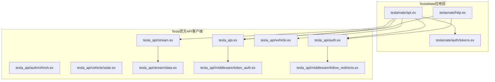
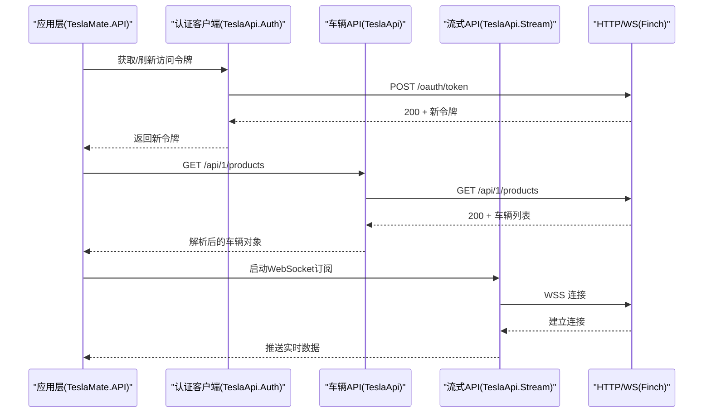
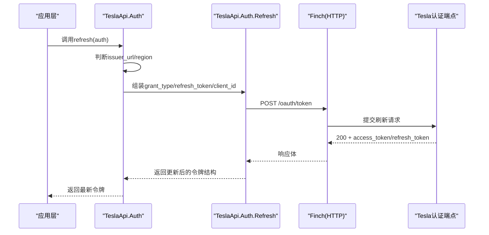
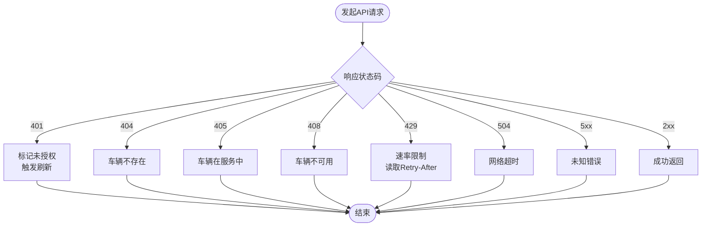
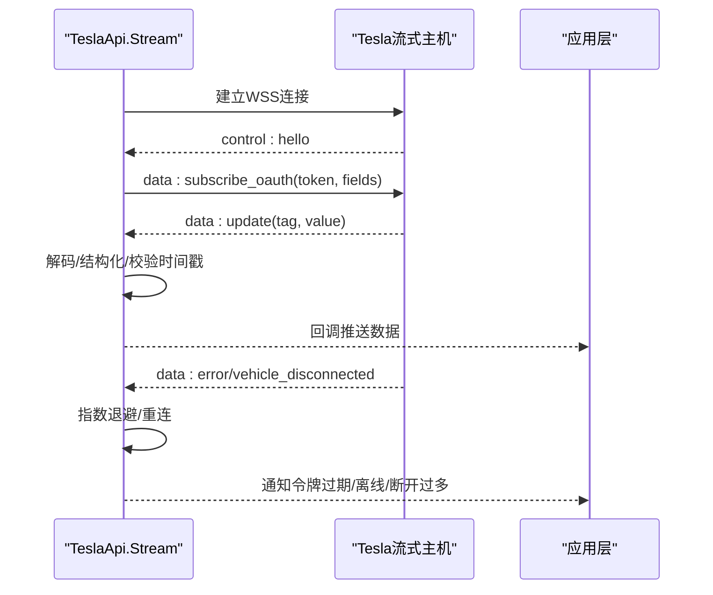
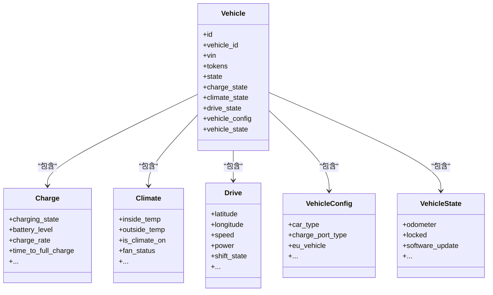
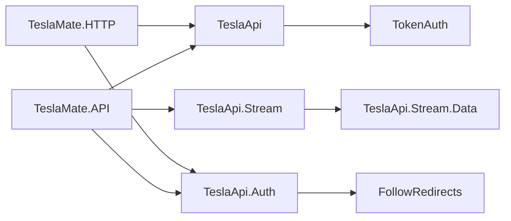

# Tesla API集成

<cite>
**本文引用的文件**
- [lib/tesla_api.ex](file://lib/tesla_api.ex)
- [lib/tesla_api/auth.ex](file://lib/tesla_api/auth.ex)
- [lib/tesla_api/auth/refresh.ex](file://lib/tesla_api/auth/refresh.ex)
- [lib/tesla_api/middleware/token_auth.ex](file://lib/tesla_api/middleware/token_auth.ex)
- [lib/tesla_api/middleware/follow_redirects.ex](file://lib/tesla_api/middleware/follow_redirects.ex)
- [lib/tesla_api/vehicle.ex](file://lib/tesla_api/vehicle.ex)
- [lib/tesla_api/vehicle/state.ex](file://lib/tesla_api/vehicle/state.ex)
- [lib/tesla_api/stream.ex](file://lib/tesla_api/stream.ex)
- [lib/tesla_api/stream/data.ex](file://lib/tesla_api/stream/data.ex)
- [lib/teslamate/http.ex](file://lib/teslamate/http.ex)
- [lib/teslamate/auth/tokens.ex](file://lib/teslamate/auth/tokens.ex)
- [lib/teslamate/api.ex](file://lib/teslamate/api.ex)
- [config/config.exs](file://config/config.exs)
- [website/docs/configuration/environment_variables.md](file://website/docs/configuration/environment_variables.md)
- [test/teslamate/vehicles/vehicle/streaming_test.exs](file://test/teslamate/vehicles/vehicle/streaming_test.exs)
</cite>

## 目录
1. [简介](#简介)
2. [项目结构](#项目结构)
3. [核心组件](#核心组件)
4. [架构总览](#架构总览)
5. [详细组件分析](#详细组件分析)
6. [依赖关系分析](#依赖关系分析)
7. [性能考量](#性能考量)
8. [故障排查指南](#故障排查指南)
9. [结论](#结论)
10. [附录](#附录)

## 简介
本文件面向TeslaMate与Tesla官方API的集成实践，系统性阐述认证流程（OAuth 2.0令牌获取与刷新）、API调用的错误处理策略（速率限制、授权失败、网络超时等）、数据同步机制（车辆状态轮询、流式API使用、数据缓存策略）、多因素认证与验证码处理的特殊场景，以及性能优化与调试技巧。内容基于仓库中的实际实现进行归纳总结，并通过图示帮助读者快速把握交互路径与控制流。

## 项目结构
TeslaMate围绕Tesla官方API构建了两套客户端：
- 认证客户端：用于登录授权与令牌刷新，位于tesla_api/auth模块族。
- 车辆API客户端：用于产品列表、车辆信息与状态查询，位于tesla_api/vehicle模块族。
- 流式API客户端：基于WebSocket订阅车辆实时数据，位于tesla_api/stream模块族。
- HTTP基础设施：统一的Finch适配器与连接池配置，位于teslamate/http.ex。
- 会话与令牌存储：数据库表结构定义，位于teslamate/auth/tokens.ex。
- 应用层编排：在teslamate/api.ex中协调认证、错误处理与轮询策略。

图表来源
- [lib/teslamate/api.ex](file://lib/teslamate/api.ex)
- [lib/tesla_api.ex](file://lib/tesla_api.ex)
- [lib/tesla_api/auth.ex](file://lib/tesla_api/auth.ex)
- [lib/tesla_api/auth/refresh.ex](file://lib/tesla_api/auth/refresh.ex)
- [lib/tesla_api/vehicle.ex](file://lib/tesla_api/vehicle.ex)
- [lib/tesla_api/vehicle/state.ex](file://lib/tesla_api/vehicle/state.ex)
- [lib/tesla_api/stream.ex](file://lib/tesla_api/stream.ex)
- [lib/tesla_api/stream/data.ex](file://lib/tesla_api/stream/data.ex)
- [lib/tesla_api/middleware/token_auth.ex](file://lib/tesla_api/middleware/token_auth.ex)
- [lib/tesla_api/middleware/follow_redirects.ex](file://lib/tesla_api/middleware/follow_redirects.ex)
- [lib/teslamate/http.ex](file://lib/teslamate/http.ex)
- [lib/teslamate/auth/tokens.ex](file://lib/teslamate/auth/tokens.ex)

章节来源
- [lib/tesla_api.ex](file://lib/tesla_api.ex#L1-L18)
- [lib/tesla_api/auth.ex](file://lib/tesla_api/auth.ex#L1-L99)
- [lib/tesla_api/vehicle.ex](file://lib/tesla_api/vehicle.ex#L1-L147)
- [lib/tesla_api/stream.ex](file://lib/tesla_api/stream.ex#L1-L272)
- [lib/teslamate/http.ex](file://lib/teslamate/http.ex#L1-L91)
- [lib/teslamate/auth/tokens.ex](file://lib/teslamate/auth/tokens.ex#L1-L24)

## 核心组件
- TeslaApi（车辆API客户端）：封装基础URL、JSON序列化、日志中间件与TokenAuth中间件，统一接收超时与日志级别策略。
- TeslaApi.Auth（认证客户端）：负责OAuth登录、重定向跟随、令牌解析与区域判定；提供refresh委托给Refresh模块。
- TeslaApi.Auth.Refresh：执行OAuth 2.0刷新令牌流程，支持自定义认证主机与路径。
- TeslaApi.Vehicle：封装产品列表、车辆详情与带状态的车辆数据查询，并统一错误映射。
- TeslaApi.Vehicle.State：定义充电、气候、驱动、配置与车况等子模型的数据结构与转换。
- TeslaApi.Stream：WebSocket流式订阅，包含指数退避重连、心跳与断线恢复、错误类型处理。
- TeslaApi.Stream.Data：将流式字段转换为结构化数据。
- TeslaMate.HTTP：Finch适配器与连接池配置，支持代理、池大小与超时。
- TeslaMate.Auth.Tokens：令牌存储表结构（加密字段）。
- TeslaMate.API：应用层编排，处理未授权、速率限制、预加载在线车辆状态等。

章节来源
- [lib/tesla_api.ex](file://lib/tesla_api.ex#L1-L18)
- [lib/tesla_api/auth.ex](file://lib/tesla_api/auth.ex#L1-L99)
- [lib/tesla_api/auth/refresh.ex](file://lib/tesla_api/auth/refresh.ex#L1-L43)
- [lib/tesla_api/vehicle.ex](file://lib/tesla_api/vehicle.ex#L1-L147)
- [lib/tesla_api/vehicle/state.ex](file://lib/tesla_api/vehicle/state.ex#L1-L396)
- [lib/tesla_api/stream.ex](file://lib/tesla_api/stream.ex#L1-L272)
- [lib/tesla_api/stream/data.ex](file://lib/tesla_api/stream/data.ex#L1-L47)
- [lib/teslamate/http.ex](file://lib/teslamate/http.ex#L1-L91)
- [lib/teslamate/auth/tokens.ex](file://lib/teslamate/auth/tokens.ex#L1-L24)
- [lib/teslamate/api.ex](file://lib/teslamate/api.ex)

## 架构总览
TeslaMate通过TeslaApi与TeslaApi.Auth分别对接Tesla Owner API与Tesla认证服务。应用层通过TeslaMate.HTTP统一管理连接池与超时，避免重复握手与资源争用。流式API采用WebSocket长连接，结合指数退避与心跳检测，确保在弱网或离线场景下的鲁棒性。

图表来源
- [lib/teslamate/api.ex](file://lib/teslamate/api.ex)
- [lib/tesla_api/auth.ex](file://lib/tesla_api/auth.ex#L1-L99)
- [lib/tesla_api/auth/refresh.ex](file://lib/tesla_api/auth/refresh.ex#L1-L43)
- [lib/tesla_api.ex](file://lib/tesla_api.ex#L1-L18)
- [lib/tesla_api/stream.ex](file://lib/tesla_api/stream.ex#L1-L272)
- [lib/teslamate/http.ex](file://lib/teslamate/http.ex#L1-L91)

## 详细组件分析

### 认证与令牌刷新
- OAuth 2.0令牌刷新流程由TeslaApi.Auth.Refresh实现，支持从环境变量动态确定认证主机与路径，构造标准刷新参数并发起POST请求。
- TeslaApi.Auth提供issuer_url与region推断逻辑，兼容不同地区域名与JWT载荷解析，确保在多区域部署下正确选择认证端点。
- 中间件FollowRedirects在认证阶段启用，避免重定向导致的凭据泄露风险；TokenAuth中间件自动为Owner API请求注入Authorization头。

图表来源
- [lib/tesla_api/auth.ex](file://lib/tesla_api/auth.ex#L1-L99)
- [lib/tesla_api/auth/refresh.ex](file://lib/tesla_api/auth/refresh.ex#L1-L43)
- [lib/tesla_api/middleware/follow_redirects.ex](file://lib/tesla_api/middleware/follow_redirects.ex#L1-L110)
- [lib/tesla_api/middleware/token_auth.ex](file://lib/tesla_api/middleware/token_auth.ex#L1-L15)
- [lib/teslamate/http.ex](file://lib/teslamate/http.ex#L1-L91)

章节来源
- [lib/tesla_api/auth.ex](file://lib/tesla_api/auth.ex#L1-L99)
- [lib/tesla_api/auth/refresh.ex](file://lib/tesla_api/auth/refresh.ex#L1-L43)
- [lib/tesla_api/middleware/follow_redirects.ex](file://lib/tesla_api/middleware/follow_redirects.ex#L1-L110)
- [lib/tesla_api/middleware/token_auth.ex](file://lib/tesla_api/middleware/token_auth.ex#L1-L15)

### API调用与错误处理
- TeslaApi.Vehicle对响应进行统一错误映射，覆盖401未授权、404车辆不存在、405服务中、408不可用、429速率限制、504超时与5xx未知错误，并将retry-after时间作为速率限制的提示。
- TeslaApi.Error提供通用异常包装，支持从Env或底层错误原子中提取消息，便于上层统一处理。
- TeslaMate.API在应用层捕获TeslaApi.Error，区分未授权触发刷新、速率限制等待、其他错误记录日志。

图表来源
- [lib/tesla_api/vehicle.ex](file://lib/tesla_api/vehicle.ex#L98-L146)
- [lib/tesla_api/error.ex](file://lib/tesla_api/error.ex#L1-L38)
- [lib/teslamate/api.ex](file://lib/teslamate/api.ex)

章节来源
- [lib/tesla_api/vehicle.ex](file://lib/tesla_api/vehicle.ex#L98-L146)
- [lib/tesla_api/error.ex](file://lib/tesla_api/error.ex#L1-L38)
- [lib/teslamate/api.ex](file://lib/teslamate/api.ex)

### 流式API与数据同步
- TeslaApi.Stream基于WebSockex建立WSS连接，按区域选择不同的流式主机；订阅时携带OAuth令牌与字段清单，收到data:update后解码为结构化数据并通过回调传递。
- 断线与错误处理：支持“vehicle_disconnected”、“vehicle_error”、“client_error”等类型，针对令牌过期、离线等场景采取指数退避重连或通知上层；超过阈值报告“过多断开”。
- 心跳与超时：以定时器监控30秒无数据视为超时，结合last_data状态判断是否上报“不活跃”，并在恢复时重置计数。

图表来源
- [lib/tesla_api/stream.ex](file://lib/tesla_api/stream.ex#L1-L272)
- [lib/tesla_api/stream/data.ex](file://lib/tesla_api/stream/data.ex#L1-L47)

章节来源
- [lib/tesla_api/stream.ex](file://lib/tesla_api/stream.ex#L1-L272)
- [lib/tesla_api/stream/data.ex](file://lib/tesla_api/stream/data.ex#L1-L47)
- [test/teslamate/vehicles/vehicle/streaming_test.exs](file://test/teslamate/vehicles/vehicle/streaming_test.exs#L1-L599)

### 数据模型与状态聚合
- TeslaApi.Vehicle.State定义了充电、气候、驱动、配置与车况等子模型，提供result函数将原始字典映射到结构化记录，便于后续处理与持久化。
- TeslaApi.Stream.Data将流式字段转换为数值/字符串/时间戳等类型，保证下游计算一致性。

图表来源
- [lib/tesla_api/vehicle/state.ex](file://lib/tesla_api/vehicle/state.ex#L1-L396)

章节来源
- [lib/tesla_api/vehicle/state.ex](file://lib/tesla_api/vehicle/state.ex#L1-L396)
- [lib/tesla_api/stream/data.ex](file://lib/tesla_api/stream/data.ex#L1-L47)

### 会话管理与令牌存储
- TeslaMate.Auth.Tokens定义了加密存储的access与refresh令牌字段，配合应用层在数据库中持久化，避免明文存储。
- TeslaMate.HTTP提供Finch连接池配置，支持按域名设置池大小与超时，减少连接竞争与阻塞。

章节来源
- [lib/teslamate/auth/tokens.ex](file://lib/teslamate/auth/tokens.ex#L1-L24)
- [lib/teslamate/http.ex](file://lib/teslamate/http.ex#L1-L91)

## 依赖关系分析
- TeslaApi依赖TokenAuth中间件自动注入Authorization头，避免在各请求处重复拼接。
- TeslaApi.Auth依赖FollowRedirects中间件，限定重定向范围，防止敏感头泄露。
- TeslaApi.Stream依赖CA证书链与可选的TLS证书接受策略，确保安全连接。
- TeslaMate.API依赖TeslaApi.Vehicle与TeslaApi.Stream，结合环境变量控制轮询间隔与流式开关。

图表来源
- [lib/tesla_api/auth.ex](file://lib/tesla_api/auth.ex#L1-L99)
- [lib/tesla_api/middleware/follow_redirects.ex](file://lib/tesla_api/middleware/follow_redirects.ex#L1-L110)
- [lib/tesla_api.ex](file://lib/tesla_api.ex#L1-L18)
- [lib/tesla_api/middleware/token_auth.ex](file://lib/tesla_api/middleware/token_auth.ex#L1-L15)
- [lib/tesla_api/stream.ex](file://lib/tesla_api/stream.ex#L1-L272)
- [lib/tesla_api/stream/data.ex](file://lib/tesla_api/stream/data.ex#L1-L47)
- [lib/teslamate/api.ex](file://lib/teslamate/api.ex)

章节来源
- [lib/tesla_api/auth.ex](file://lib/tesla_api/auth.ex#L1-L99)
- [lib/tesla_api/middleware/follow_redirects.ex](file://lib/tesla_api/middleware/follow_redirects.ex#L1-L110)
- [lib/tesla_api.ex](file://lib/tesla_api.ex#L1-L18)
- [lib/tesla_api/middleware/token_auth.ex](file://lib/tesla_api/middleware/token_auth.ex#L1-L15)
- [lib/tesla_api/stream.ex](file://lib/tesla_api/stream.ex#L1-L272)
- [lib/tesla_api/stream/data.ex](file://lib/tesla_api/stream/data.ex#L1-L47)
- [lib/teslamate/api.ex](file://lib/teslamate/api.ex)

## 性能考量
- 连接复用与池化
  - 使用Finch连接池，按域名分组设置池大小，降低握手成本与并发瓶颈。
  - 默认池大小与超时可通过环境变量调整，避免连接饥饿与长时间等待。
- 请求频率控制
  - 通过环境变量控制不同状态下（在线/驾驶/充电/休眠/默认）的轮询间隔，避免过度拉取。
  - 流式API优先，仅在流式不活跃或离线时回退到轮询，减少不必要的HTTP请求。
- 指数退避与心跳
  - WebSocket断线采用指数退避，结合心跳超时与断开次数阈值，平衡恢复速度与资源消耗。
- 缓存策略
  - 在线车辆状态预加载与本地缓存（应用层），减少重复查询；流式数据以最近一次为准，丢弃过期帧。

章节来源
- [lib/teslamate/http.ex](file://lib/teslamate/http.ex#L1-L91)
- [website/docs/configuration/environment_variables.md](file://website/docs/configuration/environment_variables.md#L41-L62)
- [lib/tesla_api/stream.ex](file://lib/tesla_api/stream.ex#L1-L272)

## 故障排查指南
- 速率限制
  - 观察429响应与Retry-After头，应用层会记录并返回重试秒数，建议在上层实现等待后再重试。
- 授权失败
  - 401时触发令牌刷新流程；若刷新失败，需重新引导用户完成OAuth授权。
- 网络超时
  - 504超时与HTTP连接池超时均会导致请求失败，检查网络连通性与代理配置。
- 流式异常
  - “vehicle_disconnected”与“vehicle_error”会触发断线重连或离线提示；“client_error: Can't validate token”提示令牌过期，需刷新。
  - “过多断开”会触发上层告警，建议检查网络质量与服务器负载。
- 日志分析
  - 应用层与客户端均开启日志中间件，结合日志级别与错误消息定位问题；测试用例展示了典型日志输出模式，可用于对照验证。

章节来源
- [lib/tesla_api/vehicle.ex](file://lib/tesla_api/vehicle.ex#L98-L146)
- [lib/teslamate/api.ex](file://lib/teslamate/api.ex)
- [lib/tesla_api/stream.ex](file://lib/tesla_api/stream.ex#L1-L272)
- [test/teslamate/vehicles/vehicle/streaming_test.exs](file://test/teslamate/vehicles/vehicle/streaming_test.exs#L1-L599)

## 结论
TeslaMate通过模块化的Tesla API客户端与统一的HTTP基础设施，实现了对Tesla官方API的稳定集成。认证流程清晰、错误处理完备、流式数据鲁棒可靠，并辅以可调的轮询策略与连接池配置，满足多区域、多场景下的部署需求。建议在生产环境中结合日志与指标持续监控，按需调整轮询间隔与池大小，确保系统在高并发与弱网环境下保持稳定。

## 附录
- 环境变量参考（节选）
  - TESLA_API_HOST：车辆API主机地址（含中国区域名）
  - TESLA_AUTH_HOST/TESLA_AUTH_PATH：认证主机与路径
  - TESLA_AUTH_CLIENT_ID：OAuth客户端ID
  - TESLA_WSS_HOST：流式主机
  - TOKEN：第三方提供的访问令牌（附加到请求）
  - POLLING_*_INTERVAL：不同状态下的轮询间隔
  - HTTP_POOL_SIZE/HTTP_POOL_TIMEOUT：HTTP连接池大小与超时
  - TESLA_API_POOL_SIZE：车辆API专用池大小

章节来源
- [website/docs/configuration/environment_variables.md](file://website/docs/configuration/environment_variables.md#L41-L62)
- [config/config.exs](file://config/config.exs#L1-L30)