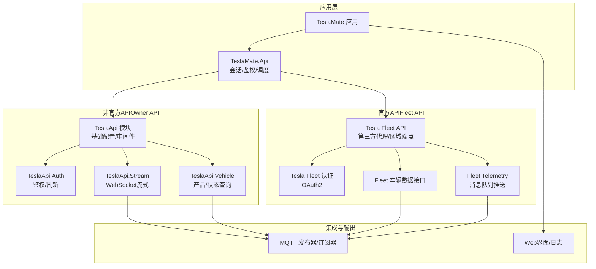
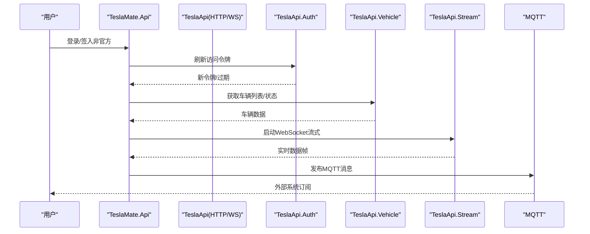
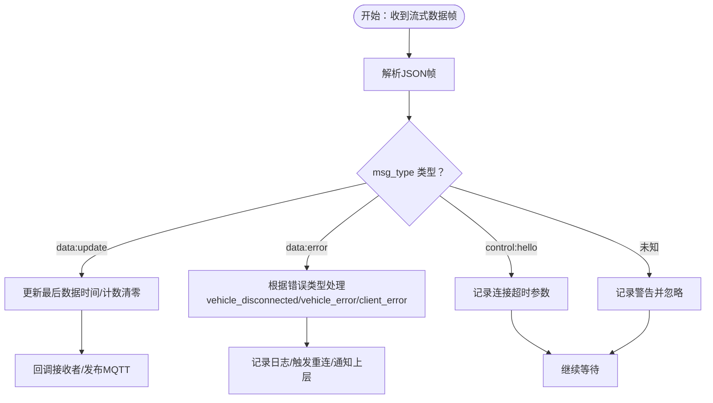
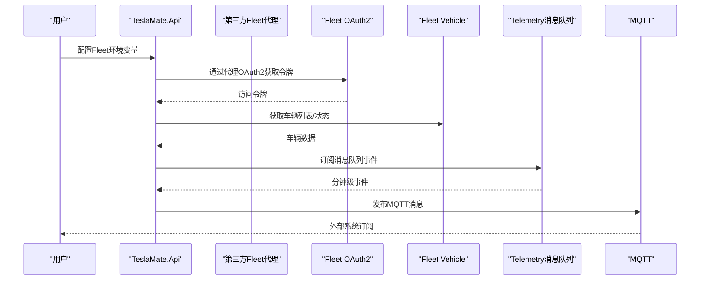
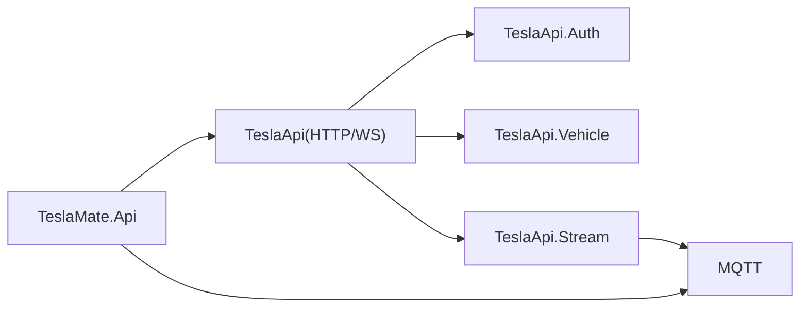

# 官方API与非官方API对比

<cite>
**本文引用的文件**
- [lib/tesla_api.ex](file://lib/tesla_api.ex)
- [lib/tesla_api/auth.ex](file://lib/tesla_api/auth.ex)
- [lib/tesla_api/auth/refresh.ex](file://lib/tesla_api/auth/refresh.ex)
- [lib/tesla_api/vehicle.ex](file://lib/tesla_api/vehicle.ex)
- [lib/tesla_api/stream.ex](file://lib/tesla_api/stream.ex)
- [lib/tesla_api/error.ex](file://lib/tesla_api/error.ex)
- [lib/teslamate/api.ex](file://lib/teslamate/api.ex)
- [lib/teslamate/mqtt.ex](file://lib/teslamate/mqtt.ex)
- [lib/teslamate/mqtt/pubsub/vehicle_subscriber.ex](file://lib/teslamate/mqtt/pubsub/vehicle_subscriber.ex)
- [website/docs/configuration/api.md](file://website/docs/configuration/api.md)
- [website/docs/configuration/environment_variables.md](file://website/docs/configuration/environment_variables.md)
- [test/teslamate/vehicles/vehicle/streaming_test.exs](file://test/teslamate/vehicles/vehicle/streaming_test.exs)
- [config/config.exs](file://config/config.exs)
</cite>

## 目录
1. [引言](#引言)
2. [项目结构](#项目结构)
3. [核心组件](#核心组件)
4. [架构总览](#架构总览)
5. [详细组件分析](#详细组件分析)
6. [依赖关系分析](#依赖关系分析)
7. [性能考量](#性能考量)
8. [故障排查指南](#故障排查指南)
9. [结论](#结论)
10. [附录](#附录)

## 引言
本文件面向TeslaMate用户，系统对比“官方API”与“非官方API”的差异，重点覆盖：
- Tesla Fleet API与传统Owner API在功能、权限与限制上的差异
- Fleet Telemetry与传统流式API在数据推送频率（分钟级vs秒级）与传输协议（消息队列vsWebSocket）上的根本区别
- 不同用户类型（个人用户vs企业车队用户）的迁移必要性与背景
- 选择建议：个人用户继续使用功能更丰富的非官方API；企业车队用户必须迁移至官方API
- 通过MyTeslaMate等第三方代理简化官方API接入的方案

## 项目结构
TeslaMate围绕两套API路径组织：
- 非官方API路径（Owner API + WebSocket流式）：用于个人用户，具备更高分辨率与更丰富的命令能力
- 官方API路径（Fleet API + Telemetry消息队列）：用于企业车队用户，逐步替代Legacy Owner API

图表来源
- [lib/teslamate/api.ex](file://lib/teslamate/api.ex#L1-L317)
- [lib/tesla_api.ex](file://lib/tesla_api.ex#L1-L18)
- [lib/tesla_api/auth.ex](file://lib/tesla_api/auth.ex#L1-L99)
- [lib/tesla_api/vehicle.ex](file://lib/tesla_api/vehicle.ex#L1-L147)
- [lib/tesla_api/stream.ex](file://lib/tesla_api/stream.ex#L1-L272)
- [lib/teslamate/mqtt.ex](file://lib/teslamate/mqtt.ex#L1-L65)

章节来源
- [lib/teslamate/api.ex](file://lib/teslamate/api.ex#L1-L317)
- [lib/tesla_api.ex](file://lib/tesla_api.ex#L1-L18)
- [lib/tesla_api/auth.ex](file://lib/tesla_api/auth.ex#L1-L99)
- [lib/tesla_api/vehicle.ex](file://lib/tesla_api/vehicle.ex#L1-L147)
- [lib/tesla_api/stream.ex](file://lib/tesla_api/stream.ex#L1-L272)
- [lib/teslamate/mqtt.ex](file://lib/teslamate/mqtt.ex#L1-L65)

## 核心组件
- 非官方API（Owner API）
  - 基础HTTP客户端与中间件：统一的请求头、JSON编解码、日志与超时控制
  - 认证与刷新：基于OAuth2刷新令牌，自动续期与熔断保护
  - 车辆接口：产品列表、车辆信息、带状态的车辆数据
  - 流式接口：WebSocket连接，按列字段推送实时数据，支持重连与退避策略
- 官方API（Fleet API）
  - 文档明确指出：Fleet API为官方替代方案，但存在限制（如较低的数据分辨率、命令限制等）
  - 文档还提供通过第三方代理（如MyTeslaMate、Teslemetry）接入官方API的路径
- MQTT集成
  - 将车辆状态与事件发布到MQTT主题，便于外部系统消费

章节来源
- [lib/tesla_api.ex](file://lib/tesla_api.ex#L1-L18)
- [lib/tesla_api/auth.ex](file://lib/tesla_api/auth.ex#L1-L99)
- [lib/tesla_api/auth/refresh.ex](file://lib/tesla_api/auth/refresh.ex#L1-L43)
- [lib/tesla_api/vehicle.ex](file://lib/tesla_api/vehicle.ex#L1-L147)
- [lib/tesla_api/stream.ex](file://lib/tesla_api/stream.ex#L1-L272)
- [lib/teslamate/mqtt.ex](file://lib/teslamate/mqtt.ex#L1-L65)
- [website/docs/configuration/api.md](file://website/docs/configuration/api.md#L1-L156)

## 架构总览
下图展示非官方API与官方API在TeslaMate中的交互关系与数据流向。

图表来源
- [lib/teslamate/api.ex](file://lib/teslamate/api.ex#L1-L317)
- [lib/tesla_api/auth.ex](file://lib/tesla_api/auth.ex#L1-L99)
- [lib/tesla_api/vehicle.ex](file://lib/tesla_api/vehicle.ex#L1-L147)
- [lib/tesla_api/stream.ex](file://lib/tesla_api/stream.ex#L1-L272)
- [lib/teslamate/mqtt.ex](file://lib/teslamate/mqtt.ex#L1-L65)

## 详细组件分析

### 非官方API（Owner API）对比分析
- 功能完整性
  - 支持获取车辆列表、单辆车信息与带状态的车辆数据，便于高分辨率状态采集
  - WebSocket流式接口支持每秒级事件推送，满足高频数据场景
- 权限与限制
  - 使用OAuth2刷新令牌机制，具备自动续期与失败熔断
  - 对429（Too Many Requests）进行错误封装与重试策略
- 数据分辨率
  - WebSocket流式按列字段推送，包含速度、里程、SOC、功率、方向、海拔、预估范围等，时间戳精确到秒级
- 错误处理与稳定性
  - 对未授权、超时、服务端错误等进行分类处理，并记录日志
  - 流式连接具备指数退避与断线重连逻辑

图表来源
- [lib/tesla_api/stream.ex](file://lib/tesla_api/stream.ex#L1-L272)

章节来源
- [lib/tesla_api/vehicle.ex](file://lib/tesla_api/vehicle.ex#L1-L147)
- [lib/tesla_api/stream.ex](file://lib/tesla_api/stream.ex#L1-L272)
- [lib/tesla_api/error.ex](file://lib/tesla_api/error.ex#L1-L38)
- [test/teslamate/vehicles/vehicle/streaming_test.exs](file://test/teslamate/vehicles/vehicle/streaming_test.exs#L1-L599)

### 官方API（Fleet API）对比分析
- 功能与限制
  - Fleet API为官方替代方案，但文档指出其在数据分辨率与命令发送方面存在限制
  - Fleet Telemetry默认以消息队列推送，而非WebSocket，且最小推送周期为分钟级
- 用户类型与迁移背景
  - 企业车队用户（Fleet）的Owner API正在逐步关停，需尽快迁移到官方API
  - 个人用户当前仍可使用Owner API，但未来可能受限
- 第三方代理接入
  - MyTeslaMate提供Fleet API与WebSocket流式代理，简化接入流程
  - Teslemetry提供付费Fleet API与流式代理，但文档强调与Teslamate的流式不兼容

图表来源
- [website/docs/configuration/api.md](file://website/docs/configuration/api.md#L1-L156)
- [website/docs/configuration/environment_variables.md](file://website/docs/configuration/environment_variables.md#L9-L62)

章节来源
- [website/docs/configuration/api.md](file://website/docs/configuration/api.md#L1-L156)
- [website/docs/configuration/environment_variables.md](file://website/docs/configuration/environment_variables.md#L9-L62)

### 数据推送频率与传输协议对比
- 非官方API（Owner API）
  - 传输协议：WebSocket
  - 推送频率：历史流式可达到每秒级事件
  - 数据字段：速度、里程、SOC、功率、方向、海拔、预估范围等
- 官方API（Fleet API）
  - 传输协议：消息队列（默认），非WebSocket
  - 推送频率：最小为分钟级
  - 数据分辨率：文档指出较非官方API更低

章节来源
- [lib/tesla_api/stream.ex](file://lib/tesla_api/stream.ex#L1-L272)
- [website/docs/configuration/api.md](file://website/docs/configuration/api.md#L1-L156)

### 选择建议
- 个人用户：继续使用非官方API（Owner API + WebSocket流式），因其功能更丰富、数据分辨率更高
- 企业车队用户：必须迁移至官方API（Fleet API + Telemetry），因Owner API对车队用户已逐步关停

章节来源
- [website/docs/configuration/api.md](file://website/docs/configuration/api.md#L1-L156)

### 通过MyTeslaMate等第三方代理简化官方API接入
- MyTeslaMate
  - 提供Fleet API与WebSocket流式代理，降低接入复杂度
  - 环境变量示例：TOKEN、TESLA_API_HOST、TESLA_AUTH_HOST、TESLA_AUTH_PATH、TESLA_WSS_HOST等
- Teslemetry
  - 提供付费Fleet API与流式代理，但文档强调与Teslamate的流式不兼容，需手动禁用

章节来源
- [website/docs/configuration/api.md](file://website/docs/configuration/api.md#L1-L156)
- [website/docs/configuration/environment_variables.md](file://website/docs/configuration/environment_variables.md#L9-L62)

## 依赖关系分析
- 组件耦合
  - TeslaMate.Api作为协调器，依赖TeslaApi模块族（认证、车辆、流式）
  - 流式组件依赖WebSocket客户端与TLS证书链
  - MQTT组件负责将状态发布到消息总线
- 外部依赖
  - Tesla认证与API端点（含区域区分）
  - 第三方Fleet代理（MyTeslaMate、Teslemetry）

图表来源
- [lib/teslamate/api.ex](file://lib/teslamate/api.ex#L1-L317)
- [lib/tesla_api.ex](file://lib/tesla_api.ex#L1-L18)
- [lib/tesla_api/auth.ex](file://lib/tesla_api/auth.ex#L1-L99)
- [lib/tesla_api/vehicle.ex](file://lib/tesla_api/vehicle.ex#L1-L147)
- [lib/tesla_api/stream.ex](file://lib/tesla_api/stream.ex#L1-L272)
- [lib/teslamate/mqtt.ex](file://lib/teslamate/mqtt.ex#L1-L65)

章节来源
- [lib/teslamate/api.ex](file://lib/teslamate/api.ex#L1-L317)
- [lib/tesla_api.ex](file://lib/tesla_api.ex#L1-L18)
- [lib/tesla_api/auth.ex](file://lib/tesla_api/auth.ex#L1-L99)
- [lib/tesla_api/vehicle.ex](file://lib/tesla_api/vehicle.ex#L1-L147)
- [lib/tesla_api/stream.ex](file://lib/tesla_api/stream.ex#L1-L272)
- [lib/teslamate/mqtt.ex](file://lib/teslamate/mqtt.ex#L1-L65)

## 性能考量
- 非官方API（Owner API）
  - WebSocket长连接具备低延迟与高吞吐特性，适合高频数据采集
  - 流式组件内置指数退避与断线重连，保障稳定性
- 官方API（Fleet API）
  - 消息队列推送最小为分钟级，不适合需要秒级响应的场景
  - 需要额外的代理或自建服务以恢复接近秒级的体验（如MyTeslaMate WebSocket代理）

章节来源
- [lib/tesla_api/stream.ex](file://lib/tesla_api/stream.ex#L1-L272)
- [website/docs/configuration/api.md](file://website/docs/configuration/api.md#L1-L156)

## 故障排查指南
- 常见错误与处理
  - 未授权：触发熔断与自动刷新，必要时提示重新登录
  - 过多请求（429）：记录重试间隔并等待后重试
  - 流式断开：指数退避重连，超过阈值提示过多断开
  - 车辆离线：主动拉取车辆状态
- 日志与监控
  - 组件均包含详细的日志级别与错误输出，便于定位问题
  - MQTT发布器可验证消息是否正确到达

章节来源
- [lib/tesla_api/error.ex](file://lib/tesla_api/error.ex#L1-L38)
- [lib/tesla_api/stream.ex](file://lib/tesla_api/stream.ex#L1-L272)
- [lib/teslamate/mqtt.ex](file://lib/teslamate/mqtt.ex#L1-L65)
- [lib/teslamate/mqtt/pubsub/vehicle_subscriber.ex](file://lib/teslamate/mqtt/pubsub/vehicle_subscriber.ex#L174-L216)

## 结论
- 对于个人用户：继续使用非官方API（Owner API + WebSocket流式），因其功能更完整、数据分辨率更高
- 对于企业车队用户：必须迁移至官方API（Fleet API + Telemetry），因Owner API对车队用户已逐步关停
- 若希望简化官方API接入，可采用MyTeslaMate等第三方代理，快速完成端到端部署

## 附录
- 环境变量与配置要点
  - TESLA_API_HOST、TESLA_AUTH_HOST、TESLA_AUTH_PATH、TESLA_AUTH_CLIENT_ID、TOKEN
  - TESLA_WSS_HOST、TESLA_WSS_TLS_ACCEPT_INVALID_CERTS、TESLA_WSS_USE_VIN
  - POLLING_*系列间隔（睡眠/充电/驾驶/在线/默认/最小）
  - MQTT相关（主机、端口、用户名/密码、TLS、命名空间等）

章节来源
- [website/docs/configuration/environment_variables.md](file://website/docs/configuration/environment_variables.md#L9-L62)
- [config/config.exs](file://config/config.exs#L1-L30)