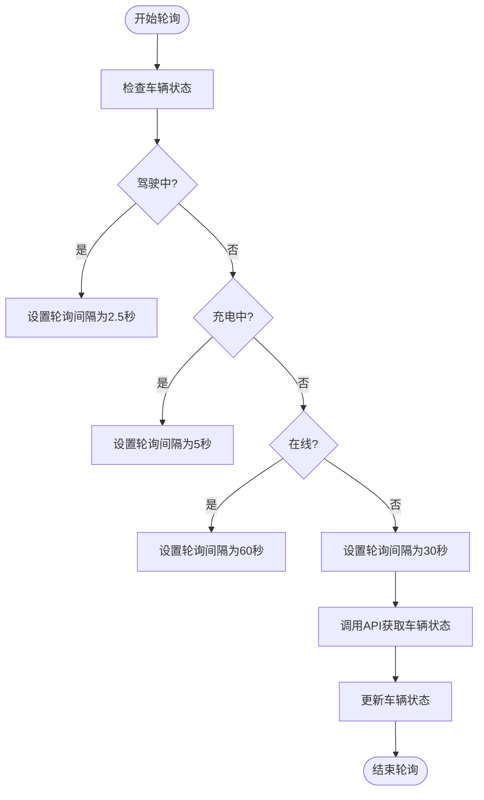
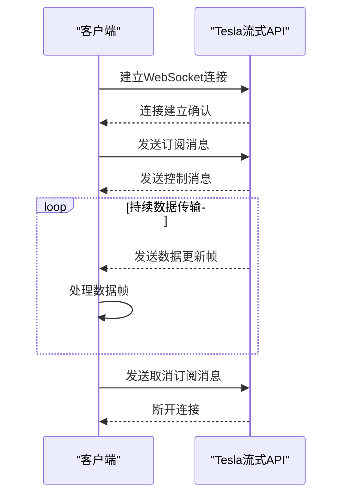
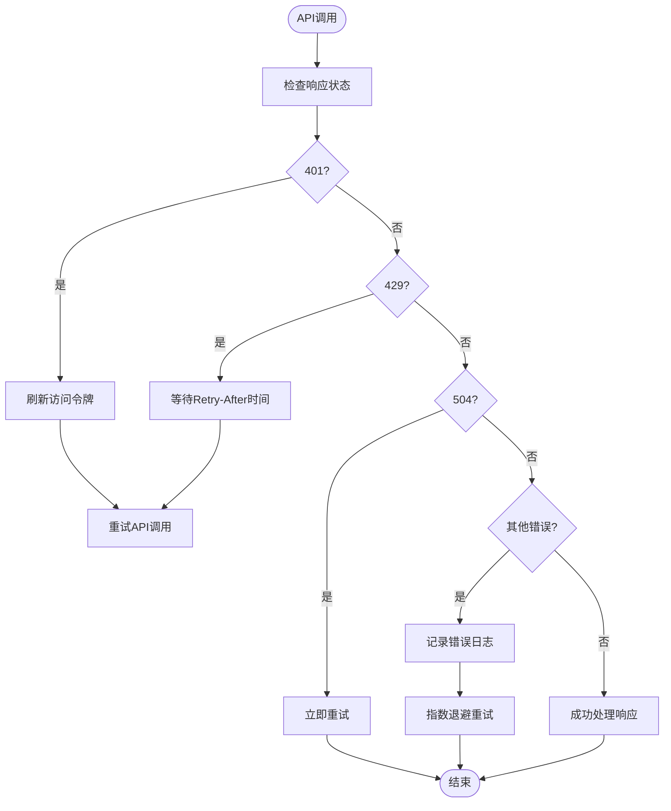

# 数据同步机制

<cite>
**本文档引用的文件**   
- [tesla_api.ex](file://lib/tesla_api.ex)
- [vehicle.ex](file://lib/tesla_api/vehicle.ex)
- [stream.ex](file://lib/tesla_api/stream.ex)
- [data.ex](file://lib/tesla_api/stream/data.ex)
- [state.ex](file://lib/tesla_api/vehicle/state.ex)
- [error.ex](file://lib/tesla_api/error.ex)
- [auth.ex](file://lib/tesla_api/auth.ex)
- [updater.ex](file://lib/teslamate/updater.ex)
- [vehicles.ex](file://lib/teslamate/vehicles.ex)
- [vehicle.ex](file://lib/teslamate/vehicles/vehicle.ex)
- [api.ex](file://lib/teslamate/api.ex)
- [environment_variables.md](file://website/docs/configuration/environment_variables.md)
</cite>

## 目录
1. [引言](#引言)
2. [轮询同步模式](#轮询同步模式)
3. [流式传输同步模式](#流式传输同步模式)
4. [API调用实现细节](#api调用实现细节)
5. [错误处理与自动重试机制](#错误处理与自动重试机制)
6. [流式API集成](#流式api集成)
7. [非官方Owner API与官方Fleet Telemetry对比](#非官方owner-api与官方fleet-telemetry对比)
8. [车辆状态预加载优化策略](#车辆状态预加载优化策略)
9. [流式API配置](#流式api配置)
10. [结论](#结论)

## 引言
Tesla API数据同步机制是TeslaMate系统的核心功能，负责从Tesla车辆获取实时数据并进行同步。该机制支持两种主要的同步模式：轮询（Polling）和流式传输（Streaming）。轮询模式通过定期调用API获取车辆状态，而流式传输模式则通过WebSocket连接实时接收车辆数据。本文档详细说明这两种同步模式的实现细节、API调用、错误处理、流式API集成、性能优化以及配置方法。

**Section sources**
- [tesla_api.ex](file://lib/tesla_api.ex#L1-L18)
- [vehicle.ex](file://lib/tesla_api/vehicle.ex#L1-L147)

## 轮询同步模式
轮询同步模式是通过定期调用Tesla API来获取车辆状态信息的一种方式。系统根据车辆的不同状态（如驾驶中、充电中、在线、休眠等）设置不同的轮询间隔。例如，当车辆处于驾驶状态时，轮询间隔为2.5秒；当车辆处于充电状态时，轮询间隔为5秒；当车辆处于休眠状态时，轮询间隔为30秒。这种动态调整的轮询策略可以有效平衡数据实时性和系统资源消耗。

轮询模式主要通过`list_vehicles`、`get_vehicle`和`get_vehicle_with_state`等API调用来实现。`list_vehicles`用于获取用户账户下的所有车辆列表，`get_vehicle`用于获取特定车辆的基本信息，而`get_vehicle_with_state`则用于获取车辆的完整状态信息，包括充电状态、气候状态、驾驶状态等。

**Diagram sources**
- [vehicle.ex](file://lib/tesla_api/vehicle.ex#L25-L67)
- [vehicle.ex](file://lib/teslamate/vehicles/vehicle.ex#L30-L48)

## 流式传输同步模式
流式传输同步模式通过WebSocket连接实时接收车辆数据，提供比轮询模式更高的数据频率和更低的延迟。系统通过`TeslaApi.Stream`模块建立与Tesla流式API的WebSocket连接，并订阅车辆数据更新。一旦连接建立，系统会持续接收来自车辆的实时数据帧，包括速度、里程、电池电量、海拔、航向等信息。

流式传输模式的数据频率可达每秒一次，远高于轮询模式的每分钟一次。这种高频率的数据传输使得系统能够更精确地记录驾驶过程和充电过程，提供更详细的分析和可视化。

**Diagram sources**
- [stream.ex](file://lib/tesla_api/stream.ex#L26-L53)
- [data.ex](file://lib/tesla_api/stream/data.ex#L1-L47)

## API调用实现细节
### list_vehicles
`list_vehicles` API调用用于获取用户账户下的所有车辆列表。该调用首先根据认证信息确定API主机地址（全球或中国），然后发送HTTP GET请求到`/api/1/products`端点。响应数据经过处理后，过滤掉不包含车辆ID的记录，并将每个车辆信息转换为`TeslaApi.Vehicle`结构。

**Section sources**
- [vehicle.ex](file://lib/tesla_api/vehicle.ex#L25-L36)

### get_vehicle
`get_vehicle` API调用用于获取特定车辆的基本信息。该调用同样根据认证信息确定API主机地址，然后发送HTTP GET请求到`/api/1/vehicles/{id}`端点。响应数据直接转换为`TeslaApi.Vehicle`结构，包含车辆的ID、VIN、状态、显示名称等基本信息。

**Section sources**
- [vehicle.ex](file://lib/tesla_api/vehicle.ex#L38-L48)

### get_vehicle_with_state
`get_vehicle_with_state` API调用用于获取特定车辆的完整状态信息。该调用发送HTTP GET请求到`/api/1/vehicles/{id}/vehicle_data`端点，并在查询参数中指定需要获取的状态模块（如充电状态、气候状态、驾驶状态等）。响应数据经过处理后，将各个状态模块的信息合并到`TeslaApi.Vehicle`结构中。

**Section sources**
- [vehicle.ex](file://lib/tesla_api/vehicle.ex#L51-L67)

## 错误处理与自动重试机制
系统实现了完善的错误处理和自动重试机制，以应对网络波动、API限流、认证失效等各种异常情况。当API调用返回错误时，系统会根据错误类型采取相应的处理措施：

- **401 Unauthorized**：表示认证失效，系统会尝试刷新访问令牌。
- **429 Too Many Requests**：表示API请求过于频繁，系统会根据`Retry-After`头部信息等待指定时间后重试。
- **504 Gateway Timeout**：表示网关超时，系统会立即重试。
- **车辆不可用**：表示车辆当前无法访问，系统会采用指数退避策略进行重试。

自动重试机制通过`fuse`库实现，当连续多次请求失败后，系统会暂时停止请求，避免对API造成过大压力。同时，系统会记录错误日志，便于问题排查和监控。

**Diagram sources**
- [vehicle.ex](file://lib/tesla_api/vehicle.ex#L98-L145)
- [error.ex](file://lib/tesla_api/error.ex#L1-L38)

## 流式API集成
流式API集成通过`TeslaApi.Stream`模块实现，该模块基于`WebSockex`库建立WebSocket连接。连接建立后，系统会发送订阅消息，指定需要接收的数据字段（如速度、里程、电池电量等）。一旦收到数据更新帧，系统会解析JSON数据，将其转换为`TeslaApi.Stream.Data`结构，并通过回调函数传递给上层应用。

流式API集成还实现了连接管理和错误恢复机制。当连接断开或出现错误时，系统会根据错误类型采取相应的恢复措施，如重新连接、重新订阅等。同时，系统会监控连接状态，确保数据传输的连续性和可靠性。

**Section sources**
- [stream.ex](file://lib/tesla_api/stream.ex#L1-L272)
- [data.ex](file://lib/tesla_api/stream/data.ex#L1-L47)

## 非官方Owner API与官方Fleet Telemetry对比
| 特性 | 非官方Owner API | 官方Fleet Telemetry |
| --- | --- | --- |
| **数据频率** | 每分钟一次（轮询）或每秒一次（流式） | 实时（WebSocket） |
| **传输方式** | HTTP轮询或WebSocket流式传输 | WebSocket流式传输 |
| **数据完整性** | 完整的车辆状态信息 | 有限的车辆状态信息 |
| **认证方式** | OAuth 2.0 | API密钥 |
| **使用限制** | 有请求频率限制 | 无明确限制 |
| **适用场景** | 个人用户、数据记录 | 企业车队管理、实时监控 |

**Section sources**
- [vehicle.ex](file://lib/tesla_api/vehicle.ex#L25-L67)
- [stream.ex](file://lib/tesla_api/stream.ex#L26-L53)

## 车辆状态预加载优化策略
车辆状态预加载（preload_vehicle）是一种优化策略，用于在获取车辆列表时同时获取车辆的完整状态信息。当`list_vehicles` API调用返回车辆列表后，系统会并发地为每个在线车辆调用`get_vehicle_with_state` API，以获取其完整状态。这种预加载策略可以减少后续API调用次数，提高系统响应速度。

预加载策略通过`Task.async_stream`实现，允许多个车辆状态获取任务并发执行，最大并发数为10。每个任务有32.5秒的超时时间，确保不会因单个请求阻塞整个预加载过程。预加载完成后，所有车辆的完整状态信息将被合并到车辆列表中，供上层应用使用。

**Section sources**
- [api.ex](file://lib/teslamate/api.ex#L292-L294)
- [api.ex](file://lib/teslamate/api.ex#L302-L311)

## 流式API配置
流式API的配置主要通过环境变量进行，关键配置项包括：

- **TESLA_WSS_HOST**：Tesla流式API的WebSocket主机地址，默认为`wss://streaming.vn.teslamotors.com`（全球）或`wss://streaming.vn.cloud.tesla.cn`（中国）。
- **TESLA_WSS_TLS_ACCEPT_INVALID_CERTS**：是否接受无效的TLS证书，默认为`false`。
- **TESLA_WSS_USE_VIN**：是否使用VIN而不是VID连接流式API，默认为`false`。

这些环境变量可以在Docker运行时通过`-e`参数设置，或在配置文件中定义。正确配置这些变量是确保流式API正常工作的前提。

**Section sources**
- [environment_variables.md](file://website/docs/configuration/environment_variables.md#L48-L50)
- [stream.ex](file://lib/tesla_api/stream.ex#L33-L44)

## 结论
Tesla API数据同步机制通过轮询和流式传输两种模式，实现了对Tesla车辆数据的高效同步。轮询模式适用于低频数据获取，而流式传输模式则提供了高频率的实时数据。系统通过完善的错误处理和自动重试机制，确保了数据同步的稳定性和可靠性。车辆状态预加载优化策略进一步提升了系统性能。通过合理配置环境变量，用户可以轻松启用和配置流式API，获得更丰富的车辆数据。