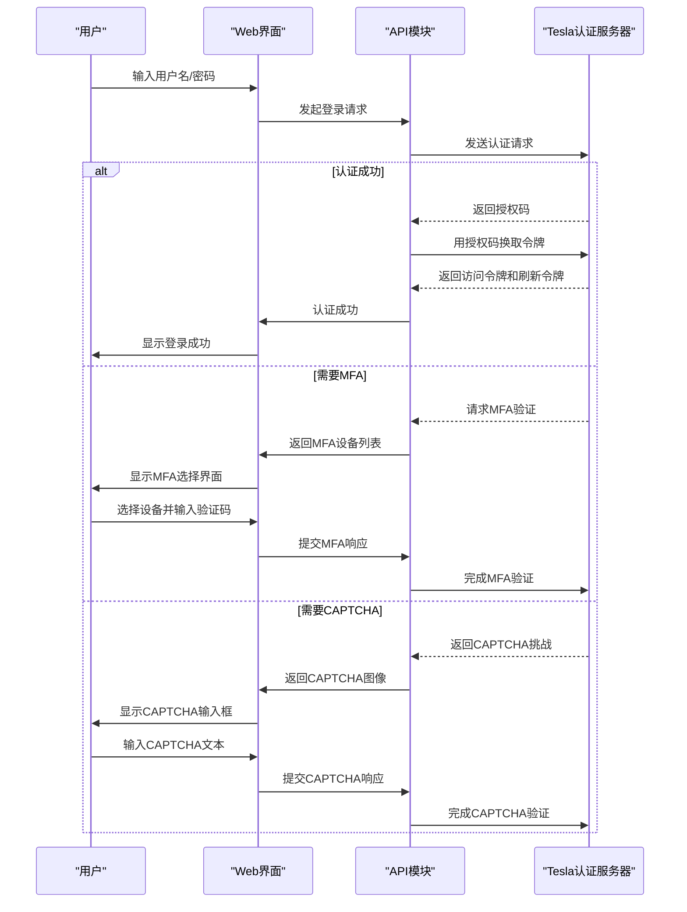
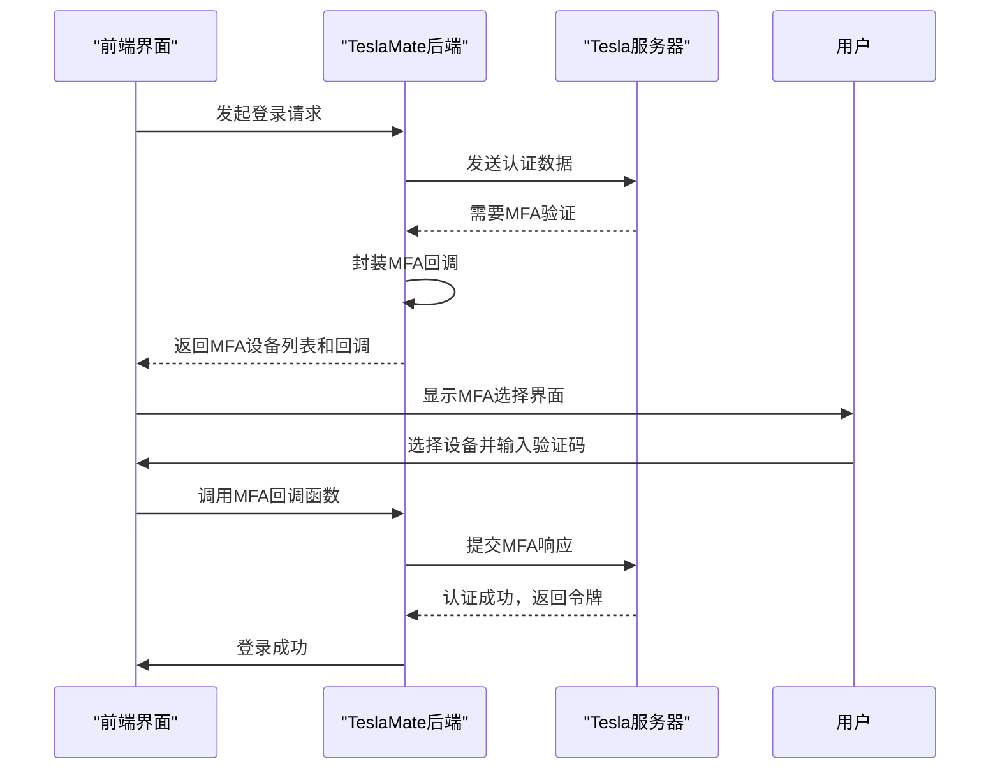
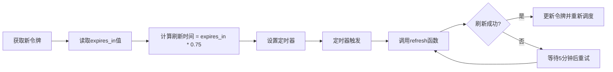

# 认证机制

<cite>
**本文档中引用的文件**  
- [auth.ex](file://lib/tesla_api/auth.ex)
- [refresh.ex](file://lib/tesla_api/auth/refresh.ex)
- [tokens.ex](file://lib/teslamate/auth/tokens.ex)
- [auth.ex](file://lib/teslamate/auth.ex)
- [token_auth.ex](file://lib/tesla_api/middleware/token_auth.ex)
- [signin_live/index.ex](file://lib/teslamate_web/live/signin_live/index.ex)
- [signin_live/index.html.heex](file://lib/teslamate_web/live/signin_live/index.html.heex)
- [vault.ex](file://lib/teslamate/vault.ex)
- [api.ex](file://lib/teslamate/api.ex)
- [error.ex](file://lib/tesla_api/error.ex)
- [environment_variables.md](file://website/docs/configuration/environment_variables.md)
- [api.md](file://website/docs/configuration/api.md)
- [runtime.exs](file://config/runtime.exs)
- [20190730101523_create_tokens.exs](file://priv/repo/migrations/20190730101523_create_tokens.exs)
- [20210130174838_use_variable_length_type_for_tokens.exs](file://priv/repo/migrations/20210130174838_use_variable_length_type_for_tokens.exs)
- [20220123131732_encrypt_api_tokens.exs](file://priv/repo/migrations/20220123131732_encrypt_api_tokens.exs)
</cite>

## 目录
1. [简介](#简介)
2. [认证流程概述](#认证流程概述)
3. [核心组件分析](#核心组件分析)
4. [令牌管理机制](#令牌管理机制)
5. [多因素认证与验证码处理](#多因素认证与验证码处理)
6. [令牌刷新调度策略](#令牌刷新调度策略)
7. [第三方认证方案](#第三方认证方案)
8. [故障排查指南](#故障排查指南)

## 简介
本文档详细介绍了TeslaMate与Tesla API之间的OAuth 2.0认证机制。该系统实现了基于用户名/密码的初始登录、访问令牌和刷新令牌的安全管理，并支持多因素认证（MFA）和验证码（CAPTCHA）等安全挑战的处理。所有敏感的API令牌都通过AES-256-GCM加密算法进行加密存储，确保了用户凭证的安全性。系统还实现了智能的令牌刷新机制，以维持长期的API访问权限。

## 认证流程概述
TeslaMate的认证流程遵循标准的OAuth 2.0授权码流程，通过Tesla的认证服务器获取访问令牌。整个流程从用户在Web界面输入用户名和密码开始，经过一系列HTTP请求与重定向，最终获取到用于访问Tesla API的访问令牌和刷新令牌。系统通过封装回调函数来处理认证过程中的各种交互，如MFA和CAPTCHA，确保了用户体验的流畅性。获取到的令牌对会被加密后存储在数据库中，并在后续的API调用中自动使用。



**图示来源**
- [auth.ex](file://lib/tesla_api/auth.ex)
- [signin_live/index.ex](file://lib/teslamate_web/live/signin_live/index.ex)
- [api.ex](file://lib/teslamate/api.ex)

## 核心组件分析

### Tesla API认证模块
`TeslaApi.Auth`模块是整个认证系统的核心，它使用Tesla库构建了一个HTTP客户端，专门用于与Tesla的认证API进行通信。该模块定义了与认证相关的默认请求头、基础URL和中间件。它还定义了一个结构体来存储认证信息，包括访问令牌、令牌类型、过期时间、刷新令牌和创建时间。

**组件来源**
- [auth.ex](file://lib/tesla_api/auth.ex#L1-L98)

### 令牌存储与加密
`TeslaMate.Auth.Tokens`模块定义了用于在数据库中存储API令牌的数据模型。该模型使用Cloak库对`access`和`refresh`字段进行透明加密，确保即使数据库被泄露，攻击者也无法直接读取用户的API令牌。加密密钥由`ENCRYPTION_KEY`环境变量提供，如果未提供，系统会生成一个临时密钥并在日志中警告用户。

```mermaid
classDiagram
class TeslaMate.Auth.Tokens {
+refresh : Encrypted.Binary
+access : Encrypted.Binary
+inserted_at : datetime
+updated_at : datetime
}
class TeslaMate.Vault {
+encryption_key : String
+init(config) : GenServer.on_init
+get_encryption_key_from_config() : { : ok, key} | : error
}
TeslaMate.Auth.Tokens --> TeslaMate.Vault : "使用加密"
```

**图示来源**
- [tokens.ex](file://lib/teslamate/auth/tokens.ex#L1-L23)
- [vault.ex](file://lib/teslamate/vault.ex#L1-L140)

**组件来源**
- [tokens.ex](file://lib/teslamate/auth/tokens.ex#L1-L23)
- [vault.ex](file://lib/teslamate/vault.ex#L1-L140)

### 认证上下文
`TeslaMate.Auth`模块提供了与令牌相关的业务逻辑，如保存、获取和验证令牌。它确保数据库中只存在一对令牌，并在保存新令牌时更新或创建记录。该模块还提供了`can_decrypt_tokens?`函数，用于检查系统是否具备解密现有令牌的能力，这对于在应用重启后恢复认证状态至关重要。

**组件来源**
- [auth.ex](file://lib/teslamate/auth.ex#L1-L71)

## 令牌管理机制
TeslaMate通过数据库迁移实现了对API令牌的持久化存储。最初，令牌以明文形式存储在`tokens`表中。随着安全要求的提高，系统通过迁移脚本将明文字段转换为加密字段，确保了现有用户数据的安全升级。令牌的获取和刷新操作都通过`TeslaApi.Auth.Refresh`模块完成，该模块向Tesla的令牌端点发送请求，使用刷新令牌换取新的访问令牌。

```mermaid
flowchart TD
A[开始] --> B{是否存在令牌?}
B --> |否| C[执行初始登录]
B --> |是| D[从数据库加载令牌]
D --> E[尝试使用刷新令牌}
E --> F{刷新成功?}
F --> |是| G[更新内存和数据库中的令牌]
F --> |否| H[要求用户重新登录]
G --> I[使用访问令牌调用API]
H --> C
C --> J[获取新的访问和刷新令牌]
J --> K[加密并保存到数据库]
K --> G
```

**图示来源**
- [refresh.ex](file://lib/tesla_api/auth/refresh.ex#L1-L42)
- [auth.ex](file://lib/teslamate/auth.ex#L46-L57)
- [20220123131732_encrypt_api_tokens.exs](file://priv/repo/migrations/20220123131732_encrypt_api_tokens.exs#L97-L123)

**组件来源**
- [refresh.ex](file://lib/tesla_api/auth/refresh.ex#L1-L42)
- [auth.ex](file://lib/teslamate/auth.ex#L46-L57)

## 多因素认证与验证码处理
当Tesla的认证服务器要求进行多因素认证（MFA）或验证码（CAPTCHA）验证时，TeslaMate的认证流程会中断并返回一个特殊的响应。`TeslaMate.Api`模块会捕获这些响应，并通过封装的回调函数将挑战信息传递给前端界面。前端随后向用户展示相应的输入界面，用户完成验证后，前端将结果通过回调函数返回给后端，后端继续完成认证流程。



**图示来源**
- [api.ex](file://lib/teslamate/api.ex#L142-L170)
- [signin_live/index.ex](file://lib/teslamate_web/live/signin_live/index.ex#L34-L43)

**组件来源**
- [api.ex](file://lib/teslamate/api.ex#L142-L170)
- [signin_live/index.ex](file://lib/teslamate_web/live/signin_live/index.ex#L34-L43)

## 令牌刷新调度策略
为了确保API访问的连续性，TeslaMate实现了一个智能的令牌刷新调度器。当成功获取或刷新令牌后，系统会根据令牌的`expires_in`值计算出一个刷新时间点。这个时间点被设置为令牌过期时间的75%，即在令牌还有25%寿命时就开始刷新流程。这种策略既避免了在令牌过期后立即出现服务中断，又不会过于频繁地发起刷新请求。



**图示来源**
- [api.ex](file://lib/teslamate/api.ex#L227-L247)

**组件来源**
- [api.ex](file://lib/teslamate/api.ex#L227-L247)

## 第三方认证方案
TeslaMate支持通过第三方服务（如MyTeslaMate）进行认证。用户可以通过设置特定的环境变量来切换到这些服务。例如，使用MyTeslaMate时，需要设置`TOKEN`、`TESLA_API_HOST`和`TESLA_AUTH_HOST`等环境变量。这种方式允许用户使用由第三方提供的API令牌，从而绕过直接与Tesla认证服务器交互的复杂流程，特别适用于无法直接登录Tesla账户的场景。

**环境变量配置**

| 环境变量 | 描述 | 示例值 |
| :--- | :--- | :--- |
| **TOKEN** | 第三方提供的API令牌 | ?token=xxxx-xxxx-xxxx |
| **TESLA_API_HOST** | Tesla API主机地址 | https://api.myteslamate.com |
| **TESLA_AUTH_HOST** | Tesla认证主机地址 | https://api.myteslamate.com |
| **TESLA_AUTH_PATH** | Tesla认证路径 | /api/oauth2/v3 |
| **ENCRYPTION_KEY** | 用于加密API令牌的密钥 | (必需) |

**来源**
- [environment_variables.md](file://website/docs/configuration/environment_variables.md#L9-L62)
- [api.md](file://website/docs/configuration/api.md#L40-L73)

## 故障排查指南
当认证过程失败时，TeslaMate会记录详细的错误信息，帮助用户诊断问题。常见的故障包括令牌解密失败、授权被拒绝和账户被锁定等。

### 令牌解密失败
如果系统无法解密存储的API令牌，通常是因为`ENCRYPTION_KEY`环境变量发生了变化或丢失。解决方法是确保在每次启动时都提供相同的加密密钥。如果密钥丢失，用户需要重新登录以获取新的令牌对。

**组件来源**
- [vault.ex](file://lib/teslamate/vault.ex#L41-L46)

### 授权被拒绝
当API返回401 Unauthorized错误时，表明当前的访问令牌已失效且刷新也失败。这通常意味着刷新令牌已过期或被撤销。系统会自动清除无效的令牌，并要求用户重新登录。

**组件来源**
- [api.ex](file://lib/teslamate/api.ex#L264-L275)

### 账户被锁定
由于多次登录尝试失败，用户的Tesla账户可能会被暂时锁定。在这种情况下，错误消息会明确提示用户需要重置密码才能解锁账户。用户应访问Tesla官方网站进行密码重置操作。

**组件来源**
- [signin_live/index.ex](file://lib/teslamate_web/live/signin_live/index.ex#L54-L68)

### 其他常见问题
- **CAPTCHA频繁出现**：可能是由于IP地址被标记为可疑。尝试使用不同的网络环境或联系Tesla支持。
- **MFA设备不显示**：确保在Tesla账户中正确设置了MFA，并且使用的设备已注册。
- **令牌刷新失败**：检查网络连接，并确保`TESLA_AUTH_HOST`等环境变量配置正确。

**组件来源**
- [error.ex](file://lib/tesla_api/error.ex#L1-L37)
- [signin_live/index.ex](file://lib/teslamate_web/live/signin_live/index.ex#L54-L68)