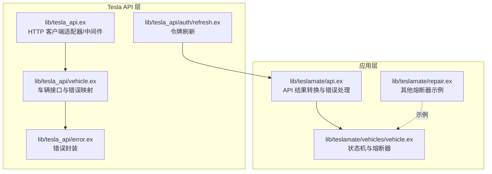
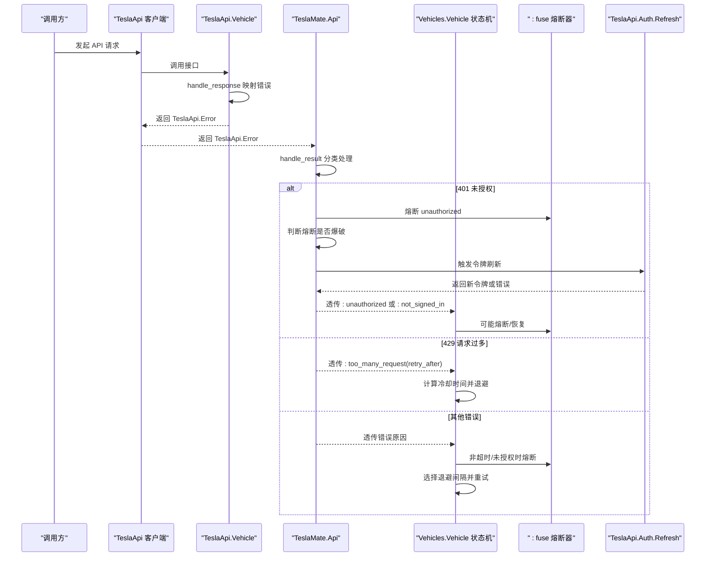
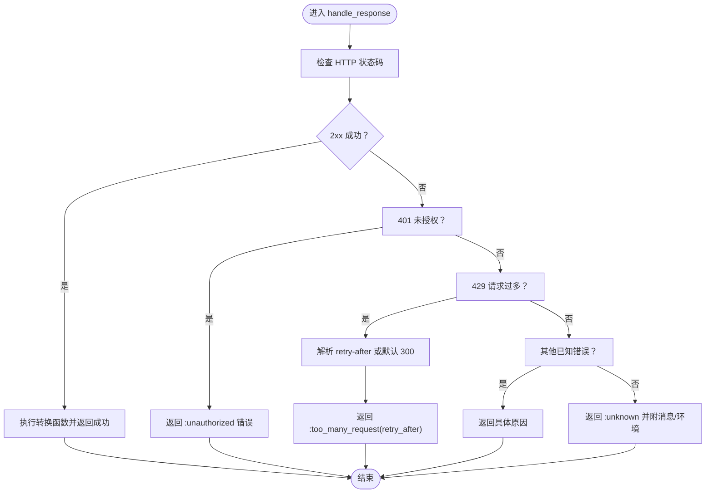
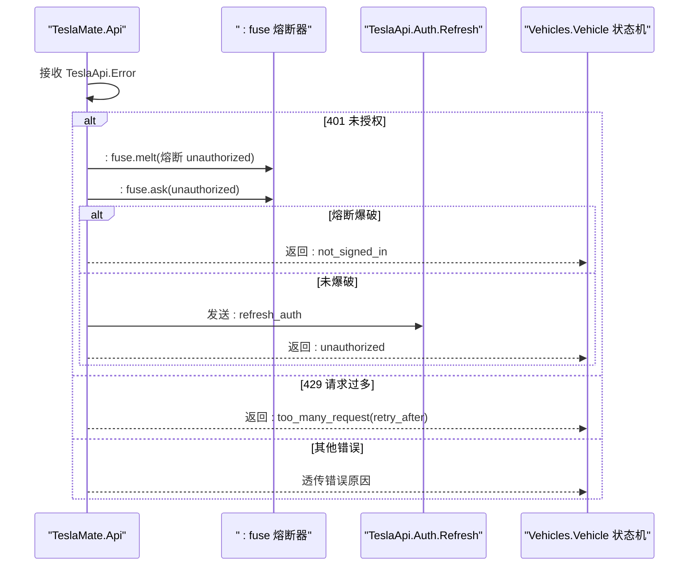
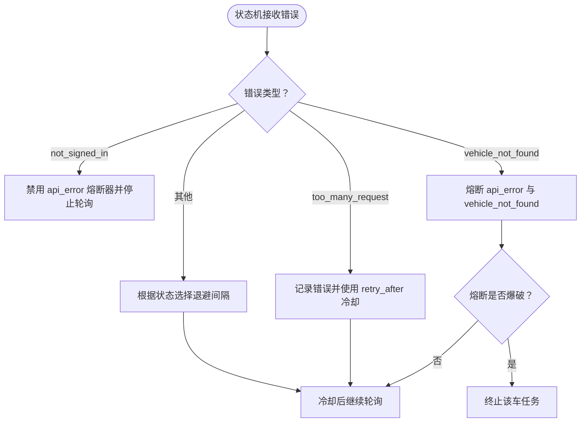
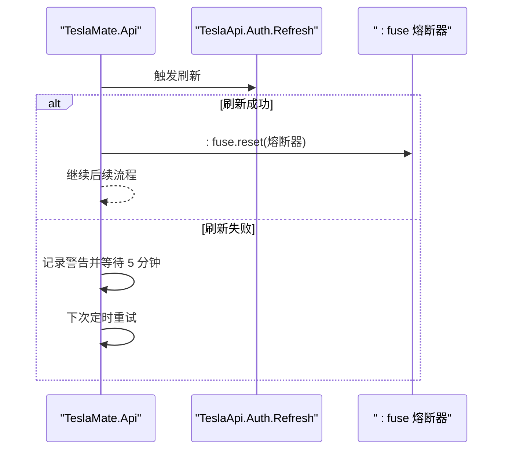
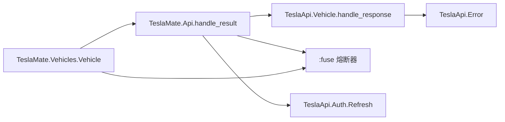

# 错误处理与容错

<cite>
**本文引用的文件**
- [lib/tesla_api/vehicle.ex](file://lib/tesla_api/vehicle.ex)
- [lib/tesla_api/error.ex](file://lib/tesla_api/error.ex)
- [lib/tesla_api.ex](file://lib/tesla_api.ex)
- [lib/tesla_api/auth/refresh.ex](file://lib/tesla_api/auth/refresh.ex)
- [lib/teslamate/api.ex](file://lib/teslamate/api.ex)
- [lib/teslamate/vehicles/vehicle.ex](file://lib/teslamate/vehicles/vehicle.ex)
- [lib/teslamate/repair.ex](file://lib/teslamate/repair.ex)
- [website/docs/configuration/environment_variables.md](file://website/docs/configuration/environment_variables.md)
- [test/teslamate/vehicles/vehicle_test.exs](file://test/teslamate/vehicles/vehicle_test.exs)
- [test/teslamate/api_test.exs](file://test/teslamate/api_test.exs)
</cite>

## 目录
1. [简介](#简介)
2. [项目结构](#项目结构)
3. [核心组件](#核心组件)
4. [架构总览](#架构总览)
5. [详细组件分析](#详细组件分析)
6. [依赖关系分析](#依赖关系分析)
7. [性能考量](#性能考量)
8. [故障排查指南](#故障排查指南)
9. [结论](#结论)

## 简介
本文件系统性阐述 TeslaMate 对 Tesla API 调用异常的处理策略，重点覆盖：
- handle_result 中对不同错误类型的分类处理（未授权、请求过多、网络超时等）
- 基于 :fuse 熔断器的容错与退避策略，防止令牌失效时频繁刷新
- HTTP 状态码 401 触发的令牌刷新流程与 429 的重试等待机制
- 网络连接失败、响应超时等底层错误的捕获与日志记录
- 合理设置请求频率以避免触发速率限制的优化建议

## 项目结构
围绕 API 错误处理的关键模块分布如下：
- Tesla API 客户端与中间件：lib/tesla_api.ex、lib/tesla_api/vehicle.ex、lib/tesla_api/error.ex、lib/tesla_api/auth/refresh.ex
- 应用层 API 封装与错误转换：lib/teslamate/api.ex
- 车辆状态机与熔断器：lib/teslamate/vehicles/vehicle.ex
- 其他熔断器示例：lib/teslamate/repair.ex
- 配置项参考：website/docs/configuration/environment_variables.md
- 测试用例验证行为：test/teslamate/vehicles/vehicle_test.exs、test/teslamate/api_test.exs

图表来源
- [lib/tesla_api.ex](file://lib/tesla_api.ex#L1-L17)
- [lib/tesla_api/vehicle.ex](file://lib/tesla_api/vehicle.ex#L1-L147)
- [lib/tesla_api/error.ex](file://lib/tesla_api/error.ex#L1-L38)
- [lib/tesla_api/auth/refresh.ex](file://lib/tesla_api/auth/refresh.ex#L1-L42)
- [lib/teslamate/api.ex](file://lib/teslamate/api.ex#L262-L316)
- [lib/teslamate/vehicles/vehicle.ex](file://lib/teslamate/vehicles/vehicle.ex#L180-L200)
- [lib/teslamate/repair.ex](file://lib/teslamate/repair.ex#L114-L152)

章节来源
- [lib/tesla_api.ex](file://lib/tesla_api.ex#L1-L17)
- [lib/tesla_api/vehicle.ex](file://lib/tesla_api/vehicle.ex#L1-L147)
- [lib/teslamate/api.ex](file://lib/teslamate/api.ex#L262-L316)
- [lib/teslamate/vehicles/vehicle.ex](file://lib/teslamate/vehicles/vehicle.ex#L180-L200)
- [lib/teslamate/repair.ex](file://lib/teslamate/repair.ex#L114-L152)

## 核心组件
- TeslaApi.Vehicle.handle_response：将 HTTP 响应映射为统一的 TeslaApi.Error，并按状态码分类返回错误原因（如 unauthorized、too_many_request、timeout 等）。
- TeslaApi.Error：统一的错误封装，支持从响应体提取可读消息或回退到默认信息。
- TeslaMate.Api.handle_result：在应用层对 TeslaApi.Error 进行二次处理，区分 unauthorized、too_many_request 等并触发后续动作（如刷新令牌、记录熔断）。
- TeslaMate.Vehicles.Vehicle：状态机内对各类错误进行熔断与退避控制，结合 :fuse 实现冷却期与熔断恢复。
- TeslaApi.Auth.Refresh：令牌刷新流程，供应用层在 401 场景下触发。

章节来源
- [lib/tesla_api/vehicle.ex](file://lib/tesla_api/vehicle.ex#L98-L146)
- [lib/tesla_api/error.ex](file://lib/tesla_api/error.ex#L1-L38)
- [lib/teslamate/api.ex](file://lib/teslamate/api.ex#L262-L316)
- [lib/teslamate/vehicles/vehicle.ex](file://lib/teslamate/vehicles/vehicle.ex#L180-L200)
- [lib/tesla_api/auth/refresh.ex](file://lib/tesla_api/auth/refresh.ex#L1-L42)

## 架构总览
下面的序列图展示了从 Tesla API 返回到应用层处理再到状态机熔断的整体流程，包括 401 未授权与 429 请求过多的路径。

图表来源
- [lib/tesla_api/vehicle.ex](file://lib/tesla_api/vehicle.ex#L98-L146)
- [lib/teslamate/api.ex](file://lib/teslamate/api.ex#L262-L316)
- [lib/teslamate/vehicles/vehicle.ex](file://lib/teslamate/vehicles/vehicle.ex#L400-L435)
- [lib/tesla_api/auth/refresh.ex](file://lib/tesla_api/auth/refresh.ex#L1-L42)

## 详细组件分析

### 组件A：TeslaApi.Vehicle.handle_response（错误分类与映射）
- 功能要点
  - 将 2xx 成功响应解包为业务数据；非 2xx 按状态码与响应体字段映射为统一错误原因。
  - 401 未授权：返回 :unauthorized。
  - 404/405/408/504 等特定错误：返回对应原因（如 :vehicle_not_found、:vehicle_in_service、:vehicle_unavailable、:timeout）。
  - 429 请求过多：解析响应头 retry-after，默认 300 秒，返回 :too_many_request 并附带秒数。
  - 未知错误：返回 :unknown，必要时携带消息或环境信息。
- 复杂度与性能
  - 时间复杂度 O(1)，仅做条件匹配与少量字符串解析。
  - 通过统一错误原因，简化上层分支逻辑。

图表来源
- [lib/tesla_api/vehicle.ex](file://lib/tesla_api/vehicle.ex#L98-L146)

章节来源
- [lib/tesla_api/vehicle.ex](file://lib/tesla_api/vehicle.ex#L98-L146)

### 组件B：TeslaMate.Api.handle_result（应用层错误处理与熔断）
- 功能要点
  - 将 TeslaApi.Error 转换为应用层可识别的错误原因。
  - 401 未授权：触发熔断 unauthorized；若熔断爆破则返回 :not_signed_in；否则发送 :refresh_auth 指令，当前请求标记为 :unauthorized 以便上层重试。
  - 429 请求过多：记录警告并返回 :too_many_request(retry_after)。
  - 其他错误：记录警告或错误日志，透传原因给状态机。
- 与 :fuse 的交互
  - 在 401 时对 unauthorized 熔断器进行熔断，避免频繁刷新。
  - 在 429 时由状态机根据 retry_after 冷却，不直接在此处熔断。
  - 在非超时/未授权的错误时对 api_error 熔断器熔断，以保护下游。

图表来源
- [lib/teslamate/api.ex](file://lib/teslamate/api.ex#L262-L316)

章节来源
- [lib/teslamate/api.ex](file://lib/teslamate/api.ex#L262-L316)

### 组件C：TeslaMate.Vehicles.Vehicle（熔断器与退避策略）
- 熔断器安装与启用
  - 在启动时安装两类熔断器：
    - vehicle_not_found：标准型熔断，阈值与冷却参数定义了“车不存在”场景下的熔断与恢复节奏。
    - api_error：标准型熔断，阈值与冷却参数定义了通用 API 错误的熔断与恢复节奏。
- 错误处理与退避
  - :too_many_request：记录错误并使用 retry_after 作为冷却时间，随后继续轮询。
  - 其他错误：记录错误并根据当前状态选择不同的退避间隔（驾驶/充电/在线/其他），然后继续轮询。
  - :not_signed_in：记录错误并禁用 api_error 熔断器，停止轮询，等待用户重新登录。
  - :vehicle_not_found：对 api_error 与 vehicle_not_found 同时熔断，达到阈值后终止该车任务。
- 与 :fuse 的交互
  - 使用 :fuse.melt() 熔断、:fuse.ask() 查询状态、:fuse.circuit_disable()/enable() 控制熔断器开关。
  - 测试中可见对熔断器的启用/禁用与恢复广播的验证。

图表来源
- [lib/teslamate/vehicles/vehicle.ex](file://lib/teslamate/vehicles/vehicle.ex#L180-L200)
- [lib/teslamate/vehicles/vehicle.ex](file://lib/teslamate/vehicles/vehicle.ex#L390-L435)
- [test/teslamate/vehicles/vehicle_test.exs](file://test/teslamate/vehicles/vehicle_test.exs#L331-L377)

章节来源
- [lib/teslamate/vehicles/vehicle.ex](file://lib/teslamate/vehicles/vehicle.ex#L180-L200)
- [lib/teslamate/vehicles/vehicle.ex](file://lib/teslamate/vehicles/vehicle.ex#L390-L435)
- [test/teslamate/vehicles/vehicle_test.exs](file://test/teslamate/vehicles/vehicle_test.exs#L331-L377)

### 组件D：令牌刷新与 5 分钟冷却期（基于 :fuse 的退避）
- 401 未授权触发刷新
  - 应用层在 401 时对 unauthorized 熔断器熔断，若未爆破则发送 :refresh_auth 指令。
- 令牌刷新失败的冷却策略
  - 当刷新失败时，记录警告并以 5 分钟为周期重试，避免频繁刷新导致额外压力。
- 令牌刷新成功后的熔断器复位
  - 成功刷新后复位熔断器，确保后续正常轮询。

图表来源
- [lib/teslamate/api.ex](file://lib/teslamate/api.ex#L176-L204)
- [lib/teslamate/api.ex](file://lib/teslamate/api.ex#L213-L247)

章节来源
- [lib/teslamate/api.ex](file://lib/teslamate/api.ex#L176-L204)
- [lib/teslamate/api.ex](file://lib/teslamate/api.ex#L213-L247)

### 组件E：其他熔断器示例（地址反向地理编码）
- 通过 :fuse.ask/:fuse.melt/:fuse.install 的组合，对地址查询进行熔断与冷却，体现 :fuse 在系统中的通用用法。

章节来源
- [lib/teslamate/repair.ex](file://lib/teslamate/repair.ex#L114-L152)

## 依赖关系分析
- TeslaApi.Vehicle.handle_response 依赖 TeslaApi.Error 提供统一错误封装。
- TeslaMate.Api.handle_result 依赖 TeslaApi.Vehicle 的错误映射结果，并与 :fuse 熔断器协作。
- TeslaMate.Vehicles.Vehicle 状态机依赖 TeslaMate.Api 的处理结果，结合 :fuse 与调度器实现退避。
- TeslaApi.Auth.Refresh 为令牌刷新提供独立流程，被 TeslaMate.Api 调用。

图表来源
- [lib/tesla_api/vehicle.ex](file://lib/tesla_api/vehicle.ex#L98-L146)
- [lib/tesla_api/error.ex](file://lib/tesla_api/error.ex#L1-L38)
- [lib/teslamate/api.ex](file://lib/teslamate/api.ex#L262-L316)
- [lib/teslamate/vehicles/vehicle.ex](file://lib/teslamate/vehicles/vehicle.ex#L180-L200)
- [lib/tesla_api/auth/refresh.ex](file://lib/tesla_api/auth/refresh.ex#L1-L42)

章节来源
- [lib/tesla_api/vehicle.ex](file://lib/tesla_api/vehicle.ex#L98-L146)
- [lib/tesla_api/error.ex](file://lib/tesla_api/error.ex#L1-L38)
- [lib/teslamate/api.ex](file://lib/teslamate/api.ex#L262-L316)
- [lib/teslamate/vehicles/vehicle.ex](file://lib/teslamate/vehicles/vehicle.ex#L180-L200)
- [lib/tesla_api/auth/refresh.ex](file://lib/tesla_api/auth/refresh.ex#L1-L42)

## 性能考量
- 降低请求频率以避免触发 429
  - 参考环境变量中的轮询间隔设置，合理调整 POLLING_*_INTERVAL，避免过于频繁的轮询。
- 退避策略
  - 针对 429 使用 retry-after 冷却，针对其他错误按状态选择退避间隔，减少无效重试。
- 令牌刷新冷却
  - 401 未授权刷新失败采用 5 分钟冷却，避免频繁刷新造成额外压力。
- 日志级别
  - TeslaApi.ex 中根据状态码设置日志级别，有助于在高负载时降低噪声。

章节来源
- [website/docs/configuration/environment_variables.md](file://website/docs/configuration/environment_variables.md#L52-L60)
- [lib/tesla_api.ex](file://lib/tesla_api.ex#L1-L17)
- [lib/teslamate/api.ex](file://lib/teslamate/api.ex#L176-L204)

## 故障排查指南
- 401 未授权
  - 现象：应用层返回 :unauthorized 或 :not_signed_in。
  - 处理：检查令牌有效性与刷新流程；确认 :fuse 对 unauthorized 的熔断状态；查看刷新失败的日志与 5 分钟冷却。
- 429 请求过多
  - 现象：应用层返回 :too_many_request(retry_after)，状态机按 retry_after 冷却。
  - 处理：降低请求频率，避免触发速率限制；检查网络与上游限流策略。
- 超时与连接问题
  - 现象：返回 :timeout 或连接关闭等错误，状态机记录警告并短时间退避。
  - 处理：检查网络连通性、DNS 解析、代理设置；适当增大 HTTP 超时配置。
- 车辆不存在
  - 现象：返回 :vehicle_not_found，状态机对 api_error 与 vehicle_not_found 同时熔断，达到阈值后终止任务。
  - 处理：确认车辆 ID 是否正确；检查 Tesla API 返回；必要时手动重启相关任务。
- 熔断器状态异常
  - 现象：健康状态异常或无法恢复。
  - 处理：在测试中可见对熔断器的 enable/disable 操作，可据此验证与修复。

章节来源
- [lib/teslamate/api.ex](file://lib/teslamate/api.ex#L262-L316)
- [lib/teslamate/vehicles/vehicle.ex](file://lib/teslamate/vehicles/vehicle.ex#L390-L435)
- [test/teslamate/vehicles/vehicle_test.exs](file://test/teslamate/vehicles/vehicle_test.exs#L331-L377)
- [test/teslamate/api_test.exs](file://test/teslamate/api_test.exs#L297-L338)

## 结论
TeslaMate 通过统一的错误映射与分层处理，实现了对 Tesla API 异常的稳健应对：
- 401 未授权：基于 :fuse 的熔断与 5 分钟冷却，避免频繁刷新；刷新失败自动退避。
- 429 请求过多：依据 retry-after 冷却，配合状态机退避策略，降低对上游的压力。
- 其他错误：通过 :fuse 对 api_error 熔断，结合状态机的智能退避，维持系统稳定性。
- 配置层面：合理设置轮询间隔与超时，有助于规避速率限制与网络波动带来的影响。