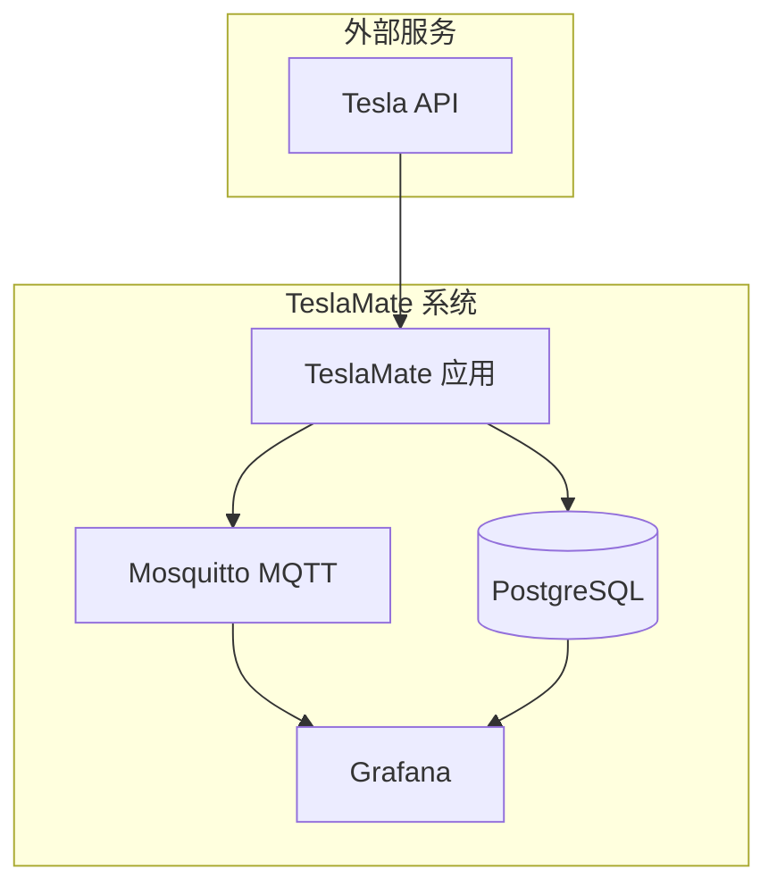
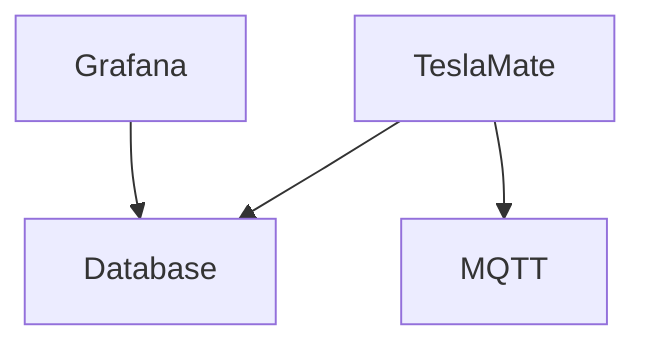

# Docker 安装

<cite>
**本文档中引用的文件**  
- [docker-compose.yml](file://docker-compose.yml)
- [Dockerfile](file://Dockerfile)
- [entrypoint.sh](file://entrypoint.sh)
- [grafana/dashboards.yml](file://grafana/dashboards.yml)
- [grafana/datasource.yml](file://grafana/datasource.yml)
- [website/docs/installation/docker.md](file://website/docs/installation/docker.md)
- [website/docs/configuration/environment_variables.md](file://website/docs/configuration/environment_variables.md)
- [website/docs/advanced_guides/traefik.md](file://website/docs/advanced_guides/traefik.md)
- [website/docs/faq.md](file://website/docs/faq.md)
</cite>

## 目录
1. [简介](#简介)
2. [项目结构](#项目结构)
3. [核心组件](#核心组件)
4. [架构概述](#架构概述)
5. [详细组件分析](#详细组件分析)
6. [依赖分析](#依赖分析)
7. [性能考虑](#性能考虑)
8. [故障排除指南](#故障排除指南)
9. [结论](#结论)

## 简介
TeslaMate 是一个强大的自托管特斯拉车辆数据记录器，使用 Docker 部署可以简化安装和维护过程。本指南将详细介绍如何使用 Docker 和 docker-compose 部署 TeslaMate，包括配置文件的结构解析、关键服务的配置说明、环境变量的设置、数据卷的挂载策略、网络配置建议以及常见问题的排查方法。

## 项目结构
TeslaMate 项目的目录结构清晰，主要包含以下几个部分：
- `assets/`：前端资源文件，包括 CSS、JavaScript 和构建脚本。
- `config/`：应用配置文件，包括不同环境下的配置。
- `grafana/`：Grafana 相关文件，包括仪表盘配置和数据源配置。
- `lib/`：应用的核心逻辑代码，使用 Elixir 编写。
- `nix/`：Nix 包管理相关的配置文件。
- `priv/`：私有资源文件，包括数据库迁移脚本和静态文件。
- `test/`：测试代码。
- `website/`：文档网站源码。
- 根目录下的 `Dockerfile`、`docker-compose.yml`、`entrypoint.sh` 等文件用于 Docker 部署。

**Section sources**
- [Dockerfile](file://Dockerfile)
- [entrypoint.sh](file://entrypoint.sh)
- [grafana/dashboards.yml](file://grafana/dashboards.yml)
- [grafana/datasource.yml](file://grafana/datasource.yml)

## 核心组件
TeslaMate 的核心组件包括 TeslaMate 应用本身、PostgreSQL 数据库、Grafana 可视化工具和 Mosquitto MQTT 代理。这些组件通过 docker-compose 组织在一起，形成一个完整的数据记录和分析系统。

**Section sources**
- [docker-compose.yml](file://docker-compose.yml)
- [website/docs/installation/docker.md](file://website/docs/installation/docker.md)

## 架构概述
TeslaMate 的架构基于微服务设计，各组件通过 Docker 容器运行，相互之间通过网络通信。TeslaMate 应用负责从特斯拉 API 获取车辆数据，存储到 PostgreSQL 数据库中，并通过 MQTT 代理发布数据。Grafana 从数据库读取数据，生成各种可视化仪表盘。



**Diagram sources**
- [docker-compose.yml](file://docker-compose.yml)
- [website/docs/installation/docker.md](file://website/docs/installation/docker.md)

## 详细组件分析

### TeslaMate 应用分析
TeslaMate 应用是整个系统的核心，负责与特斯拉 API 交互，获取车辆数据，并将其存储到数据库中。应用使用 Elixir 编写，通过 Phoenix 框架提供 Web 界面。

#### 配置文件结构
`docker-compose.yml` 文件定义了所有服务的配置，包括 TeslaMate 应用、数据库、Grafana 和 MQTT 代理。每个服务都有自己的镜像、环境变量、端口映射和数据卷配置。

```yaml
services:
  teslamate:
    image: teslamate/teslamate:latest
    restart: always
    environment:
      - ENCRYPTION_KEY=secretkey
      - DATABASE_USER=teslamate
      - DATABASE_PASS=password
      - DATABASE_NAME=teslamate
      - DATABASE_HOST=database
      - MQTT_HOST=mosquitto
    ports:
      - 4000:4000
    volumes:
      - ./import:/opt/app/import
    cap_drop:
      - all
```

**Diagram sources**
- [docker-compose.yml](file://docker-compose.yml)

#### 环境变量配置
环境变量用于配置 TeslaMate 应用的行为，包括数据库连接、MQTT 代理地址、加密密钥等。关键环境变量包括：
- `ENCRYPTION_KEY`：用于加密 Tesla API 令牌的密钥。
- `DATABASE_URL`：数据库连接 URL。
- `MQTT_HOST`：MQTT 代理的主机名。

**Section sources**
- [website/docs/configuration/environment_variables.md](file://website/docs/configuration/environment_variables.md)

### 数据库分析
PostgreSQL 数据库用于存储所有车辆数据，包括行驶记录、充电记录、车辆状态等。数据库通过数据卷挂载，确保数据持久化。

#### 数据卷挂载策略
数据卷挂载策略确保数据库数据在容器重启后不会丢失。推荐的挂载策略是将本地目录挂载到容器内的 `/var/lib/postgresql` 目录。

```yaml
volumes:
  - teslamate-db:/var/lib/postgresql
```

**Diagram sources**
- [docker-compose.yml](file://docker-compose.yml)

### Grafana 分析
Grafana 用于可视化 TeslaMate 收集的数据，提供丰富的仪表盘和图表。Grafana 通过数据源配置连接到 PostgreSQL 数据库，并加载预定义的仪表盘。

#### 仪表盘配置
Grafana 仪表盘配置文件 `dashboards.yml` 定义了仪表盘的加载路径和更新间隔。仪表盘文件存储在 `grafana/dashboards` 目录下。

```yaml
apiVersion: 1

providers:
  - name: "teslamate"
    orgId: 1
    folder: TeslaMate
    folderUid: Nr4ofiDZk
    type: file
    disableDeletion: false
    allowUiUpdates: true
    updateIntervalSeconds: 86400
    options:
      path: /dashboards
```

**Diagram sources**
- [grafana/dashboards.yml](file://grafana/dashboards.yml)

#### 数据源配置
数据源配置文件 `datasource.yml` 定义了 Grafana 如何连接到 PostgreSQL 数据库。数据源配置使用环境变量，确保配置的灵活性。

```yaml
apiVersion: 1

datasources:
  - name: TeslaMate
    type: postgres
    url: $DATABASE_HOST:$DATABASE_PORT
    user: $DATABASE_USER
    access: proxy
    basicAuth: false
    withCredentials: false
    isDefault: true
    secureJsonData:
      password: $DATABASE_PASS
    jsonData:
      postgresVersion: 1500
      sslmode: $DATABASE_SSL_MODE
      database: $DATABASE_NAME
    version: 1
    editable: true
```

**Diagram sources**
- [grafana/datasource.yml](file://grafana/datasource.yml)

## 依赖分析
TeslaMate 系统的各个组件之间存在明确的依赖关系。TeslaMate 应用依赖于数据库和 MQTT 代理，Grafana 依赖于数据库。这些依赖关系在 `docker-compose.yml` 文件中通过 `depends_on` 指令定义。



**Diagram sources**
- [docker-compose.yml](file://docker-compose.yml)

## 性能考虑
为了确保 TeslaMate 系统的稳定运行，需要考虑以下性能因素：
- **内存**：建议至少 2GB 内存，以确保系统在高负载下仍能正常运行。
- **网络**：确保网络连接稳定，特别是与 Tesla API 的连接。
- **存储**：使用 SSD 存储，以提高数据库读写性能。

## 故障排除指南
在部署和使用 TeslaMate 过程中，可能会遇到一些常见问题。以下是一些常见问题及其解决方案。

### 容器启动失败
如果容器启动失败，首先检查日志输出，常见的原因包括：
- 环境变量配置错误。
- 数据库连接失败。
- 端口冲突。

可以通过以下命令查看日志：
```bash
docker compose logs
```

**Section sources**
- [entrypoint.sh](file://entrypoint.sh)

### 数据库初始化错误
数据库初始化错误通常是由于数据库服务未准备好导致的。TeslaMate 的 `entrypoint.sh` 脚本会等待数据库服务启动后再进行初始化。

```bash
# wait until Postgres is ready
while ! nc -z "${DATABASE_HOST}" "${DATABASE_PORT}" 2>/dev/null; do
	echo waiting for postgres at "${DATABASE_HOST}":"${DATABASE_PORT}"
	sleep 1s
done
```

**Section sources**
- [entrypoint.sh](file://entrypoint.sh)

### 端口冲突
如果遇到端口冲突，可以修改 `docker-compose.yml` 文件中的端口映射，例如将 TeslaMate 的端口从 4000 改为 4001。

```yaml
ports:
  - 4001:4000
```

### 验证安装成功
安装成功后，可以通过以下方式验证：
- 访问 TeslaMate Web 界面：`http://your-ip-address:4000`
- 访问 Grafana 界面：`http://your-ip-address:3000`，使用默认用户名 `admin` 和密码 `admin` 登录。

**Section sources**
- [website/docs/installation/docker.md](file://website/docs/installation/docker.md)

## 结论
通过本指南，您应该能够成功部署和配置 TeslaMate 系统。使用 Docker 和 docker-compose 可以大大简化部署过程，确保系统的稳定性和可维护性。如果您遇到任何问题，可以参考文档中的故障排除指南，或查阅官方文档获取更多帮助。