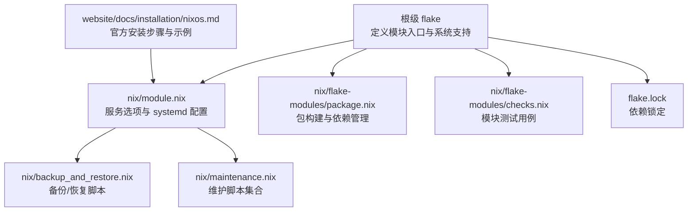
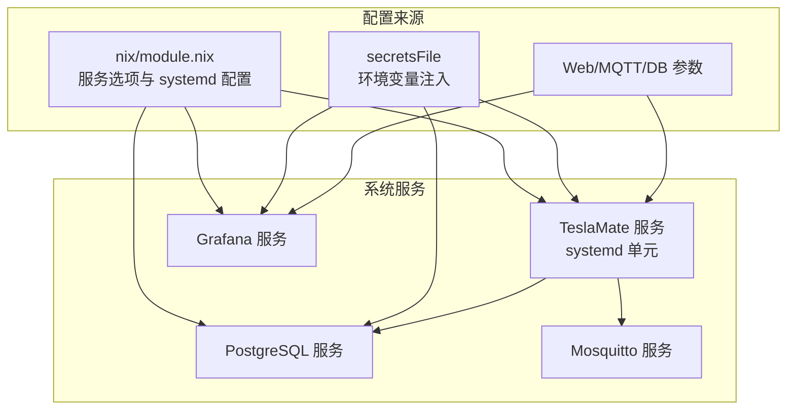
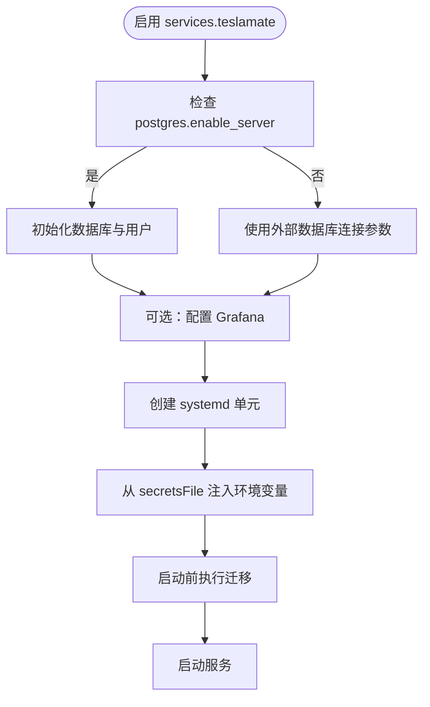
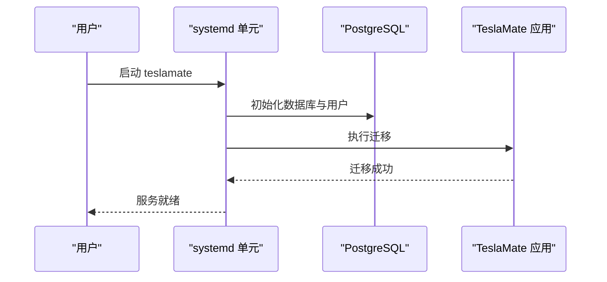
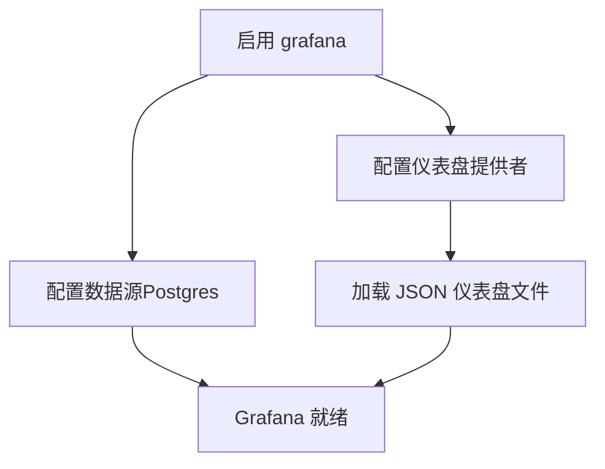
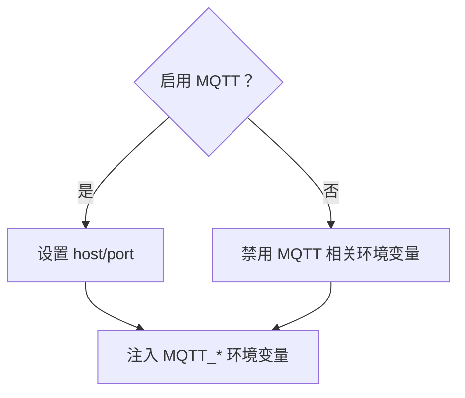
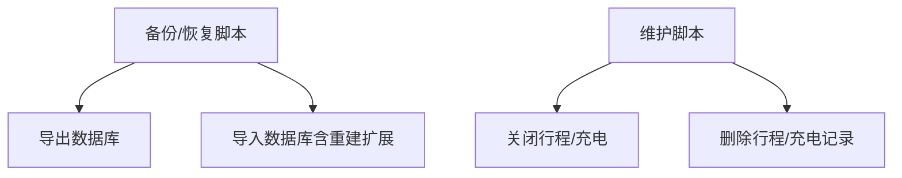
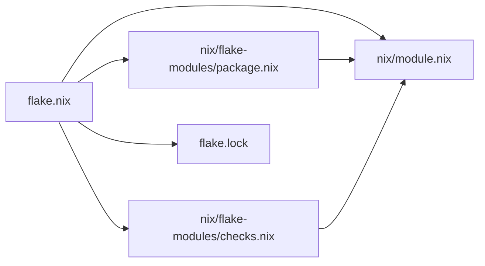

# NixOS 安装

<cite>
**本文引用的文件列表**
- [flake.nix](file://flake.nix)
- [nix/module.nix](file://nix/module.nix)
- [website/docs/installation/nixos.md](file://website/docs/installation/nixos.md)
- [nix/backup_and_restore.nix](file://nix/backup_and_restore.nix)
- [nix/maintenance.nix](file://nix/maintenance.nix)
- [nix/flake-modules/package.nix](file://nix/flake-modules/package.nix)
- [nix/flake-modules/checks.nix](file://nix/flake-modules/checks.nix)
- [flake.lock](file://flake.lock)
</cite>

## 目录
1. [简介](#简介)
2. [项目结构](#项目结构)
3. [核心组件](#核心组件)
4. [架构总览](#架构总览)
5. [详细组件分析](#详细组件分析)
6. [依赖关系分析](#依赖关系分析)
7. [性能与可靠性考量](#性能与可靠性考量)
8. [故障排查指南](#故障排查指南)
9. [结论](#结论)
10. [附录：完整配置示例与最佳实践](#附录完整配置示例与最佳实践)

## 简介
本指南面向在 NixOS 上以模块化方式部署 TeslaMate 的用户，重点讲解如何通过 flake 引入并启用 TeslaMate 模块，完成数据库、MQTT 与 Web 界面的配置，并结合 NixOS 的声明式特性实现原子升级与回滚。文档同时提供包管理与构建流程的简要说明，以及常见问题的定位与修复建议。

## 项目结构
与 NixOS 安装直接相关的核心文件位于仓库根目录与 nix 子目录：
- 根级 flake 定义了模块入口与系统支持范围
- nix/module.nix 提供服务选项与 systemd 配置
- website/docs/installation/nixos.md 提供官方安装步骤与示例
- nix/backup_and_restore.nix 与 nix/maintenance.nix 提供运维脚本
- nix/flake-modules/package.nix 描述包构建与依赖管理
- nix/flake-modules/checks.nix 展示模块测试用例
- flake.lock 记录依赖锁定信息

图表来源
- [flake.nix](file://flake.nix#L1-L35)
- [nix/module.nix](file://nix/module.nix#L1-L368)
- [website/docs/installation/nixos.md](file://website/docs/installation/nixos.md#L1-L112)
- [nix/backup_and_restore.nix](file://nix/backup_and_restore.nix#L1-L50)
- [nix/maintenance.nix](file://nix/maintenance.nix#L1-L114)
- [nix/flake-modules/package.nix](file://nix/flake-modules/package.nix#L1-L112)
- [nix/flake-modules/checks.nix](file://nix/flake-modules/checks.nix#L1-L48)
- [flake.lock](file://flake.lock#L1-L280)

章节来源
- [flake.nix](file://flake.nix#L1-L35)
- [nix/module.nix](file://nix/module.nix#L1-L368)
- [website/docs/installation/nixos.md](file://website/docs/installation/nixos.md#L1-L112)
- [nix/flake-modules/package.nix](file://nix/flake-modules/package.nix#L1-L112)
- [nix/flake-modules/checks.nix](file://nix/flake-modules/checks.nix#L1-L48)
- [flake.lock](file://flake.lock#L1-L280)

## 核心组件
- NixOS 模块选项与行为
  - 服务启用开关与自动启动控制
  - Web 界面绑定地址、端口与虚拟主机路径
  - 数据库连接参数与内置 Postgres 服务器
  - Grafana 集成与仪表盘配置
  - MQTT 集成开关与连接参数
  - 秘钥文件路径与环境变量注入
- systemd 服务配置
  - 用户与组、工作目录、启动前迁移、重启策略
  - 依赖服务顺序（网络、Postgres、Mosquitto）
- 运维工具
  - 备份与恢复脚本
  - 维护脚本（关闭行程/充电、删除行程/充电记录）

章节来源
- [nix/module.nix](file://nix/module.nix#L23-L214)
- [nix/module.nix](file://nix/module.nix#L216-L368)
- [nix/backup_and_restore.nix](file://nix/backup_and_restore.nix#L1-L50)
- [nix/maintenance.nix](file://nix/maintenance.nix#L1-L114)

## 架构总览
下图展示 NixOS 模块如何将 TeslaMate 服务、数据库与可视化组件整合为一个声明式系统配置。

图表来源
- [nix/module.nix](file://nix/module.nix#L166-L368)

## 详细组件分析

### 组件一：NixOS 模块选项与 systemd 配置
- 服务启用与自动启动
  - 通过启用开关控制是否创建用户、组与 systemd 单元
  - autoStart 控制是否随系统启动
- Web 界面参数
  - listenAddress：绑定 IP（可为空表示监听所有）
  - port：Web 端口
  - virtualHost/urlPath：用于生成应用 URL
- 数据库配置
  - postgres.enable_server：是否内置 Postgres 并初始化数据库与用户
  - user/database/host/port：连接参数
  - 内置初始化脚本创建数据库、用户并赋权
- Grafana 集成
  - 启用后自动配置数据源与仪表盘
  - 支持子路径挂载与默认首页设置
- MQTT 集成
  - 开关与主机/端口参数
  - 环境变量按需注入
- systemd 单元
  - 依赖网络、Postgres、Mosquitto
  - 启动前执行数据库迁移
  - 工作目录与用户隔离
  - 环境变量从 secretsFile 注入

图表来源
- [nix/module.nix](file://nix/module.nix#L166-L368)

章节来源
- [nix/module.nix](file://nix/module.nix#L23-L214)
- [nix/module.nix](file://nix/module.nix#L216-L368)

### 组件二：数据库初始化与连接
- 内置 Postgres 初始化脚本会创建数据库与用户，并授予权限
- secretsFile 必须包含数据库密码等敏感信息
- Grafana 与 TeslaMate 共享相同的数据库连接参数

图表来源
- [nix/module.nix](file://nix/module.nix#L231-L247)
- [nix/module.nix](file://nix/module.nix#L191-L193)

章节来源
- [nix/module.nix](file://nix/module.nix#L231-L247)
- [nix/module.nix](file://nix/module.nix#L191-L193)

### 组件三：Grafana 集成与仪表盘
- 启用后自动配置数据源与多套仪表盘（内部、报告、主目录）
- 支持子路径挂载与默认首页设置
- 通过环境变量注入数据库凭据

图表来源
- [nix/module.nix](file://nix/module.nix#L257-L354)

章节来源
- [nix/module.nix](file://nix/module.nix#L257-L354)

### 组件四：MQTT 集成
- 可选择启用 MQTT 集成
- 主机与端口参数决定连接目标
- 环境变量按需注入

图表来源
- [nix/module.nix](file://nix/module.nix#L148-L163)
- [nix/module.nix](file://nix/module.nix#L206-L213)

章节来源
- [nix/module.nix](file://nix/module.nix#L148-L163)
- [nix/module.nix](file://nix/module.nix#L206-L213)

### 组件五：运维脚本（备份/恢复/维护）
- 备份脚本：pg_dump 导出数据库到指定文件
- 恢复脚本：停止服务、重建扩展、导入数据、重启服务
- 维护脚本：关闭行程/充电、删除行程/充电记录；需要 RELEASE_COOKIE 环境变量

图表来源
- [nix/backup_and_restore.nix](file://nix/backup_and_restore.nix#L1-L50)
- [nix/maintenance.nix](file://nix/maintenance.nix#L1-L114)

章节来源
- [nix/backup_and_restore.nix](file://nix/backup_and_restore.nix#L1-L50)
- [nix/maintenance.nix](file://nix/maintenance.nix#L1-L114)

## 依赖关系分析
- 模块入口与系统支持
  - flake.nix 定义模块入口与支持的系统架构
- 包构建与依赖
  - package.nix 使用 beamPackages/mixRelease 构建 Elixir 应用，结合 NodeJS 资产打包
  - mixFodDeps 与 npmDepsHash 保证构建期依赖一致性
- 测试与验证
  - checks.nix 通过 NixOS 测试框架运行模块，验证端口开放与服务可用性

图表来源
- [flake.nix](file://flake.nix#L1-L35)
- [nix/module.nix](file://nix/module.nix#L1-L368)
- [nix/flake-modules/package.nix](file://nix/flake-modules/package.nix#L1-L112)
- [nix/flake-modules/checks.nix](file://nix/flake-modules/checks.nix#L1-L48)
- [flake.lock](file://flake.lock#L1-L280)

章节来源
- [flake.nix](file://flake.nix#L1-L35)
- [nix/flake-modules/package.nix](file://nix/flake-modules/package.nix#L1-L112)
- [nix/flake-modules/checks.nix](file://nix/flake-modules/checks.nix#L1-L48)
- [flake.lock](file://flake.lock#L1-L280)

## 性能与可靠性考量
- 声明式配置的优势
  - 配置即代码，变更可被版本化与审计
  - 原子切换与回滚，降低升级风险
- 服务依赖与启动顺序
  - 明确依赖网络、Postgres、Mosquitto，避免启动竞争
- 数据库与可视化
  - 内置 Postgres 适合单机部署；生产环境建议使用外部高可用数据库
  - Grafana 与 TeslaMate 共享数据库，注意资源占用与备份策略

[本节为通用指导，不直接分析具体文件]

## 故障排查指南
- 模块未找到
  - 确认 flake 输入中已添加 TeslaMate 源并指向正确分支或修订
  - 在 flake.nix 的 inputs 中添加对应条目
- 权限问题
  - 确保 secretsFile 路径存在且权限正确
  - systemd 单元以 teslamate 用户运行，确保其对工作目录有写权限
- 服务启动失败
  - 查看服务日志与迁移输出
  - 检查数据库连接参数与外部服务可达性
- 数据库迁移失败
  - 确认数据库已初始化并具备相应权限
  - 检查 DATABASE_PASS 是否正确注入
- Grafana 无法访问
  - 检查虚拟主机与 URL 路径配置
  - 若使用反向代理，请确认端口与路径映射正确

章节来源
- [website/docs/installation/nixos.md](file://website/docs/installation/nixos.md#L20-L112)
- [nix/module.nix](file://nix/module.nix#L166-L214)
- [nix/module.nix](file://nix/module.nix#L231-L247)

## 结论
通过 NixOS 模块化配置，TeslaMate 的部署实现了声明式、可重复、可审计与可回滚的运维体验。结合内置的数据库初始化、Grafana 集成与运维脚本，用户可以在 Nix 生态中高效地完成安装、配置与维护。

[本节为总结性内容，不直接分析具体文件]

## 附录：完整配置示例与最佳实践

### 完整配置示例（摘自官方文档）
- 在 flake 输入中添加 TeslaMate 源
- 在系统配置中导入模块并启用服务
- 配置 secretsFile 与数据库、MQTT、Grafana 参数
- 如需公网访问，建议配合反向代理与安全加固

章节来源
- [website/docs/installation/nixos.md](file://website/docs/installation/nixos.md#L20-L112)

### 应用配置与验证
- 应用配置
  - 使用命令将当前配置切换到运行态
- 验证服务状态
  - 使用命令查看服务状态与日志

章节来源
- [website/docs/installation/nixos.md](file://website/docs/installation/nixos.md#L20-L112)

### Nix 包管理与构建流程简述
- 包构建
  - 使用 beamPackages/mixRelease 构建 Elixir 应用
  - NodeJS 资产通过 buildNpmPackage 与 mixFodDeps 链接
- 依赖锁定
  - flake.lock 记录依赖版本，确保可重现构建
- 测试
  - checks.nix 通过 NixOS 测试框架验证模块功能

章节来源
- [nix/flake-modules/package.nix](file://nix/flake-modules/package.nix#L1-L112)
- [flake.lock](file://flake.lock#L1-L280)
- [nix/flake-modules/checks.nix](file://nix/flake-modules/checks.nix#L1-L48)