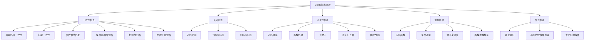
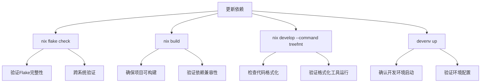
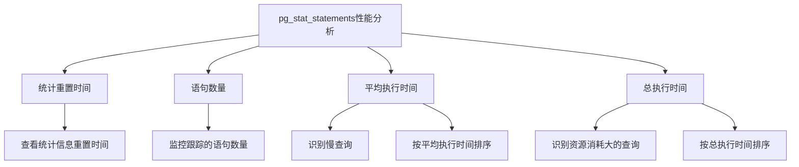

# 代码质量与最佳实践

<cite>
**本文档引用的文件**  
- [.credo.exs](file://.credo.exs)
- [.formatter.exs](file://.formatter.exs)
- [treefmt.toml](file://treefmt.toml)
- [flake.nix](file://flake.nix)
- [flake.lock](file://flake.lock)
- [nix/flake-modules/checks.nix](file://nix/flake-modules/checks.nix)
- [nix/flake-modules/formatter.nix](file://nix/flake-modules/formatter.nix)
- [nix/flake-modules/devenv.nix](file://nix/flake-modules/devenv.nix)
- [nix/flake-modules/package.nix](file://nix/flake-modules/package.nix)
- [nix/module.nix](file://nix/module.nix)
- [mix.exs](file://mix.exs)
- [lib/teslamate/custom_expressions.ex](file://lib/teslamate/custom_expressions.ex)
- [priv/repo/migrations/20191020130234_increase_datetime_precision.exs](file://priv/repo/migrations/20191020130234_increase_datetime_precision.exs)
- [website/docs/development.mdx](file://website/docs/development.mdx)
- [grafana/dashboards/database-info.json](file://grafana/dashboards/database-info.json)
</cite>

## 目录
1. [代码质量保障体系](#代码质量保障体系)
2. [静态分析与代码格式化](#静态分析与代码格式化)
3. [Nix Flake完整性检查流程](#nix-flake完整性检查流程)
4. [Grafana仪表板SQL查询优化](#grafana仪表板sql查询优化)
5. [关键依赖的哈希验证](#关键依赖的哈希验证)

## 代码质量保障体系

TeslaMate项目建立了一套完整的代码质量保障体系，通过Credo静态分析、mix format代码格式化、treefmt统一格式化工具以及Nix Flake的完整性检查，确保代码质量和项目稳定性。该体系涵盖了从代码编写到依赖管理的各个方面，为项目的长期维护和发展提供了坚实的基础。

**代码质量保障体系的核心组件包括：**
- **Credo静态分析工具**：用于检测代码中的潜在问题和不一致
- **mix format代码格式化**：确保Elixir代码风格的一致性
- **treefmt统一格式化工具**：集成多种格式化工具，统一整个项目的代码风格
- **Nix Flake完整性检查**：确保依赖更新时的系统完整性
- **pg_stat_statements性能分析**：监控和优化SQL查询性能

这些工具和流程共同构成了TeslaMate项目的质量保障框架，确保了代码的可维护性和系统的稳定性。

## 静态分析与代码格式化

TeslaMate项目采用多层次的代码质量检查和格式化策略，确保代码的一致性和可读性。

### Credo静态分析配置

Credo是Elixir生态系统中广泛使用的静态代码分析工具。TeslaMate项目的`.credo.exs`配置文件定义了详细的检查规则，涵盖了代码一致性、设计、可读性和重构机会等多个方面。



**Credo配置特点：**
- **严格模式**：配置中`strict: false`，采用较为宽松的检查策略
- **自定义优先级**：为不同检查项设置优先级，如`Credo.Check.Design.AliasUsage`设置为低优先级
- **禁用检查**：部分检查被明确禁用，如`Credo.Check.Design.DuplicatedCode`
- **超时设置**：解析文件的超时时间为5000毫秒

**Diagram sources**
- [.credo.exs](file://.credo.exs#L1-L217)

**Section sources**
- [.credo.exs](file://.credo.exs#L1-L217)
- [mix.exs](file://mix.exs#L72)

### mix format代码格式化规范

TeslaMate项目使用Elixir内置的`mix format`工具进行代码格式化，确保代码风格的一致性。`.formatter.exs`配置文件定义了格式化的输入范围和插件。

```elixir
[
  import_deps: [:ecto, :phoenix, :phoenix_live_view, :tesla],
  inputs: ["*.{heex,ex,exs}", "priv/*/seeds.exs", "{config,lib,test}/**/*.{heex,ex,exs}"],
  plugins: [Phoenix.LiveView.HTMLFormatter],
  subdirectories: ["priv/*/migrations"]
]
```

**mix format配置要点：**
- **依赖导入**：从`:ecto`, `:phoenix`, `:phoenix_live_view`, `:tesla`等依赖中导入格式化配置
- **输入范围**：涵盖项目根目录、config、lib、test目录下的所有相关文件
- **插件支持**：使用`Phoenix.LiveView.HTMLFormatter`处理HEEX模板文件
- **子目录支持**：包含迁移文件目录`priv/*/migrations`

**Section sources**
- [.formatter.exs](file://.formatter.exs#L1-L7)

### treefmt统一格式化工具集成

TeslaMate项目采用treefmt作为统一的代码格式化工具，集成多种格式化工具，确保整个项目代码风格的一致性。`treefmt.toml`配置文件定义了各种格式化工具的使用规则。

```toml
[global]
excludes = [
    "*.gitignore",
    "*.dockerignore",
    ".envrc",
    "CONTRIBUTING",
    "Dockerfile",
    "Makefile",
    "LICENSE",
    "treefmt.toml",
    "grafana/dashboards/*.json"
]

[formatter.mix-format]
command = "mix"
includes = ["*.ex", "*.exs" ,"*.{heex,eex}"]
options = ["format"]

[formatter.shellcheck]
command = "shellcheck"
includes = ["*.sh"]
priority = 0

[formatter.shfmt]
command = "shfmt"
options = ["-s", "-w"]
includes = ["*.sh"]
priority = 1

[formatter.prettier]
command = "prettier"
includes = ["*.cjs", "*.css", "*.html", "*.js", "*.json", "*.md", "*.scss", "*.ts", "*.tsx", "*.vue", "*.yaml", "*.yml"]
options = ["--write"]

[formatter.nixfmt]
command = "nixfmt"
includes = ["*.nix"]
options = []
```

**treefmt配置特点：**
- **全局排除**：定义了多种文件类型的排除规则，如Git忽略文件、Docker文件、许可证文件等
- **多工具集成**：集成了mix format、shellcheck、shfmt、prettier、nixfmt等多种格式化工具
- **优先级设置**：为不同格式化工具设置执行优先级，如shellcheck优先级为0，shfmt优先级为1
- **Grafana仪表板例外**：排除了Grafana仪表板JSON文件，因为它们使用Grafana导出风格

**Diagram sources**
- [treefmt.toml](file://treefmt.toml#L1-L64)
- [nix/flake-modules/formatter.nix](file://nix/flake-modules/formatter.nix#L1-L68)

**Section sources**
- [treefmt.toml](file://treefmt.toml#L1-L64)
- [nix/flake-modules/formatter.nix](file://nix/flake-modules/formatter.nix#L1-L68)

## Nix Flake完整性检查流程

TeslaMate项目使用Nix Flake作为依赖管理和构建系统，确保开发环境的一致性和可重现性。当更新依赖时，需要执行一系列完整性检查，确保系统的稳定性和安全性。

### Nix Flake依赖管理

Nix Flake通过`flake.nix`和`flake.lock`文件管理项目依赖。`flake.nix`定义了项目的输入依赖，而`flake.lock`则锁定这些依赖的具体版本和哈希值。

```nix
{
  description = "TeslaMate Logger";

  inputs = {
    nixpkgs.url = "github:NixOS/nixpkgs/nixos-25.05";
    flake-parts.url = "github:hercules-ci/flake-parts";
    flake-parts.inputs.nixpkgs-lib.follows = "nixpkgs";
    devenv-root.url = "file+file:///dev/null";
    devenv-root.flake = false;
    devenv.url = "github:cachix/devenv";
    treefmt-nix.url = "github:numtide/treefmt-nix";
    treefmt-nix.inputs.nixpkgs.follows = "nixpkgs";
  };

  outputs = inputs@{ self, flake-parts, ... }:
    flake-parts.lib.mkFlake { inherit inputs; } {
      flake.nixosModules.default = import ./nix/module.nix { inherit self; };

      systems = [
        "x86_64-linux"
        "aarch64-linux"
        "x86_64-darwin"
        "aarch64-darwin"
      ];

      imports = [
        ./nix/flake-modules/checks.nix
        ./nix/flake-modules/devenv.nix
        ./nix/flake-modules/formatter.nix
        ./nix/flake-modules/package.nix
      ];
    };
}
```

**Nix Flake配置要点：**
- **输入依赖**：定义了nixpkgs、flake-parts、devenv、treefmt-nix等核心依赖
- **系统支持**：支持x86_64-linux、aarch64-linux、x86_64-darwin、aarch64-darwin四种系统架构
- **模块导入**：导入了checks、devenv、formatter、package等Nix模块
- **版本锁定**：通过flake.lock文件锁定所有依赖的具体版本和哈希值

**Diagram sources**
- [flake.nix](file://flake.nix#L1-L35)
- [flake.lock](file://flake.lock#L1-L281)

**Section sources**
- [flake.nix](file://flake.nix#L1-L35)
- [flake.lock](file://flake.lock#L1-L281)

### 依赖更新检查流程

当更新项目依赖时，需要执行一系列检查以确保系统的完整性和稳定性。根据`website/docs/development.mdx`文档，更新依赖时应执行以下步骤：



**依赖更新检查步骤：**
1. **nix flake check**：验证Flake的完整性，确保在不同系统上的兼容性
2. **nix build**：确保项目能够成功构建，验证新依赖的兼容性
3. **nix develop --command treefmt**：检查代码格式化是否正常运行
4. **devenv up**：确认开发环境能够正常启动，验证环境配置的正确性

这些检查步骤确保了依赖更新不会破坏项目的构建和运行环境，维护了系统的稳定性和可维护性。

**Section sources**
- [website/docs/development.mdx](file://website/docs/development.mdx#L221-L228)

## Grafana仪表板SQL查询优化

TeslaMate项目通过Grafana仪表板提供丰富的数据可视化功能，其中SQL查询的性能优化至关重要。项目采用了多种优化策略，包括时间戳处理优化和pg_stat_statements性能分析工具的使用。

### 时间戳处理优化

TeslaMate项目在数据库迁移中对时间戳精度进行了优化，提高了数据记录的精确度。`20191020130234_increase_datetime_precision.exs`迁移文件将多个表的时间戳字段从`:utc_datetime`升级为`:utc_datetime_usec`，增加了微秒级精度。

```elixir
defmodule TeslaMate.Repo.Migrations.IncreaseDatetimePrecision do
  use Ecto.Migration

  def change do
    alter table(:charging_processes) do
      modify(:start_date, :utc_datetime_usec, from: :utc_datetime)
      modify(:end_date, :utc_datetime_usec, from: :utc_datetime)
    end

    alter table(:drives) do
      modify(:start_date, :utc_datetime_usec, from: :utc_datetime)
      modify(:end_date, :utc_datetime_usec, from: :utc_datetime)
    end

    alter table(:states) do
      modify(:start_date, :utc_datetime_usec, from: :utc_datetime)
      modify(:end_date, :utc_datetime_usec, from: :utc_datetime)
    end

    alter table(:updates) do
      modify(:start_date, :utc_datetime_usec, from: :utc_datetime)
      modify(:end_date, :utc_datetime_usec, from: :utc_datetime)
    end

    alter table(:charges) do
      modify(:date, :utc_datetime_usec, from: :utc_datetime)
    end

    alter table(:positions) do
      modify(:date, :utc_datetime_usec, from: :utc_datetime)
    end
  end
end
```

**时间戳优化要点：**
- **精度提升**：从毫秒级精度提升到微秒级精度，提高了数据记录的精确度
- **多表应用**：在charging_processes、drives、states、updates、charges、positions等多个关键表上应用
- **无缝迁移**：使用Ecto Migration的`from`参数实现无缝迁移，不影响现有数据

**Section sources**
- [priv/repo/migrations/20191020130234_increase_datetime_precision.exs](file://priv/repo/migrations/20191020130234_increase_datetime_precision.exs#L1-L33)

### 自定义SQL表达式

TeslaMate项目定义了多个自定义SQL表达式，用于简化复杂的SQL查询。`lib/teslamate/custom_expressions.ex`文件中定义了多个宏，如`duration_min`用于计算两个时间戳之间的分钟数。

```elixir
defmodule TeslaMate.CustomExpressions do
  import Ecto.Query, warn: false

  defmacro c_if(condition, do: do_clause, else: else_clause) do
    quote do
      fragment(
        "CASE WHEN ? THEN ? ELSE ? END",
        unquote(condition),
        unquote(do_clause),
        unquote(else_clause)
      )
    end
  end

  defmacro duration_min(a, b) do
    quote do
      fragment(
        "(EXTRACT(EPOCH FROM (?::timestamp - ?::timestamp)) / 60)::integer",
        unquote(a),
        unquote(b)
      )
    end
  end

  defmacro nullif(a, b) do
    quote do
      fragment("NULLIF(?, ?)", unquote(a), unquote(b))
    end
  end

  defmacro round(v, s) do
    quote do
      fragment("ROUND((?)::numeric, ?)::float8", unquote(v), unquote(s))
    end
  end

  defmacro within_geofence?(position, geofence, direction \\ :right)
end
```

**自定义表达式功能：**
- **条件表达式**：`c_if`宏提供类似SQL CASE WHEN的条件逻辑
- **时间差计算**：`duration_min`宏计算两个时间戳之间的分钟数
- **空值处理**：`nullif`宏实现NULLIF函数功能
- **数值舍入**：`round`宏实现数值舍入功能
- **地理围栏**：`within_geofence?`宏判断位置是否在地理围栏内

**Section sources**
- [lib/teslamate/custom_expressions.ex](file://lib/teslamate/custom_expressions.ex#L1-L37)

### pg_stat_statements性能分析

TeslaMate项目通过Grafana仪表板集成了pg_stat_statements性能分析工具，用于监控和优化SQL查询性能。`grafana/dashboards/database-info.json`仪表板包含了多个与pg_stat_statements相关的面板。



**pg_stat_statements查询示例：**
- **按平均执行时间排序**：
```sql
SELECT query, calls, mean_exec_time, total_exec_time FROM pg_stat_statements ORDER BY mean_exec_time DESC LIMIT 10;
```
- **按调用次数排序**：
```sql
SELECT query, calls, mean_exec_time, total_exec_time FROM pg_stat_statements ORDER BY calls DESC LIMIT 10;
```

**性能分析要点：**
- **慢查询识别**：通过按平均执行时间排序，识别执行最慢的SQL语句
- **高频查询识别**：通过按调用次数排序，识别执行最频繁的SQL语句
- **资源消耗分析**：通过总执行时间分析，识别消耗最多资源的查询
- **实时监控**：在Grafana仪表板中实时显示性能数据，便于及时发现和解决问题

**Section sources**
- [website/docs/development.mdx](file://website/docs/development.mdx#L200-L208)
- [grafana/dashboards/database-info.json](file://grafana/dashboards/database-info.json#L1212-L1756)

## 关键依赖的哈希验证

TeslaMate项目对关键依赖进行了严格的哈希验证，确保依赖的完整性和安全性。`nix/flake-modules/package.nix`文件中定义了cldr等关键依赖的哈希值。

```nix
cldr = pkgs.fetchFromGitHub {
  owner = "elixir-cldr";
  repo = "cldr";
  rev = "v2.42.0";
  sha256 = "sha256-FLGUKfAKAKL2nqf/7YXQuuuEvVuSy2RVhZves9XOI1Q=";
  # sha256 = pkgs.lib.fakeHash;
};
```

**哈希验证要点：**
- **GitHub源**：从GitHub获取cldr依赖
- **版本锁定**：指定具体版本`v2.42.0`
- **SHA256哈希**：使用SHA256哈希值验证下载内容的完整性
- **安全保证**：确保下载的依赖未被篡改，维护系统的安全性

这种严格的哈希验证机制确保了项目依赖的可靠性和安全性，防止了潜在的安全风险。

**Section sources**
- [nix/flake-modules/package.nix](file://nix/flake-modules/package.nix#L50-L56)