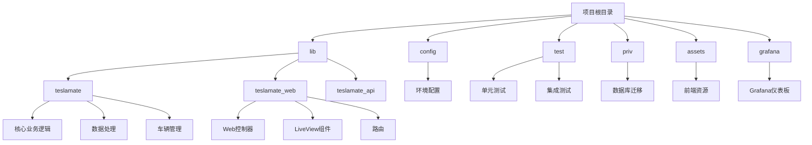
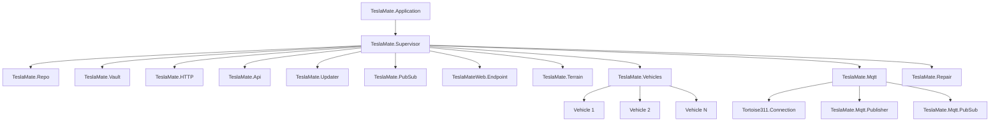
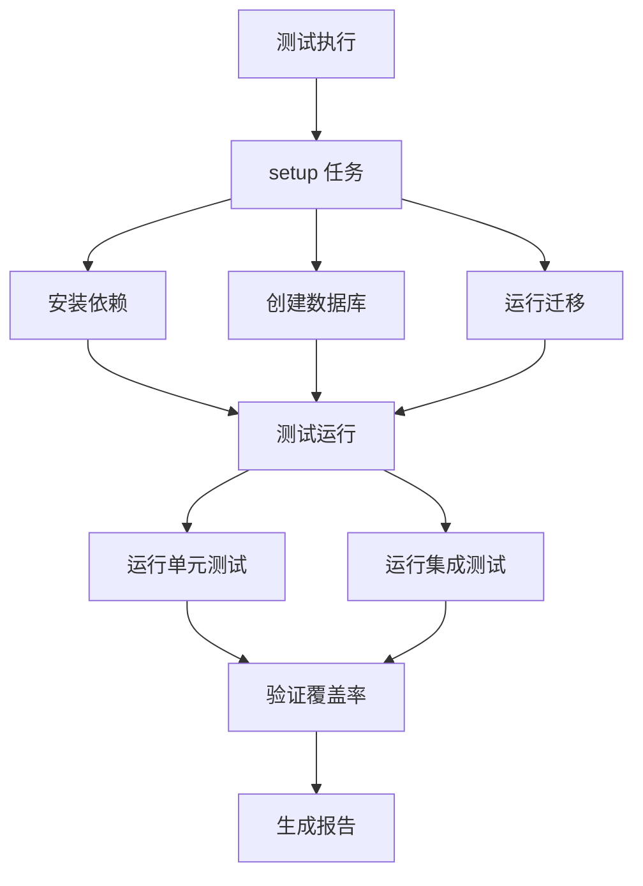

# 开发与贡献

<cite>
**本文档引用的文件**
- [README.md](file://README.md)
- [CONTRIBUTING](file://CONTRIBUTING)
- [mix.exs](file://mix.exs)
- [lib/teslamate/application.ex](file://lib/teslamate/application.ex)
- [config/config.exs](file://config/config.exs)
- [test/test_helper.exs](file://test/test_helper.exs)
- [lib/teslamate_web/endpoint.ex](file://lib/teslamate_web/endpoint.ex)
- [lib/teslamate/repo.ex](file://lib/teslamate/repo.ex)
- [lib/teslamate/mqtt.ex](file://lib/teslamate/mqtt.ex)
- [lib/teslamate/vehicles.ex](file://lib/teslamate/vehicles.ex)
- [lib/teslamate/api.ex](file://lib/teslamate/api.ex)
- [lib/teslamate/updater.ex](file://lib/teslamate/updater.ex)
- [lib/teslamate/import.ex](file://lib/teslamate/import.ex)
- [lib/teslamate_web/router.ex](file://lib/teslamate_web/router.ex)
- [lib/teslamate_web/controllers/car_controller.ex](file://lib/teslamate_web/controllers/car_controller.ex)
- [lib/teslamate_web/controllers/drive_controller.ex](file://lib/teslamate_web/controllers/drive_controller.ex)
- [.credo.exs](file://.credo.exs)
</cite>

## 目录
1. [简介](#简介)
2. [项目结构](#项目结构)
3. [核心组件](#核心组件)
4. [Elixir/OTP架构设计](#elixirot-架构设计)
5. [测试策略](#测试策略)
6. [代码风格与质量检查](#代码风格与质量检查)
7. [本地开发环境设置](#本地开发环境设置)
8. [贡献流程](#贡献流程)

## 简介
TeslaMate 是一个功能强大的自托管特斯拉车辆数据记录器，使用 Elixir 语言开发。该项目旨在高精度记录车辆数据，同时最小化对车辆的"吸血"影响。系统通过与特斯拉API交互获取车辆状态，将数据存储在PostgreSQL数据库中，并通过Grafana进行可视化分析。此外，车辆数据还会发布到本地MQTT代理，便于与其他智能家居系统（如Home Assistant）集成。

本指南旨在为开发者提供全面的技术文档，涵盖代码结构、测试策略、贡献流程以及Elixir/OTP架构设计等关键方面。通过本指南，开发者可以深入了解TeslaMate的内部工作机制，快速搭建开发环境，并遵循既定的规范参与项目贡献。

## 项目结构
TeslaMate 项目采用典型的Elixir应用结构，遵循MVC（模型-视图-控制器）设计模式。项目根目录包含配置文件、依赖管理文件和构建脚本。`lib`目录是核心代码所在，分为`teslamate`（业务逻辑）、`teslamate_web`（Web界面）和`teslamate_api`（外部API封装）三个主要模块。`config`目录包含不同环境的配置文件，`test`目录存放所有测试代码，`priv`目录包含数据库迁移脚本和静态资源。

**图示来源**
- [lib/teslamate/application.ex](file://lib/teslamate/application.ex#L6-L36)
- [config/config.exs](file://config/config.exs#L1-L30)

## 核心组件
TeslaMate 的核心功能由多个Elixir模块协同实现。`TeslaMate.Application`作为应用的主入口，负责启动和监督所有子进程。`TeslaMate.Repo`模块封装了与PostgreSQL数据库的交互，使用Ecto框架进行数据持久化。`TeslaMate.Api`模块负责与特斯拉官方API通信，处理认证、数据获取和错误恢复。`TeslaMate.Vehicles`模块管理所有注册车辆的生命周期，为每辆车创建独立的监督进程。`TeslaMate.Mqtt`模块实现MQTT协议，将车辆数据实时发布到消息代理。`TeslaMate.Updater`模块定期检查GitHub上的新版本，提醒用户更新。

**组件来源**
- [lib/teslamate/application.ex](file://lib/teslamate/application.ex)
- [lib/teslamate/repo.ex](file://lib/teslamate/repo.ex)
- [lib/teslamate/api.ex](file://lib/teslamate/api.ex)
- [lib/teslamate/vehicles.ex](file://lib/teslamate/vehicles.ex)
- [lib/teslamate/mqtt.ex](file://lib/teslamate/mqtt.ex)
- [lib/teslamate/updater.ex](file://lib/teslamate/updater.ex)

## Elixir/OTP架构设计
TeslaMate 充分利用了Elixir语言和OTP（Open Telecom Platform）框架的强大功能，构建了一个高可靠、可扩展的分布式系统。系统采用监督树（Supervision Tree）架构，以`TeslaMate.Application`为根节点，其下管理着多个关键子系统，包括数据库连接、HTTP服务、车辆管理器、MQTT客户端等。每个子系统都由一个监督进程管理，当子进程异常退出时，监督进程会根据预设策略自动重启，确保系统的高可用性。

**图示来源**
- [lib/teslamate/application.ex](file://lib/teslamate/application.ex#L6-L36)
- [lib/teslamate/vehicles.ex](file://lib/teslamate/vehicles.ex#L2-L143)
- [lib/teslamate/mqtt.ex](file://lib/teslamate/mqtt.ex#L2-L65)

### 进程通信模式
TeslaMate 使用多种进程通信模式来协调不同组件之间的交互。GenServer 模式被广泛用于需要维护状态的长期运行进程，如`TeslaMate.Api`和`TeslaMate.Updater`。这些进程通过同步调用（call）和异步消息（cast）与其他进程通信。对于车辆管理，系统采用了监督者-工作者（Supervisor-Worker）模式，`TeslaMate.Vehicles`作为监督者为每辆车创建一个`Vehicle`进程。当车辆数据需要在不同模块间共享时，系统使用Phoenix PubSub进行发布-订阅模式的通信，例如车辆状态更新会通过PubSub广播给所有监听者。

## 测试策略
TeslaMate 采用全面的测试策略来确保代码质量和系统稳定性。测试代码位于`test`目录下，分为单元测试和集成测试。单元测试主要验证单个函数或模块的逻辑正确性，而集成测试则关注多个组件协同工作的场景。项目使用ExUnit作为测试框架，并通过ExCoveralls收集测试覆盖率数据。测试辅助模块（位于`test/support`）提供了模拟外部依赖（如API、数据库）的工具，使得测试可以在隔离环境中运行。

**图示来源**
- [mix.exs](file://mix.exs#L76-L83)
- [test/test_helper.exs](file://test/test_helper.exs#L1-L17)

### 测试框架使用
项目通过`mix test`命令运行测试，并在`mix.exs`文件中定义了`ci`别名，用于在持续集成环境中执行格式检查、依赖验证和测试。测试代码遵循Elixir社区的最佳实践，使用`describe`块组织相关测试用例，并通过`assert`和`refute`宏进行断言。对于需要模拟外部服务的测试，项目使用`mock`库来替换真实的API调用，确保测试的可重复性和速度。此外，`test/support/mocks`目录提供了预定义的模拟模块，简化了测试代码的编写。

**测试来源**
- [mix.exs](file://mix.exs#L76-L83)
- [test/test_helper.exs](file://test/test_helper.exs)
- [test/support/mocks](file://test/support/mocks)

## 代码风格与质量检查
TeslaMate 严格遵守Elixir社区的代码风格指南，并使用Credo等静态分析工具来保证代码质量。项目根目录下的`.credo.exs`文件定义了代码检查规则，包括代码复杂度、命名规范、注释要求等。开发者在提交代码前应运行`mix credo`命令，确保代码符合项目标准。此外，项目还使用Dialyxir进行类型检查，帮助发现潜在的类型错误。代码格式化通过`.formatter.exs`文件配置，确保所有贡献者的代码风格一致。

**代码质量来源**
- [.credo.exs](file://.credo.exs)
- [.formatter.exs](file://.formatter.exs)
- [mix.exs](file://mix.exs#L71-L72)

## 本地开发环境设置
要设置TeslaMate的本地开发环境，首先需要安装Elixir 1.12+、Erlang OTP 23+、PostgreSQL 10+和Node.js 12+。克隆项目仓库后，通过`mix setup`命令安装所有依赖并初始化数据库。该命令会自动执行`deps.get`、`ecto.setup`和前端资源安装。启动开发服务器使用`mix phx.server`命令，应用将在`localhost:4000`上运行。对于测试，可以使用`mix test`运行所有测试用例，或使用`mix test.watch`在文件更改时自动重新运行测试。

**开发环境来源**
- [mix.exs](file://mix.exs#L76-L83)
- [README.md](file://README.md#L1-L88)

## 贡献流程
TeslaMate 鼓励社区贡献，并提供了清晰的贡献流程。开发者应在`main`分支基础上创建新的功能分支，完成开发后提交Pull Request。代码审查重点关注代码质量、性能影响和向后兼容性。项目使用GitHub Actions进行持续集成，所有PR必须通过CI检查才能合并。版本发布遵循语义化版本控制，主要版本更新包含重大变更，次要版本添加新功能，补丁版本修复错误。详细的贡献指南可在项目文档中找到。

**贡献来源**
- [CONTRIBUTING](file://CONTRIBUTING)
- [README.md](file://README.md#L82-L88)
- [mix.exs](file://mix.exs#L1-L114)