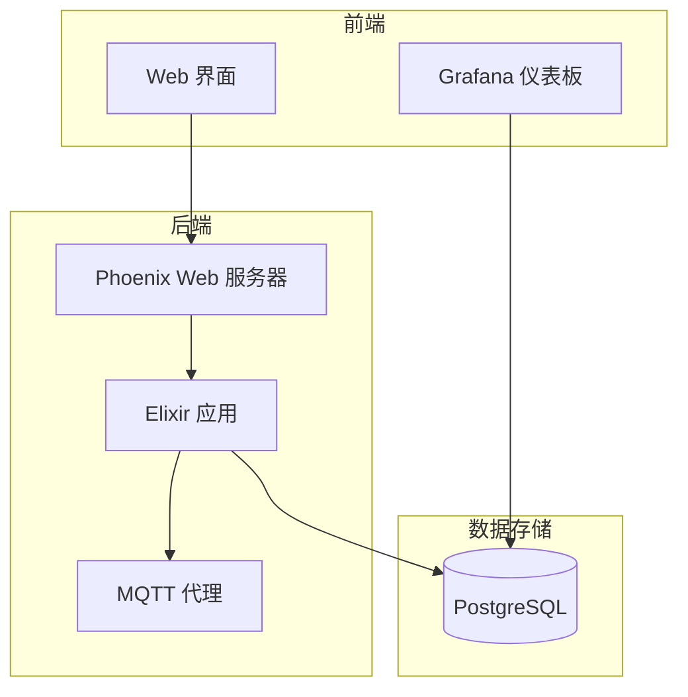
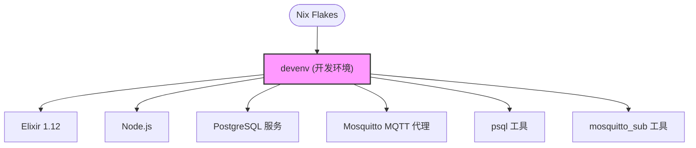
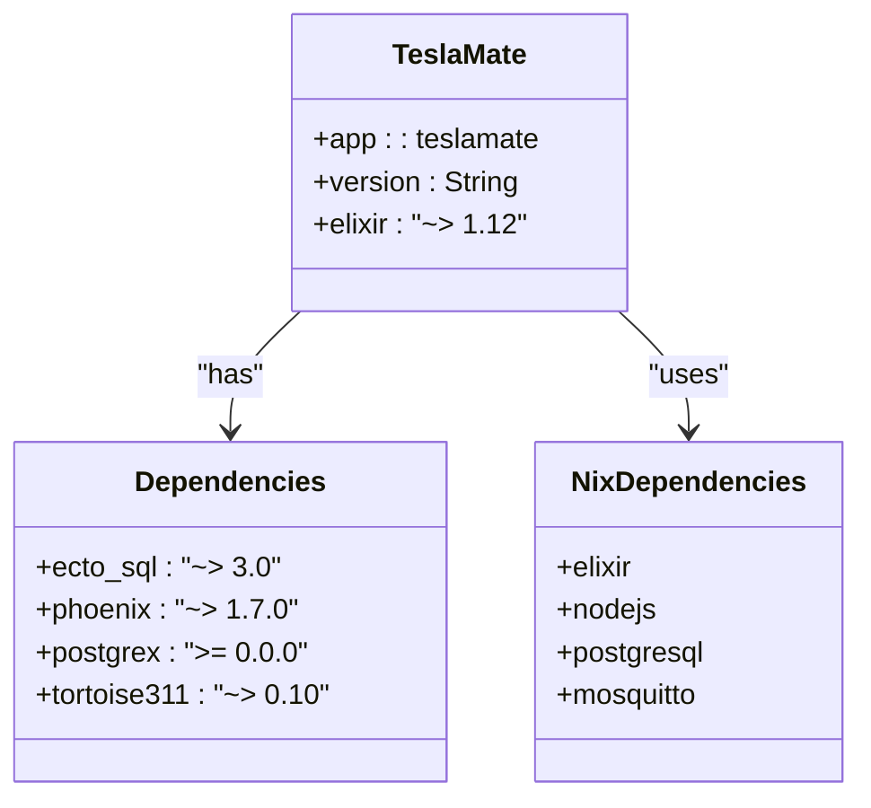

# 开发环境设置

<cite>
**本文档中引用的文件**  
- [README.md](file://README.md)
- [flake.nix](file://flake.nix)
- [nix/flake-modules/devenv.nix](file://nix/flake-modules/devenv.nix)
- [nix/module.nix](file://nix/module.nix)
- [config/config.exs](file://config/config.exs)
- [config/dev.exs](file://config/dev.exs)
- [config/test.exs](file://config/test.exs)
- [mix.exs](file://mix.exs)
- [assets/package.json](file://assets/package.json)
</cite>

## 目录
1. [简介](#简介)
2. [项目结构](#项目结构)
3. [核心组件](#核心组件)
4. [架构概述](#架构概述)
5. [详细组件分析](#详细组件分析)
6. [依赖分析](#依赖分析)
7. [性能考虑](#性能考虑)
8. [故障排除指南](#故障排除指南)
9. [结论](#结论)

## 简介
TeslaMate 是一个强大的自托管特斯拉车辆数据记录器，使用 Elixir 编写，数据存储在 PostgreSQL 数据库中，并通过 Grafana 进行可视化分析。车辆数据通过本地 MQTT 代理发布，支持与 Home Assistant、Node-RED 等系统的集成。本指南详细说明如何使用 Nix、devenv 和 direnv 设置本地开发环境，涵盖 Elixir、PostgreSQL、Node.js 和 MQTT 代理的安装与配置。

**Section sources**
- [README.md](file://README.md#L1-L88)

## 项目结构
TeslaMate 项目采用模块化结构，主要包含以下目录：
- `assets/`：前端资源文件，包括 CSS、JavaScript 和构建脚本
- `config/`：Elixir 应用的配置文件，包括开发、测试和生产环境配置
- `grafana/`：Grafana 仪表板配置和 Dockerfile
- `lib/`：Elixir 核心代码，包括 Tesla API 客户端、MQTT 处理、数据库模型等
- `nix/`：Nix 配置文件，用于环境管理和打包
- `priv/`：私有资源，包括数据库迁移脚本和静态文件
- `test/`：测试代码和测试辅助模块

**Section sources**
- [README.md](file://README.md#L1-L88)

## 核心组件
TeslaMate 的核心组件包括 Tesla API 客户端、PostgreSQL 数据库接口、MQTT 发布/订阅系统和 Phoenix Web 服务器。这些组件通过 Elixir 的 OTP 框架协同工作，实现车辆数据的采集、存储和分发。开发环境通过 Nix 和 devenv 进行管理，确保跨平台的一致性。

**Section sources**
- [config/config.exs](file://config/config.exs#L1-L30)
- [mix.exs](file://mix.exs#L1-L114)

## 架构概述
TeslaMate 采用分层架构，前端通过 Phoenix 框架提供 Web 界面，后端通过 Elixir GenServer 处理车辆数据流。数据持久化使用 Ecto ORM 与 PostgreSQL 交互，实时数据通过 MQTT 协议发布。Nix 用于声明式地定义开发环境，确保所有依赖项的一致性。

**Diagram sources**
- [config/config.exs](file://config/config.exs#L1-L30)
- [nix/module.nix](file://nix/module.nix#L1-L368)

## 详细组件分析

### Elixir 和 Mix 项目配置
TeslaMate 是一个 Elixir 应用，使用 Mix 作为构建工具。`mix.exs` 文件定义了项目依赖、别名和发布配置。`setup` 别名用于初始化开发环境，包括获取依赖、创建和迁移数据库。

**Section sources**
- [mix.exs](file://mix.exs#L1-L114)

### Nix 和 devenv 集成
Nix 通过 `flake.nix` 文件声明项目依赖，包括 Elixir、Node.js、PostgreSQL 和 Mosquitto。devenv 配置在 `nix/flake-modules/devenv.nix` 中定义，设置开发环境变量、服务和进程。

**Diagram sources**
- [flake.nix](file://flake.nix#L1-L35)
- [nix/flake-modules/devenv.nix](file://nix/flake-modules/devenv.nix#L1-L103)

### 数据库配置
开发环境使用 PostgreSQL 作为数据库，通过 `services.postgres` 在 devenv 中配置。数据库用户、密码和端口通过环境变量设置，初始脚本创建数据库和超级用户。

**Section sources**
- [nix/flake-modules/devenv.nix](file://nix/flake-modules/devenv.nix#L85-L96)
- [nix/module.nix](file://nix/module.nix#L231-L247)

### MQTT 代理配置
Mosquitto MQTT 代理在开发环境中作为进程运行，监听指定端口。环境变量 `MQTT_HOST` 和 `MQTT_PORT` 配置 Elixir 应用连接到代理。

**Section sources**
- [nix/flake-modules/devenv.nix](file://nix/flake-modules/devenv.nix#L78-L80)
- [config/runtime.exs](file://config/runtime.exs#L101-L133)

## 依赖分析
项目依赖通过 Nix Flakes 管理，确保所有开发人员使用相同的工具版本。Elixir 依赖在 `mix.exs` 中定义，前端依赖在 `assets/package.json` 中定义。Nix 还提供备份和恢复脚本，通过 `backup_and_restore.nix` 和 `maintenance.nix` 实现。

**Diagram sources**
- [mix.exs](file://mix.exs#L38-L73)
- [flake.nix](file://flake.nix#L4-L13)

## 性能考虑
开发环境配置考虑了性能优化，包括数据库连接池大小、HTTP 超时设置和文件描述符限制。PostgreSQL 版本检查确保使用受支持的数据库版本，避免兼容性问题。

**Section sources**
- [config/runtime.exs](file://config/runtime.exs#L118-L122)
- [lib/teslamate/database_check.ex](file://lib/teslamate/database_check.ex#L1-L75)

## 故障排除指南
常见问题包括数据库连接失败、MQTT 代理未启动和环境变量未设置。使用 devenv 提供的 `psql` 和 `mosquitto_sub` 工具可以验证服务状态。确保 `ENCRYPTION_KEY`、`DATABASE_PASS` 和 `RELEASE_COOKIE` 环境变量正确设置。

**Section sources**
- [nix/flake-modules/devenv.nix](file://nix/flake-modules/devenv.nix#L62-L70)
- [config/runtime.exs](file://config/runtime.exs#L101-L133)

## 结论
TeslaMate 的开发环境通过 Nix 和 devenv 实现了高度可重复和一致的配置。Elixir、PostgreSQL、Node.js 和 MQTT 代理的集成确保了完整的本地开发体验。使用 `mix setup` 命令可以快速初始化环境，而 Nix 的声明式配置保证了跨平台的一致性。