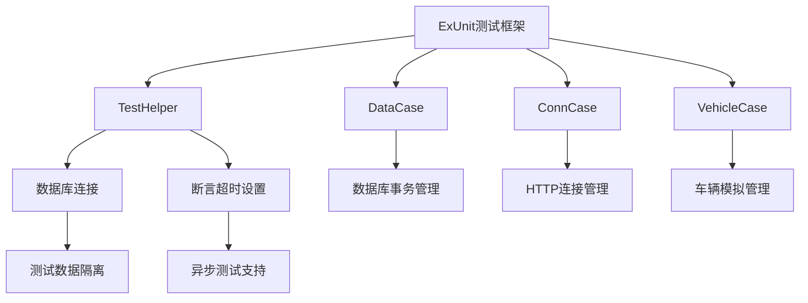
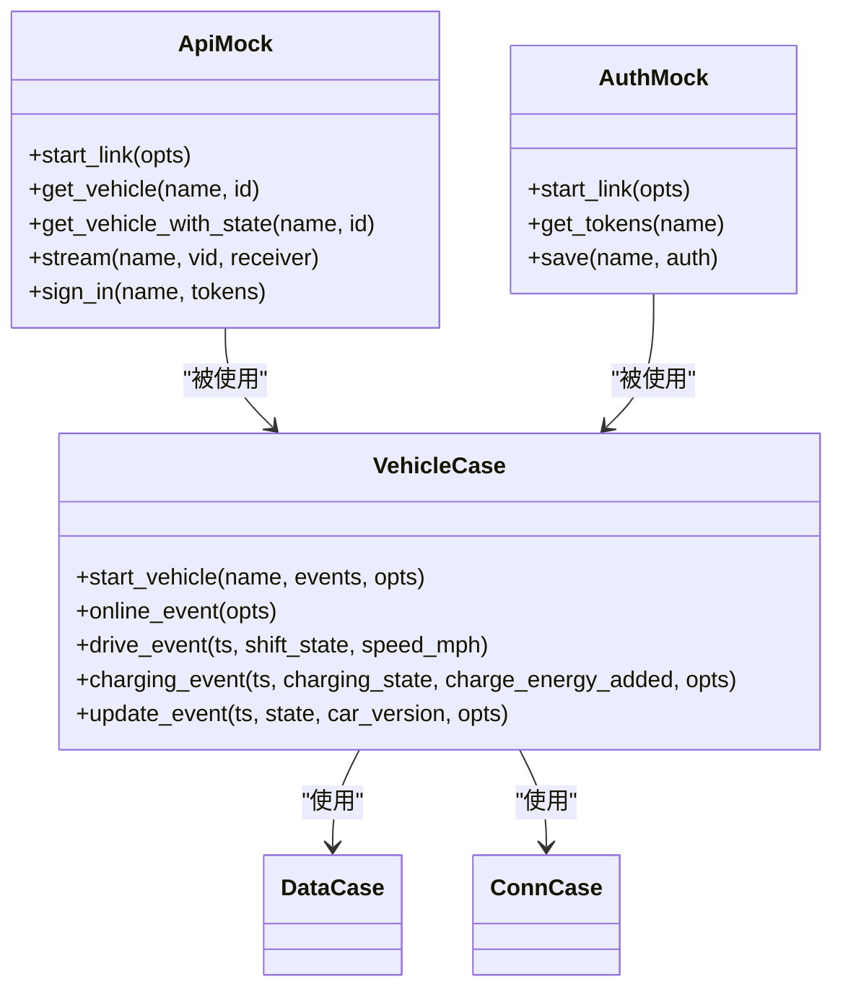
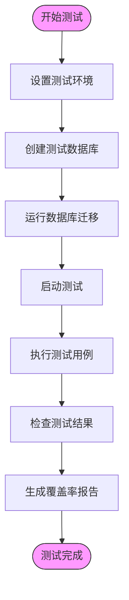
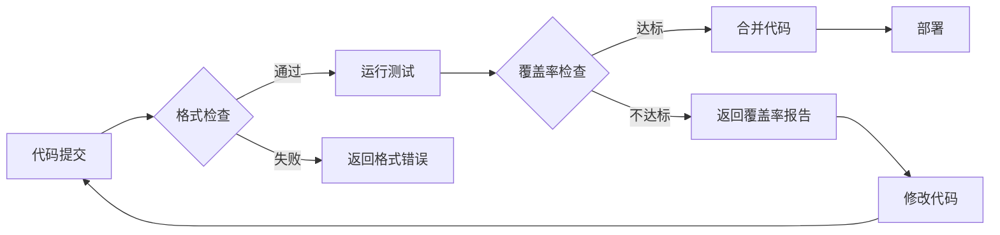

# 测试策略与实践

<cite>
**本文档中引用的文件**  
- [test_helper.exs](file://test/test_helper.exs)
- [data_case.ex](file://test/support/data_case.ex)
- [conn_case.ex](file://test/support/conn_case.ex)
- [vehicle_case.ex](file://test/support/vehicle_case.ex)
- [test_helper.ex](file://test/support/test_helper.ex)
- [api.ex](file://test/support/mocks/api.ex)
- [auth.ex](file://test/support/mocks/auth.ex)
- [mix.exs](file://mix.exs)
- [car_controller_test.exs](file://test/teslamate_web/controllers/car_controller_test.exs)
- [driving_test.exs](file://test/teslamate/vehicles/vehicle/driving_test.exs)
- [import_test.exs](file://test/teslamate/import_test.exs)
- [.formatter.exs](file://.formatter.exs)
- [Makefile](file://Makefile)
</cite>

## 目录
1. [测试框架架构](#测试框架架构)
2. [测试用例组织结构](#测试用例组织结构)
3. [运行测试套件](#运行测试套件)
4. [代码覆盖率与格式化验证](#代码覆盖率与格式化验证)
5. [编写新测试用例](#编写新测试用例)
6. [实用技巧](#实用技巧)

## 测试框架架构

TeslaMate的测试框架基于Elixir的ExUnit测试框架构建，采用分层架构支持单元测试、集成测试和模拟测试。测试框架通过不同的测试用例模板来支持不同类型的测试需求。

测试框架的核心是`ExUnit.CaseTemplate`，它允许定义可重用的测试上下文。项目中定义了多个测试用例模块，包括`DataCase`用于数据库访问测试，`ConnCase`用于HTTP连接测试，以及`VehicleCase`用于车辆相关功能的测试。

测试框架在启动时会加载TeslaMate应用并确保所有依赖应用都已启动。通过`Ecto.Adapters.SQL.Sandbox`模块，每个测试都在独立的数据库事务中运行，确保测试之间的隔离性。对于异步测试，使用共享模式；对于同步测试，则使用独占模式。

**测试框架来源**
- [test_helper.exs](file://test/test_helper.exs#L1-L17)
- [data_case.ex](file://test/support/data_case.ex#L1-L56)
- [conn_case.ex](file://test/support/conn_case.ex#L1-L57)

## 测试用例组织结构

### Support目录下的测试辅助模块

TeslaMate的测试辅助模块位于`test/support`目录下，包含多个关键组件。`test_helper.ex`模块提供了通用的测试辅助函数，如`eventually`宏用于处理异步断言，`decimal`宏用于创建Decimal结构。

`data_case.ex`模块为需要访问数据层的测试提供了设置，自动导入Ecto相关模块并处理数据库事务。`conn_case.ex`模块为需要建立HTTP连接的测试提供了支持，包括Phoenix连接测试工具和路由助手。

`vehicle_case.ex`是车辆相关测试的核心辅助模块，提供了`start_vehicle`函数来启动模拟车辆，以及各种事件生成函数如`online_event`、`drive_event`等。

### Mocks的使用方法

`test/support/mocks`目录包含了一系列模拟模块，用于在测试中替代外部依赖。这些模拟模块基于GenServer实现，可以捕获调用并返回预定义的响应。

`ApiMock`模块模拟Tesla API，可以预设一系列车辆状态事件，测试代码按顺序接收这些事件。`AuthMock`模块模拟认证服务，用于测试认证流程。其他模拟模块如`LogMock`、`SettingsMock`等分别模拟相应的服务。

模拟模块通过`start_supervised`启动，确保在测试结束时自动清理。测试代码可以通过`assert_receive`断言来验证模拟模块是否收到了预期的调用。

**测试用例组织来源**
- [test_helper.ex](file://test/support/test_helper.ex#L1-L22)
- [vehicle_case.ex](file://test/support/vehicle_case.ex#L1-L160)
- [api.ex](file://test/support/mocks/api.ex#L1-L56)
- [auth.ex](file://test/support/mocks/auth.ex#L1-L37)

## 运行测试套件

### 基本测试命令

运行TeslaMate测试套件的主要命令是`mix test`，该命令会执行所有测试文件。测试配置在`mix.exs`文件中定义，通过`aliases`配置了测试相关的快捷命令。

`mix test`命令会自动创建测试数据库、运行迁移，然后执行测试。为了提高测试效率，测试运行时使用`--no-start`参数，避免启动不必要的应用组件。

### CI测试命令

`mix ci`命令是为持续集成环境设计的测试命令，它不仅运行测试，还包括代码格式检查和未使用依赖检查。这个命令在CI/CD流水线中使用，确保代码质量和一致性。

`mix ci`命令执行以下操作：
1. 检查代码格式是否符合规范
2. 检查是否有未使用的依赖
3. 运行所有测试并启用异常中断模式

### 测试环境配置

测试环境的配置在`config/test.exs`文件中定义。数据库连接使用SQLite内存数据库，确保测试的快速执行和隔离性。断言超时时间可以通过环境变量`ELIXIR_ASSERT_TIMEOUT`进行配置，默认为300毫秒。

**运行测试套件来源**
- [mix.exs](file://mix.exs#L76-L83)
- [test_helper.exs](file://test/test_helper.exs#L15-L16)

## 代码覆盖率与格式化验证

### 代码覆盖率检查

TeslaMate使用ExCoveralls工具进行代码覆盖率检查。在`mix.exs`文件中配置了`test_coverage`选项，指定使用ExCoveralls作为覆盖率工具。

覆盖率报告可以通过以下命令生成：
- `mix coveralls`：生成文本格式的覆盖率报告
- `mix coveralls.html`：生成HTML格式的覆盖率报告
- `mix coveralls.github`：生成GitHub兼容的覆盖率报告

覆盖率检查集成在CI流程中，确保新代码达到一定的覆盖率标准。测试框架会自动收集覆盖率数据，并在测试结束后生成报告。

### 格式化验证

代码格式化验证通过`mix format`命令实现。`.formatter.exs`文件定义了代码格式化的规则，包括输入文件模式、插件和子目录配置。

`mix ci`命令包含`format --check-formatted`任务，用于检查代码是否符合格式规范。这个检查在CI/CD流水线中执行，确保所有提交的代码都遵循统一的格式标准。

格式化规则包括：
- Elixir代码文件（.ex, .exs）
- Phoenix模板文件（.heex）
- 数据库迁移文件
- 配置文件

**代码覆盖率与格式化验证来源**
- [mix.exs](file://mix.exs#L16-L23)
- [.formatter.exs](file://.formatter.exs#L1-L7)

## 编写新测试用例

### 单元测试编写

编写单元测试时，应使用适当的测试用例模板。对于数据层测试，使用`use TeslaMate.DataCase`；对于Web控制器测试，使用`use TeslaMateWeb.ConnCase`。

测试用例应遵循给定-当-然后（Given-When-Then）模式：
1. 给定：设置测试前提条件
2. 当：执行要测试的操作
3. 然后：验证预期结果

测试函数名应清晰描述测试场景，使用`test "描述性文本"`格式。对于相关测试，可以使用`describe`块进行分组。

### 集成测试编写

集成测试需要测试多个组件的协同工作。使用`vehicle_case.ex`中的辅助函数可以简化车辆相关功能的集成测试。

`start_vehicle`函数是集成测试的核心，它启动一个模拟车辆并连接所有必要的模拟服务。通过预设事件序列，可以测试车辆在不同状态下的行为。

事件序列应按时间顺序排列，每个事件代表车辆状态的一次变化。测试代码通过`assert_receive`断言来验证系统是否产生了预期的副作用。

### 模拟测试编写

模拟测试使用`test/support/mocks`目录中的模拟模块。通过`with_mock`宏可以临时替换模块的实现，或者直接启动模拟GenServer进程。

对于复杂的交互场景，可以在测试setup中启动多个模拟服务，并通过进程间消息进行协调。模拟模块会将接收到的调用转发给测试进程，便于验证调用参数和顺序。

**编写新测试用例来源**
- [car_controller_test.exs](file://test/teslamate_web/controllers/car_controller_test.exs#L1-L634)
- [driving_test.exs](file://test/teslamate/vehicles/vehicle/driving_test.exs#L1-L551)
- [import_test.exs](file://test/teslamate/import_test.exs#L1-L200)

## 实用技巧

### 使用测试夹具

测试夹具是预定义的测试数据和状态，可以简化测试设置。在TeslaMate中，可以通过创建辅助函数来实现测试夹具。

例如，创建`car_fixture`函数来创建预配置的车辆记录，避免在每个测试中重复相同的设置代码。对于复杂的测试场景，可以创建专门的夹具模块。

测试夹具应保持最小化，只包含必要的数据。避免创建过于复杂的夹具，这会使测试难以理解和维护。

### 调试测试失败

调试测试失败时，可以使用以下技巧：
1. 使用`@tag :capture_log`捕获日志输出，查看系统内部状态
2. 增加断言超时时间，使用`assert_receive ..., timeout`语法
3. 使用`IO.inspect`输出中间状态，但记得在提交前移除
4. 逐步简化测试场景，定位问题根源

对于异步测试问题，`eventually`宏非常有用，它会重试断言直到成功或达到最大尝试次数。

### 测试性能优化

为了提高测试性能，可以：
1. 将相关测试标记为`async: true`，允许并行执行
2. 重用数据库连接和事务
3. 使用内存数据库而不是磁盘数据库
4. 避免在测试中进行真实的网络请求

对于必须串行执行的测试，明确标记为`async: false`，并在文档中说明原因。

**实用技巧来源**
- [test_helper.ex](file://test/support/test_helper.ex#L2-L13)
- [car_controller_test.exs](file://test/teslamate_web/controllers/car_controller_test.exs#L59-L60)
- [driving_test.exs](file://test/teslamate/vehicles/vehicle/driving_test.exs#L2-L3)