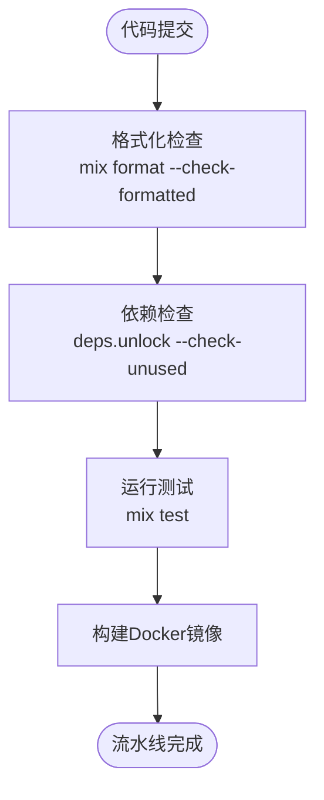
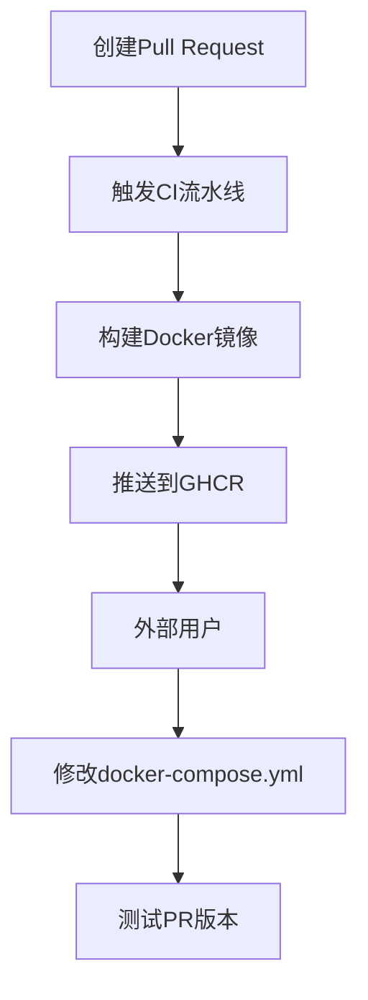

# 贡献流程与代码审查

<cite>
**本文档引用的文件**
- [CONTRIBUTING](file://CONTRIBUTING)
- [README.md](file://README.md)
- [Dockerfile](file://Dockerfile)
- [Makefile](file://Makefile)
- [mix.exs](file://mix.exs)
- [mix.lock](file://mix.lock)
- [config/config.exs](file://config/config.exs)
- [config/test.exs](file://config/test.exs)
- [website/docs/development.mdx](file://website/docs/development.mdx)
- [nix/flake-modules/checks.nix](file://nix/flake-modules/checks.nix)
- [flake.nix](file://flake.nix)
- [.dockerignore](file://.dockerignore)
- [CHANGELOG.md](file://CHANGELOG.md)
</cite>

## 目录
1. [简介](#简介)
2. [分支管理与提交规范](#分支管理与提交规范)
3. [Pull Request 创建要求](#pull-request-创建要求)
4. [代码审查标准](#代码审查标准)
5. [CI/CD 流水线验证](#cicd-流水线验证)
6. [外部贡献者测试 PR 版本](#外部贡献者测试-pr-版本)
7. [文档与变更日志](#文档与变更日志)

## 简介

TeslaMate 是一个强大的自托管特斯拉车辆数据记录器，使用 Elixir 编写，数据存储在 Postgres 数据库中，并通过 Grafana 进行可视化分析。本项目采用开源协作模式，欢迎社区成员贡献代码。为了确保代码质量和项目稳定性，TeslaMate 建立了一套完整的贡献流程，涵盖分支管理、代码提交、Pull Request 创建、代码审查以及持续集成/持续部署（CI/CD）验证等环节。本文档旨在系统阐述这一流程，为外部贡献者提供清晰的指导。

**Section sources**
- [README.md](file://README.md#L1-L88)

## 分支管理与提交规范

TeslaMate 项目的分支管理遵循标准的开源项目实践。主分支（main）始终代表最新的稳定版本，所有功能开发和错误修复都应在独立的特性分支（feature branch）或修复分支（fix branch）中进行。贡献者应从主分支创建新的分支，完成开发后提交 Pull Request 进行代码审查。在代码提交方面，项目要求所有提交必须遵循清晰的提交信息规范，确保每次变更的目的和内容都能被准确理解。提交信息应简洁明了，描述所做更改的具体内容，避免使用模糊或无关的描述。

**Section sources**
- [README.md](file://README.md#L4-L8)
- [CONTRIBUTING](file://CONTRIBUTING#L1-L4)

## Pull Request 创建要求

创建 Pull Request（PR）是贡献代码的核心步骤。在提交 PR 之前，贡献者必须确保其代码变更已经过充分的本地测试，并且符合项目的编码风格和质量标准。PR 的描述应详细说明所解决的问题、实现的功能以及相关的技术细节。如果 PR 涉及用户界面的更改，必须提供相应的截图以供审查。此外，PR 应明确指出是否需要更新文档或变更日志，并在必要时附上相关文件的修改建议。PR 的标题应准确反映其内容，便于维护者快速理解。

**Section sources**
- [website/docs/development.mdx](file://website/docs/development.mdx#L82-L88)

## 代码审查标准

代码审查是保证 TeslaMate 代码质量的关键环节。审查者将从多个维度评估 PR，包括代码的正确性、性能、可读性、可维护性以及与现有架构的一致性。审查重点包括：是否遵循 Elixir 最佳实践、错误处理是否完善、边界条件是否考虑周全、是否有潜在的性能瓶颈等。审查者还会检查代码是否引入了不必要的复杂性，是否可以通过更简洁的方式实现相同功能。此外，审查者会验证测试覆盖率，确保新代码有足够的单元测试和集成测试。审查过程是协作性的，审查者和贡献者应通过建设性的对话共同完善代码。

**Section sources**
- [mix.exs](file://mix.exs#L76-L84)

## CI/CD 流水线验证

TeslaMate 项目通过 GitHub Actions 实现了自动化的 CI/CD 流水线，确保每次代码变更都能得到及时验证。流水线包含多个关键步骤：首先是代码格式化检查，通过 `mix format --check-formatted` 命令确保所有 Elixir 代码符合项目规定的格式标准；其次是依赖项检查，使用 `deps.unlock --check-unused` 验证项目依赖的完整性，防止引入未使用的依赖；最后是自动化测试，执行 `mix test` 运行所有单元测试和集成测试，确保新代码不会破坏现有功能。此外，流水线还包括 Docker 镜像构建步骤，为每个 PR 自动构建 Docker 镜像，便于外部测试。

**Diagram sources**
- [mix.exs](file://mix.exs#L83)
- [Dockerfile](file://Dockerfile#L1-L81)

**Section sources**
- [mix.exs](file://mix.exs#L83)
- [Dockerfile](file://Dockerfile#L1-L81)
- [website/docs/development.mdx](file://website/docs/development.mdx#L84-L88)

## 外部贡献者测试 PR 版本

为了方便外部贡献者测试其 PR 的实际效果，TeslaMate 的 CI/CD 流水线会为每个 PR 自动构建 Docker 镜像，并推送到 GitHub Container Registry (GHCR)。外部用户可以通过修改本地的 `docker-compose.yml` 文件来测试这些 PR 版本。具体方法是将 TeslaMate 服务的镜像地址从默认的 `teslamate/teslamate:latest` 替换为 `ghcr.io/teslamate-org/teslamate:pr-{PR编号}`，其中 `{PR编号}` 是 Pull Request 的实际编号。同样，Grafana 服务的镜像也可以替换为 `ghcr.io/teslamate-org/teslamate/grafana:pr-{PR编号}`。通过这种方式，用户可以在生产环境中安全地预览和验证新功能。

**Diagram sources**
- [website/docs/development.mdx](file://website/docs/development.mdx#L90-L107)

**Section sources**
- [website/docs/development.mdx](file://website/docs/development.mdx#L89-L107)

## 文档与变更日志

文档更新和变更日志记录是贡献流程中不可或缺的部分。任何影响用户的功能变更或配置修改都必须伴随相应的文档更新。这包括但不限于：在 `website/docs` 目录下更新相关指南、添加新的配置选项说明、修正错误信息等。对于用户界面的更改，必须提供最新的截图以反映实际效果。此外，所有重要的功能添加、错误修复和重大变更都必须记录在 `CHANGELOG.md` 文件中。变更日志应遵循统一的格式，清晰地列出变更类型（新增、修复、改进等）、变更内容和相关 PR 编号，以便用户了解每个版本的具体变化。

**Section sources**
- [CHANGELOG.md](file://CHANGELOG.md)
- [website/docs/development.mdx](file://website/docs/development.mdx#L76-L81)