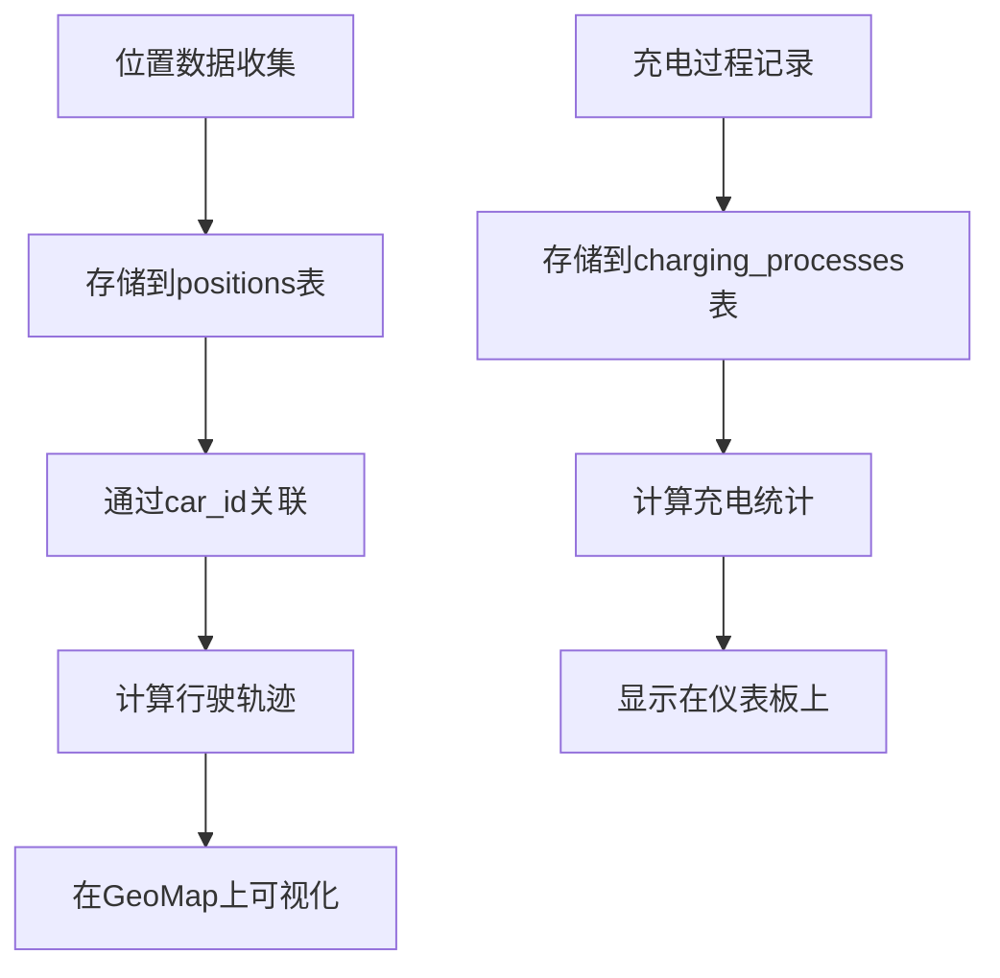
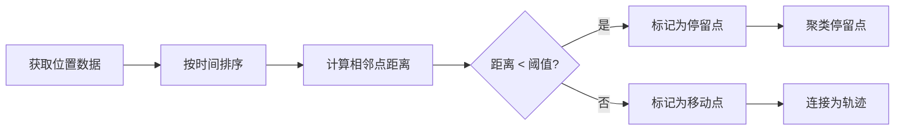
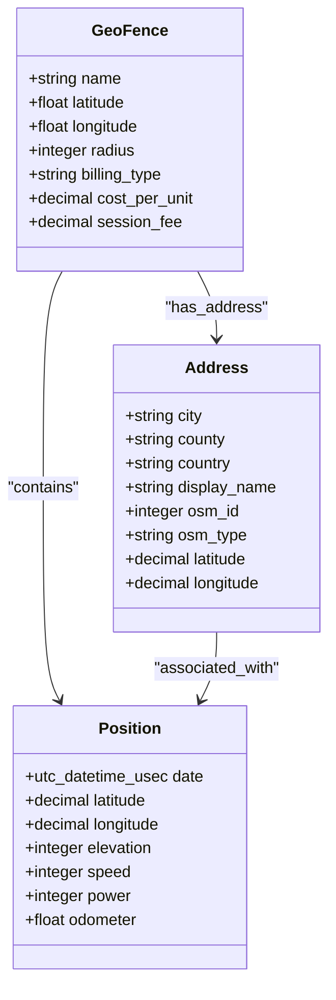

# 位置与地理围栏可视化

<cite>
**本文档引用的文件**   
- [locations.json](file://grafana/dashboards/locations.json)
- [visited.json](file://grafana/dashboards/visited.json)
- [home.json](file://grafana/dashboards/internal/home.json)
- [locations.ex](file://lib/teslamate/locations.ex)
- [geo_fence.ex](file://lib/teslamate/locations/geo_fence.ex)
- [position.ex](file://lib/teslamate/log/position.ex)
- [create_geofences.exs](file://priv/repo/migrations/20190810151901_create_geofences.exs)
- [create_geo_extensions.exs](file://priv/repo/migrations/20190925152807_create_geo_extensions.exs)
- [custom_expressions.ex](file://lib/teslamate/custom_expressions.ex)
</cite>

## 目录
1. [项目结构](#项目结构)
2. [地理位置展示](#地理位置展示)
3. [访问记录分析](#访问记录分析)
4. [家庭位置监控](#家庭位置监控)
5. [车辆轨迹与停留点可视化](#车辆轨迹与停留点可视化)
6. [地理围栏警报配置](#地理围栏警报配置)
7. [PostGIS空间查询应用](#postgis空间查询应用)
8. [大规模位置数据查询优化](#大规模位置数据查询优化)

## 项目结构

TeslaMate项目采用Elixir语言开发，结合PostgreSQL数据库和Grafana可视化工具，构建了一个完整的电动汽车数据监控系统。项目结构清晰地分为以下几个主要部分：

- **assets/**: 前端资源文件，包括CSS样式表、JavaScript脚本和构建配置
- **config/**: 应用程序配置文件，包含不同环境的配置设置
- **grafana/**: Grafana仪表板配置，包含多个JSON格式的仪表板定义
- **lib/**: 核心业务逻辑代码，采用Elixir模块化设计
- **priv/repo/migrations/**: 数据库迁移脚本，定义了数据表结构和变更
- **test/**: 单元测试和集成测试代码

其中，与位置数据可视化相关的关键组件主要集中在`grafana/dashboards/`目录下的JSON仪表板文件和`lib/teslamate/locations/`目录下的Elixir模块中。

**Section sources**
- [locations.json](file://grafana/dashboards/locations.json)
- [visited.json](file://grafana/dashboards/visited.json)
- [home.json](file://grafana/dashboards/internal/home.json)
- [locations.ex](file://lib/teslamate/locations.ex)

## 地理位置展示

`locations.json`仪表板提供了全面的地理位置统计信息，通过多个可视化组件展示车辆访问过的地址、城市、州和国家的分布情况。

该仪表板包含四个关键统计指标：
- **地址数量**: 显示在选定时间范围内访问过的唯一地址总数
- **城市数量**: 统计访问过的不同城市数量
- **州数量**: 统计访问过的不同州或省份数量
- **国家数量**: 统计访问过的不同国家数量

此外，仪表板还包含两个条形图，分别展示访问频率最高的10个城市和10个州。这些数据通过PostgreSQL查询从`addresses`表中获取，并与`drives`（行驶记录）和`charging_processes`（充电过程）表进行关联，以确定车辆在特定时间范围内的活动范围。

地理位置数据的展示不仅限于统计数字，还包括详细的地址列表，显示最近访问的位置，包括地址名称、城市信息以及关联的地理围栏（如果已配置）。

**Section sources**
- [locations.json](file://grafana/dashboards/locations.json#L1-L1189)
- [locations.ex](file://lib/teslamate/locations.ex#L1-L257)

## 访问记录分析

`visited.json`仪表板专注于车辆的访问历史记录，提供了一个综合的视图来分析车辆的移动模式和充电行为。

该仪表板的核心是一个地理地图组件，使用Grafana的GeoMap插件可视化车辆的行驶轨迹。地图上的路线由车辆在特定时间范围内的位置点连接而成，这些位置点来自`positions`表，通过`car_id`和时间过滤器进行筛选。

除了地图视图外，仪表板还提供以下关键信息：
- **行驶里程**: 在选定时间范围内车辆行驶的总里程数
- **充电统计**: 包括总充电能量、实际消耗能量和充电效率
- **充电成本**: 在选定时间范围内的总充电费用

这些数据通过复杂的SQL查询从数据库中提取，例如行驶里程的计算使用了`drives`表中的起始和结束里程数据，而充电统计则基于`charging_processes`表中的能量添加和使用数据。



**Diagram sources **
- [visited.json](file://grafana/dashboards/visited.json#L1-L560)
- [position.ex](file://lib/teslamate/log/position.ex#L1-L79)

## 家庭位置监控

`home.json`仪表板（位于`grafana/dashboards/internal/`目录）专门用于监控车辆在家庭位置的行为。这个内部仪表板提供了比公共仪表板更详细的视图，专注于家庭充电和车辆状态。

家庭位置监控的关键功能包括：
- **充电会话详细信息**: 显示在家庭位置进行的每次充电会话的开始时间、结束时间、充电量和充电速率
- **车辆状态变化**: 监控车辆在家庭位置时的状态变化，如从行驶到停放的转换
- **能量消耗模式**: 分析车辆在家庭位置的能耗模式，包括充电效率和能量损失

该仪表板利用地理围栏功能来识别车辆何时到达或离开家庭位置。当车辆进入配置为"家"的地理围栏区域时，系统会自动记录这一事件并触发相应的监控逻辑。

**Section sources**
- [home.json](file://grafana/dashboards/internal/home.json)
- [locations.ex](file://lib/teslamate/locations.ex#L163-L214)

## 车辆轨迹与停留点可视化

车辆轨迹的可视化是通过将时间序列的位置数据点连接起来实现的。每个位置点包含精确的经纬度坐标、时间戳以及其他车辆状态信息。

在`visited.json`仪表板中，GeoMap组件通过以下方式实现轨迹可视化：
1. 从`positions`表中查询指定车辆和时间范围内的位置数据
2. 按时间顺序对位置点进行排序
3. 将连续的位置点连接成行驶路线
4. 在地图上渲染路线和位置标记

停留点的识别基于位置数据的聚类分析。当车辆在某个地理位置停留超过一定时间阈值时，系统会将其识别为停留点。这通常通过分析连续位置记录的经纬度变化来实现——如果连续多个位置点的坐标差异很小，则认为车辆处于静止状态。



**Diagram sources **
- [visited.json](file://grafana/dashboards/visited.json#L166-L198)
- [position.ex](file://lib/teslamate/log/position.ex#L7-L39)

## 地理围栏警报配置

地理围栏功能允许用户定义虚拟边界来监控车辆的活动。在TeslaMate中，地理围栏的配置和管理通过`GeoFence`模块实现。

地理围栏的数据结构包含以下关键属性：
- **名称**: 地理围栏的标识名称（如"家"、"工作地点"）
- **经纬度**: 地理围栏中心点的坐标
- **半径**: 以米为单位的圆形区域半径
- **计费类型**: 支持按千瓦时(per_kwh)或按分钟(per_minute)的计费模式
- **费用参数**: 包括每单位成本和会话费

用户可以通过Web界面创建、编辑和删除地理围栏。当创建或更新地理围栏时，系统会自动重新计算受影响的行驶和充电记录，将它们与相应的地理围栏关联起来。

地理围栏警报的触发基于车辆位置与地理围栏区域的空间关系判断。系统定期检查车辆的最新位置是否进入或离开任何配置的地理围栏区域，并在状态变化时生成通知。

**Section sources**
- [geo_fence.ex](file://lib/teslamate/locations/geo_fence.ex#L1-L37)
- [create_geofences.exs](file://priv/repo/migrations/20190810151901_create_geofences.exs#L1-L19)

## PostGIS空间查询应用

TeslaMate利用PostgreSQL的PostGIS扩展来实现高效的空间查询和地理计算。系统通过`earthdistance`和`cube`扩展来支持地理位置相关的操作。

关键的空间查询功能包括：
- **距离计算**: 使用`earth_distance`函数计算两个地理位置之间的实际距离
- **区域判断**: 使用`earth_box`和`ll_to_earth`函数判断一个位置点是否在指定半径的圆形区域内
- **最近邻搜索**: 通过空间索引快速找到距离某个位置最近的地理围栏

在`custom_expressions.ex`模块中，定义了多个Ecto查询片段来封装这些空间操作：

```elixir
defmacro within_geofence?(position, geofence, direction \\ :right) do
  quote do
    fragment(
      """
      earth_box(ll_to_earth(?::numeric, ?::numeric), ?) @> ll_to_earth(?::numeric, ?::numeric) AND
      earth_distance(ll_to_earth(?::numeric, ?::numeric), ll_to_earth(?::numeric, ?::numeric)) < ?
      """,
      ^unquote(geofence).latitude,
      ^unquote(geofence).longitude,
      ^unquote(geofence).radius,
      unquote(position).latitude,
      unquote(position).longitude,
      ^unquote(geofence).latitude,
      ^unquote(geofence).longitude,
      unquote(position).latitude,
      unquote(position).longitude,
      ^unquote(geofence).radius
    )
  end
end
```

这些空间查询被广泛应用于地理围栏的匹配、位置点的区域归属判断以及距离相关的统计计算。



**Diagram sources **
- [custom_expressions.ex](file://lib/teslamate/custom_expressions.ex#L37-L78)
- [create_geo_extensions.exs](file://priv/repo/migrations/20190925152807_create_geo_extensions.exs#L1-L17)

## 大规模位置数据查询优化

为了高效处理大量的位置数据查询，TeslaMate实施了多种优化策略，特别是利用空间索引来加速地理位置相关的查询性能。

主要的优化措施包括：

1. **空间索引**: 在`geofences`表上创建了基于`earth_box`函数的空间索引，这大大加速了地理围栏的区域判断查询：
```sql
create(index(:geofences, ["(earth_box(ll_to_earth(latitude, longitude), radius))"]))
```

2. **复合索引**: 在`positions`表上创建了复合索引，结合时间和车辆ID，优化时间范围查询的性能：
```sql
create(index(:positions, [:car_id, :date]))
```

3. **批量处理**: 在处理大量地址更新时，系统采用分批处理策略，每次处理50个地址，并在批次间添加1.5秒的延迟，以避免对地理编码服务造成过大压力。

4. **缓存机制**: 系统缓存地理编码结果，避免对同一位置重复进行外部API调用。地址信息存储在`addresses`表中，并通过`osm_id`和`osm_type`的唯一约束确保数据一致性。

5. **事务管理**: 地理围栏的创建、更新和删除操作都在数据库事务中执行，确保数据的一致性和完整性。当修改地理围栏时，系统会自动重新应用所有相关的行驶和充电记录。

这些优化措施共同确保了即使在处理数百万条位置记录的情况下，系统仍能保持良好的查询性能和响应速度。

**Section sources**
- [create_geo_extensions.exs](file://priv/repo/migrations/20190925152807_create_geo_extensions.exs#L14)
- [locations.ex](file://lib/teslamate/locations.ex#L128-L157)
- [custom_expressions.ex](file://lib/teslamate/custom_expressions.ex#L37-L92)