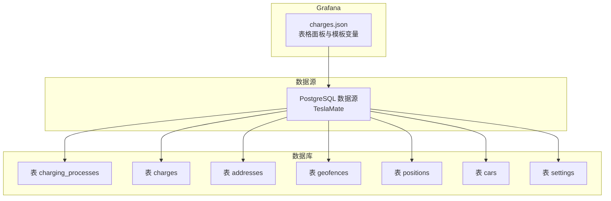
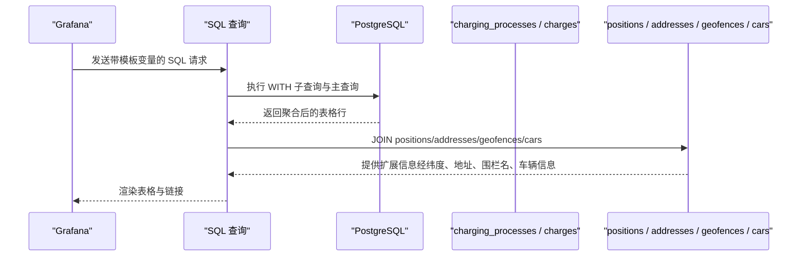
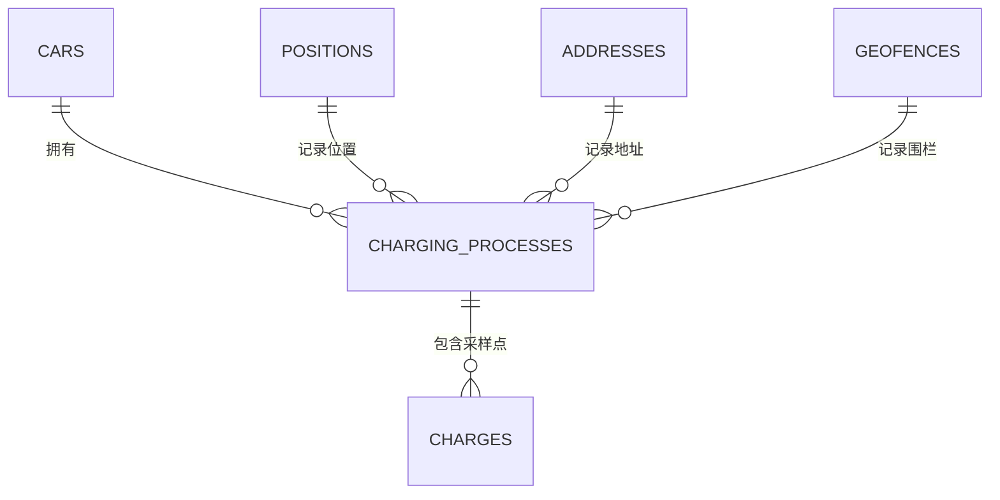

# 充电事件列表

<cite>
**本文引用的文件**
- [grafana/dashboards/charges.json](file://grafana/dashboards/charges.json)
- [lib/teslamate/log/charging_process.ex](file://lib/teslamate/log/charging_process.ex)
- [lib/teslamate/log/charge.ex](file://lib/teslamate/log/charge.ex)
- [priv/repo/migrations/20190330190000_create_charging_processes.exs](file://priv/repo/migrations/20190330190000_create_charging_processes.exs)
- [priv/repo/migrations/20190330200000_create_charges.exs](file://priv/repo/migrations/20190330200000_create_charges.exs)
- [priv/repo/migrations/20191026185642_calculate_charge_energy_used.exs](file://priv/repo/migrations/20191026185642_calculate_charge_energy_used.exs)
- [priv/repo/migrations/20191212230527_recalc_energy_used.exs](file://priv/repo/migrations/20191212230527_recalc_energy_used.exs)
- [priv/repo/migrations/20191117042320_add_cost_field_to_charges.exs](file://priv/repo/migrations/20191117042320_add_cost_field_to_charges.exs)
- [grafana/datasource.yml](file://grafana/datasource.yml)
</cite>

## 目录
1. [简介](#简介)
2. [项目结构](#项目结构)
3. [核心组件](#核心组件)
4. [架构总览](#架构总览)
5. [详细组件分析](#详细组件分析)
6. [依赖关系分析](#依赖关系分析)
7. [性能考量](#性能考量)
8. [故障排查指南](#故障排查指南)
9. [结论](#结论)
10. [附录](#附录)

## 简介
本文件面向“充电事件列表”仪表板（charges.json）的设计与实现进行深入解析，目标是帮助读者理解：
- 如何在 Grafana 中展示所有充电事件的列表，包含开始时间、结束时间、充电时长、起始SOC、结束SOC、充电量(kWh)、成本等关键指标；
- 数据查询逻辑：如何从 PostgreSQL 中提取 charging_processes 与 charges 表数据；
- 自定义过滤条件（日期范围、地理位置、类型、成本、时长等）的使用方式；
- 如何通过点击事件跳转到详细视图；
- 面板中的颜色编码规则与其对应的充电状态映射。

## 项目结构
该仪表板位于 Grafana 的内置仪表盘目录中，查询数据来源于 PostgreSQL 数据源；后端模型由 Elixir 的 Ecto 模式定义，对应数据库表结构由迁移脚本创建。

图表来源
- [grafana/dashboards/charges.json](file://grafana/dashboards/charges.json#L1178-L1209)
- [grafana/datasource.yml](file://grafana/datasource.yml#L1-L20)

章节来源
- [grafana/dashboards/charges.json](file://grafana/dashboards/charges.json#L1178-L1209)
- [grafana/datasource.yml](file://grafana/datasource.yml#L1-L20)

## 核心组件
- 仪表板主体为一个表格面板，用于列出充电事件的关键指标，支持排序、筛选与链接跳转。
- 使用多个模板变量控制过滤条件：车辆、地理围栏、位置文本、类型（AC/DC）、成本阈值、最小持续时长等。
- 查询语句基于 charging_processes 与 charges 表，通过 LEFT JOIN 连接 positions、addresses、geofences、cars，并按时间窗口与多维过滤条件进行筛选。
- 面板字段覆盖：开始/结束时间、地址/地理围栏、起止SOC、时长、能耗、效率、温度、里程、成本、类型等。

章节来源
- [grafana/dashboards/charges.json](file://grafana/dashboards/charges.json#L453-L1210)
- [grafana/dashboards/charges.json](file://grafana/dashboards/charges.json#L1335-L1526)

## 架构总览
下图展示了从 Grafana 到 PostgreSQL 的数据流，以及与 Ecto 模型的关系。

图表来源
- [grafana/dashboards/charges.json](file://grafana/dashboards/charges.json#L1178-L1209)

## 详细组件分析

### 1) 表格面板与字段映射
- 字段覆盖范围广泛，包括时间戳（毫秒级）、开始/结束时间、地址/地理围栏、SOC 起止、时长、能耗（添加/使用）、效率、温度、里程、成本、类型等。
- 多处字段设置了链接：
  - 点击“Date”列可跳转到“充电详情”仪表板，携带起止时间戳、车辆ID、充电过程ID等参数；
  - “Cost”列提供“设置成本”的编辑入口；
  - “Location”列提供“创建或编辑地理围栏”的入口。
- 字段单位与显示格式由面板配置统一管理，例如百分比、摄氏度/华氏度、公里/英里、kW·h、kW、km/h等。

章节来源
- [grafana/dashboards/charges.json](file://grafana/dashboards/charges.json#L453-L1210)

### 2) 数据查询逻辑（PostgreSQL）
- 主查询基于 charging_processes 表，通过 LEFT JOIN charges、positions、cars、addresses、geofences 获取完整上下文。
- 关键过滤条件：
  - 时间范围：使用 $__timeFilter(start_date) 宏；
  - 车辆：cp.car_id = $car_id；
  - 地理围栏：geofence_id IN ($geofence)，支持多选；
  - 类型：charge_type = ANY(数组)，数组来自模板变量 AC/DC；
  - 成本：cost >= $cost（文本框输入，非数值时跳过过滤）；
  - 时长：duration_min >= $min_duration_min；
  - 位置：address ILIKE '%$location%'。
- 计算派生字段：
  - cost_per_kwh = cost / GREATEST(charge_energy_added, charge_energy_used)
  - charging_efficiency = charge_energy_added / GREATEST(charge_energy_used, charge_energy_added)
  - charge_energy_added_per_hour = charge_energy_added * 60 / NULLIF(duration_min, 0)
  - range_added_per_hour = range_added * 60 / NULLIF(duration_min, 0)
  - outside_temp_avg 转换为用户选择的温度单位（settings 中的 unit_of_temperature）。
- 最终输出字段包含路径（用于跳转到地理围栏编辑或新建）、起止SOC、时长、能耗、效率、温度、里程、成本、类型等。

章节来源
- [grafana/dashboards/charges.json](file://grafana/dashboards/charges.json#L1178-L1209)

### 3) 数据模型与表结构
- charging_processes 表：记录一次充电过程的起止时间、SOC、能耗、时长、平均温度、成本等，关联 car、position、address、geofence。
- charges 表：记录充电过程中的采样点（时间、功率、电流、电压、相数、能耗等），与 charging_processes 建立一对多关系。
- 迁移脚本定义了字段类型与约束，历史演进中增加了 cost、address_id、geofence_id、charge_energy_used 等字段。

章节来源
- [lib/teslamate/log/charging_process.ex](file://lib/teslamate/log/charging_process.ex#L1-L61)
- [lib/teslamate/log/charge.ex](file://lib/teslamate/log/charge.ex#L1-L68)
- [priv/repo/migrations/20190330190000_create_charging_processes.exs](file://priv/repo/migrations/20190330190000_create_charging_processes.exs#L1-L23)
- [priv/repo/migrations/20190330200000_create_charges.exs](file://priv/repo/migrations/20190330200000_create_charges.exs#L1-L27)

### 4) 能耗计算与效率
- charge_energy_used 的计算逻辑在迁移脚本中实现：基于相邻采样点的时间差与功率/电流电压乘积，累加得到总消耗。
- charging_efficiency 字段直接由 charge_energy_added 与 charge_energy_used 的比值得出，用于直观评估充电效率。

章节来源
- [priv/repo/migrations/20191026185642_calculate_charge_energy_used.exs](file://priv/repo/migrations/20191026185642_calculate_charge_energy_used.exs#L73-L101)
- [priv/repo/migrations/20191212230527_recalc_energy_used.exs](file://priv/repo/migrations/20191212230527_recalc_energy_used.exs#L166-L197)

### 5) 自定义过滤条件与使用示例
- 模板变量与过滤器：
  - 车辆：$car_id（下拉选择，支持多车显示）；
  - 地理围栏：$geofence（多选，支持“全部”）；
  - 位置：$location（文本框模糊匹配地址/城市）；
  - 类型：$charge_type（AC/DC，多选）；
  - 成本：$cost（数值下限，非数值时跳过）；
  - 时长：$min_duration_min（分钟下限）。
- 使用示例：
  - 仅查看某车在某地理围栏内的 DC 充电事件，并设置最低成本与最小时长；
  - 在某时间段内筛选包含特定地点关键字的充电事件；
  - 同时筛选 AC/DC 两类类型并设置成本门槛。

章节来源
- [grafana/dashboards/charges.json](file://grafana/dashboards/charges.json#L1335-L1526)

### 6) 点击事件与跳转
- “Date”列字段配置了链接，点击后跳转至“充电详情”仪表板，传递以下参数：
  - 起止时间戳（毫秒）、车辆ID、充电过程ID；
- “Cost”列提供“设置成本”的编辑入口；
- “Location”列提供“创建或编辑地理围栏”的入口。

章节来源
- [grafana/dashboards/charges.json](file://grafana/dashboards/charges.json#L500-L510)
- [grafana/dashboards/charges.json](file://grafana/dashboards/charges.json#L677-L685)
- [grafana/dashboards/charges.json](file://grafana/dashboards/charges.json#L731-L739)

### 7) 颜色编码规则与状态映射
- 温度列（outside_temp_avg）采用阈值映射，不同区间使用不同颜色，便于快速识别环境温度影响；
- 效率列（charging_efficiency）采用连续色带（RdYlGr）进行可视化；
- 类型列（charge_type）对 AC/DC 使用固定颜色映射；
- 其他列未设置全局颜色编码，主要通过单元格样式与阈值实现辅助区分。

章节来源
- [grafana/dashboards/charges.json](file://grafana/dashboards/charges.json#L630-L660)
- [grafana/dashboards/charges.json](file://grafana/dashboards/charges.json#L999-L1014)
- [grafana/dashboards/charges.json](file://grafana/dashboards/charges.json#L1084-L1105)

### 8) 数据来源与连接配置
- Grafana 数据源为 PostgreSQL，名称为 TeslaMate，通过环境变量注入主机、端口、用户名、密码、SSL模式与数据库名；
- 仪表板查询使用该数据源 UID 进行访问。

章节来源
- [grafana/datasource.yml](file://grafana/datasource.yml#L1-L20)
- [grafana/dashboards/charges.json](file://grafana/dashboards/charges.json#L1178-L1189)

## 依赖关系分析
- 仪表板依赖于 PostgreSQL 数据库中的 charging_processes、charges、positions、addresses、geofences、cars、settings 等表；
- Ecto 模型定义了表之间的外键关系与字段约束；
- 迁移脚本演进体现了字段增加与能耗计算的历史演进。

图表来源
- [lib/teslamate/log/charging_process.ex](file://lib/teslamate/log/charging_process.ex#L1-L61)
- [lib/teslamate/log/charge.ex](file://lib/teslamate/log/charge.ex#L1-L68)

章节来源
- [lib/teslamate/log/charging_process.ex](file://lib/teslamate/log/charging_process.ex#L1-L61)
- [lib/teslamate/log/charge.ex](file://lib/teslamate/log/charge.ex#L1-L68)

## 性能考量
- 查询涉及多表 JOIN 与分组聚合，建议确保相关字段建立索引（如 charging_processes 的 car_id、start_date、address_id、geofence_id，以及 charges 的 charging_process_id、date）。
- 使用 $__timeFilter 宏时注意时区一致性，避免不必要的全表扫描。
- 对于大规模数据，建议限制返回行数或启用分页，减少前端渲染压力。

## 故障排查指南
- 不完整充电事件：
  - 仪表板包含“不完整充电”面板，用于查找 end_date 为空的记录，提示参考官方修复指南。
- 数据修复与迁移：
  - 历史迁移脚本中包含对 charge_energy_used 的计算与回填逻辑，若发现能耗异常，可检查相关迁移是否执行。
- 温度单位与长度单位：
  - 仪表板通过 settings 表获取单位配置，确保温度与长度单位一致，避免显示异常。

章节来源
- [grafana/dashboards/charges.json](file://grafana/dashboards/charges.json#L1249-L1334)
- [priv/repo/migrations/20191026185642_calculate_charge_energy_used.exs](file://priv/repo/migrations/20191026185642_calculate_charge_energy_used.exs#L73-L101)
- [priv/repo/migrations/20191212230527_recalc_energy_used.exs](file://priv/repo/migrations/20191212230527_recalc_energy_used.exs#L166-L197)

## 结论
charges.json 仪表板通过精心设计的查询与字段映射，将 charging_processes 与 charges 的数据整合为可读性强的充电事件列表，并提供了丰富的过滤能力与交互跳转。结合 Ecto 模型与迁移脚本，系统实现了从原始采样到聚合统计的完整链路。建议在生产环境中关注索引与单位配置，以获得更佳的查询性能与显示效果。

## 附录
- 关键字段与含义（摘自面板配置与查询）：
  - 开始/结束时间：start_date/end_date 及其毫秒时间戳；
  - 地址/地理围栏：address/geofence_name；
  - SOC：start_battery_level/end_battery_level；
  - 时长：duration_min；
  - 能耗：charge_energy_added（添加）、charge_energy_used（使用）；
  - 效率：charging_efficiency；
  - 成本：cost、cost_per_kwh；
  - 类型：charge_type（AC/DC）；
  - 温度：outside_temp_avg（按用户设置转换）；
  - 里程：odometer（按用户设置转换）。