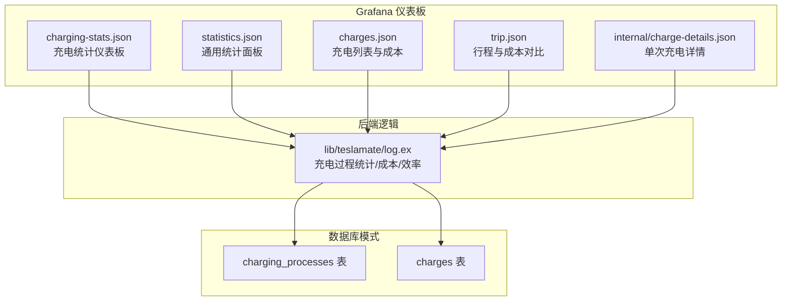
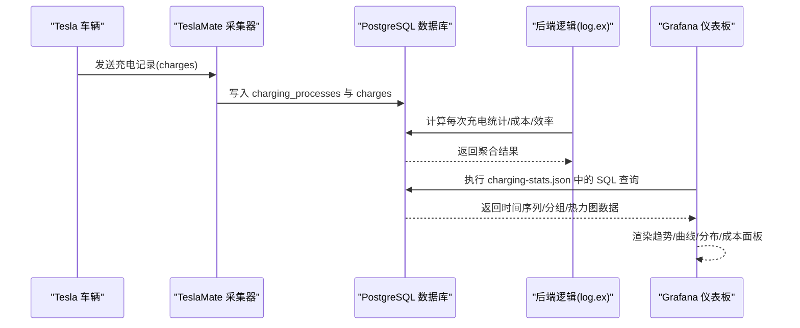
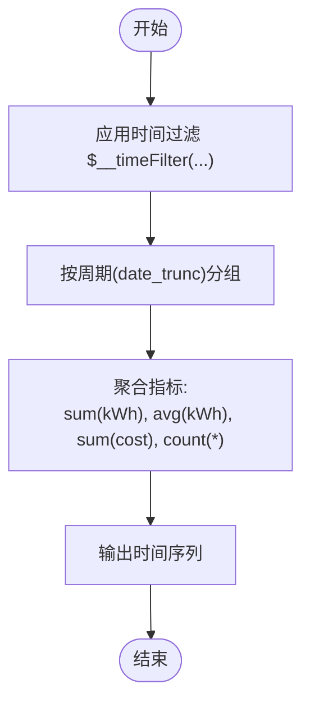
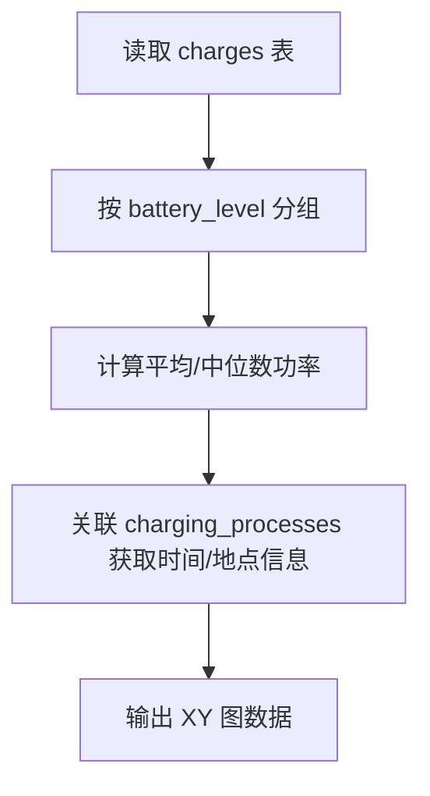
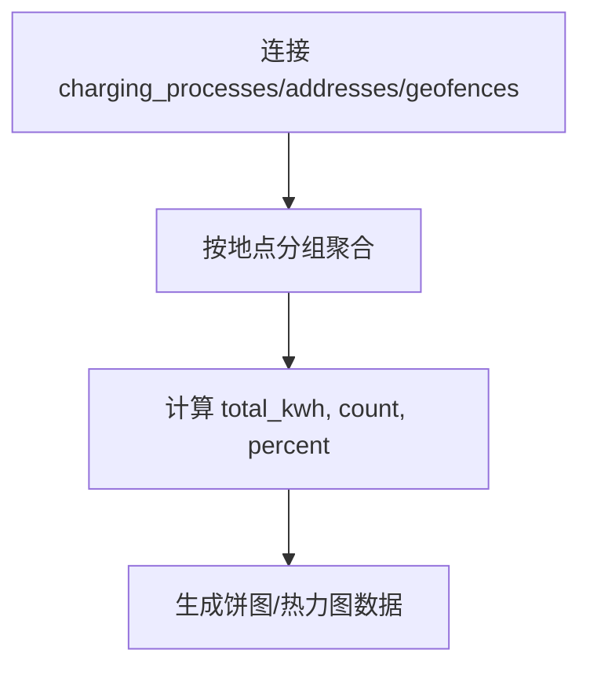
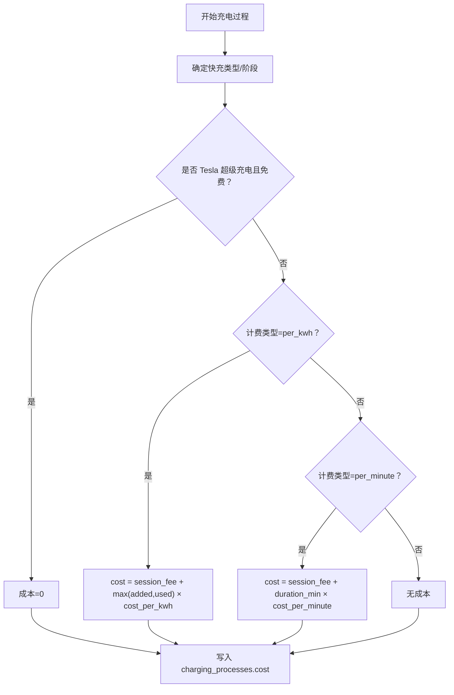
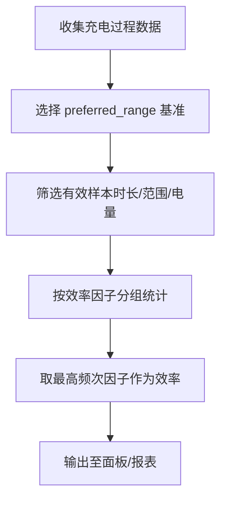
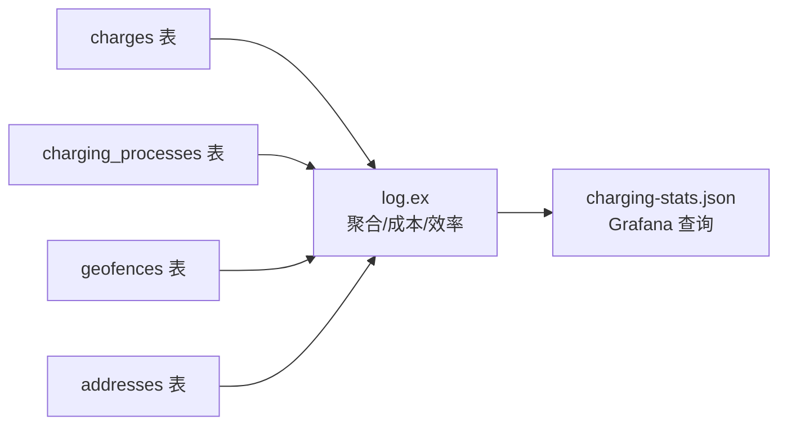

# 充电统计分析

<cite>
**本文引用的文件**
- [charging-stats.json](file://grafana/dashboards/charging-stats.json)
- [log.ex](file://lib/teslamate/log.ex)
- [statistics.json](file://grafana/dashboards/statistics.json)
- [charges.json](file://grafana/dashboards/charges.json)
- [trip.json](file://grafana/dashboards/trip.json)
- [charge-details.json](file://grafana/dashboards/internal/charge-details.json)
- [20190330200000_create_charges.exs](file://priv/repo/migrations/20190330200000_create_charges.exs)
- [20190330190000_create_charging_processes.exs](file://priv/repo/migrations/20190330190000_create_charging_processes.exs)
- [20200203180529_location_based_charge_cost.exs](file://priv/repo/migrations/20200203180529_location_based_charge_cost.exs)
- [20200212001245_location_based_charge_cost_increase_scale.exs](file://priv/repo/migrations/20200212001245_location_based_charge_cost_increase_scale.exs)
- [log_charging_test.exs](file://test/teslamate/log/log_charging_test.exs)
</cite>

## 目录
1. [简介](#简介)
2. [项目结构](#项目结构)
3. [核心组件](#核心组件)
4. [架构总览](#架构总览)
5. [详细组件分析](#详细组件分析)
6. [依赖关系分析](#依赖关系分析)
7. [性能考量](#性能考量)
8. [故障排查指南](#故障排查指南)
9. [结论](#结论)
10. [附录](#附录)

## 简介
本文件面向使用 TeslaMate 的用户与维护者，系统化梳理“充电统计”仪表板（charging-stats.json）中各可视化组件的实现与数据来源，解释每日/每周/每月充电趋势、平均充电效率变化曲线、不同地点的充电分布饼图，以及充电成本累计统计背后的 SQL 查询逻辑与聚合函数、时间窗口使用方式。同时提供解读充电效率下降趋势的方法论，结合车辆设置与环境因素进行分析，并给出评估家庭太阳能充电效果的实际使用场景示例。

## 项目结构
- Grafana 仪表板位于 grafana/dashboards 下，charging-stats.json 是本次分析的核心。
- 后端逻辑与数据聚合在 lib/teslamate/log.ex 中完成，包括充电过程统计、能耗估算、成本计算与效率因子推导。
- 数据模型迁移文件位于 priv/repo/migrations，定义了 charging_processes 与 charges 表结构及字段演进。
- 相关的统计与成本面板位于 statistics.json、charges.json、trip.json、internal/charge-details.json 等仪表板中，可作为交叉参考。

图表来源
- [charging-stats.json](file://grafana/dashboards/charging-stats.json#L1-L2418)
- [log.ex](file://lib/teslamate/log.ex#L1-L712)
- [20190330190000_create_charging_processes.exs](file://priv/repo/migrations/20190330190000_create_charging_processes.exs#L1-L22)
- [20190330200000_create_charges.exs](file://priv/repo/migrations/20190330200000_create_charges.exs#L1-L26)

章节来源
- [charging-stats.json](file://grafana/dashboards/charging-stats.json#L1-L2418)

## 核心组件
- 充电过程统计与聚合：由后端逻辑完成，基于 charging_processes 与 charges 表，计算每次充电的起止时间、SOC 变化、能量添加/消耗、时长等；并根据地理围栏与计费规则计算成本。
- Grafana 仪表板组件：
  - 趋势图：按日/周/月对充电量、耗时、成本进行聚合展示。
  - 效率曲线：以 SoC 为横轴、功率为纵轴的 XY 图，反映直流快充特性。
  - 分布图：地点分布饼图与热力地图，展示不同地点的充电总量占比。
  - 成本统计：按 AC/DC 类型、时长、地点等维度统计成本。
- 模板变量与过滤：支持 car_id、min_duration、preferred_range、length_unit 等参数，确保跨车、跨单位、跨范围的可配置性。

章节来源
- [charging-stats.json](file://grafana/dashboards/charging-stats.json#L1-L2418)
- [log.ex](file://lib/teslamate/log.ex#L395-L712)

## 架构总览
下图展示了从原始充电记录到仪表板可视化的端到端流程，包括数据采集、后端聚合、成本与效率计算、以及 Grafana 查询映射。

图表来源
- [log.ex](file://lib/teslamate/log.ex#L395-L712)
- [charging-stats.json](file://grafana/dashboards/charging-stats.json#L1-L2418)

## 详细组件分析

### 组件一：每日/每周/每月充电量趋势（按日/周/月聚合）
- 数据来源与聚合逻辑
  - 使用 date_trunc 对 start_date 或 end_date 进行时间粒度切分（日/周/月/年），并按该粒度分组统计：
    - sum(greatest(charge_energy_added, charge_energy_used))：累计充电量（kWh）
    - sum(charge_energy_added)：新增电量（kWh）
    - avg_energy_charged_kwh：单次平均充电量（kWh）
    - sum(cost)：累计成本
    - count(*)：充电次数
  - 时间过滤：通过 $__timeFilter(start_date) 或 end_date 实现时间范围筛选。
  - 车辆过滤：car_id 模板变量限定。
- 关键 SQL 片段路径
  - [按周期聚合的 SQL](file://grafana/dashboards/statistics.json#L654-L720)
- 复杂度与性能
  - 时间窗口：date_trunc 提供 O(1) 的分桶操作。
  - 聚合：GROUP BY + SUM/COUNT，复杂度近似 O(n)，其中 n 为充电记录数。
  - 建议：确保 charging_processes 与 charges 表在 end_date/start_date 上建立索引以提升 $__timeFilter 性能。

图表来源
- [statistics.json](file://grafana/dashboards/statistics.json#L654-L720)

章节来源
- [statistics.json](file://grafana/dashboards/statistics.json#L654-L720)

### 组件二：平均充电效率变化曲线（SoC vs 功率）
- 数据来源与处理
  - 从 charges 表按电池电量（battery_level）分组，计算每档 SoC 的平均充电功率（charger_power）或中位数（PERCENTILE_CONT）。
  - 通过 charging_processes 的 start_date/end_date 与地址/围栏信息标注充电事件。
- 关键 SQL 片段路径
  - [按 SoC 聚合功率的 SQL（表格）](file://grafana/dashboards/charging-stats.json#L1664-L1683)
  - [按 SoC 聚合功率的 SQL（中位数）](file://grafana/dashboards/charging-stats.json#L1692-L1711)
- 解读要点
  - 高 SoC 区间功率下降通常由充电算法限制导致，属于正常现象。
  - 若某 SoC 区间功率显著低于历史值，可能提示充电效率下降或环境温度影响。

图表来源
- [charging-stats.json](file://grafana/dashboards/charging-stats.json#L1664-L1711)

章节来源
- [charging-stats.json](file://grafana/dashboards/charging-stats.json#L1664-L1711)

### 组件三：不同地点的充电分布（饼图与热力图）
- 数据来源与处理
  - 以 geofence.name 或地址拼接（road/house_number/city）作为地点标识，按地点分组统计：
    - sum(charge_energy_added)：地点总充电量（kWh）
    - count(*)：充电次数
    - 百分比：按地点总充电量占全局的比例
  - 地图层：使用 markers 层，点大小映射充电量，文本显示充电量与百分比。
- 关键 SQL 片段路径
  - [地点聚合与百分比计算](file://grafana/dashboards/charging-stats.json#L1324-L1343)
  - [地点 Top N 表格（按充电量）](file://grafana/dashboards/charging-stats.json#L2174-L2193)
- 解读要点
  - 百分比高的地点通常为常用充电桩或家充。
  - 结合“地点 Top N 表格（按成本）”可识别高成本地点，辅助优化充电策略。

图表来源
- [charging-stats.json](file://grafana/dashboards/charging-stats.json#L1324-L1343)

章节来源
- [charging-stats.json](file://grafana/dashboards/charging-stats.json#L1324-L1343)
- [charging-stats.json](file://grafana/dashboards/charging-stats.json#L2174-L2193)

### 组件四：充电成本的累计统计与 AC/DC 分类
- 成本计算逻辑（后端）
  - 优先级：
    1) 若为 Tesla 超级充电且启用免费超级充电，则成本为 0。
    2) 若计费类型为 per_kwh：cost = session_fee + max(added, used) × cost_per_kwh
    3) 若计费类型为 per_minute：cost = session_fee + duration_min × cost_per_minute
  - 该逻辑在完成一次充电过程后写入 charging_processes.cost 字段。
- Grafana 面板
  - AC/DC 能量使用饼图：按 mode() within group 推断电流类型，统计 GREATEST(added, used)。
  - AC/DC 时长饼图：统计分钟数。
  - 成本统计：按车、时间、地点、类型等维度汇总。
- 关键代码与测试路径
  - [put_cost 成本计算](file://lib/teslamate/log.ex#L582-L630)
  - [测试：per_kwh/per_minute/session_fee/free_supercharging](file://test/teslamate/log/log_charging_test.exs#L411-L604)
  - [测试：效率因子推导](file://test/teslamate/log/log_charging_test.exs#L607-L735)

图表来源
- [log.ex](file://lib/teslamate/log.ex#L582-L630)

章节来源
- [log.ex](file://lib/teslamate/log.ex#L582-L630)
- [log_charging_test.exs](file://test/teslamate/log/log_charging_test.exs#L411-L604)

### 组件五：充电效率下降趋势的解读与分析
- 效率因子推导（后端）
  - 基于充电过程的 charge_energy_added 与理想/标定续航范围差值，计算效率因子：
    - 效率 = charge_energy_added / Δrange（Δrange 为 end_range - start_range）
    - 选择 preferred_range（ideal/rated）作为范围基准。
    - 仅在满足时长、SOC 范围、非空范围等条件下进行统计与排序，取最高频次的因子作为最终效率。
- Grafana 面板
  - “充电效率”相关面板可结合“DC 充电曲线”观察 SoC 区间功率变化，辅助判断效率下降是否集中在特定区间。
- 影响因素
  - 车辆设置：preferred_range、电池类型（LFP）会影响范围基准与阈值。
  - 环境因素：温度、海拔、空调/加热器使用会增加能耗。
  - 充电设施：快充桩功率限制、相数（AC/DC）差异。
- 实际使用场景示例：评估家庭太阳能充电效果
  - 将“地点”维度扩展到“家庭太阳能充电”场景，对比“家庭”与“公共超充”的效率与成本。
  - 通过“地点 Top N 表格（按成本）”识别高成本地点，结合“地点 Top N 表格（按充电量）”识别高频地点，辅助判断是否应优先在家充。
  - 结合“AC/DC 时长/能量”面板，观察在家充时的 AC 与 DC 比例变化，评估太阳能利用率与峰谷时段策略。

图表来源
- [log.ex](file://lib/teslamate/log.ex#L632-L675)

章节来源
- [log.ex](file://lib/teslamate/log.ex#L632-L675)
- [log_charging_test.exs](file://test/teslamate/log/log_charging_test.exs#L607-L735)

## 依赖关系分析
- 数据表依赖
  - charging_processes：存储每次充电的起止时间、SOC、能量、时长、位置、成本等。
  - charges：存储充电过程中的逐条记录（时间戳、功率、电压、相数、SOC、范围等）。
- 逻辑依赖
  - 后端逻辑依赖 charging_processes 与 charges 的窗口函数与聚合，计算每次充电的统计量与成本。
  - Grafana 仪表板依赖模板变量（car_id、min_duration、preferred_range、length_unit）与 $__timeFilter 进行动态过滤。
- 外部依赖
  - 地理围栏（geofences）与地址（addresses）用于地点识别与成本计算。
  - 计费规则（per_kwh/per_minute/session_fee/free_supercharging）来自 geofences 与 car_settings。

图表来源
- [log.ex](file://lib/teslamate/log.ex#L395-L712)
- [20190330190000_create_charging_processes.exs](file://priv/repo/migrations/20190330190000_create_charging_processes.exs#L1-L22)
- [20190330200000_create_charges.exs](file://priv/repo/migrations/20190330200000_create_charges.exs#L1-L26)

章节来源
- [log.ex](file://lib/teslamate/log.ex#L395-L712)
- [20190330190000_create_charging_processes.exs](file://priv/repo/migrations/20190330190000_create_charging_processes.exs#L1-L22)
- [20190330200000_create_charges.exs](file://priv/repo/migrations/20190330200000_create_charges.exs#L1-L26)

## 性能考量
- 索引建议
  - 在 charging_processes.end_date 与 charges.date 上建立索引，以加速 $__timeFilter 过滤。
  - 在 charging_processes.car_id 与 charging_processes.duration_min 上建立复合索引，以加速按车与时长过滤。
- 查询优化
  - 使用 date_trunc 进行时间分桶，避免在 WHERE 子句中对列做函数变换，减少索引失效风险。
  - 尽量使用 GROUP BY 列上的索引，减少全表扫描。
- 缓存与刷新
  - 仪表板 refresh 设置可根据数据更新频率调整，避免过于频繁的查询压力。
- 单位转换
  - preferred_range 与 length_unit 的切换通过模板变量传递，避免在查询中重复转换逻辑。

## 故障排查指南
- 仪表板无数据
  - 检查 $__timeFilter 是否正确绑定到 end_date/start_date。
  - 确认 car_id 模板变量已选择目标车辆。
  - 确认 min_duration 模板变量未设置过大，导致过滤掉全部记录。
- 成本为零或异常
  - 检查 geofences 表的 billing_type、cost_per_unit、session_fee 是否正确配置。
  - 检查 car_settings.free_supercharging 是否开启（若为 Tesla 超级充电）。
  - 参考测试用例验证 per_kwh/per_minute/session_fee 的组合逻辑。
- 效率因子不更新
  - 确认充电过程已完成，且满足时长、SOC 范围、非空范围等条件。
  - 检查 preferred_range 设置是否与面板一致。
- 地点统计异常
  - 检查 geofences 与 addresses 的匹配逻辑，确认名称与地址拼接是否为空。
  - 确认 charging_processes.address_id/geofence_id 是否正确关联。

章节来源
- [log_charging_test.exs](file://test/teslamate/log/log_charging_test.exs#L411-L604)
- [log.ex](file://lib/teslamate/log.ex#L582-L675)
- [charging-stats.json](file://grafana/dashboards/charging-stats.json#L1324-L1343)

## 结论
charging-stats.json 仪表板通过 Grafana SQL 查询与 TeslaMate 后端逻辑的协同，实现了对充电量、效率、成本与地点分布的多维可视化。理解其背后的时间窗口、聚合函数与成本/效率计算规则，有助于准确解读趋势、定位异常并制定优化策略。结合家庭太阳能充电场景，可进一步细化地点与成本维度，评估自给式充电的经济性与效率收益。

## 附录
- 相关仪表板与查询参考
  - [charging-stats.json（完整）](file://grafana/dashboards/charging-stats.json#L1-L2418)
  - [statistics.json（周期聚合）](file://grafana/dashboards/statistics.json#L654-L720)
  - [charges.json（充电列表与成本）](file://grafana/dashboards/charges.json#L643-L1526)
  - [trip.json（行程与成本对比）](file://grafana/dashboards/trip.json#L1183-L1238)
  - [internal/charge-details.json（单次充电详情）](file://grafana/dashboards/internal/charge-details.json#L546-L593)
- 数据模型与迁移
  - [charging_processes 表结构](file://priv/repo/migrations/20190330190000_create_charging_processes.exs#L1-L22)
  - [charges 表结构](file://priv/repo/migrations/20190330200000_create_charges.exs#L1-L26)
  - [地点计费字段迁移](file://priv/repo/migrations/20200203180529_location_based_charge_cost.exs#L1-L13)
  - [地点计费精度迁移](file://priv/repo/migrations/20200212001245_location_based_charge_cost_increase_scale.exs#L1-L15)