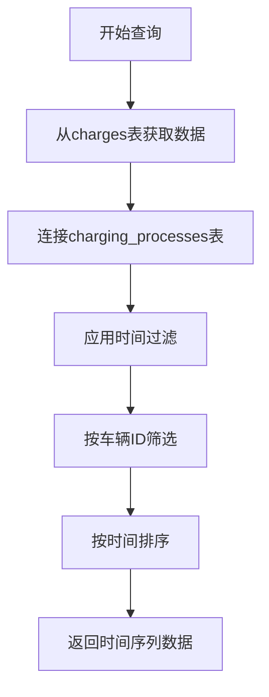
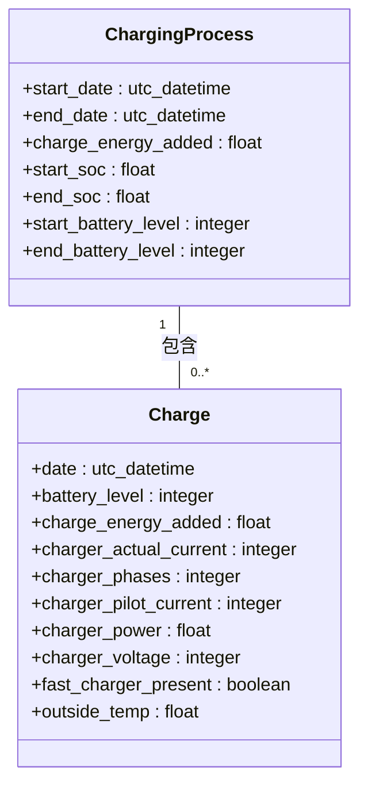
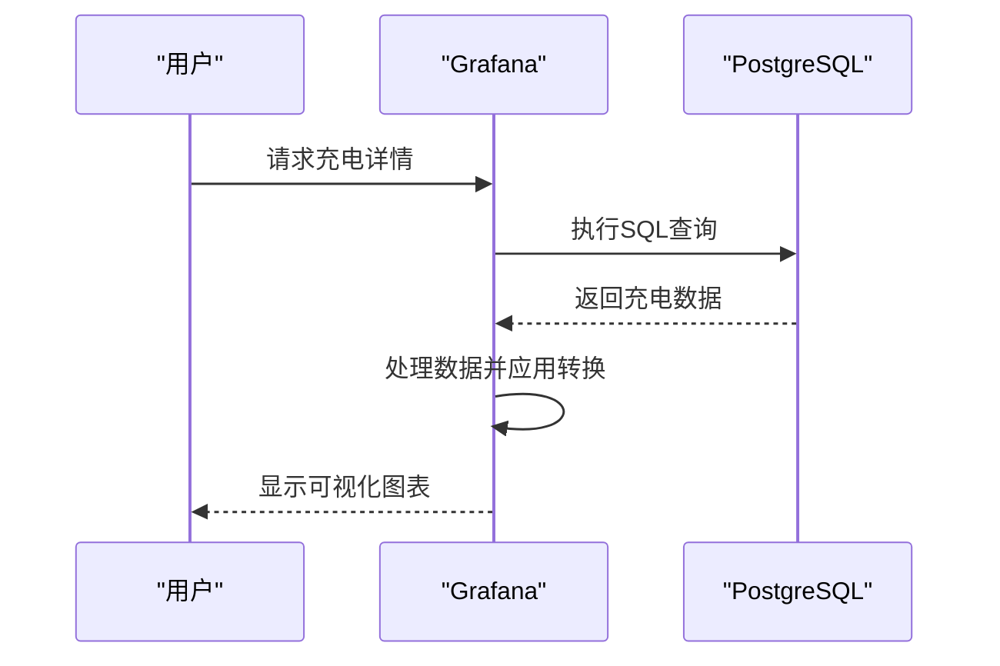
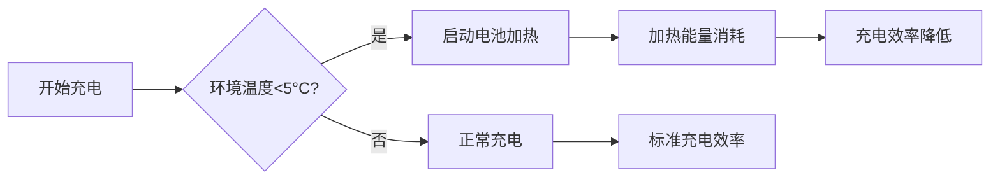

# 充电过程详细指标

<cite>
**本文档引用文件**  
- [charge-details.json](file://grafana/dashboards/internal/charge-details.json)
- [20190330200000_create_charges.exs](file://priv/repo/migrations/20190330200000_create_charges.exs)
- [20190330190000_create_charging_processes.exs](file://priv/repo/migrations/20190330190000_create_charging_processes.exs)
- [20190731154452_create_settings.exs](file://priv/repo/migrations/20190731154452_create_settings.exs)
- [20190810105216_unit_of_length_and_temperature.exs](file://priv/repo/migrations/20190810105216_unit_of_length_and_temperature.exs)
- [20190913165850_add_range_enum.exs](file://priv/repo/migrations/20190913165850_add_range_enum.exs)
- [20190729142656_add_conversion_functions.exs](file://priv/repo/migrations/20190729142656_add_conversion_functions.exs)
</cite>

## 目录
1. [简介](#简介)
2. [核心指标可视化](#核心指标可视化)
3. [指标间关系分析](#指标间关系分析)
4. [充电问题诊断](#充电问题诊断)
5. [原始数据导出指导](#原始数据导出指导)

## 简介
TeslaMate的充电详情仪表板（charge-details.json）提供了对电动汽车充电过程的全面技术指标可视化。该仪表板通过Grafana平台，从PostgreSQL数据库中提取数据，展示充电过程中的实时功率、电流、电压、电池温度、充电速率等关键参数。这些数据不仅帮助用户监控充电状态，还为深入分析充电效率和诊断潜在问题提供了基础。

**本节引用文件**
- [charge-details.json](file://grafana/dashboards/internal/charge-details.json)

## 核心指标可视化
充电详情仪表板通过多个面板展示充电过程的关键技术指标，包括实时功率(kW)、电流(A)、电压(V)、电池温度、充电速率(km/h)等参数的时间序列图表。

### 实时功率、电流与电压
主要时间序列图表（ID: 2）展示了充电过程中的多个关键指标：
- **功率 (Power)**：以kW为单位，显示充电功率随时间的变化
- **电流 (Current)**：以A为单位，显示实际充电电流
- **电压 (Charging Voltage)**：以V为单位，显示充电电压
- **电池电量 (SOC)**：以百分比显示电池充电状态
- **环境温度 (Outdoor Temperature)**：显示充电时的外部环境温度

这些指标通过SQL查询从`charges`和`charging_processes`表中获取，使用`$__timeFilter(date)`进行时间过滤，并根据车辆ID进行筛选。



**图表来源**
- [charge-details.json](file://grafana/dashboards/internal/charge-details.json#L355-L363)

**本节引用文件**
- [charge-details.json](file://grafana/dashboards/internal/charge-details.json#L355-L363)
- [20190330200000_create_charges.exs](file://priv/repo/migrations/20190330200000_create_charges.exs)

### 电池温度与加热状态
仪表板还监控电池温度和加热系统状态：
- **电池加热器 (Battery heater)**：显示电池加热系统的开关状态
- **温度单位转换**：根据用户设置自动转换为摄氏度(°C)或华氏度(°F)

温度数据显示通过正则表达式匹配字段名并应用相应的单位转换，确保用户界面的一致性。

### 充电能量与效率
多个统计面板展示了充电过程的总体性能：
- **充电能量 (Charge Energy)**：显示已添加能量、已使用能量和充电效率
- **电池电量变化**：显示充电开始、结束时的电池电量及增加量
- **续航里程**：显示基于理想或额定续航的起始、增加和结束里程



**图表来源**
- [charge-details.json](file://grafana/dashboards/internal/charge-details.json#L785-L849)
- [20190330190000_create_charging_processes.exs](file://priv/repo/migrations/20190330190000_create_charging_processes.exs)

## 指标间关系分析
充电过程中的各项技术指标之间存在密切的相互关系，这些关系反映了充电效率、电网稳定性和充电设备的限制。

### 功率波动与电网稳定性
充电功率的波动可能与电网稳定性或充电设备限制相关：
- **功率计算**：当相位数≥1时，功率计算为`相位数 × 实际电流 × 电压 / 1000.0`，否则使用`charger_power`
- **相位检测**：通过复杂的SQL查询确定充电相位数，考虑了平均功率、相位数和电压的综合因素



**图表来源**
- [charge-details.json](file://grafana/dashboards/internal/charge-details.json#L1235-L1236)
- [20190330200000_create_charges.exs](file://priv/repo/migrations/20190330200000_create_charges.exs)

### 充电效率与环境因素
充电效率受多种因素影响：
- **环境温度**：低温环境下电池加热系统会消耗额外能量
- **充电速率**：高功率充电可能导致效率降低
- **电池状态**：电池电量水平影响充电功率

充电效率计算公式为：`LEAST(添加能量 / 使用能量, 1.0) × 100`，确保效率值不超过100%。

## 充电问题诊断
通过分析充电过程中的各项指标，可以诊断多种充电问题。

### 识别充电中断
充电中断可以通过以下指标识别：
- **功率突然降为零**：表示充电过程中断
- **电池加热器状态变化**：可能指示充电策略调整
- **电流与电压不匹配**：可能表示充电设备故障

### 评估不同环境温度下的充电效率
通过比较不同温度条件下的充电数据，可以评估环境温度对充电效率的影响：
- **低温充电**：电池加热系统会消耗额外能量，降低整体效率
- **高温充电**：可能触发电池冷却系统，影响充电速率



**图表来源**
- [charge-details.json](file://grafana/dashboards/internal/charge-details.json#L848-L849)

## 原始数据导出指导
高级用户可以通过以下方式导出原始数据进行深度分析。

### 通过Grafana导出
1. 在充电详情仪表板中选择所需的时间范围
2. 使用面板的"导出"功能将数据保存为CSV格式
3. 对导出的数据进行进一步分析

### 直接数据库查询
用户可以直接查询PostgreSQL数据库获取原始数据：

```sql
SELECT 
  date,
  battery_level,
  charger_power,
  charger_actual_current,
  charger_voltage,
  outside_temp,
  battery_heater_on
FROM charges 
WHERE charging_process_id = $charging_process_id
ORDER BY date ASC;
```

### 数据单位转换
系统提供了多种单位转换函数，确保数据的一致性：
- **距离转换**：`convert_km()`函数在km和mi之间转换
- **温度转换**：`convert_celsius()`函数在°C和°F之间转换
- **电压转换**：`convert_voltage()`函数处理电压单位

这些转换函数在数据库迁移文件中定义，确保了数据处理的一致性和准确性。

**本节引用文件**
- [20190729142656_add_conversion_functions.exs](file://priv/repo/migrations/20190729142656_add_conversion_functions.exs)
- [20190810105216_unit_of_length_and_temperature.exs](file://priv/repo/migrations/20190810105216_unit_of_length_and_temperature.exs)