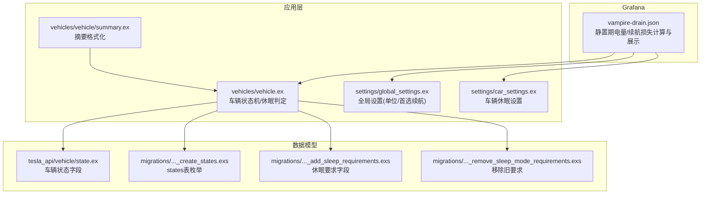
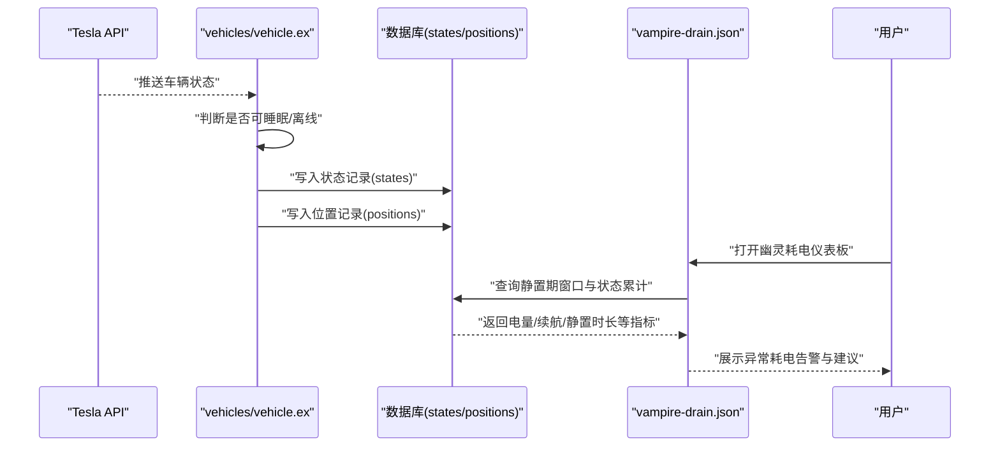
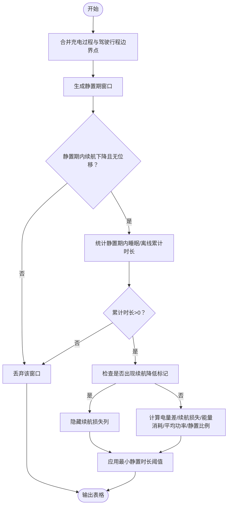
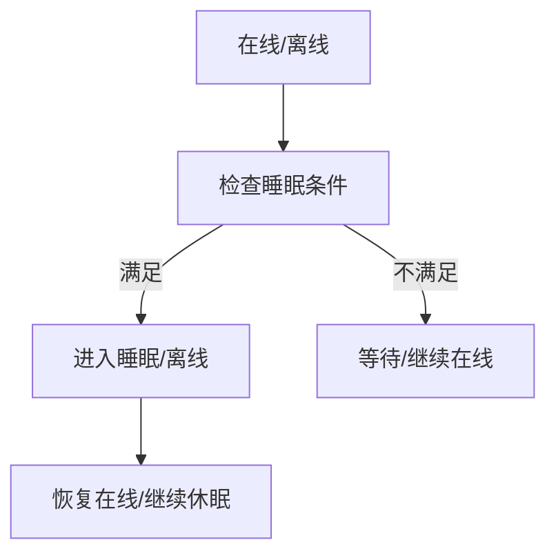
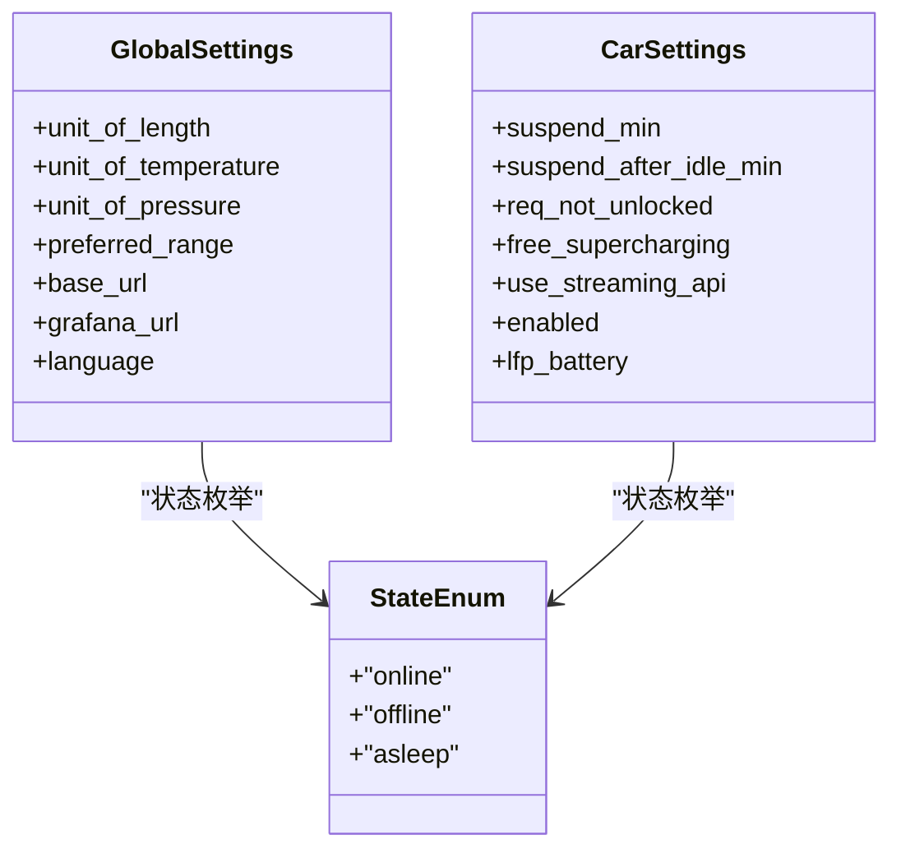
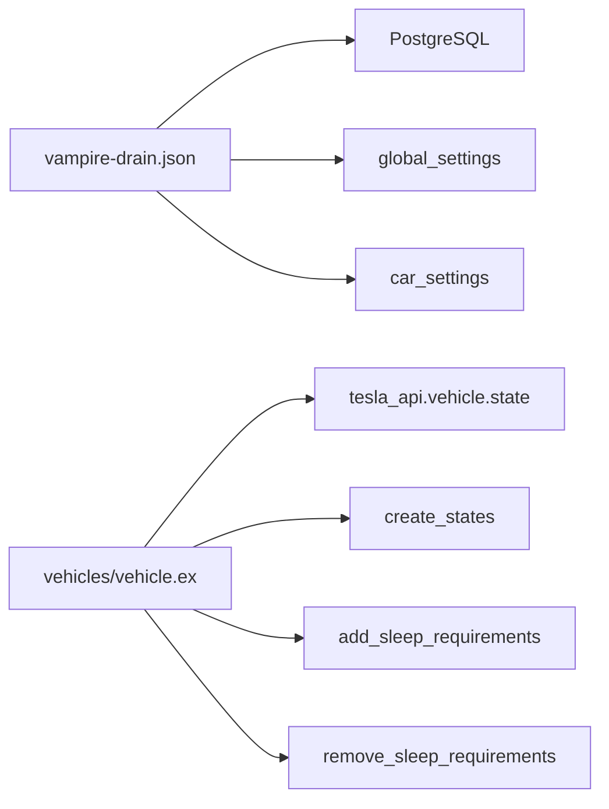

# 幽灵耗电监测

<cite>
**本文引用的文件**
- [grafana/dashboards/vampire-drain.json](file://grafana/dashboards/vampire-drain.json)
- [lib/teslamate/vehicles/vehicle.ex](file://lib/teslamate/vehicles/vehicle.ex)
- [lib/teslamate/vehicles/vehicle/summary.ex](file://lib/teslamate/vehicles/vehicle/summary.ex)
- [lib/teslamate/settings/car_settings.ex](file://lib/teslamate/settings/car_settings.ex)
- [lib/teslamate/settings/global_settings.ex](file://lib/teslamate/settings/global_settings.ex)
- [lib/tesla_api/vehicle/state.ex](file://lib/tesla_api/vehicle/state.ex)
- [priv/repo/migrations/20190330180000_create_states.exs](file://priv/repo/migrations/20190330180000_create_states.exs)
- [priv/repo/migrations/20190823173437_add_sleep_requirements.exs](file://priv/repo/migrations/20190823173437_add_sleep_requirements.exs)
- [priv/repo/migrations/20200401171402_remove_sleep_mode_requirements.exs](file://priv/repo/migrations/20200401171402_remove_sleep_mode_requirements.exs)
- [test/teslamate/vehicles/vehicle/suspend_test.exs](file://test/teslamate/vehicles/vehicle/suspend_test.exs)
- [test/teslamate/vehicles/vehicle/charging_test.exs](file://test/teslamate/vehicles/vehicle/charging_test.exs)
- [test/teslamate/vehicles/vehicle_test.exs](file://test/teslamate/vehicles/vehicle_test.exs)
- [test/teslamate/settings_test.exs](file://test/teslamate/settings_test.exs)
- [website/docs/screenshots.mdx](file://website/docs/screenshots.mdx)
</cite>

## 目录
1. [简介](#简介)
2. [项目结构](#项目结构)
3. [核心组件](#核心组件)
4. [架构总览](#架构总览)
5. [详细组件分析](#详细组件分析)
6. [依赖关系分析](#依赖关系分析)
7. [性能考量](#性能考量)
8. [故障排查指南](#故障排查指南)
9. [结论](#结论)
10. [附录](#附录)

## 简介
本文件面向TeslaMate用户，系统性阐述“幽灵耗电监测”（vampire-drain）仪表板的工作原理与使用方法。该仪表板通过对比车辆在静置时段内的电量与续航里程变化，识别异常的非行驶耗电（幽灵耗电），并结合车辆睡眠状态与环境温度等条件进行辅助判断。文档覆盖阈值设定、持续时间过滤、环境温度关联分析、数据采集频率对监测精度的影响、区分正常系统耗电与异常耗电的方法、典型幽灵耗电模式识别，以及结合Tesla API睡眠状态进行综合判断的实践建议。

## 项目结构
围绕幽灵耗电监测的关键文件与职责如下：
- Grafana仪表板：定义查询、字段映射、阈值与可视化规则，负责展示静置期的电量与续航损失、平均功率、静置比例等指标。
- 车辆状态机与睡眠逻辑：定义车辆在无活动时进入睡眠/离线状态的条件与行为，为幽灵耗电分析提供“静置窗口”的依据。
- 设置模块：全局设置（首选续航类型、单位）与车辆设置（休眠相关要求、休眠时长等）影响仪表板计算与显示。
- Tesla API数据模型：提供车辆状态字段（如是否预加热、门/后备箱状态、软件更新状态等），这些字段用于判断是否可安全进入睡眠状态。

图表来源
- [grafana/dashboards/vampire-drain.json](file://grafana/dashboards/vampire-drain.json#L491-L655)
- [lib/teslamate/vehicles/vehicle.ex](file://lib/teslamate/vehicles/vehicle.ex#L1-L200)
- [lib/teslamate/vehicles/vehicle/summary.ex](file://lib/teslamate/vehicles/vehicle/summary.ex#L24-L67)
- [lib/teslamate/settings/car_settings.ex](file://lib/teslamate/settings/car_settings.ex#L1-L36)
- [lib/teslamate/settings/global_settings.ex](file://lib/teslamate/settings/global_settings.ex#L1-L130)
- [lib/tesla_api/vehicle/state.ex](file://lib/tesla_api/vehicle/state.ex#L1-L396)
- [priv/repo/migrations/20190330180000_create_states.exs](file://priv/repo/migrations/20190330180000_create_states.exs#L1-L18)
- [priv/repo/migrations/20190823173437_add_sleep_requirements.exs](file://priv/repo/migrations/20190823173437_add_sleep_requirements.exs#L1-L11)
- [priv/repo/migrations/20200401171402_remove_sleep_mode_requirements.exs](file://priv/repo/migrations/20200401171402_remove_sleep_mode_requirements.exs#L1-L10)

章节来源
- [grafana/dashboards/vampire-drain.json](file://grafana/dashboards/vampire-drain.json#L491-L655)
- [lib/teslamate/vehicles/vehicle.ex](file://lib/teslamate/vehicles/vehicle.ex#L1-L200)
- [lib/teslamate/settings/car_settings.ex](file://lib/teslamate/settings/car_settings.ex#L1-L36)
- [lib/teslamate/settings/global_settings.ex](file://lib/teslamate/settings/global_settings.ex#L1-L130)
- [lib/tesla_api/vehicle/state.ex](file://lib/tesla_api/vehicle/state.ex#L1-L396)
- [priv/repo/migrations/20190330180000_create_states.exs](file://priv/repo/migrations/20190330180000_create_states.exs#L1-L18)
- [priv/repo/migrations/20190823173437_add_sleep_requirements.exs](file://priv/repo/migrations/20190823173437_add_sleep_requirements.exs#L1-L11)
- [priv/repo/migrations/20200401171402_remove_sleep_mode_requirements.exs](file://priv/repo/migrations/20200401171402_remove_sleep_mode_requirements.exs#L1-L10)

## 核心组件
- 幽灵耗电仪表板（vampire-drain.json）
  - 定义静置期窗口：合并“充电过程”与“驾驶行程”的边界点，形成相邻时间段作为静置期；仅保留静置期内续航里程下降且无位移的记录。
  - 计算指标：静置时长、电量差（取正值）、续航损失（按首选续航类型选择理想/标定续航）、能量消耗（基于续航损失与效率因子换算）、平均功率（续航损失换算为功率后按小时换算）。
  - 过滤条件：静置时长需超过用户设定的最小静置时长；仅当静置期内存在“睡眠/离线”累计时长时才计入；若静置期内出现“续航降低标记”，则隐藏续航损失列以避免误判。
  - 可视化：提供“静置比例”“能量消耗”“平均功率”“每小时续航损失”等阈值与颜色映射，便于快速识别异常。
- 车辆状态机与睡眠逻辑（vehicles/vehicle.ex）
  - 定义车辆在无活动时进入睡眠/离线的条件：如用户在车、预加热开启、狗模式、哨兵模式、软件更新下载中、车门/后备箱打开、未上锁等均会阻止睡眠。
  - 提供休眠间隔与轮询策略，影响数据采集频率与睡眠判定准确性。
- 设置模块
  - 全局设置：单位制（长度/温度/压力）、首选续航类型（理想/标定）。
  - 车辆设置：休眠时长、休眠前空闲时长、是否必须上锁等。
- Tesla API数据模型（tesla_api/vehicle/state.ex）
  - 提供车辆状态字段，用于判断是否可进入睡眠状态，如预加热、哨兵模式、软件更新状态、车门/后备箱状态、是否上锁等。

章节来源
- [grafana/dashboards/vampire-drain.json](file://grafana/dashboards/vampire-drain.json#L491-L655)
- [lib/teslamate/vehicles/vehicle.ex](file://lib/teslamate/vehicles/vehicle.ex#L1498-L1534)
- [lib/teslamate/settings/car_settings.ex](file://lib/teslamate/settings/car_settings.ex#L1-L36)
- [lib/teslamate/settings/global_settings.ex](file://lib/teslamate/settings/global_settings.ex#L1-L130)
- [lib/tesla_api/vehicle/state.ex](file://lib/tesla_api/vehicle/state.ex#L1-L396)

## 架构总览
下图展示了幽灵耗电监测从数据采集到仪表板呈现的整体流程，以及关键依赖关系。

图表来源
- [lib/teslamate/vehicles/vehicle.ex](file://lib/teslamate/vehicles/vehicle.ex#L1-L200)
- [priv/repo/migrations/20190330180000_create_states.exs](file://priv/repo/migrations/20190330180000_create_states.exs#L1-L18)
- [grafana/dashboards/vampire-drain.json](file://grafana/dashboards/vampire-drain.json#L491-L655)

## 详细组件分析

### 幽灵耗电仪表板工作原理
- 静置期窗口构建
  - 合并“充电过程”与“驾驶行程”的起止时间点，形成相邻时间段作为静置期；仅保留静置期内续航里程下降且无位移的记录。
- 指标计算
  - 静置时长：窗口结束时间减去开始时间。
  - 电量差：取正值，避免负值导致误判。
  - 续航损失：按首选续航类型（理想/标定）选择相应续航字段；若静置期内出现“续航降低标记”，则隐藏续航损失列。
  - 能量消耗：基于续航损失与效率因子换算得到。
  - 平均功率：续航损失换算为功率后按小时换算。
  - 静置比例：静置期内“睡眠/离线”累计时长占总静置时长的比例。
- 过滤与阈值
  - 最小静置时长：由用户选择（0/1/3/6/12/18/24小时），仅保留超过该时长的静置期。
  - 静置期内必须存在“睡眠/离线”累计时长才计入。
  - 可视化阈值：如“静置比例”“平均功率”“每小时续航损失”等，提供颜色映射帮助识别异常。
- 环境温度关联
  - 当静置期内出现“续航降低标记”时，仪表板隐藏续航损失列，提示在低温环境下无法准确估算续航损失，避免误判。

图表来源
- [grafana/dashboards/vampire-drain.json](file://grafana/dashboards/vampire-drain.json#L491-L655)

章节来源
- [grafana/dashboards/vampire-drain.json](file://grafana/dashboards/vampire-drain.json#L491-L655)

### 车辆睡眠状态与休眠判定
- 可睡眠条件
  - 用户不在车内、无预加热、非狗模式、非哨兵模式、软件更新未处于下载中、车门/后备箱关闭、已上锁（可配置）。
- 休眠策略
  - 休眠前空闲时长、休眠时长、不同状态下轮询间隔（在线/离线/睡眠/充电/驾驶）会影响数据采集频率与睡眠判定准确性。
- 测试验证
  - 单元测试覆盖了休眠触发条件、休眠后状态转换、充电完成后休眠等场景，确保逻辑正确性。

图表来源
- [lib/teslamate/vehicles/vehicle.ex](file://lib/teslamate/vehicles/vehicle.ex#L1498-L1534)
- [test/teslamate/vehicles/vehicle/suspend_test.exs](file://test/teslamate/vehicles/vehicle/suspend_test.exs#L1-L372)
- [test/teslamate/vehicles/vehicle/charging_test.exs](file://test/teslamate/vehicles/vehicle/charging_test.exs#L220-L252)
- [test/teslamate/vehicles/vehicle_test.exs](file://test/teslamate/vehicles/vehicle_test.exs#L110-L157)

章节来源
- [lib/teslamate/vehicles/vehicle.ex](file://lib/teslamate/vehicles/vehicle.ex#L1498-L1534)
- [test/teslamate/vehicles/vehicle/suspend_test.exs](file://test/teslamate/vehicles/vehicle/suspend_test.exs#L1-L372)
- [test/teslamate/vehicles/vehicle/charging_test.exs](file://test/teslamate/vehicles/vehicle/charging_test.exs#L220-L252)
- [test/teslamate/vehicles/vehicle_test.exs](file://test/teslamate/vehicles/vehicle_test.exs#L110-L157)

### 设置与数据模型
- 全局设置
  - 单位制（长度/温度/压力）、首选续航类型（理想/标定）影响仪表板显示与计算。
- 车辆设置
  - 休眠时长、休眠前空闲时长、是否必须上锁等影响休眠判定与数据采集频率。
- 数据模型
  - states表定义了车辆状态枚举（online/offline/asleep），并记录起止时间；休眠要求字段在迁移中添加/移除，体现系统演进。

图表来源
- [lib/teslamate/settings/global_settings.ex](file://lib/teslamate/settings/global_settings.ex#L1-L130)
- [lib/teslamate/settings/car_settings.ex](file://lib/teslamate/settings/car_settings.ex#L1-L36)
- [priv/repo/migrations/20190330180000_create_states.exs](file://priv/repo/migrations/20190330180000_create_states.exs#L1-L18)
- [priv/repo/migrations/20190823173437_add_sleep_requirements.exs](file://priv/repo/migrations/20190823173437_add_sleep_requirements.exs#L1-L11)
- [priv/repo/migrations/20200401171402_remove_sleep_mode_requirements.exs](file://priv/repo/migrations/20200401171402_remove_sleep_mode_requirements.exs#L1-L10)

章节来源
- [lib/teslamate/settings/global_settings.ex](file://lib/teslamate/settings/global_settings.ex#L1-L130)
- [lib/teslamate/settings/car_settings.ex](file://lib/teslamate/settings/car_settings.ex#L1-L36)
- [priv/repo/migrations/20190330180000_create_states.exs](file://priv/repo/migrations/20190330180000_create_states.exs#L1-L18)
- [priv/repo/migrations/20190823173437_add_sleep_requirements.exs](file://priv/repo/migrations/20190823173437_add_sleep_requirements.exs#L1-L11)
- [priv/repo/migrations/20200401171402_remove_sleep_mode_requirements.exs](file://priv/repo/migrations/20200401171402_remove_sleep_mode_requirements.exs#L1-L10)

## 依赖关系分析
- 仪表板依赖
  - 数据源：PostgreSQL（states/positions/cars等表）。
  - 全局设置：单位与首选续航类型。
  - 车辆设置：休眠相关参数。
- 应用层依赖
  - 车辆状态机依赖Tesla API状态字段，决定是否可睡眠。
  - 状态记录依赖states表的枚举类型。
- 迁移依赖
  - 休眠要求字段的增删体现了系统对睡眠判定条件的演进。

图表来源
- [grafana/dashboards/vampire-drain.json](file://grafana/dashboards/vampire-drain.json#L491-L655)
- [lib/teslamate/vehicles/vehicle.ex](file://lib/teslamate/vehicles/vehicle.ex#L1-L200)
- [lib/tesla_api/vehicle/state.ex](file://lib/tesla_api/vehicle/state.ex#L1-L396)
- [priv/repo/migrations/20190330180000_create_states.exs](file://priv/repo/migrations/20190330180000_create_states.exs#L1-L18)
- [priv/repo/migrations/20190823173437_add_sleep_requirements.exs](file://priv/repo/migrations/20190823173437_add_sleep_requirements.exs#L1-L11)
- [priv/repo/migrations/20200401171402_remove_sleep_mode_requirements.exs](file://priv/repo/migrations/20200401171402_remove_sleep_mode_requirements.exs#L1-L10)

章节来源
- [grafana/dashboards/vampire-drain.json](file://grafana/dashboards/vampire-drain.json#L491-L655)
- [lib/teslamate/vehicles/vehicle.ex](file://lib/teslamate/vehicles/vehicle.ex#L1-L200)
- [lib/tesla_api/vehicle/state.ex](file://lib/tesla_api/vehicle/state.ex#L1-L396)
- [priv/repo/migrations/20190330180000_create_states.exs](file://priv/repo/migrations/20190330180000_create_states.exs#L1-L18)
- [priv/repo/migrations/20190823173437_add_sleep_requirements.exs](file://priv/repo/migrations/20190823173437_add_sleep_requirements.exs#L1-L11)
- [priv/repo/migrations/20200401171402_remove_sleep_mode_requirements.exs](file://priv/repo/migrations/20200401171402_remove_sleep_mode_requirements.exs#L1-L10)

## 性能考量
- 数据采集频率
  - 不同状态下的轮询间隔（在线/离线/睡眠/充电/驾驶）直接影响静置期窗口的连续性与睡眠累计时长的准确性。更短的轮询间隔可提升睡眠判定的及时性，但也会增加系统负载。
- 查询复杂度
  - 仪表板查询涉及窗口函数、状态累计与多表联接，建议在大数据量场景下关注索引与分区策略，确保查询性能稳定。
- 可视化阈值
  - 合理设置阈值与颜色映射，有助于快速定位异常，减少无效刷新与交互成本。

[本节为通用指导，无需特定文件引用]

## 故障排查指南
- 仪表板未显示异常耗电
  - 检查最小静置时长设置是否过高，导致多数静置期被过滤。
  - 确认静置期内是否存在“睡眠/离线”累计时长，否则不会计入。
  - 若出现“续航降低标记”，仪表板会隐藏续航损失列，这是预期行为。
- 休眠判定异常
  - 检查车辆设置中的休眠相关要求（如必须上锁）是否与实际状态一致。
  - 查看Tesla API状态字段（预加热、哨兵模式、软件更新状态、车门/后备箱状态、是否上锁）是否阻断了睡眠。
- 数据缺失或延迟
  - 关注不同状态下的轮询间隔设置，必要时调整以提高数据采集频率。
  - 确认数据库连接与查询执行情况，避免长时间无响应。

章节来源
- [lib/teslamate/vehicles/vehicle.ex](file://lib/teslamate/vehicles/vehicle.ex#L1498-L1534)
- [lib/teslamate/settings/car_settings.ex](file://lib/teslamate/settings/car_settings.ex#L1-L36)
- [test/teslamate/vehicles/vehicle/suspend_test.exs](file://test/teslamate/vehicles/vehicle/suspend_test.exs#L1-L372)
- [test/teslamate/vehicles/vehicle_test.exs](file://test/teslamate/vehicles/vehicle_test.exs#L110-L157)

## 结论
幽灵耗电监测通过严谨的静置期窗口构建、状态累计与时序分析，有效识别异常耗电。结合车辆睡眠状态与环境温度等条件，仪表板提供了直观的阈值与颜色映射，帮助用户快速定位问题。合理设置休眠参数与最小静置时长、优化数据采集频率，是提升监测精度与用户体验的关键。

[本节为总结性内容，无需特定文件引用]

## 附录

### 使用建议与典型模式
- 如何检测异常耗电
  - 在仪表板中选择合适的最小静置时长（建议从6小时起步），观察“静置比例”“平均功率”“每小时续航损失”等指标。
  - 若出现“续航降低标记”，优先检查环境温度与电池健康状况，再结合其他指标综合判断。
- 区分正常系统耗电与异常耗电
  - 正常系统耗电通常发生在车辆在线或短暂离线时，且静置比例较低；异常耗电往往伴随高静置比例与显著的续航/电量损失。
- 典型幽灵耗电模式
  - 长时间静置期（>24小时）且静置比例接近100%，同时平均功率偏高或每小时续航损失明显。
  - 多次出现短时静置期但静置比例低，可能为休眠判定不充分，需调整休眠参数。
- 结合Tesla API睡眠状态进行综合判断
  - 若车辆在静置期内频繁切换状态或未能进入睡眠，应检查睡眠条件（预加热、哨兵模式、软件更新、车门/后备箱状态、是否上锁）。
- 用户行动建议
  - 当发现异常耗电：尝试重启车辆、检查充电连接与充电口盖是否完全闭合、确认车门/后备箱是否关闭、确保车辆已上锁。
  - 若问题持续：联系服务中心进一步诊断。

章节来源
- [lib/teslamate/vehicles/vehicle.ex](file://lib/teslamate/vehicles/vehicle.ex#L1498-L1534)
- [lib/tesla_api/vehicle/state.ex](file://lib/tesla_api/vehicle/state.ex#L1-L396)
- [website/docs/screenshots.mdx](file://website/docs/screenshots.mdx#L64-L104)