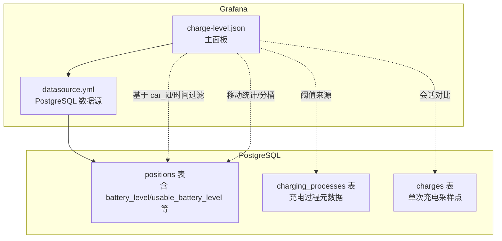
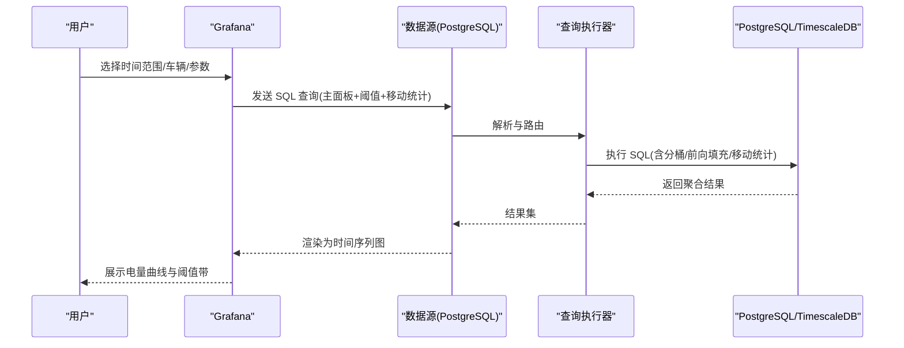
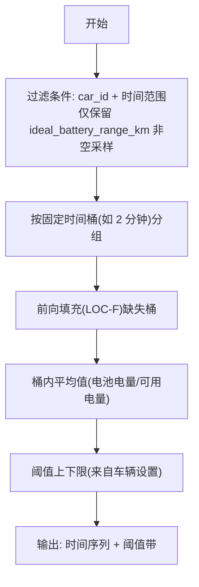
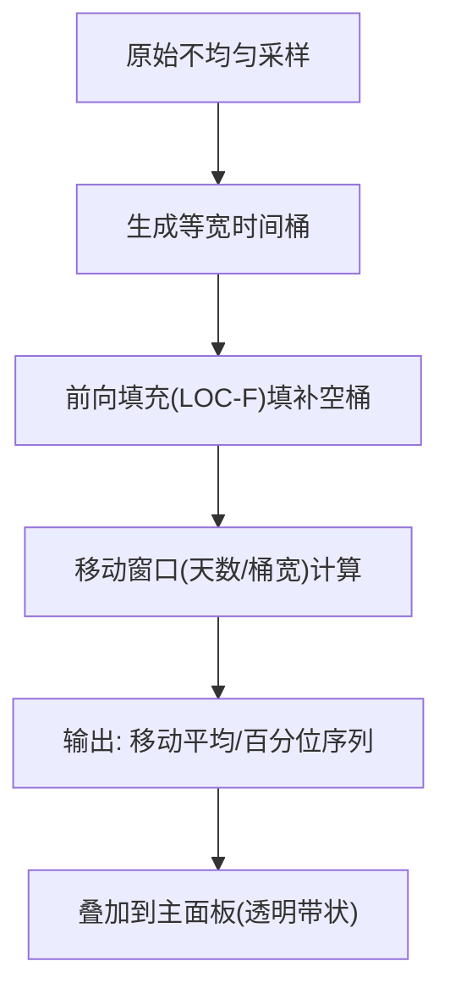
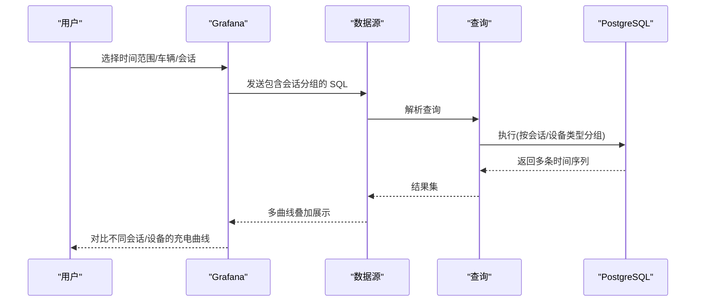
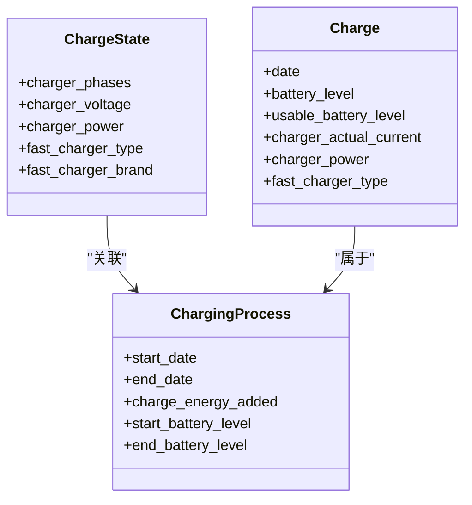
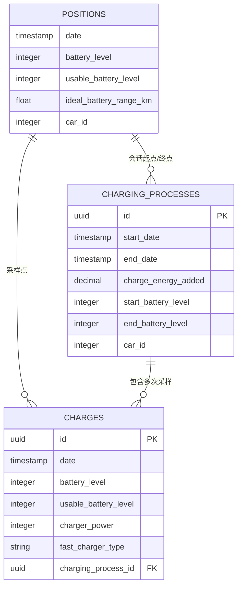

# 电量变化趋势

<cite>
**本文引用的文件**
- [charge-level.json](file://grafana/dashboards/charge-level.json)
- [charge-details.json](file://grafana/dashboards/internal/charge-details.json)
- [drive-details.json](file://grafana/dashboards/internal/drive-details.json)
- [positions.exs](file://priv/repo/migrations/20190330170000_create_positions.exs)
- [20200103073606_add_usable_battery_level.exs](file://priv/repo/migrations/20200103073606_add_usable_battery_level.exs)
- [20240915193446_composite_index_with_predicate_to_position.exs](file://priv/repo/migrations/20240915193446_composite_index_with_predicate_to_position.exs)
- [statistics.json](file://grafana/dashboards/statistics.json)
- [trip.json](file://grafana/dashboards/trip.json)
- [charge.ex](file://lib/teslamate/log/charge.ex)
- [charging_process.ex](file://lib/teslamate/log/charging_process.ex)
- [state.ex](file://lib/tesla_api/vehicle/state.ex)
- [datasource.yml](file://grafana/datasource.yml)
</cite>

## 目录
1. [简介](#简介)
2. [项目结构](#项目结构)
3. [核心组件](#核心组件)
4. [架构总览](#架构总览)
5. [详细组件分析](#详细组件分析)
6. [依赖关系分析](#依赖关系分析)
7. [性能考量](#性能考量)
8. [故障排查指南](#故障排查指南)
9. [结论](#结论)
10. [附录](#附录)

## 简介
本文件围绕 Grafana 仪表板 charge-level.json 的“电量变化趋势”可视化展开，系统性说明：
- 如何在充电过程中绘制电池电量（SOC）随时间变化的曲线；
- 如何通过时间分桶与移动统计实现斜率分析，从而识别充电速度变化；
- 如何在同一图表上叠加多个充电会话进行对比；
- 如何区分不同充电设备（家用交流桩、超级充电站直流桩）对充电曲线的影响；
- 针对大规模时间序列数据渲染的查询优化建议，特别是使用 TimescaleDB 连续聚合以提升性能。

## 项目结构
charge-level.json 作为 Grafana 仪表板，依赖 PostgreSQL 数据源读取 TeslaMate 内部存储的车辆位置与充电记录。其核心面板包含三条查询路径：
- 主线：按时间分桶聚合电池电量与可用电量；
- 基线阈值：根据车辆设置动态显示上下限；
- 移动统计：对不均匀采样的数据进行分桶、前向填充与移动百分位计算。

图示来源
- [charge-level.json](file://grafana/dashboards/charge-level.json#L140-L262)
- [datasource.yml](file://grafana/datasource.yml#L1-L20)
- [positions.exs](file://priv/repo/migrations/20190330170000_create_positions.exs#L1-L28)
- [charging_process.ex](file://lib/teslamate/log/charging_process.ex#L1-L61)
- [charge.ex](file://lib/teslamate/log/charge.ex#L1-L68)

章节来源
- [charge-level.json](file://grafana/dashboards/charge-level.json#L140-L262)
- [datasource.yml](file://grafana/datasource.yml#L1-L20)

## 核心组件
- 主面板（Charge Level）
  - 时间序列折线：展示电池电量与可用电量随时间的变化，采用阶梯后插值以更贴近真实采样间隔。
  - 阈值区域：根据车辆设置动态显示上下限，辅助判断是否处于健康区间。
  - 移动统计：对不均匀采样的 SOC 数据进行分桶、前向填充与移动百分位，平滑噪声并突出趋势。
- 模板变量
  - 车辆选择、时间范围、分桶宽度、移动窗口等参数化控制，便于跨车与跨时段对比。
- 数据来源
  - positions 表：记录每条采样点的时间戳与电池状态；
  - charging_processes/charges：用于会话级标注与对比。

章节来源
- [charge-level.json](file://grafana/dashboards/charge-level.json#L60-L115)
- [charge-level.json](file://grafana/dashboards/charge-level.json#L140-L262)
- [charge-level.json](file://grafana/dashboards/charge-level.json#L270-L398)

## 架构总览
charge-level.json 的渲染流程如下：

图示来源
- [charge-level.json](file://grafana/dashboards/charge-level.json#L140-L262)
- [datasource.yml](file://grafana/datasource.yml#L1-L20)

## 详细组件分析

### 组件A：SOC 随时间变化曲线绘制
- 数据来源与字段
  - positions 表包含电池电量与可用电量字段，是主面板折线的基础数据。
- 时间分桶与插值
  - 使用时间分桶函数将不均匀采样转换为规则时间片，并对缺失值进行前向填充，避免折线断层。
  - 折线插值采用阶梯后插，使视觉上更贴合实际采样点。
- 阈值区域
  - 通过模板变量从车辆设置表读取上下限，形成绿色阈值带，直观提示健康区间。

图示来源
- [charge-level.json](file://grafana/dashboards/charge-level.json#L140-L262)

章节来源
- [charge-level.json](file://grafana/dashboards/charge-level.json#L60-L115)
- [charge-level.json](file://grafana/dashboards/charge-level.json#L140-L262)

### 组件B：斜率分析与充电速度变化识别
- 不均匀采样问题
  - 由于采样频率不一致，直接连线会导致视觉误导。charge-level.json 通过“分桶 + 前向填充 + 移动统计”解决该问题。
- 斜率与速度识别
  - 移动平均与移动百分位（如 7.5%、50%、92.5%）可反映充电速率的分布与变化趋势。当中位线或上四分位显著上升且持续，表示充电速度较快；若波动增大，可能表示充电功率下降或环境因素影响。
- 可视化建议
  - 在同一图层叠加移动平均与百分位带，有助于快速识别加速/减速阶段与异常波动。

图示来源
- [charge-level.json](file://grafana/dashboards/charge-level.json#L199-L262)

章节来源
- [charge-level.json](file://grafana/dashboards/charge-level.json#L199-L262)

### 组件C：多充电会话叠加比较
- 会话维度
  - charging_processes/charges 记录了每次充电的起止时间、能量与设备信息，可用于按会话分组对比。
- 实现思路
  - 在 charge-level.json 中，可通过模板变量 car_id 与时间范围筛选不同会话；若需跨会话对比，可在同一面板中启用多查询或使用“按会话分组”的方式叠加。
- 设备类型区分
  - 充电设备类型可由快充品牌/类型字段体现。结合 charging_processes 表的设备信息，可在图例或标注中区分家用交流桩与超级充电站直流桩的充电曲线差异。

图示来源
- [charge-level.json](file://grafana/dashboards/charge-level.json#L140-L262)
- [charging_process.ex](file://lib/teslamate/log/charging_process.ex#L1-L61)
- [charge.ex](file://lib/teslamate/log/charge.ex#L1-L68)

章节来源
- [charge-level.json](file://grafana/dashboards/charge-level.json#L140-L262)
- [charging_process.ex](file://lib/teslamate/log/charging_process.ex#L1-L61)
- [charge.ex](file://lib/teslamate/log/charge.ex#L1-L68)

### 组件D：不同充电设备对曲线的影响
- 字段支撑
  - 充电状态结构体包含快充类型、相数、电压、功率等字段，可用于区分设备类型与功率等级。
- 图表策略
  - 在 charge-level.json 中，可将不同设备类型的会话以不同颜色/线型叠加展示；或在图例中按设备类型分组，观察直流桩的快速充电阶段与交流桩的平缓充电阶段差异。

图示来源
- [state.ex](file://lib/tesla_api/vehicle/state.ex#L1-L71)
- [charging_process.ex](file://lib/teslamate/log/charging_process.ex#L1-L61)
- [charge.ex](file://lib/teslamate/log/charge.ex#L1-L68)

章节来源
- [state.ex](file://lib/tesla_api/vehicle/state.ex#L1-L71)
- [charging_process.ex](file://lib/teslamate/log/charging_process.ex#L1-L61)
- [charge.ex](file://lib/teslamate/log/charge.ex#L1-L68)

## 依赖关系分析
- 数据表依赖
  - charge-level.json 主要依赖 positions 表的电池电量与时间戳；阈值来源于车辆设置；移动统计依赖不均匀采样场景下的分桶与前向填充逻辑。
- 索引与查询
  - positions 表存在针对 ideal_battery_range_km 的谓词索引，有助于在驱动模式下过滤掉行驶时的稀疏采样，减少偏移。
- 设备与会话
  - charging_processes/charges 提供会话级元数据与设备信息，支持跨会话对比与设备类型区分。

图示来源
- [positions.exs](file://priv/repo/migrations/20190330170000_create_positions.exs#L1-L28)
- [20200103073606_add_usable_battery_level.exs](file://priv/repo/migrations/20200103073606_add_usable_battery_level.exs#L1-L9)
- [20240915193446_composite_index_with_predicate_to_position.exs](file://priv/repo/migrations/20240915193446_composite_index_with_predicate_to_position.exs#L1-L9)
- [charging_process.ex](file://lib/teslamate/log/charging_process.ex#L1-L61)
- [charge.ex](file://lib/teslamate/log/charge.ex#L1-L68)

章节来源
- [positions.exs](file://priv/repo/migrations/20190330170000_create_positions.exs#L1-L28)
- [20240915193446_composite_index_with_predicate_to_position.exs](file://priv/repo/migrations/20240915193446_composite_index_with_predicate_to_position.exs#L1-L9)
- [charging_process.ex](file://lib/teslamate/log/charging_process.ex#L1-L61)
- [charge.ex](file://lib/teslamate/log/charge.ex#L1-L68)

## 性能考量
- 当前实现的优化点
  - 使用时间分桶与前向填充，避免因采样不均导致的视觉抖动与计算偏差。
  - 通过模板变量控制桶宽与移动窗口，平衡精度与性能。
- TimescaleDB 连续聚合建议
  - 将 positions 表转换为 TimescaleDB 连续聚合物化视图，预先按固定时间桶聚合电池电量与可用电量，显著降低渲染期查询成本。
  - 对高频采样场景，建议：
    - 创建时间桶（如 2 分钟）的连续聚合，包含平均值、中位数、上下四分位等统计量；
    - 为 car_id/date 建立复合索引，加速时间过滤与会话分组；
    - 在 Grafana 查询中直接读取物化视图，减少复杂窗口与分桶计算。
- 索引与过滤
  - 利用现有谓词索引过滤非充电采样，减少无关数据参与聚合。
  - 在统计类仪表（如 statistics.json）中，使用 date_trunc 与分组聚合，避免全表扫描。

章节来源
- [charge-level.json](file://grafana/dashboards/charge-level.json#L140-L262)
- [statistics.json](file://grafana/dashboards/statistics.json#L677-L690)
- [20240915193446_composite_index_with_predicate_to_position.exs](file://priv/repo/migrations/20240915193446_composite_index_with_predicate_to_position.exs#L1-L9)

## 故障排查指南
- 电量曲线出现断层或跳变
  - 检查是否启用了前向填充（LOC-F）与合适的桶宽；过小桶宽可能导致噪声放大，过大则损失细节。
- 阈值带未显示或颜色异常
  - 确认车辆设置表中上下限字段是否存在；检查阈值查询与面板阈值映射配置。
- 移动统计不生效
  - 确认移动窗口参数（桶宽、天数）与时间范围匹配；检查分桶生成序列与时间过滤条件。
- 设备类型无法区分
  - 确认 charging_processes/charges 是否包含快充类型与品牌字段；在图例或标注中按类型分组展示。

章节来源
- [charge-level.json](file://grafana/dashboards/charge-level.json#L140-L262)
- [charge-level.json](file://grafana/dashboards/charge-level.json#L270-L398)

## 结论
charge-level.json 通过时间分桶、前向填充与移动统计，有效解决了不均匀采样带来的可视化与分析难题，能够清晰呈现充电过程中的 SOC 上升曲线，并通过阈值带与移动百分位辅助识别充电速度变化。结合 TimescaleDB 连续聚合与索引优化，可在大规模时间序列场景下显著提升渲染性能，满足长期趋势分析与多会话对比需求。同时，利用设备类型字段可进一步区分家用交流桩与超级充电站直流桩对曲线的影响，为用户优化充电策略提供直观依据。

## 附录
- 相关仪表与字段参考
  - charge-details.json：展示 SOC、功率、电压等字段，便于理解充电状态。
  - drive-details.json：展示 SOC 与可用电量的单位与显示名称，便于统一命名。
  - trip.json：包含充电会话时长统计，可辅助定位异常会话。

章节来源
- [charge-details.json](file://grafana/dashboards/internal/charge-details.json#L106-L160)
- [drive-details.json](file://grafana/dashboards/internal/drive-details.json#L260-L365)
- [trip.json](file://grafana/dashboards/trip.json#L461-L526)