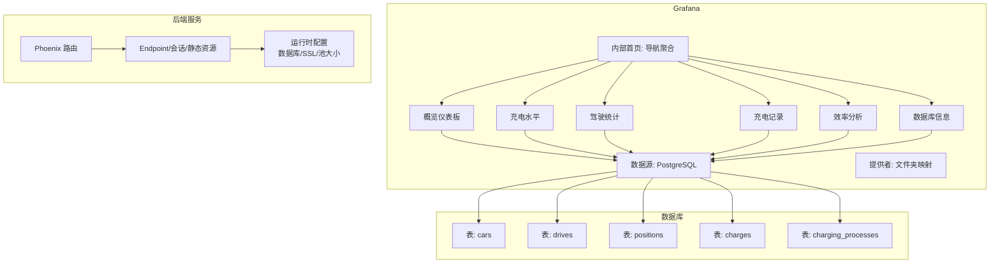
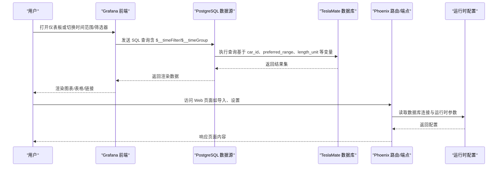
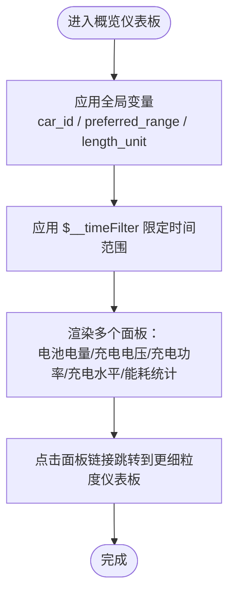
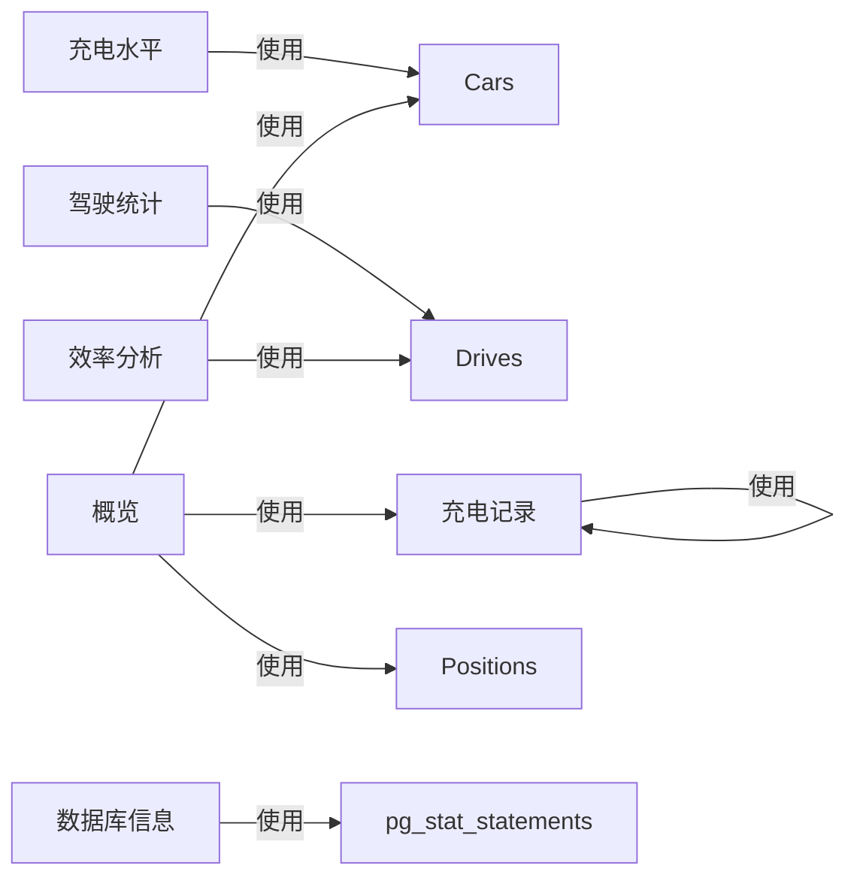

# 可视化概览

<cite>
**本文引用的文件**
- [grafana/datasource.yml](file://grafana/datasource.yml)
- [grafana/dashboards.yml](file://grafana/dashboards.yml)
- [grafana/dashboards/internal/home.json](file://grafana/dashboards/internal/home.json)
- [grafana/dashboards/overview.json](file://grafana/dashboards/overview.json)
- [grafana/dashboards/charge-level.json](file://grafana/dashboards/charge-level.json)
- [grafana/dashboards/drive-stats.json](file://grafana/dashboards/drive-stats.json)
- [grafana/dashboards/charges.json](file://grafana/dashboards/charges.json)
- [grafana/dashboards/efficiency.json](file://grafana/dashboards/efficiency.json)
- [grafana/dashboards/database-info.json](file://grafana/dashboards/database-info.json)
- [lib/teslamate_web/router.ex](file://lib/teslamate_web/router.ex)
- [lib/teslamate/settings/global_settings.ex](file://lib/teslamate/settings/global_settings.ex)
- [config/runtime.exs](file://config/runtime.exs)
- [lib/teslamate_web/endpoint.ex](file://lib/teslamate_web/endpoint.ex)
- [priv/repo/migrations/20190330150000_create_car.exs](file://priv/repo/migrations/20190330150000_create_car.exs)
- [priv/repo/migrations/20190330160000_create_trips.exs](file://priv/repo/migrations/20190330160000_create_trips.exs)
- [priv/repo/migrations/20190913175011_add_rated_range_to_drives.exs](file://priv/repo/migrations/20190913175011_add_rated_range_to_drives.exs)
- [priv/repo/migrations/20190717184003_add_fkey_indexes.exs](file://priv/repo/migrations/20190717184003_add_fkey_indexes.exs)
- [priv/repo/migrations/20190416125429_add_indexes_on_dates.exs](file://priv/repo/migrations/20190416125429_add_indexes_on_dates.exs)
- [website/docs/development.mdx](file://website/docs/development.mdx)
</cite>

## 目录
1. [简介](#简介)
2. [项目结构](#项目结构)
3. [核心组件](#核心组件)
4. [架构总览](#架构总览)
5. [详细组件分析](#详细组件分析)
6. [依赖分析](#依赖分析)
7. [性能考虑](#性能考虑)
8. [故障排查指南](#故障排查指南)
9. [结论](#结论)
10. [附录](#附录)

## 简介
本文件为 TeslaMate 数据可视化系统的综合概览文档，聚焦 Grafana 在整体架构中的角色与职责，梳理仪表板之间的导航结构与数据流关系，解释核心指标（如里程、充电状态、车辆状态）在不同仪表板中的一致性呈现方式，并说明时间范围选择、车辆筛选器等全局交互控件的使用方法。同时，提供系统级最佳实践（性能优化建议与资源消耗监控），以及通过变量与模板实现跨仪表板的动态数据查询策略。

## 项目结构
- Grafana 配置与仪表板：
  - 数据源：PostgreSQL，连接到 TeslaMate 后端数据库。
  - 提供者：按文件夹组织仪表板，包含内部仪表板、报告仪表板与常规仪表板。
  - 内部首页：聚合导航入口，展示所有仪表板列表与新闻源。
- 后端服务：
  - Phoenix 路由与端点：提供 Web 访问、会话管理与健康检查。
  - 运行时配置：数据库连接参数、SSL、池大小、超时等。
- 数据模型（迁移）：
  - 车辆、行程、位置、充电过程等核心表结构与索引，支撑 Grafana 查询。

图表来源
- [grafana/datasource.yml](file://grafana/datasource.yml#L1-L20)
- [grafana/dashboards.yml](file://grafana/dashboards.yml#L1-L34)
- [grafana/dashboards/internal/home.json](file://grafana/dashboards/internal/home.json#L1-L115)
- [lib/teslamate_web/router.ex](file://lib/teslamate_web/router.ex#L1-L65)
- [lib/teslamate_web/endpoint.ex](file://lib/teslamate_web/endpoint.ex#L1-L44)
- [config/runtime.exs](file://config/runtime.exs#L100-L167)

章节来源
- [grafana/datasource.yml](file://grafana/datasource.yml#L1-L20)
- [grafana/dashboards.yml](file://grafana/dashboards.yml#L1-L34)
- [grafana/dashboards/internal/home.json](file://grafana/dashboards/internal/home.json#L1-L115)
- [lib/teslamate_web/router.ex](file://lib/teslamate_web/router.ex#L1-L65)
- [lib/teslamate_web/endpoint.ex](file://lib/teslamate_web/endpoint.ex#L1-L44)
- [config/runtime.exs](file://config/runtime.exs#L100-L167)

## 核心组件
- Grafana 数据源与提供者
  - 数据源：PostgreSQL，使用环境变量注入主机、端口、SSL 模式、数据库名与凭据；默认启用。
  - 提供者：将本地 JSON 仪表板目录映射到 Grafana 组织下的多个文件夹（常规、内部、报告），支持自动更新。
- 仪表板导航与一致性
  - 内部首页作为统一入口，列出所有仪表板并支持搜索与最近查看。
  - 多个仪表板均使用相同的全局变量（如 car_id、preferred_range、length_unit、base_url）以确保跨面板一致的数据上下文。
- 全局交互控件
  - 时间范围：Grafana 时间选择器与面板内时间宏（如 $__timeFilter）配合使用。
  - 车辆筛选器：通过 car_id 变量进行筛选，部分面板支持“全部”选项。
  - 单位与偏好：preferred_range（理想/标称）、length_unit（公里/英里）、温度单位等由全局设置驱动。

章节来源
- [grafana/datasource.yml](file://grafana/datasource.yml#L1-L20)
- [grafana/dashboards.yml](file://grafana/dashboards.yml#L1-L34)
- [grafana/dashboards/internal/home.json](file://grafana/dashboards/internal/home.json#L1-L115)
- [grafana/dashboards/overview.json](file://grafana/dashboards/overview.json#L1-L200)
- [grafana/dashboards/charge-level.json](file://grafana/dashboards/charge-level.json#L1-L120)
- [lib/teslamate/settings/global_settings.ex](file://lib/teslamate/settings/global_settings.ex#L1-L130)

## 架构总览
Grafana 作为可视化前端，通过 PostgreSQL 数据源访问 TeslaMate 的数据库。Phoenix 路由与端点负责 Web 层面的请求处理与静态资源服务。全局变量与模板机制贯穿各仪表板，确保跨面板的一致性与可复用性。

图表来源
- [grafana/dashboards/charge-level.json](file://grafana/dashboards/charge-level.json#L1-L120)
- [grafana/dashboards/drive-stats.json](file://grafana/dashboards/drive-stats.json#L1-L120)
- [grafana/dashboards/charges.json](file://grafana/dashboards/charges.json#L1-L120)
- [lib/teslamate_web/router.ex](file://lib/teslamate_web/router.ex#L1-L65)
- [lib/teslamate_web/endpoint.ex](file://lib/teslamate_web/endpoint.ex#L1-L44)
- [config/runtime.exs](file://config/runtime.exs#L100-L167)

## 详细组件分析

### Grafana 数据源与提供者
- 数据源配置要点
  - 使用环境变量注入主机、端口、SSL 模式、数据库名与密码。
  - 默认启用，作为所有面板的默认数据源。
- 提供者配置要点
  - 将本地路径映射到 Grafana 组织下的文件夹，支持自动更新与 UI 更新。
  - 区分常规、内部、报告三类仪表板集合。

章节来源
- [grafana/datasource.yml](file://grafana/datasource.yml#L1-L20)
- [grafana/dashboards.yml](file://grafana/dashboards.yml#L1-L34)

### 内部首页（导航聚合）
- 功能概述
  - 列出所有仪表板，支持搜索与最近查看。
  - 内嵌新闻源，显示项目发布动态。
  - 隐藏时间选择器，适合全局导航。
- 与全局变量的关系
  - 由于未定义全局变量，首页主要作为导航入口，不直接参与数据查询。

章节来源
- [grafana/dashboards/internal/home.json](file://grafana/dashboards/internal/home.json#L1-L115)

### 概览仪表板（Overview）
- 角色定位
  - 高层概览，展示电池电量、充电电压/功率、充电水平趋势、能耗统计等。
  - 通过 car_id 变量对多车进行重复行展示。
- 关键特性
  - 使用 $__timeFilter 限定时间范围。
  - 使用阈值映射与仪表盘链接跳转到更细粒度的仪表板（如 Charge Level）。
  - 使用转换规则将阈值配置从一个查询帧映射到另一个查询帧，实现一致的阈值展示。

图表来源
- [grafana/dashboards/overview.json](file://grafana/dashboards/overview.json#L1-L200)

章节来源
- [grafana/dashboards/overview.json](file://grafana/dashboards/overview.json#L1-L200)

### 充电水平仪表板（Charge Level）
- 角色定位
  - 专注于电池电量随时间的变化，支持移动平均与百分位计算。
- 关键特性
  - 使用 $__timeGroup 对时间进行分桶与填充，避免不均匀采样偏差。
  - 支持自定义桶宽、是否包含移动平均/百分位、移动窗口宽度等参数。
  - 通过阈值配置限制合理区间，辅助判断电池健康状态。

章节来源
- [grafana/dashboards/charge-level.json](file://grafana/dashboards/charge-level.json#L1-L120)
- [grafana/dashboards/charge-level.json](file://grafana/dashboards/charge-level.json#L120-L260)

### 驾驶统计仪表板（Drive Stats）
- 角色定位
  - 统计每日驾驶次数、总里程、总能耗、日均值等。
- 关键特性
  - 使用 date_trunc 与 generate_series 构造日期基线，保证缺失日期补零。
  - 通过 length_unit 与 preferred_range 实现单位与范围维度的切换。
  - 通过面板间引用（datasource: -- Dashboard --）复用其他面板的计算结果。

章节来源
- [grafana/dashboards/drive-stats.json](file://grafana/dashboards/drive-stats.json#L1-L120)
- [grafana/dashboards/drive-stats.json](file://grafana/dashboards/drive-stats.json#L120-L260)

### 充电记录仪表板（Charges）
- 角色定位
  - 列表化展示每次充电过程，支持按地理围栏、地点、类型、成本与持续时间筛选。
- 关键特性
  - 表格列包含开始/结束电量、耗时、温度、地点、范围增益、成本等。
  - 支持点击跳转到充电详情与设置成本、创建/编辑地理围栏等操作。

章节来源
- [grafana/dashboards/charges.json](file://grafana/dashboards/charges.json#L1-L120)
- [grafana/dashboards/charges.json](file://grafana/dashboards/charges.json#L120-L260)

### 效率分析仪表板（Efficiency）
- 角色定位
  - 计算单位距离能耗（净/总），并按长度单位显示。
- 关键特性
  - 使用 preferred_range 与 length_unit 动态切换理想/标称范围与长度单位。
  - 通过 convert_km 等函数进行单位换算，保证跨面板一致性。

章节来源
- [grafana/dashboards/efficiency.json](file://grafana/dashboards/efficiency.json#L1-L120)
- [grafana/dashboards/efficiency.json](file://grafana/dashboards/efficiency.json#L120-L200)

### 数据库信息仪表板（Database Information）
- 角色定位
  - 展示数据库统计信息，如 pg_stat_statements 的调用次数、平均执行时间、总执行时间与查询文本。
- 关键特性
  - 通过条件查询判断扩展表是否存在，避免在未安装扩展时报错。
  - 支持开关控制是否启用统计查询。

章节来源
- [grafana/dashboards/database-info.json](file://grafana/dashboards/database-info.json#L1705-L1792)

### 全局变量与模板（跨仪表板动态查询）
- 常用变量
  - car_id：车辆筛选器，支持“全部”选项。
  - preferred_range：理想/标称范围切换。
  - length_unit：长度单位（公里/英里）。
  - temp_unit：温度单位（摄氏/华氏）。
  - base_url：后端基础 URL，用于面板内链接跳转。
- 变量来源
  - 从 cars 表与 settings 表查询生成，确保与后端配置一致。
- 应用场景
  - 在多个仪表板中统一使用这些变量，实现跨面板的动态数据查询与一致展示。

章节来源
- [grafana/dashboards/charge-level.json](file://grafana/dashboards/charge-level.json#L270-L398)
- [grafana/dashboards/drive-stats.json](file://grafana/dashboards/drive-stats.json#L1468-L1501)
- [grafana/dashboards/charges.json](file://grafana/dashboards/charges.json#L1345-L1378)
- [grafana/dashboards/statistics.json](file://grafana/dashboards/statistics.json#L1107-L1147)
- [grafana/dashboards/vampire-drain.json](file://grafana/dashboards/vampire-drain.json#L584-L635)
- [lib/teslamate/settings/global_settings.ex](file://lib/teslamate/settings/global_settings.ex#L1-L130)

## 依赖分析
- 组件耦合与协作
  - Grafana 依赖 PostgreSQL 数据源，查询依赖 cars、drives、positions、charges、charging_processes 等表。
  - 仪表板之间通过全局变量与面板间引用实现数据共享与一致性。
- 外部依赖与集成点
  - Phoenix 路由与端点提供 Web 访问与静态资源服务，运行时配置决定数据库连接参数与 SSL 设置。
- 潜在循环依赖
  - 仪表板间通过“面板引用”而非直接 SQL 引用，降低循环依赖风险。
- 接口契约
  - 变量命名与来源（cars、settings）需保持一致，避免跨面板数据错配。

图表来源
- [grafana/dashboards/charge-level.json](file://grafana/dashboards/charge-level.json#L1-L120)
- [grafana/dashboards/drive-stats.json](file://grafana/dashboards/drive-stats.json#L1-L120)
- [grafana/dashboards/charges.json](file://grafana/dashboards/charges.json#L1-L120)
- [grafana/dashboards/efficiency.json](file://grafana/dashboards/efficiency.json#L1-L120)
- [grafana/dashboards/overview.json](file://grafana/dashboards/overview.json#L1-L200)
- [grafana/dashboards/database-info.json](file://grafana/dashboards/database-info.json#L1705-L1792)

章节来源
- [grafana/dashboards/charge-level.json](file://grafana/dashboards/charge-level.json#L1-L120)
- [grafana/dashboards/drive-stats.json](file://grafana/dashboards/drive-stats.json#L1-L120)
- [grafana/dashboards/charges.json](file://grafana/dashboards/charges.json#L1-L120)
- [grafana/dashboards/efficiency.json](file://grafana/dashboards/efficiency.json#L1-L120)
- [grafana/dashboards/overview.json](file://grafana/dashboards/overview.json#L1-L200)
- [grafana/dashboards/database-info.json](file://grafana/dashboards/database-info.json#L1705-L1792)

## 性能考虑
- 查询与时间处理
  - 使用 $__timeFilter 与 $__timeGroup 时，注意时间字段存储为无时区 timestamp 的现状，建议在 DATE_TRUNC 中显式传入 $__timezone，确保按用户时区截断。
- 数据采样与分桶
  - 充电水平仪表板通过分桶与前向填充减少不均匀采样的偏差，但会牺牲一定精度。可根据需要调整桶宽与移动窗口。
- 索引与查询优化
  - 为 positions、charges、drives 等常用查询列建立索引，有助于提升时间序列查询性能。
- 连接与池配置
  - 合理设置数据库池大小与超时，避免高并发下连接争用。
- 监控与诊断
  - 使用数据库信息仪表板中的 pg_stat_statements 查询热点 SQL，识别慢查询并针对性优化。

章节来源
- [website/docs/development.mdx](file://website/docs/development.mdx#L145-L168)
- [priv/repo/migrations/20190416125429_add_indexes_on_dates.exs](file://priv/repo/migrations/20190416125429_add_indexes_on_dates.exs#L1-L8)
- [priv/repo/migrations/20190717184003_add_fkey_indexes.exs](file://priv/repo/migrations/20190717184003_add_fkey_indexes.exs#L1-L22)
- [config/runtime.exs](file://config/runtime.exs#L118-L149)
- [grafana/dashboards/database-info.json](file://grafana/dashboards/database-info.json#L1705-L1792)

## 故障排查指南
- 数据源连接问题
  - 检查 DATABASE_HOST、DATABASE_PORT、DATABASE_NAME、DATABASE_USER、DATABASE_PASS、DATABASE_SSL_MODE 等环境变量是否正确。
  - 如启用 SSL，确认 CA 证书路径与 SNI 设置。
- 仪表板无法加载或空白
  - 确认提供者路径与文件夹映射正确，且 JSON 文件未被外部工具修改导致格式异常。
  - 检查面板中的 $__timeFilter 与 $__timeGroup 是否与数据库时间字段类型匹配。
- 查询性能差
  - 使用数据库信息仪表板查看慢查询，结合索引策略与查询重写优化。
  - 调整分桶宽度与移动窗口，平衡精度与性能。
- 变量未生效
  - 确认变量来源查询返回预期值，且面板中已启用相应变量。
  - 检查 car_id 是否包含“全部”选项，避免误选导致数据为空。

章节来源
- [grafana/datasource.yml](file://grafana/datasource.yml#L1-L20)
- [grafana/dashboards.yml](file://grafana/dashboards.yml#L1-L34)
- [config/runtime.exs](file://config/runtime.exs#L100-L167)
- [website/docs/development.mdx](file://website/docs/development.mdx#L145-L168)
- [grafana/dashboards/database-info.json](file://grafana/dashboards/database-info.json#L1705-L1792)

## 结论
Grafana 在 TeslaMate 数据可视化体系中承担了核心的前端展示与交互职责，通过统一的数据源与变量模板，实现了跨仪表板的一致性与可复用性。概览仪表板提供高层视图，充电水平、驾驶统计、充电记录与效率分析等仪表板分别覆盖不同维度的数据洞察。结合性能优化与资源监控，可进一步提升系统稳定性与用户体验。

## 附录
- 数据模型与索引参考
  - 车辆、行程、位置、充电过程等核心表结构与索引，支撑 Grafana 查询。
- Web 服务与运行时配置
  - Phoenix 路由与端点、运行时配置（数据库连接、SSL、池大小、超时）。

章节来源
- [priv/repo/migrations/20190330150000_create_car.exs](file://priv/repo/migrations/20190330150000_create_car.exs#L1-L18)
- [priv/repo/migrations/20190330160000_create_trips.exs](file://priv/repo/migrations/20190330160000_create_trips.exs#L1-L29)
- [priv/repo/migrations/20190913175011_add_rated_range_to_drives.exs](file://priv/repo/migrations/20190913175011_add_rated_range_to_drives.exs#L1-L29)
- [priv/repo/migrations/20190717184003_add_fkey_indexes.exs](file://priv/repo/migrations/20190717184003_add_fkey_indexes.exs#L1-L22)
- [priv/repo/migrations/20190416125429_add_indexes_on_dates.exs](file://priv/repo/migrations/20190416125429_add_indexes_on_dates.exs#L1-L8)
- [lib/teslamate_web/router.ex](file://lib/teslamate_web/router.ex#L1-L65)
- [lib/teslamate_web/endpoint.ex](file://lib/teslamate_web/endpoint.ex#L1-L44)
- [config/runtime.exs](file://config/runtime.exs#L100-L167)