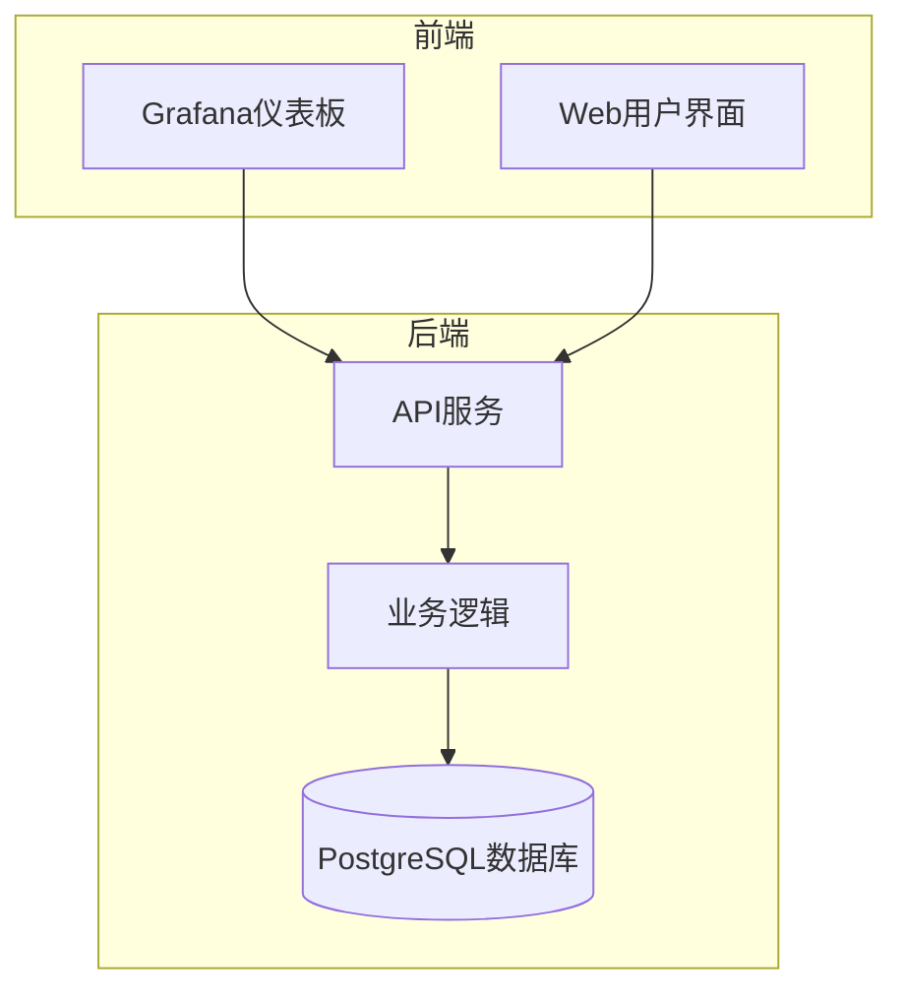
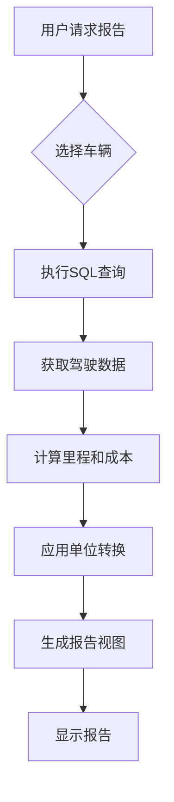
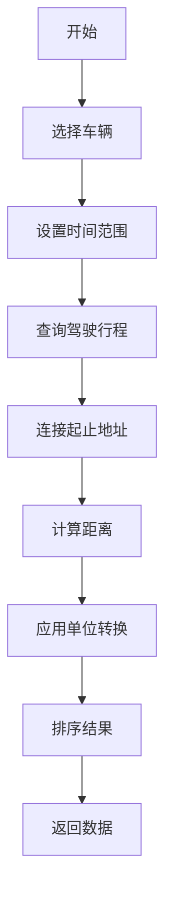
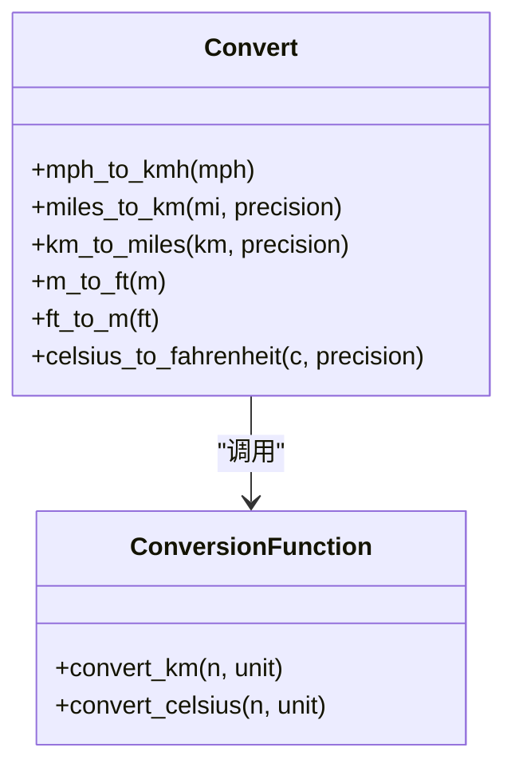
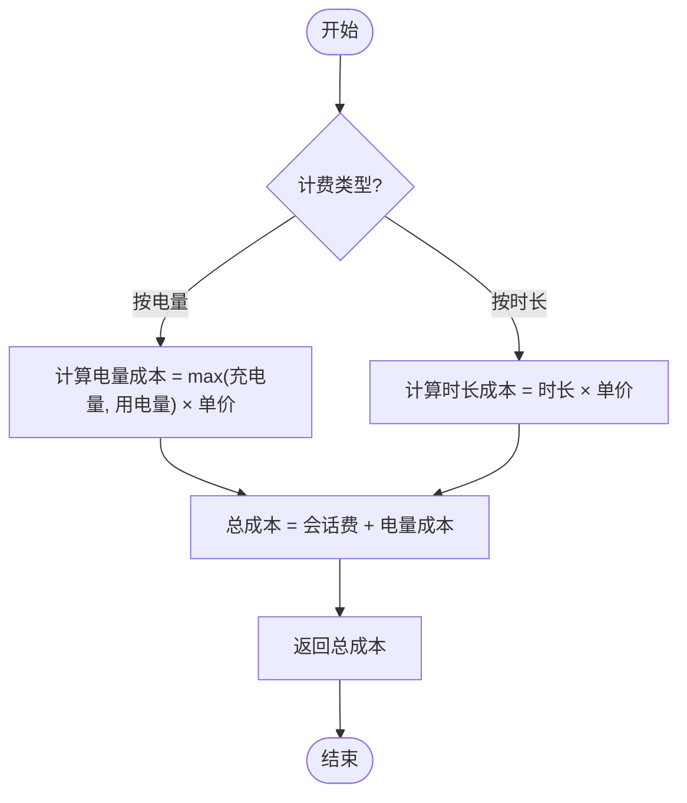
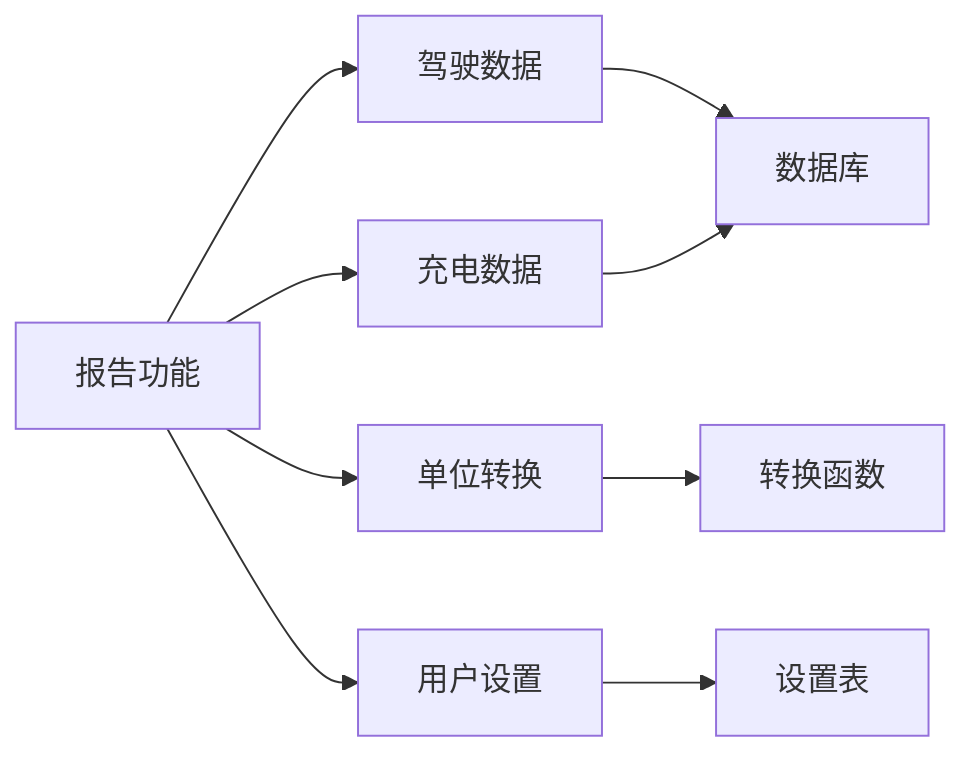

# 报告与税务可视化

<cite>
**本文档引用的文件**
- [dutch-tax.json](file://grafana/dashboards/reports/dutch-tax.json)
- [convert.ex](file://lib/teslamate/convert.ex)
- [log.ex](file://lib/teslamate/log.ex)
- [charge_live/cost.ex](file://lib/teslamate_web/live/charge_live/cost.ex)
- [20200528175158_optimize_conversion_helpers.exs](file://priv/repo/migrations/20200528175158_optimize_conversion_helpers.exs)
- [20190330160000_create_trips.exs](file://priv/repo/migrations/20190330160000_create_trips.exs)
- [20190330190000_create_charging_processes.exs](file://priv/repo/migrations/20190330190000_create_charging_processes.exs)
- [20190731154452_create_settings.exs](file://priv/repo/migrations/20190731154452_create_settings.exs)
</cite>

## 目录
1. [简介](#简介)
2. [项目结构](#项目结构)
3. [核心组件](#核心组件)
4. [架构概述](#架构概述)
5. [详细组件分析](#详细组件分析)
6. [依赖分析](#依赖分析)
7. [性能考虑](#性能考虑)
8. [故障排除指南](#故障排除指南)
9. [结论](#结论)
10. [附录](#附录)（如有必要）

## 简介
本文档详细介绍了TeslaMate系统中的报告功能，重点分析荷兰税务报告（dutch-tax.json）的生成逻辑和数据计算方法。文档涵盖了里程统计、充电成本计算和使用模式分析等高级分析功能。同时，解释了如何自定义报告模板以满足不同国家或地区的税务要求，提供了数据导出和报告生成的最佳实践，包括自动化报告生成和数据验证流程，并描述了如何扩展报告功能以支持其他类型的分析报告。

## 项目结构
TeslaMate项目采用模块化架构，主要包含资产、配置、Grafana仪表板、核心逻辑库等组件。报告功能主要通过Grafana的JSON仪表板文件实现，特别是位于`grafana/dashboards/reports/`目录下的`dutch-tax.json`文件。系统使用Ecto进行数据库迁移和管理，数据模型包括车辆、驾驶行程、充电过程等核心实体。

**图表来源**
- [dutch-tax.json](file://grafana/dashboards/reports/dutch-tax.json)
- [20190330160000_create_trips.exs](file://priv/repo/migrations/20190330160000_create_trips.exs)

**章节来源**
- [dutch-tax.json](file://grafana/dashboards/reports/dutch-tax.json)
- [project_structure](file://project_structure)

## 核心组件
本系统的核心报告功能由Grafana仪表板、数据库查询逻辑和单位转换服务三部分组成。`dutch-tax.json`文件定义了荷兰税务报告的结构和数据查询方式，通过SQL查询从PostgreSQL数据库中提取驾驶行程数据。系统提供了完整的单位转换功能，支持公里与英里、摄氏度与华氏度之间的转换，确保报告数据符合用户所在地区的计量习惯。

**章节来源**
- [dutch-tax.json](file://grafana/dashboards/reports/dutch-tax.json)
- [convert.ex](file://lib/teslamate/convert.ex)

## 架构概述
系统采用分层架构，前端使用Grafana进行数据可视化，后端使用Elixir/Phoenix框架处理业务逻辑，数据持久化层使用PostgreSQL数据库。报告生成功能通过预定义的JSON配置文件实现，这些文件包含数据查询语句、可视化设置和模板变量。当用户请求报告时，系统执行相应的SQL查询，获取数据后通过Grafana渲染成最终的报告视图。

**图表来源**
- [dutch-tax.json](file://grafana/dashboards/reports/dutch-tax.json)
- [log.ex](file://lib/teslamate/log.ex)

## 详细组件分析

### 荷兰税务报告分析
荷兰税务报告（dutch-tax.json）主要用于生成符合荷兰税务要求的驾驶记录报告。该报告包含驾驶ID、开始和结束时间、起止里程、起止地址和驾驶时长等关键信息，为税务申报提供准确的数据支持。

#### 报告数据查询逻辑

**图表来源**
- [dutch-tax.json](file://grafana/dashboards/reports/dutch-tax.json#L318-L345)

#### 单位转换实现
系统通过数据库函数和Elixir模块双重机制实现单位转换。在数据库层面，使用`convert_km`函数进行距离单位转换；在应用层面，通过`TeslaMate.Convert`模块提供更复杂的转换逻辑。

**图表来源**
- [convert.ex](file://lib/teslamate/convert.ex#L1-L34)
- [20200528175158_optimize_conversion_helpers.exs](file://priv/repo/migrations/20200528175158_optimize_conversion_helpers.exs#L1-L45)

**章节来源**
- [convert.ex](file://lib/teslamate/convert.ex#L1-L34)
- [20200528175158_optimize_conversion_helpers.exs](file://priv/repo/migrations/20200528175158_optimize_conversion_helpers.exs#L1-L45)

### 充电成本计算分析
充电成本计算是税务报告的重要组成部分，系统支持按电量（per kWh）和按时长（per minute）两种计费模式。

#### 充电成本计算流程

**图表来源**
- [log.ex](file://lib/teslamate/log.ex#L591-L627)
- [charge_live/cost.ex](file://lib/teslamate_web/live/charge_live/cost.ex#L1-L53)

**章节来源**
- [log.ex](file://lib/teslamate/log.ex#L591-L627)
- [charge_live/cost.ex](file://lib/teslamate_web/live/charge_live/cost.ex#L1-L53)

## 依赖分析
系统各组件之间存在明确的依赖关系。报告功能依赖于数据库中的驾驶和充电数据，这些数据由车辆状态监控服务持续更新。单位转换功能被报告生成、数据展示等多个模块共享使用。设置模块为所有功能提供用户偏好配置，包括默认的计量单位和显示语言。

**图表来源**
- [dutch-tax.json](file://grafana/dashboards/reports/dutch-tax.json)
- [20190731154452_create_settings.exs](file://priv/repo/migrations/20190731154452_create_settings.exs)

**章节来源**
- [dutch-tax.json](file://grafana/dashboards/reports/dutch-tax.json)
- [20190731154452_create_settings.exs](file://priv/repo/migrations/20190731154452_create_settings.exs)

## 性能考虑
为确保报告生成的高效性，系统采用了多项优化措施。数据库查询使用了适当的索引，特别是对`start_date`和`car_id`字段的复合索引，大大提高了时间范围查询的性能。单位转换函数被定义为数据库级别的SQL函数，避免了应用层和数据库层之间的大量数据传输。对于大型数据集，系统支持分页查询和数据聚合，防止内存溢出。

## 故障排除指南
当报告数据出现异常时，应按照以下步骤进行排查：首先检查相关车辆的数据采集是否正常，确认车辆在线状态和数据同步情况；其次验证充电成本设置是否正确，特别是地理围栏（geofence）的计费类型和单价设置；然后检查单位转换设置，确保系统设置中的长度和温度单位符合预期；最后确认时间范围选择是否正确，避免因时区设置导致的数据范围偏差。

**章节来源**
- [log.ex](file://lib/teslamate/log.ex#L591-L627)
- [charge_live/cost.ex](file://lib/teslamate_web/live/charge_live/cost.ex#L1-L53)
- [20190731154452_create_settings.exs](file://priv/repo/migrations/20190731154452_create_settings.exs)

## 结论
TeslaMate的报告功能通过Grafana仪表板和后端逻辑的紧密结合，实现了强大的数据分析和可视化能力。荷兰税务报告作为典型案例，展示了系统如何通过灵活的查询配置和数据处理逻辑满足特定地区的合规要求。系统的模块化设计和可扩展架构使得添加新的报告类型变得简单高效，只需创建相应的JSON配置文件并确保数据模型支持所需的查询字段即可。

## 附录
### 数据模型摘要
| 表名 | 主要字段 | 说明 |
|------|---------|------|
| drives | id, start_date, end_date, start_km, end_km, distance, car_id | 驾驶行程记录 |
| charging_processes | id, start_date, end_date, charge_energy_added, start_soc, end_soc, car_id | 充电过程记录 |
| settings | unit_of_length, unit_of_temperature, preferred_range, base_url | 系统设置 |

**章节来源**
- [20190330160000_create_trips.exs](file://priv/repo/migrations/20190330160000_create_trips.exs)
- [20190330190000_create_charging_processes.exs](file://priv/repo/migrations/20190330190000_create_charging_processes.exs)
- [20190731154452_create_settings.exs](file://priv/repo/migrations/20190731154452_create_settings.exs)