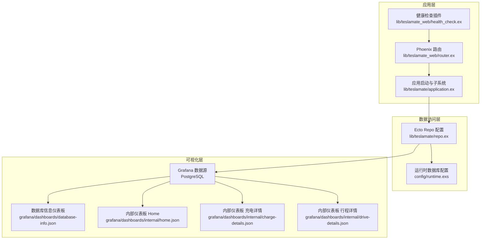
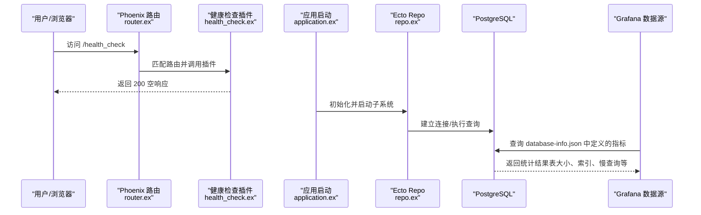
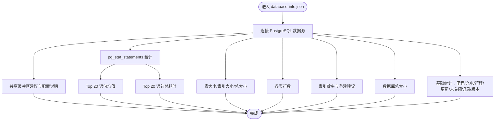
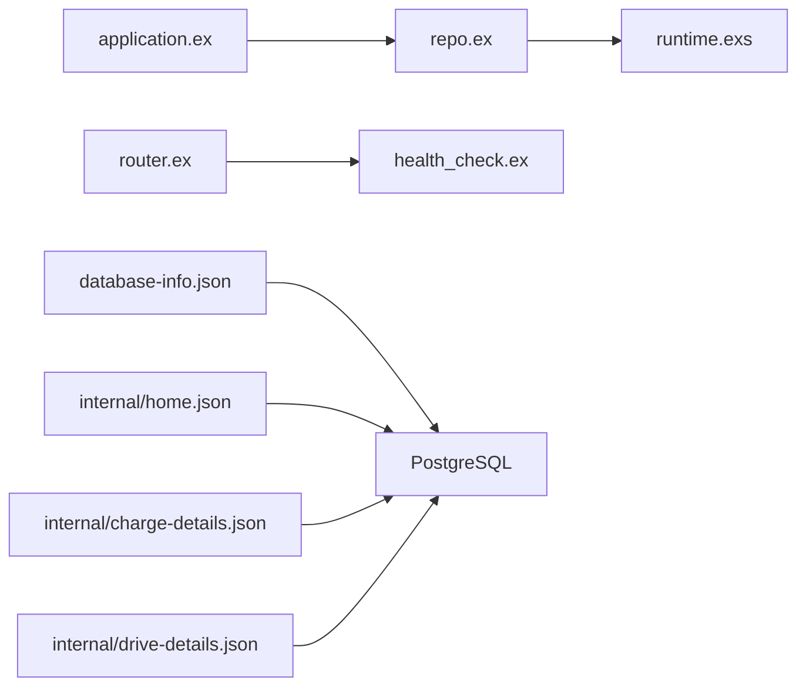

# 系统与数据库可视化

<cite>
**本文引用的文件**
- [grafana/dashboards/database-info.json](file://grafana/dashboards/database-info.json)
- [grafana/dashboards/internal/home.json](file://grafana/dashboards/internal/home.json)
- [grafana/dashboards/internal/charge-details.json](file://grafana/dashboards/internal/charge-details.json)
- [grafana/dashboards/internal/drive-details.json](file://grafana/dashboards/internal/drive-details.json)
- [lib/teslamate/repo.ex](file://lib/teslamate/repo.ex)
- [lib/teslamate_web/health_check.ex](file://lib/teslamate_web/health_check.ex)
- [lib/teslamate_web/router.ex](file://lib/teslamate_web/router.ex)
- [lib/teslamate/application.ex](file://lib/teslamate/application.ex)
- [lib/teslamate/database_check.ex](file://lib/teslamate/database_check.ex)
- [config/runtime.exs](file://config/runtime.exs)
- [priv/repo/migrations/20200502140646_drop_unused_indexes.exs](file://priv/repo/migrations/20200502140646_drop_unused_indexes.exs)
- [priv/repo/migrations/20230417225712_composite_index_to_position.exs](file://priv/repo/migrations/20230417225712_composite_index_to_position.exs)
- [priv/repo/migrations/20240915193446_composite_index_with_predicate_to_position.exs](file://priv/repo/migrations/20240915193446_composite_index_with_predicate_to_position.exs)
- [website/docs/development.mdx](file://website/docs/development.mdx)
- [website/docs/maintenance/manually_fixing_data.mdx](file://website/docs/maintenance/manually_fixing_data.mdx)
</cite>

## 目录
1. [简介](#简介)
2. [项目结构](#项目结构)
3. [核心组件](#核心组件)
4. [架构总览](#架构总览)
5. [详细组件分析](#详细组件分析)
6. [依赖关系分析](#依赖关系分析)
7. [性能考量](#性能考量)
8. [故障排查指南](#故障排查指南)
9. [结论](#结论)
10. [附录](#附录)

## 简介
本文件面向系统级可视化与数据库健康度监控，聚焦于以下目标：
- 解释 database-info.json 中数据库连接、表大小、索引使用等关键指标的监控方法
- 说明 internal 目录下仪表板的特殊用途（内部调试与性能分析）
- 提供数据库查询优化建议（慢查询分析、索引优化策略）
- 描述如何监控系统资源使用情况（内存、CPU、存储空间），以确保 TeslaMate 稳定运行

## 项目结构
TeslaMate 使用 Elixir/Phoenix 构建后端服务，并通过 Grafana 可视化数据库与运行状态。数据库连接由 Ecto Repo 配置，Grafana 仪表板通过 PostgreSQL 数据源读取数据；内部仪表板用于开发者调试与性能分析。

图表来源
- [lib/teslamate_web/router.ex](file://lib/teslamate_web/router.ex#L1-L65)
- [lib/teslamate_web/health_check.ex](file://lib/teslamate_web/health_check.ex#L1-L14)
- [lib/teslamate/application.ex](file://lib/teslamate/application.ex#L1-L81)
- [lib/teslamate/repo.ex](file://lib/teslamate/repo.ex#L1-L6)
- [config/runtime.exs](file://config/runtime.exs#L100-L159)
- [grafana/dashboards/database-info.json](file://grafana/dashboards/database-info.json#L1-L120)
- [grafana/dashboards/internal/home.json](file://grafana/dashboards/internal/home.json#L1-L115)
- [grafana/dashboards/internal/charge-details.json](file://grafana/dashboards/internal/charge-details.json#L1-L120)
- [grafana/dashboards/internal/drive-details.json](file://grafana/dashboards/internal/drive-details.json#L1-L120)

章节来源
- [lib/teslamate_web/router.ex](file://lib/teslamate_web/router.ex#L1-L65)
- [lib/teslamate_web/health_check.ex](file://lib/teslamate_web/health_check.ex#L1-L14)
- [lib/teslamate/application.ex](file://lib/teslamate/application.ex#L1-L81)
- [lib/teslamate/repo.ex](file://lib/teslamate/repo.ex#L1-L6)
- [config/runtime.exs](file://config/runtime.exs#L100-L159)

## 核心组件
- 数据库连接与配置
  - Ecto Repo 定义了适配器与 OTP 应用名，用于统一数据库访问入口
  - 运行时配置从环境变量加载用户名、密码、主机、端口、池大小、超时、SSL 等参数
- 健康检查
  - 提供 /health_check 路径返回空响应，便于外部探针检测服务可用性
- Grafana 仪表板
  - database-info.json：展示里程、充电/行程统计、软件版本、未关闭记录、PostgreSQL 版本、表大小、行数、索引效率、共享缓冲区、慢查询统计等
  - internal 目录下的仪表板：用于内部调试与性能分析（如充电/行程细节）

章节来源
- [lib/teslamate/repo.ex](file://lib/teslamate/repo.ex#L1-L6)
- [config/runtime.exs](file://config/runtime.exs#L100-L159)
- [lib/teslamate_web/health_check.ex](file://lib/teslamate_web/health_check.ex#L1-L14)
- [grafana/dashboards/database-info.json](file://grafana/dashboards/database-info.json#L1-L120)
- [grafana/dashboards/internal/home.json](file://grafana/dashboards/internal/home.json#L1-L115)
- [grafana/dashboards/internal/charge-details.json](file://grafana/dashboards/internal/charge-details.json#L1-L120)
- [grafana/dashboards/internal/drive-details.json](file://grafana/dashboards/internal/drive-details.json#L1-L120)

## 架构总览
下面的序列图展示了从浏览器到数据库的典型调用链，以及 Grafana 如何通过 PostgreSQL 数据源读取数据。

图表来源
- [lib/teslamate_web/router.ex](file://lib/teslamate_web/router.ex#L1-L65)
- [lib/teslamate_web/health_check.ex](file://lib/teslamate_web/health_check.ex#L1-L14)
- [lib/teslamate/application.ex](file://lib/teslamate/application.ex#L1-L81)
- [lib/teslamate/repo.ex](file://lib/teslamate/repo.ex#L1-L6)
- [grafana/dashboards/database-info.json](file://grafana/dashboards/database-info.json#L1-L120)

## 详细组件分析

### 数据库信息仪表板（database-info.json）解析
该仪表板围绕数据库健康度与性能展开，包含以下关键面板与指标：

- 基础统计
  - 里程对比（已记录 vs 里程表）
  - 充电次数、行程次数
  - 软件版本与车辆更新数量
  - 未关闭的充电/行程数量（提示数据完整性问题）
  - PostgreSQL 版本显示

- 表与索引健康
  - 每张表的数据大小、索引大小、总大小（按总大小降序）
  - 各表行数（按行数降序）
  - 索引效率说明与重建建议（索引膨胀场景）

- 存储总量
  - 数据库总大小统计

- 性能与慢查询
  - pg_stat_statements 开关与启用说明
  - Top 20 语句（按平均执行时间/总执行时间）
  - 共享缓冲区建议值与调整指引

- 系统资源参考
  - 共享缓冲区面板提供“推荐值”说明与 Docker Compose 示例

图表来源
- [grafana/dashboards/database-info.json](file://grafana/dashboards/database-info.json#L1-L120)
- [grafana/dashboards/database-info.json](file://grafana/dashboards/database-info.json#L532-L755)
- [grafana/dashboards/database-info.json](file://grafana/dashboards/database-info.json#L756-L990)
- [grafana/dashboards/database-info.json](file://grafana/dashboards/database-info.json#L990-L1160)
- [grafana/dashboards/database-info.json](file://grafana/dashboards/database-info.json#L1168-L1496)
- [grafana/dashboards/database-info.json](file://grafana/dashboards/database-info.json#L1497-L1778)

章节来源
- [grafana/dashboards/database-info.json](file://grafana/dashboards/database-info.json#L1-L120)
- [grafana/dashboards/database-info.json](file://grafana/dashboards/database-info.json#L532-L755)
- [grafana/dashboards/database-info.json](file://grafana/dashboards/database-info.json#L756-L990)
- [grafana/dashboards/database-info.json](file://grafana/dashboards/database-info.json#L990-L1160)
- [grafana/dashboards/database-info.json](file://grafana/dashboards/database-info.json#L1168-L1496)
- [grafana/dashboards/database-info.json](file://grafana/dashboards/database-info.json#L1497-L1778)

### 内部仪表板（internal）用途说明
- internal/home.json
  - 提供内部仪表板清单与新闻源，便于快速导航与查看发布动态
- internal/charge-details.json
  - 展示单次充电过程中的多维时序数据（SOC、功率、电压、电流、相位、温度等），并提供成本、持续时间、地址/地理围栏等辅助信息
- internal/drive-details.json
  - 展示单次行程的速度、功率、范围、海拔等时序数据，并支持路线地图层展示

这些仪表板主要用于内部调试与性能分析，帮助定位异常数据或查询瓶颈。

章节来源
- [grafana/dashboards/internal/home.json](file://grafana/dashboards/internal/home.json#L1-L115)
- [grafana/dashboards/internal/charge-details.json](file://grafana/dashboards/internal/charge-details.json#L1-L120)
- [grafana/dashboards/internal/drive-details.json](file://grafana/dashboards/internal/drive-details.json#L1-L120)

### 数据库连接与配置
- Ecto Repo
  - 定义了适配器为 PostgreSQL，作为数据库访问的核心抽象
- 运行时配置
  - 从环境变量读取数据库连接参数（用户、密码、主机、端口、池大小、超时、SSL、IPv6 等）
  - 支持通过 UNIX Socket 连接数据库（通过 DATABASE_SOCKET_DIR）

章节来源
- [lib/teslamate/repo.ex](file://lib/teslamate/repo.ex#L1-L6)
- [config/runtime.exs](file://config/runtime.exs#L100-L159)

### 健康检查与系统启动
- 健康检查
  - /health_check 路由由 Plug 插件处理，直接返回 200 空响应，便于外部探针检测服务可用性
- 应用启动
  - 启动时输出系统信息与版本，并在启动子系统前进行 PostgreSQL 版本兼容性检查

章节来源
- [lib/teslamate_web/health_check.ex](file://lib/teslamate_web/health_check.ex#L1-L14)
- [lib/teslamate/application.ex](file://lib/teslamate/application.ex#L1-L81)
- [lib/teslamate/database_check.ex](file://lib/teslamate/database_check.ex#L1-L75)

### 索引优化与迁移实践
- 历史迁移
  - 删除不使用的索引（如基于地理函数的 gist 索引）
  - 在 positions 表上创建复合索引（drive_id + date），并删除旧索引
  - 在 positions 表上添加带谓词的复合索引（car_id + date + (ideal_battery_range_km IS NOT NULL) WHERE 条件）
- 建议
  - 结合 database-info.json 的索引效率面板与 pg_stat_statements 统计，识别低效索引与热点查询
  - 对频繁更新/删除场景，可按维护文档进行 REINDEX

章节来源
- [priv/repo/migrations/20200502140646_drop_unused_indexes.exs](file://priv/repo/migrations/20200502140646_drop_unused_indexes.exs#L1-L8)
- [priv/repo/migrations/20230417225712_composite_index_to_position.exs](file://priv/repo/migrations/20230417225712_composite_index_to_position.exs#L1-L8)
- [priv/repo/migrations/20240915193446_composite_index_with_predicate_to_position.exs](file://priv/repo/migrations/20240915193446_composite_index_with_predicate_to_position.exs#L1-L9)
- [website/docs/maintenance/manually_fixing_data.mdx](file://website/docs/maintenance/manually_fixing_data.mdx#L193-L215)

## 依赖关系分析
- 组件耦合
  - 应用启动依赖 Ecto Repo 与 Endpoint，Repo 依赖运行时配置
  - 路由与健康检查插件共同构成对外接口
  - Grafana 仪表板依赖 PostgreSQL 数据源，database-info.json 依赖 pg_stat_statements 与系统统计视图
- 外部依赖
  - PostgreSQL 版本要求与兼容性检查
  - 环境变量驱动的数据库连接参数

图表来源
- [lib/teslamate/application.ex](file://lib/teslamate/application.ex#L1-L81)
- [lib/teslamate/repo.ex](file://lib/teslamate/repo.ex#L1-L6)
- [config/runtime.exs](file://config/runtime.exs#L100-L159)
- [lib/teslamate_web/router.ex](file://lib/teslamate_web/router.ex#L1-L65)
- [lib/teslamate_web/health_check.ex](file://lib/teslamate_web/health_check.ex#L1-L14)
- [grafana/dashboards/database-info.json](file://grafana/dashboards/database-info.json#L1-L120)
- [grafana/dashboards/internal/home.json](file://grafana/dashboards/internal/home.json#L1-L115)
- [grafana/dashboards/internal/charge-details.json](file://grafana/dashboards/internal/charge-details.json#L1-L120)
- [grafana/dashboards/internal/drive-details.json](file://grafana/dashboards/internal/drive-details.json#L1-L120)

章节来源
- [lib/teslamate/application.ex](file://lib/teslamate/application.ex#L1-L81)
- [lib/teslamate/repo.ex](file://lib/teslamate/repo.ex#L1-L6)
- [config/runtime.exs](file://config/runtime.exs#L100-L159)
- [lib/teslamate_web/router.ex](file://lib/teslamate_web/router.ex#L1-L65)
- [lib/teslamate_web/health_check.ex](file://lib/teslamate_web/health_check.ex#L1-L14)
- [grafana/dashboards/database-info.json](file://grafana/dashboards/database-info.json#L1-L120)
- [grafana/dashboards/internal/home.json](file://grafana/dashboards/internal/home.json#L1-L115)
- [grafana/dashboards/internal/charge-details.json](file://grafana/dashboards/internal/charge-details.json#L1-L120)
- [grafana/dashboards/internal/drive-details.json](file://grafana/dashboards/internal/drive-details.json#L1-L120)

## 性能考量
- 查询与索引优化
  - 使用 database-info.json 的索引效率面板与 pg_stat_statements 统计，识别低效索引与热点查询
  - 参考迁移历史，为高频查询建立合适的复合索引（如 positions 上的 (car_id, date, predicate)）
  - 对频繁更新/删除场景，按维护文档进行 REINDEX
- Dashboard 查询建议
  - 文档建议仅在必要时查询 positions 表，且在 15 秒间隔足够时，可通过 WHERE 条件过滤（如 ideal_battery_range_km IS NOT NULL 和 car_id）
  - 使用 EXPLAIN ANALYZE 分析查询计划，避免不必要的全表扫描
- 连接与资源
  - 合理设置 DATABASE_POOL_SIZE 与 DATABASE_TIMEOUT，避免连接池耗尽或查询超时
  - 共享缓冲区建议值约为系统总内存的 25%，并结合实际负载调整

章节来源
- [website/docs/development.mdx](file://website/docs/development.mdx#L145-L228)
- [website/docs/maintenance/manually_fixing_data.mdx](file://website/docs/maintenance/manually_fixing_data.mdx#L193-L215)
- [config/runtime.exs](file://config/runtime.exs#L118-L122)
- [grafana/dashboards/database-info.json](file://grafana/dashboards/database-info.json#L990-L1160)

## 故障排查指南
- 健康检查失败
  - 访问 /health_check，确认返回 200 空响应；若失败，检查路由与插件是否正确挂载
- 数据库版本不兼容
  - 应用启动时会进行 PostgreSQL 版本检查，不符合要求将抛出错误；请根据要求升级或降级数据库版本
- 索引膨胀与性能下降
  - 查看 database-info.json 的索引效率面板与重建建议；必要时执行 REINDEX
- 慢查询定位
  - 启用 pg_stat_statements 并参考 database-info.json 的 Top 20 面板，优先优化高均值/高总耗时语句
- 连接与池配置
  - 若出现连接池耗尽或超时，适当增大 DATABASE_POOL_SIZE 或缩短 DATABASE_TIMEOUT

章节来源
- [lib/teslamate_web/health_check.ex](file://lib/teslamate_web/health_check.ex#L1-L14)
- [lib/teslamate/application.ex](file://lib/teslamate/application.ex#L1-L81)
- [lib/teslamate/database_check.ex](file://lib/teslamate/database_check.ex#L1-L75)
- [website/docs/maintenance/manually_fixing_data.mdx](file://website/docs/maintenance/manually_fixing_data.mdx#L193-L215)
- [config/runtime.exs](file://config/runtime.exs#L118-L122)
- [grafana/dashboards/database-info.json](file://grafana/dashboards/database-info.json#L1168-L1496)

## 结论
通过 database-info.json 与 internal 仪表板，TeslaMate 实现了对数据库健康度与系统性能的可视化监控。结合索引优化、pg_stat_statements 统计与合理的连接池配置，可以有效提升系统稳定性与查询性能。建议定期审查索引效率、慢查询与存储占用，并按需调整共享缓冲区与连接池参数。

## 附录
- 关键路径参考
  - 数据库连接配置：[config/runtime.exs](file://config/runtime.exs#L100-L159)
  - Ecto Repo 定义：[lib/teslamate/repo.ex](file://lib/teslamate/repo.ex#L1-L6)
  - 健康检查路由：[lib/teslamate_web/router.ex](file://lib/teslamate_web/router.ex#L1-L65)，[lib/teslamate_web/health_check.ex](file://lib/teslamate_web/health_check.ex#L1-L14)
  - 数据库版本检查：[lib/teslamate/application.ex](file://lib/teslamate/application.ex#L1-L81)，[lib/teslamate/database_check.ex](file://lib/teslamate/database_check.ex#L1-L75)
  - 索引迁移历史：[priv/repo/migrations/20200502140646_drop_unused_indexes.exs](file://priv/repo/migrations/20200502140646_drop_unused_indexes.exs#L1-L8)，[priv/repo/migrations/20230417225712_composite_index_to_position.exs](file://priv/repo/migrations/20230417225712_composite_index_to_position.exs#L1-L8)，[priv/repo/migrations/20240915193446_composite_index_with_predicate_to_position.exs](file://priv/repo/migrations/20240915193446_composite_index_with_predicate_to_position.exs#L1-L9)
  - 慢查询与索引建议：[website/docs/development.mdx](file://website/docs/development.mdx#L145-L228)，[website/docs/maintenance/manually_fixing_data.mdx](file://website/docs/maintenance/manually_fixing_data.mdx#L193-L215)
  - 可视化仪表板：[grafana/dashboards/database-info.json](file://grafana/dashboards/database-info.json#L1-L120)，[grafana/dashboards/internal/home.json](file://grafana/dashboards/internal/home.json#L1-L115)，[grafana/dashboards/internal/charge-details.json](file://grafana/dashboards/internal/charge-details.json#L1-L120)，[grafana/dashboards/internal/drive-details.json](file://grafana/dashboards/internal/drive-details.json#L1-L120)