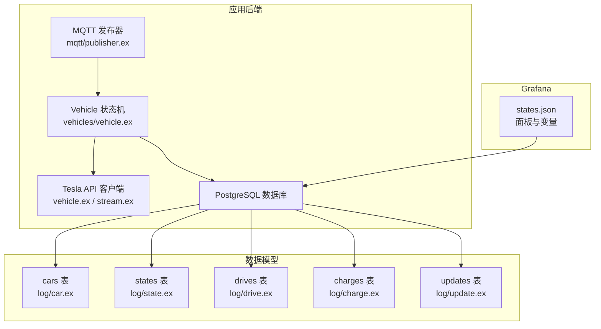
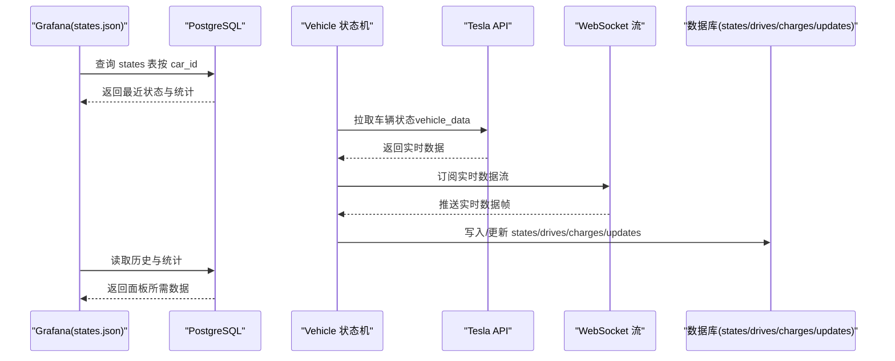
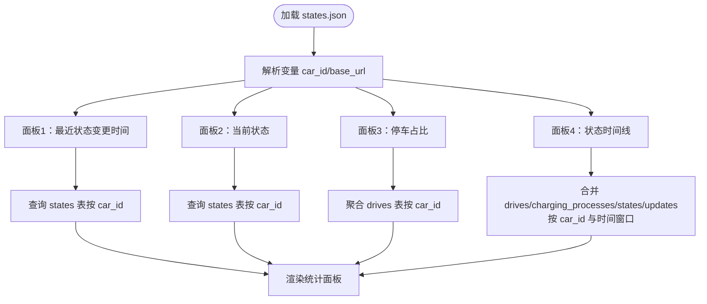
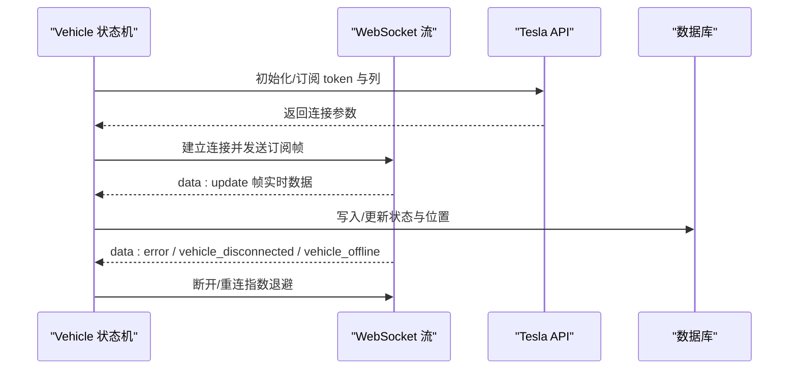
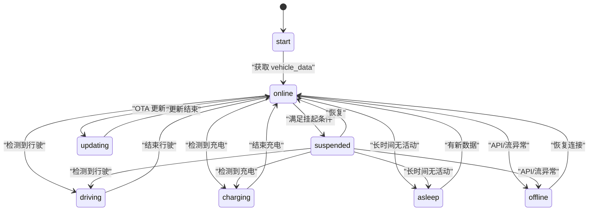
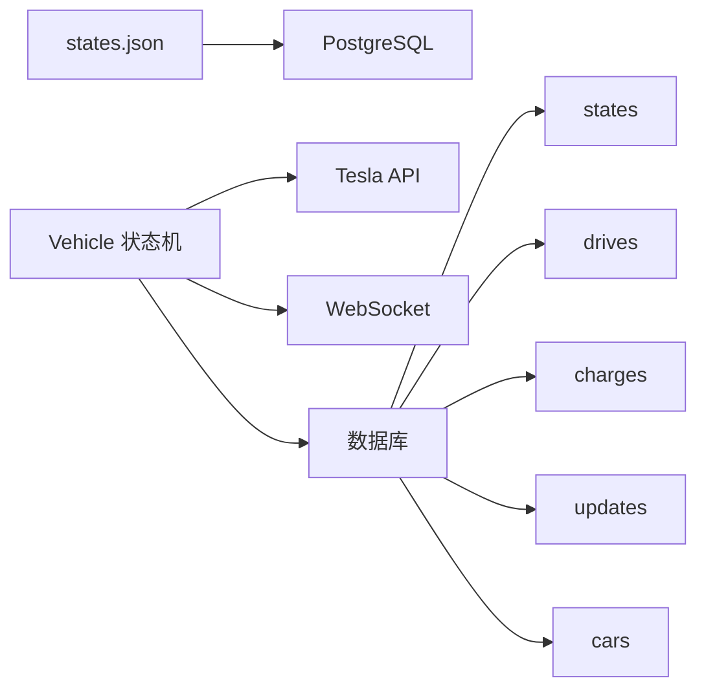

# 实时车辆状态监控

<cite>
**本文引用的文件**
- [states.json](file://grafana/dashboards/states.json)
- [vehicle/state.ex](file://lib/tesla_api/vehicle/state.ex)
- [vehicle.ex](file://lib/tesla_api/vehicle.ex)
- [stream.ex](file://lib/tesla_api/stream.ex)
- [vehicles/vehicle.ex](file://lib/teslamate/vehicles/vehicle.ex)
- [vehicles/vehicle/summary.ex](file://lib/teslamate/vehicles/vehicle/summary.ex)
- [log/state.ex](file://lib/teslamate/log/state.ex)
- [log/drive.ex](file://lib/teslamate/log/drive.ex)
- [log/charge.ex](file://lib/teslamate/log/charge.ex)
- [log/update.ex](file://lib/teslamate/log/update.ex)
- [log/car.ex](file://lib/teslamate/log/car.ex)
- [vehicles.ex](file://lib/teslamate/vehicles.ex)
- [mqtt/publisher.ex](file://lib/teslamate/mqtt/publisher.ex)
- [20190330180000_create_states.exs](file://priv/repo/migrations/20190330180000_create_states.exs)
</cite>

## 目录
1. [简介](#简介)
2. [项目结构](#项目结构)
3. [核心组件](#核心组件)
4. [架构总览](#架构总览)
5. [详细组件分析](#详细组件分析)
6. [依赖关系分析](#依赖关系分析)
7. [性能考虑](#性能考虑)
8. [故障排查指南](#故障排查指南)
9. [结论](#结论)
10. [附录](#附录)

## 简介
本文件面向“实时车辆状态监控”场景，聚焦于 Grafana 仪表板 states.json 的设计与实现。该仪表板通过 Tesla API 获取车辆实时状态（如在线/离线/休眠、驾驶、充电、软件更新等），并结合本地 PostgreSQL 数据库存储的历史状态与行程、充电过程、更新记录等，以可视化方式呈现。本文将解释：
- states.json 中关键指标的定义与含义
- 数据来源与更新机制（Tesla API、本地数据库）
- 异常状态识别方法
- 如何利用 Grafana 变量实现多车辆切换查看
- 常见使用场景与告警建议

## 项目结构
围绕 states.json 的实现，涉及以下关键模块与数据表：
- Grafana 仪表板 states.json：定义面板、查询与变量
- Tesla API 客户端：封装 Tesla Owner API 与 WebSocket 流式接口
- 车辆状态机与汇总：负责状态轮询、流式事件处理、状态持久化
- 数据模型：Ecto Schema 对应数据库表（states、drives、charges、updates、cars）

图表来源
- [states.json](file://grafana/dashboards/states.json#L480-L517)
- [vehicles/vehicle.ex](file://lib/teslamate/vehicles/vehicle.ex#L1-L120)
- [vehicle.ex](file://lib/tesla_api/vehicle.ex#L1-L147)
- [stream.ex](file://lib/tesla_api/stream.ex#L1-L120)
- [mqtt/publisher.ex](file://lib/teslamate/mqtt/publisher.ex#L1-L53)
- [log/car.ex](file://lib/teslamate/log/car.ex#L1-L55)
- [log/state.ex](file://lib/teslamate/log/state.ex#L1-L32)
- [log/drive.ex](file://lib/teslamate/log/drive.ex#L1-L79)
- [log/charge.ex](file://lib/teslamate/log/charge.ex#L1-L68)
- [log/update.ex](file://lib/teslamate/log/update.ex#L1-L27)

章节来源
- [states.json](file://grafana/dashboards/states.json#L480-L517)
- [vehicles/vehicle.ex](file://lib/teslamate/vehicles/vehicle.ex#L1-L120)
- [vehicle.ex](file://lib/tesla_api/vehicle.ex#L1-L147)
- [stream.ex](file://lib/tesla_api/stream.ex#L1-L120)
- [log/state.ex](file://lib/teslamate/log/state.ex#L1-L32)
- [log/drive.ex](file://lib/teslamate/log/drive.ex#L1-L79)
- [log/charge.ex](file://lib/teslamate/log/charge.ex#L1-L68)
- [log/update.ex](file://lib/teslamate/log/update.ex#L1-L27)
- [log/car.ex](file://lib/teslamate/log/car.ex#L1-L55)

## 核心组件
- states.json 仪表板
  - 使用 PostgreSQL 数据源查询 states 表，展示最近一次状态变更时间、当前状态、停车占比等
  - 使用 Grafana 变量 car_id 进行多车切换
- Tesla API 客户端
  - 提供车辆列表与单车数据获取，支持带状态的 vehicle_data 接口
  - 支持 WebSocket 流式订阅，按列拉取实时数据
- 车辆状态机
  - 维护车辆状态机（online/offline/asleep/driving/charging/suspended/updating）
  - 基于定时轮询与流式事件驱动状态转换，并持久化到 states 表
- 数据模型
  - states：记录在线/离线/休眠状态的起止时间
  - drives：记录行程起止、距离、海拔变化等
  - charges：记录充电过程中的能量、功率、范围等
  - updates：记录 OTA 更新起止时间与版本
  - cars：车辆元信息（名称、VIN、品牌配置等）

章节来源
- [states.json](file://grafana/dashboards/states.json#L1-L120)
- [vehicle.ex](file://lib/tesla_api/vehicle.ex#L1-L147)
- [stream.ex](file://lib/tesla_api/stream.ex#L1-L120)
- [vehicles/vehicle.ex](file://lib/teslamate/vehicles/vehicle.ex#L1-L120)
- [log/state.ex](file://lib/teslamate/log/state.ex#L1-L32)
- [log/drive.ex](file://lib/teslamate/log/drive.ex#L1-L79)
- [log/charge.ex](file://lib/teslamate/log/charge.ex#L1-L68)
- [log/update.ex](file://lib/teslamate/log/update.ex#L1-L27)
- [log/car.ex](file://lib/teslamate/log/car.ex#L1-L55)

## 架构总览
下图展示了从 Tesla API 到 Grafana 的完整链路，以及状态机如何将实时数据与历史数据整合到数据库中。

图表来源
- [states.json](file://grafana/dashboards/states.json#L1-L120)
- [vehicles/vehicle.ex](file://lib/teslamate/vehicles/vehicle.ex#L300-L720)
- [stream.ex](file://lib/tesla_api/stream.ex#L1-L120)
- [vehicle.ex](file://lib/tesla_api/vehicle.ex#L50-L96)
- [log/state.ex](file://lib/teslamate/log/state.ex#L1-L32)
- [log/drive.ex](file://lib/teslamate/log/drive.ex#L1-L79)
- [log/charge.ex](file://lib/teslamate/log/charge.ex#L1-L68)
- [log/update.ex](file://lib/teslamate/log/update.ex#L1-L27)

## 详细组件分析

### states.json 仪表板设计与指标
- 面板布局与分组
  - 使用“重复行”按 car_id 分组显示，每辆车一个面板区域
  - 时间范围默认近 2 天，便于观察短期状态变化
- 关键指标
  - 最近状态变更时间：基于 states 表的最新记录
  - 当前状态：基于 states 表的最新记录映射为可读文本
  - 停车占比：基于 drives 表计算，反映车辆在统计周期内的停车比例
  - 状态时间线：合并 drives、charging_processes、states、updates，绘制在线/驾驶/充电/离线/休眠/更新等状态的时间线
- 数据源与查询
  - PostgreSQL 数据源连接 TeslaMate 数据库
  - 使用 $__timeFrom()/ $__timeTo() 与 $__time() 辅助函数进行时间过滤
  - 使用 $car_id 变量筛选特定车辆
- Grafana 变量
  - car_id：查询 cars 表，生成“名称 - 尾号VIN”或“VIN”的显示文本，支持多选
  - base_url：来自 settings 表，用于仪表板链接跳转

图表来源
- [states.json](file://grafana/dashboards/states.json#L1-L120)
- [states.json](file://grafana/dashboards/states.json#L120-L260)
- [states.json](file://grafana/dashboards/states.json#L260-L460)
- [states.json](file://grafana/dashboards/states.json#L460-L517)

章节来源
- [states.json](file://grafana/dashboards/states.json#L1-L120)
- [states.json](file://grafana/dashboards/states.json#L120-L260)
- [states.json](file://grafana/dashboards/states.json#L260-L460)
- [states.json](file://grafana/dashboards/states.json#L460-L517)

### Tesla API 与 WebSocket 流
- Tesla API 客户端
  - 列表与单车数据：提供车辆列表与带状态的 vehicle_data 接口
  - 错误处理：针对 401、404、429、504 等返回进行统一错误包装
- WebSocket 流
  - 订阅指定列的数据流，断线重连与指数退避策略
  - 接收 data:update 帧，解析为结构化数据；处理 data:error、vehicle_disconnected、vehicle_offline 等事件
  - 通过回调将流式数据传递给状态机

图表来源
- [stream.ex](file://lib/tesla_api/stream.ex#L1-L120)
- [stream.ex](file://lib/tesla_api/stream.ex#L120-L272)
- [vehicle.ex](file://lib/tesla_api/vehicle.ex#L1-L147)
- [vehicles/vehicle.ex](file://lib/teslamate/vehicles/vehicle.ex#L438-L720)

章节来源
- [stream.ex](file://lib/tesla_api/stream.ex#L1-L120)
- [stream.ex](file://lib/tesla_api/stream.ex#L120-L272)
- [vehicle.ex](file://lib/tesla_api/vehicle.ex#L1-L147)
- [vehicles/vehicle.ex](file://lib/teslamate/vehicles/vehicle.ex#L438-L720)

### 车辆状态机与数据持久化
- 状态机状态
  - start、online、offline、asleep、driving、charging、suspended、updating
  - 不同状态下的轮询间隔不同，以平衡实时性与资源消耗
- 状态转换
  - 基于 fetch 结果与流式事件触发状态转换
  - 在 driving/charging/suspended 等状态下，优先使用流式数据；其他状态使用定时轮询
- 数据持久化
  - states 表记录状态起止时间
  - drives/charges/updates 表记录行程、充电与更新历史
  - 通过 PubSub 广播摘要，供前端或仪表板订阅

图表来源
- [vehicles/vehicle.ex](file://lib/teslamate/vehicles/vehicle.ex#L1-L120)
- [vehicles/vehicle.ex](file://lib/teslamate/vehicles/vehicle.ex#L740-L900)
- [log/state.ex](file://lib/teslamate/log/state.ex#L1-L32)

章节来源
- [vehicles/vehicle.ex](file://lib/teslamate/vehicles/vehicle.ex#L1-L120)
- [vehicles/vehicle.ex](file://lib/teslamate/vehicles/vehicle.ex#L740-L900)
- [log/state.ex](file://lib/teslamate/log/state.ex#L1-L32)

### 数据模型与查询要点
- states 表
  - 字段：state（枚举 online/offline/asleep）、start_date、end_date、car_id
  - 约束：end_date 为空时必须先完成当前状态；end_date 必须晚于 start_date
- drives 表
  - 记录行程起止、平均内外温、最大/最小功率、起终点位置与地址、海拔变化等
- charges 表
  - 记录充电过程中的电池加热、可用电池等级、充电能量、充电功率、理想/额定续航等
- updates 表
  - 记录 OTA 更新起止时间与版本
- cars 表
  - 车辆元信息（名称、VIN、品牌配置等），与 settings 关联

章节来源
- [log/state.ex](file://lib/teslamate/log/state.ex#L1-L32)
- [log/drive.ex](file://lib/teslamate/log/drive.ex#L1-L79)
- [log/charge.ex](file://lib/teslamate/log/charge.ex#L1-L68)
- [log/update.ex](file://lib/teslamate/log/update.ex#L1-L27)
- [log/car.ex](file://lib/teslamate/log/car.ex#L1-L55)
- [20190330180000_create_states.exs](file://priv/repo/migrations/20190330180000_create_states.exs#L1-L18)

### 关键指标定义与数据更新频率
- 最近状态变更时间
  - 来源：states 表按 car_id 查询最新记录
  - 更新：由状态机在状态切换时写入 end_date/start_date
- 当前状态
  - 来源：states 表最新记录的 state 映射
  - 更新：状态切换时写入
- 停车占比
  - 来源：drives 表聚合，计算总时长内非行驶时间占比
  - 更新：随行程结束而更新
- 状态时间线
  - 来源：合并 drives、charging_processes、states、updates，按时间窗口过滤
  - 更新：实时流与定时轮询共同推进

章节来源
- [states.json](file://grafana/dashboards/states.json#L1-L120)
- [states.json](file://grafana/dashboards/states.json#L120-L260)
- [states.json](file://grafana/dashboards/states.json#L260-L460)
- [vehicles/vehicle.ex](file://lib/teslamate/vehicles/vehicle.ex#L1-L120)

### 异常状态识别方法
- 流式异常
  - vehicle_disconnected：多次断开后触发重连与退避
  - vehicle_offline：流式报告车辆离线，状态机立即发起一次强制获取
  - tokens_expired：令牌过期，状态机停止轮询并等待刷新
- API 异常
  - too_many_request：根据 retry-after 退避
  - vehicle_not_found：熔断并尝试重启服务
  - vehicle_in_service：暂停轮询直至服务结束
- 状态机保护
  - 使用熔断器（fuse）限制错误次数，避免过度请求
  - 在 suspended 状态下，若长时间无活动且流式数据不活跃，主动触发一次状态获取

章节来源
- [stream.ex](file://lib/tesla_api/stream.ex#L120-L272)
- [vehicles/vehicle.ex](file://lib/teslamate/vehicles/vehicle.ex#L300-L720)

### 多车辆切换与变量使用
- car_id 变量
  - 查询 cars 表，生成“名称 - 尾号VIN”或“VIN”的显示文本
  - 支持多选，配合“重复行”按车分组
- base_url 变量
  - 来源于 settings 表，用于仪表板内部链接跳转
- 在 states.json 中
  - 所有查询均使用 $car_id 作为过滤条件
  - 时间窗口使用 $__timeFrom()/ $__timeTo() 自动注入

章节来源
- [states.json](file://grafana/dashboards/states.json#L480-L517)
- [log/car.ex](file://lib/teslamate/log/car.ex#L1-L55)

### 实际使用场景示例
- 远程监控车辆是否已上锁
  - 通过 Tesla API 获取 vehicle_state.locked 字段，结合 states.json 的“当前状态”与“状态时间线”判断上锁/解锁事件
- 充电是否完成
  - 通过 Tesla API 获取 charge_state.charging_state 与 time_to_full_charge，结合 states.json 的“状态时间线”识别从“充电”到“在线”的转换
- 车辆是否在行驶
  - 通过 Tesla API 获取 drive_state.shift_state/power，结合 states.json 的“状态时间线”识别“驾驶”状态
- 车辆是否离线/休眠
  - 通过 states 表与流式事件识别“离线/休眠”，并结合“最近状态变更时间”定位异常时段

章节来源
- [vehicle/state.ex](file://lib/tesla_api/vehicle/state.ex#L276-L394)
- [vehicle.ex](file://lib/tesla_api/vehicle.ex#L50-L96)
- [states.json](file://grafana/dashboards/states.json#L1-L120)

### 告警规则建议（基于仪表板与数据）
- 车辆长时间离线/休眠
  - 规则：当 states 表中连续超过阈值（如 2 小时）未更新 end_date 或出现多次 offline/asleep
  - 触发条件：基于“最近状态变更时间”与“状态时间线”统计
- 充电超时
  - 规则：充电开始后超过预设时长仍未结束，且 time_to_full_charge 未归零
  - 触发条件：结合 drives/charging_processes 与 charge_state
- 车辆异常断开
  - 规则：流式连接频繁断开或 tokens_expired
  - 触发条件：监听流式事件与状态机日志

章节来源
- [states.json](file://grafana/dashboards/states.json#L1-L120)
- [stream.ex](file://lib/tesla_api/stream.ex#L120-L272)
- [vehicles/vehicle.ex](file://lib/teslamate/vehicles/vehicle.ex#L300-L720)

## 依赖关系分析
- 组件耦合
  - states.json 仅依赖 PostgreSQL 数据源与变量，耦合度低
  - Vehicle 状态机依赖 Tesla API 与 WebSocket，同时写入数据库
  - 数据模型之间通过外键关联，形成清晰的层次
- 外部依赖
  - Tesla API：Owner API 与 WebSocket
  - MQTT：用于发布订阅（可选集成）
- 可能的循环依赖
  - 未发现直接循环依赖；状态机通过回调与 PubSub 解耦

图表来源
- [states.json](file://grafana/dashboards/states.json#L480-L517)
- [vehicles/vehicle.ex](file://lib/teslamate/vehicles/vehicle.ex#L1-L120)
- [vehicle.ex](file://lib/tesla_api/vehicle.ex#L1-L147)
- [stream.ex](file://lib/tesla_api/stream.ex#L1-L120)
- [log/state.ex](file://lib/teslamate/log/state.ex#L1-L32)
- [log/drive.ex](file://lib/teslamate/log/drive.ex#L1-L79)
- [log/charge.ex](file://lib/teslamate/log/charge.ex#L1-L68)
- [log/update.ex](file://lib/teslamate/log/update.ex#L1-L27)
- [log/car.ex](file://lib/teslamate/log/car.ex#L1-L55)

章节来源
- [states.json](file://grafana/dashboards/states.json#L480-L517)
- [vehicles/vehicle.ex](file://lib/teslamate/vehicles/vehicle.ex#L1-L120)
- [vehicle.ex](file://lib/tesla_api/vehicle.ex#L1-L147)
- [stream.ex](file://lib/tesla_api/stream.ex#L1-L120)
- [log/state.ex](file://lib/teslamate/log/state.ex#L1-L32)
- [log/drive.ex](file://lib/teslamate/log/drive.ex#L1-L79)
- [log/charge.ex](file://lib/teslamate/log/charge.ex#L1-L68)
- [log/update.ex](file://lib/teslamate/log/update.ex#L1-L27)
- [log/car.ex](file://lib/teslamate/log/car.ex#L1-L55)

## 性能考虑
- 轮询间隔优化
  - 不同状态采用不同轮询间隔，降低 API 压力
- 流式优先
  - 在 driving/charging/suspended 状态下优先使用流式数据，减少轮询
- 数据库索引
  - drives/positions 等高频查询表建议建立复合索引与谓词索引，提升时间窗口查询性能
- 变量缓存
  - car_id 变量定义使用数据库查询，建议确保 cars 表具备合适的索引以加速排序与去重

[本节为通用指导，无需具体文件引用]

## 故障排查指南
- 仪表板无数据
  - 检查 car_id 变量是否正确选择；确认数据库连接正常
  - 查看 states 表是否有最新记录
- 状态长时间不变
  - 检查 Vehicle 状态机日志，确认是否处于 suspended 或 offline
  - 检查流式连接是否断开，关注 vehicle_disconnected 与 tokens_expired
- 充电状态异常
  - 检查 charge_state 与 drives/charges 表数据一致性
  - 关注 API 返回码与 retry-after

章节来源
- [states.json](file://grafana/dashboards/states.json#L480-L517)
- [stream.ex](file://lib/tesla_api/stream.ex#L120-L272)
- [vehicles/vehicle.ex](file://lib/teslamate/vehicles/vehicle.ex#L300-L720)

## 结论
states.json 仪表板通过 Tesla API 与本地数据库的协同，实现了对车辆实时状态的可视化监控。其优势在于：
- 以变量驱动的多车切换能力
- 基于历史与实时数据的综合展示
- 通过状态机与流式接口保障数据的及时性与稳定性
建议在生产环境中结合告警规则与日志监控，进一步提升可观测性与运维效率。

[本节为总结，无需具体文件引用]

## 附录
- 关键字段参考
  - vehicle_state.locked：车辆上锁状态
  - charge_state.charging_state/time_to_full_charge：充电状态与时长
  - drive_state.shift_state/power：行驶状态与瞬时功率
  - states.state：在线/离线/休眠等状态
- 相关文件路径
  - [states.json](file://grafana/dashboards/states.json)
  - [vehicle/state.ex](file://lib/tesla_api/vehicle/state.ex)
  - [vehicle.ex](file://lib/tesla_api/vehicle.ex)
  - [stream.ex](file://lib/tesla_api/stream.ex)
  - [vehicles/vehicle.ex](file://lib/teslamate/vehicles/vehicle.ex)
  - [vehicles/vehicle/summary.ex](file://lib/teslamate/vehicles/vehicle/summary.ex)
  - [log/state.ex](file://lib/teslamate/log/state.ex)
  - [log/drive.ex](file://lib/teslamate/log/drive.ex)
  - [log/charge.ex](file://lib/teslamate/log/charge.ex)
  - [log/update.ex](file://lib/teslamate/log/update.ex)
  - [log/car.ex](file://lib/teslamate/log/car.ex)
  - [vehicles.ex](file://lib/teslamate/vehicles.ex)
  - [mqtt/publisher.ex](file://lib/teslamate/mqtt/publisher.ex)
  - [20190330180000_create_states.exs](file://priv/repo/migrations/20190330180000_create_states.exs)