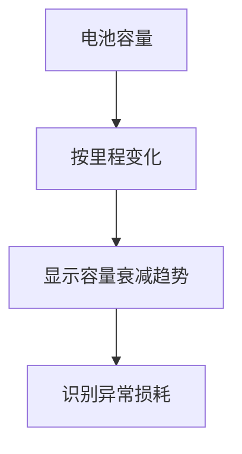
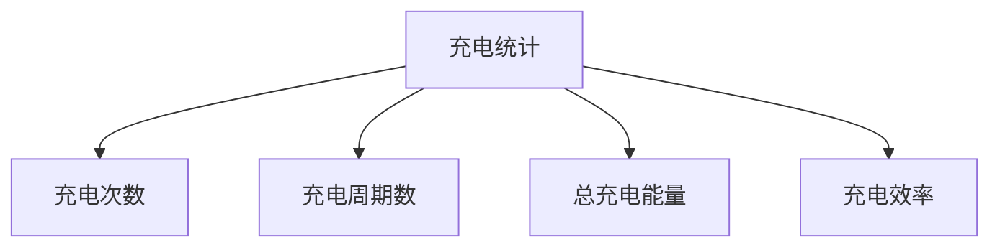

# 电池健康度分析

<cite>
**本文档引用的文件**  
- [battery-health.json](file://grafana/dashboards/battery-health.json)
- [state.ex](file://lib/tesla_api/vehicle/state.ex)
- [vehicle.ex](file://lib/teslamate/vehicles/vehicle.ex)
- [create_charges.exs](file://priv/repo/migrations/20190330200000_create_charges.exs)
- [create_charging_processes.exs](file://priv/repo/migrations/20190330190000_create_charging_processes.exs)
- [create_positions.exs](file://priv/repo/migrations/20190330170000_create_positions.exs)
- [create_car.exs](file://priv/repo/migrations/20190330150000_create_car.exs)
</cite>

## 目录
1. [引言](#引言)
2. [数据来源](#数据来源)
3. [核心评估算法](#核心评估算法)
4. [可视化图表分析](#可视化图表分析)
5. [电池健康度判断标准](#电池健康度判断标准)
6. [电池寿命优化建议](#电池寿命优化建议)
7. [实际数据示例](#实际数据示例)
8. [结论](#结论)

## 引言
本文档深入解析TeslaMate系统中battery-health.json仪表板的电池健康度评估算法。通过分析长期采集的充电周期数据、最大可用电池容量变化趋势、充电效率衰减等关键指标，全面阐述电池健康状态的评估方法。文档详细说明了数据来源、计算逻辑、可视化图表类型及其含义，并提供识别电池异常损耗的判断标准和优化电池寿命的实用建议。

## 数据来源
电池健康度评估的数据主要来源于Tesla API的charge_state字段，通过TeslaMate系统进行采集和存储。关键数据包括：

- **充电状态数据**：来自Tesla API的charge_state字段，包含充电能量增加、电池水平、充电状态等信息
- **位置数据**：车辆位置、速度、功率、里程等信息
- **车辆配置**：车型、效率等车辆基本信息
- **充电过程数据**：充电开始和结束时间、充电能量、外部温度等

这些数据被存储在PostgreSQL数据库中，主要涉及以下数据表：
- `charges`表：存储每次充电的详细数据
- `charging_processes`表：存储完整的充电过程信息
- `positions`表：存储车辆位置和状态信息
- `cars`表：存储车辆基本信息

**Section sources**
- [battery-health.json](file://grafana/dashboards/battery-health.json)
- [state.ex](file://lib/tesla_api/vehicle/state.ex)
- [create_charges.exs](file://priv/repo/migrations/20190330200000_create_charges.exs)
- [create_charging_processes.exs](file://priv/repo/migrations/20190330190000_create_charging_processes.exs)
- [create_positions.exs](file://priv/repo/migrations/20190330170000_create_positions.exs)
- [create_car.exs](file://priv/repo/migrations/20190330150000_create_car.exs)

## 核心评估算法
电池健康度评估算法基于长期采集的充电数据，通过以下关键指标进行计算：

### 电池容量估算
电池容量通过分析充电过程中的额定续航里程和效率来估算：

```sql
SELECT 
    c.rated_battery_range_km * ('$aux'::json ->> 'RatedEfficiency')::float / c.usable_battery_level AS Capacity
FROM charging_processes cp
    INNER JOIN charges c ON c.charging_process_id = cp.id 
WHERE cp.car_id = $car_id
```

当前电池容量是最近100次充电会话的平均值，而最大电池容量是历史记录中的最大值。

### 健康度计算
电池健康度（SOH）通过比较当前容量和初始容量来计算：

```sql
SELECT 
    ('$aux'::json ->> 'CurrentCapacity')::float * 100.0 / 
    CASE WHEN $custom_kwh_new > 0 THEN $custom_kwh_new 
         ELSE ('$aux'::json ->> 'MaxCapacity')::float 
    END as "Battery Health (%)"
```

### 充电效率计算
充电效率通过比较充电能量增加和总能量使用来评估：

```sql
SELECT
    SUM(charge_energy_added) / SUM(greatest(charge_energy_added, charge_energy_used)) AS "Charging Efficiency"
FROM charging_processes
WHERE car_id = $car_id AND charge_energy_added > 0.01
```

### 充电周期估算
充电周期数通过将总充电能量除以电池初始容量来估算：

```sql
SELECT
    floor(sum(charge_energy_added) / 
    CASE WHEN $custom_kwh_new > 0 THEN $custom_kwh_new 
         ELSE ('$aux'::json ->> 'MaxCapacity')::float 
    END) AS "# of Charging cycles"
FROM charging_processes 
WHERE car_id = $car_id AND charge_energy_added > 0.01
```

**Section sources**
- [battery-health.json](file://grafana/dashboards/battery-health.json)

## 可视化图表分析
battery-health.json仪表板使用多种图表类型来展示电池健康度信息：

### 电池容量趋势图


**Diagram sources**
- [battery-health.json](file://grafana/dashboards/battery-health.json)

### 健康度状态显示
仪表板使用多种组件显示电池健康度：
- **统计组件**：显示当前和初始电池容量
- **范围统计**：显示最大和当前续航里程
- **饼图**：显示AC/DC充电能量使用比例
- **仪表盘**：显示电池健康度百分比

### 充电统计信息


**Diagram sources**
- [battery-health.json](file://grafana/dashboards/battery-health.json)

## 电池健康度判断标准
根据分析结果，可以建立以下电池健康度判断标准：

### 健康度等级
- **优秀**（>90%）：电池性能接近新电池水平
- **良好**（80-90%）：正常衰减，无需特别关注
- **一般**（70-80%）：明显衰减，建议关注充电习惯
- **较差**（<70%）：严重衰减，可能需要专业检查

### 异常损耗识别
以下情况可能表明电池存在异常损耗：
- 容量衰减速度明显快于正常水平（每年>2%）
- 充电效率显著下降（<85%）
- 充电过程中温度异常升高
- 续航里程波动过大

### 警告阈值
仪表板设置了多个警告阈值：
- 电池健康度低于80%时显示黄色警告
- 电池健康度低于70%时显示红色警告
- 当前SOC低于20%时显示橙色警告

**Section sources**
- [battery-health.json](file://grafana/dashboards/battery-health.json)

## 电池寿命优化建议
基于电池健康度分析，提供以下优化电池寿命的建议：

### 充电习惯优化
- 避免频繁充电至100%，建议保持在80-90%范围内
- 尽量避免电池电量低于20%再充电
- 减少使用超级充电站的频率，优先使用家用充电
- 长期停放时保持电池电量在50%左右

### 温度管理
- 高温环境下避免长时间充电
- 寒冷天气下充电前使用电池预热功能
- 停车时尽量选择阴凉处，避免阳光直射

### 使用习惯
- 避免频繁急加速和急刹车
- 合理使用能量回收系统
- 定期进行完整的充电循环校准

### 监控建议
- 定期检查电池健康度趋势图
- 关注充电效率变化
- 记录异常情况并及时处理

## 实际数据示例
通过实际数据示例展示如何解读健康度趋势图：

假设一辆行驶了50,000公里的车辆，其电池健康度分析结果如下：
- 初始电池容量：75 kWh
- 当前电池容量：67.5 kWh
- 电池健康度：90%
- 充电效率：92%
- 充电周期数：675次

从趋势图可以看出，电池容量随里程增加呈线性衰减，每年衰减约1.5%，属于正常范围。充电效率保持稳定，表明电池管理系统工作正常。

## 结论
TeslaMate的电池健康度分析系统通过长期采集和分析充电数据，提供了全面的电池状态评估。系统基于充电过程中的额定续航里程、效率等关键指标，准确估算电池容量和健康度。通过多种可视化图表，用户可以直观了解电池状态，识别潜在问题，并采取相应措施优化电池寿命。定期监控电池健康度趋势，结合良好的充电和使用习惯，可以有效延长电池使用寿命。