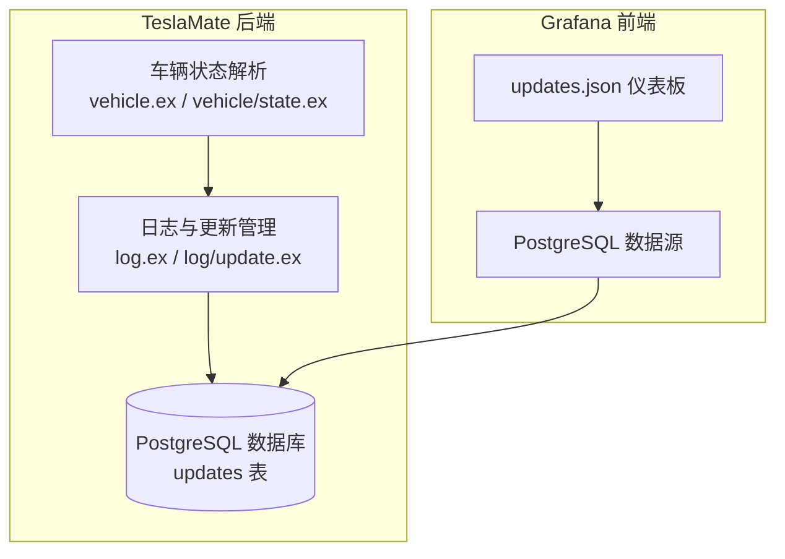
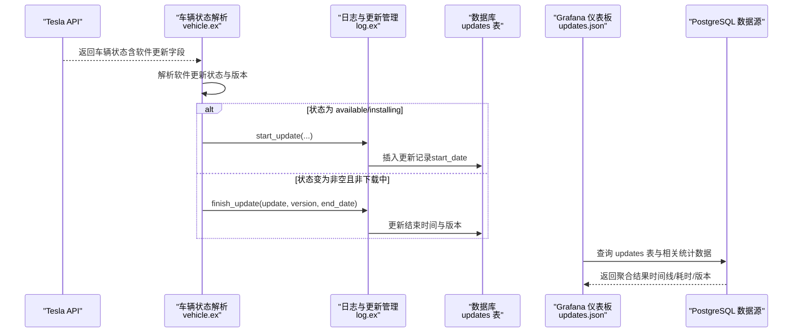
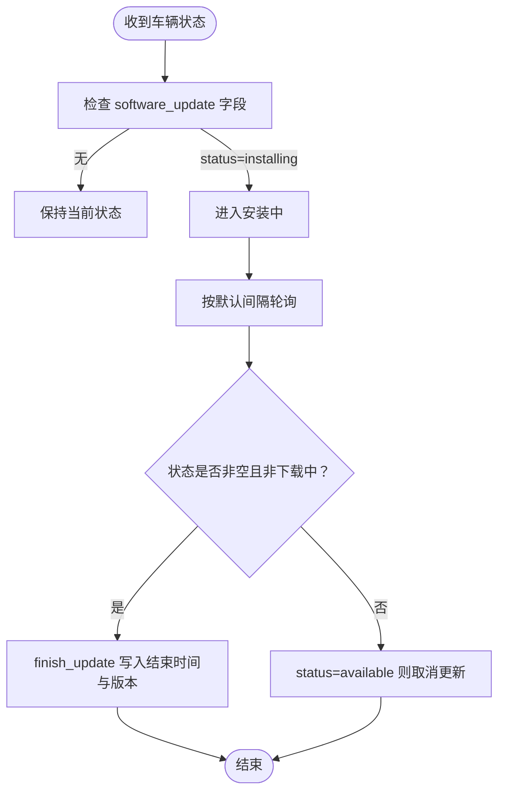
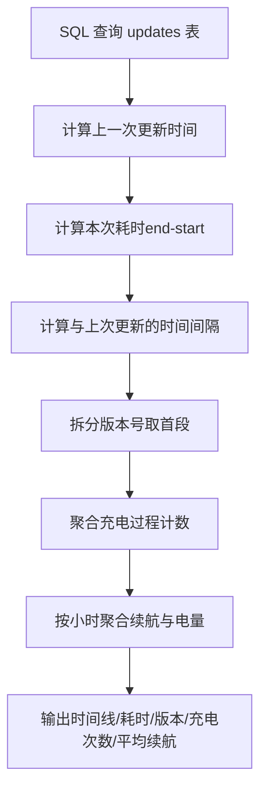

# 系统更新记录

<cite>
**本文引用的文件**
- [grafana/dashboards/updates.json](file://grafana/dashboards/updates.json)
- [priv/repo/migrations/20190408203117_create_updates.exs](file://priv/repo/migrations/20190408203117_create_updates.exs)
- [lib/teslamate/log/update.ex](file://lib/teslamate/log/update.ex)
- [lib/teslamate/log.ex](file://lib/teslamate/log.ex)
- [lib/teslamate/vehicles/vehicle.ex](file://lib/teslamate/vehicles/vehicle.ex)
- [lib/teslamate/vehicles/vehicle/summary.ex](file://lib/teslamate/vehicles/vehicle/summary.ex)
- [lib/tesla_api/vehicle/state.ex](file://lib/tesla_api/vehicle/state.ex)
- [test/teslamate/vehicles/vehicle/updating_test.exs](file://test/teslamate/vehicles/vehicle/updating_test.exs)
- [test/teslamate/vehicles/vehicle_test.exs](file://test/teslamate/vehicles/vehicle_test.exs)
- [priv/repo/migrations/20190913175543_set_start_and_end_rated_range_km.exs](file://priv/repo/migrations/20190913175543_set_start_and_end_rated_range_km.exs)
</cite>

## 目录
1. [简介](#简介)
2. [项目结构](#项目结构)
3. [核心组件](#核心组件)
4. [架构总览](#架构总览)
5. [详细组件分析](#详细组件分析)
6. [依赖关系分析](#依赖关系分析)
7. [性能考量](#性能考量)
8. [故障排查指南](#故障排查指南)
9. [结论](#结论)
10. [附录](#附录)

## 简介
本文件面向TeslaMate用户与维护者，系统化说明“系统更新记录”仪表板（updates.json）如何追踪与展示车辆固件更新历史，覆盖以下关键主题：
- 数据来源：来自车辆状态中的软件更新字段与数据库更新记录表
- 更新状态识别逻辑：可用、下载中、安装中、取消与完成等状态的判定
- 更新前后车辆性能对比：基于充电过程与驾驶过程的范围指标统计
- 时间线视图、版本号变更记录、更新耗时统计
- 如何利用这些信息规划最佳更新时机，以尽量减少对日常使用的影响

## 项目结构
updates.json是Grafana仪表盘配置文件，通过PostgreSQL数据源查询TeslaMate数据库，聚合并可视化“updates”表与相关统计数据。核心数据由后端服务写入数据库，前端仅负责呈现。

图表来源
- [lib/teslamate/vehicles/vehicle.ex](file://lib/teslamate/vehicles/vehicle.ex#L1117-L1174)
- [lib/teslamate/log.ex](file://lib/teslamate/log.ex#L677-L712)
- [lib/teslamate/log/update.ex](file://lib/teslamate/log/update.ex#L1-L27)
- [grafana/dashboards/updates.json](file://grafana/dashboards/updates.json#L486-L509)

章节来源
- [grafana/dashboards/updates.json](file://grafana/dashboards/updates.json#L1-L608)
- [priv/repo/migrations/20190408203117_create_updates.exs](file://priv/repo/migrations/20190408203117_create_updates.exs#L1-L14)

## 核心组件
- updates.json 仪表板：提供更新次数、更新间隔中位数、更新时间线与版本号、更新耗时、更新前后范围对比等视图。
- updates 表：持久化存储每次更新的开始/结束时间、版本号及所属车辆。
- 车辆状态解析：从Tesla API解析软件更新字段，驱动更新生命周期事件。
- 日志与更新管理：负责启动、取消、完成更新记录，并在缺失更新时进行补记。

章节来源
- [grafana/dashboards/updates.json](file://grafana/dashboards/updates.json#L133-L212)
- [lib/teslamate/log/update.ex](file://lib/teslamate/log/update.ex#L1-L27)
- [lib/teslamate/log.ex](file://lib/teslamate/log.ex#L677-L712)
- [lib/teslamate/vehicles/vehicle.ex](file://lib/teslamate/vehicles/vehicle.ex#L1117-L1174)

## 架构总览
下图展示了从车辆状态到仪表板可视化的完整链路，包括状态识别、记录写入与查询聚合。

图表来源
- [lib/tesla_api/vehicle/state.ex](file://lib/tesla_api/vehicle/state.ex#L276-L384)
- [lib/teslamate/vehicles/vehicle.ex](file://lib/teslamate/vehicles/vehicle.ex#L1117-L1174)
- [lib/teslamate/log.ex](file://lib/teslamate/log.ex#L677-L712)
- [lib/teslamate/log/update.ex](file://lib/teslamate/log/update.ex#L1-L27)
- [grafana/dashboards/updates.json](file://grafana/dashboards/updates.json#L486-L509)

## 详细组件分析

### 1) 数据来源与更新记录表
- updates 表字段
  - start_date：更新开始时间（UTC）
  - end_date：更新结束时间（UTC），可为空表示未完成
  - version：更新版本字符串（包含版本号与构建标识）
  - car_id：关联车辆
- 初始化迁移
  - 创建updates表并定义上述字段与外键约束

章节来源
- [priv/repo/migrations/20190408203117_create_updates.exs](file://priv/repo/migrations/20190408203117_create_updates.exs#L1-L14)
- [lib/teslamate/log/update.ex](file://lib/teslamate/log/update.ex#L1-L27)

### 2) 车辆状态与软件更新字段
- 车辆状态结构体包含软件更新子结构，关键字段：
  - status：更新状态（available、downloading、installing、空串等）
  - version：更新版本字符串（可能包含构建标识）
  - download_perc / install_perc：下载/安装进度
  - expected_duration_sec：预期持续时间
- 版本号提取规则
  - 仪表板与摘要均按空格拆分取首段作为“已安装版本号”
  - 同步逻辑中也采用相同策略进行比较与补记

章节来源
- [lib/tesla_api/vehicle/state.ex](file://lib/tesla_api/vehicle/state.ex#L276-L384)
- [lib/teslamate/vehicles/vehicle/summary.ex](file://lib/teslamate/vehicles/vehicle/summary.ex#L220-L242)
- [lib/teslamate/vehicles/vehicle.ex](file://lib/teslamate/vehicles/vehicle.ex#L1615-L1640)

### 3) 更新状态识别逻辑
- 可用（available / downloading / downloading_wifi_wait）
  - 摘要中将这些状态视为“有可用更新”，用于UI提示
- 安装中（installing）
  - 车辆状态机进入“updating”阶段，按默认间隔轮询
- 完成（非空状态且不处于“下载中+安装进度100%”）
  - 记录完成时间与版本，结束当前更新周期
- 取消（状态回到“available”）
  - 取消当前更新记录并回退到“start”状态

图表来源
- [lib/teslamate/vehicles/vehicle.ex](file://lib/teslamate/vehicles/vehicle.ex#L1117-L1174)
- [lib/teslamate/vehicles/vehicle/summary.ex](file://lib/teslamate/vehicles/vehicle/summary.ex#L229-L242)

章节来源
- [lib/teslamate/vehicles/vehicle.ex](file://lib/teslamate/vehicles/vehicle.ex#L1117-L1174)
- [lib/teslamate/vehicles/vehicle/summary.ex](file://lib/teslamate/vehicles/vehicle/summary.ex#L229-L242)
- [test/teslamate/vehicles/vehicle/updating_test.exs](file://test/teslamate/vehicles/vehicle/updating_test.exs#L1-L138)

### 4) 更新记录写入与补记
- 启动更新
  - start_update：插入一条开始时间记录
- 完成更新
  - finish_update：更新结束时间与版本
- 取消更新
  - cancel_update：删除未完成记录
- 缺失更新补记
  - synchronize_updates：当检测到车机版本提升但本地无对应更新记录时，插入一条“缺省结束时间”的记录，便于后续统计

章节来源
- [lib/teslamate/log.ex](file://lib/teslamate/log.ex#L677-L712)
- [lib/teslamate/vehicles/vehicle.ex](file://lib/teslamate/vehicles/vehicle.ex#L1615-L1640)
- [test/teslamate/vehicles/vehicle_test.exs](file://test/teslamate/vehicles/vehicle_test.exs#L405-L444)

### 5) 仪表板视图与统计
- 更新次数（统计卡片）
  - 统计指定时间窗内更新条目数量
- 更新间隔中位数（统计卡片）
  - 计算相邻更新之间的天数差的中位数
- 更新时间线（表格）
  - 时间轴：每条更新的开始时间
  - 更新耗时：end_date - start_date
  - 上次更新间隔：与上一次更新的日期差
  - 版本号：取自version字段的首段
  - 充电次数：更新期间或更新前后充电过程计数
  - 平均理想/标称续航：按小时粒度聚合，结合可用电池电量与起止续航计算平均续航效率
- 链接跳转
  - 版本号列支持跳转至外部发布说明页面

图表来源
- [grafana/dashboards/updates.json](file://grafana/dashboards/updates.json#L486-L509)

章节来源
- [grafana/dashboards/updates.json](file://grafana/dashboards/updates.json#L133-L212)
- [grafana/dashboards/updates.json](file://grafana/dashboards/updates.json#L213-L450)
- [grafana/dashboards/updates.json](file://grafana/dashboards/updates.json#L486-L509)

### 6) 更新前后性能对比
- 仪表板通过“更新期间/更新前后”的小时级聚合，统计平均理想/标称续航，辅助评估更新对能耗与续航的影响
- 该聚合同时考虑了驾驶与充电过程，确保覆盖不同使用场景下的续航表现

章节来源
- [grafana/dashboards/updates.json](file://grafana/dashboards/updates.json#L486-L509)
- [priv/repo/migrations/20190913175543_set_start_and_end_rated_range_km.exs](file://priv/repo/migrations/20190913175543_set_start_and_end_rated_range_km.exs#L66-L100)

## 依赖关系分析
- 车辆状态解析依赖Tesla API返回的软件更新字段，驱动状态机流转
- 状态机调用日志模块完成更新记录的创建、取消与完成
- Grafana仪表板通过PostgreSQL数据源读取updates表与聚合统计，形成可视化视图
- 版本号一致性：摘要与同步逻辑均采用相同的版本号拆分策略，保证UI与统计的一致性

图表来源
- [lib/tesla_api/vehicle/state.ex](file://lib/tesla_api/vehicle/state.ex#L276-L384)
- [lib/teslamate/vehicles/vehicle.ex](file://lib/teslamate/vehicles/vehicle.ex#L1117-L1174)
- [lib/teslamate/log.ex](file://lib/teslamate/log.ex#L677-L712)
- [grafana/dashboards/updates.json](file://grafana/dashboards/updates.json#L486-L509)

章节来源
- [lib/teslamate/vehicles/vehicle.ex](file://lib/teslamate/vehicles/vehicle.ex#L1117-L1174)
- [lib/teslamate/log.ex](file://lib/teslamate/log.ex#L677-L712)
- [grafana/dashboards/updates.json](file://grafana/dashboards/updates.json#L486-L509)

## 性能考量
- 查询优化
  - 使用窗口函数与聚合（如percentile_disc、lag、date_trunc）在数据库侧完成，降低前端压力
  - 对时间过滤与car_id进行条件限制，避免全表扫描
- 数据完整性
  - 通过check_constraint确保结束时间晚于开始时间
  - 对缺失更新进行补记，保证统计连续性
- 实时性
  - 状态机在installing状态下按默认间隔轮询，避免过于频繁的请求

章节来源
- [grafana/dashboards/updates.json](file://grafana/dashboards/updates.json#L181-L209)
- [lib/teslamate/log/update.ex](file://lib/teslamate/log/update.ex#L1-L27)
- [lib/teslamate/vehicles/vehicle.ex](file://lib/teslamate/vehicles/vehicle.ex#L1117-L1174)

## 故障排查指南
- 更新未记录
  - 检查车辆状态中software_update字段是否存在有效状态
  - 确认日志模块是否调用了start_update/finish_update/cancel_update
- 版本号显示异常
  - 确认version字段格式是否包含空格分隔的版本号与构建标识
  - 摘要与同步逻辑均按首段拆分，确保前后一致
- 更新耗时不显示
  - 确保end_date已写入；若仍为空，检查状态机是否正确识别完成条件
- 仪表板无数据
  - 检查PostgreSQL数据源连接与权限
  - 确认模板变量car_id、preferred_range、length_unit等设置正确

章节来源
- [lib/teslamate/vehicles/vehicle.ex](file://lib/teslamate/vehicles/vehicle.ex#L1117-L1174)
- [lib/teslamate/log.ex](file://lib/teslamate/log.ex#L677-L712)
- [lib/teslamate/vehicles/vehicle/summary.ex](file://lib/teslamate/vehicles/vehicle/summary.ex#L220-L242)
- [grafana/dashboards/updates.json](file://grafana/dashboards/updates.json#L518-L586)

## 结论
updates.json仪表板通过统一的数据模型与清晰的状态机流程，实现了对车辆固件更新的全生命周期追踪与可视化。它不仅提供更新时间线与版本号变更记录，还结合充电与驾驶过程的续航指标，帮助用户评估更新对能耗与续航的实际影响。建议在夜间或长时间停驶时段安排更新，以最大化减少对日常使用的干扰。

## 附录

### A. 更新状态速查
- 可用/下载中/等待WiFi下载：摘要标记为“有可用更新”
- 安装中：状态机进入updating，按默认间隔轮询
- 完成：非空状态且不处于“下载中+安装进度100%”时完成
- 取消：状态回到available时取消当前更新

章节来源
- [lib/teslamate/vehicles/vehicle/summary.ex](file://lib/teslamate/vehicles/vehicle/summary.ex#L229-L242)
- [lib/teslamate/vehicles/vehicle.ex](file://lib/teslamate/vehicles/vehicle.ex#L1117-L1174)

### B. 版本号与补记策略
- 版本号：取自version字段首段
- 补记：当检测到车机版本提升而本地无对应记录时，插入缺省结束时间的记录，便于统计

章节来源
- [lib/teslamate/vehicles/vehicle/summary.ex](file://lib/teslamate/vehicles/vehicle/summary.ex#L220-L242)
- [lib/teslamate/vehicles/vehicle.ex](file://lib/teslamate/vehicles/vehicle.ex#L1615-L1640)
- [test/teslamate/vehicles/vehicle_test.exs](file://test/teslamate/vehicles/vehicle_test.exs#L405-L444)