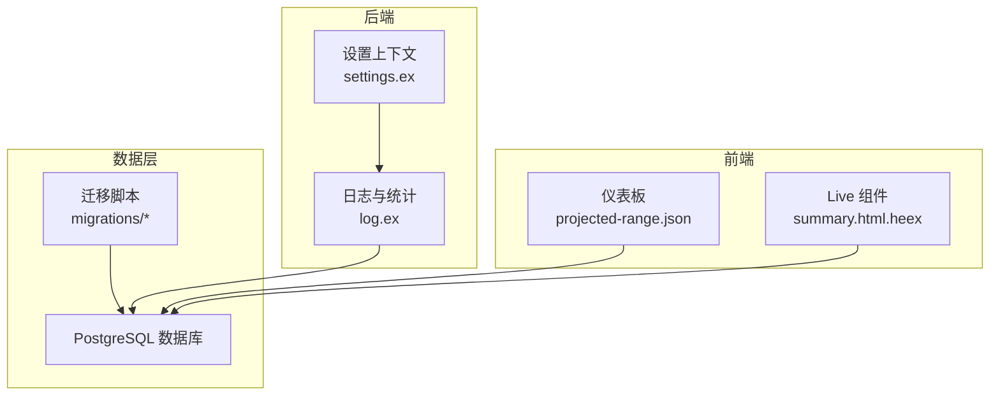
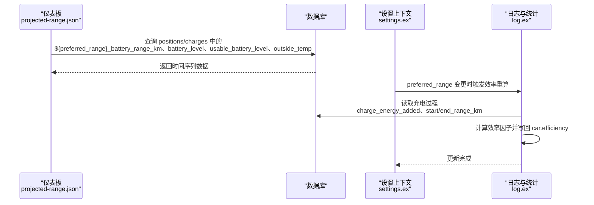
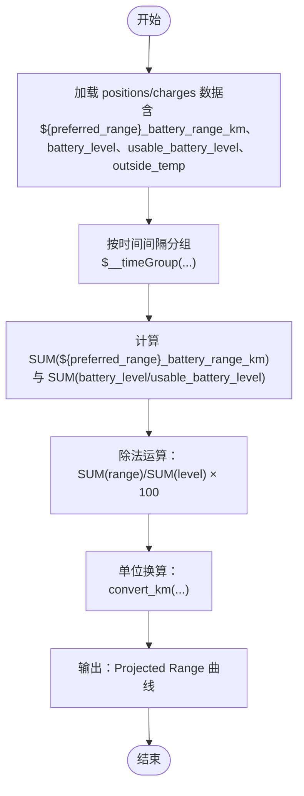
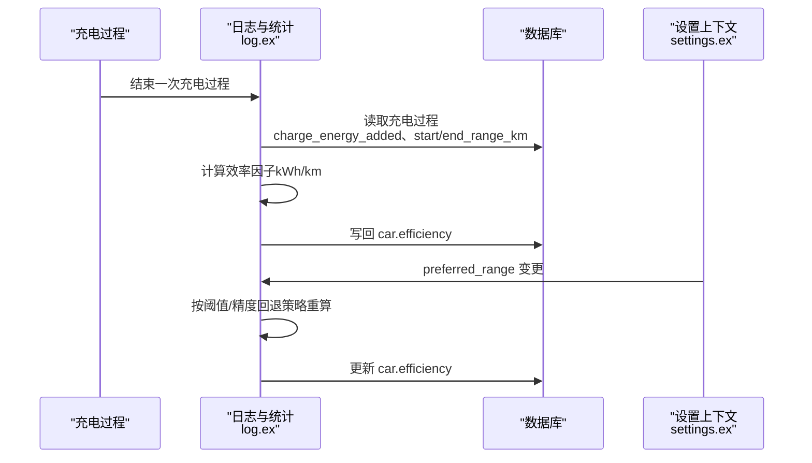
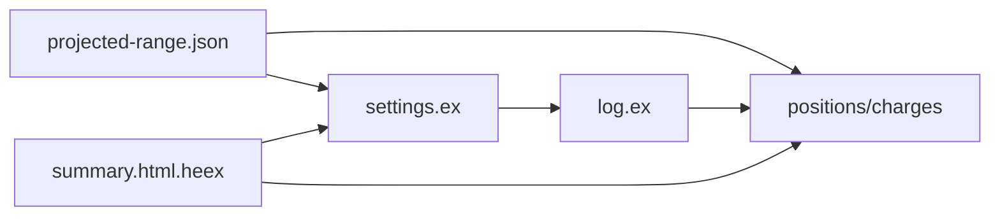

# 续航预测模型

<cite>
**本文引用的文件**
- [projected-range.json](file://grafana/dashboards/projected-range.json)
- [log.ex](file://lib/teslamate/log.ex)
- [settings.ex](file://lib/teslamate/settings.ex)
- [drive-details.json](file://grafana/dashboards/internal/drive-details.json)
- [summary.html.heex](file://lib/teslamate_web/live/car_live/summary.html.heex)
- [20190913175011_add_rated_range_to_drives.exs](file://priv/repo/migrations/20190913175011_add_rated_range_to_drives.exs)
- [20200103073606_add_usable_battery_level.exs](file://priv/repo/migrations/20200103073606_add_usable_battery_level.exs)
- [20190821155748_drop_consumption_columns.exs](file://priv/repo/migrations/20190821155748_drop_consumption_columns.exs)
- [20200320140020_drop_power_avg.exs](file://priv/repo/migrations/20200320140020_drop_power_avg.exs)
- [20190525125700_rename_soc_fields.exs](file://priv/repo/migrations/20190525125700_rename_soc_fields.exs)
- [20191026185642_calculate_charge_energy_used.exs](file://priv/repo/migrations/20191026185642_calculate_charge_energy_used.exs)
- [20191117042320_add_cost_field_to_charges.exs](file://priv/repo/migrations/20191117042320_add_cost_field_to_charges.exs)
- [20191017003836_add_est_total_charge_energy.exs](file://priv/repo/migrations/20191017003836_add_est_total_charge_energy.exs)
- [log_charging_test.exs](file://test/teslamate/log/log_charging_test.exs)
- [settings_test.exs](file://test/teslamate/settings_test.exs)
</cite>

## 目录
1. [简介](#简介)
2. [项目结构](#项目结构)
3. [核心组件](#核心组件)
4. [架构总览](#架构总览)
5. [详细组件分析](#详细组件分析)
6. [依赖关系分析](#依赖关系分析)
7. [性能考量](#性能考量)
8. [故障排查指南](#故障排查指南)
9. [结论](#结论)
10. [附录](#附录)

## 简介
本技术文档聚焦于 TeslaMate 项目中“projected-range.json”仪表板的续航里程预测逻辑，解释系统如何结合车辆当前电池状态（SOC）、历史能耗效率、环境温度以及可用电池电量（usable battery level）等多维信息，动态计算并展示剩余可行驶里程。文档还说明了效率因子的推导与更新机制、数据来源（如 drive_stats 表中的效率数据）、预测结果的刷新策略，并给出不同驾驶场景下的预测准确性分析与参数校准建议。

## 项目结构
围绕续航预测的关键文件与模块如下：
- Grafana 仪表板：projected-range.json 定义了续航预测曲线、电池等级与环境温度的联动视图。
- 后端逻辑：lib/teslamate/log.ex 负责充电过程统计、能耗使用估算与效率因子推导；lib/teslamate/settings.ex 提供全局设置变更触发效率重算。
- 前端展示：lib/teslamate_web/live/car_live/summary.html.heex 展示基于 preferred_range 的续航换算提示。
- 数据库迁移：记录了历史字段演进（如 rated/ideal range 字段、usable_battery_level、SOC 字段命名变化等），为仪表板查询提供数据基础。

图表来源
- [projected-range.json](file://grafana/dashboards/projected-range.json#L180-L240)
- [settings.ex](file://lib/teslamate/settings.ex#L1-L103)
- [log.ex](file://lib/teslamate/log.ex#L492-L534)
- [20190913175011_add_rated_range_to_drives.exs](file://priv/repo/migrations/20190913175011_add_rated_range_to_drives.exs#L1-L29)
- [20200103073606_add_usable_battery_level.exs](file://priv/repo/migrations/20200103073606_add_usable_battery_level.exs#L1-L9)

章节来源
- [projected-range.json](file://grafana/dashboards/projected-range.json#L180-L240)
- [settings.ex](file://lib/teslamate/settings.ex#L1-L103)
- [log.ex](file://lib/teslamate/log.ex#L492-L534)

## 核心组件
- 仪表板投影续航曲线
  - 使用聚合函数对时间段内的理想/额定续航范围与电池等级进行加权，得到“按 100% 计算”的续航里程估计值。
  - 支持两种展示方式：使用可用电池等级（usable_battery_level）与使用总电池等级（battery_level）对比。
- 效率因子推导
  - 基于充电过程的“充电能量增量 / 范围增量”计算效率因子，并持久化到车辆记录，用于后续能耗估算。
- 设置与偏好
  - 全局设置中的 preferred_range 切换会触发效率因子重算，确保预测与用户偏好一致。
- 前端提示
  - Live 组件根据 preferred_range 动态计算“约等于 100% 时的续航”，辅助用户理解当前 SOC 下的理论续航。

章节来源
- [projected-range.json](file://grafana/dashboards/projected-range.json#L180-L240)
- [projected-range.json](file://grafana/dashboards/projected-range.json#L360-L410)
- [log.ex](file://lib/teslamate/log.ex#L632-L675)
- [settings.ex](file://lib/teslamate/settings.ex#L73-L88)
- [summary.html.heex](file://lib/teslamate_web/live/car_live/summary.html.heex#L340-L359)

## 架构总览
下图展示了从数据采集、处理到可视化的端到端流程，以及与效率因子推导的关系。

图表来源
- [projected-range.json](file://grafana/dashboards/projected-range.json#L180-L240)
- [settings.ex](file://lib/teslamate/settings.ex#L73-L88)
- [log.ex](file://lib/teslamate/log.ex#L632-L675)

## 详细组件分析

### 1) 仪表板投影续航计算逻辑
- 数据来源
  - positions 与 charges 表：包含电池等级（battery_level/usable_battery_level）、理想/额定续航范围（${preferred_range}_battery_range_km）、环境温度（outside_temp）等。
  - 通过联合查询将行驶与充电两个阶段的数据统一到同一时间线。
- 计算公式
  - 使用加权平均思想：对时间段内“范围之和 / 电量之和 × 100”得到“每百分点对应的续航长度”，再转换为用户单位（km 或 mi）。
  - 支持两种对比：
    - 使用可用电池等级（usable_battery_level）进行更精确的续航估计；
    - 使用总电池等级（battery_level）作为对照。
- 时间分组与空值处理
  - 使用 $__timeGroup(date, $interval) 对时间进行聚合，避免采样不均导致的偏差。
  - 使用 nullif 避免除零错误，使用 convert_km 进行单位转换。

图表来源
- [projected-range.json](file://grafana/dashboards/projected-range.json#L180-L240)
- [projected-range.json](file://grafana/dashboards/projected-range.json#L360-L410)

章节来源
- [projected-range.json](file://grafana/dashboards/projected-range.json#L180-L240)
- [projected-range.json](file://grafana/dashboards/projected-range.json#L360-L410)

### 2) 效率因子推导与更新机制
- 推导依据
  - 基于充电过程的“充电能量增量（kWh）/ 范围增量（km）”计算效率因子（Wh/km），并保留一定精度。
- 触发条件
  - 在完成一次充电过程后，自动执行效率因子重算。
  - 当全局设置中的 preferred_range 发生切换时，也会触发效率因子重算，确保与当前偏好一致。
- 重算策略
  - 多级阈值与精度回退：先尝试高精度高阈值，若样本不足则降低精度与阈值继续尝试，直至满足条件或穷尽所有选项。
- 写入与使用
  - 将效率因子写入车辆记录，后续在能耗估算、续航预测等场景中被引用。

图表来源
- [log.ex](file://lib/teslamate/log.ex#L492-L534)
- [log.ex](file://lib/teslamate/log.ex#L632-L675)
- [settings.ex](file://lib/teslamate/settings.ex#L73-L88)

章节来源
- [log.ex](file://lib/teslamate/log.ex#L492-L534)
- [log.ex](file://lib/teslamate/log.ex#L632-L675)
- [settings.ex](file://lib/teslamate/settings.ex#L73-L88)

### 3) 数据输入源与字段演进
- 关键字段
  - ${preferred_range}_battery_range_km：当前偏好的续航范围（ideal 或 rated）。
  - battery_level / usable_battery_level：电池总电量与可用电量。
  - outside_temp：环境温度。
  - charge_energy_added：充电能量增量。
  - start/end_range_km：充电前后范围。
- 历史演进
  - 早期字段命名与结构随迁移脚本演进，例如将 trips 改名为 drives、添加 rated/ideal range 字段、引入 usable_battery_level 等。
  - 这些演进保证了仪表板查询能够兼容历史数据。

章节来源
- [20190913175011_add_rated_range_to_drives.exs](file://priv/repo/migrations/20190913175011_add_rated_range_to_drives.exs#L1-L29)
- [20200103073606_add_usable_battery_level.exs](file://priv/repo/migrations/20200103073606_add_usable_battery_level.exs#L1-L9)
- [20190525125700_rename_soc_fields.exs](file://priv/repo/migrations/20190525125700_rename_soc_fields.exs#L1-L8)
- [20190821155748_drop_consumption_columns.exs](file://priv/repo/migrations/20190821155748_drop_consumption_columns.exs#L1-L10)
- [20200320140020_drop_power_avg.exs](file://priv/repo/migrations/20200320140020_drop_power_avg.exs#L1-L9)

### 4) 前端提示与偏好
- Live 组件根据 preferred_range 计算“约等于 100% 时的续航”，帮助用户直观理解当前 SOC 下的理论续航。
- 该提示与仪表板投影续航共同构成用户对剩余里程的综合判断依据。

章节来源
- [summary.html.heex](file://lib/teslamate_web/live/car_live/summary.html.heex#L340-L359)

## 依赖关系分析
- 仪表板依赖数据库中的 positions/charges 表，使用聚合与单位转换函数生成投影续航曲线。
- 效率因子推导依赖充电过程表（charging_processes）与充电明细表（charges），并在设置切换时触发重算。
- 前端 Live 组件依赖全局设置（preferred_range）与当前车辆状态（range 与 SOC）。

图表来源
- [projected-range.json](file://grafana/dashboards/projected-range.json#L180-L240)
- [settings.ex](file://lib/teslamate/settings.ex#L1-L103)
- [log.ex](file://lib/teslamate/log.ex#L632-L675)
- [summary.html.heex](file://lib/teslamate_web/live/car_live/summary.html.heex#L340-L359)

章节来源
- [projected-range.json](file://grafana/dashboards/projected-range.json#L180-L240)
- [settings.ex](file://lib/teslamate/settings.ex#L1-L103)
- [log.ex](file://lib/teslamate/log.ex#L632-L675)
- [summary.html.heex](file://lib/teslamate_web/live/car_live/summary.html.heex#L340-L359)

## 性能考量
- 时间聚合与空值处理
  - 使用 $__timeGroup 对时间进行桶化与填充，减少稀疏采样的影响，提升曲线稳定性。
  - 使用 nullif 避免除零，保障数值稳定。
- 查询复杂度
  - 联合查询 positions 与 charges，涉及多表连接与分组聚合，建议在大数据量场景下关注索引与分区策略。
- 单位转换
  - convert_km 与 convert_celsius 在查询中频繁出现，建议在数据库侧建立必要的转换函数或缓存常用转换结果，减少重复计算。

章节来源
- [projected-range.json](file://grafana/dashboards/projected-range.json#L180-L240)
- [projected-range.json](file://grafana/dashboards/projected-range.json#L360-L410)

## 故障排查指南
- 投影续航曲线为空或异常
  - 检查 positions/charges 中是否存在 ${preferred_range}_battery_range_km 非空且 ideal_battery_range_km 不为空的时间点。
  - 确认 preferred_range 设置是否正确，必要时切换后再观察。
- 效率因子未更新
  - 确认充电过程是否满足“持续时间 > 10 分钟、结束 SOC ≤ 95%、start/end_range_km 非空、charge_energy_added > 0”的条件。
  - 若设置切换后仍未更新，检查 settings.ex 的 on_range_change 是否触发 recalculate_efficiencies。
- 可用电池等级缺失
  - 检查是否已应用迁移脚本添加 usable_battery_level 字段。
- 测试验证
  - 参考测试用例中对效率因子推导的断言，确认在不同数据规模与精度要求下的行为符合预期。

章节来源
- [log.ex](file://lib/teslamate/log.ex#L632-L675)
- [settings.ex](file://lib/teslamate/settings.ex#L73-L88)
- [20200103073606_add_usable_battery_level.exs](file://priv/repo/migrations/20200103073606_add_usable_battery_level.exs#L1-L9)
- [log_charging_test.exs](file://test/teslamate/log/log_charging_test.exs#L607-L735)
- [settings_test.exs](file://test/teslamate/settings_test.exs#L304-L337)

## 结论
本项目通过“加权平均”的方式在仪表板上呈现投影续航，结合效率因子推导与设置偏好，实现了对当前电池状态、历史能耗与环境因素的综合反映。推荐用户：
- 在不同驾驶场景下定期完成充电过程，以提升效率因子的代表性；
- 根据实际驾驶体验调整 preferred_range 与单位偏好；
- 使用“可用电池等级”进行更贴近真实续航的估计；
- 在极端温度或高能耗场景下，结合环境温度与能耗趋势进行修正。

## 附录

### A. 不同驾驶场景下的预测准确性分析
- 城市拥堵与频繁启停
  - 特征：频繁制动回收、空调/座椅加热等负载较高。
  - 影响：实际能耗高于标称，投影续航可能偏高；建议结合能耗趋势与温度进行修正。
- 高速巡航
  - 特征：相对稳定的车速与负载。
  - 影响：能耗更接近标称，预测误差较小；可作为基准场景参考。
- 极寒/极热天气
  - 特征：电池效率下降、热泵/暖风/空调耗电增加。
  - 影响：续航显著降低；建议在仪表板中结合 outside_temp 进行趋势分析，并适当下调预测值。

### B. 参数校准建议
- 校准效率因子
  - 在多种场景下完成至少 3–5 次充电过程，确保样本量与代表性。
  - 如效率因子过低或过高，可在 settings 中切换 preferred_range 后重新触发重算。
- 选择合适的偏好范围
  - ideal_range 更贴近理论值，rated_range 更贴近实际可达成范围；根据个人经验选择更贴近实际的偏好。
- 使用可用电池等级
  - 在存在电池衰减或热管理限制时，优先使用 usable_battery_level 进行续航估计，以获得更保守但更安全的预测。

章节来源
- [projected-range.json](file://grafana/dashboards/projected-range.json#L180-L240)
- [projected-range.json](file://grafana/dashboards/projected-range.json#L360-L410)
- [log.ex](file://lib/teslamate/log.ex#L632-L675)
- [settings.ex](file://lib/teslamate/settings.ex#L73-L88)